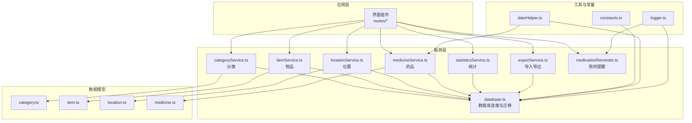
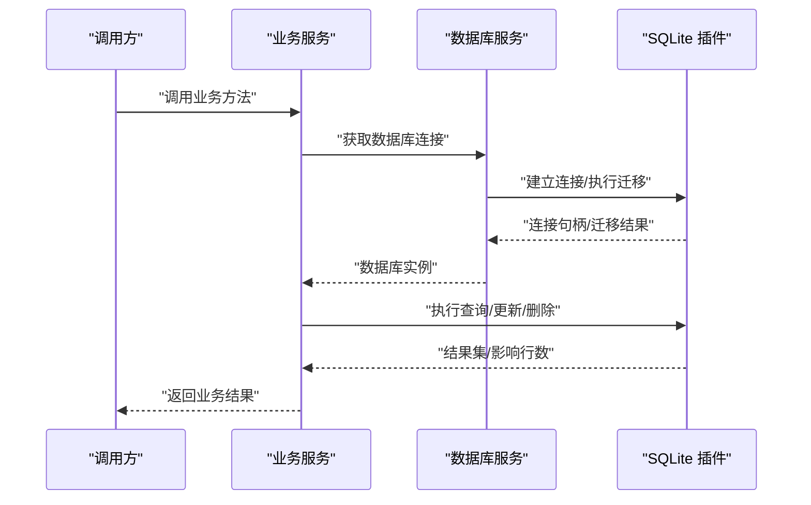
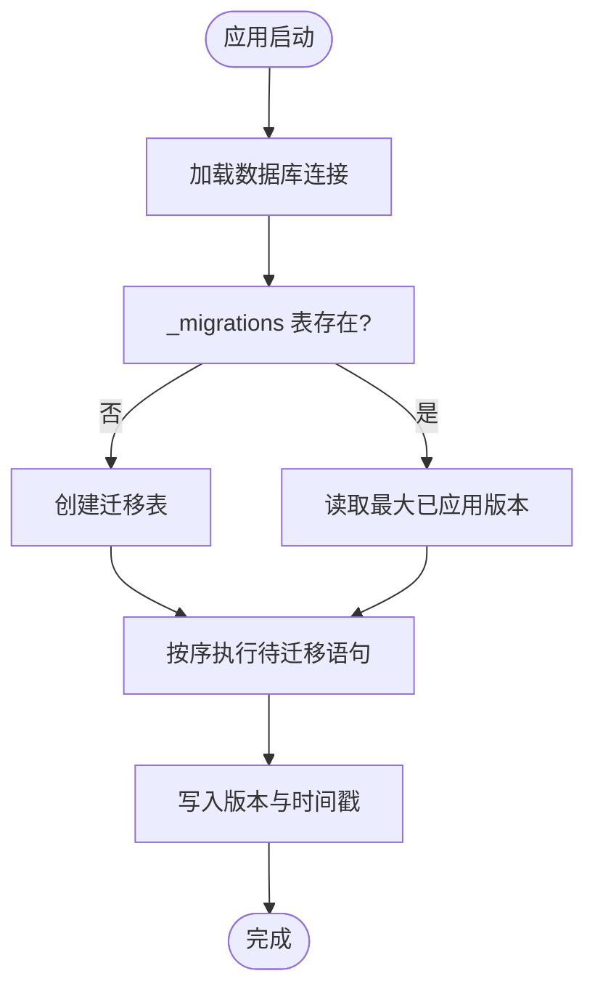
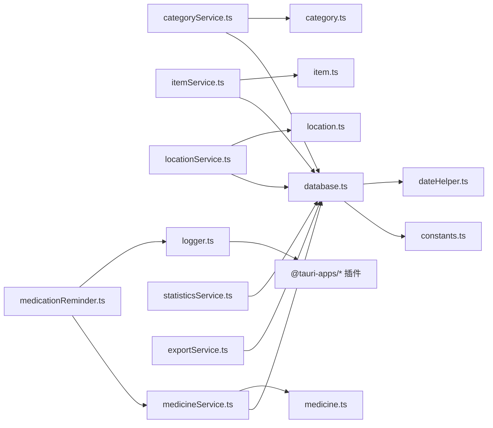

# API 参考

<cite>
**本文引用的文件**
- [src/services/database.ts](file://src/services/database.ts)
- [src/services/categoryService.ts](file://src/services/categoryService.ts)
- [src/services/itemService.ts](file://src/services/itemService.ts)
- [src/services/locationService.ts](file://src/services/locationService.ts)
- [src/services/medicineService.ts](file://src/services/medicineService.ts)
- [src/services/statisticsService.ts](file://src/services/statisticsService.ts)
- [src/services/exportService.ts](file://src/services/exportService.ts)
- [src/services/medicationReminder.ts](file://src/services/medicationReminder.ts)
- [src/types/category.ts](file://src/types/category.ts)
- [src/types/item.ts](file://src/types/item.ts)
- [src/types/location.ts](file://src/types/location.ts)
- [src/types/medicine.ts](file://src/types/medicine.ts)
- [src/utils/constants.ts](file://src/utils/constants.ts)
- [src/utils/dateHelper.ts](file://src/utils/dateHelper.ts)
- [src/utils/logger.ts](file://src/utils/logger.ts)
- [package.json](file://package.json)
</cite>

## 目录
1. [简介](#简介)
2. [项目结构](#项目结构)
3. [核心组件](#核心组件)
4. [架构总览](#架构总览)
5. [详细组件分析](#详细组件分析)
6. [依赖关系分析](#依赖关系分析)
7. [性能考量](#性能考量)
8. [故障排查指南](#故障排查指南)
9. [结论](#结论)
10. [附录](#附录)

## 简介
本文件为 Assetly 的后端 API（以前端服务层形式暴露）提供完整参考文档。内容涵盖：
- 数据库 API：CRUD、查询与迁移机制
- 业务 API：数据校验、权限与业务规则
- 请求/响应示例与错误码说明
- 版本管理、向后兼容与弃用策略
- 客户端集成指南与最佳实践
- 测试方法与性能基准建议

## 项目结构
Assetly 前端采用 React + Tauri 架构，业务逻辑通过服务层封装对本地 SQLite 的访问，并提供统计、导出、提醒等能力。

图表来源
- [src/services/database.ts:1-171](file://src/services/database.ts#L1-L171)
- [src/services/categoryService.ts:1-59](file://src/services/categoryService.ts#L1-L59)
- [src/services/itemService.ts:1-127](file://src/services/itemService.ts#L1-L127)
- [src/services/locationService.ts:1-143](file://src/services/locationService.ts#L1-L143)
- [src/services/medicineService.ts:1-194](file://src/services/medicineService.ts#L1-L194)
- [src/services/statisticsService.ts:1-52](file://src/services/statisticsService.ts#L1-L52)
- [src/services/exportService.ts:1-154](file://src/services/exportService.ts#L1-L154)
- [src/services/medicationReminder.ts:1-132](file://src/services/medicationReminder.ts#L1-L132)
- [src/types/category.ts:1-18](file://src/types/category.ts#L1-L18)
- [src/types/item.ts:1-46](file://src/types/item.ts#L1-L46)
- [src/types/location.ts:1-24](file://src/types/location.ts#L1-L24)
- [src/types/medicine.ts:1-70](file://src/types/medicine.ts#L1-L70)
- [src/utils/constants.ts:1-40](file://src/utils/constants.ts#L1-L40)
- [src/utils/dateHelper.ts:1-52](file://src/utils/dateHelper.ts#L1-L52)
- [src/utils/logger.ts:1-84](file://src/utils/logger.ts#L1-L84)

章节来源
- [src/services/database.ts:1-171](file://src/services/database.ts#L1-L171)
- [package.json:1-43](file://package.json#L1-L43)

## 核心组件
- 数据库服务：负责连接、迁移与事务型操作（通过 SQLite 插件）
- 分类服务：提供分类的增删改查与计数
- 物品服务：支持过滤查询、分页（由调用方控制）、更新与删除
- 位置服务：树形结构位置管理、路径维护与批量删除
- 药品服务：物品扩展、联合查询、到期提醒相关查询
- 统计服务：仪表盘概览、分类分布、月度支出
- 导出服务：JSON/CSV 导出与 JSON 导入
- 用药提醒：基于频率与时间段的通知触发

章节来源
- [src/services/categoryService.ts:1-59](file://src/services/categoryService.ts#L1-L59)
- [src/services/itemService.ts:1-127](file://src/services/itemService.ts#L1-L127)
- [src/services/locationService.ts:1-143](file://src/services/locationService.ts#L1-L143)
- [src/services/medicineService.ts:1-194](file://src/services/medicineService.ts#L1-L194)
- [src/services/statisticsService.ts:1-52](file://src/services/statisticsService.ts#L1-L52)
- [src/services/exportService.ts:1-154](file://src/services/exportService.ts#L1-L154)
- [src/services/medicationReminder.ts:1-132](file://src/services/medicationReminder.ts#L1-L132)

## 架构总览
服务层统一通过数据库服务获取连接并执行 SQL；类型定义确保前后端一致的数据契约；日志与常量辅助调试与配置。

图表来源
- [src/services/database.ts:8-16](file://src/services/database.ts#L8-L16)
- [src/services/categoryService.ts:9-18](file://src/services/categoryService.ts#L9-L18)
- [src/services/itemService.ts:10-44](file://src/services/itemService.ts#L10-L44)
- [src/services/locationService.ts:9-53](file://src/services/locationService.ts#L9-L53)
- [src/services/medicineService.ts:10-37](file://src/services/medicineService.ts#L10-L37)

## 详细组件分析

### 数据库 API
- 连接与初始化
  - 单例模式加载 SQLite 数据库文件
  - 启动时自动运行迁移
- 迁移机制
  - 使用内部版本表记录已应用版本
  - 顺序执行高于当前版本的迁移语句
  - 每次迁移后写入版本与时间戳
- 事务与一致性
  - 服务层使用单连接执行多条语句，保证原子性
  - 删除位置时递归删除后代并重置物品位置
  - 删除物品时级联删除药品扩展

图表来源
- [src/services/database.ts:18-53](file://src/services/database.ts#L18-L53)

章节来源
- [src/services/database.ts:1-171](file://src/services/database.ts#L1-L171)

### 分类 API
- 查询
  - 获取全部分类（按排序字段升序）
  - 按 ID 查询
- 创建
  - 自动生成 UUID
  - 计算排序序号（最大值+1）
  - 写入创建/更新时间
- 更新
  - 支持名称、图标、颜色更新
- 删除
  - 将关联物品的分类置空，再删除分类
- 辅助
  - 统计某分类下的物品数量

章节来源
- [src/services/categoryService.ts:1-59](file://src/services/categoryService.ts#L1-L59)
- [src/types/category.ts:1-18](file://src/types/category.ts#L1-L18)
- [src/utils/constants.ts:4-13](file://src/utils/constants.ts#L4-L13)

### 物品 API
- 查询
  - 支持按分类、位置、状态、关键词过滤
  - 返回物品详情（包含分类名、图标、颜色与位置全路径）
- 创建
  - 自动生成 UUID
  - 写入购买信息、图片、图标、状态、是否药品标记
  - 写入创建/更新时间
- 更新
  - 动态构建字段列表，仅更新传入字段
  - 自动更新更新时间
- 删除
  - 删除物品，药品扩展因外键约束被级联删除

章节来源
- [src/services/itemService.ts:1-127](file://src/services/itemService.ts#L1-L127)
- [src/types/item.ts:1-46](file://src/types/item.ts#L1-L46)

### 位置 API
- 查询
  - 获取全部位置，按层级与排序字段升序
  - 按 ID 查询
- 创建
  - 自动生成 UUID
  - 计算层级与全路径（父路径拼接）
  - 计算同级排序序号（最大值+1）
- 更新
  - 支持名称与图片更新
  - 若父级变更，重新计算全路径并递归更新子节点
- 删除
  - 递归删除所有后代位置
  - 将受影响物品的位置清空，再删除位置

章节来源
- [src/services/locationService.ts:1-143](file://src/services/locationService.ts#L1-L143)
- [src/types/location.ts:1-24](file://src/types/location.ts#L1-L24)

### 药品 API
- 查询
  - 支持按类型、关键词过滤
  - 返回药品与物品的联合信息（含位置全路径）
  - 到期提醒相关查询：指定天数内将过期、正在服用
- 创建
  - 先创建物品，再创建药品扩展
  - 默认分类可从预设“药品保健”中选择
- 更新
  - 分别更新物品与药品字段
  - 布尔值在写入前转换为整数（SQLite 存储限制）

章节来源
- [src/services/medicineService.ts:1-194](file://src/services/medicineService.ts#L1-L194)
- [src/types/medicine.ts:1-70](file://src/types/medicine.ts#L1-L70)

### 统计 API
- 仪表盘统计：物品总数、总价值、药品数量、近 30 天将过期数量
- 分类分布：按分类汇总物品总价值
- 月度支出：最近 N 个月的购买金额

章节来源
- [src/services/statisticsService.ts:1-52](file://src/services/statisticsService.ts#L1-L52)

### 导出 API
- 导出 JSON：包含分类、位置、物品、药品
- 导出 CSV：物品主表与分类、位置连接后的汇总视图
- 导入 JSON：逐项 INSERT OR REPLACE，统计成功/失败与错误明细

章节来源
- [src/services/exportService.ts:1-154](file://src/services/exportService.ts#L1-L154)

### 用药提醒 API
- 触发条件：在允许的时间段内，满足频率与时间段设置
- 频率类型：每日、每隔 N 日、每周（指定星期几）
- 通知：请求权限、发送通知、注册动作类型
- 定时器：每分钟检查一次，避免重复提醒

章节来源
- [src/services/medicationReminder.ts:1-132](file://src/services/medicationReminder.ts#L1-L132)
- [src/utils/dateHelper.ts:1-52](file://src/utils/dateHelper.ts#L1-L52)

## 依赖关系分析
- 服务层依赖数据库服务获取连接
- 类型定义贯穿服务层与 UI 层
- 工具模块提供日期格式化、日志转发与常量配置
- Tauri 插件用于日志、通知、SQL 与文件系统

图表来源
- [src/services/categoryService.ts:1-59](file://src/services/categoryService.ts#L1-L59)
- [src/services/itemService.ts:1-127](file://src/services/itemService.ts#L1-L127)
- [src/services/locationService.ts:1-143](file://src/services/locationService.ts#L1-L143)
- [src/services/medicineService.ts:1-194](file://src/services/medicineService.ts#L1-L194)
- [src/services/statisticsService.ts:1-52](file://src/services/statisticsService.ts#L1-L52)
- [src/services/exportService.ts:1-154](file://src/services/exportService.ts#L1-L154)
- [src/services/medicationReminder.ts:1-132](file://src/services/medicationReminder.ts#L1-L132)
- [src/types/category.ts:1-18](file://src/types/category.ts#L1-L18)
- [src/types/item.ts:1-46](file://src/types/item.ts#L1-L46)
- [src/types/location.ts:1-24](file://src/types/location.ts#L1-L24)
- [src/types/medicine.ts:1-70](file://src/types/medicine.ts#L1-L70)
- [src/utils/constants.ts:1-40](file://src/utils/constants.ts#L1-L40)
- [src/utils/dateHelper.ts:1-52](file://src/utils/dateHelper.ts#L1-L52)
- [src/utils/logger.ts:1-84](file://src/utils/logger.ts#L1-L84)

## 性能考量
- 查询优化
  - 为关键列建立索引（物品分类、位置、状态、药品外键、到期日、位置父子关系）
  - 过滤条件使用参数化查询，避免全表扫描
- 写入优化
  - 批量导入使用“插入或替换”，减少重复写入开销
  - 更新时仅构造变更字段，减少写放大
- 事务与锁
  - 单连接顺序执行多条语句，避免并发冲突
  - 删除位置时先更新物品再删除，降低锁竞争
- 缓存与日志
  - 本地存储用于提醒去重（避免同一分钟重复提醒）
  - 内存日志上限控制，避免内存膨胀

章节来源
- [src/services/database.ts:124-132](file://src/services/database.ts#L124-L132)
- [src/services/exportService.ts:53-153](file://src/services/exportService.ts#L53-L153)
- [src/services/medicationReminder.ts:68-97](file://src/services/medicationReminder.ts#L68-L97)

## 故障排查指南
- 数据库连接失败
  - 检查数据库文件是否存在与可读写
  - 查看迁移执行日志，确认 SQL 语法与版本表完整性
- 迁移失败
  - 关注失败 SQL 片段与错误消息
  - 确认目标字段存在且类型匹配
- 导入失败
  - JSON 解析失败会直接返回错误数组
  - 单条记录失败不影响整体导入进度
- 提醒未触发
  - 检查通知权限是否授予
  - 核对频率类型、时间段与持续日期范围
  - 查看本地存储的上次检查时间，避免过于频繁触发

章节来源
- [src/services/database.ts:38-45](file://src/services/database.ts#L38-L45)
- [src/services/exportService.ts:58-63](file://src/services/exportService.ts#L58-L63)
- [src/services/medicationReminder.ts:55-66](file://src/services/medicationReminder.ts#L55-L66)

## 结论
本 API 以服务层封装 SQLite 访问，提供清晰的 CRUD 与查询接口，配合统计、导出与提醒能力，满足资产管理场景需求。通过迁移机制保障数据库演进，通过类型定义与日志工具提升可维护性与可观测性。

## 附录

### API 版本管理、兼容性与弃用策略
- 版本号
  - 应用版本：参见 [package.json](file://package.json#L4)
- 数据库迁移
  - 通过版本号顺序执行，保持向后兼容
  - 新增列时使用默认值，避免破坏旧数据
- 弃用策略
  - 字段或功能不再使用时，在迁移中移除或注释
  - 保持现有查询与导入导出格式稳定

章节来源
- [src/services/database.ts:142-170](file://src/services/database.ts#L142-L170)
- [package.json](file://package.json#L4)

### 客户端集成指南与最佳实践
- 连接与初始化
  - 在应用启动时确保数据库连接与迁移完成
- 调用流程
  - 优先使用服务层方法，避免直接拼接 SQL
  - 对用户输入进行必要校验（长度、格式），并在服务层补充约束
- 错误处理
  - 捕获服务层抛出的异常，提示具体错误原因
  - 对导入结果进行统计反馈（成功/失败/错误列表）
- 性能建议
  - 大量导入时分批处理，避免阻塞主线程
  - 合理使用过滤参数，减少不必要的数据传输

章节来源
- [src/services/exportService.ts:53-153](file://src/services/exportService.ts#L53-L153)
- [src/services/medicationReminder.ts:102-131](file://src/services/medicationReminder.ts#L102-L131)

### API 方法清单与契约

- 数据库
  - getDb(): Promise<Database>
  - 迁移：自动执行，无需手动调用

- 分类
  - getAllCategories(): Promise<Category[]>
  - getCategoryById(id: string): Promise<Category | null>
  - createCategory(data: CategoryFormData): Promise<Category>
  - updateCategory(id: string, data: CategoryFormData): Promise<void>
  - deleteCategory(id: string): Promise<void>
  - getCategoryItemCount(id: string): Promise<number>

- 物品
  - getAllItems(filter?): Promise<ItemWithDetails[]>
  - getItemById(id: string): Promise<ItemWithDetails | null>
  - createItem(data: ItemFormData): Promise<Item>
  - updateItem(id: string, data: Partial<ItemFormData>): Promise<void>
  - deleteItem(id: string): Promise<void>

- 位置
  - getAllLocations(): Promise<Location[]>
  - getLocationById(id: string): Promise<Location | null>
  - createLocation(data: LocationFormData): Promise<Location>
  - updateLocation(id: string, data: Partial<LocationFormData>): Promise<void>
  - deleteLocation(id: string): Promise<void>
  - buildLocationTree(locations: Location[]): LocationTreeNode[]

- 药品
  - getAllMedicines(filter?): Promise<MedicineWithItem[]>
  - getMedicineByItemId(itemId: string): Promise<MedicineWithItem | null>
  - createMedicine(data: MedicineFormData): Promise<{ itemId: string; medicineId: string }>
  - updateMedicine(itemId: string, data: Partial<MedicineFormData>): Promise<void>
  - getExpiringMedicines(withinDays: number): Promise<MedicineWithItem[]>
  - getTakingMedicines(): Promise<MedicineWithItem[]>

- 统计
  - getDashboardStats(): Promise<DashboardStats>
  - getCategoryDistribution(): Promise<CategoryDistribution[]>
  - getMonthlySpending(months?: number): Promise<MonthlySpending[]>

- 导出
  - exportToJSON(): Promise<string>
  - exportToCSV(): Promise<string>
  - importFromJSON(jsonStr: string): Promise<{ success: number; failed: number; errors: string[] }>

- 用药提醒
  - checkAndNotify(): Promise<void>
  - startMedicationReminder(): () => void

章节来源
- [src/services/categoryService.ts:9-59](file://src/services/categoryService.ts#L9-L59)
- [src/services/itemService.ts:10-127](file://src/services/itemService.ts#L10-L127)
- [src/services/locationService.ts:9-143](file://src/services/locationService.ts#L9-L143)
- [src/services/medicineService.ts:10-194](file://src/services/medicineService.ts#L10-L194)
- [src/services/statisticsService.ts:4-52](file://src/services/statisticsService.ts#L4-L52)
- [src/services/exportService.ts:4-154](file://src/services/exportService.ts#L4-L154)
- [src/services/medicationReminder.ts:53-131](file://src/services/medicationReminder.ts#L53-L131)

### 请求/响应示例与错误码说明
- 成功响应
  - CRUD 返回新建对象或空值（不存在时）
  - 查询返回数组或聚合值
- 错误处理
  - 导入：返回 { success, failed, errors }，errors 包含逐条失败原因
  - 迁移：SQL 执行失败时抛出异常，包含截断后的 SQL 片段与错误信息
  - 提醒：权限未授予时跳过检查并记录告警
- 错误码
  - 400：请求参数无效（如 JSON 格式错误）
  - 500：数据库执行失败、权限拒绝等

章节来源
- [src/services/exportService.ts:53-153](file://src/services/exportService.ts#L53-L153)
- [src/services/database.ts:38-45](file://src/services/database.ts#L38-L45)
- [src/services/medicationReminder.ts:55-66](file://src/services/medicationReminder.ts#L55-L66)

### 测试方法与性能基准
- 单元测试
  - 针对每个服务方法编写测试用例，覆盖正常路径与边界条件
  - 使用内存数据库或临时文件进行隔离测试
- 集成测试
  - 覆盖导入导出流程，验证数据一致性
  - 验证迁移脚本在新旧版本之间的兼容性
- 性能基准
  - 大批量导入/导出的吞吐量与延迟
  - 查询过滤条件下的响应时间
  - 用药提醒触发频率与通知送达率

[本节为通用指导，不直接分析具体文件]