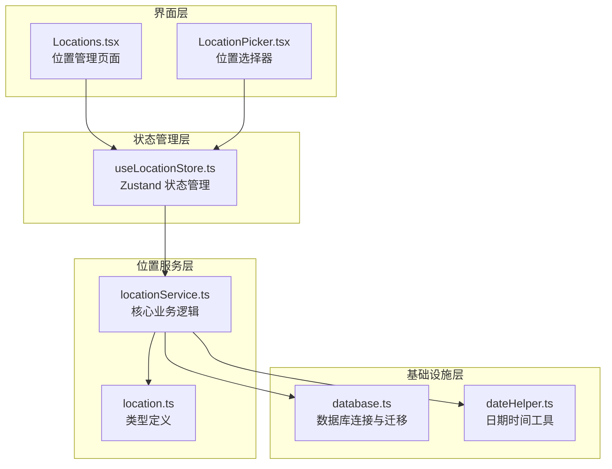
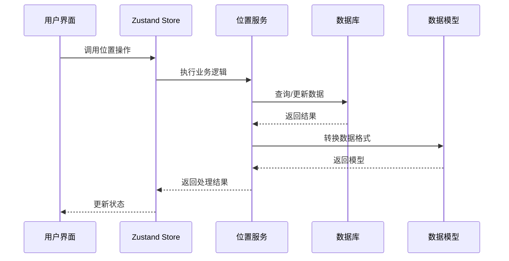
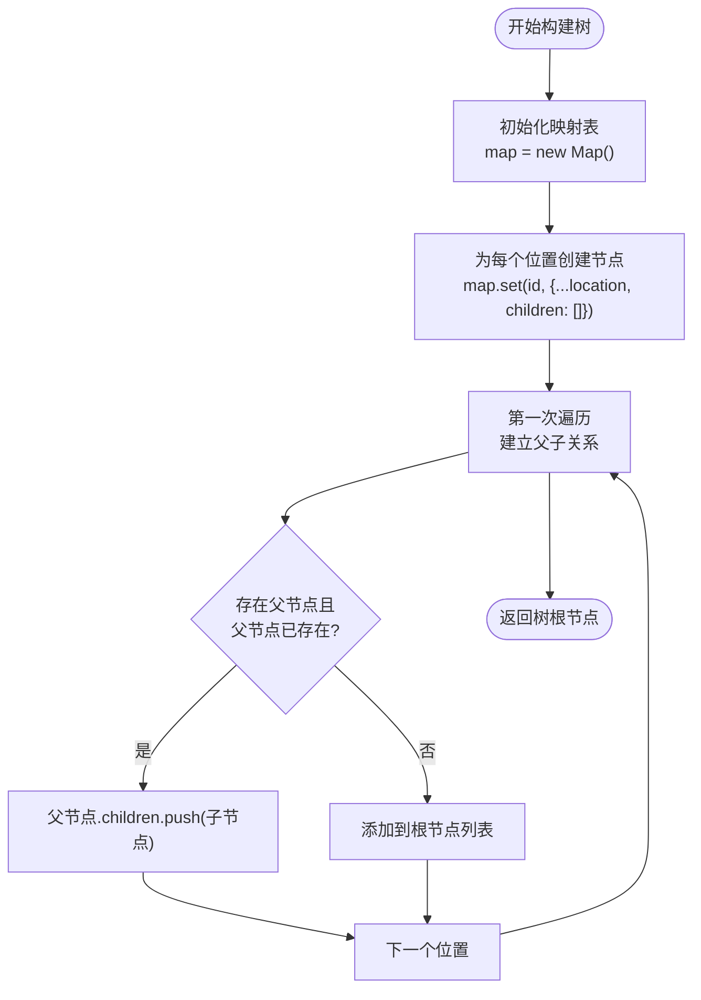
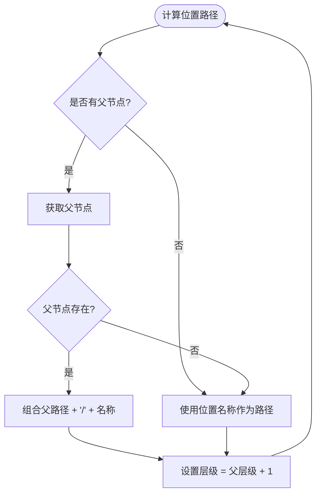
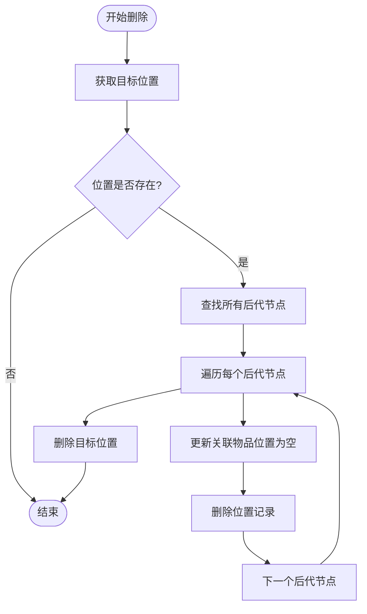
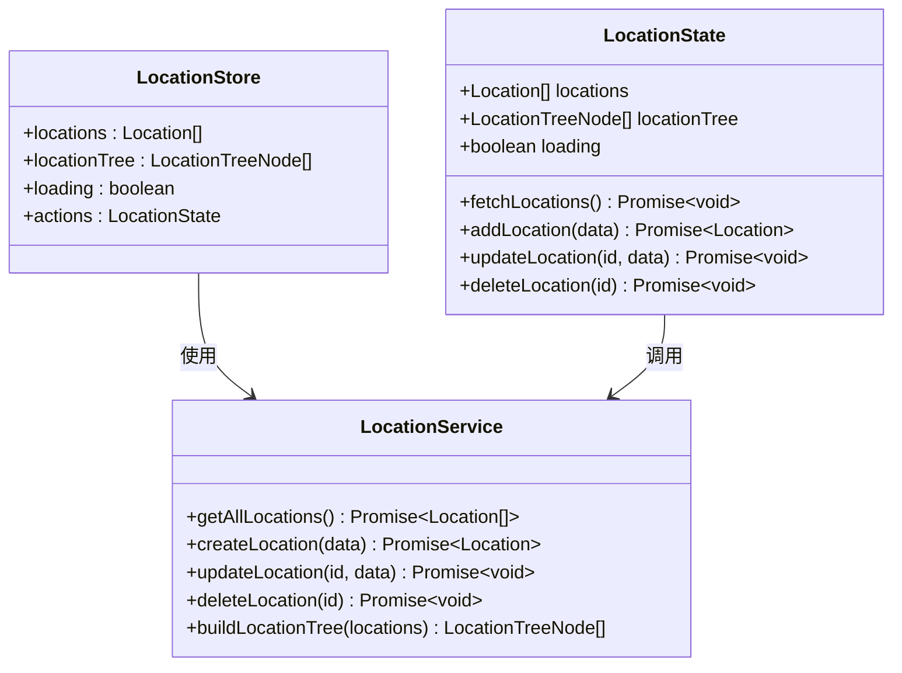
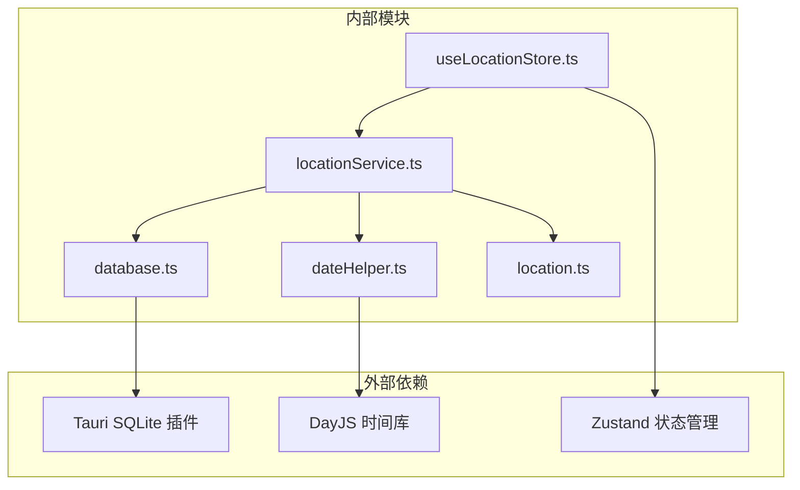
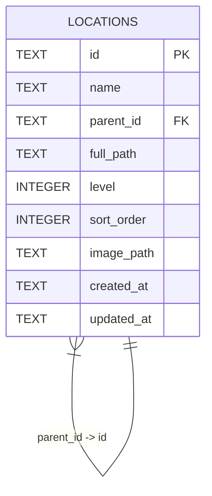

# 位置服务 API

<cite>
**本文档引用的文件**
- [locationService.ts](file://src/services/locationService.ts)
- [location.ts](file://src/types/location.ts)
- [useLocationStore.ts](file://src/stores/useLocationStore.ts)
- [Locations.tsx](file://src/routes/Locations.tsx)
- [LocationPicker.tsx](file://src/components/items/LocationPicker.tsx)
- [database.ts](file://src/services/database.ts)
- [dateHelper.ts](file://src/utils/dateHelper.ts)
</cite>

## 目录
1. [简介](#简介)
2. [项目结构](#项目结构)
3. [核心组件](#核心组件)
4. [架构概览](#架构概览)
5. [详细组件分析](#详细组件分析)
6. [依赖关系分析](#依赖关系分析)
7. [性能考虑](#性能考虑)
8. [故障排除指南](#故障排除指南)
9. [结论](#结论)

## 简介

Assetly 的位置服务 API 提供了完整的资产位置管理系统，支持树形结构管理、父子关系维护和路径计算。该系统采用 SQLite 数据库存储，通过自引用表结构实现层次化位置组织，支持位置的增删改查操作以及级联删除时的数据一致性保证。

## 项目结构

位置服务相关的文件组织结构如下：

**图表来源**
- [locationService.ts:1-143](file://src/services/locationService.ts#L1-L143)
- [useLocationStore.ts:1-43](file://src/stores/useLocationStore.ts#L1-L43)
- [database.ts:1-171](file://src/services/database.ts#L1-L171)

**章节来源**
- [locationService.ts:1-143](file://src/services/locationService.ts#L1-L143)
- [useLocationStore.ts:1-43](file://src/stores/useLocationStore.ts#L1-L43)
- [database.ts:1-171](file://src/services/database.ts#L1-L171)

## 核心组件

### 数据模型

位置服务的核心数据模型包括以下关键字段：

| 字段名 | 类型 | 描述 | 约束 |
|--------|------|------|------|
| id | string | 唯一标识符 | 主键 |
| name | string | 位置名称 | 非空 |
| parent_id | string \| null | 父位置 ID | 外键引用自身 |
| full_path | string | 完整路径 | 默认空字符串 |
| level | number | 层级深度 | 默认 0 |
| sort_order | number | 排序顺序 | 默认 0 |
| image_path | string | 图片路径 | 默认空字符串 |
| created_at | string | 创建时间 | 非空 |
| updated_at | string | 更新时间 | 非空 |

### 服务接口

位置服务提供以下核心接口：

1. **createLocation()** - 创建新位置
2. **getLocationById()** - 根据 ID 获取位置
3. **getAllLocations()** - 获取所有位置（按层级和排序）
4. **updateLocation()** - 更新位置信息
5. **deleteLocation()** - 删除位置（级联删除）

**章节来源**
- [location.ts:3-23](file://src/types/location.ts#L3-L23)
- [locationService.ts:9-142](file://src/services/locationService.ts#L9-L142)

## 架构概览

位置服务采用分层架构设计，确保关注点分离和可维护性：

**图表来源**
- [useLocationStore.ts:15-42](file://src/stores/useLocationStore.ts#L15-L42)
- [locationService.ts:1-143](file://src/services/locationService.ts#L1-L143)

## 详细组件分析

### 位置树构建算法

位置树的构建采用哈希映射和单次遍历算法：

**图表来源**
- [locationService.ts:124-142](file://src/services/locationService.ts#L124-L142)

### 路径计算算法

位置路径采用递归计算方式，确保路径的完整性和一致性：

**图表来源**
- [locationService.ts:20-53](file://src/services/locationService.ts#L20-L53)

### 级联删除算法

删除位置时采用深度优先搜索，确保所有后代节点被正确处理：

**图表来源**
- [locationService.ts:94-122](file://src/services/locationService.ts#L94-L122)

### 状态管理模式

位置服务采用 Zustand 进行状态管理，提供响应式的数据流：

**图表来源**
- [useLocationStore.ts:5-42](file://src/stores/useLocationStore.ts#L5-L42)
- [locationService.ts:124-142](file://src/services/locationService.ts#L124-L142)

**章节来源**
- [useLocationStore.ts:15-42](file://src/stores/useLocationStore.ts#L15-L42)
- [locationService.ts:124-142](file://src/services/locationService.ts#L124-L142)

## 依赖关系分析

位置服务的依赖关系清晰明确，遵循单一职责原则：

**图表来源**
- [locationService.ts:1-3](file://src/services/locationService.ts#L1-L3)
- [database.ts:1-4](file://src/services/database.ts#L1-L4)
- [dateHelper.ts:1-2](file://src/utils/dateHelper.ts#L1-L2)
- [useLocationStore.ts:1-3](file://src/stores/useLocationStore.ts#L1-L3)

### 数据库模式

位置表采用自引用的树形结构设计：

**图表来源**
- [database.ts:76-87](file://src/services/database.ts#L76-L87)

**章节来源**
- [locationService.ts:1-143](file://src/services/locationService.ts#L1-L143)
- [database.ts:76-87](file://src/services/database.ts#L76-L87)

## 性能考虑

### 查询优化策略

1. **索引设计**：位置表包含 `parent_id` 索引，优化父子关系查询
2. **排序优化**：按 `level` 和 `sort_order` 排序，减少客户端处理开销
3. **批量操作**：树构建使用哈希映射，时间复杂度 O(n)

### 缓存机制

位置服务采用多层缓存策略：

1. **数据库连接缓存**：单例模式保持数据库连接
2. **内存缓存**：Zustand store 缓存位置数据和树结构
3. **自动刷新**：每次 CRUD 操作后重新获取最新数据

### 异步处理

- 所有数据库操作都是异步的
- 使用 Promise 链式调用确保操作顺序
- 错误处理通过 try-catch 和异常传播

## 故障排除指南

### 常见问题及解决方案

1. **位置路径错误**
   - 检查父节点是否存在
   - 验证 `full_path` 字段更新是否正确
   - 确认递归更新子节点路径

2. **删除操作失败**
   - 确认级联删除逻辑正确执行
   - 检查物品表中的位置关联更新
   - 验证数据库事务完整性

3. **树结构显示异常**
   - 检查 `buildLocationTree` 函数的映射关系
   - 验证 `parent_id` 字段的正确性
   - 确认排序字段 `sort_order` 的值

**章节来源**
- [locationService.ts:75-92](file://src/services/locationService.ts#L75-L92)
- [locationService.ts:94-122](file://src/services/locationService.ts#L94-L122)

## 结论

Assetly 的位置服务 API 提供了一个完整、高效且易于使用的树形位置管理系统。通过精心设计的数据模型、优化的算法和清晰的架构分离，该系统能够满足各种复杂的资产管理需求。

主要优势包括：
- **完整的 CRUD 支持**：提供所有必要的位置操作接口
- **智能路径管理**：自动维护位置的完整路径和层级关系
- **数据一致性保证**：通过级联删除确保数据完整性
- **高性能设计**：优化的查询和缓存策略
- **用户友好界面**：直观的树形展示和交互体验

该系统为 Assetly 的资产管理提供了坚实的基础，支持从简单到复杂的各种使用场景。