# 分类服务 API

<cite>
**本文档引用的文件**
- [categoryService.ts](file://src/services/categoryService.ts)
- [category.ts](file://src/types/category.ts)
- [useCategoryStore.ts](file://src/stores/useCategoryStore.ts)
- [Categories.tsx](file://src/routes/Categories.tsx)
- [database.ts](file://src/services/database.ts)
- [constants.ts](file://src/utils/constants.ts)
- [dateHelper.ts](file://src/utils/dateHelper.ts)
</cite>

## 目录
1. [简介](#简介)
2. [项目结构](#项目结构)
3. [核心组件](#核心组件)
4. [架构概览](#架构概览)
5. [详细组件分析](#详细组件分析)
6. [依赖关系分析](#依赖关系分析)
7. [性能考虑](#性能考虑)
8. [故障排除指南](#故障排除指南)
9. [结论](#结论)

## 简介

Assetly 是一个资产管理系统，提供分类服务 API 来管理物品分类。该系统支持完整的 CRUD 操作、图标和颜色配置、排序管理以及默认分类初始化等功能。分类服务采用 SQLite 数据库存储，通过 Tauri 插件进行数据库操作。

## 项目结构

分类服务位于前端应用的 `src/services/` 目录下，主要包含以下关键文件：

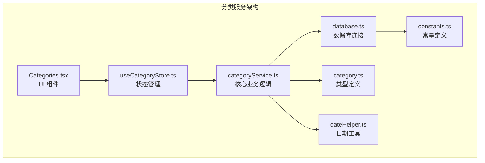

**图表来源**
- [categoryService.ts:1-59](file://src/services/categoryService.ts#L1-L59)
- [category.ts:1-18](file://src/types/category.ts#L1-L18)
- [useCategoryStore.ts:1-44](file://src/stores/useCategoryStore.ts#L1-L44)
- [Categories.tsx:1-184](file://src/routes/Categories.tsx#L1-L184)

**章节来源**
- [categoryService.ts:1-59](file://src/services/categoryService.ts#L1-L59)
- [category.ts:1-18](file://src/types/category.ts#L1-L18)
- [useCategoryStore.ts:1-44](file://src/stores/useCategoryStore.ts#L1-L44)
- [Categories.tsx:1-184](file://src/routes/Categories.tsx#L1-L184)

## 核心组件

### 数据模型

分类服务使用标准化的数据模型来确保类型安全和数据完整性：

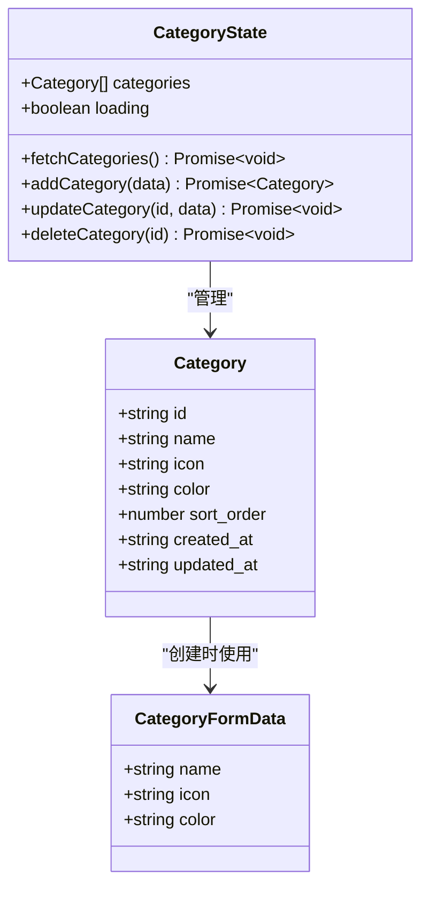

**图表来源**
- [category.ts:3-17](file://src/types/category.ts#L3-L17)
- [useCategoryStore.ts:5-12](file://src/stores/useCategoryStore.ts#L5-L12)

### 默认分类配置

系统内置了 8 个默认分类，每个分类都包含名称、图标和颜色配置：

| 分类名称 | 图标 | 颜色 | 排序 |
|---------|------|------|------|
| 电子产品 | Smartphone | #3B82F6 | 0 |
| 家具家电 | Sofa | #8B5CF6 | 1 |
| 厨房用品 | CookingPot | #F97316 | 2 |
| 衣物鞋包 | Shirt | #EC4899 | 3 |
| 书籍文具 | BookOpen | #06B6D4 | 4 |
| 药品保健 | Pill | #22C55E | 5 |
| 工具耗材 | Wrench | #78716C | 6 |
| 其他 | Package | #6B7280 | 7 |

**章节来源**
- [constants.ts:4-13](file://src/utils/constants.ts#L4-L13)

## 架构概览

分类服务采用分层架构设计，确保关注点分离和可维护性：

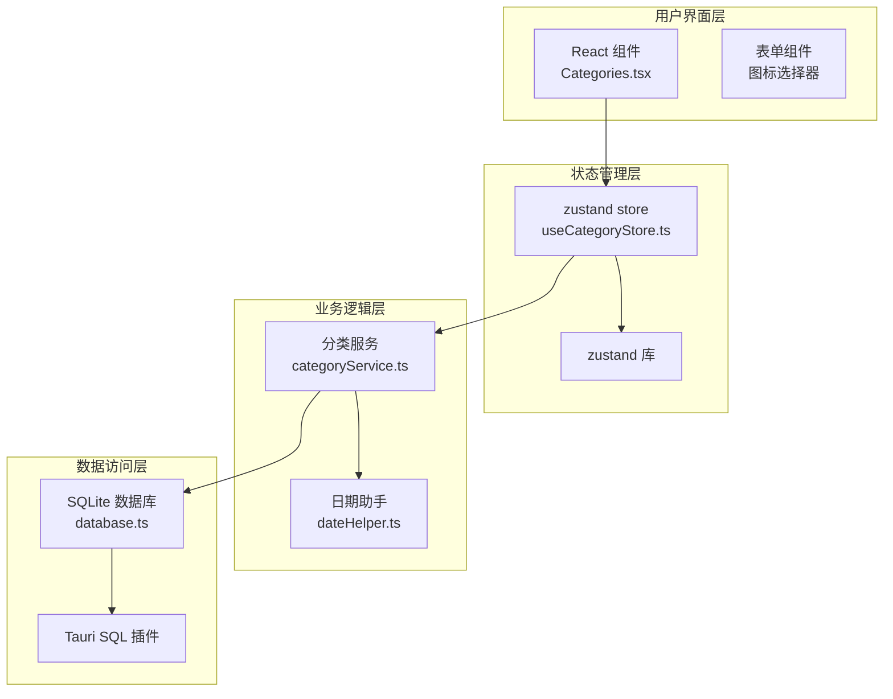

**图表来源**
- [Categories.tsx:11-184](file://src/routes/Categories.tsx#L11-L184)
- [useCategoryStore.ts:14-43](file://src/stores/useCategoryStore.ts#L14-L43)
- [categoryService.ts:1-59](file://src/services/categoryService.ts#L1-L59)
- [database.ts:8-16](file://src/services/database.ts#L8-L16)

## 详细组件分析

### 分类服务 API

#### 核心 CRUD 方法

##### 获取所有分类

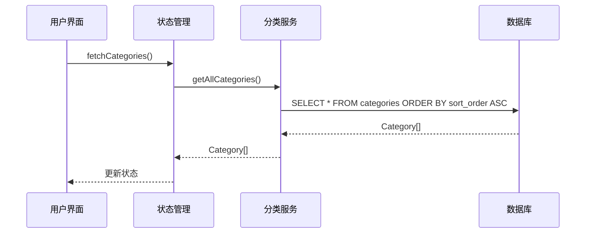

**图表来源**
- [categoryService.ts:9-12](file://src/services/categoryService.ts#L9-L12)
- [useCategoryStore.ts:18-22](file://src/stores/useCategoryStore.ts#L18-L22)

##### 创建分类

创建新分类时，系统会自动生成唯一 ID 并分配排序顺序：

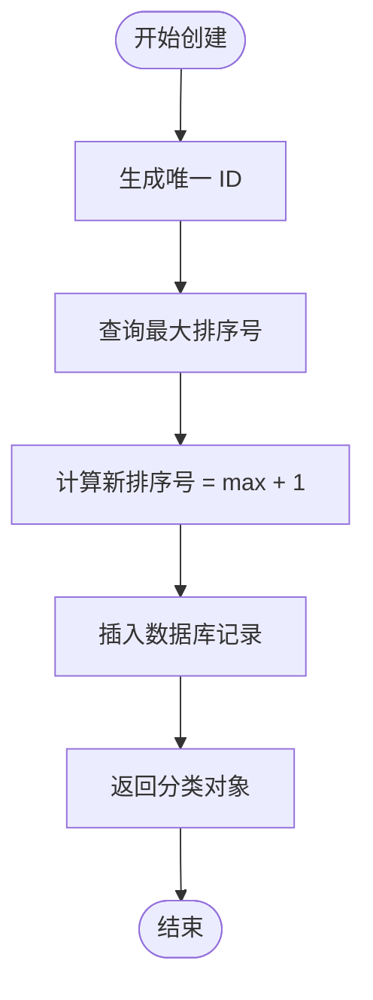

**图表来源**
- [categoryService.ts:20-34](file://src/services/categoryService.ts#L20-L34)

##### 更新分类

更新操作支持部分字段更新，自动更新时间戳：

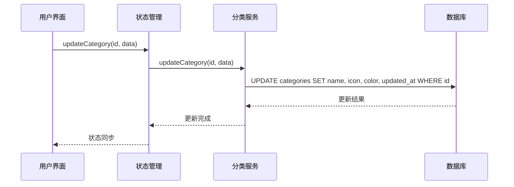

**图表来源**
- [categoryService.ts:36-42](file://src/services/categoryService.ts#L36-L42)
- [useCategoryStore.ts:30-37](file://src/stores/useCategoryStore.ts#L30-L37)

##### 删除分类

删除操作包含级联处理，确保数据完整性：

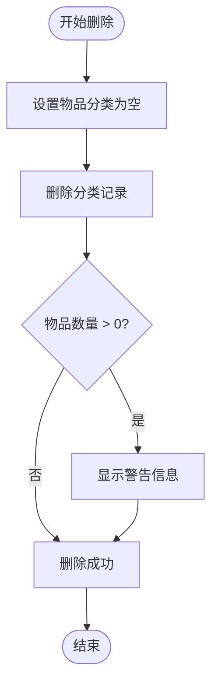

**图表来源**
- [categoryService.ts:44-49](file://src/services/categoryService.ts#L44-L49)

#### 图标和颜色配置

系统提供丰富的图标和颜色选项：

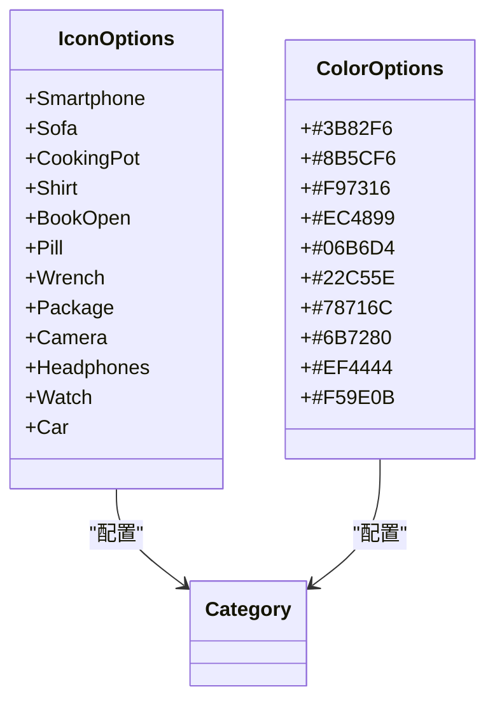

**图表来源**
- [Categories.tsx:8-9](file://src/routes/Categories.tsx#L8-L9)
- [constants.ts:4-13](file://src/utils/constants.ts#L4-L13)

**章节来源**
- [categoryService.ts:9-59](file://src/services/categoryService.ts#L9-L59)
- [Categories.tsx:8-184](file://src/routes/Categories.tsx#L8-L184)

### 状态管理

使用 zustand 进行状态管理，提供响应式数据流：

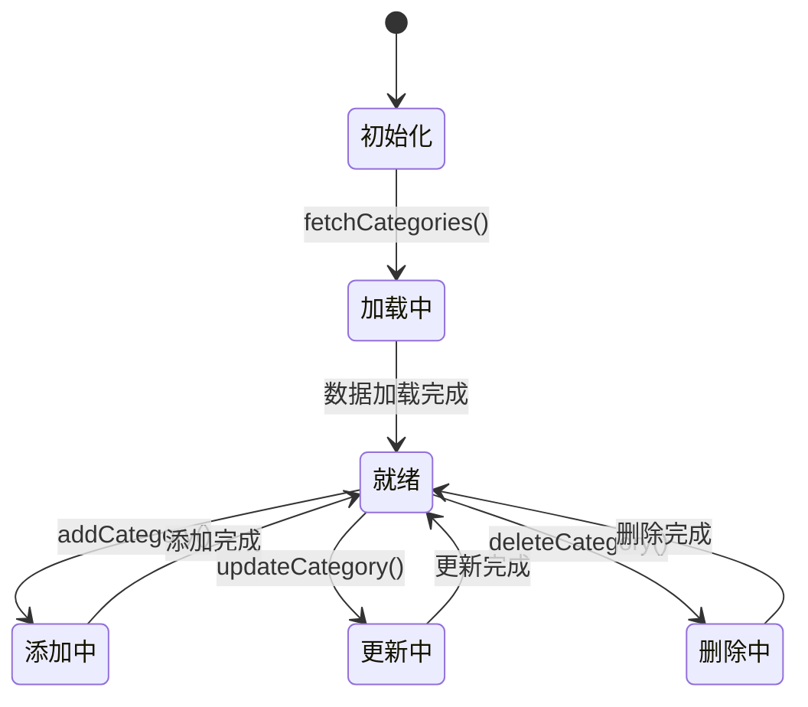

**图表来源**
- [useCategoryStore.ts:14-43](file://src/stores/useCategoryStore.ts#L14-L43)

**章节来源**
- [useCategoryStore.ts:14-43](file://src/stores/useCategoryStore.ts#L14-L43)

### 数据库架构

分类数据存储在 SQLite 数据库中，采用规范化设计：

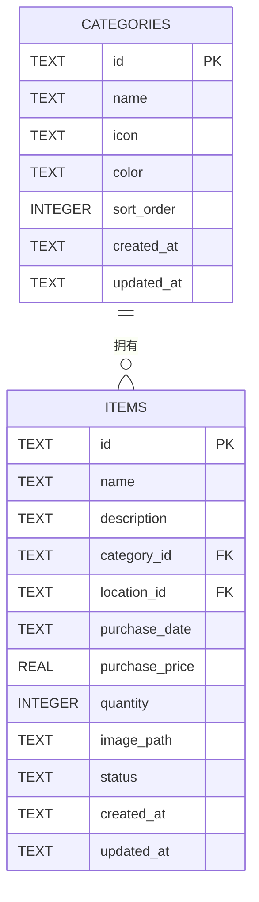

**图表来源**
- [database.ts:67-103](file://src/services/database.ts#L67-L103)

**章节来源**
- [database.ts:67-141](file://src/services/database.ts#L67-L141)

## 依赖关系分析

### 外部依赖

分类服务依赖以下关键外部库：

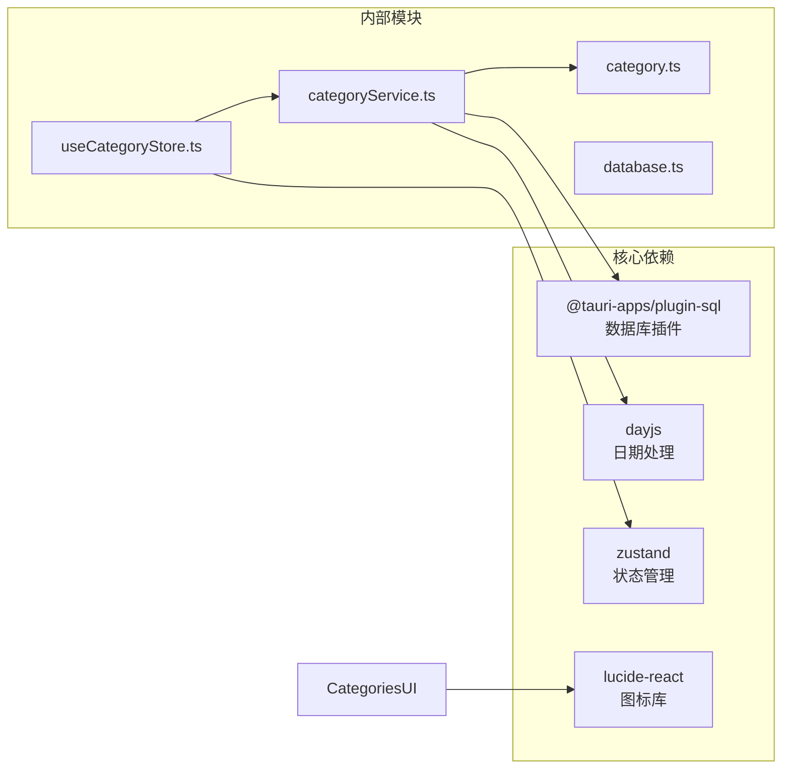

**图表来源**
- [categoryService.ts:1-3](file://src/services/categoryService.ts#L1-L3)
- [useCategoryStore.ts:1-3](file://src/stores/useCategoryStore.ts#L1-L3)

### 内部依赖关系

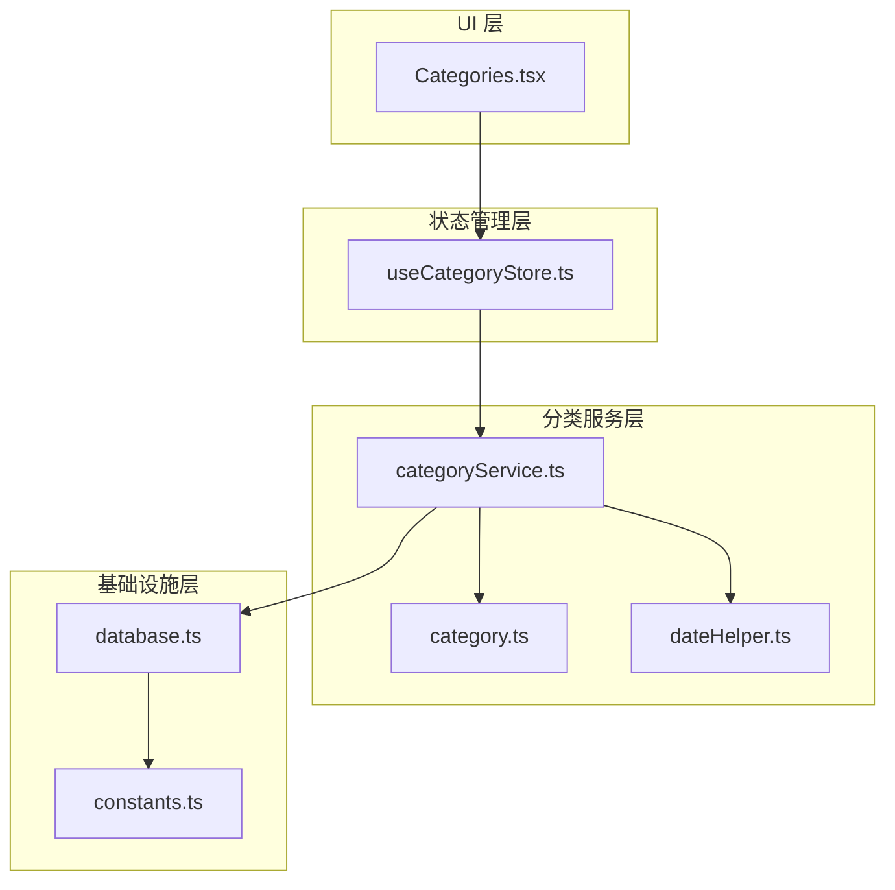

**图表来源**
- [categoryService.ts:1-59](file://src/services/categoryService.ts#L1-L59)
- [useCategoryStore.ts:1-44](file://src/stores/useCategoryStore.ts#L1-L44)
- [Categories.tsx:1-184](file://src/routes/Categories.tsx#L1-L184)

**章节来源**
- [categoryService.ts:1-59](file://src/services/categoryService.ts#L1-L59)
- [useCategoryStore.ts:1-44](file://src/stores/useCategoryStore.ts#L1-L44)
- [Categories.tsx:1-184](file://src/routes/Categories.tsx#L1-L184)

## 性能考虑

### 缓存策略

当前实现采用以下缓存策略：

1. **数据库连接缓存**: 单例模式确保数据库连接复用
2. **内存状态缓存**: zustand store 缓存分类列表
3. **UI 组件缓存**: React 组件基于状态变化重新渲染

### 性能优化建议

1. **批量操作**: 对于大量分类操作，考虑使用事务处理
2. **索引优化**: 当前已有 `idx_items_category` 索引，可考虑添加更多复合索引
3. **懒加载**: 对于大型分类列表，实现虚拟滚动
4. **防抖处理**: 对频繁的搜索和过滤操作添加防抖

### 数据完整性保证

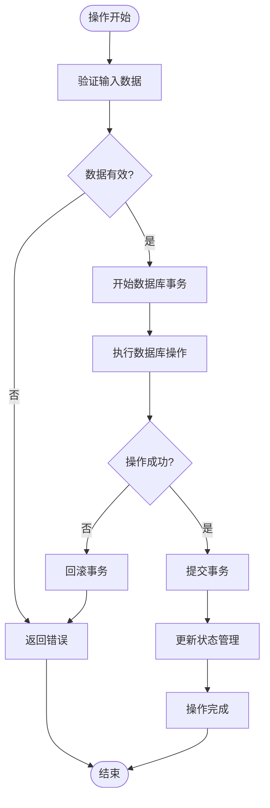

**图表来源**
- [categoryService.ts:20-49](file://src/services/categoryService.ts#L20-L49)
- [database.ts:18-53](file://src/services/database.ts#L18-L53)

## 故障排除指南

### 常见问题及解决方案

#### 数据库连接问题

**症状**: 应用启动时数据库连接失败
**原因**: SQLite 文件损坏或权限问题
**解决方案**: 
1. 检查数据库文件是否存在
2. 验证应用具有文件读写权限
3. 重新初始化数据库

#### 分类删除异常

**症状**: 删除分类时报错或数据不一致
**原因**: 外键约束或事务未正确提交
**解决方案**:
1. 确保级联更新正确执行
2. 检查事务边界
3. 验证数据一致性

#### 性能问题

**症状**: 分类列表加载缓慢
**原因**: 数据量过大或缺少索引
**解决方案**:
1. 实现分页加载
2. 优化数据库查询
3. 添加适当的索引

**章节来源**
- [database.ts:8-16](file://src/services/database.ts#L8-L16)
- [categoryService.ts:44-49](file://src/services/categoryService.ts#L44-L49)

## 结论

Assetly 的分类服务 API 提供了一个完整、可扩展的分类管理解决方案。系统采用现代化的架构设计，结合了类型安全、状态管理和数据库持久化等最佳实践。

### 主要优势

1. **类型安全**: 使用 TypeScript 确保编译时类型检查
2. **响应式状态**: 基于 zustand 的高效状态管理
3. **数据完整性**: 通过数据库约束和事务保证数据一致性
4. **可扩展性**: 模块化设计便于功能扩展
5. **用户体验**: 直观的 UI 和丰富的配置选项

### 改进建议

1. **排序管理**: 当前仅支持基本排序，可考虑实现拖拽排序
2. **搜索功能**: 添加分类搜索和过滤功能
3. **批量操作**: 支持批量分类管理操作
4. **导入导出**: 实现分类数据的导入导出功能
5. **权限控制**: 添加分类级别的权限管理

该分类服务为 Assetly 应用提供了坚实的基础，支持资产管理的核心需求，并为未来的功能扩展奠定了良好的技术基础。