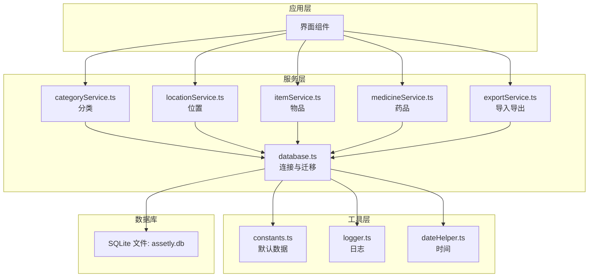
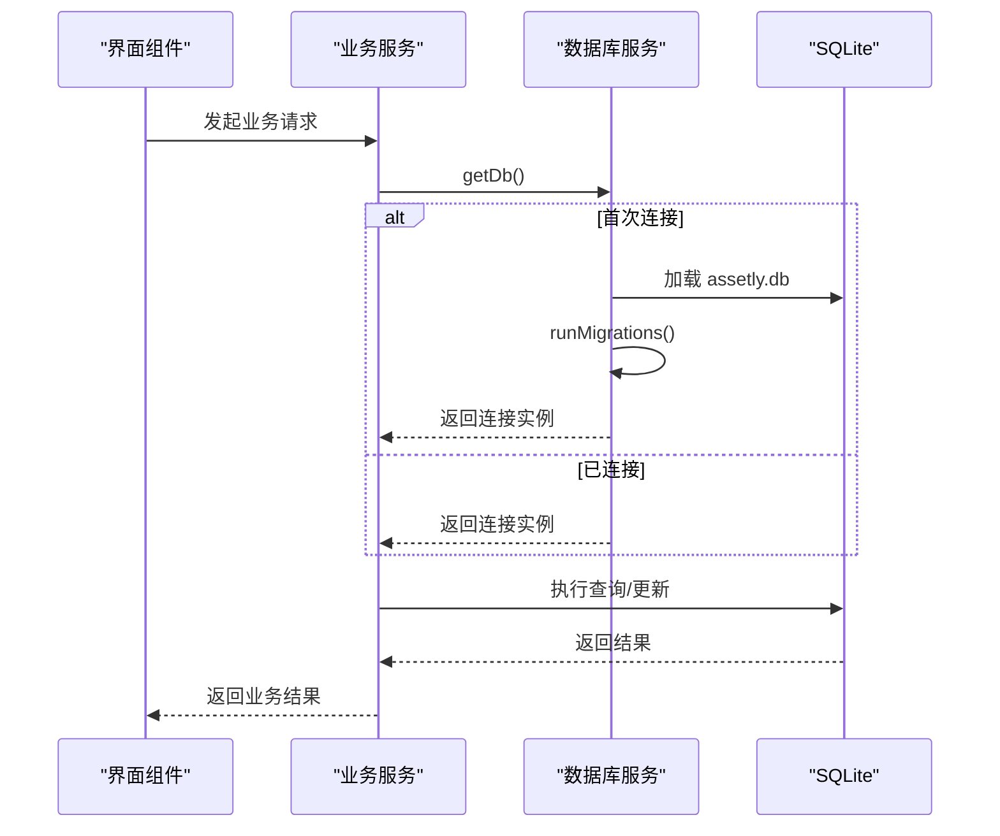
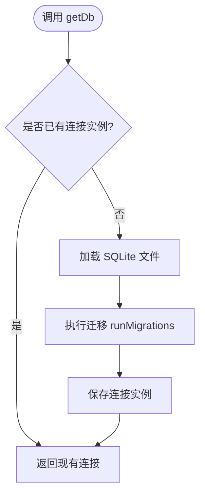
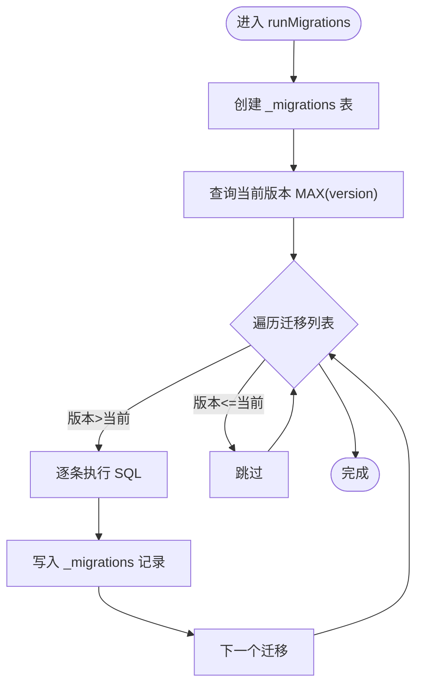
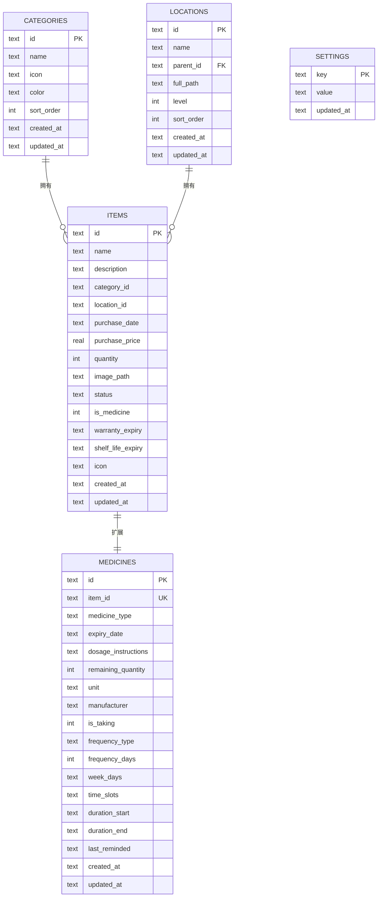
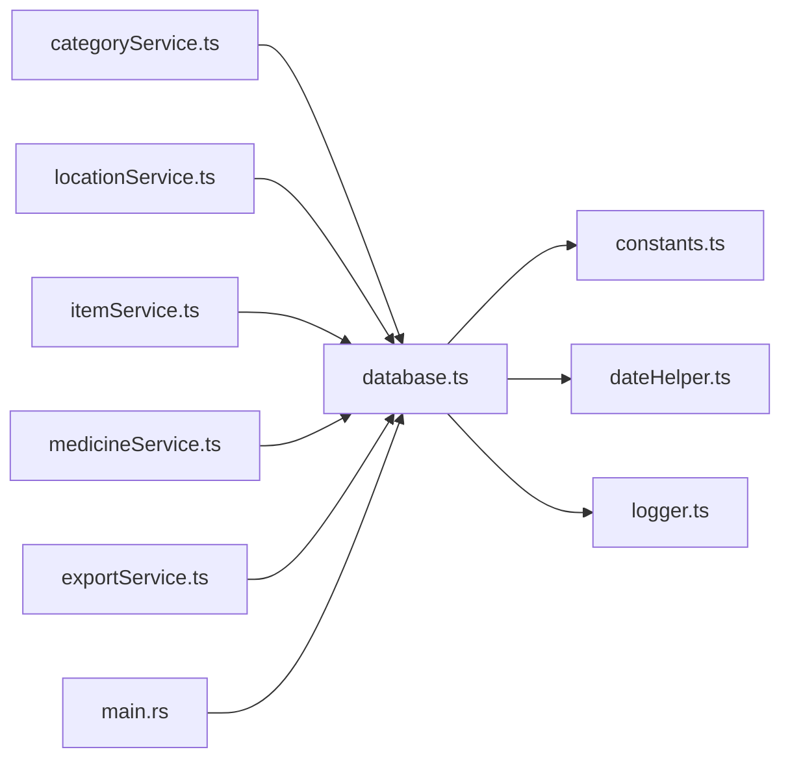

# 数据库 API

<cite>
**本文引用的文件**
- [src/services/database.ts](file://src/services/database.ts)
- [src/services/categoryService.ts](file://src/services/categoryService.ts)
- [src/services/locationService.ts](file://src/services/locationService.ts)
- [src/services/itemService.ts](file://src/services/itemService.ts)
- [src/services/medicineService.ts](file://src/services/medicineService.ts)
- [src/services/exportService.ts](file://src/services/exportService.ts)
- [src/utils/constants.ts](file://src/utils/constants.ts)
- [src/utils/logger.ts](file://src/utils/logger.ts)
- [src/utils/dateHelper.ts](file://src/utils/dateHelper.ts)
- [src/types/item.ts](file://src/types/item.ts)
- [src/types/category.ts](file://src/types/category.ts)
- [src/types/location.ts](file://src/types/location.ts)
- [src/types/medicine.ts](file://src/types/medicine.ts)
- [src-tauri/src/main.rs](file://src-tauri/src/main.rs)
</cite>

## 目录
1. [简介](#简介)
2. [项目结构](#项目结构)
3. [核心组件](#核心组件)
4. [架构总览](#架构总览)
5. [详细组件分析](#详细组件分析)
6. [依赖关系分析](#依赖关系分析)
7. [性能考虑](#性能考虑)
8. [故障排除指南](#故障排除指南)
9. [结论](#结论)
10. [附录](#附录)

## 简介
本文件为 Assetly 的数据库 API 参考文档，聚焦于数据库连接管理、迁移系统与核心数据库操作接口。重点解释以下内容：
- getDb() 的连接生命周期与单例模式
- runMigrations() 的版本控制机制与迁移执行流程
- 数据库初始化过程、表结构定义与索引策略
- 完整的 SQL 示例路径（以源码路径标注）
- 错误处理机制与日志记录
- SQLite 配置、事务处理与并发控制策略
- 性能优化建议与故障排除指南

## 项目结构
数据库相关代码主要集中在前端服务层与工具模块中，采用“服务层 + 工具层”的分层设计：
- 服务层：围绕实体（分类、位置、物品、药品）提供 CRUD 与查询封装
- 工具层：提供默认数据、时间格式化、日志转发等支撑能力
- 迁移与连接：集中于数据库服务模块，负责初始化、迁移与连接管理

图表来源
- [src/services/database.ts:1-171](file://src/services/database.ts#L1-L171)
- [src/services/categoryService.ts:1-59](file://src/services/categoryService.ts#L1-L59)
- [src/services/locationService.ts:1-143](file://src/services/locationService.ts#L1-L143)
- [src/services/itemService.ts:1-127](file://src/services/itemService.ts#L1-L127)
- [src/services/medicineService.ts:1-194](file://src/services/medicineService.ts#L1-L194)
- [src/services/exportService.ts:1-154](file://src/services/exportService.ts#L1-L154)
- [src/utils/constants.ts:1-40](file://src/utils/constants.ts#L1-L40)
- [src/utils/logger.ts:1-84](file://src/utils/logger.ts#L1-L84)
- [src/utils/dateHelper.ts:1-52](file://src/utils/dateHelper.ts#L1-L52)

章节来源
- [src/services/database.ts:1-171](file://src/services/database.ts#L1-L171)
- [src/services/categoryService.ts:1-59](file://src/services/categoryService.ts#L1-L59)
- [src/services/locationService.ts:1-143](file://src/services/locationService.ts#L1-L143)
- [src/services/itemService.ts:1-127](file://src/services/itemService.ts#L1-L127)
- [src/services/medicineService.ts:1-194](file://src/services/medicineService.ts#L1-L194)
- [src/services/exportService.ts:1-154](file://src/services/exportService.ts#L1-L154)
- [src/utils/constants.ts:1-40](file://src/utils/constants.ts#L1-L40)
- [src/utils/logger.ts:1-84](file://src/utils/logger.ts#L1-L84)
- [src/utils/dateHelper.ts:1-52](file://src/utils/dateHelper.ts#L1-L52)

## 核心组件
- 数据库连接与迁移
  - 单例连接：getDb() 在首次调用时加载 SQLite 文件并执行迁移，后续调用复用同一连接实例
  - 迁移表：内部维护 _migrations 表记录已应用版本
  - 版本推进：按版本号顺序执行未应用的迁移语句，并写入版本与时间戳
- 实体服务
  - 分类、位置、物品、药品服务均通过 getDb() 获取连接，提供查询、插入、更新、删除与复杂联表查询
- 默认数据与种子
  - 使用 constants.ts 中的默认分类，迁移阶段批量插入
- 日志与时间
  - logger.ts 提供结构化日志与内存缓存；dateHelper.ts 统一时间格式与时区表示

章节来源
- [src/services/database.ts:8-53](file://src/services/database.ts#L8-L53)
- [src/utils/constants.ts:4-13](file://src/utils/constants.ts#L4-L13)
- [src/utils/logger.ts:57-75](file://src/utils/logger.ts#L57-L75)
- [src/utils/dateHelper.ts:14-16](file://src/utils/dateHelper.ts#L14-L16)

## 架构总览
下图展示数据库 API 的整体交互：UI 调用各业务服务，服务通过 getDb() 获取数据库连接，执行 SQL 并返回结果。

图表来源
- [src/services/database.ts:8-16](file://src/services/database.ts#L8-L16)
- [src/services/categoryService.ts:9-18](file://src/services/categoryService.ts#L9-L18)
- [src/services/locationService.ts:9-18](file://src/services/locationService.ts#L9-L18)
- [src/services/itemService.ts:10-58](file://src/services/itemService.ts#L10-L58)
- [src/services/medicineService.ts:10-52](file://src/services/medicineService.ts#L10-L52)
- [src/services/exportService.ts:4-13](file://src/services/exportService.ts#L4-L13)

## 详细组件分析

### 数据库连接管理（getDb）
- 单例模式：全局变量保存连接实例，避免重复打开
- 延迟初始化：首次调用时才加载 SQLite 文件并执行迁移
- 连接字符串：使用本地文件型 SQLite（文件名在实现中固定）
- 迁移前置：连接建立后立即运行迁移，确保数据库结构一致

图表来源
- [src/services/database.ts:8-16](file://src/services/database.ts#L8-L16)

章节来源
- [src/services/database.ts:8-16](file://src/services/database.ts#L8-L16)

### 迁移系统（runMigrations）
- 迁移表：_migrations 记录版本号与应用时间
- 当前版本：查询最大版本号决定从哪开始执行
- 执行策略：按版本号升序遍历，对每个迁移中的多条 SQL 逐一执行，失败即抛错
- 版本记录：每条迁移成功后写入一条记录，包含版本号与时间戳
- 迁移清单：通过 getMigrations() 返回版本数组，包含建表、索引、默认数据与字段变更

图表来源
- [src/services/database.ts:18-53](file://src/services/database.ts#L18-L53)

章节来源
- [src/services/database.ts:18-53](file://src/services/database.ts#L18-L53)

### 迁移清单与表结构
- 版本 1：创建分类、位置、物品、药品、设置表，建立常用索引，插入默认分类与默认设置
- 版本 2：为物品表新增图标字段
- 版本 3：为药品表新增提醒相关字段（布尔以整数存储）
- 版本 4：为物品与位置表新增保质期与图片字段

图表来源
- [src/services/database.ts:60-170](file://src/services/database.ts#L60-L170)

章节来源
- [src/services/database.ts:60-170](file://src/services/database.ts#L60-L170)

### 索引优化策略
- 物品表：按分类、位置、状态建立索引，提升过滤与统计效率
- 药品表：按物品主键、有效期、类型建立索引，支持快速到期查询与类型筛选
- 位置表：按父节点建立索引，支持树形结构遍历与路径更新
- 建议：对高频查询条件（如状态、分类、有效期）保持索引；对写多读少场景谨慎增加索引以平衡写入成本

章节来源
- [src/services/database.ts:124-131](file://src/services/database.ts#L124-L131)

### 默认数据与种子
- 默认分类：来自 constants.ts，迁移阶段批量插入，包含排序与主题色
- 默认设置：迁移阶段插入主题色与货币符号键值

章节来源
- [src/utils/constants.ts:4-13](file://src/utils/constants.ts#L4-L13)
- [src/services/database.ts:132-139](file://src/services/database.ts#L132-L139)

### 核心数据库操作接口
- 查询接口
  - 分类：全量、按 ID、计数
  - 位置：全量、按 ID、树构建
  - 物品：全量（带联表详情）、按 ID、动态过滤（分类/位置/状态/搜索）
  - 药品：全量（带物品详情）、按物品 ID、按类型/搜索、到期提醒查询、正在服用查询
- 写入接口
  - 分类：创建（自动排序）
  - 位置：创建（自动计算 full_path 与 level）、更新（级联更新子节点路径）、删除（级联删除后代）
  - 物品：创建、更新（动态字段拼接）、删除（级联删除药品）
  - 药品：创建（先创建物品再创建药品）、更新（分别更新物品与药品字段）
- 导入导出
  - JSON 导出：按主键排序导出四张表
  - CSV 导出：联表导出关键字段
  - JSON 导入：按 INSERT OR REPLACE 方式导入四张表

章节来源
- [src/services/categoryService.ts:9-59](file://src/services/categoryService.ts#L9-L59)
- [src/services/locationService.ts:9-143](file://src/services/locationService.ts#L9-L143)
- [src/services/itemService.ts:10-127](file://src/services/itemService.ts#L10-L127)
- [src/services/medicineService.ts:10-194](file://src/services/medicineService.ts#L10-L194)
- [src/services/exportService.ts:4-154](file://src/services/exportService.ts#L4-L154)

### 类型与字段映射
- 物品与详情：包含分类名称/图标/颜色与位置完整路径
- 药品与详情：包含物品基础信息与位置完整路径
- 位置树节点：用于渲染层级结构

章节来源
- [src/types/item.ts:24-29](file://src/types/item.ts#L24-L29)
- [src/types/medicine.ts:29-41](file://src/types/medicine.ts#L29-L41)
- [src/types/location.ts:15-17](file://src/types/location.ts#L15-L17)

## 依赖关系分析
- 服务到数据库
  - 各业务服务均依赖 getDb() 获取连接，形成统一入口
- 数据库到工具
  - 迁移阶段依赖默认常量与时间格式化
  - 日志模块提供结构化输出与内存缓存
- 平台入口
  - 应用启动入口位于 Tauri 主程序，负责运行应用逻辑

图表来源
- [src/services/categoryService.ts:1](file://src/services/categoryService.ts#L1)
- [src/services/locationService.ts:1](file://src/services/locationService.ts#L1)
- [src/services/itemService.ts:1](file://src/services/itemService.ts#L1)
- [src/services/medicineService.ts:1](file://src/services/medicineService.ts#L1)
- [src/services/exportService.ts:1](file://src/services/exportService.ts#L1)
- [src/services/database.ts:1](file://src/services/database.ts#L1)
- [src/utils/constants.ts:1](file://src/utils/constants.ts#L1)
- [src/utils/dateHelper.ts:1](file://src/utils/dateHelper.ts#L1)
- [src/utils/logger.ts:1](file://src/utils/logger.ts#L1)
- [src-tauri/src/main.rs:4-6](file://src-tauri/src/main.rs#L4-L6)

章节来源
- [src/services/categoryService.ts:1](file://src/services/categoryService.ts#L1)
- [src/services/locationService.ts:1](file://src/services/locationService.ts#L1)
- [src/services/itemService.ts:1](file://src/services/itemService.ts#L1)
- [src/services/medicineService.ts:1](file://src/services/medicineService.ts#L1)
- [src/services/exportService.ts:1](file://src/services/exportService.ts#L1)
- [src/services/database.ts:1](file://src/services/database.ts#L1)
- [src/utils/constants.ts:1](file://src/utils/constants.ts#L1)
- [src/utils/dateHelper.ts:1](file://src/utils/dateHelper.ts#L1)
- [src/utils/logger.ts:1](file://src/utils/logger.ts#L1)
- [src-tauri/src/main.rs:4-6](file://src-tauri/src/main.rs#L4-L6)

## 性能考虑
- 查询优化
  - 利用现有索引（分类、位置、状态、药品有效期、类型）减少全表扫描
  - 对联表查询使用 JOIN 并限制字段，避免 SELECT *
- 写入优化
  - 批量插入优先使用参数化语句，减少解析开销
  - 更新时仅提交变更字段，避免不必要的写放大
- 索引权衡
  - 高频过滤列保持索引；低基数或写多读少列谨慎加索引
- 时间与日志
  - 使用统一时间格式与时区表示，避免跨时区问题
  - 结构化日志便于定位慢查询与异常

[本节为通用指导，不直接分析具体文件]

## 故障排除指南
- 连接失败
  - 检查 SQLite 文件是否存在与可访问
  - 确认首次连接时迁移未被中断
- 迁移失败
  - 查看日志中 SQL 片段与错误消息，定位具体语句
  - 确认迁移版本与数据库当前版本一致
- 查询异常
  - 核对参数化占位符与传参顺序
  - 检查联表字段别名与表名是否正确
- 导入导出
  - JSON 导入失败时检查数据结构与必填字段
  - 导出 CSV 为空时确认数据是否满足过滤条件

章节来源
- [src/utils/logger.ts:57-75](file://src/utils/logger.ts#L57-L75)
- [src/services/database.ts:38-44](file://src/services/database.ts#L38-L44)
- [src/services/exportService.ts:58-63](file://src/services/exportService.ts#L58-L63)

## 结论
Assetly 的数据库 API 采用轻量级 SQLite + 参数化 SQL 的设计，通过单例连接与迁移系统保证结构一致性与可演进性。服务层围绕实体提供清晰的 CRUD 与查询接口，配合索引与日志体系，满足日常资产管理与药品追踪需求。建议在生产环境中进一步引入事务包装、慢查询监控与备份策略，以增强可靠性与可观测性。

[本节为总结性内容，不直接分析具体文件]

## 附录

### SQLite 配置与连接要点
- 连接方式：本地文件型 SQLite，文件名在实现中固定
- 初始化：首次连接时自动创建迁移表并执行未应用迁移
- 并发：SQLite 在文件锁层面提供基本并发保护，建议在应用层避免长时间持有连接

章节来源
- [src/services/database.ts:10-11](file://src/services/database.ts#L10-L11)
- [src/services/database.ts:18-25](file://src/services/database.ts#L18-L25)

### 事务处理与并发控制策略
- 事务建议：对需要强一致性的复合写入（如创建药品需同时写入物品与药品）建议在服务层进行事务包裹，确保原子性
- 并发控制：利用 SQLite 的文件锁机制；在高并发写入场景下，建议引入重试与退避策略，并尽量合并写操作
- 读写分离：查询与写入分离，避免长事务阻塞

[本节为通用指导，不直接分析具体文件]

### 关键 SQL 语句示例（路径标注）
- 创建迁移元数据表
  - [src/services/database.ts:20-25](file://src/services/database.ts#L20-L25)
- 查询当前版本
  - [src/services/database.ts:28-31](file://src/services/database.ts#L28-L31)
- 插入迁移记录
  - [src/services/database.ts:46-49](file://src/services/database.ts#L46-L49)
- 分类全量查询
  - [src/services/categoryService.ts:10](file://src/services/categoryService.ts#L10)
- 物品联表详情查询
  - [src/services/itemService.ts:14-43](file://src/services/itemService.ts#L14-L43)
- 药品到期查询
  - [src/services/medicineService.ts:166-177](file://src/services/medicineService.ts#L166-L177)
- JSON 导出
  - [src/services/exportService.ts:7-12](file://src/services/exportService.ts#L7-L12)
- JSON 导入（分类）
  - [src/services/exportService.ts:72-76](file://src/services/exportService.ts#L72-L76)
- 位置路径级联更新
  - [src/services/locationService.ts:80-92](file://src/services/locationService.ts#L80-L92)