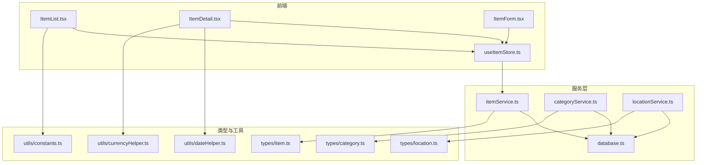
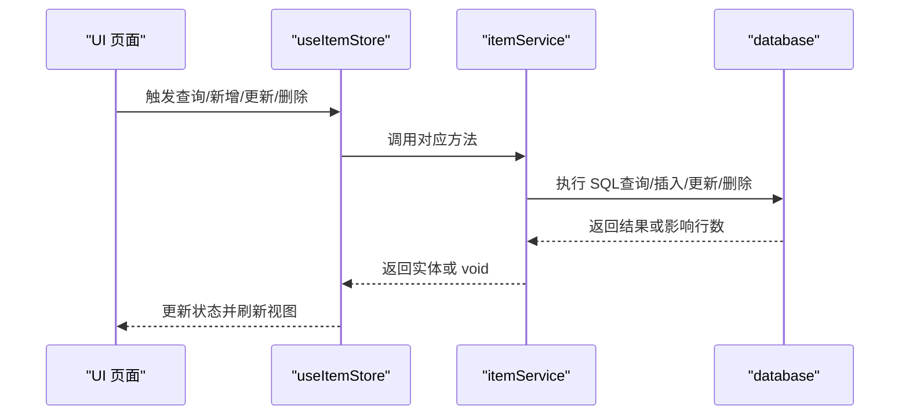
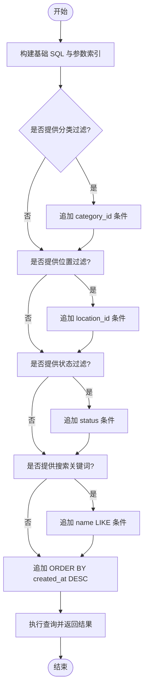
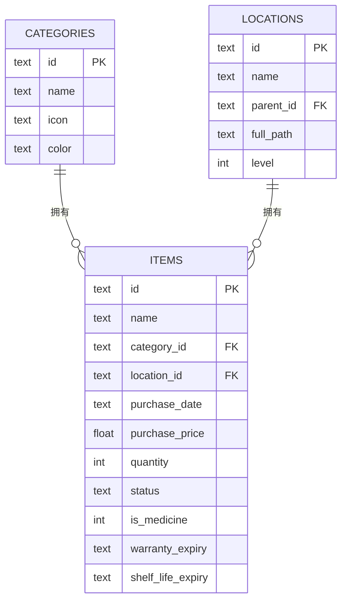
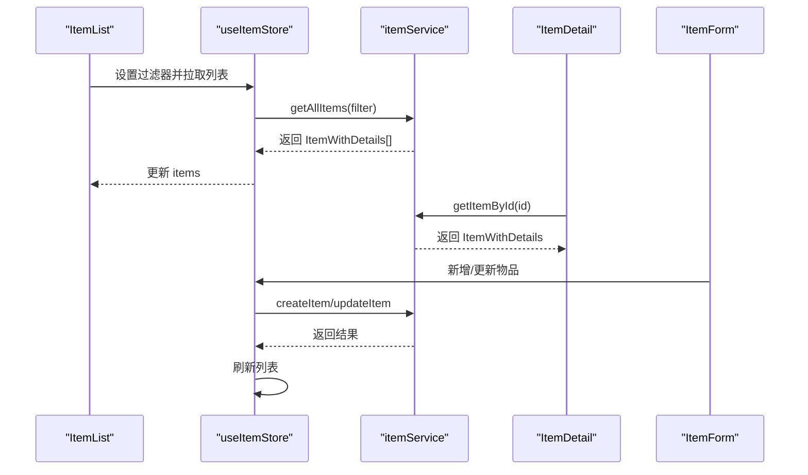
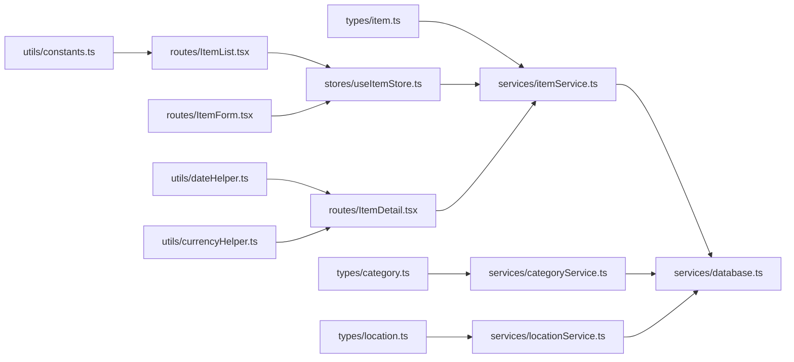

# 物品服务 API

<cite>
**本文引用的文件**
- [src/services/itemService.ts](file://src/services/itemService.ts)
- [src/types/item.ts](file://src/types/item.ts)
- [src/stores/useItemStore.ts](file://src/stores/useItemStore.ts)
- [src/routes/ItemList.tsx](file://src/routes/ItemList.tsx)
- [src/routes/ItemForm.tsx](file://src/routes/ItemForm.tsx)
- [src/routes/ItemDetail.tsx](file://src/routes/ItemDetail.tsx)
- [src/services/categoryService.ts](file://src/services/categoryService.ts)
- [src/services/locationService.ts](file://src/services/locationService.ts)
- [src/services/database.ts](file://src/services/database.ts)
- [src/utils/constants.ts](file://src/utils/constants.ts)
- [src/utils/dateHelper.ts](file://src/utils/dateHelper.ts)
- [src/utils/currencyHelper.ts](file://src/utils/currencyHelper.ts)
</cite>

## 目录
1. [简介](#简介)
2. [项目结构](#项目结构)
3. [核心组件](#核心组件)
4. [架构总览](#架构总览)
5. [详细组件分析](#详细组件分析)
6. [依赖关系分析](#依赖关系分析)
7. [性能考量](#性能考量)
8. [故障排查指南](#故障排查指南)
9. [结论](#结论)
10. [附录](#附录)

## 简介
本文件为 Assetly 的“物品服务 API”参考文档，聚焦于物品的 CRUD 操作与查询接口，涵盖以下能力：
- 核心 CRUD：创建(createItem)、读取(getItem/getItemById)、更新(updateItem)、删除(deleteItem)
- 查询接口：获取全部物品(getAllItems)、按分类筛选(getItemsByCategory)、按位置筛选(getItemsByLocation)
- 状态管理：物品状态(active/archived/disposed)与展示标签
- 批量操作：通过过滤器组合实现批量筛选（前端 Store 层）
- 数据验证：表单校验与必填字段约束
- 请求/响应示例与错误码说明
- 搜索、排序与分页：搜索与排序实现细节
- 关系处理：物品与分类、位置的关联及级联更新/删除策略

## 项目结构
围绕物品服务的关键文件组织如下：
- 服务层：物品服务、分类服务、位置服务、数据库与迁移
- 类型层：物品、分类、位置的数据类型定义
- 前端路由与存储：列表、详情、表单页面与状态管理
- 工具层：常量、日期与货币辅助函数

图表来源
- [src/routes/ItemList.tsx:1-185](file://src/routes/ItemList.tsx#L1-L185)
- [src/routes/ItemDetail.tsx:1-168](file://src/routes/ItemDetail.tsx#L1-L168)
- [src/routes/ItemForm.tsx:1-263](file://src/routes/ItemForm.tsx#L1-L263)
- [src/stores/useItemStore.ts:1-53](file://src/stores/useItemStore.ts#L1-L53)
- [src/services/itemService.ts:1-127](file://src/services/itemService.ts#L1-L127)
- [src/services/categoryService.ts:1-59](file://src/services/categoryService.ts#L1-L59)
- [src/services/locationService.ts:1-143](file://src/services/locationService.ts#L1-L143)
- [src/services/database.ts:1-171](file://src/services/database.ts#L1-L171)
- [src/types/item.ts:1-46](file://src/types/item.ts#L1-L46)
- [src/types/category.ts:1-18](file://src/types/category.ts#L1-L18)
- [src/types/location.ts:1-24](file://src/types/location.ts#L1-L24)
- [src/utils/constants.ts:1-40](file://src/utils/constants.ts#L1-L40)
- [src/utils/dateHelper.ts:1-52](file://src/utils/dateHelper.ts#L1-L52)
- [src/utils/currencyHelper.ts:1-17](file://src/utils/currencyHelper.ts#L1-L17)

章节来源
- [src/services/itemService.ts:1-127](file://src/services/itemService.ts#L1-L127)
- [src/types/item.ts:1-46](file://src/types/item.ts#L1-L46)
- [src/stores/useItemStore.ts:1-53](file://src/stores/useItemStore.ts#L1-L53)
- [src/routes/ItemList.tsx:1-185](file://src/routes/ItemList.tsx#L1-L185)
- [src/routes/ItemForm.tsx:1-263](file://src/routes/ItemForm.tsx#L1-L263)
- [src/routes/ItemDetail.tsx:1-168](file://src/routes/ItemDetail.tsx#L1-L168)
- [src/services/categoryService.ts:1-59](file://src/services/categoryService.ts#L1-L59)
- [src/services/locationService.ts:1-143](file://src/services/locationService.ts#L1-L143)
- [src/services/database.ts:1-171](file://src/services/database.ts#L1-L171)
- [src/utils/constants.ts:1-40](file://src/utils/constants.ts#L1-L40)
- [src/utils/dateHelper.ts:1-52](file://src/utils/dateHelper.ts#L1-L52)
- [src/utils/currencyHelper.ts:1-17](file://src/utils/currencyHelper.ts#L1-L17)

## 核心组件
- 物品服务：提供物品 CRUD 与查询接口，支持多条件过滤、模糊搜索与排序
- 分类服务：维护物品分类，支持分类级联更新与删除时的物品归档
- 位置服务：维护位置树形结构，支持路径全量更新与级联删除
- 数据库与迁移：SQLite 数据库初始化、表结构与索引、版本迁移
- 前端 Store：集中管理物品列表、过滤器与增删改操作
- 路由与表单：列表、详情、表单页面，配合 Store 完成交互

章节来源
- [src/services/itemService.ts:1-127](file://src/services/itemService.ts#L1-L127)
- [src/services/categoryService.ts:1-59](file://src/services/categoryService.ts#L1-L59)
- [src/services/locationService.ts:1-143](file://src/services/locationService.ts#L1-L143)
- [src/services/database.ts:1-171](file://src/services/database.ts#L1-L171)
- [src/stores/useItemStore.ts:1-53](file://src/stores/useItemStore.ts#L1-L53)

## 架构总览
物品服务采用“前端 Store -> 服务层 -> 数据库”的分层设计。Store 统一调度服务层方法，服务层通过数据库插件访问 SQLite 并执行迁移；类型定义确保前后端一致的数据契约。

图表来源
- [src/stores/useItemStore.ts:23-52](file://src/stores/useItemStore.ts#L23-L52)
- [src/services/itemService.ts:10-127](file://src/services/itemService.ts#L10-L127)
- [src/services/database.ts:8-53](file://src/services/database.ts#L8-L53)

## 详细组件分析

### 物品服务 API

- 接口概览
  - createItem(data: ItemFormData): Promise<Item>
  - getItemById(id: string): Promise<ItemWithDetails | null>
  - getAllItems(filter?: Filter): Promise<ItemWithDetails[]>
  - updateItem(id: string, data: Partial<ItemFormData>): Promise<void>
  - deleteItem(id: string): Promise<void>

- 参数与返回值
  - ItemFormData：必填字段包括 name、category_id、location_id、status 等；其余为可选
  - ItemWithDetails：在 Item 基础上附加分类名称/图标/颜色与位置完整路径
  - Filter：支持 category_id、location_id、status、search（模糊匹配）

- 查询与过滤
  - 过滤条件动态拼接 WHERE 子句，支持 AND 组合
  - 模糊搜索使用 LIKE %keyword%
  - 默认排序：created_at 降序

- 状态管理
  - 支持状态：active、archived、disposed
  - 展示标签映射见常量配置

- 数据验证
  - 表单层面：名称必填、价格/数量非负、日期格式化
  - 服务层：未显式进行严格校验，建议调用方保证数据有效性

- 错误处理
  - 未捕获异常会透传给调用方；建议在 Store 或路由层统一处理
  - 删除操作：物品删除触发药品的级联删除（数据库外键约束）

- 请求/响应示例
  - 创建物品
    - 请求体：ItemFormData（必填字段 name、category_id、location_id、status）
    - 成功响应：Item（包含 created_at/updated_at）
  - 获取物品详情
    - 路径参数：id
    - 成功响应：ItemWithDetails（包含分类与位置信息）
  - 更新物品
    - 路径参数：id
    - 请求体：Partial<ItemFormData>（仅更新提供的字段）
    - 成功响应：void
  - 删除物品
    - 路径参数：id
    - 成功响应：void

- 错误码说明
  - 200：成功
  - 400：请求参数无效（如名称为空）
  - 404：资源不存在（如按 id 查询无结果）
  - 500：服务器内部错误（数据库异常、迁移失败等）

章节来源
- [src/services/itemService.ts:10-127](file://src/services/itemService.ts#L10-L127)
- [src/types/item.ts:3-46](file://src/types/item.ts#L3-L46)
- [src/utils/constants.ts:22-27](file://src/utils/constants.ts#L22-L27)

### 物品查询接口详解

- getAllItems(filter?)
  - 支持过滤：category_id、location_id、status、search
  - 返回 ItemWithDetails 列表，按创建时间倒序
  - 适用场景：列表页筛选与搜索

- getItemsByCategory(categoryId)
  - 通过 filter.category_id 实现
  - 适合分类卡片点击跳转

- getItemsByLocation(locationId)
  - 通过 filter.location_id 实现
  - 适合位置树点击跳转

- 搜索、排序与分页
  - 搜索：LIKE %keyword%，大小写不敏感
  - 排序：默认 created_at DESC
  - 分页：当前实现未提供分页参数；可通过前端截断或后端扩展 OFFSET/LIMIT

图表来源
- [src/services/itemService.ts:10-44](file://src/services/itemService.ts#L10-L44)

章节来源
- [src/services/itemService.ts:10-44](file://src/services/itemService.ts#L10-L44)
- [src/routes/ItemList.tsx:24-49](file://src/routes/ItemList.tsx#L24-L49)

### 物品状态管理与展示

- 状态枚举：active、archived、disposed
- 展示标签：通过常量映射为中文标签
- 列表页统计：按状态统计数量与资产总值、日均成本

章节来源
- [src/types/item.ts:3-3](file://src/types/item.ts#L3-L3)
- [src/utils/constants.ts:22-27](file://src/utils/constants.ts#L22-L27)
- [src/routes/ItemList.tsx:51-68](file://src/routes/ItemList.tsx#L51-L68)

### 批量操作与过滤器

- 前端 Store 使用 filter 对象聚合多个过滤条件
- 支持：分类、位置、状态、搜索关键词
- Store 在设置过滤器后自动拉取最新列表

章节来源
- [src/stores/useItemStore.ts:5-21](file://src/stores/useItemStore.ts#L5-L21)
- [src/stores/useItemStore.ts:28-51](file://src/stores/useItemStore.ts#L28-L51)
- [src/routes/ItemList.tsx:24-49](file://src/routes/ItemList.tsx#L24-L49)

### 数据验证规则

- 表单必填：名称、分类、位置、状态
- 数值校验：价格与数量非负
- 日期格式：使用日期工具格式化为 YYYY-MM-DD
- 建议：在服务层增加参数校验与异常处理

章节来源
- [src/routes/ItemForm.tsx:13-27](file://src/routes/ItemForm.tsx#L13-L27)
- [src/routes/ItemForm.tsx:67-81](file://src/routes/ItemForm.tsx#L67-L81)
- [src/utils/dateHelper.ts:4-20](file://src/utils/dateHelper.ts#L4-L20)

### 物品与分类、位置的关系处理

- 关系模型
  - items.category_id -> categories.id
  - items.location_id -> locations.id
- 级联策略
  - 删除分类：将该分类下的物品 category_id 置空
  - 删除位置：将该位置及其后代位置下的物品 location_id 置空，并删除后代位置
  - 删除物品：触发药品的级联删除（外键约束）

图表来源
- [src/services/database.ts:67-103](file://src/services/database.ts#L67-L103)
- [src/services/categoryService.ts:44-49](file://src/services/categoryService.ts#L44-L49)
- [src/services/locationService.ts:94-122](file://src/services/locationService.ts#L94-L122)
- [src/services/itemService.ts:48-57](file://src/services/itemService.ts#L48-L57)

章节来源
- [src/services/categoryService.ts:44-49](file://src/services/categoryService.ts#L44-L49)
- [src/services/locationService.ts:94-122](file://src/services/locationService.ts#L94-L122)
- [src/services/database.ts:67-117](file://src/services/database.ts#L67-L117)

### 前端交互与数据流

- 列表页：支持搜索、状态筛选、分类筛选，自动加载与刷新
- 详情页：展示物品详情、计算日均成本与使用天数
- 表单页：新增/编辑物品，提交前进行必填校验

图表来源
- [src/routes/ItemList.tsx:27-49](file://src/routes/ItemList.tsx#L27-L49)
- [src/stores/useItemStore.ts:28-51](file://src/stores/useItemStore.ts#L28-L51)
- [src/services/itemService.ts:10-127](file://src/services/itemService.ts#L10-L127)
- [src/routes/ItemDetail.tsx:21-23](file://src/routes/ItemDetail.tsx#L21-L23)
- [src/routes/ItemForm.tsx:67-81](file://src/routes/ItemForm.tsx#L67-L81)

章节来源
- [src/routes/ItemList.tsx:1-185](file://src/routes/ItemList.tsx#L1-L185)
- [src/routes/ItemDetail.tsx:1-168](file://src/routes/ItemDetail.tsx#L1-L168)
- [src/routes/ItemForm.tsx:1-263](file://src/routes/ItemForm.tsx#L1-L263)
- [src/stores/useItemStore.ts:1-53](file://src/stores/useItemStore.ts#L1-L53)

## 依赖关系分析

图表来源
- [src/types/item.ts:1-46](file://src/types/item.ts#L1-L46)
- [src/types/category.ts:1-18](file://src/types/category.ts#L1-L18)
- [src/types/location.ts:1-24](file://src/types/location.ts#L1-L24)
- [src/services/itemService.ts:1-127](file://src/services/itemService.ts#L1-L127)
- [src/services/categoryService.ts:1-59](file://src/services/categoryService.ts#L1-L59)
- [src/services/locationService.ts:1-143](file://src/services/locationService.ts#L1-L143)
- [src/services/database.ts:1-171](file://src/services/database.ts#L1-L171)
- [src/stores/useItemStore.ts:1-53](file://src/stores/useItemStore.ts#L1-L53)
- [src/routes/ItemList.tsx:1-185](file://src/routes/ItemList.tsx#L1-L185)
- [src/routes/ItemDetail.tsx:1-168](file://src/routes/ItemDetail.tsx#L1-L168)
- [src/routes/ItemForm.tsx:1-263](file://src/routes/ItemForm.tsx#L1-L263)
- [src/utils/constants.ts:1-40](file://src/utils/constants.ts#L1-L40)
- [src/utils/dateHelper.ts:1-52](file://src/utils/dateHelper.ts#L1-L52)
- [src/utils/currencyHelper.ts:1-17](file://src/utils/currencyHelper.ts#L1-L17)

章节来源
- [src/services/itemService.ts:1-127](file://src/services/itemService.ts#L1-L127)
- [src/services/categoryService.ts:1-59](file://src/services/categoryService.ts#L1-L59)
- [src/services/locationService.ts:1-143](file://src/services/locationService.ts#L1-L143)
- [src/services/database.ts:1-171](file://src/services/database.ts#L1-L171)
- [src/stores/useItemStore.ts:1-53](file://src/stores/useItemStore.ts#L1-L53)
- [src/routes/ItemList.tsx:1-185](file://src/routes/ItemList.tsx#L1-L185)
- [src/routes/ItemDetail.tsx:1-168](file://src/routes/ItemDetail.tsx#L1-L168)
- [src/routes/ItemForm.tsx:1-263](file://src/routes/ItemForm.tsx#L1-L263)
- [src/utils/constants.ts:1-40](file://src/utils/constants.ts#L1-L40)
- [src/utils/dateHelper.ts:1-52](file://src/utils/dateHelper.ts#L1-L52)
- [src/utils/currencyHelper.ts:1-17](file://src/utils/currencyHelper.ts#L1-L17)

## 性能考量
- 索引优化：items 表存在 category_id、location_id、status 等索引，有助于过滤查询
- 查询排序：默认按 created_at 降序，利于新数据优先展示
- 建议：在高频搜索场景下，可考虑为 name 字段建立全文索引或分词索引；分页建议引入 LIMIT/OFFSET
- 数据库迁移：版本化迁移避免重复执行，提升部署稳定性

章节来源
- [src/services/database.ts:124-131](file://src/services/database.ts#L124-L131)
- [src/services/itemService.ts:42-43](file://src/services/itemService.ts#L42-L43)

## 故障排查指南
- 数据库连接失败
  - 现象：应用启动时报数据库连接错误
  - 排查：确认数据库文件存在、权限正确；检查迁移是否成功
- 迁移执行失败
  - 现象：迁移 SQL 报错
  - 排查：查看日志中的具体 SQL 与错误信息，修正语法或兼容性问题
- 查询无结果
  - 现象：按 id 查询返回 null
  - 排查：确认 id 是否正确、是否存在；检查 is_medicine 过滤条件
- 删除异常
  - 现象：删除物品后药品未同步删除
  - 排查：确认外键约束是否生效；检查数据库版本与迁移是否完成

章节来源
- [src/services/database.ts:8-53](file://src/services/database.ts#L8-L53)
- [src/services/itemService.ts:121-126](file://src/services/itemService.ts#L121-L126)

## 结论
物品服务 API 提供了完善的 CRUD 与查询能力，结合 Store 的过滤器与前端路由，实现了从筛选、搜索到详情与表单的完整闭环。通过数据库索引与外键约束，保障了查询效率与数据一致性。建议后续增强服务层参数校验与错误处理，并考虑引入分页与全文检索以进一步提升性能与体验。

## 附录

### API 参考速查

- createItem(data)
  - 请求体：ItemFormData
  - 响应：Item
  - 错误：400（参数无效）、500（内部错误）

- getItemById(id)
  - 路径参数：id
  - 响应：ItemWithDetails 或 null
  - 错误：500（内部错误）

- getAllItems(filter?)
  - 查询参数：category_id、location_id、status、search
  - 响应：ItemWithDetails[]（按 created_at 降序）
  - 错误：500（内部错误）

- updateItem(id, data)
  - 路径参数：id
  - 请求体：Partial<ItemFormData>
  - 响应：void
  - 错误：500（内部错误）

- deleteItem(id)
  - 路径参数：id
  - 响应：void
  - 错误：500（内部错误）

章节来源
- [src/services/itemService.ts:10-127](file://src/services/itemService.ts#L10-L127)
- [src/types/item.ts:3-46](file://src/types/item.ts#L3-L46)