# 统计服务 API

<cite>
**本文引用的文件**
- [statisticsService.ts](file://src/services/statisticsService.ts)
- [Statistics.tsx](file://src/routes/Statistics.tsx)
- [useDashboardStore.ts](file://src/stores/useDashboardStore.ts)
- [database.ts](file://src/services/database.ts)
- [settings.ts](file://src/types/settings.ts)
- [item.ts](file://src/types/item.ts)
- [category.ts](file://src/types/category.ts)
- [medicineService.ts](file://src/services/medicineService.ts)
- [PieChart.tsx](file://src/components/charts/PieChart.tsx)
- [AreaChart.tsx](file://src/components/charts/AreaChart.tsx)
- [currencyHelper.ts](file://src/utils/currencyHelper.ts)
- [dateHelper.ts](file://src/utils/dateHelper.ts)
- [README.md](file://README.md)
</cite>

## 目录
1. [简介](#简介)
2. [项目结构](#项目结构)
3. [核心组件](#核心组件)
4. [架构概览](#架构概览)
5. [详细组件分析](#详细组件分析)
6. [依赖关系分析](#依赖关系分析)
7. [性能考虑](#性能考虑)
8. [故障排除指南](#故障排除指南)
9. [结论](#结论)
10. [附录](#附录)

## 简介

Assetly 的统计服务 API 提供了家庭资产管理的核心统计功能，包括资产总值统计、分类分布统计、时间趋势分析等核心功能。该服务通过 SQLite 数据库存储数据，使用 React + Tauri 技术栈实现跨平台应用，并通过 Recharts 库提供可视化图表展示。

统计服务主要服务于资产管理场景，帮助用户了解资产分布情况、消费趋势以及关键指标，为资产管理决策提供数据支撑。

## 项目结构

统计服务位于前端项目的 `src/services/` 目录下，采用分层架构设计：

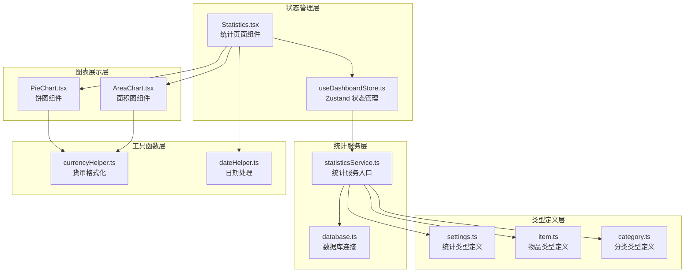

**图表来源**
- [statisticsService.ts:1-52](file://src/services/statisticsService.ts#L1-L52)
- [useDashboardStore.ts:1-34](file://src/stores/useDashboardStore.ts#L1-L34)
- [Statistics.tsx:1-85](file://src/routes/Statistics.tsx#L1-L85)

**章节来源**
- [statisticsService.ts:1-52](file://src/services/statisticsService.ts#L1-L52)
- [useDashboardStore.ts:1-34](file://src/stores/useDashboardStore.ts#L1-L34)
- [Statistics.tsx:1-85](file://src/routes/Statistics.tsx#L1-L85)

## 核心组件

统计服务包含以下核心组件：

### 统计服务接口
- `getDashboardStats()`: 获取仪表板统计数据
- `getCategoryDistribution()`: 获取分类分布统计
- `getMonthlySpending()`: 获取月度消费统计

### 数据模型
- `DashboardStats`: 仪表板统计结果
- `CategoryDistribution`: 分类分布数据
- `MonthlySpending`: 月度消费数据

### 状态管理
- `useDashboardStore`: Zustand 状态管理，统一管理统计数据

**章节来源**
- [statisticsService.ts:4-51](file://src/services/statisticsService.ts#L4-L51)
- [settings.ts:8-24](file://src/types/settings.ts#L8-L24)
- [useDashboardStore.ts:7-33](file://src/stores/useDashboardStore.ts#L7-L33)

## 架构概览

统计服务采用分层架构，从底层数据库访问到上层数据展示形成清晰的层次结构：

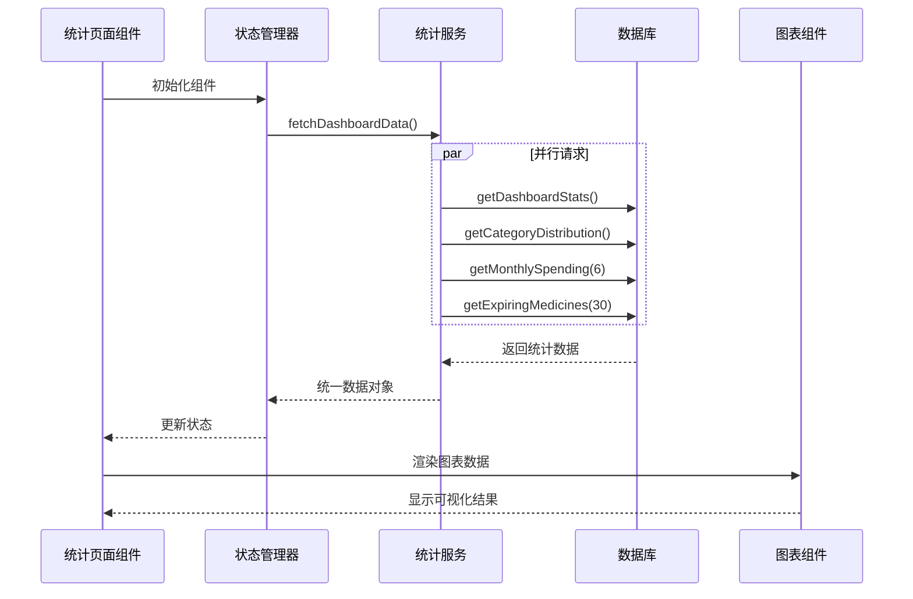

**图表来源**
- [Statistics.tsx:13-15](file://src/routes/Statistics.tsx#L13-L15)
- [useDashboardStore.ts:23-32](file://src/stores/useDashboardStore.ts#L23-L32)
- [statisticsService.ts:4-51](file://src/services/statisticsService.ts#L4-L51)

## 详细组件分析

### 统计服务核心实现

#### 资产总值统计 (getDashboardStats)

该函数负责计算仪表板的核心指标，包括总资产价值、物品总数、药品数量和即将过期的药品数量。

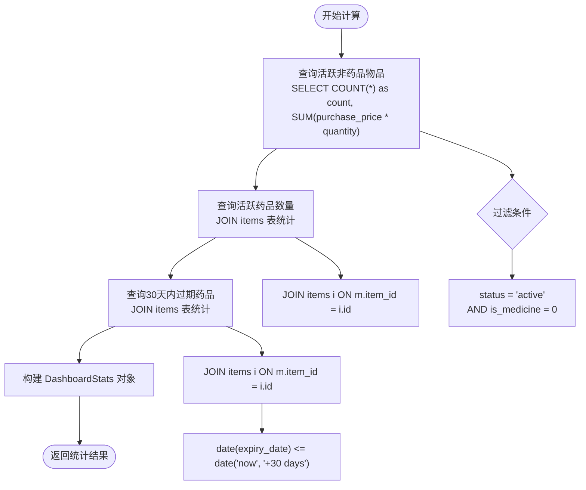

**图表来源**
- [statisticsService.ts:4-26](file://src/services/statisticsService.ts#L4-L26)

#### 分类分布统计 (getCategoryDistribution)

该函数计算各分类的资产分布情况，基于每个分类的物品总价值进行排序。

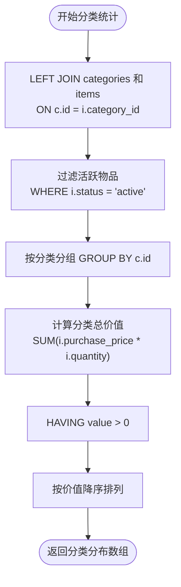

**图表来源**
- [statisticsService.ts:28-38](file://src/services/statisticsService.ts#L28-L38)

#### 时间趋势分析 (getMonthlySpending)

该函数提供月度消费趋势分析，默认统计最近6个月的消费数据。

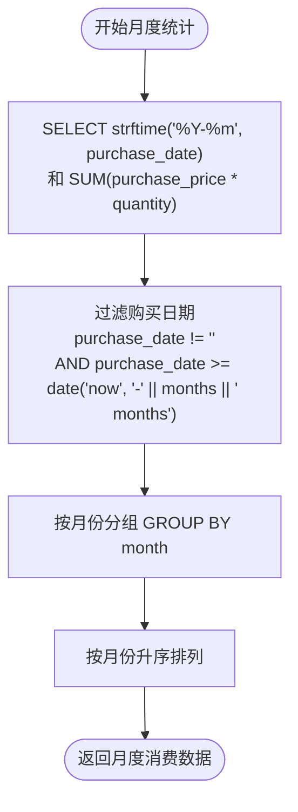

**图表来源**
- [statisticsService.ts:40-51](file://src/services/statisticsService.ts#L40-L51)

**章节来源**
- [statisticsService.ts:4-51](file://src/services/statisticsService.ts#L4-L51)

### 状态管理与数据流

#### Zustand 状态管理器

使用 Zustand 实现轻量级状态管理，统一管理统计相关的所有状态：

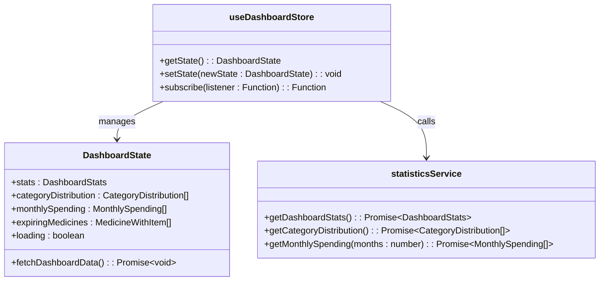

**图表来源**
- [useDashboardStore.ts:7-33](file://src/stores/useDashboardStore.ts#L7-L33)
- [statisticsService.ts:4-51](file://src/services/statisticsService.ts#L4-L51)

#### 统计页面组件集成

统计页面组件通过状态管理器获取数据并驱动图表渲染：

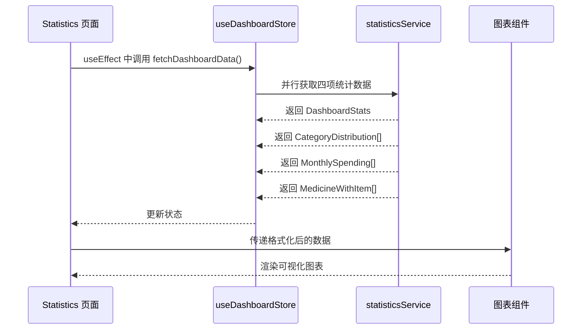

**图表来源**
- [Statistics.tsx:10-15](file://src/routes/Statistics.tsx#L10-L15)
- [useDashboardStore.ts:23-32](file://src/stores/useDashboardStore.ts#L23-L32)

**章节来源**
- [useDashboardStore.ts:16-33](file://src/stores/useDashboardStore.ts#L16-L33)
- [Statistics.tsx:9-84](file://src/routes/Statistics.tsx#L9-L84)

### 图表数据生成与渲染

#### 饼图数据生成 (getCategoryDistribution)

饼图组件接收标准化的数据格式，包含分类名称、颜色和对应的数值：

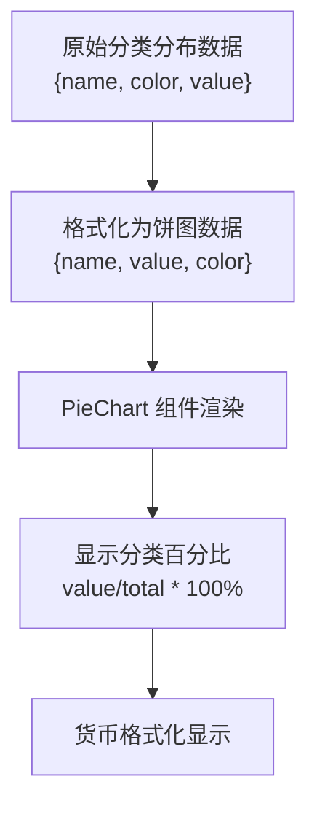

**图表来源**
- [PieChart.tsx:12-26](file://src/components/charts/PieChart.tsx#L12-L26)
- [statisticsService.ts:28-38](file://src/services/statisticsService.ts#L28-L38)

#### 面积图数据生成 (getMonthlySpending)

面积图组件处理月度消费数据的时间序列：

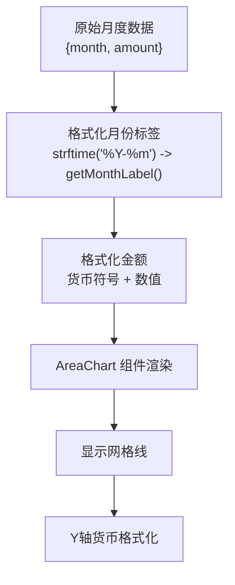

**图表来源**
- [AreaChart.tsx:9-21](file://src/components/charts/AreaChart.tsx#L9-L21)
- [dateHelper.ts:49-51](file://src/utils/dateHelper.ts#L49-L51)

**章节来源**
- [PieChart.tsx:28-113](file://src/components/charts/PieChart.tsx#L28-L113)
- [AreaChart.tsx:23-93](file://src/components/charts/AreaChart.tsx#L23-L93)

## 依赖关系分析

统计服务的依赖关系呈现清晰的单向依赖结构：

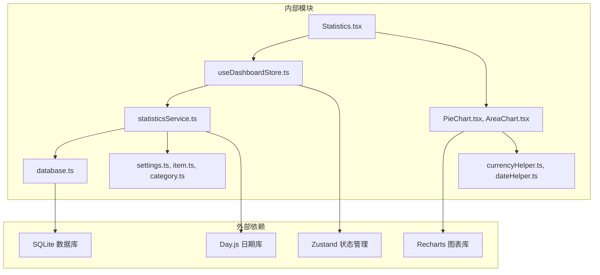

**图表来源**
- [statisticsService.ts:1-52](file://src/services/statisticsService.ts#L1-L52)
- [database.ts:1-171](file://src/services/database.ts#L1-L171)
- [PieChart.tsx:1-114](file://src/components/charts/PieChart.tsx#L1-L114)
- [AreaChart.tsx:1-94](file://src/components/charts/AreaChart.tsx#L1-L94)

**章节来源**
- [statisticsService.ts:1-52](file://src/services/statisticsService.ts#L1-L52)
- [database.ts:1-171](file://src/services/database.ts#L1-L171)

## 性能考虑

### 查询优化策略

1. **索引优化**: 数据库表已建立适当的索引以支持常见查询
   - `idx_items_category`: 分类查询优化
   - `idx_items_location`: 位置查询优化  
   - `idx_items_status`: 状态过滤优化
   - `idx_medicines_expiry`: 过期查询优化

2. **查询合并**: 使用 `Promise.all` 并行执行多个统计查询，减少总等待时间

3. **数据分页**: 对于大量数据的查询，考虑实现分页机制

### 缓存策略

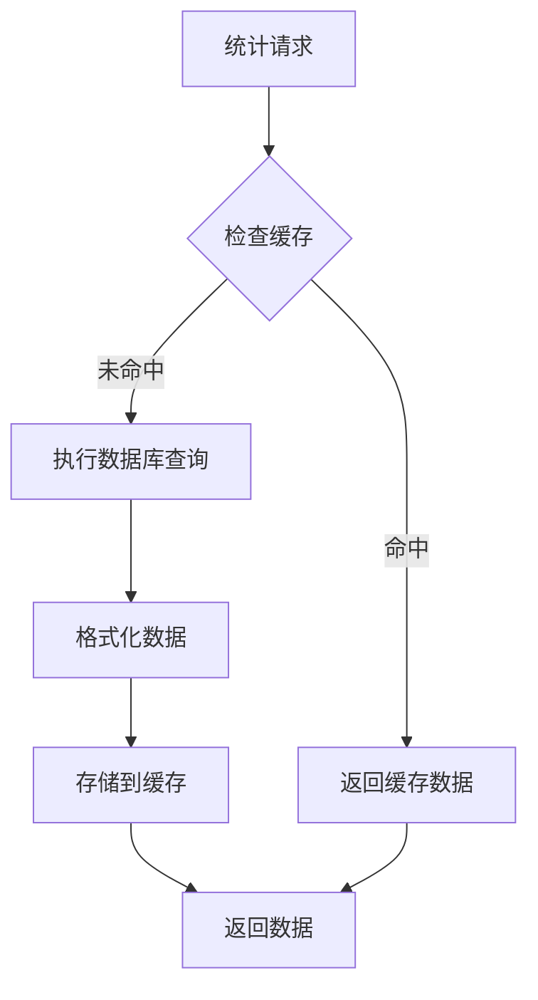

### 内存管理

1. **状态清理**: 组件卸载时清理定时器和订阅
2. **数据压缩**: 对于大量数据，考虑数据压缩和懒加载
3. **防抖处理**: 对频繁触发的查询操作实施防抖机制

**章节来源**
- [database.ts:124-131](file://src/services/database.ts#L124-L131)
- [useDashboardStore.ts:23-32](file://src/stores/useDashboardStore.ts#L23-L32)

## 故障排除指南

### 常见问题及解决方案

#### 数据库连接问题
- **症状**: 统计数据无法加载，出现连接错误
- **原因**: 数据库初始化失败或文件损坏
- **解决**: 检查数据库文件完整性，重新初始化应用

#### 查询性能问题
- **症状**: 统计页面加载缓慢
- **原因**: 数据量过大导致查询耗时
- **解决**: 
  - 优化查询语句
  - 添加适当的索引
  - 实施数据分页

#### 图表渲染问题
- **症状**: 图表显示异常或空白
- **原因**: 数据格式不正确或缺少必要的字段
- **解决**: 
  - 验证数据结构符合类型定义
  - 检查数据转换逻辑
  - 确保货币符号和日期格式正确

**章节来源**
- [database.ts:8-16](file://src/services/database.ts#L8-L16)
- [PieChart.tsx:54-60](file://src/components/charts/PieChart.tsx#L54-L60)
- [AreaChart.tsx:40-46](file://src/components/charts/AreaChart.tsx#L40-L46)

## 结论

Assetly 的统计服务 API 提供了完整的资产管理统计解决方案，具有以下特点：

1. **模块化设计**: 清晰的分层架构，职责分离明确
2. **高性能**: 并行查询、索引优化、合理的数据结构
3. **易扩展**: 基于 TypeScript 的强类型定义，便于功能扩展
4. **用户体验**: 实时数据更新、直观的图表展示
5. **数据安全**: 本地存储，隐私保护

该统计服务为资产管理提供了坚实的技术基础，能够满足用户对资产分布、消费趋势等关键指标的监控需求。

## 附录

### API 接口规范

#### getDashboardStats()
- **功能**: 获取仪表板核心统计数据
- **返回值**: DashboardStats 对象
- **应用场景**: 资产总览卡片、关键指标展示

#### getCategoryDistribution()
- **功能**: 获取分类资产分布统计
- **返回值**: CategoryDistribution[] 数组
- **应用场景**: 资产分布饼图、分类分析报告

#### getMonthlySpending(months: number)
- **功能**: 获取指定月份数的消费趋势
- **参数**: months (默认 6)
- **返回值**: MonthlySpending[] 数组
- **应用场景**: 消费趋势图表、财务分析

### 数据格式标准化

统计服务确保数据格式的一致性和标准化：

1. **货币格式**: 统一使用货币符号和两位小数
2. **日期格式**: 使用 ISO 8601 标准日期格式
3. **分类颜色**: 保持分类颜色的一致性
4. **百分比计算**: 精确的百分比计算和显示

### 客户端渲染适配

- **响应式设计**: 支持不同屏幕尺寸的图表渲染
- **主题适配**: 自动适配应用主题色
- **国际化支持**: 支持多种货币符号和日期格式
- **无障碍访问**: 提供足够的对比度和可读性