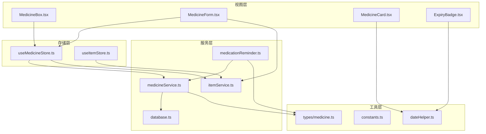
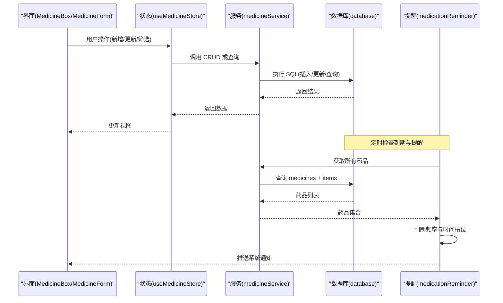
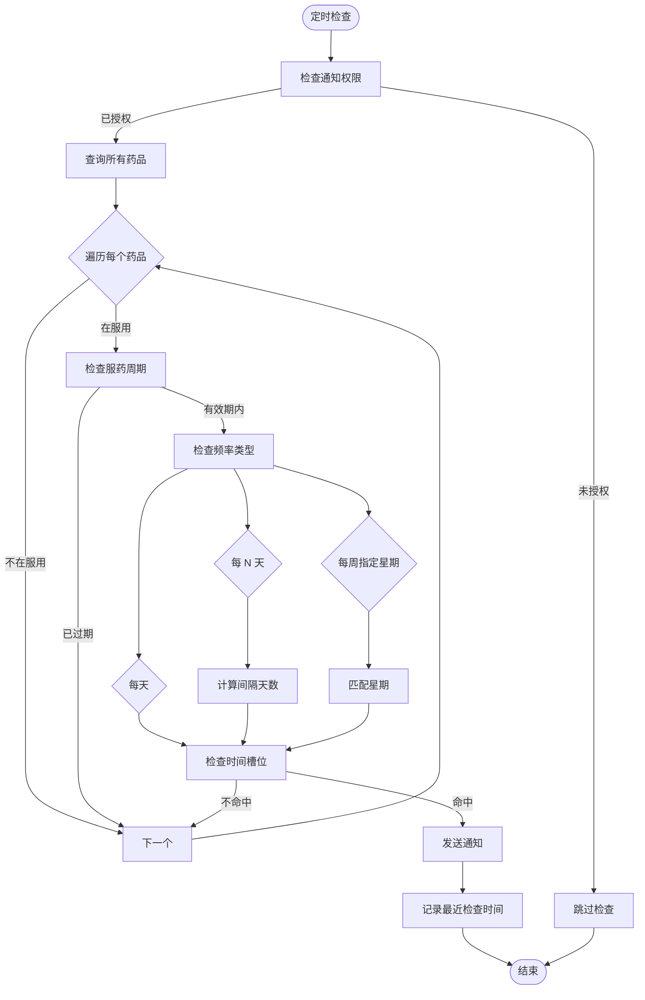
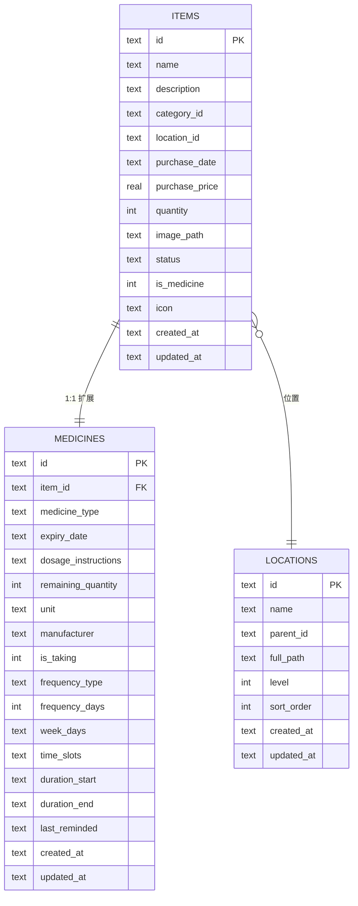
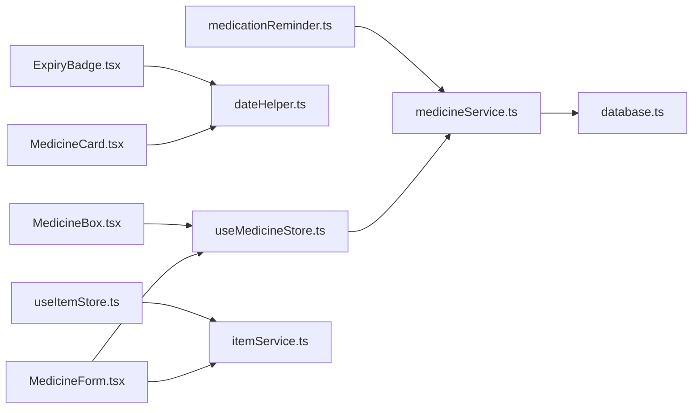

# 药品服务 API

<cite>
**本文档引用的文件**
- [src/services/medicineService.ts](file://src/services/medicineService.ts)
- [src/types/medicine.ts](file://src/types/medicine.ts)
- [src/stores/useMedicineStore.ts](file://src/stores/useMedicineStore.ts)
- [src/routes/MedicineForm.tsx](file://src/routes/MedicineForm.tsx)
- [src/components/medicine/MedicineCard.tsx](file://src/components/medicine/MedicineCard.tsx)
- [src/components/medicine/ExpiryBadge.tsx](file://src/components/medicine/ExpiryBadge.tsx)
- [src/routes/MedicineBox.tsx](file://src/routes/MedicineBox.tsx)
- [src/services/medicationReminder.ts](file://src/services/medicationReminder.ts)
- [src/services/database.ts](file://src/services/database.ts)
- [src/utils/dateHelper.ts](file://src/utils/dateHelper.ts)
- [src/utils/constants.ts](file://src/utils/constants.ts)
- [src/services/itemService.ts](file://src/services/itemService.ts)
- [src/stores/useItemStore.ts](file://src/stores/useItemStore.ts)
</cite>

## 目录
1. [简介](#简介)
2. [项目结构](#项目结构)
3. [核心组件](#核心组件)
4. [架构总览](#架构总览)
5. [详细组件分析](#详细组件分析)
6. [依赖关系分析](#依赖关系分析)
7. [性能考量](#性能考量)
8. [故障排查指南](#故障排查指南)
9. [结论](#结论)
10. [附录](#附录)

## 简介
本文件为 Assetly 家庭药箱模块的药品服务 API 参考文档，覆盖药品的增删改查（CRUD）接口、有效期与用量管理、状态与过期预警、用药提醒机制、以及药品与物品表的关联查询与数据同步策略。读者可据此理解前端表单如何提交数据、后端服务如何持久化与查询、以及提醒系统如何基于配置触发通知。

## 项目结构
围绕药品功能的关键文件组织如下：
- 服务层：药品服务、提醒服务、数据库与迁移
- 类型定义：药品数据模型与表单数据结构
- 存储层：Zustand 状态管理，封装 CRUD 与筛选
- 视图层：药箱列表、药品卡片、过期徽章、药品表单
- 工具层：日期工具、常量映射

图表来源
- [src/routes/MedicineBox.tsx:18-112](file://src/routes/MedicineBox.tsx#L18-L112)
- [src/routes/MedicineForm.tsx:33-401](file://src/routes/MedicineForm.tsx#L33-L401)
- [src/components/medicine/MedicineCard.tsx:14-147](file://src/components/medicine/MedicineCard.tsx#L14-L147)
- [src/components/medicine/ExpiryBadge.tsx:8-24](file://src/components/medicine/ExpiryBadge.tsx#L8-L24)
- [src/stores/useMedicineStore.ts:15-42](file://src/stores/useMedicineStore.ts#L15-L42)
- [src/stores/useItemStore.ts:23-52](file://src/stores/useItemStore.ts#L23-L52)
- [src/services/medicineService.ts:10-194](file://src/services/medicineService.ts#L10-L194)
- [src/services/medicationReminder.ts:53-132](file://src/services/medicationReminder.ts#L53-L132)
- [src/services/itemService.ts:121-126](file://src/services/itemService.ts#L121-L126)
- [src/services/database.ts:18-171](file://src/services/database.ts#L18-L171)
- [src/utils/dateHelper.ts:30-52](file://src/utils/dateHelper.ts#L30-L52)
- [src/utils/constants.ts:15-27](file://src/utils/constants.ts#L15-L27)
- [src/types/medicine.ts:7-70](file://src/types/medicine.ts#L7-L70)

章节来源
- [src/services/medicineService.ts:10-194](file://src/services/medicineService.ts#L10-L194)
- [src/types/medicine.ts:7-70](file://src/types/medicine.ts#L7-L70)
- [src/stores/useMedicineStore.ts:15-42](file://src/stores/useMedicineStore.ts#L15-L42)
- [src/routes/MedicineForm.tsx:33-401](file://src/routes/MedicineForm.tsx#L33-L401)
- [src/components/medicine/MedicineCard.tsx:14-147](file://src/components/medicine/MedicineCard.tsx#L14-L147)
- [src/components/medicine/ExpiryBadge.tsx:8-24](file://src/components/medicine/ExpiryBadge.tsx#L8-L24)
- [src/routes/MedicineBox.tsx:18-112](file://src/routes/MedicineBox.tsx#L18-L112)
- [src/services/medicationReminder.ts:53-132](file://src/services/medicationReminder.ts#L53-L132)
- [src/services/database.ts:18-171](file://src/services/database.ts#L18-L171)
- [src/utils/dateHelper.ts:30-52](file://src/utils/dateHelper.ts#L30-L52)
- [src/utils/constants.ts:15-27](file://src/utils/constants.ts#L15-L27)
- [src/services/itemService.ts:121-126](file://src/services/itemService.ts#L121-L126)
- [src/stores/useItemStore.ts:23-52](file://src/stores/useItemStore.ts#L23-L52)

## 核心组件
- 药品服务（medicineService）
  - 提供药品与物品关联查询、创建、更新、过期药品查询、正在服用药品查询等能力
- 药品类型与表单类型（types/medicine.ts）
  - 定义药品类型、频率类型、有效期状态、以及药品与物品合并后的查询结果结构
- 药品状态管理（useMedicineStore）
  - 封装药品列表加载、新增、更新、标签页切换等
- 用药提醒（medicationReminder）
  - 基于频率与时间槽位判断是否触发提醒，并通过系统通知推送
- 数据库与迁移（database.ts）
  - 定义 items 与 medicines 表结构及索引，支持药品扩展字段的迁移
- 日期工具（dateHelper.ts）
  - 计算有效期状态与标签，提供格式化与时间差计算
- 常量映射（constants.ts）
  - 药品类别标签与显示映射

章节来源
- [src/services/medicineService.ts:10-194](file://src/services/medicineService.ts#L10-L194)
- [src/types/medicine.ts:7-70](file://src/types/medicine.ts#L7-L70)
- [src/stores/useMedicineStore.ts:15-42](file://src/stores/useMedicineStore.ts#L15-L42)
- [src/services/medicationReminder.ts:53-132](file://src/services/medicationReminder.ts#L53-L132)
- [src/services/database.ts:104-171](file://src/services/database.ts#L104-L171)
- [src/utils/dateHelper.ts:30-52](file://src/utils/dateHelper.ts#L30-L52)
- [src/utils/constants.ts:15-27](file://src/utils/constants.ts#L15-L27)

## 架构总览
药品服务采用“服务层 + 存储层 + 视图层”的分层设计：
- 视图层负责用户交互与展示（药箱列表、药品卡片、过期徽章、药品表单）
- 存储层统一管理数据状态与调用服务
- 服务层封装数据库访问与业务逻辑（CRUD、查询、提醒）

图表来源
- [src/routes/MedicineBox.tsx:18-112](file://src/routes/MedicineBox.tsx#L18-L112)
- [src/routes/MedicineForm.tsx:66-80](file://src/routes/MedicineForm.tsx#L66-L80)
- [src/stores/useMedicineStore.ts:20-36](file://src/stores/useMedicineStore.ts#L20-L36)
- [src/services/medicineService.ts:10-194](file://src/services/medicineService.ts#L10-L194)
- [src/services/medicationReminder.ts:53-97](file://src/services/medicationReminder.ts#L53-L97)
- [src/services/database.ts:18-53](file://src/services/database.ts#L18-L53)

## 详细组件分析

### 药品 CRUD 接口
- createMedicine(data: MedicineFormData)
  - 功能：创建药品与物品记录，自动关联默认“药品保健”分类；返回新生成的 itemId 与 medicineId
  - 关键点：先插入 items，再插入 medicines；布尔值以整数形式写入 SQLite；记录创建/更新时间
  - 业务约束：必填字段包括名称与有效期；单位默认“片”
- updateMedicine(itemId: string, data: Partial<MedicineFormData>)
  - 功能：分别更新 items 与 medicines 中的对应字段，支持部分字段更新
  - 关键点：is_taking 字段转换为整数；动态拼接 SQL 参数，避免更新无关字段
- getAllMedicines(filter?: { type?: string; search?: string })
  - 功能：按类型与名称模糊搜索，关联查询物品详情与位置路径，按有效期升序排序
- getMedicineByItemId(itemId: string)
  - 功能：按物品 ID 查询药品详情（含物品信息与位置路径）
- getExpiringMedicines(withinDays: number)
  - 功能：查询未来若干天内到期且物品状态为“active”的药品
- getTakingMedicines()
  - 功能：查询正在服用（is_taking = 1）且物品状态为“active”的药品

章节来源
- [src/services/medicineService.ts:54-95](file://src/services/medicineService.ts#L54-L95)
- [src/services/medicineService.ts:97-162](file://src/services/medicineService.ts#L97-L162)
- [src/services/medicineService.ts:10-37](file://src/services/medicineService.ts#L10-L37)
- [src/services/medicineService.ts:39-52](file://src/services/medicineService.ts#L39-L52)
- [src/services/medicineService.ts:164-178](file://src/services/medicineService.ts#L164-L178)
- [src/services/medicineService.ts:180-193](file://src/services/medicineService.ts#L180-L193)

### 药品表单与数据校验
- 表单字段与默认值
  - 必填项：名称、有效期
  - 默认值：单位默认“片”、频率类型默认“每天”、是否正在服用默认关闭
- 字段处理
  - 余量与单价：数值输入，最小值为 0
  - 时间槽位：逗号分隔的时间字符串，支持添加/删除
  - 星期几：逗号分隔数字字符串，内部排序存储
  - 服用周期：起止日期范围
- 保存流程
  - 新增或更新时进行基础校验（名称非空、有效期存在），提交后刷新列表

章节来源
- [src/routes/MedicineForm.tsx:14-21](file://src/routes/MedicineForm.tsx#L14-L21)
- [src/routes/MedicineForm.tsx:66-80](file://src/routes/MedicineForm.tsx#L66-L80)
- [src/routes/MedicineForm.tsx:93-121](file://src/routes/MedicineForm.tsx#L93-L121)

### 药品与物品关联查询与数据同步
- 关联查询
  - 通过 JOIN items 与 LEFT JOIN locations 实现药品与物品详情、位置全路径的合并查询
- 删除同步
  - 删除物品会级联删除对应药品记录（medicines.item_id 外键约束）
- 状态过滤
  - 查询时仅返回物品状态为“active”的记录

章节来源
- [src/services/medicineService.ts:14-21](file://src/services/medicineService.ts#L14-L21)
- [src/services/medicineService.ts:41-48](file://src/services/medicineService.ts#L41-L48)
- [src/services/medicineService.ts:166-175](file://src/services/medicineService.ts#L166-L175)
- [src/services/itemService.ts:121-126](file://src/services/itemService.ts#L121-L126)

### 有效期、剂量与频次字段处理
- 有效期（expiry_date）
  - 用于排序与过期状态计算；查询中使用日期比较与排序
- 剂量与单位（remaining_quantity, unit）
  - 支持库存变更与显示；表单中提供余量输入与单位选择
- 频率与时间槽位（frequency_type, frequency_days, week_days, time_slots）
  - 频率类型：每天、每 N 天、每周指定星期几
  - week_days 与 time_slots 为逗号分隔字符串，内部解析与显示
- 说明文本（dosage_instructions）
  - 用于非正在服用状态下的用法提示
- 生产厂商（manufacturer）
  - 便于溯源与管理

章节来源
- [src/types/medicine.ts:7-27](file://src/types/medicine.ts#L7-L27)
- [src/routes/MedicineForm.tsx:190-223](file://src/routes/MedicineForm.tsx#L190-L223)
- [src/routes/MedicineForm.tsx:274-376](file://src/routes/MedicineForm.tsx#L274-L376)
- [src/components/medicine/MedicineCard.tsx:28-57](file://src/components/medicine/MedicineCard.tsx#L28-L57)

### 药品状态管理、过期预警与用药提醒
- 过期状态与标签
  - 通过 daysUntil 计算距离过期天数，划分安全/预警/过期三态
  - 展示层使用 ExpiryBadge 组件渲染不同颜色徽章
- 药箱页面统计
  - 统计过期与即将过期数量，顶部展示告警横幅
- 用药提醒
  - 定时器每分钟检查一次，根据频率类型与时间槽位判断是否触发
  - 支持通知权限申请与 Android 通知动作类型注册
  - 本地记录最近检查时间，避免同一分钟重复提醒

图表来源
- [src/services/medicationReminder.ts:53-97](file://src/services/medicationReminder.ts#L53-L97)
- [src/services/medicationReminder.ts:11-48](file://src/services/medicationReminder.ts#L11-L48)
- [src/utils/dateHelper.ts:30-43](file://src/utils/dateHelper.ts#L30-L43)

章节来源
- [src/components/medicine/ExpiryBadge.tsx:8-24](file://src/components/medicine/ExpiryBadge.tsx#L8-L24)
- [src/routes/MedicineBox.tsx:38-67](file://src/routes/MedicineBox.tsx#L38-L67)
- [src/services/medicationReminder.ts:53-132](file://src/services/medicationReminder.ts#L53-L132)
- [src/utils/dateHelper.ts:30-52](file://src/utils/dateHelper.ts#L30-L52)

### 药品查询接口详解
- getAllMedicines(filter)
  - 支持按类型过滤与名称模糊搜索；返回合并后的药品与物品信息
- getMedicineByItemId(itemId)
  - 单条药品详情查询，包含物品与位置信息
- getExpiringMedicines(withinDays)
  - 查询未来 withinDays 天内到期的“活动”状态药品
- getTakingMedicines()
  - 查询正在服用的“活动”状态药品，按创建时间倒序

章节来源
- [src/services/medicineService.ts:10-37](file://src/services/medicineService.ts#L10-L37)
- [src/services/medicineService.ts:39-52](file://src/services/medicineService.ts#L39-L52)
- [src/services/medicineService.ts:164-178](file://src/services/medicineService.ts#L164-L178)
- [src/services/medicineService.ts:180-193](file://src/services/medicineService.ts#L180-L193)

### 数据模型与索引
- 表结构要点
  - items：物品主表，包含名称、描述、分类、位置、购买信息、状态、是否药品等
  - medicines：药品扩展表，与 items 一对一关联（外键级联删除）
  - settings：应用设置表
- 索引
  - items：category_id、location_id、status
  - medicines：item_id、expiry_date、medicine_type
  - locations：parent_id
- 迁移
  - 版本 3 新增药品提醒相关字段（is_taking、frequency_*、time_slots、duration_*、last_reminded）

图表来源
- [src/services/database.ts:104-117](file://src/services/database.ts#L104-L117)
- [src/services/database.ts:124-131](file://src/services/database.ts#L124-L131)
- [src/services/database.ts:149-160](file://src/services/database.ts#L149-L160)

章节来源
- [src/services/database.ts:60-171](file://src/services/database.ts#L60-L171)

## 依赖关系分析
- 组件耦合
  - 视图层通过状态层间接依赖服务层，降低直接耦合
  - 药品服务依赖数据库服务与日期工具
  - 用药提醒依赖药品服务与通知插件
- 外部依赖
  - Tauri 通知插件用于系统通知
  - dayjs 用于日期计算与格式化
- 循环依赖
  - 未发现循环导入；各层职责清晰

图表来源
- [src/routes/MedicineForm.tsx:33-401](file://src/routes/MedicineForm.tsx#L33-L401)
- [src/routes/MedicineBox.tsx:18-112](file://src/routes/MedicineBox.tsx#L18-L112)
- [src/components/medicine/MedicineCard.tsx:14-147](file://src/components/medicine/MedicineCard.tsx#L14-L147)
- [src/components/medicine/ExpiryBadge.tsx:8-24](file://src/components/medicine/ExpiryBadge.tsx#L8-L24)
- [src/stores/useMedicineStore.ts:15-42](file://src/stores/useMedicineStore.ts#L15-L42)
- [src/stores/useItemStore.ts:23-52](file://src/stores/useItemStore.ts#L23-L52)
- [src/services/medicineService.ts:10-194](file://src/services/medicineService.ts#L10-L194)
- [src/services/medicationReminder.ts:53-132](file://src/services/medicationReminder.ts#L53-L132)
- [src/services/itemService.ts:121-126](file://src/services/itemService.ts#L121-L126)
- [src/services/database.ts:18-53](file://src/services/database.ts#L18-L53)
- [src/utils/dateHelper.ts:30-52](file://src/utils/dateHelper.ts#L30-L52)

## 性能考量
- 查询优化
  - 对 medicines.expiry_date 与 medicines.medicine_type 建有索引，有利于过期与类型筛选
  - 使用参数化查询，避免 SQL 注入风险
- 写入优化
  - create/update 分别更新 items 与 medicines，减少不必要的字段写入
  - 批量更新时仅拼接存在的字段，降低 SQL 复杂度
- 提醒检查
  - 每分钟检查一次，使用本地时间戳避免同分钟重复提醒
  - 未授权时快速跳过，避免阻塞

## 故障排查指南
- 无法收到用药提醒
  - 检查系统通知权限是否授予；若未授予，提醒服务会尝试请求权限
  - 确认药品处于“正在服用”状态且时间槽位不为空
  - 查看控制台日志中的权限状态与检查记录
- 药品列表为空
  - 检查 activeTab 是否限制了类型；确认物品状态为“active”
  - 确认数据库迁移是否完成，索引是否存在
- 有效期显示异常
  - 检查日期格式是否为 YYYY-MM-DD；确认 daysUntil 计算逻辑
- 删除药品后数据未同步
  - 确认删除物品时触发了级联删除；检查 medicines 外键约束

章节来源
- [src/services/medicationReminder.ts:55-66](file://src/services/medicationReminder.ts#L55-L66)
- [src/services/medicationReminder.ts:75-97](file://src/services/medicationReminder.ts#L75-L97)
- [src/services/database.ts:124-131](file://src/services/database.ts#L124-L131)
- [src/services/itemService.ts:121-126](file://src/services/itemService.ts#L121-L126)

## 结论
Assetly 的药品服务以清晰的分层架构实现了从表单到存储再到提醒的完整闭环。通过物品与药品的关联设计，既满足了通用资产管理，又提供了药品特有的有效期、用量、频次与提醒能力。建议在后续迭代中补充删除药品的直接接口与批量操作能力，并增强表单校验与错误反馈。

## 附录
- 常用查询与行为
  - 查询全部药品：getAllMedicines()
  - 按类型/名称过滤：filter.type 与 filter.search
  - 查询即将过期：getExpiringMedicines(30)
  - 查询正在服用：getTakingMedicines()
  - 新增/更新药品：createMedicine()/updateMedicine()
- 业务约束摘要
  - 名称与有效期为必填
  - is_taking 以整数形式存储
  - week_days 与 time_slots 为逗号分隔字符串
  - 删除物品会级联删除药品