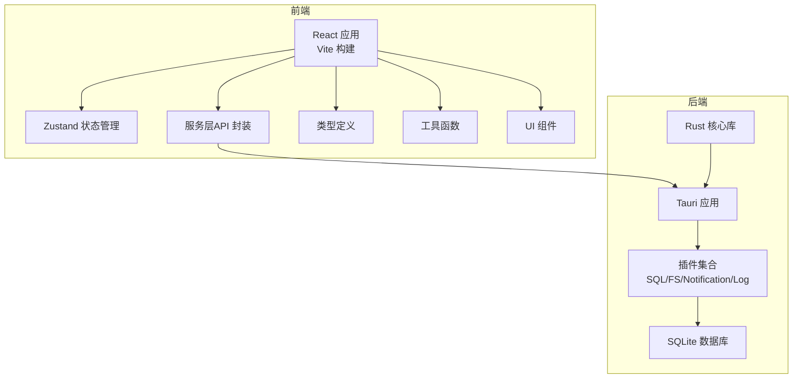
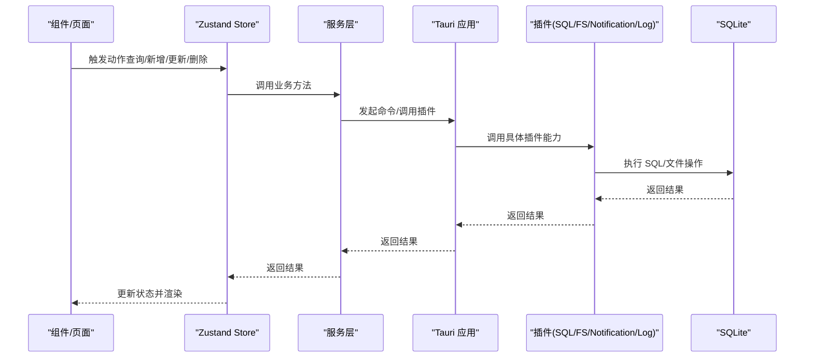
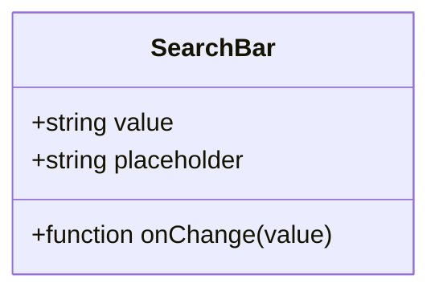
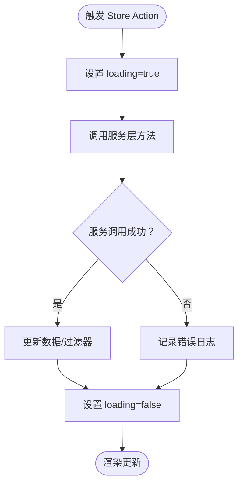
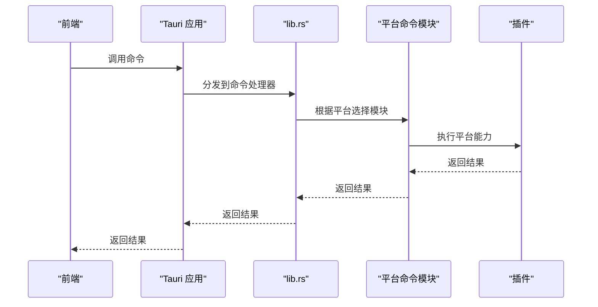
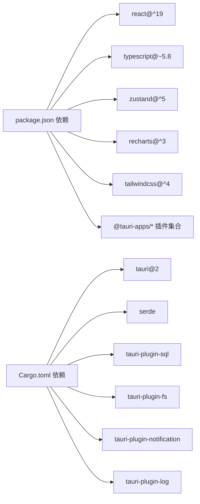

# 代码规范与最佳实践

<cite>
**本文引用的文件**
- [package.json](file://package.json)
- [tsconfig.json](file://tsconfig.json)
- [vite.config.ts](file://vite.config.ts)
- [README.md](file://README.md)
- [src/types/item.ts](file://src/types/item.ts)
- [src/types/category.ts](file://src/types/category.ts)
- [src/stores/useItemStore.ts](file://src/stores/useItemStore.ts)
- [src/services/itemService.ts](file://src/services/itemService.ts)
- [src/components/shared/SearchBar.tsx](file://src/components/shared/SearchBar.tsx)
- [src/lib/utils.ts](file://src/lib/utils.ts)
- [src/utils/constants.ts](file://src/utils/constants.ts)
- [src/utils/logger.ts](file://src/utils/logger.ts)
- [src-tauri/Cargo.toml](file://src-tauri/Cargo.toml)
- [src-tauri/src/lib.rs](file://src-tauri/src/lib.rs)
- [src-tauri/src/main.rs](file://src-tauri/src/main.rs)
</cite>

## 目录
1. [引言](#引言)
2. [项目结构](#项目结构)
3. [核心组件](#核心组件)
4. [架构概览](#架构概览)
5. [详细组件分析](#详细组件分析)
6. [依赖分析](#依赖分析)
7. [性能考虑](#性能考虑)
8. [故障排除指南](#故障排除指南)
9. [结论](#结论)
10. [附录](#附录)

## 引言
本指南面向 Assetly 项目的开发团队，旨在建立统一的代码规范与最佳实践，覆盖 TypeScript 编码、React 组件开发、Zustand 状态管理、Rust 后端以及代码格式化配置。文档以现有实现为依据，提炼可复用的模式，并提供可视化图表帮助理解。

## 项目结构
项目采用前后端分离架构：
- 前端（React + TypeScript + Vite + Zustand + Recharts + TailwindCSS）
- 后端（Tauri + Rust + SQLite）

**图表来源**
- [vite.config.ts:1-29](file://vite.config.ts#L1-L29)
- [src-tauri/src/lib.rs:1-49](file://src-tauri/src/lib.rs#L1-L49)
- [src-tauri/Cargo.toml:1-31](file://src-tauri/Cargo.toml#L1-L31)

**章节来源**
- [README.md:157-180](file://README.md#L157-L180)
- [vite.config.ts:1-29](file://vite.config.ts#L1-L29)
- [src-tauri/Cargo.toml:1-31](file://src-tauri/Cargo.toml#L1-L31)

## 核心组件
- 类型系统：通过明确的接口与字面量联合类型约束数据结构，确保跨层一致性。
- 服务层：封装数据库访问与业务逻辑，提供幂等的 CRUD 方法。
- 状态管理：基于 Zustand 的领域化 Store，集中管理页面状态与过滤条件。
- 日志系统：统一转发前端 console 到 Tauri 日志插件，支持内存缓存与持久化输出。
- 常量与配置：集中管理默认分类、状态标签、主题色与货币符号等常量。

**章节来源**
- [src/types/item.ts:1-46](file://src/types/item.ts#L1-L46)
- [src/types/category.ts:1-18](file://src/types/category.ts#L1-L18)
- [src/services/itemService.ts:1-127](file://src/services/itemService.ts#L1-L127)
- [src/stores/useItemStore.ts:1-53](file://src/stores/useItemStore.ts#L1-L53)
- [src/utils/logger.ts:1-84](file://src/utils/logger.ts#L1-L84)
- [src/utils/constants.ts:1-40](file://src/utils/constants.ts#L1-L40)

## 架构概览
前端通过服务层调用后端能力，后端以 Tauri 插件形式提供数据库、文件系统、通知与日志能力。

**图表来源**
- [src/stores/useItemStore.ts:1-53](file://src/stores/useItemStore.ts#L1-L53)
- [src/services/itemService.ts:1-127](file://src/services/itemService.ts#L1-L127)
- [src-tauri/src/lib.rs:1-49](file://src-tauri/src/lib.rs#L1-L49)

## 详细组件分析

### TypeScript 编码规范
- 命名约定
  - 接口与类型：采用名词短语或抽象概念，如 Item、Category、ItemWithDetails。
  - 字面量联合类型：使用语义化的字面量，如 ItemStatus。
  - 函数与方法：动词短语，如 getAllItems、createItem、updateItem、deleteItem。
- 接口定义
  - 明确区分只读视图与可编辑表单数据，如 Item 与 ItemFormData。
  - 使用可选属性表达可空场景，如 ItemWithDetails 中的可选关联字段。
- 类型注解
  - 参数与返回值显式标注类型，避免 any。
  - 使用 Partial<T> 表达部分更新场景。
- 错误处理模式
  - 服务层统一捕获异常并向 Store 或调用方传播。
  - 日志模块提供结构化日志与内存缓存，便于调试。

**章节来源**
- [src/types/item.ts:1-46](file://src/types/item.ts#L1-L46)
- [src/types/category.ts:1-18](file://src/types/category.ts#L1-L18)
- [src/services/itemService.ts:1-127](file://src/services/itemService.ts#L1-L127)
- [src/utils/logger.ts:1-84](file://src/utils/logger.ts#L1-L84)

### React 组件开发规范
- 函数式组件
  - 优先使用函数式组件与 Hooks，保持无副作用纯函数风格。
  - Props 明确类型，提供默认值与占位符。
- Hook 使用原则
  - 将状态提升至最近公共父组件或使用 Zustand Store。
  - 自定义 Hook 抽象复用逻辑，如 useItemStore。
- Props 设计
  - 以“行为回调 + 数据”分离，如 SearchBar 的 value 与 onChange。
  - 提供可选占位符与最小可用接口。
- 状态管理最佳实践
  - Store 仅存放 UI 与业务状态，不存放持久化数据。
  - 通过服务层进行数据持久化与校验。

**图表来源**
- [src/components/shared/SearchBar.tsx:1-31](file://src/components/shared/SearchBar.tsx#L1-L31)

**章节来源**
- [src/components/shared/SearchBar.tsx:1-31](file://src/components/shared/SearchBar.tsx#L1-L31)
- [src/stores/useItemStore.ts:1-53](file://src/stores/useItemStore.ts#L1-L53)

### Zustand 状态管理规范
- Store 设计模式
  - 按领域拆分 Store，如 useItemStore、useCategoryStore。
  - State 结构清晰：数据 + 加载状态 + 过滤条件。
- Action 定义
  - 异步 action 统一处理加载态与错误传播。
  - 通过 set/get 组合更新状态，避免直接修改。
- 状态更新策略
  - 读取最新状态使用 get()，批量更新使用一次 set。
  - 过滤器合并使用浅拷贝，避免意外覆盖。

**图表来源**
- [src/stores/useItemStore.ts:1-53](file://src/stores/useItemStore.ts#L1-L53)

**章节来源**
- [src/stores/useItemStore.ts:1-53](file://src/stores/useItemStore.ts#L1-L53)

### Rust 后端代码规范
- 模块组织
  - lib.rs 作为入口，集中注册插件与命令。
  - 平台特定命令拆分为不同模块，如 Android 与非 Android。
- 错误处理
  - 命令返回 Result<bool, String>，错误信息字符串化传递到前端。
- 性能优化
  - 通过静态库与动态库组合满足多平台需求。
  - 插件按需启用，减少运行时开销。

**图表来源**
- [src-tauri/src/lib.rs:1-49](file://src-tauri/src/lib.rs#L1-L49)
- [src-tauri/src/main.rs:1-7](file://src-tauri/src/main.rs#L1-L7)

**章节来源**
- [src-tauri/src/lib.rs:1-49](file://src-tauri/src/lib.rs#L1-L49)
- [src-tauri/src/main.rs:1-7](file://src-tauri/src/main.rs#L1-L7)
- [src-tauri/Cargo.toml:1-31](file://src-tauri/Cargo.toml#L1-L31)

### 代码格式化配置
- TypeScript/JS
  - 严格模式开启，启用未使用变量/参数检查，禁止 switch 穿透。
  - JSX 使用 react-jsx，模块解析采用 bundler。
- Vite
  - React 插件与 TailwindCSS 插件集成，热更新与端口配置合理。
- Rust
  - Cargo.toml 定义了库类型与依赖，遵循 Rust 2021 edition。

**章节来源**
- [tsconfig.json:1-26](file://tsconfig.json#L1-L26)
- [vite.config.ts:1-29](file://vite.config.ts#L1-L29)
- [src-tauri/Cargo.toml:1-31](file://src-tauri/Cargo.toml#L1-L31)

### 注释规范与文档编写标准
- 函数与方法
  - 使用 JSDoc 风格注释，说明用途、参数、返回值与异常。
- 类型定义
  - 对复杂接口提供简要说明，标注可选字段与默认值。
- 日志
  - 使用结构化日志，包含时间戳、级别、消息与来源。
- 文档
  - README 中的技术栈、项目结构与数据库设计应保持同步更新。

**章节来源**
- [src/utils/logger.ts:1-84](file://src/utils/logger.ts#L1-L84)
- [README.md:184-204](file://README.md#L184-L204)

### 代码审查检查清单
- TypeScript
  - 是否启用严格模式与未使用检查？
  - 类型注解是否完整且准确？
  - 是否存在 any 或隐式类型？
- React
  - 组件是否职责单一？Props 是否最小化？
  - 是否正确使用 Hooks，是否存在不必要的重渲染？
- Zustand
  - Store 是否按领域拆分？Action 是否异步处理？
  - 是否存在竞态条件或状态不一致？
- 服务层
  - 数据库操作是否参数化？SQL 是否可读且安全？
  - 是否记录关键日志以便排查？
- Rust
  - 插件是否按需启用？命令返回值是否处理错误？
  - 平台差异逻辑是否清晰？

**章节来源**
- [tsconfig.json:17-21](file://tsconfig.json#L17-L21)
- [src/services/itemService.ts:1-127](file://src/services/itemService.ts#L1-L127)
- [src/utils/logger.ts:1-84](file://src/utils/logger.ts#L1-L84)
- [src-tauri/src/lib.rs:1-49](file://src-tauri/src/lib.rs#L1-L49)

## 依赖分析
- 前端依赖
  - React 19、TypeScript 5.8、Zustand 5、Recharts 3、TailwindCSS 4。
  - Tauri 插件：fs、log、notification、sql。
- 后端依赖
  - Tauri 2、serde、tauri-plugin-sql、tauri-plugin-fs、tauri-plugin-notification、tauri-plugin-log。

**图表来源**
- [package.json:12-41](file://package.json#L12-L41)
- [src-tauri/Cargo.toml:20-30](file://src-tauri/Cargo.toml#L20-L30)

**章节来源**
- [package.json:12-41](file://package.json#L12-L41)
- [src-tauri/Cargo.toml:1-31](file://src-tauri/Cargo.toml#L1-L31)

## 性能考虑
- 前端
  - 使用 Tailwind 的原子类减少样式体积；避免过度嵌套。
  - 图表组件按需引入，减少打包体积。
  - Store 中的过滤器与分页策略降低渲染压力。
- 后端
  - 插件按需启用，避免不必要的初始化。
  - SQL 查询使用参数绑定，避免拼接与注入风险。
- 构建
  - Vite 的 HMR 与模块解析优化开发体验。
  - TypeScript 严格模式在编译期发现潜在问题。

[本节为通用指导，无需特定文件来源]

## 故障排除指南
- 日志查看
  - 使用日志模块提供的内存日志与持久化日志，定位问题。
  - 在前端初始化日志转发，在后端配置日志目标与级别。
- 数据库问题
  - 检查服务层 SQL 语句与参数绑定，确认表结构与迁移记录。
- 插件异常
  - 确认插件已正确注册与启用，命令返回值是否被正确处理。

**章节来源**
- [src/utils/logger.ts:1-84](file://src/utils/logger.ts#L1-L84)
- [src/services/itemService.ts:1-127](file://src/services/itemService.ts#L1-L127)
- [src-tauri/src/lib.rs:1-49](file://src-tauri/src/lib.rs#L1-L49)

## 结论
本规范以现有实现为基础，总结了 TypeScript、React、Zustand、Rust 与工具链的最佳实践。建议在后续迭代中持续完善类型体系、增强单元测试与 E2E 测试，并保持文档与代码同步更新。

[本节为总结性内容，无需特定文件来源]

## 附录
- 常量与默认值
  - 默认分类、状态标签、主题色与货币符号集中管理，便于维护与扩展。
- 工具函数
  - 样式合并工具函数 cn，统一类名拼接与冲突修复。

**章节来源**
- [src/utils/constants.ts:1-40](file://src/utils/constants.ts#L1-L40)
- [src/lib/utils.ts:1-7](file://src/lib/utils.ts#L1-L7)