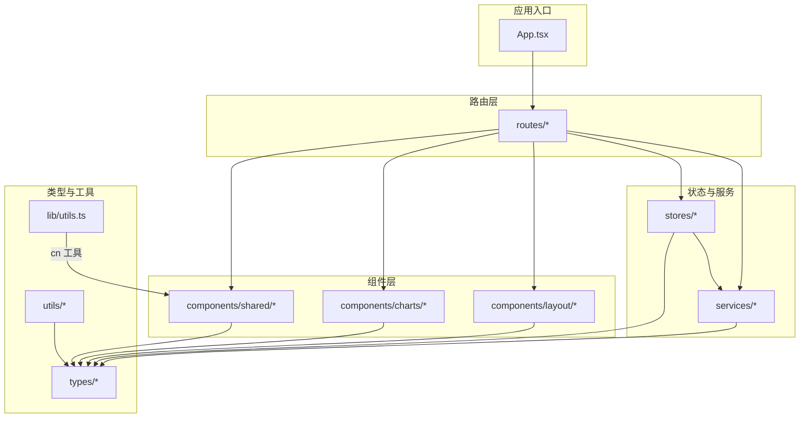
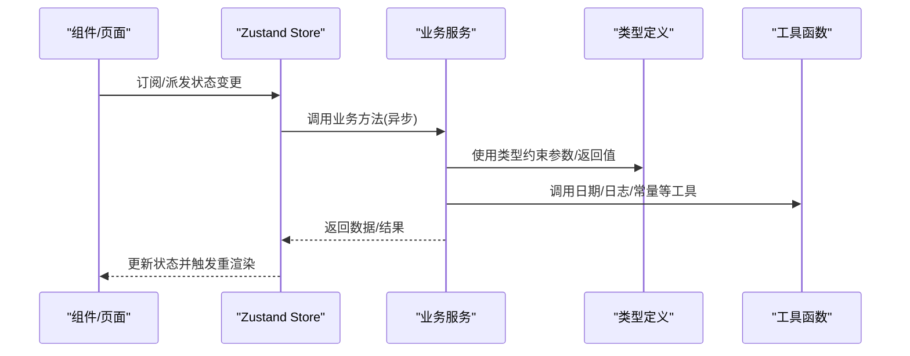
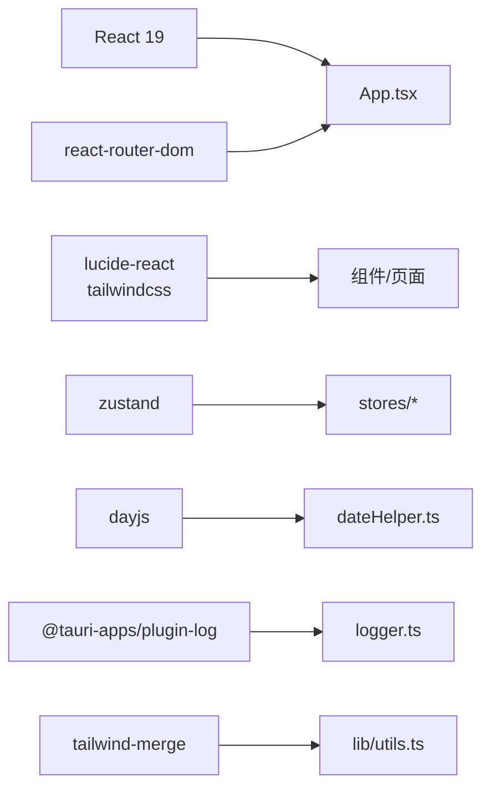
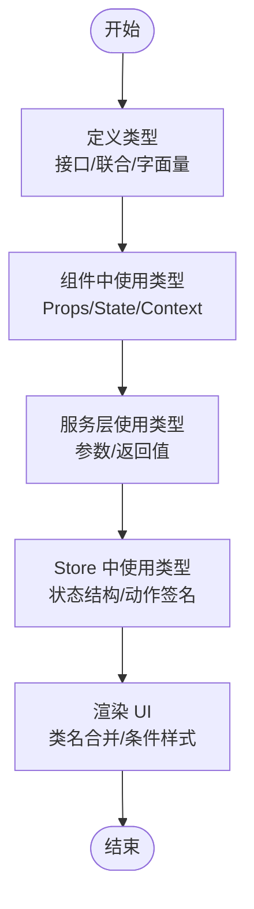

# 前端编码规范

<cite>
**本文引用的文件**
- [package.json](file://package.json)
- [tsconfig.json](file://tsconfig.json)
- [vite.config.ts](file://vite.config.ts)
- [src/lib/utils.ts](file://src/lib/utils.ts)
- [src/utils/constants.ts](file://src/utils/constants.ts)
- [src/types/category.ts](file://src/types/category.ts)
- [src/types/item.ts](file://src/types/item.ts)
- [src/components/shared/ConfirmDialog.tsx](file://src/components/shared/ConfirmDialog.tsx)
- [src/stores/useCategoryStore.ts](file://src/stores/useCategoryStore.ts)
- [src/services/categoryService.ts](file://src/services/categoryService.ts)
- [src/routes/Dashboard.tsx](file://src/routes/Dashboard.tsx)
- [src/utils/logger.ts](file://src/utils/logger.ts)
- [src/utils/dateHelper.ts](file://src/utils/dateHelper.ts)
- [src/App.tsx](file://src/App.tsx)
</cite>

## 目录
1. [简介](#简介)
2. [项目结构](#项目结构)
3. [核心组件](#核心组件)
4. [架构总览](#架构总览)
5. [详细组件分析](#详细组件分析)
6. [依赖分析](#依赖分析)
7. [性能考虑](#性能考虑)
8. [故障排查指南](#故障排查指南)
9. [结论](#结论)
10. [附录](#附录)

## 简介
本规范面向 Assetly 前端团队，统一 TypeScript 编码风格、React 组件开发范式、Tailwind CSS 类名合并工具使用、代码格式化与校验策略，并提供注释与文档字符串标准及代码审查清单。目标是提升代码一致性、可读性与可维护性。

## 项目结构
- 采用按功能域分层的组织方式：components（通用 UI）、routes（页面路由）、services（业务服务）、stores（状态管理）、types（类型定义）、utils（工具函数）、lib/utils.ts（全局工具）。
- 构建与运行：Vite + React + TailwindCSS；TypeScript 编译严格模式；Zustand 状态管理；Radix UI、Lucide React 提供基础 UI 能力；Tailwind Merge 与 clsx 合并类名。

图表来源
- [src/App.tsx:18-92](file://src/App.tsx#L18-L92)
- [src/routes/Dashboard.tsx:13-235](file://src/routes/Dashboard.tsx#L13-L235)
- [src/lib/utils.ts:1-7](file://src/lib/utils.ts#L1-L7)

章节来源
- [package.json:1-43](file://package.json#L1-L43)
- [tsconfig.json:1-26](file://tsconfig.json#L1-L26)
- [vite.config.ts:1-29](file://vite.config.ts#L1-L29)

## 核心组件
- Tailwind 类名合并工具：通过 cn(...) 将多个输入合并为最终类名，确保样式覆盖顺序正确且避免冲突。
- 常量与标签：在 constants.ts 中集中定义默认分类、药品类型标签、物品状态标签、主题色板与货币符号等，便于统一管理与复用。
- 日志与时间工具：logger.ts 提供控制台到 Tauri 日志插件的桥接与内存日志缓存；dateHelper.ts 提供日期格式化、相对天数计算与过期状态判定。

章节来源
- [src/lib/utils.ts:1-7](file://src/lib/utils.ts#L1-L7)
- [src/utils/constants.ts:1-40](file://src/utils/constants.ts#L1-L40)
- [src/utils/logger.ts:1-84](file://src/utils/logger.ts#L1-L84)
- [src/utils/dateHelper.ts:1-52](file://src/utils/dateHelper.ts#L1-L52)

## 架构总览
应用采用“路由 → 组件 → 状态/服务 → 类型/工具”的分层架构。组件通过 Zustand Store 获取或更新状态，调用 service 层进行数据访问，使用 utils 与 lib 工具完成渲染与逻辑处理。

图表来源
- [src/stores/useCategoryStore.ts:14-44](file://src/stores/useCategoryStore.ts#L14-L44)
- [src/services/categoryService.ts:9-59](file://src/services/categoryService.ts#L9-L59)
- [src/types/category.ts:3-18](file://src/types/category.ts#L3-L18)
- [src/utils/dateHelper.ts:14-16](file://src/utils/dateHelper.ts#L14-L16)

## 详细组件分析

### TypeScript 编码规范
- 命名约定
  - 接口与类型别名：使用名词短语，首字母大写，如 Category、ItemStatus。
  - 类型导出：优先使用类型别名表达简单联合或字面量，接口用于复杂对象结构。
  - 变量/函数：采用小驼峰，布尔变量以 is_/has_/can_ 前缀增强可读性。
- 类型注解最佳实践
  - 显式声明函数参数与返回值类型，避免 any。
  - 使用只读类型（readonly）与字面量类型（如 'active' | 'archived' | 'disposed'）减少错误。
  - 对外暴露的公共类型尽量收敛，避免过度开放。
- 错误处理模式
  - 异步操作使用 try/catch 包裹，记录日志并反馈用户。
  - 在组件中对加载态与空态进行显式处理，避免未定义渲染。
- 模块导入导出规则
  - 统一使用相对路径导入，避免隐式解析歧义。
  - 类型与实现分离：类型定义放在 types 目录，实现放在对应目录。

章节来源
- [src/types/category.ts:3-18](file://src/types/category.ts#L3-L18)
- [src/types/item.ts:3-46](file://src/types/item.ts#L3-L46)
- [src/routes/Dashboard.tsx:24-31](file://src/routes/Dashboard.tsx#L24-L31)
- [src/utils/logger.ts:57-75](file://src/utils/logger.ts#L57-L75)

### React 组件开发规范
- 函数式组件编写原则
  - 优先使用函数式组件与 Hooks，避免类组件。
  - 将纯展示组件与容器组件分离，保持组件职责单一。
- Hook 使用规范
  - useState：仅存放与 UI 直接相关的状态；复杂状态拆分为多个 useState 或使用 Zustand。
  - useEffect：确保清理副作用；依赖数组最小化；长任务拆分为子任务。
  - useMemo/useCallback：对昂贵计算或回调进行缓存，避免不必要的重渲染。
- Props 设计模式
  - 使用明确的 Props 接口，提供默认值与可选属性；必要时使用 Partial 或 Pick 精简接口。
  - 子组件通过 Props 传递行为（回调），避免直接访问父组件内部状态。
- 组件状态管理
  - 全局状态使用 Zustand Store；局部状态使用 useState。
  - Store 内部封装 CRUD 逻辑，组件只负责订阅与派发。

章节来源
- [src/routes/Dashboard.tsx:13-235](file://src/routes/Dashboard.tsx#L13-L235)
- [src/stores/useCategoryStore.ts:14-44](file://src/stores/useCategoryStore.ts#L14-L44)
- [src/components/shared/ConfirmDialog.tsx:3-12](file://src/components/shared/ConfirmDialog.tsx#L3-L12)

### Tailwind CSS 类名合并工具使用规范
- 使用 cn(...) 合并类名，支持多输入与条件组合，避免重复与冲突。
- 优先使用语义化类名与主题变量，配合 twMerge 实现后写覆盖前写。
- 不在组件内部拼接硬编码字符串类名，统一通过 cn(...) 传入。

章节来源
- [src/lib/utils.ts:4-6](file://src/lib/utils.ts#L4-L6)

### 代码格式化与编译配置
- ESLint 与 Prettier
  - 本仓库未提供独立 ESLint 配置文件与 Prettier 配置文件，请在根目录新增 .eslintrc.* 与 .prettierrc，遵循以下建议：
    - 规则：启用 @typescript-eslint、eslint-plugin-react-hooks、tailwindcss 插件；开启 no-unused-vars、no-explicit-any、prefer-const 等。
    - 格式：单引号、尾逗号、分号可选、行尾无空格；最大列宽 100。
    - 文件忽略：node_modules、dist、build、*.min.js。
- TypeScript 编译选项
  - 当前配置已启用严格模式、未使用本地变量/参数检测、switch 穷举检测，建议补充：
    - noImplicitReturns、noFallthroughCasesInSwitch、strictNullChecks、forceConsistentCasingInFileNames。
    - moduleResolution 使用 bundler，jsx 使用 react-jsx，noEmit 由 Vite 处理。
- Vite 配置
  - 已集成 @vitejs/plugin-react 与 @tailwindcss/vite；开发服务器端口与 HMR 配置合理；排除 Tauri 目录监听。

章节来源
- [tsconfig.json:2-22](file://tsconfig.json#L2-L22)
- [vite.config.ts:9-28](file://vite.config.ts#L9-L28)
- [package.json:6-11](file://package.json#L6-L11)

### 注释规范与文档字符串标准
- 文件级注释：在文件顶部简述用途、作者、变更历史。
- 函数/方法注释：说明入参、返回值、异常、注意事项与使用示例。
- 类型注释：接口字段逐条注释，枚举/联合类型给出取值含义。
- 常量注释：枚举/映射常量需标注键值含义与来源。
- 日志注释：错误日志包含上下文信息与来源模块。

章节来源
- [src/utils/constants.ts:3-13](file://src/utils/constants.ts#L3-L13)
- [src/utils/logger.ts:3-25](file://src/utils/logger.ts#L3-L25)

### 代码审查检查清单
- 类型安全
  - 是否存在 any/unknown 的滥用？是否使用了合适的类型断言？
  - 接口字段是否完整？可选字段是否正确标记？
- 组件质量
  - 是否存在重复逻辑？是否拆分为更小的子组件？
  - Props 是否清晰、默认值是否合理？是否存在过度渲染？
- 状态管理
  - 全局状态是否集中在 Store？副作用是否在 useEffect 中清理？
  - 数据流是否可追踪？是否存在竞态条件？
- 性能
  - 是否使用 useMemo/useCallback 缓存昂贵计算或回调？
  - 列表渲染是否使用稳定 key？是否避免不必要的重渲染？
- 可维护性
  - 常量是否集中管理？是否使用 cn(...) 合并类名？
  - 错误处理是否完善？日志是否包含足够上下文？

## 依赖分析
- 前端依赖
  - React 19、React Router DOM、Lucide React、Recharts、Tailwind CSS v4、clsx、tailwind-merge、class-variance-authority、dayjs、@tauri-apps/*。
- 开发依赖
  - @vitejs/plugin-react、@tailwindcss/vite、typescript、vite。
- 关键外部能力
  - Tauri 日志插件：通过 logger.ts 将浏览器 console 输出转发至桌面端日志系统。
  - 药品提醒：通过 medicationReminder 启动定时任务，App.tsx 中初始化与清理。

图表来源
- [package.json:12-31](file://package.json#L12-L31)
- [src/App.tsx:15-27](file://src/App.tsx#L15-L27)
- [src/utils/logger.ts:1-1](file://src/utils/logger.ts#L1-L1)
- [src/lib/utils.ts:1-2](file://src/lib/utils.ts#L1-L2)

章节来源
- [package.json:12-41](file://package.json#L12-L41)
- [src/App.tsx:15-27](file://src/App.tsx#L15-L27)

## 性能考虑
- 渲染优化
  - 使用 React.memo 包装重型子组件；对 props 进行浅比较；避免在渲染期间创建新对象/函数。
  - 列表渲染使用唯一 key；虚拟列表用于超大数据集。
- 状态与数据流
  - 将可缓存的数据放入 Store；避免在组件内频繁发起网络请求。
  - 使用 useMemo/useCallback 缓存计算结果与回调。
- 时间与日期
  - 使用 dayjs 进行日期计算与格式化，避免原生 Date 的时区与精度问题。
- 样式合并
  - 使用 cn(...) 合并类名，减少无效样式叠加导致的重绘。

## 故障排查指南
- 日志定位
  - 使用 logger.ts 的 logInfo/logError/logWarn/logDebug 输出关键事件与错误；结合 getMemoryLogs() 获取最近日志。
- 错误处理
  - 在组件中捕获异步错误，记录日志并提示用户；避免静默失败。
- 环境差异
  - 开发环境与生产环境的 HMR、端口与 host 配置不同，注意区分。

章节来源
- [src/utils/logger.ts:57-84](file://src/utils/logger.ts#L57-L84)
- [src/routes/Dashboard.tsx:24-31](file://src/routes/Dashboard.tsx#L24-L31)
- [vite.config.ts:13-27](file://vite.config.ts#L13-L27)

## 结论
本规范基于现有代码库提炼出统一的 TypeScript、React 与样式工具使用标准，并配套日志与错误处理策略。建议在团队内推广并持续演进，确保代码质量与协作效率。

## 附录

### 类型与状态流程图（概念）
