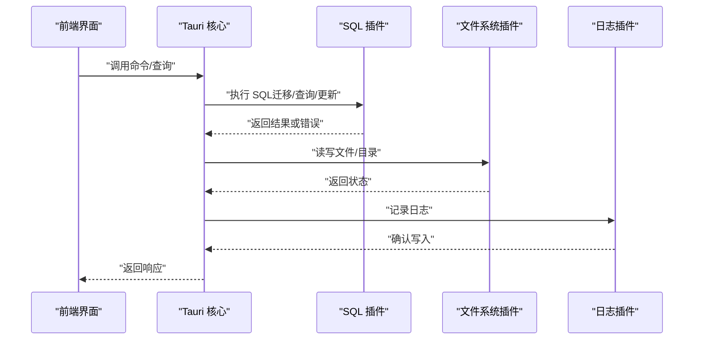
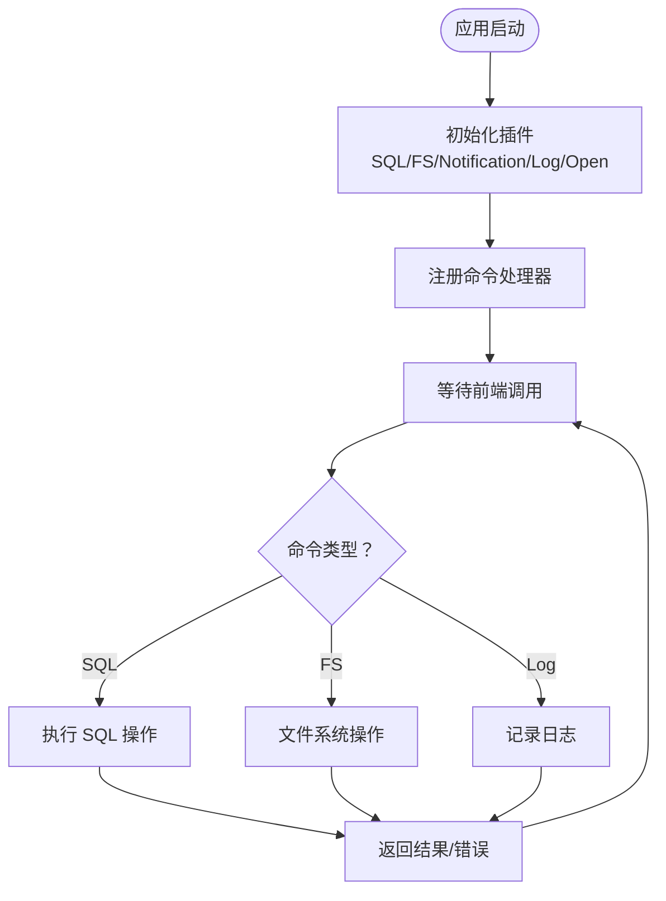
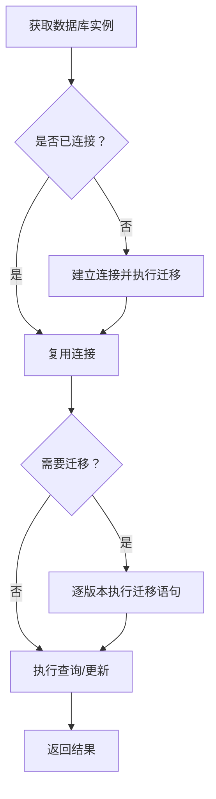
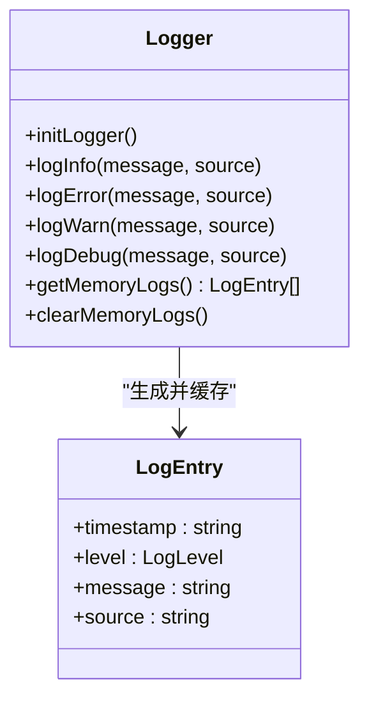
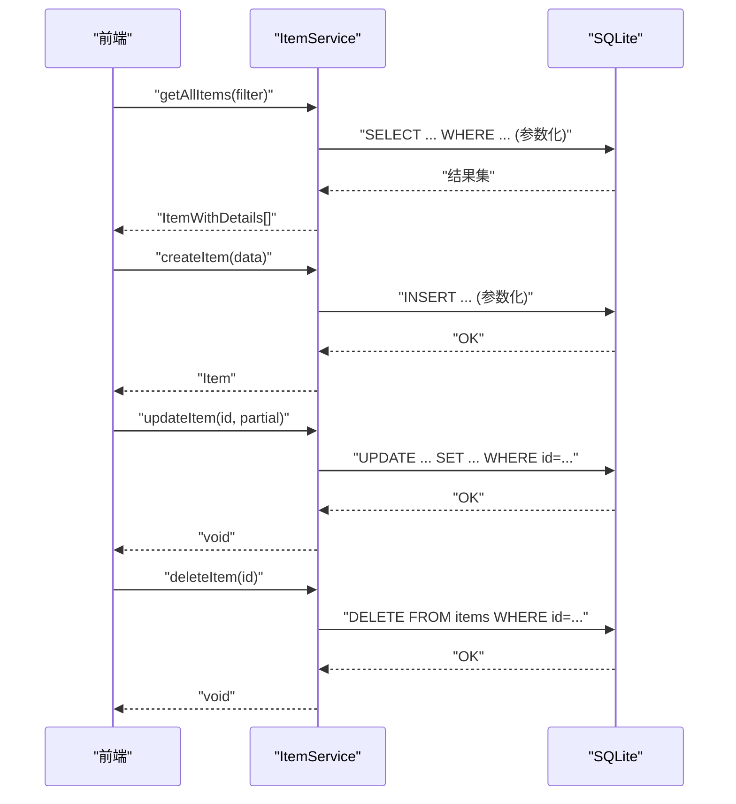
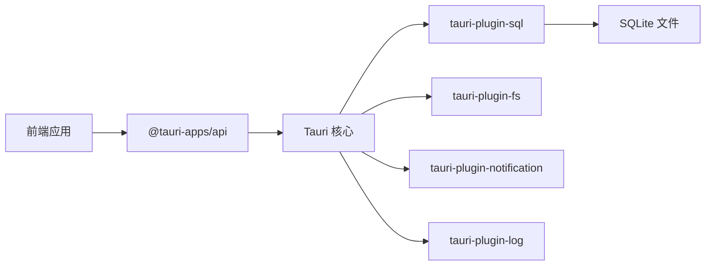

# 后端编码规范

<cite>
**本文档引用的文件**
- [Cargo.toml](file://src-tauri/Cargo.toml)
- [main.rs](file://src-tauri/src/main.rs)
- [lib.rs](file://src-tauri/src/lib.rs)
- [tauri.conf.json](file://src-tauri/tauri.conf.json)
- [default.json](file://src-tauri/capabilities/default.json)
- [build.rs](file://src-tauri/build.rs)
- [package.json](file://package.json)
- [database.ts](file://src/services/database.ts)
- [logger.ts](file://src/utils/logger.ts)
- [itemService.ts](file://src/services/itemService.ts)
- [constants.ts](file://src/utils/constants.ts)
- [dateHelper.ts](file://src/utils/dateHelper.ts)
- [item.ts](file://src/types/item.ts)
</cite>

## 目录
1. [引言](#引言)
2. [项目结构](#项目结构)
3. [核心组件](#核心-components)
4. [架构总览](#架构总览)
5. [详细组件分析](#详细组件分析)
6. [依赖关系分析](#依赖关系分析)
7. [性能考量](#性能考量)
8. [故障排查指南](#故障排查指南)
9. [结论](#结论)
10. [附录](#附录)

## 引言
本规范旨在为 Assetly 项目的后端与 Tauri 层提供统一的编码标准，覆盖 Rust 命名约定、所有权与借用规则、错误处理模式、并发最佳实践；Tauri 应用的命令定义、前后端通信协议、权限配置与安全考虑；数据库操作规范（SQL 查询优化、事务处理、连接池管理）；以及 Cargo 项目管理（依赖管理、版本控制、构建配置）。同时给出日志记录规范、错误报告机制与性能监控策略，帮助团队在保证一致性的同时提升可维护性与安全性。

## 项目结构
项目采用前端（React + Vite）与后端（Tauri + Rust）分离的双层架构：
- 前端位于 src 目录，使用 React 19、Vite 7、TypeScript 5 进行开发与打包，并通过 @tauri-apps/api 与后端通信。
- 后端位于 src-tauri 目录，使用 Tauri 2、Rust 2021 edition，通过插件体系提供文件系统、SQL、通知、日志等能力。
- 数据库采用 SQLite，通过 @tauri-apps/plugin-sql 在前端进行迁移与查询，后端通过 tauri-plugin-sql 提供 SQL 能力。

```mermaid
graph TB
subgraph "前端"
FE_App["React 应用<br/>Vite 构建"]
FE_SQL["@tauri-apps/plugin-sql"]
FE_FS["@tauri-apps/plugin-fs"]
FE_Notif["@tauri-apps/plugin-notification"]
FE_Log["@tauri-apps/plugin-log"]
end
subgraph "后端"
Tauri_Core["Tauri 2 核心"]
Rust_Lib["Rust 库资产<br/>assetly_lib"]
Plugins["插件集合<br/>SQL/FS/Notification/Log/Open"]
end
FE_App --> FE_SQL
FE_App --> FE_FS
FE_App --> FE_Notif
FE_App --> FE_Log
FE_App <- --> Tauri_Core
Tauri_Core --> Rust_Lib
Rust_Lib --> Plugins
```

图表来源
- [package.json:12-31](file://package.json#L12-L31)
- [lib.rs:3-25](file://src-tauri/src/lib.rs#L3-L25)
- [Cargo.toml:20-30](file://src-tauri/Cargo.toml#L20-L30)

章节来源
- [package.json:1-43](file://package.json#L1-L43)
- [tauri.conf.json:1-40](file://src-tauri/tauri.conf.json#L1-L40)

## 核心组件
- Tauri 应用入口与生命周期：通过 main.rs 启动应用，lib.rs 配置插件与命令处理器。
- 数据库服务：前端通过 @tauri-apps/plugin-sql 初始化 SQLite 并执行迁移；后端通过 tauri-plugin-sql 提供 SQL 能力。
- 日志服务：封装 Tauri 日志插件，支持内存缓存与多目标输出（文件与 stdout）。
- 业务服务：以 itemService 为例，展示 CRUD 操作、参数化查询与数据映射。
- 类型与常量：统一的数据模型与默认配置，确保前后端一致性。

章节来源
- [main.rs:4-6](file://src-tauri/src/main.rs#L4-L6)
- [lib.rs:1-49](file://src-tauri/src/lib.rs#L1-L49)
- [database.ts:1-171](file://src/services/database.ts#L1-L171)
- [logger.ts:1-84](file://src/utils/logger.ts#L1-L84)
- [itemService.ts:1-127](file://src/services/itemService.ts#L1-L127)
- [constants.ts:1-40](file://src/utils/constants.ts#L1-L40)

## 架构总览
下图展示了前端与后端之间的交互流程，包括命令调用、SQL 访问、文件系统与日志输出。



图表来源
- [lib.rs:3-25](file://src-tauri/src/lib.rs#L3-L25)
- [database.ts:18-53](file://src/services/database.ts#L18-L53)
- [logger.ts:57-75](file://src/utils/logger.ts#L57-L75)

## 详细组件分析

### Rust 命名约定与所有权/借用规则
- 模块与 crate：库模块命名为 assetly_lib，导出 run 函数作为入口；二进制入口调用该函数。
- 命名风格：遵循 Rust 社区惯例，使用 snake_case 命名函数与变量，常量使用 UPPER_SNAKE_CASE。
- 所有权与借用：在命令处理中，仅传递必要引用（如字符串切片），避免不必要的所有权转移；对共享状态通过异步安全方式访问。
- 错误处理：命令返回 Result 类型，错误信息以字符串形式返回，便于前端处理。

章节来源
- [lib.rs:1-49](file://src-tauri/src/lib.rs#L1-L49)
- [main.rs:4-6](file://src-tauri/src/main.rs#L4-L6)

### Tauri 应用开发规范
- 命令定义：使用 #[command] 宏声明命令，按平台区分实现（Android 与非 Android）。
- 前后端通信协议：前端通过 @tauri-apps/api 发起调用，后端通过 generate_handler 注册命令。
- 权限配置：capabilities/default.json 明确列出允许的权限范围，限制文件系统访问路径与 SQL 操作。
- 安全考虑：禁用不必要的 CSP，严格控制文件系统作用域，确保日志级别与输出目标可控。



图表来源
- [lib.rs:3-25](file://src-tauri/src/lib.rs#L3-L25)
- [default.json:6-35](file://src-tauri/capabilities/default.json#L6-L35)

章节来源
- [lib.rs:28-48](file://src-tauri/src/lib.rs#L28-L48)
- [tauri.conf.json:24-26](file://src-tauri/tauri.conf.json#L24-L26)
- [default.json:1-37](file://src-tauri/capabilities/default.json#L1-L37)

### 数据库操作规范
- 连接与迁移：首次访问时建立 SQLite 连接并执行迁移；迁移表记录版本号与时间戳。
- SQL 查询优化：使用参数化查询防止注入；为高频字段建立索引；分页与条件过滤通过参数拼接实现。
- 事务处理：当前实现未显式使用事务；建议对批量写入或跨表更新使用事务以保证一致性。
- 连接池管理：SQLite 为单进程文件型数据库，不适用传统连接池；可通过插件配置与并发控制避免竞争。



图表来源
- [database.ts:8-16](file://src/services/database.ts#L8-L16)
- [database.ts:18-53](file://src/services/database.ts#L18-L53)

章节来源
- [database.ts:1-171](file://src/services/database.ts#L1-L171)

### 日志记录规范
- 统一日志接口：封装 info、error、warn、debug、trace，支持结构化日志条目与内存缓存。
- 输出目标：同时输出到文件与 stdout，便于开发调试与生产审计。
- 使用建议：在关键路径（连接、迁移、CRUD）记录日志；错误日志包含上下文信息与堆栈摘要。



图表来源
- [logger.ts:7-25](file://src/utils/logger.ts#L7-L25)
- [logger.ts:35-83](file://src/utils/logger.ts#L35-L83)

章节来源
- [logger.ts:1-84](file://src/utils/logger.ts#L1-L84)

### 业务服务示例：ItemService
- 参数化查询：所有写入与筛选均使用参数占位符，避免 SQL 注入风险。
- 动态字段更新：根据传入字段动态构造 UPDATE 语句，减少冗余写入。
- 级联删除：删除物品时，关联的药品通过外键约束级联删除。



图表来源
- [itemService.ts:10-44](file://src/services/itemService.ts#L10-L44)
- [itemService.ts:60-87](file://src/services/itemService.ts#L60-L87)
- [itemService.ts:89-119](file://src/services/itemService.ts#L89-L119)
- [itemService.ts:121-126](file://src/services/itemService.ts#L121-L126)

章节来源
- [itemService.ts:1-127](file://src/services/itemService.ts#L1-L127)
- [item.ts:1-46](file://src/types/item.ts#L1-L46)

### Cargo 项目管理规范
- 依赖管理：明确列出核心依赖（tauri、serde、tauri-plugin-*），保持版本稳定。
- 构建配置：使用 tauri-build 与 tauri_build::build()，确保资源与能力文件正确打包。
- 版本控制：包版本与应用版本保持一致，便于发布追踪。

章节来源
- [Cargo.toml:1-31](file://src-tauri/Cargo.toml#L1-L31)
- [build.rs:1-4](file://src-tauri/build.rs#L1-L4)

## 依赖关系分析
- 前端依赖：React 生态与 @tauri-apps/* 插件，负责 UI 渲染与原生能力调用。
- 后端依赖：Tauri 2 核心与各类插件，提供系统集成能力。
- 数据库依赖：SQLite 文件与 @tauri-apps/plugin-sql 的组合，满足本地存储需求。



图表来源
- [package.json:12-31](file://package.json#L12-L31)
- [Cargo.toml:20-30](file://src-tauri/Cargo.toml#L20-L30)

章节来源
- [package.json:1-43](file://package.json#L1-L43)
- [Cargo.toml:1-31](file://src-tauri/Cargo.toml#L1-L31)

## 性能考量
- SQL 查询优化：使用参数化查询与索引；避免一次性加载大量数据，优先使用分页与条件过滤。
- 日志开销控制：限制内存日志数量，避免频繁 IO；生产环境适当降低日志级别。
- 并发与锁：SQLite 为单进程文件型数据库，避免高并发写入；如需更高吞吐，考虑引入 WAL 模式或替换为更强大的数据库。
- 构建与打包：合理配置 Vite 与 Tauri CLI，启用压缩与缓存，缩短构建时间。

## 故障排查指南
- 数据库迁移失败：检查迁移语句与版本号，查看日志中的错误摘要；确认 SQLite 文件权限与路径。
- 前端无法调用命令：确认命令已在 generate_handler 中注册，且权限配置允许相应操作。
- 日志缺失：检查日志插件初始化与目标配置，确认应用运行目录具有写权限。
- 权限被拒绝：核对 capabilities/default.json 中的作用域与权限标识，确保仅开放必要能力。

章节来源
- [database.ts:38-45](file://src/services/database.ts#L38-L45)
- [lib.rs:21-23](file://src-tauri/src/lib.rs#L21-L23)
- [logger.ts:57-75](file://src/utils/logger.ts#L57-L75)
- [default.json:6-35](file://src-tauri/capabilities/default.json#L6-L35)

## 结论
本规范从命名约定、所有权与借用、错误处理与并发实践，到 Tauri 命令与权限、数据库操作与日志记录，提供了 Assetly 后端的完整编码指引。建议在实际开发中严格遵循上述规范，并结合项目演进持续优化性能与安全性。

## 附录
- 常量与标签：默认分类、货币符号、主题色预设等，确保界面与数据一致性。
- 时间辅助：日期格式化、到期状态计算与月份键生成，便于统计与提醒逻辑。

章节来源
- [constants.ts:1-40](file://src/utils/constants.ts#L1-L40)
- [dateHelper.ts:1-52](file://src/utils/dateHelper.ts#L1-L52)