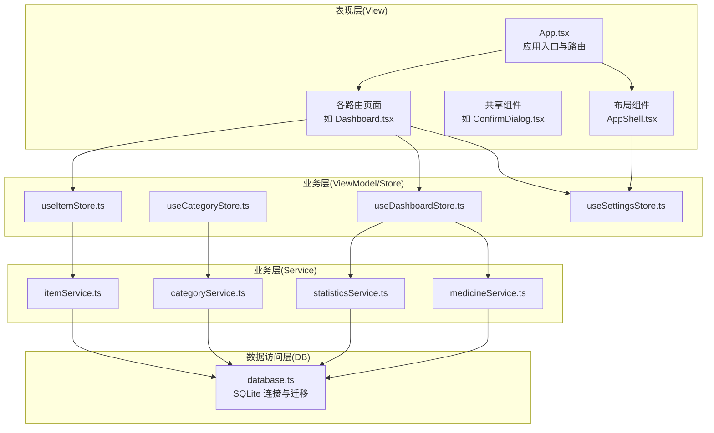
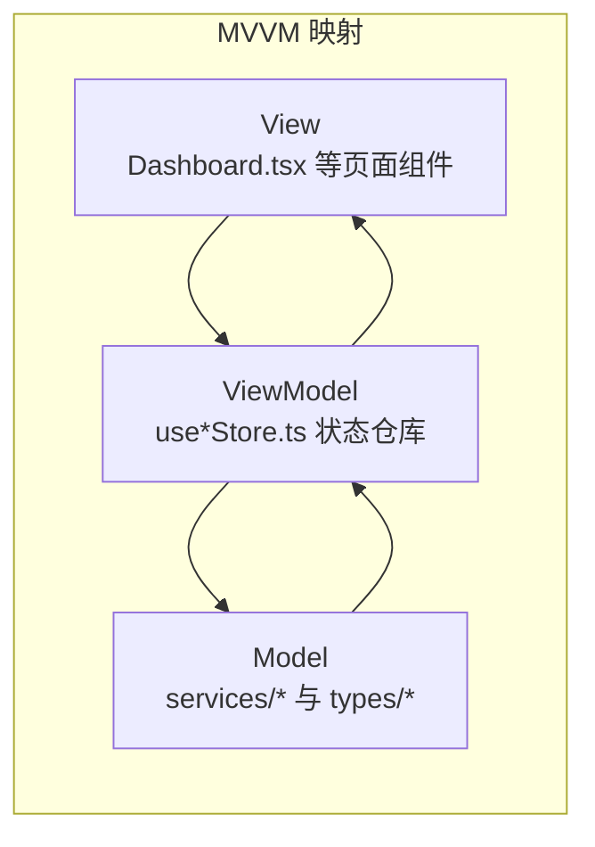
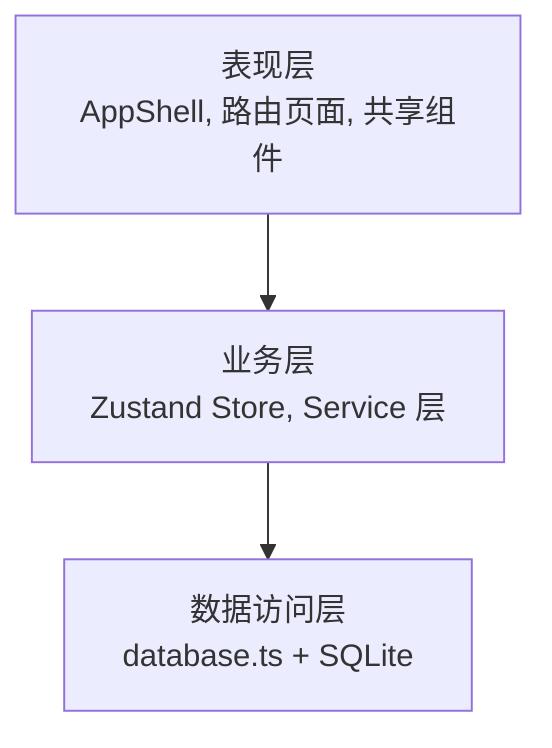
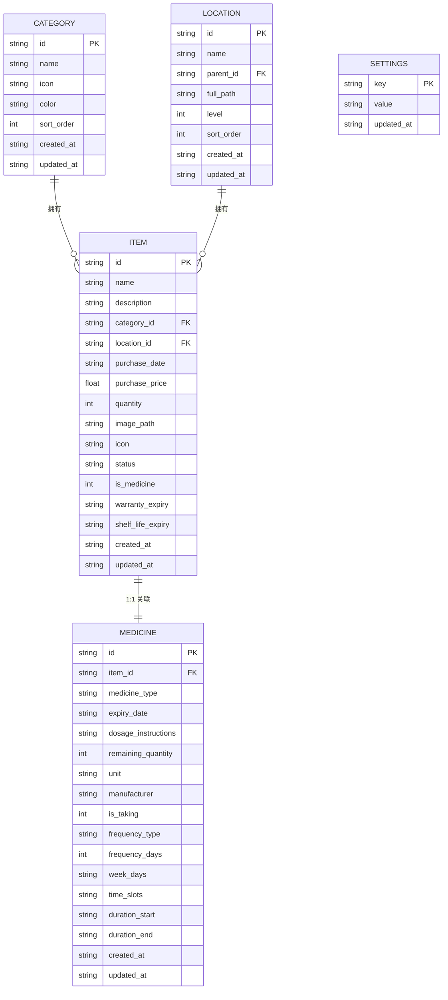
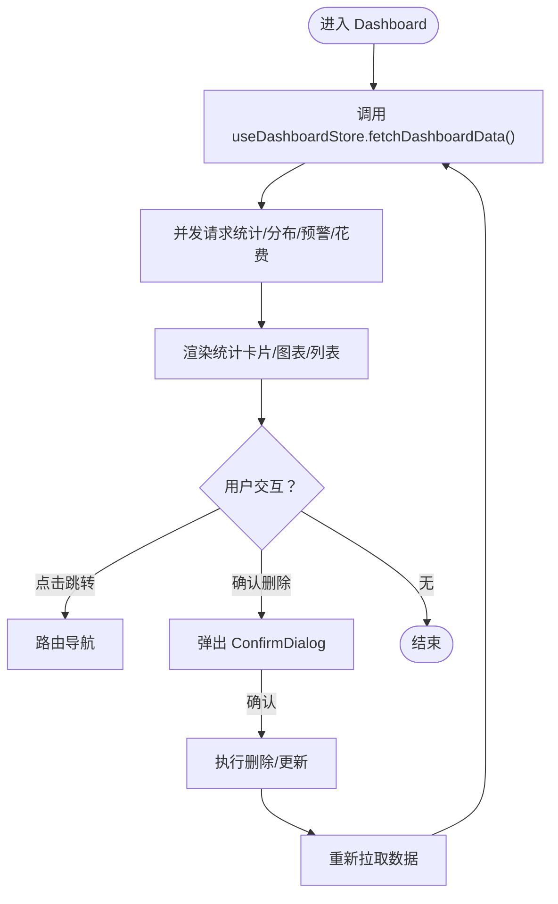
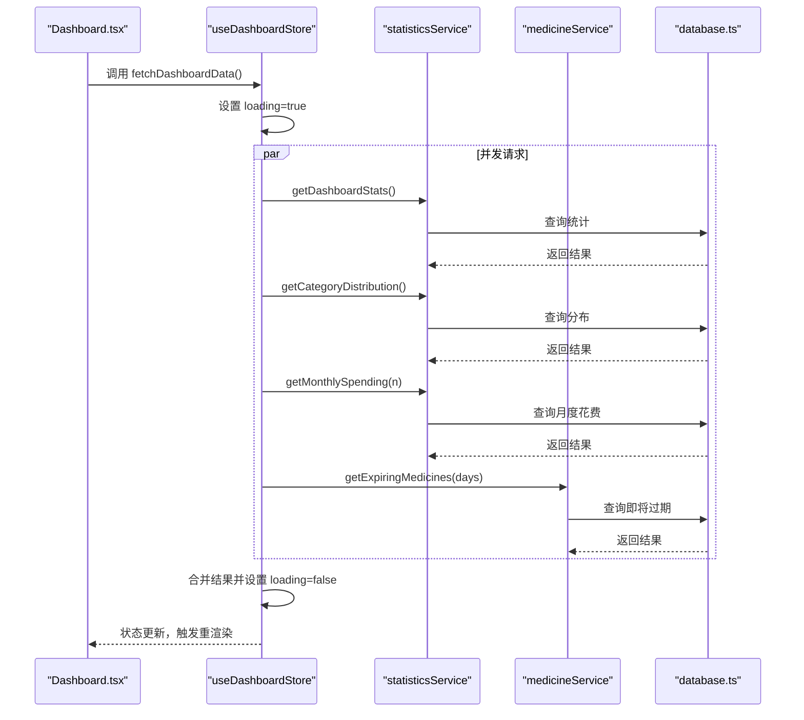
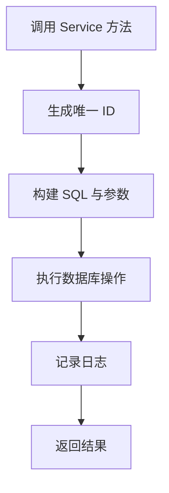

# 架构设计模式

<cite>
**本文引用的文件**
- [src/App.tsx](file://src/App.tsx)
- [src/main.tsx](file://src/main.tsx)
- [src/components/layout/AppShell.tsx](file://src/components/layout/AppShell.tsx)
- [src/routes/Dashboard.tsx](file://src/routes/Dashboard.tsx)
- [src/stores/useItemStore.ts](file://src/stores/useItemStore.ts)
- [src/stores/useCategoryStore.ts](file://src/stores/useCategoryStore.ts)
- [src/stores/useDashboardStore.ts](file://src/stores/useDashboardStore.ts)
- [src/stores/useSettingsStore.ts](file://src/stores/useSettingsStore.ts)
- [src/services/database.ts](file://src/services/database.ts)
- [src/services/itemService.ts](file://src/services/itemService.ts)
- [src/services/categoryService.ts](file://src/services/categoryService.ts)
- [src/services/statisticsService.ts](file://src/services/statisticsService.ts)
- [src/services/medicineService.ts](file://src/services/medicineService.ts)
- [src/types/item.ts](file://src/types/item.ts)
- [src/types/category.ts](file://src/types/category.ts)
- [src/types/settings.ts](file://src/types/settings.ts)
- [src/utils/constants.ts](file://src/utils/constants.ts)
- [src/utils/currencyHelper.ts](file://src/utils/currencyHelper.ts)
- [src/utils/dateHelper.ts](file://src/utils/dateHelper.ts)
- [src/utils/logger.ts](file://src/utils/logger.ts)
- [src/components/shared/ConfirmDialog.tsx](file://src/components/shared/ConfirmDialog.tsx)
</cite>

## 目录
1. [引言](#引言)
2. [项目结构](#项目结构)
3. [核心组件](#核心组件)
4. [架构总览](#架构总览)
5. [详细组件分析](#详细组件分析)
6. [依赖关系分析](#依赖关系分析)
7. [性能考量](#性能考量)
8. [故障排查指南](#故障排查指南)
9. [结论](#结论)
10. [附录](#附录)

## 引言
本文件系统性梳理 Assetly 的架构设计模式，重点阐释 MVVM 分层与组件化设计在项目中的落地方式：Model 层的数据模型与持久化、View 层的页面与组件结构、ViewModel 层的状态管理与数据流；并进一步扩展到分层架构（表现层、业务层、数据访问层）的职责分离、组件化设计原则（可复用组件、通信与依赖注入）、数据流管理规范（单向数据流、事件驱动、异步处理），以及系统集成模式（插件化、中间件与扩展点）。

## 项目结构
项目采用以功能域划分的目录组织方式，结合 MVVM 与分层架构：
- 表现层（View）：路由页面与通用组件，负责渲染与用户交互
- 业务层（ViewModel/Store）：Zustand 状态仓库，封装页面级状态与行为
- 数据访问层（Service/DB）：服务层封装业务逻辑与数据库操作，统一通过 SQLite 插件访问
- 类型与工具：强类型定义、常量、格式化与日志等基础设施

图表来源
- [src/App.tsx:1-92](file://src/App.tsx#L1-L92)
- [src/components/layout/AppShell.tsx:1-160](file://src/components/layout/AppShell.tsx#L1-L160)
- [src/routes/Dashboard.tsx:1-235](file://src/routes/Dashboard.tsx#L1-L235)
- [src/stores/useItemStore.ts:1-53](file://src/stores/useItemStore.ts#L1-L53)
- [src/stores/useCategoryStore.ts:1-44](file://src/stores/useCategoryStore.ts#L1-L44)
- [src/stores/useDashboardStore.ts:1-34](file://src/stores/useDashboardStore.ts#L1-L34)
- [src/stores/useSettingsStore.ts:1-56](file://src/stores/useSettingsStore.ts#L1-L56)
- [src/services/itemService.ts:1-127](file://src/services/itemService.ts#L1-L127)
- [src/services/categoryService.ts:1-59](file://src/services/categoryService.ts#L1-L59)
- [src/services/statisticsService.ts:1-52](file://src/services/statisticsService.ts#L1-L52)
- [src/services/medicineService.ts:1-194](file://src/services/medicineService.ts#L1-L194)
- [src/services/database.ts:1-171](file://src/services/database.ts#L1-L171)

章节来源
- [src/main.tsx:1-11](file://src/main.tsx#L1-L11)
- [src/App.tsx:1-92](file://src/App.tsx#L1-L92)

## 核心组件
- 应用入口与路由：应用根组件负责初始化日志、启动提醒任务、路由配置与全局手势拦截，作为顶层协调者。
- 布局与导航：AppShell 提供桌面/移动端双态导航、主题色注入与数据库初始化保障。
- 页面与视图：Dashboard 聚合多源数据，展示统计卡片、预警与图表，体现 MVVM 中 View 的职责。
- 状态仓库（ViewModel）：useItemStore、useCategoryStore、useDashboardStore、useSettingsStore 将页面状态与异步行为封装为可复用 Store。
- 服务层（Model）：itemService、categoryService、statisticsService、medicineService 统一封装数据访问与业务规则。
- 数据模型（Model）：item.ts、category.ts、settings.ts 定义实体与查询结果类型，确保跨层契约清晰。

章节来源
- [src/App.tsx:18-91](file://src/App.tsx#L18-L91)
- [src/components/layout/AppShell.tsx:24-159](file://src/components/layout/AppShell.tsx#L24-L159)
- [src/routes/Dashboard.tsx:13-216](file://src/routes/Dashboard.tsx#L13-L216)
- [src/stores/useItemStore.ts:12-52](file://src/stores/useItemStore.ts#L12-L52)
- [src/stores/useCategoryStore.ts:5-43](file://src/stores/useCategoryStore.ts#L5-L43)
- [src/stores/useDashboardStore.ts:7-33](file://src/stores/useDashboardStore.ts#L7-L33)
- [src/stores/useSettingsStore.ts:5-55](file://src/stores/useSettingsStore.ts#L5-L55)
- [src/services/itemService.ts:10-126](file://src/services/itemService.ts#L10-L126)
- [src/services/categoryService.ts:9-58](file://src/services/categoryService.ts#L9-L58)
- [src/services/statisticsService.ts:4-51](file://src/services/statisticsService.ts#L4-L51)
- [src/services/medicineService.ts:10-193](file://src/services/medicineService.ts#L10-L193)
- [src/types/item.ts:3-45](file://src/types/item.ts#L3-L45)
- [src/types/category.ts:3-17](file://src/types/category.ts#L3-L17)
- [src/types/settings.ts:8-24](file://src/types/settings.ts#L8-L24)

## 架构总览
MVVM 在项目中的映射：
- Model（数据模型与服务）：类型定义 + 服务层 + 数据库访问
- View（页面与组件）：路由页面 + 共享组件
- ViewModel（状态与行为）：Zustand Store 将 View 与 Model 解耦

图表来源
- [src/routes/Dashboard.tsx:13-216](file://src/routes/Dashboard.tsx#L13-L216)
- [src/stores/useDashboardStore.ts:16-33](file://src/stores/useDashboardStore.ts#L16-L33)
- [src/services/statisticsService.ts:4-51](file://src/services/statisticsService.ts#L4-L51)
- [src/services/medicineService.ts:164-193](file://src/services/medicineService.ts#L164-L193)

分层架构（表现层/业务层/数据访问层）：
- 表现层：AppShell、路由页面、共享组件
- 业务层：Zustand Store 与 Service 层
- 数据访问层：database.ts（SQLite 插件）与迁移机制

图表来源
- [src/components/layout/AppShell.tsx:24-159](file://src/components/layout/AppShell.tsx#L24-L159)
- [src/routes/Dashboard.tsx:13-216](file://src/routes/Dashboard.tsx#L13-L216)
- [src/stores/useDashboardStore.ts:16-33](file://src/stores/useDashboardStore.ts#L16-L33)
- [src/services/database.ts:8-16](file://src/services/database.ts#L8-L16)

## 详细组件分析

### 数据模型与类型体系（Model）
- 实体与查询结果类型：Item、ItemWithDetails、Category、DashboardStats、CategoryDistribution、MonthlySpending 等，明确跨层数据契约。
- 默认数据与标签：DEFAULT_CATEGORIES、MEDICINE_TYPE_LABELS、ITEM_STATUS_LABELS、THEME_PRESETS、CURRENCY_OPTIONS 等常量，统一前端展示与默认值。

图表来源
- [src/types/category.ts:3-17](file://src/types/category.ts#L3-L17)
- [src/types/item.ts:5-45](file://src/types/item.ts#L5-L45)
- [src/services/database.ts:67-168](file://src/services/database.ts#L67-L168)
- [src/utils/constants.ts:4-13](file://src/utils/constants.ts#L4-L13)

章节来源
- [src/types/category.ts:1-18](file://src/types/category.ts#L1-L18)
- [src/types/item.ts:1-46](file://src/types/item.ts#L1-L46)
- [src/types/settings.ts:1-25](file://src/types/settings.ts#L1-L25)
- [src/utils/constants.ts:1-40](file://src/utils/constants.ts#L1-L40)

### 视图层（View）与组件结构
- AppShell：统一导航、主题色注入、移动端适配、数据库初始化保障，作为全局壳组件。
- Dashboard：聚合统计、预警、图表与快速入口，承担 View 的渲染与交互职责。
- ConfirmDialog：可复用对话框组件，通过 props 驱动行为，体现组件通信与复用。

图表来源
- [src/routes/Dashboard.tsx:15-31](file://src/routes/Dashboard.tsx#L15-L31)
- [src/stores/useDashboardStore.ts:23-32](file://src/stores/useDashboardStore.ts#L23-L32)
- [src/components/shared/ConfirmDialog.tsx:14-51](file://src/components/shared/ConfirmDialog.tsx#L14-L51)

章节来源
- [src/components/layout/AppShell.tsx:24-159](file://src/components/layout/AppShell.tsx#L24-L159)
- [src/routes/Dashboard.tsx:13-216](file://src/routes/Dashboard.tsx#L13-L216)
- [src/components/shared/ConfirmDialog.tsx:1-52](file://src/components/shared/ConfirmDialog.tsx#L1-L52)

### ViewModel 层（状态管理与数据流）
- 单向数据流：View 仅触发 Store 方法，Store 内部异步调用 Service，Service 更新数据库，Store 更新自身状态，View 重新渲染。
- 异步处理：Store 使用 Promise 包裹异步操作，集中错误处理与 loading 状态。
- 复合查询：Dashboard 并发拉取多个数据源，提升首屏性能。

图表来源
- [src/routes/Dashboard.tsx:19-31](file://src/routes/Dashboard.tsx#L19-L31)
- [src/stores/useDashboardStore.ts:23-32](file://src/stores/useDashboardStore.ts#L23-L32)
- [src/services/statisticsService.ts:4-51](file://src/services/statisticsService.ts#L4-L51)
- [src/services/medicineService.ts:164-177](file://src/services/medicineService.ts#L164-L177)
- [src/services/database.ts:8-16](file://src/services/database.ts#L8-L16)

章节来源
- [src/stores/useDashboardStore.ts:1-34](file://src/stores/useDashboardStore.ts#L1-L34)
- [src/stores/useItemStore.ts:1-53](file://src/stores/useItemStore.ts#L1-L53)
- [src/stores/useCategoryStore.ts:1-44](file://src/stores/useCategoryStore.ts#L1-L44)
- [src/stores/useSettingsStore.ts:1-56](file://src/stores/useSettingsStore.ts#L1-L56)

### 业务层（Service）与数据访问层（Database）
- Service 层：封装 CRUD 与复合查询，统一字段映射与时间戳处理，记录日志便于追踪。
- 数据访问层：统一通过 SQLite 插件连接本地数据库，内置迁移机制与索引优化，保证数据一致性与性能。

图表来源
- [src/services/itemService.ts:60-87](file://src/services/itemService.ts#L60-L87)
- [src/services/categoryService.ts:20-34](file://src/services/categoryService.ts#L20-L34)
- [src/services/medicineService.ts:54-95](file://src/services/medicineService.ts#L54-L95)
- [src/services/database.ts:8-16](file://src/services/database.ts#L8-L16)

章节来源
- [src/services/itemService.ts:1-127](file://src/services/itemService.ts#L1-L127)
- [src/services/categoryService.ts:1-59](file://src/services/categoryService.ts#L1-L59)
- [src/services/statisticsService.ts:1-52](file://src/services/statisticsService.ts#L1-L52)
- [src/services/medicineService.ts:1-194](file://src/services/medicineService.ts#L1-L194)
- [src/services/database.ts:1-171](file://src/services/database.ts#L1-L171)

## 依赖关系分析
- 组件耦合：View 仅依赖 Store，Store 依赖 Service，Service 依赖 Database，形成清晰的单向依赖链。
- 可能的循环依赖：未发现直接循环依赖；若后续扩展 Store 间共享逻辑，建议通过工具函数或独立模块解耦。
- 外部依赖：@tauri-apps/plugin-sql、lucide-react、zustand 等，均通过 package.json 管理。

图表来源
- [src/routes/Dashboard.tsx:15-21](file://src/routes/Dashboard.tsx#L15-L21)
- [src/stores/useDashboardStore.ts:1-34](file://src/stores/useDashboardStore.ts#L1-L34)
- [src/services/statisticsService.ts:1-52](file://src/services/statisticsService.ts#L1-L52)
- [src/services/database.ts:1-171](file://src/services/database.ts#L1-L171)

章节来源
- [src/main.tsx:1-11](file://src/main.tsx#L1-L11)
- [src/App.tsx:1-92](file://src/App.tsx#L1-L92)

## 性能考量
- 并发加载：Dashboard 使用 Promise.all 并发拉取多源数据，减少等待时间。
- 列表过滤：Store 中维护 filter 对象，避免重复网络请求；Service 层支持动态参数拼接 SQL。
- 渲染优化：AppShell 在 DB 初始化前显示加载骨架，改善感知性能。
- 数据库索引：Service 查询使用索引列（如 status、expiry_date），降低查询成本。
- 日志与可观测：统一日志工具记录关键操作，便于定位性能瓶颈。

章节来源
- [src/stores/useDashboardStore.ts:25-31](file://src/stores/useDashboardStore.ts#L25-L31)
- [src/stores/useItemStore.ts:28-32](file://src/stores/useItemStore.ts#L28-L32)
- [src/services/statisticsService.ts:15-18](file://src/services/statisticsService.ts#L15-L18)
- [src/services/medicineService.ts:166-177](file://src/services/medicineService.ts#L166-L177)
- [src/components/layout/AppShell.tsx:52-61](file://src/components/layout/AppShell.tsx#L52-L61)
- [src/utils/logger.ts](file://src/utils/logger.ts)

## 故障排查指南
- 数据库连接失败：检查 getDb 是否成功加载与迁移是否完成；关注迁移日志与异常抛出。
- 查询无结果：核对 Service 参数拼接与 SQL 条件，确认索引是否覆盖查询列。
- 状态不更新：确认 Store 方法是否正确调用 fetchItems 或合并结果；检查 loading 状态切换。
- 主题色不生效：确认 useSettingsStore 已加载并写入 DOM CSS 变量。
- 日志定位：利用日志工具记录关键路径，结合错误堆栈定位问题。

章节来源
- [src/services/database.ts:8-53](file://src/services/database.ts#L8-L53)
- [src/stores/useSettingsStore.ts:19-44](file://src/stores/useSettingsStore.ts#L19-L44)
- [src/utils/logger.ts](file://src/utils/logger.ts)

## 结论
Assetly 通过 MVVM 与分层架构实现了清晰的职责分离：View 专注渲染与交互，ViewModel 以 Store 封装状态与异步流程，Model 以 Service 与数据库提供稳定的数据能力。配合可复用组件、单向数据流与并发加载策略，系统具备良好的可维护性与扩展性。未来可在 Store 共享逻辑抽取、插件化扩展点与中间件日志/埋点方面持续演进。

## 附录
- 组件化设计原则
  - 可复用组件：ConfirmDialog 通过 props 驱动，适合多处复用
  - 组件通信：父组件传递回调与状态，子组件只负责渲染与简单事件透传
  - 依赖注入：Store 通过 create 函数注入，Service 通过模块导入，避免硬编码依赖
- 数据流管理规范
  - 单向数据流：View -> Store -> Service -> DB -> Store -> View
  - 事件驱动：路由与用户交互触发 Store 方法
  - 异步处理：Promise 包裹，集中处理 loading 与错误
- 系统集成模式
  - 插件架构：SQLite 插件作为数据存储插件，易于替换
  - 中间件设计：日志工具可作为中间件贯穿业务层
  - 扩展点规划：Store 与 Service 保持薄接口，便于新增领域与聚合查询