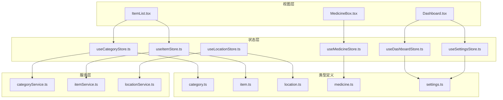
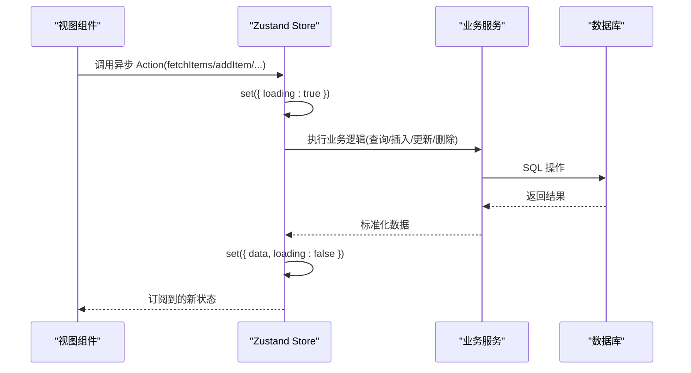
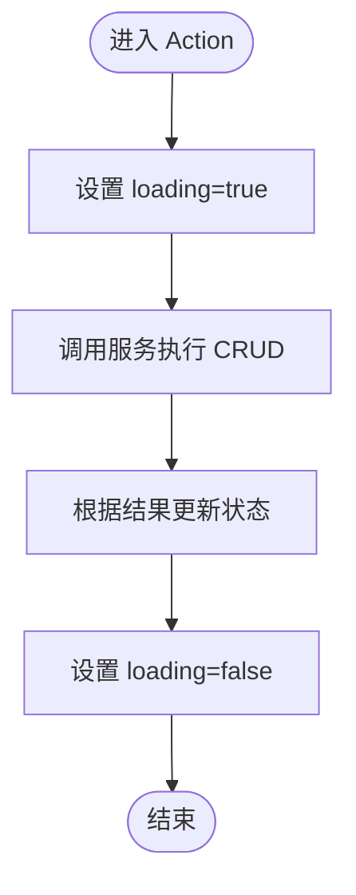
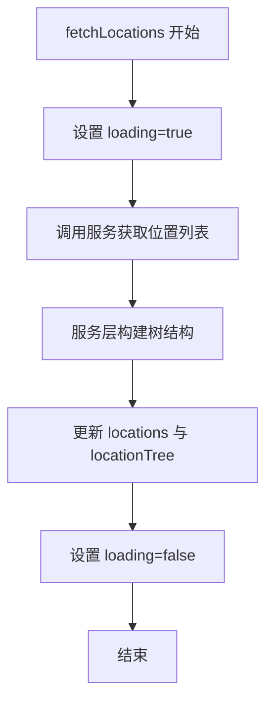
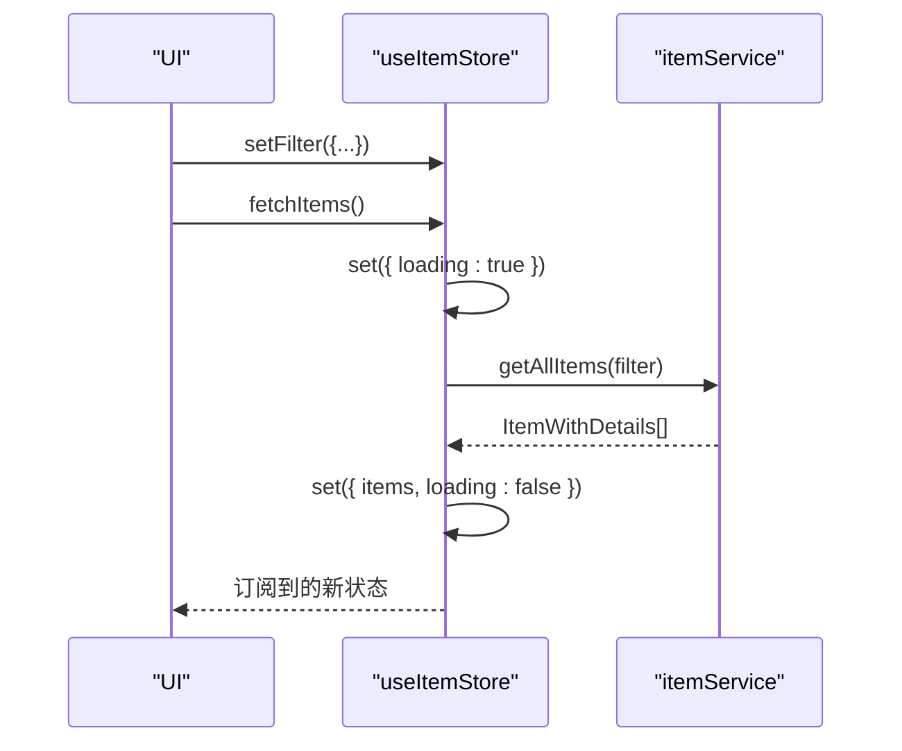
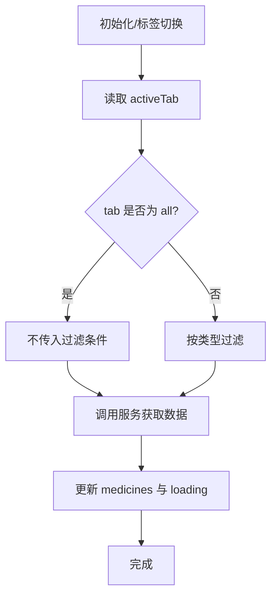
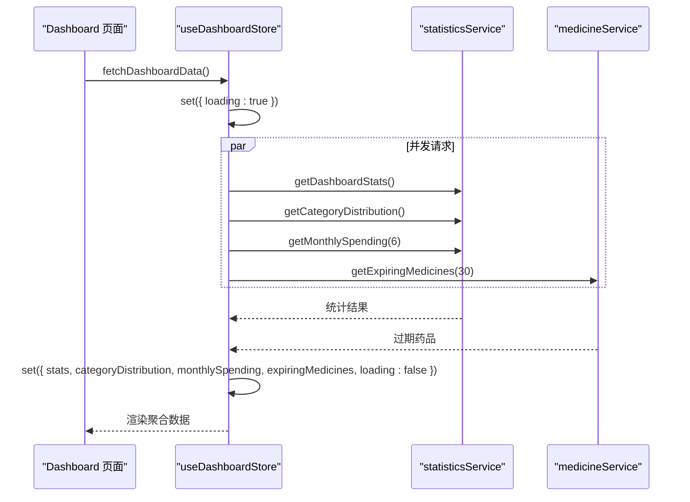
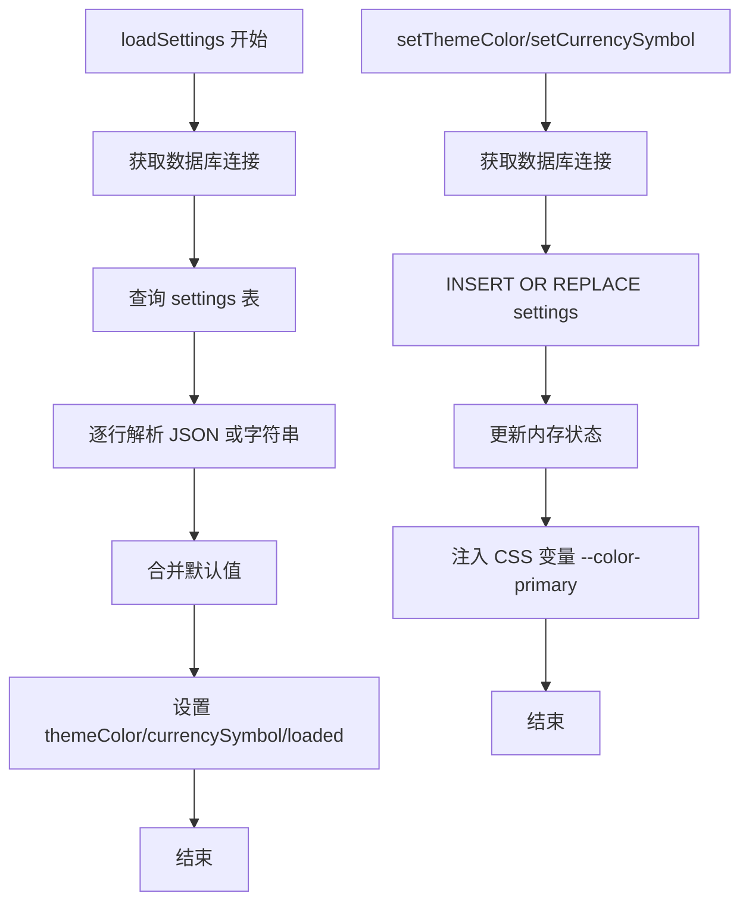
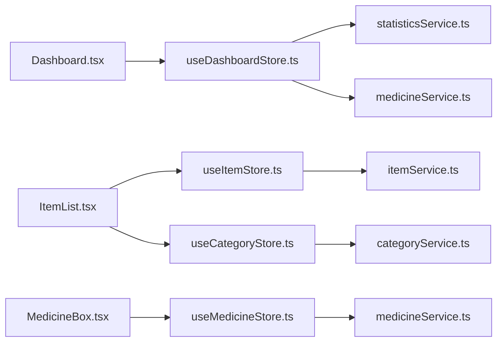

# 状态管理最佳实践

<cite>
**本文档引用的文件**
- [useCategoryStore.ts](file://src/stores/useCategoryStore.ts)
- [useDashboardStore.ts](file://src/stores/useDashboardStore.ts)
- [useItemStore.ts](file://src/stores/useItemStore.ts)
- [useLocationStore.ts](file://src/stores/useLocationStore.ts)
- [useMedicineStore.ts](file://src/stores/useMedicineStore.ts)
- [useSettingsStore.ts](file://src/stores/useSettingsStore.ts)
- [category.ts](file://src/types/category.ts)
- [item.ts](file://src/types/item.ts)
- [location.ts](file://src/types/location.ts)
- [medicine.ts](file://src/types/medicine.ts)
- [settings.ts](file://src/types/settings.ts)
- [categoryService.ts](file://src/services/categoryService.ts)
- [itemService.ts](file://src/services/itemService.ts)
- [locationService.ts](file://src/services/locationService.ts)
- [Dashboard.tsx](file://src/routes/Dashboard.tsx)
- [ItemList.tsx](file://src/routes/ItemList.tsx)
- [MedicineBox.tsx](file://src/routes/MedicineBox.tsx)
</cite>

## 目录
1. [引言](#引言)
2. [项目结构](#项目结构)
3. [核心组件](#核心组件)
4. [架构总览](#架构总览)
5. [详细组件分析](#详细组件分析)
6. [依赖关系分析](#依赖关系分析)
7. [性能考量](#性能考量)
8. [故障排查指南](#故障排查指南)
9. [结论](#结论)
10. [附录](#附录)

## 引言
本文件面向 Assetly 的 Zustand 状态管理实践，系统总结 Store 设计模式与工程化最佳实践，覆盖以下主题：
- Store 创建规范与 Action 定义原则
- 状态更新策略与异步操作处理
- 状态结构设计：数据模型规范化、状态分片策略、跨 Store 数据共享
- 状态持久化方案：本地存储集成、状态恢复机制、数据同步策略
- 调试技巧：DevTools 使用、状态变更追踪、性能监控
- 性能优化：选择器优化、批量更新、内存泄漏防护

## 项目结构
Assetly 采用“按功能域划分”的 Store 组织方式，每个领域（分类、位置、物品、药品、仪表盘、设置）拥有独立的 Zustand Store 与对应的类型定义和服务层。组件通过 Hook 方式订阅 Store，实现细粒度的状态订阅与渲染。

图表来源
- [useCategoryStore.ts:1-44](file://src/stores/useCategoryStore.ts#L1-L44)
- [useLocationStore.ts:1-43](file://src/stores/useLocationStore.ts#L1-L43)
- [useItemStore.ts:1-53](file://src/stores/useItemStore.ts#L1-L53)
- [useMedicineStore.ts:1-42](file://src/stores/useMedicineStore.ts#L1-L42)
- [useDashboardStore.ts:1-34](file://src/stores/useDashboardStore.ts#L1-L34)
- [useSettingsStore.ts:1-56](file://src/stores/useSettingsStore.ts#L1-L56)
- [category.ts:1-18](file://src/types/category.ts#L1-L18)
- [item.ts:1-46](file://src/types/item.ts#L1-L46)
- [location.ts:1-24](file://src/types/location.ts#L1-L24)
- [medicine.ts:1-70](file://src/types/medicine.ts#L1-L70)
- [settings.ts:1-25](file://src/types/settings.ts#L1-L25)
- [categoryService.ts:1-59](file://src/services/categoryService.ts#L1-L59)
- [itemService.ts:1-127](file://src/services/itemService.ts#L1-L127)
- [locationService.ts:1-143](file://src/services/locationService.ts#L1-L143)
- [Dashboard.tsx:1-235](file://src/routes/Dashboard.tsx#L1-L235)
- [ItemList.tsx:1-185](file://src/routes/ItemList.tsx#L1-L185)
- [MedicineBox.tsx:1-112](file://src/routes/MedicineBox.tsx#L1-L112)

章节来源
- [useCategoryStore.ts:1-44](file://src/stores/useCategoryStore.ts#L1-L44)
- [useLocationStore.ts:1-43](file://src/stores/useLocationStore.ts#L1-L43)
- [useItemStore.ts:1-53](file://src/stores/useItemStore.ts#L1-L53)
- [useMedicineStore.ts:1-42](file://src/stores/useMedicineStore.ts#L1-L42)
- [useDashboardStore.ts:1-34](file://src/stores/useDashboardStore.ts#L1-L34)
- [useSettingsStore.ts:1-56](file://src/stores/useSettingsStore.ts#L1-L56)

## 核心组件
- 分类 Store：维护分类列表、加载状态，提供查询、新增、更新、删除等异步 Action。
- 位置 Store：维护平面位置列表与树形结构，提供查询、新增、更新、删除等异步 Action，并在更新后重建树。
- 物品 Store：维护物品列表、过滤条件与加载状态，支持多维过滤与重新拉取。
- 药品 Store：维护药品列表与活动标签页，按标签页动态过滤，支持新增、更新、切换标签。
- 仪表盘 Store：聚合统计指标、分类分布、月度支出、过期药品等多源数据，统一并发拉取与加载状态。
- 设置 Store：维护主题色、货币符号等应用设置，基于数据库进行读写与样式注入。

章节来源
- [useCategoryStore.ts:5-12](file://src/stores/useCategoryStore.ts#L5-L12)
- [useLocationStore.ts:5-13](file://src/stores/useLocationStore.ts#L5-L13)
- [useItemStore.ts:12-21](file://src/stores/useItemStore.ts#L12-L21)
- [useMedicineStore.ts:5-13](file://src/stores/useMedicineStore.ts#L5-L13)
- [useDashboardStore.ts:7-14](file://src/stores/useDashboardStore.ts#L7-L14)
- [useSettingsStore.ts:5-12](file://src/stores/useSettingsStore.ts#L5-L12)

## 架构总览
Zustand Store 与服务层解耦，组件仅感知 Store 的状态与 Action；服务层负责与数据库交互并返回标准化数据。Store 内部通过 set/get 控制状态更新与读取上下文，异步 Action 中间态通过 loading 字段反馈给 UI。

图表来源
- [useItemStore.ts:28-32](file://src/stores/useItemStore.ts#L28-L32)
- [useCategoryStore.ts:18-22](file://src/stores/useCategoryStore.ts#L18-L22)
- [useLocationStore.ts:20-25](file://src/stores/useLocationStore.ts#L20-L25)
- [itemService.ts:10-44](file://src/services/itemService.ts#L10-L44)
- [categoryService.ts:9-12](file://src/services/categoryService.ts#L9-L12)
- [locationService.ts:9-12](file://src/services/locationService.ts#L9-L12)

## 详细组件分析

### 分类 Store 设计
- 状态结构：包含分类数组与加载标志。
- Action 设计：
  - 查询：设置加载态 → 远程获取 → 更新列表与加载态。
  - 新增：调用服务创建 → 将新项追加至列表。
  - 更新：调用服务更新 → 基于 id 映射更新项（含时间戳更新）。
  - 删除：调用服务删除 → 过滤掉被删除项。
- 异步处理：统一在 Action 内包裹加载态，避免 UI 卡顿与重复请求。

图表来源
- [useCategoryStore.ts:18-42](file://src/stores/useCategoryStore.ts#L18-L42)

章节来源
- [useCategoryStore.ts:5-12](file://src/stores/useCategoryStore.ts#L5-L12)
- [categoryService.ts:9-59](file://src/services/categoryService.ts#L9-L59)

### 位置 Store 设计
- 状态结构：位置数组与树形结构、加载标志。
- Action 设计：
  - 查询：获取位置列表 → 构建树结构 → 同步更新数组与树。
  - 新增/更新/删除：调用服务后触发重新拉取，确保树一致性。
- 关键点：树构建由服务层完成，Store 仅负责接收与展示。

图表来源
- [useLocationStore.ts:20-25](file://src/stores/useLocationStore.ts#L20-L25)
- [locationService.ts:124-142](file://src/services/locationService.ts#L124-L142)

章节来源
- [useLocationStore.ts:5-13](file://src/stores/useLocationStore.ts#L5-L13)
- [locationService.ts:124-142](file://src/services/locationService.ts#L124-L142)

### 物品 Store 设计
- 状态结构：物品列表、过滤条件对象、加载标志。
- Action 设计：
  - 查询：合并当前过滤条件 → 远程获取 → 更新列表与加载态。
  - 新增/更新/删除：调用服务后立即重新拉取，保证视图与数据一致。
  - 过滤：支持分类、位置、状态、关键词组合过滤。
- 异步处理：统一设置加载态；过滤变更通过防抖触发查询。

图表来源
- [useItemStore.ts:28-51](file://src/stores/useItemStore.ts#L28-L51)
- [itemService.ts:10-44](file://src/services/itemService.ts#L10-L44)

章节来源
- [useItemStore.ts:12-21](file://src/stores/useItemStore.ts#L12-L21)
- [itemService.ts:10-44](file://src/services/itemService.ts#L10-L44)

### 药品 Store 设计
- 状态结构：药品列表、加载标志、活动标签页。
- Action 设计：
  - 查询：读取活动标签 → 构造过滤条件 → 获取数据 → 更新列表与加载态。
  - 新增/更新：调用服务后重新拉取。
  - 切换标签：仅更新标签页，触发重新拉取。
- 异步处理：标签页变化与初始化时自动刷新。

图表来源
- [useMedicineStore.ts:20-26](file://src/stores/useMedicineStore.ts#L20-L26)

章节来源
- [useMedicineStore.ts:5-13](file://src/stores/useMedicineStore.ts#L5-L13)

### 仪表盘 Store 设计
- 状态结构：多维度统计指标、分类分布、月度支出、过期药品、加载标志。
- Action 设计：并发拉取多个统计接口，聚合后一次性更新。
- 异步处理：统一设置加载态，避免部分数据未就绪导致的 UI 抖动。

图表来源
- [useDashboardStore.ts:23-32](file://src/stores/useDashboardStore.ts#L23-L32)

章节来源
- [useDashboardStore.ts:7-14](file://src/stores/useDashboardStore.ts#L7-L14)

### 设置 Store 设计
- 状态结构：主题色、货币符号、加载标志。
- Action 设计：
  - 加载：从数据库读取设置 → 解析 JSON → 合并默认值 → 标记已加载。
  - 修改：写入数据库（带时间戳）→ 更新内存状态 → 注入 CSS 变量。
- 异步处理：读写分离，写入成功后再更新内存状态，保证一致性。

图表来源
- [useSettingsStore.ts:19-54](file://src/stores/useSettingsStore.ts#L19-L54)

章节来源
- [useSettingsStore.ts:5-12](file://src/stores/useSettingsStore.ts#L5-L12)

### 类型与数据模型
- 分类：包含标识、名称、图标、颜色、排序、时间戳。
- 物品：包含基础信息、分类与位置关联、购买信息、状态、是否药品、保质期等。
- 位置：包含层级、全路径、父子关系、排序、时间戳。
- 药品：包含类型、有效期、用量、单位、制造商、提醒配置、时间范围、最后提醒时间。
- 设置：仪表盘统计、分类分布、月度支出等聚合类型。

章节来源
- [category.ts:3-17](file://src/types/category.ts#L3-L17)
- [item.ts:5-45](file://src/types/item.ts#L5-L45)
- [location.ts:3-23](file://src/types/location.ts#L3-L23)
- [medicine.ts:7-69](file://src/types/medicine.ts#L7-L69)
- [settings.ts:8-24](file://src/types/settings.ts#L8-L24)

### 跨 Store 数据共享
- 物品列表依赖分类数据用于展示分类名称与颜色，组件在挂载时同时触发两类 Store 的初始化。
- 仪表盘依赖统计服务与药品服务，Store 内部聚合多源数据，避免组件分散处理。

章节来源
- [ItemList.tsx:21-30](file://src/routes/ItemList.tsx#L21-L30)
- [Dashboard.tsx:15-22](file://src/routes/Dashboard.tsx#L15-L22)

## 依赖关系分析
- 组件对 Store 的依赖：视图组件通过 Hook 订阅 Store，减少不必要的重渲染。
- Store 对服务层的依赖：Store 不直接访问数据库，而是委托服务层执行 SQL 操作。
- 服务层对数据库的依赖：服务层封装 SQL 查询、插入、更新、删除与复杂计算（如树构建）。

图表来源
- [Dashboard.tsx:1-235](file://src/routes/Dashboard.tsx#L1-L235)
- [ItemList.tsx:1-185](file://src/routes/ItemList.tsx#L1-L185)
- [MedicineBox.tsx:1-112](file://src/routes/MedicineBox.tsx#L1-L112)
- [useItemStore.ts:1-53](file://src/stores/useItemStore.ts#L1-L53)
- [useCategoryStore.ts:1-44](file://src/stores/useCategoryStore.ts#L1-L44)
- [useMedicineStore.ts:1-42](file://src/stores/useMedicineStore.ts#L1-L42)
- [useDashboardStore.ts:1-34](file://src/stores/useDashboardStore.ts#L1-L34)
- [itemService.ts:1-127](file://src/services/itemService.ts#L1-L127)
- [categoryService.ts:1-59](file://src/services/categoryService.ts#L1-L59)
- [locationService.ts:1-143](file://src/services/locationService.ts#L1-L143)

章节来源
- [Dashboard.tsx:1-235](file://src/routes/Dashboard.tsx#L1-L235)
- [ItemList.tsx:1-185](file://src/routes/ItemList.tsx#L1-L185)
- [MedicineBox.tsx:1-112](file://src/routes/MedicineBox.tsx#L1-L112)

## 性能考量
- 选择器优化
  - 避免在组件内直接使用全局 Store 状态，优先使用派生状态或 useMemo 包裹计算，降低重渲染频率。
  - 在列表渲染场景，尽量将昂贵计算移出渲染函数，或使用浅比较的 selector。
- 批量更新
  - Store 内部 Action 应合并多次 set 调用，减少中间态渲染。
  - 并发请求使用 Promise.all 聚合，避免串行等待。
- 内存泄漏防护
  - 防抖与去抖：过滤器变更使用防抖，避免频繁触发查询。
  - 清理副作用：组件卸载时清理定时器与订阅。
- 异步加载优化
  - 统一 loading 标志位，避免部分数据未就绪导致的 UI 抖动。
  - 对可缓存数据，考虑在 Store 内增加 lastUpdated 字段与失效策略。

## 故障排查指南
- 状态未更新
  - 检查 Action 是否正确调用 set 更新状态与 loading。
  - 确认组件是否订阅了正确的 selector 或整个 Store。
- 数据不一致
  - 新增/更新/删除后应重新拉取数据，确保 Store 与数据库一致。
  - 树结构更新后需重新构建树，避免父子关系错乱。
- 并发请求异常
  - 使用 Promise.all 并捕获错误，确保任一失败不影响其他任务。
- 持久化问题
  - 写入数据库失败时，回滚内存状态或提示用户重试。
  - 读取设置时注意 JSON 解析异常，提供默认值兜底。

章节来源
- [useItemStore.ts:34-47](file://src/stores/useItemStore.ts#L34-L47)
- [useLocationStore.ts:27-41](file://src/stores/useLocationStore.ts#L27-L41)
- [useDashboardStore.ts:25-31](file://src/stores/useDashboardStore.ts#L25-L31)
- [useSettingsStore.ts:19-54](file://src/stores/useSettingsStore.ts#L19-L54)

## 结论
Assetly 的 Zustand 状态管理遵循“Store 轻薄、服务层厚实”的设计原则：Store 专注状态与异步流程编排，服务层负责数据访问与业务逻辑。通过统一的 Action 模式、并发聚合与加载态管理，实现了清晰、可维护且高性能的状态体系。建议在后续迭代中进一步引入选择器与缓存策略，以提升复杂场景下的渲染性能与用户体验。

## 附录
- 最佳实践清单
  - Store 创建：使用 create 定义状态与 Action，避免在 Store 外部直接修改状态。
  - Action 设计：统一 loading 管理、错误处理与重试策略。
  - 数据模型：保持类型定义与服务层返回结构一致，便于 Store 接收与组件消费。
  - 跨 Store 共享：通过组件协调多个 Store 初始化，避免 Store 间循环依赖。
  - 持久化：将关键设置写入数据库，提供恢复能力与样式注入。
  - 调试：结合浏览器 DevTools 与 React DevTools，观察状态变更与渲染次数。
  - 性能：使用防抖、批处理、选择器与缓存，减少不必要渲染与网络请求。