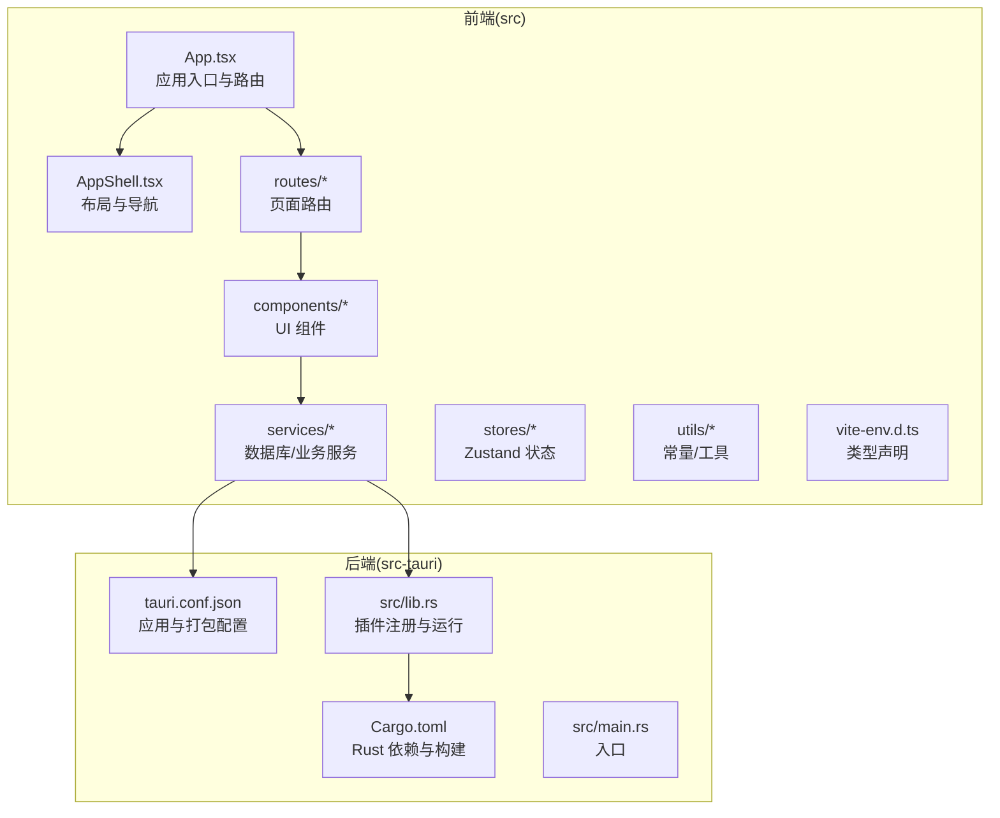
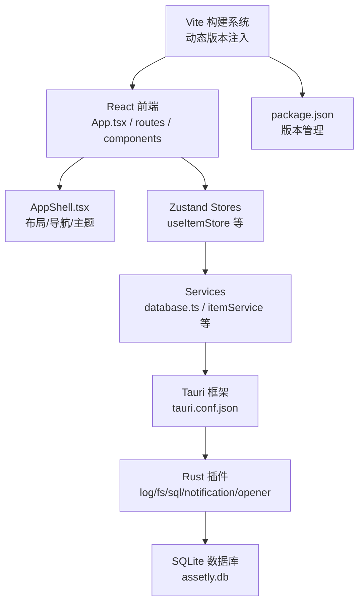
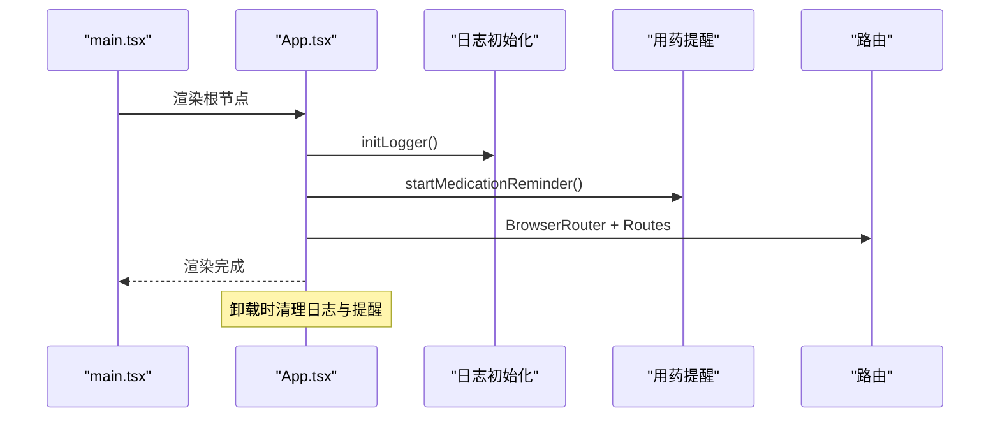
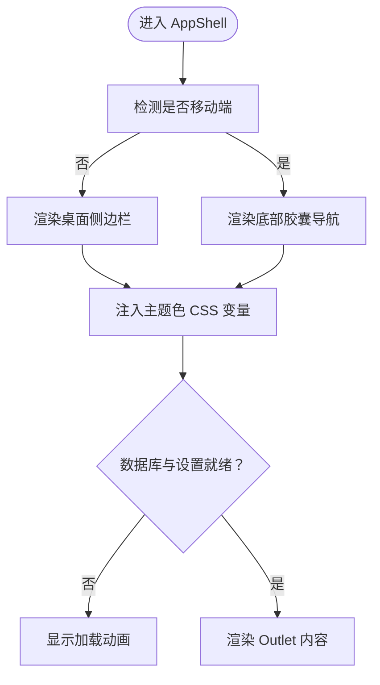
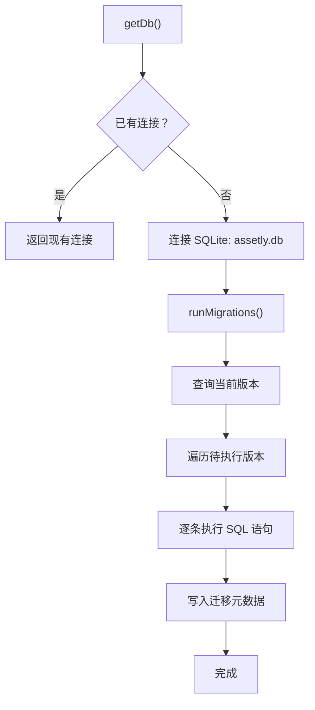
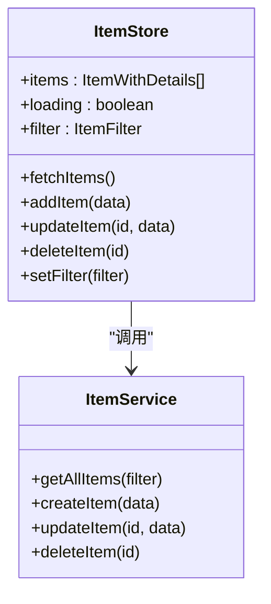
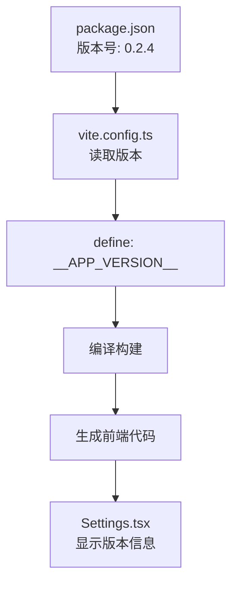
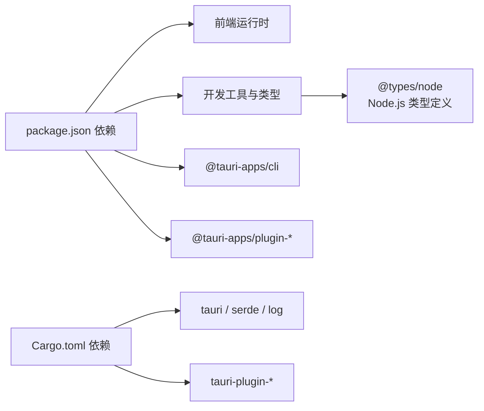

# 开发指南

<cite>
**本文引用的文件**
- [README.md](file://README.md)
- [package.json](file://package.json)
- [vite.config.ts](file://vite.config.ts)
- [tsconfig.json](file://tsconfig.json)
- [tsconfig.node.json](file://tsconfig.node.json)
- [src/vite-env.d.ts](file://src/vite-env.d.ts)
- [src/main.tsx](file://src/main.tsx)
- [src/App.tsx](file://src/App.tsx)
- [src/components/layout/AppShell.tsx](file://src/components/layout/AppShell.tsx)
- [src/services/database.ts](file://src/services/database.ts)
- [src/stores/useItemStore.ts](file://src/stores/useItemStore.ts)
- [src/utils/constants.ts](file://src/utils/constants.ts)
- [src/lib/utils.ts](file://src/lib/utils.ts)
- [src/routes/Settings.tsx](file://src/routes/Settings.tsx)
- [src-tauri/Cargo.toml](file://src-tauri/Cargo.toml)
- [src-tauri/tauri.conf.json](file://src-tauri/tauri.conf.json)
- [src-tauri/src/lib.rs](file://src-tauri/src/lib.rs)
- [src-tauri/src/main.rs](file://src-tauri/src/main.rs)
- [.github/workflows/release.yml](file://.github/workflows/release.yml)
</cite>

## 目录
1. [简介](#简介)
2. [项目结构](#项目结构)
3. [核心组件](#核心组件)
4. [架构总览](#架构总览)
5. [详细组件分析](#详细组件分析)
6. [依赖分析](#依赖分析)
7. [性能考虑](#性能考虑)
8. [故障排除指南](#故障排除指南)
9. [结论](#结论)
10. [附录](#附录)

## 简介
本开发指南面向参与 Assetly 项目的开发者，覆盖从环境搭建、代码规范、IDE 配置、测试与调试、性能分析、Git 工作流、贡献与评审、到构建与发布全流程。项目采用 Tauri 2 + React 19 + TypeScript + Zustand + SQLite 的技术栈，前端通过 Vite 构建，后端 Rust 提供系统能力与插件集成。

## 项目结构
项目采用"前后端分离 + 跨平台打包"的组织方式：
- 前端位于 src/，包含组件、页面路由、服务层、状态管理、类型与工具。
- 后端位于 src-tauri/，包含 Rust 逻辑、Tauri 配置、Android 生成物与能力配置。
- 根目录包含构建与脚本配置、类型检查配置、包管理配置以及 GitHub Actions 发布工作流。

图表来源
- [src/App.tsx:1-92](file://src/App.tsx#L1-L92)
- [src/components/layout/AppShell.tsx:1-160](file://src/components/layout/AppShell.tsx#L1-L160)
- [src/services/database.ts:1-171](file://src/services/database.ts#L1-L171)
- [src-tauri/tauri.conf.json:1-40](file://src-tauri/tauri.conf.json#L1-L40)
- [src-tauri/src/lib.rs:1-49](file://src-tauri/src/lib.rs#L1-L49)
- [src-tauri/Cargo.toml:1-31](file://src-tauri/Cargo.toml#L1-L31)

章节来源
- [README.md: 157-180:157-180](file://README.md#L157-L180)

## 核心组件
- 应用入口与路由：负责初始化日志、启动用药提醒、全局禁用手势返回、挂载路由与布局壳。
- 布局壳：根据屏幕尺寸切换桌面侧边栏与移动端胶囊导航；统一主题色注入；延迟渲染直到数据库与设置初始化完成。
- 数据库服务：封装 SQLite 连接、迁移执行与表结构初始化；提供迁移版本管理。
- 状态管理：按领域拆分 Zustand Store，统一暴露 CRUD 与过滤能力。
- 常量与工具：默认分类、货币、主题色预设、类名合并工具等。
- **动态版本变量**：通过 Vite 从 package.json 动态读取版本号，在应用设置中显示当前版本。

章节来源
- [src/App.tsx: 18-92:18-92](file://src/App.tsx#L18-L92)
- [src/components/layout/AppShell.tsx: 24-160:24-160](file://src/components/layout/AppShell.tsx#L24-L160)
- [src/services/database.ts: 8-171:8-171](file://src/services/database.ts#L8-L171)
- [src/stores/useItemStore.ts: 23-53:23-53](file://src/stores/useItemStore.ts#L23-L53)
- [src/utils/constants.ts: 4-40:4-40](file://src/utils/constants.ts#L4-L40)
- [src/lib/utils.ts: 4-7:4-7](file://src/lib/utils.ts#L4-L7)
- [src/routes/Settings.tsx: 268:268](file://src/routes/Settings.tsx#L268)

## 架构总览
前端通过 Tauri 桥接到 Rust 后端，Rust 注册日志、通知、文件系统、SQL 等插件，前端通过 @tauri-apps/api 与后端通信。数据库采用 SQLite，通过 Tauri SQL 插件访问，并在启动时执行迁移。**开发环境现已支持动态版本变量注入，版本信息自动从 package.json 同步**。

图表来源
- [src/App.tsx:1-92](file://src/App.tsx#L1-L92)
- [src/components/layout/AppShell.tsx:1-160](file://src/components/layout/AppShell.tsx#L1-L160)
- [src/services/database.ts:1-171](file://src/services/database.ts#L1-L171)
- [src-tauri/tauri.conf.json:1-40](file://src-tauri/tauri.conf.json#L1-L40)
- [src-tauri/src/lib.rs:1-49](file://src-tauri/src/lib.rs#L1-L49)
- [vite.config.ts:14-16](file://vite.config.ts#L14-L16)
- [package.json:4:4](file://package.json#L4)

## 详细组件分析

### 应用入口与生命周期
- 初始化日志与用药提醒；在卸载时清理资源。
- 全屏禁用手势返回，避免与 WebView 导航冲突。
- 路由集中注册，统一包裹 AppShell。

图表来源
- [src/main.tsx:1-11](file://src/main.tsx#L1-L11)
- [src/App.tsx:18-92](file://src/App.tsx#L18-L92)

章节来源
- [src/main.tsx: 6-10:6-10](file://src/main.tsx#L6-L10)
- [src/App.tsx: 18-92:18-92](file://src/App.tsx#L18-L92)

### 布局壳与导航
- 桌面端：固定侧边栏，包含主菜单与管理子菜单。
- 移动端：底部胶囊导航，响应式隐藏与安全区域适配。
- 主题色通过 CSS 变量注入，随设置变化实时生效。
- 首次渲染前等待数据库与设置初始化完成。

图表来源
- [src/components/layout/AppShell.tsx:24-160](file://src/components/layout/AppShell.tsx#L24-L160)

章节来源
- [src/components/layout/AppShell.tsx: 24-160:24-160](file://src/components/layout/AppShell.tsx#L24-L160)

### 数据库与迁移
- 单例连接，首次使用时建立连接并执行迁移。
- 迁移版本表与语句按版本顺序执行，失败时记录错误并中断。
- 默认种子数据与索引在初始迁移中创建。

图表来源
- [src/services/database.ts:8-171](file://src/services/database.ts#L8-L171)

章节来源
- [src/services/database.ts: 8-171:8-171](file://src/services/database.ts#L8-L171)

### 状态管理（Zustand）
- 按领域拆分 Store，统一提供 CRUD 与过滤。
- Store 内部调用对应 service，完成后刷新列表，保证 UI 与数据一致。

图表来源
- [src/stores/useItemStore.ts:23-53](file://src/stores/useItemStore.ts#L23-L53)

章节来源
- [src/stores/useItemStore.ts: 23-53:23-53](file://src/stores/useItemStore.ts#L23-L53)

### 常量与工具
- 默认分类、货币符号、主题色预设、状态与类型标签。
- 类名合并工具用于 Tailwind 组合样式。

章节来源
- [src/utils/constants.ts: 4-40:4-40](file://src/utils/constants.ts#L4-L40)
- [src/lib/utils.ts: 4-7:4-7](file://src/lib/utils.ts#L4-L7)

### 动态版本变量系统
**新增功能**：应用现在支持动态版本变量，版本信息自动从 package.json 同步到前端代码。

- **版本注入机制**：Vite 在构建时从 package.json 读取版本号，通过 define 选项注入到前端代码。
- **类型声明**：在 vite-env.d.ts 中声明 `__APP_VERSION__` 常量类型，确保 TypeScript 正确识别。
- **Node.js 类型支持**：tsconfig.node.json 中启用 Node.js 类型定义，支持 Vite 配置文件中的 Node.js API。
- **版本显示**：在设置页面中显示当前应用版本，实现版本信息的可视化展示。

图表来源
- [package.json:4:4](file://package.json#L4)
- [vite.config.ts:6:16](file://vite.config.ts#L6-L16)
- [src/vite-env.d.ts:3:3](file://src/vite-env.d.ts#L3)
- [src/routes/Settings.tsx:268:268](file://src/routes/Settings.tsx#L268)

章节来源
- [vite.config.ts: 6-16:6-16](file://vite.config.ts#L6-L16)
- [src/vite-env.d.ts: 3:3](file://src/vite-env.d.ts#L3)
- [tsconfig.node.json: 8:8](file://tsconfig.node.json#L8)
- [src/routes/Settings.tsx: 268:268](file://src/routes/Settings.tsx#L268)

### Tauri 后端与插件
- 插件注册：opener、fs、notification、sql、log。
- 日志目标：输出到应用日志目录与标准输出，级别 Info。
- Android 平台命令占位，实际分享在前端通过 Web Share API 处理。

章节来源
- [src-tauri/src/lib.rs: 28-L49:28-49](file://src-tauri/src/lib.rs#L28-L49)
- [src-tauri/src/lib.rs: 4-L26:4-26](file://src-tauri/src/lib.rs#L4-L26)
- [src-tauri/Cargo.toml: 20-L31:20-31](file://src-tauri/Cargo.toml#L20-L31)

## 依赖分析
- 前端依赖：React、React Router、Zustand、Recharts、Lucide React、Day.js、Tailwind 等。
- 构建与类型：Vite、TypeScript、TailwindCSS、@vitejs/plugin-react。
- Tauri CLI 与插件：@tauri-apps/api、@tauri-apps/plugin-*。
- 后端依赖：tauri、serde、tauri-plugin-*、log。
- **开发环境增强**：@types/node 提供 Node.js 类型定义，支持 Vite 配置文件开发。

图表来源
- [package.json:12-41](file://package.json#L12-L41)
- [src-tauri/Cargo.toml:20-31](file://src-tauri/Cargo.toml#L20-L31)

章节来源
- [package.json: 12-41:12-41](file://package.json#L12-L41)
- [tsconfig.json: 17-22:17-22](file://tsconfig.json#L17-L22)
- [tsconfig.node.json: 8:8](file://tsconfig.node.json#L8)

## 性能考虑
- 响应式布局与安全区域：移动端胶囊导航与安全区适配，减少重排与滚动抖动。
- 禁用手势返回：避免 WebView 导航冲突，提升交互稳定性。
- 数据库索引：对常用查询字段建立索引，降低查询开销。
- 迁移幂等：按版本顺序执行，失败即停止，避免重复执行造成性能浪费。
- 构建与热更新：Vite 热更新严格端口与忽略后端目录，减少不必要的重载。
- **开发环境优化**：动态版本变量注入避免了运行时版本查询开销，提升启动性能。

章节来源
- [src/components/layout/AppShell.tsx: 128-156:128-156](file://src/components/layout/AppShell.tsx#L128-L156)
- [src/services/database.ts: 124-132:124-132](file://src/services/database.ts#L124-L132)
- [vite.config.ts: 13-27:13-27](file://vite.config.ts#L13-L27)

## 故障排除指南
- 数据库连接失败
  - 确认 SQLite 文件存在且可读写。
  - 查看迁移日志与错误堆栈，定位具体 SQL 语句。
  - 章节来源: [src/services/database.ts: 18-53:18-53](file://src/services/database.ts#L18-L53)

- 迁移执行异常
  - 检查迁移版本与当前版本一致性。
  - 关注日志中"迁移 SQL 执行失败"提示，修正语句后再试。
  - 章节来源: [src/services/database.ts: 38-45:38-45](file://src/services/database.ts#L38-L45)

- 日志无法输出
  - 确认日志插件已注册并设置合适级别。
  - 检查日志目录权限与磁盘空间。
  - 章节来源: [src-tauri/src/lib.rs: 8-L20:8-20](file://src-tauri/src/lib.rs#L8-L20)

- 移动端手势导致误触
  - 确认全局禁用手势返回逻辑已生效。
  - 章节来源: [src/App.tsx: 29-68:29-68](file://src/App.tsx#L29-L68)

- 构建或热更新异常
  - 检查 Vite 配置的 host、port 与 HMR 设置。
  - 章节来源: [vite.config.ts: 9-28:9-28](file://vite.config.ts#L9-L28)

- **版本信息显示异常**
  - 确认 package.json 中 version 字段格式正确。
  - 检查 vite-env.d.ts 中的类型声明是否正确。
  - 验证 Vite 配置中的 define 选项是否正常注入。
  - 章节来源: [vite.config.ts: 14-16:14-16](file://vite.config.ts#L14-L16), [src/vite-env.d.ts: 3:3](file://src/vite-env.d.ts#L3)

- **Node.js 类型定义缺失**
  - 确认 tsconfig.node.json 中包含 "types": ["node"]。
  - 检查 @types/node 是否已安装到 devDependencies。
  - 章节来源: [tsconfig.node.json: 8:8](file://tsconfig.node.json#L8), [package.json: 35:35](file://package.json#L35)

## 结论
本指南提供了从开发环境到构建发布的完整路径，结合项目现状给出可操作的规范与最佳实践。**最新更新包括动态版本变量支持和 Node.js 类型定义增强**，这些改进提升了开发体验和代码质量。建议团队在日常协作中遵循统一的代码风格、提交信息与分支策略，持续完善自动化测试与发布流程。

## 附录

### 开发环境搭建
- 环境要求与安装步骤参见项目说明。
- 常用脚本：dev、build、preview、tauri。
- **开发环境改进**：现在支持动态版本变量和完整的 Node.js 类型定义。
- 章节来源: [README.md: 108-129:108-129](file://README.md#L108-L129), [package.json: 6-11:6-11](file://package.json#L6-L11)

### IDE 配置与调试
- 推荐插件：Tauri、rust-analyzer。
- VS Code 调试建议：前端使用 Vite 开发服务器，后端通过 Tauri CLI 启动。
- **类型支持增强**：VS Code 现在可以正确识别 Node.js API 和动态版本变量类型。
- 章节来源: [README.md: 208-212:208-212](file://README.md#L208-L212)

### 代码规范与命名约定
- TypeScript 严格模式、未使用变量/参数检查、switch 不可贯穿。
- 组件命名采用帕斯卡命名，文件以 .tsx 结尾。
- **新增类型声明**：在 vite-env.d.ts 中声明动态版本变量类型。
- 章节来源: [tsconfig.json: 17-22:17-22](file://tsconfig.json#L17-L22), [src/vite-env.d.ts: 3:3](file://src/vite-env.d.ts#L3)

### 测试策略与调试技巧
- 前端：单元测试与组件快照，结合浏览器开发者工具断点调试。
- 后端：Rust 单元测试与集成测试，配合日志定位问题。
- **开发环境测试**：利用动态版本变量进行版本兼容性测试。
- 章节来源: [src-tauri/src/lib.rs: 4-L26:4-26](file://src-tauri/src/lib.rs#L4-L26)

### 性能分析方法
- 前端：使用 React Profiler、Vite 性能面板、网络面板观察资源加载。
- 后端：日志采样、SQL 查询计时、插件性能监控。
- **版本性能监控**：通过动态版本变量跟踪不同版本的性能表现。
- 章节来源: [src-tauri/src/lib.rs: 8-L20:8-20](file://src-tauri/src/lib.rs#L8-L20)

### Git 工作流程与版本控制
- 使用分支管理：feature/*、hotfix/*、release/*
- 提交信息格式：type(scope): message
- **版本管理**：package.json 中的版本号自动同步到前端代码，便于版本追踪。
- 章节来源: [README.md: 206-232:206-232](file://README.md#L206-L232), [package.json: 4:4](file://package.json#L4)

### 贡献指南与代码审查标准
- 提交前运行类型检查与构建预览。
- 代码审查关注：可读性、健壮性、安全性、性能与兼容性。
- **新增审查要点**：动态版本变量的正确使用和 Node.js 类型定义的完整性。
- 章节来源: [README.md: 206-232:206-232](file://README.md#L206-L232)

### 构建配置与发布流程
- 前端：Vite + TypeScript + Tailwind。
- 后端：Tauri 2 + Rust + 插件生态。
- 发布：GitHub Actions 多平台构建并创建 Release。
- **构建优化**：动态版本变量注入提升构建效率。
- 章节来源: [vite.config.ts: 9-28:9-28](file://vite.config.ts#L9-L28), [.github/workflows/release.yml: 17-266:17-266](file://.github/workflows/release.yml#L17-L266)

### 常见问题与解决方案
- Android 通知权限：Android 13+ 需手动授权。
- 全面屏手势：已禁用侧滑返回，避免误触。
- 后台限制：建议加入电池优化白名单以保持提醒。
- **版本相关问题**：版本号不一致、类型声明错误、构建失败等。
- **Node.js 类型问题**：Vite 配置文件类型错误、Node.js API 无法识别等。
- 章节来源: [README.md: 245-251:245-251](file://README.md#L245-L251)

### 开发环境改进详情

#### 动态版本变量系统
**新增功能**：应用现在支持从 package.json 动态读取版本号并在前端显示。

- **配置位置**：vite.config.ts 中的 define 选项
- **类型声明**：src/vite-env.d.ts 中的 __APP_VERSION__ 常量
- **使用方式**：在组件中直接使用 __APP_VERSION__ 变量
- **构建过程**：Vite 在构建时读取 package.json 并注入版本信息

**章节来源**
- [vite.config.ts: 14-16:14-16](file://vite.config.ts#L14-L16)
- [src/vite-env.d.ts: 3:3](file://src/vite-env.d.ts#L3)
- [src/routes/Settings.tsx: 268:268](file://src/routes/Settings.tsx#L268)

#### Node.js 类型定义支持
**新增功能**：Vite 配置文件现在支持完整的 Node.js 类型定义。

- **配置位置**：tsconfig.node.json 中的 types 选项
- **类型支持**：@types/node 提供的 Node.js API 类型
- **应用场景**：Vite 配置文件中的 fs、path 等 Node.js API 类型检查

**章节来源**
- [tsconfig.node.json: 8:8](file://tsconfig.node.json#L8)
- [package.json: 35:35](file://package.json#L35)