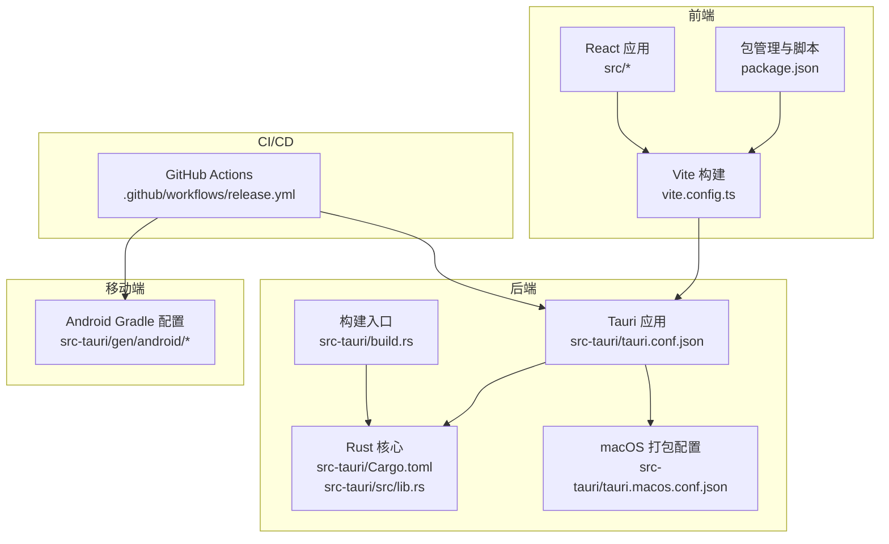
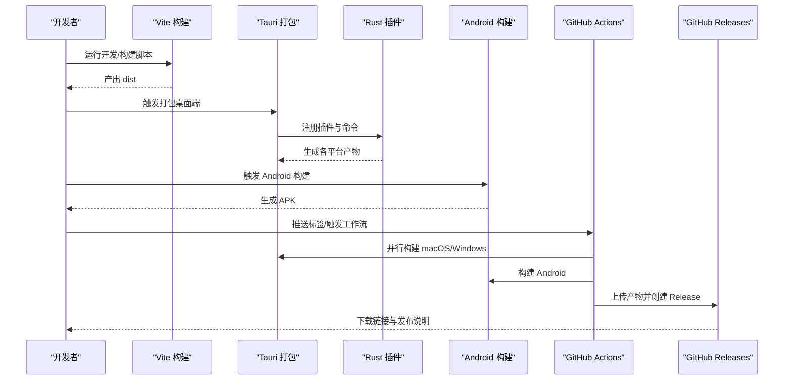
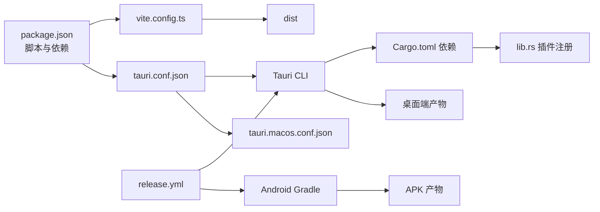

# 构建与部署

<cite>
**本文引用的文件**   
- [package.json](file://package.json)
- [vite.config.ts](file://vite.config.ts)
- [tauri.conf.json](file://src-tauri/tauri.conf.json)
- [tauri.macos.conf.json](file://src-tauri/tauri.macos.conf.json)
- [Cargo.toml](file://src-tauri/Cargo.toml)
- [build.rs](file://src-tauri/build.rs)
- [main.rs](file://src-tauri/src/main.rs)
- [lib.rs](file://src-tauri/src/lib.rs)
- [.github/workflows/release.yml](file://.github/workflows/release.yml)
- [bundle_dmg.sh](file://src-tauri/target/universal-apple-darwin/release/bundle/dmg/bundle_dmg.sh)
- [build.gradle.kts](file://src-tauri/gen/android/build.gradle.kts)
- [app/build.gradle.kts](file://src-tauri/gen/android/app/build.gradle.kts)
- [README.md](file://README.md)
</cite>

## 目录
1. [简介](#简介)
2. [项目结构](#项目结构)
3. [核心组件](#核心组件)
4. [架构总览](#架构总览)
5. [详细组件分析](#详细组件分析)
6. [依赖关系分析](#依赖关系分析)
7. [性能考虑](#性能考虑)
8. [故障排除指南](#故障排除指南)
9. [结论](#结论)
10. [附录](#附录)

## 简介
本指南面向 Assetly 的构建与部署，覆盖多平台构建配置（桌面端 macOS、Windows、Linux 与移动端 Android）、构建脚本配置（Vite 构建优化、Tauri 打包配置与资源处理）、CI/CD 流程（GitHub Actions 工作流、自动化测试与发布）、版本管理策略（语义化版本、变更日志与发布说明）、签名与证书管理（应用签名、代码签名与发布准备），以及发布后的监控与回滚策略、用户反馈收集机制。内容基于仓库现有配置文件进行系统性梳理与可视化呈现。

## 项目结构
项目采用“前端 + Tauri/Rust 后端”的双层架构，前端使用 Vite + React + TypeScript，后端使用 Tauri + Rust，通过 Tauri 配置与 CLI 进行统一打包与分发；Android 通过 Gradle 构建生成 APK；CI 使用 GitHub Actions 在多平台上并行构建并发布到 GitHub Releases。

图表来源
- [vite.config.ts:1-29](file://vite.config.ts#L1-L29)
- [package.json:1-43](file://package.json#L1-L43)
- [tauri.conf.json:1-40](file://src-tauri/tauri.conf.json#L1-L40)
- [Cargo.toml:1-31](file://src-tauri/Cargo.toml#L1-L31)
- [lib.rs:1-49](file://src-tauri/src/lib.rs#L1-L49)
- [build.rs:1-4](file://src-tauri/build.rs#L1-L4)
- [tauri.macos.conf.json:1-10](file://src-tauri/tauri.macos.conf.json#L1-L10)
- [.github/workflows/release.yml:1-266](file://.github/workflows/release.yml#L1-L266)
- [build.gradle.kts:1-29](file://src-tauri/gen/android/build.gradle.kts#L1-L29)
- [app/build.gradle.kts:1-72](file://src-tauri/gen/android/app/build.gradle.kts#L1-L72)

章节来源
- [README.md:157-180](file://README.md#L157-L180)
- [package.json:1-43](file://package.json#L1-L43)
- [vite.config.ts:1-29](file://vite.config.ts#L1-L29)
- [tauri.conf.json:1-40](file://src-tauri/tauri.conf.json#L1-L40)
- [Cargo.toml:1-31](file://src-tauri/Cargo.toml#L1-L31)
- [.github/workflows/release.yml:1-266](file://.github/workflows/release.yml#L1-L266)

## 核心组件
- 前端构建与开发服务器：Vite 配置启用 React 与 Tailwind 插件，开发服务器端口与热更新配置，忽略 src-tauri 目录监听。
- Tauri 应用与打包：统一的 Tauri 配置文件定义产品名、版本、构建前命令、开发/生产 URL、窗口尺寸与安全策略；打包目标为 all，包含多平台图标。
- Rust 后端与插件：Rust 依赖包含 Tauri、SQL 插件、文件系统、通知、日志等插件；lib.rs 中注册插件与命令。
- Android 构建：Gradle 脚本配置 Android SDK、Kotlin、Rust 插件与混淆规则；构建类型区分 debug/release。
- CI/CD：GitHub Actions 在 macOS、Windows、Ubuntu 上分别构建 macOS、Windows、Android；最后汇总产物并创建 GitHub Release。

章节来源
- [vite.config.ts:1-29](file://vite.config.ts#L1-L29)
- [tauri.conf.json:1-40](file://src-tauri/tauri.conf.json#L1-L40)
- [Cargo.toml:1-31](file://src-tauri/Cargo.toml#L1-L31)
- [lib.rs:1-49](file://src-tauri/src/lib.rs#L1-L49)
- [build.gradle.kts:1-29](file://src-tauri/gen/android/build.gradle.kts#L1-L29)
- [app/build.gradle.kts:1-72](file://src-tauri/gen/android/app/build.gradle.kts#L1-L72)
- [.github/workflows/release.yml:1-266](file://.github/workflows/release.yml#L1-L266)

## 架构总览
下图展示了从开发到发布的整体流程，包括前端构建、Tauri 打包、Android 构建与 GitHub Actions 发布。

图表来源
- [package.json:6-11](file://package.json#L6-L11)
- [tauri.conf.json:6-11](file://src-tauri/tauri.conf.json#L6-L11)
- [lib.rs:1-49](file://src-tauri/src/lib.rs#L1-L49)
- [.github/workflows/release.yml:17-266](file://.github/workflows/release.yml#L17-L266)

## 详细组件分析

### Vite 构建与优化
- 插件体系：启用 React 与 Tailwind 插件，满足前端开发与样式需求。
- 开发服务器：固定端口与严格端口绑定，支持通过环境变量启用远程 HMR；忽略 src-tauri 目录以避免不必要的重载。
- 清屏控制：关闭 Vite 默认清屏行为，便于日志查看。

章节来源
- [vite.config.ts:1-29](file://vite.config.ts#L1-L29)

### Tauri 打包配置与资源处理
- 产品与版本：产品名、版本与标识符统一管理。
- 构建流程：beforeDevCommand 指向前端开发脚本，devUrl 指向 Vite；beforeBuildCommand 指向前端构建脚本，frontendDist 指向 dist。
- 窗口与安全：定义窗口尺寸、最小尺寸、居中显示；安全策略中 CSP 设为 null。
- 打包目标：targets 设置为 all，包含多平台图标资源。

章节来源
- [tauri.conf.json:1-40](file://src-tauri/tauri.conf.json#L1-L40)

### macOS 打包与签名准备
- 打包配置：通过 tauri.macos.conf.json 提供 macOS 专属签名与权限配置占位。
- DMG 构建脚本：bundle_dmg.sh 提供 DMG 创建、压缩、签名与公证的完整流程，支持自定义卷标、背景、图标布局、加密、公证与装订等选项。

章节来源
- [tauri.macos.conf.json:1-10](file://src-tauri/tauri.macos.conf.json#L1-L10)
- [bundle_dmg.sh:1-639](file://src-tauri/target/universal-apple-darwin/release/bundle/dmg/bundle_dmg.sh#L1-L639)

### Rust 后端与插件集成
- 依赖与插件：包含 Tauri、SQL、文件系统、通知、日志等插件；日志插件同时输出到应用日志目录与标准输出。
- 命令注册：在 lib.rs 中注册插件与命令；针对 Android 平台提供条件编译的命令实现。
- 入口与子系统：main.rs 中设置 Windows 子系统为 release 模式防止额外控制台窗口。

章节来源
- [Cargo.toml:1-31](file://src-tauri/Cargo.toml#L1-L31)
- [lib.rs:1-49](file://src-tauri/src/lib.rs#L1-L49)
- [main.rs:1-7](file://src-tauri/src/main.rs#L1-L7)

### Android 构建配置
- Gradle 仓库与插件：配置阿里云与腾讯云镜像、Google/Maven Central，启用 Android Gradle Plugin 与 Kotlin 插件。
- 应用配置：compileSdk、targetSdk、minSdk、版本号与版本名来自 tauri.properties；构建类型 debug/release 区分调试与混淆。
- Rust 集成：通过 rust 插件指向根目录，使 Android 构建调用 Rust 生成的原生库。
- 依赖：引入 AndroidX 与 Material Design 依赖，以及测试依赖。

章节来源
- [build.gradle.kts:1-29](file://src-tauri/gen/android/build.gradle.kts#L1-L29)
- [app/build.gradle.kts:1-72](file://src-tauri/gen/android/app/build.gradle.kts#L1-L72)

### CI/CD 工作流与发布
- 触发方式：推送到以 v 开头的标签或手动触发工作流输入版本号。
- 权限：对 Releases 具备写入权限。
- 并行作业：
  - macOS：安装 Node.js、pnpm、Rust（多架构），缓存依赖，执行 Tauri Universal 打包，上传 DMG 与 .app。
  - Windows：安装 Node.js、pnpm、Rust，缓存依赖，安装 WebView2，执行 Tauri 打包，上传 NSIS EXE 与 MSI。
  - Android：安装 Node.js、pnpm、Java 17、Android SDK，安装多架构 Rust 目标，初始化并构建 APK（aarch64），上传 APK。
- 发布：汇总所有产物，根据标签或输入提取版本号，创建 GitHub Release 并附带自动生成的发布说明。

章节来源
- [.github/workflows/release.yml:1-266](file://.github/workflows/release.yml#L1-L266)

### 多平台构建流程

#### 桌面端（macOS、Windows、Linux）
- macOS Universal：使用指定配置文件进行打包，产物包含 DMG 与 .app。
- Windows：安装 WebView2 运行时，打包 NSIS EXE 与 MSI。
- Linux：当前配置 targets 为 all，实际构建需确保 Linux 环境与依赖可用。

章节来源
- [.github/workflows/release.yml:18-143](file://.github/workflows/release.yml#L18-L143)
- [tauri.conf.json:28-38](file://src-tauri/tauri.conf.json#L28-L38)

#### 移动端（Android）
- 环境准备：Node.js、pnpm、Java 17、Android SDK、Rust 多架构目标。
- 初始化与构建：初始化 Android 项目，构建 APK（aarch64），产物位于 Android 输出目录。

章节来源
- [.github/workflows/release.yml:144-224](file://.github/workflows/release.yml#L144-L224)
- [app/build.gradle.kts:58-60](file://src-tauri/gen/android/app/build.gradle.kts#L58-L60)

### 版本管理策略
- 语义化版本：前端与后端版本号保持一致，遵循主.次.修订格式。
- 变更日志：README 中列出数据库迁移历史，可用于生成变更日志。
- 发布说明：GitHub Actions 使用自动生成的发布说明，可结合变更日志补充。

章节来源
- [package.json:4](file://package.json#L4)
- [Cargo.toml:3](file://src-tauri/Cargo.toml#L3)
- [tauri.conf.json:4](file://src-tauri/tauri.conf.json#L4)
- [README.md:199-203](file://README.md#L199-L203)
- [.github/workflows/release.yml:259](file://.github/workflows/release.yml#L259)

### 签名与证书管理
- macOS：tauri.macos.conf.json 提供签名身份与权限配置占位；bundle_dmg.sh 支持 codesign 与 notarize 流程。
- Windows/Linux：当前配置未显式启用签名，可在本地或 CI 中补充签名步骤。
- Android：构建类型 release 使用 debug 签名配置，建议在 CI 中配置正式签名密钥库。

章节来源
- [tauri.macos.conf.json:2-8](file://src-tauri/tauri.macos.conf.json#L2-L8)
- [bundle_dmg.sh:610-634](file://src-tauri/target/universal-apple-darwin/release/bundle/dmg/bundle_dmg.sh#L610-L634)
- [app/build.gradle.kts:40-48](file://src-tauri/gen/android/app/build.gradle.kts#L40-L48)

### 发布后的监控与回滚策略、用户反馈
- 监控与日志：后端日志插件输出到应用日志目录与标准输出，便于定位问题。
- 回滚策略：通过 GitHub Releases 保留历史版本，出现问题时可回退到上一个稳定版本。
- 用户反馈：README 中提供隐私与离线使用说明，建议在应用内或文档中提供反馈渠道与问题报告模板。

章节来源
- [lib.rs:10-18](file://src-tauri/src/lib.rs#L10-L18)
- [.github/workflows/release.yml:225-266](file://.github/workflows/release.yml#L225-L266)
- [README.md:254-261](file://README.md#L254-L261)

## 依赖关系分析

图表来源
- [package.json:1-43](file://package.json#L1-L43)
- [vite.config.ts:1-29](file://vite.config.ts#L1-L29)
- [tauri.conf.json:1-40](file://src-tauri/tauri.conf.json#L1-L40)
- [Cargo.toml:1-31](file://src-tauri/Cargo.toml#L1-L31)
- [lib.rs:1-49](file://src-tauri/src/lib.rs#L1-L49)
- [tauri.macos.conf.json:1-10](file://src-tauri/tauri.macos.conf.json#L1-L10)
- [.github/workflows/release.yml:1-266](file://.github/workflows/release.yml#L1-L266)
- [build.gradle.kts:1-29](file://src-tauri/gen/android/build.gradle.kts#L1-L29)

章节来源
- [package.json:1-43](file://package.json#L1-L43)
- [vite.config.ts:1-29](file://vite.config.ts#L1-L29)
- [tauri.conf.json:1-40](file://src-tauri/tauri.conf.json#L1-L40)
- [Cargo.toml:1-31](file://src-tauri/Cargo.toml#L1-L31)
- [lib.rs:1-49](file://src-tauri/src/lib.rs#L1-L49)
- [tauri.macos.conf.json:1-10](file://src-tauri/tauri.macos.conf.json#L1-L10)
- [.github/workflows/release.yml:1-266](file://.github/workflows/release.yml#L1-L266)
- [build.gradle.kts:1-29](file://src-tauri/gen/android/build.gradle.kts#L1-L29)

## 性能考虑
- 前端构建：Vite 已内置高效开发服务器与热更新；生产构建可通过调整插件与资源加载策略进一步优化。
- Tauri 打包：targets=all 会增加构建时间，建议在 PR 或非发布分支减少目标范围。
- Android 构建：开启混淆与代码压缩可减小体积，但需注意资源与原生库的兼容性。
- 缓存策略：GitHub Actions 已对 pnpm 与 Cargo 依赖进行缓存，建议保持锁文件稳定以提升命中率。

## 故障排除指南
- 开发服务器无法热更新或频繁重启：检查 vite.config.ts 中的 watch.ignore 配置是否正确排除 src-tauri。
- Tauri 开发模式无法连接前端：确认 tauri.conf.json 中 devUrl 与 Vite 端口一致，且 beforeDevCommand 正确。
- macOS 打包失败或签名问题：检查 tauri.macos.conf.json 的签名身份与权限配置；使用 bundle_dmg.sh 的签名与公证参数。
- Windows WebView2 缺失：在 CI 中先安装 WebView2 再执行打包。
- Android 构建报错：确认已安装所需 Rust 目标与 Android SDK；检查 Gradle 仓库与插件版本。
- CI 发布失败：核对标签格式（v*）与 GITHUB_TOKEN 权限；检查产物路径与上传匹配。

章节来源
- [vite.config.ts:24-26](file://vite.config.ts#L24-L26)
- [tauri.conf.json:7-10](file://src-tauri/tauri.conf.json#L7-L10)
- [tauri.macos.conf.json:4](file://src-tauri/tauri.macos.conf.json#L4)
- [.github/workflows/release.yml:125-134](file://.github/workflows/release.yml#L125-L134)
- [.github/workflows/release.yml:187-197](file://.github/workflows/release.yml#L187-L197)
- [app/build.gradle.kts:16-26](file://src-tauri/gen/android/app/build.gradle.kts#L16-L26)

## 结论
本指南基于仓库现有配置，系统梳理了 Assetly 的多平台构建与部署方案。通过 Vite + Tauri 的组合实现跨平台桌面应用，配合 GitHub Actions 实现自动化构建与发布；Android 通过 Gradle 与 Rust 插件完成原生库集成与 APK 生成。建议在后续迭代中完善签名与证书管理、增强发布说明与变更日志、建立回滚与监控机制，以提升发布质量与用户体验。

## 附录
- 快速开始与常用脚本：参见 README 的“快速开始”与“常用脚本”章节。
- 平台支持与特殊说明：参见 README 的“平台支持”与“Android 特殊说明”。

章节来源
- [README.md:108-154](file://README.md#L108-L154)
- [README.md:235-251](file://README.md#L235-L251)