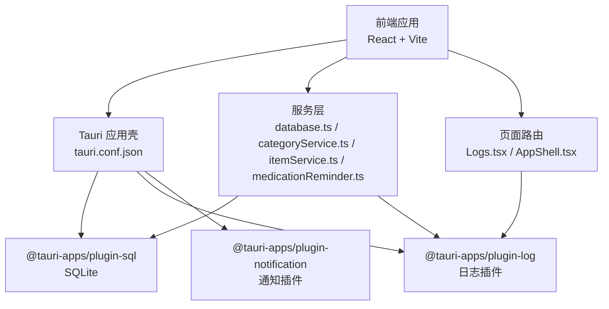
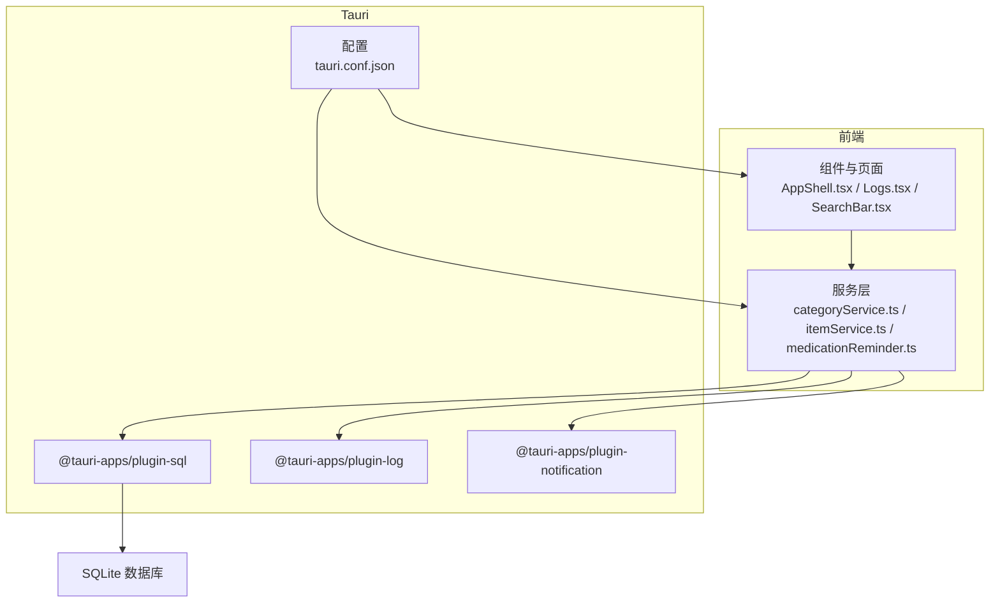
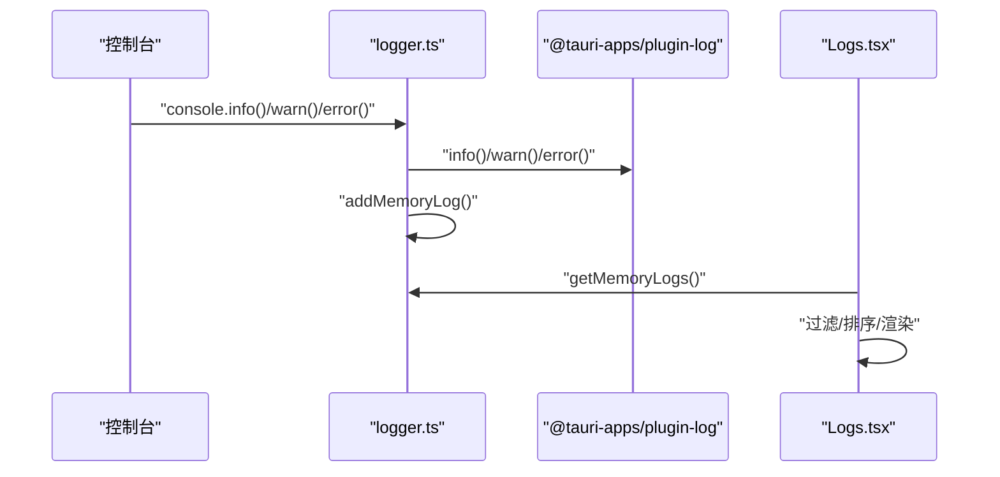
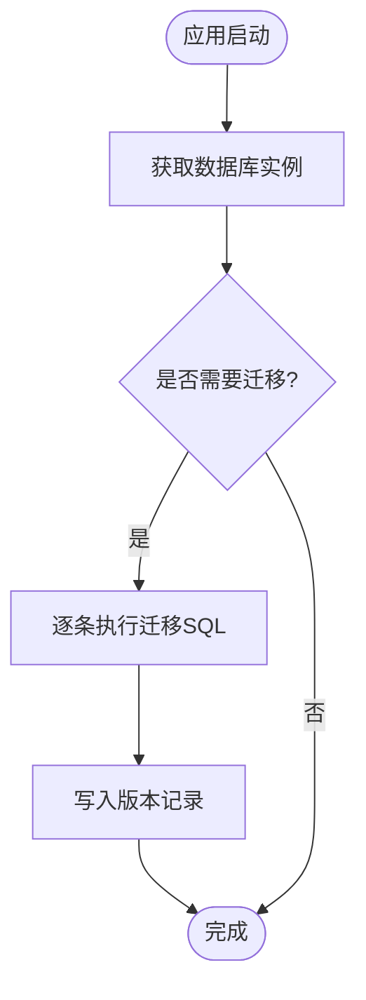
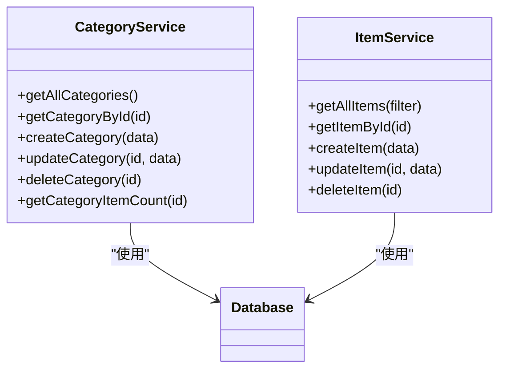
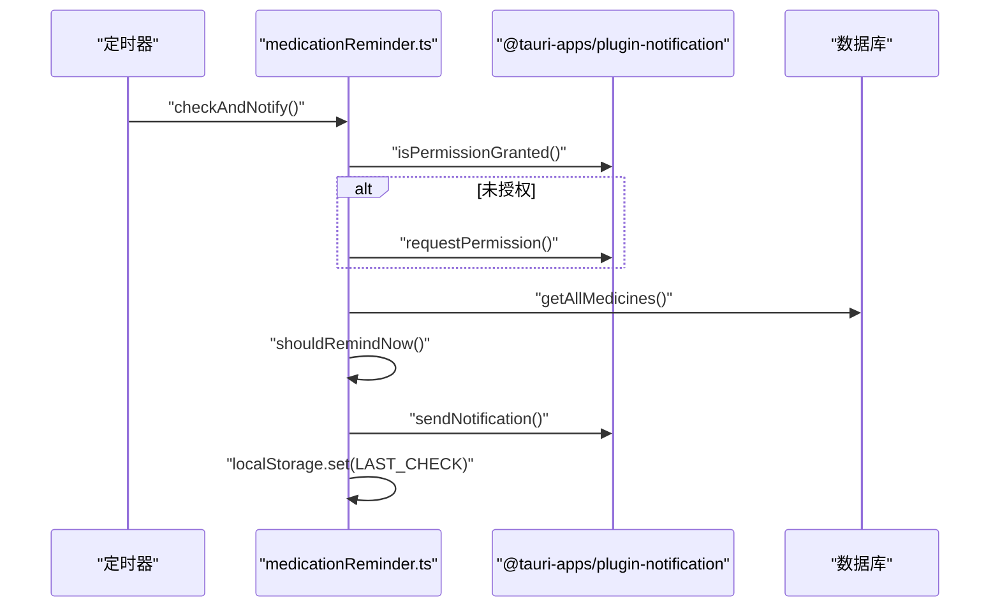
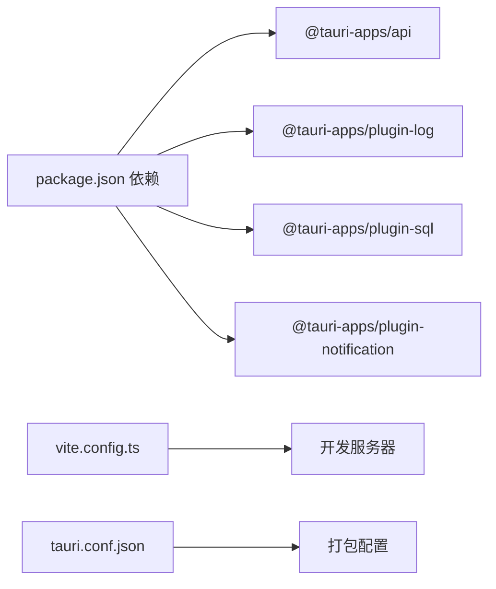

# 测试与调试

<cite>
**本文引用的文件**
- [package.json](file://package.json)
- [vite.config.ts](file://vite.config.ts)
- [tauri.conf.json](file://src-tauri/tauri.conf.json)
- [logger.ts](file://src/utils/logger.ts)
- [database.ts](file://src/services/database.ts)
- [categoryService.ts](file://src/services/categoryService.ts)
- [itemService.ts](file://src/services/itemService.ts)
- [medicationReminder.ts](file://src/services/medicationReminder.ts)
- [Logs.tsx](file://src/routes/Logs.tsx)
- [AppShell.tsx](file://src/components/layout/AppShell.tsx)
- [SearchBar.tsx](file://src/components/shared/SearchBar.tsx)
- [constants.ts](file://src/utils/constants.ts)
- [dateHelper.ts](file://src/utils/dateHelper.ts)
- [release.yml](file://.github/workflows/release.yml)
</cite>

## 目录
1. [简介](#简介)
2. [项目结构](#项目结构)
3. [核心组件](#核心组件)
4. [架构总览](#架构总览)
5. [详细组件分析](#详细组件分析)
6. [依赖分析](#依赖分析)
7. [性能考虑](#性能考虑)
8. [故障排查指南](#故障排查指南)
9. [结论](#结论)
10. [附录](#附录)

## 简介
本指南面向 Assetly 的开发与维护团队，提供从单元测试到集成测试的完整实践路径，覆盖前端组件、服务层与数据库操作；同时给出调试工具使用方法（浏览器开发者工具、React DevTools、Tauri 开发者工具）、日志系统使用与问题定位技巧、性能分析方法（内存、渲染、数据库查询）以及常见问题的调试流程与解决方案，并补充测试自动化与持续集成建议。

## 项目结构
- 前端基于 React 19 与 Vite，通过 @tauri-apps/api 与 Tauri 后端交互。
- 数据库采用 SQLite（通过 @tauri-apps/plugin-sql），在应用启动时自动初始化与迁移。
- 日志系统通过 @tauri-apps/plugin-log 提供，支持内存缓存与持久化输出。
- 药品提醒功能集成 @tauri-apps/plugin-notification，具备权限检查与周期性检查。
- 持续集成工作流位于 .github/workflows/release.yml，用于构建与打包发布。

图表来源
- [tauri.conf.json:1-40](file://src-tauri/tauri.conf.json#L1-L40)
- [package.json:12-41](file://package.json#L12-L41)
- [database.ts:1-171](file://src/services/database.ts#L1-L171)
- [logger.ts:1-84](file://src/utils/logger.ts#L1-L84)
- [medicationReminder.ts:1-131](file://src/services/medicationReminder.ts#L1-L131)
- [Logs.tsx:1-35](file://src/routes/Logs.tsx#L1-L35)
- [AppShell.tsx:1-160](file://src/components/layout/AppShell.tsx#L1-L160)

章节来源
- [package.json:12-41](file://package.json#L12-L41)
- [vite.config.ts:1-29](file://vite.config.ts#L1-L29)
- [tauri.conf.json:1-40](file://src-tauri/tauri.conf.json#L1-L40)

## 核心组件
- 日志系统：封装 console 输出至 Tauri 日志插件，提供内存缓存、分级记录与页面展示。
- 数据库服务：统一获取数据库实例、执行迁移、建表与索引、默认数据填充。
- 业务服务：分类、物品、药品提醒等服务层，负责数据访问与业务逻辑。
- 页面与组件：日志页、应用外壳、搜索栏等，承载用户交互与数据展示。

章节来源
- [logger.ts:1-84](file://src/utils/logger.ts#L1-L84)
- [database.ts:1-171](file://src/services/database.ts#L1-L171)
- [categoryService.ts:1-59](file://src/services/categoryService.ts#L1-L59)
- [itemService.ts:1-127](file://src/services/itemService.ts#L1-L127)
- [medicationReminder.ts:1-131](file://src/services/medicationReminder.ts#L1-L131)
- [Logs.tsx:1-35](file://src/routes/Logs.tsx#L1-L35)
- [AppShell.tsx:1-160](file://src/components/layout/AppShell.tsx#L1-L160)
- [SearchBar.tsx:1-31](file://src/components/shared/SearchBar.tsx#L1-L31)

## 架构总览
下图展示了前端、服务层与 Tauri 插件之间的交互关系，以及日志与通知在系统中的位置。

图表来源
- [AppShell.tsx:1-160](file://src/components/layout/AppShell.tsx#L1-L160)
- [Logs.tsx:1-35](file://src/routes/Logs.tsx#L1-L35)
- [categoryService.ts:1-59](file://src/services/categoryService.ts#L1-L59)
- [itemService.ts:1-127](file://src/services/itemService.ts#L1-L127)
- [medicationReminder.ts:1-131](file://src/services/medicationReminder.ts#L1-L131)
- [database.ts:1-171](file://src/services/database.ts#L1-L171)
- [logger.ts:1-84](file://src/utils/logger.ts#L1-L84)
- [tauri.conf.json:1-40](file://src-tauri/tauri.conf.json#L1-L40)

## 详细组件分析

### 日志系统与日志页面
- 功能要点
  - 将 console 的 log/debug/info/warn/error 转发至 Tauri 日志插件，便于统一收集。
  - 内存缓存最近 N 条日志，支持读取与清空。
  - 日志页面按级别过滤、自动滚动、定时刷新，便于实时观察。
- 使用建议
  - 在应用启动时调用初始化函数，确保所有 console 输出被转发。
  - 对关键业务流程（如数据库连接、迁移、通知权限）记录 info/warn/error。
  - 在开发阶段开启自动滚动，生产环境可关闭以减少干扰。

图表来源
- [logger.ts:1-84](file://src/utils/logger.ts#L1-L84)
- [Logs.tsx:1-35](file://src/routes/Logs.tsx#L1-L35)

章节来源
- [logger.ts:1-84](file://src/utils/logger.ts#L1-L84)
- [Logs.tsx:1-35](file://src/routes/Logs.tsx#L1-L35)

### 数据库初始化与迁移
- 功能要点
  - 首次访问时建立数据库连接并执行迁移。
  - 迁移表记录版本号与执行时间，避免重复执行。
  - 默认种子数据与索引在迁移中创建。
- 测试关注点
  - 初始化顺序：先连接数据库再加载设置。
  - 迁移幂等性：多次运行不重复执行已应用版本。
  - 异常处理：单条 SQL 失败应记录错误并中断迁移。

图表来源
- [database.ts:1-171](file://src/services/database.ts#L1-L171)

章节来源
- [database.ts:1-171](file://src/services/database.ts#L1-L171)

### 服务层：分类与物品
- 分类服务
  - 支持查询、创建、更新、删除与计数。
  - 创建时计算最大排序值并自增，保证顺序稳定。
- 物品服务
  - 支持多条件筛选（分类、位置、状态、模糊搜索）。
  - 动态字段更新，仅对传入字段生成 SQL。
  - 记录关键操作日志，便于审计。
- 单元测试建议
  - 分类：创建/更新/删除/计数的边界条件与事务一致性。
  - 物品：不同组合的筛选参数、空值与特殊字符处理、动态字段拼接正确性。

图表来源
- [categoryService.ts:1-59](file://src/services/categoryService.ts#L1-L59)
- [itemService.ts:1-127](file://src/services/itemService.ts#L1-L127)
- [database.ts:1-171](file://src/services/database.ts#L1-L171)

章节来源
- [categoryService.ts:1-59](file://src/services/categoryService.ts#L1-L59)
- [itemService.ts:1-127](file://src/services/itemService.ts#L1-L127)

### 药品提醒服务
- 功能要点
  - 自动检查通知权限，必要时请求权限。
  - 基于频率类型（每日、N 日、每周）与时间段进行提醒判定。
  - 注册通知动作类型，支持“已服用”“稍后提醒”等快捷操作。
  - 定时器每分钟检查一次，避免同一分钟重复提醒。
- 集成测试建议
  - 权限流程：无权限、拒绝、授权三种场景。
  - 时间段与频率：构造多种时间槽与频率组合验证提醒触发。
  - 本地存储：LAST_CHECK_KEY 的读写与去重逻辑。

图表来源
- [medicationReminder.ts:1-131](file://src/services/medicationReminder.ts#L1-L131)

章节来源
- [medicationReminder.ts:1-131](file://src/services/medicationReminder.ts#L1-L131)

### 前端组件测试要点
- AppShell：导航高亮、主题色注入、移动端适配、数据库初始化状态。
- Logs 页面：日志列表渲染、过滤器、自动滚动、定时刷新。
- SearchBar：输入变更回调、清空按钮行为、占位符与样式。

章节来源
- [AppShell.tsx:1-160](file://src/components/layout/AppShell.tsx#L1-L160)
- [Logs.tsx:1-35](file://src/routes/Logs.tsx#L1-L35)
- [SearchBar.tsx:1-31](file://src/components/shared/SearchBar.tsx#L1-L31)

## 依赖分析
- 前端依赖
  - @tauri-apps/api：与原生能力交互。
  - @tauri-apps/plugin-log：日志转发与持久化。
  - @tauri-apps/plugin-sql：SQLite 数据库访问。
  - @tauri-apps/plugin-notification：系统通知。
- 构建与开发
  - Vite 与 React 插件提供热更新与开发服务器。
  - Tauri CLI 用于应用打包与运行。

图表来源
- [package.json:12-41](file://package.json#L12-L41)
- [vite.config.ts:1-29](file://vite.config.ts#L1-L29)
- [tauri.conf.json:1-40](file://src-tauri/tauri.conf.json#L1-L40)

章节来源
- [package.json:12-41](file://package.json#L12-L41)
- [vite.config.ts:1-29](file://vite.config.ts#L1-L29)
- [tauri.conf.json:1-40](file://src-tauri/tauri.conf.json#L1-L40)

## 性能考虑
- 内存使用监控
  - 利用日志页面的内存日志上限与定时刷新，观察峰值与增长趋势。
  - 在高频操作（如频繁筛选、批量更新）前后记录日志，定位异常增长。
- 渲染性能优化
  - AppShell 中根据窗口宽度切换导航布局，减少不必要的重排。
  - Logs 页面使用固定刷新间隔与自动滚动，避免过度重绘。
- 数据库查询优化
  - 服务层使用参数化查询与索引（如 items 的 category/location/status、medicines 的 expiry/type）。
  - 迁移中创建索引，降低复杂查询成本。
  - 对大结果集分页或限制返回数量，避免一次性渲染过多节点。

章节来源
- [database.ts:1-171](file://src/services/database.ts#L1-L171)
- [itemService.ts:1-127](file://src/services/itemService.ts#L1-L127)
- [AppShell.tsx:1-160](file://src/components/layout/AppShell.tsx#L1-L160)
- [Logs.tsx:1-35](file://src/routes/Logs.tsx#L1-L35)

## 故障排查指南
- 跨平台兼容性
  - 检查 tauri.conf.json 中窗口尺寸、最小宽高与安全策略，确保在桌面端与移动端一致。
  - 使用 Vite 的 host 配置与 HMR 设置，避免开发时网络绑定问题。
- 移动端手势冲突
  - AppShell 的移动端底部导航使用指针事件控制，避免与页面内容手势冲突。
  - 如出现点击穿透，检查容器的 pointer-events 样式与 z-index 层级。
- 通知权限问题
  - medicationReminder.ts 中已包含权限检查与请求流程，若仍失败，查看日志页面的权限状态与错误信息。
  - Android 平台需注册通知动作类型，确保快捷操作可用。
- 数据库连接与迁移
  - 若迁移失败，查看日志中 SQL 片段与错误信息，确认约束与索引创建顺序。
  - 首次启动时等待数据库初始化完成再加载设置，避免并发访问。

章节来源
- [tauri.conf.json:1-40](file://src-tauri/tauri.conf.json#L1-L40)
- [vite.config.ts:1-29](file://vite.config.ts#L1-L29)
- [AppShell.tsx:1-160](file://src/components/layout/AppShell.tsx#L1-L160)
- [medicationReminder.ts:1-131](file://src/services/medicationReminder.ts#L1-L131)
- [database.ts:1-171](file://src/services/database.ts#L1-L171)

## 结论
通过统一的日志系统、完善的数据库迁移机制与服务层抽象，Assetly 已具备良好的可测试性与可观测性。结合本文提供的测试与调试方法，可在开发、集成与生产环境中快速定位问题、优化性能并保障稳定性。

## 附录

### 调试工具使用指南
- 浏览器开发者工具
  - 使用 Elements/Network/Console/Performance 面板定位 UI、网络与性能问题。
  - 在日志页面观察内存日志，结合断点与日志交叉验证。
- React DevTools
  - 检查组件树与状态变化，定位渲染热点与不必要重渲染。
- Tauri 开发者工具
  - 使用 Tauri CLI 运行应用，结合日志插件输出定位原生层问题。
  - 在 Windows/macOS/Linux 上分别验证窗口、通知与文件系统权限。

章节来源
- [logger.ts:1-84](file://src/utils/logger.ts#L1-L84)
- [package.json:34-34](file://package.json#L34-L34)

### 测试自动化与持续集成
- 建议
  - 在 CI 中添加构建与预览命令，确保前端与 Tauri 配置一致。
  - 可选：增加 Lint、Type Check 与最小化 E2E 场景，提升质量门禁。
- 当前工作流
  - release.yml 用于发布流程，可在此基础上扩展测试步骤。

章节来源
- [release.yml](file://.github/workflows/release.yml)