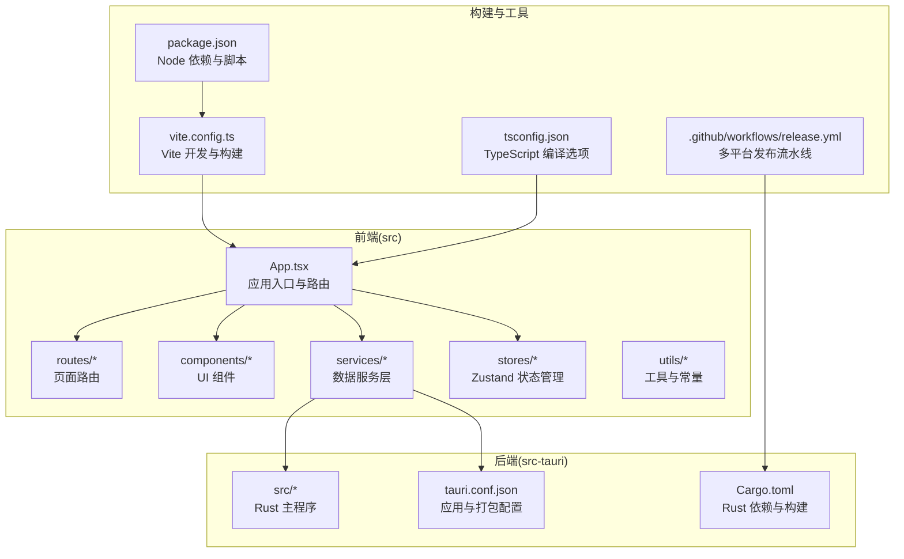
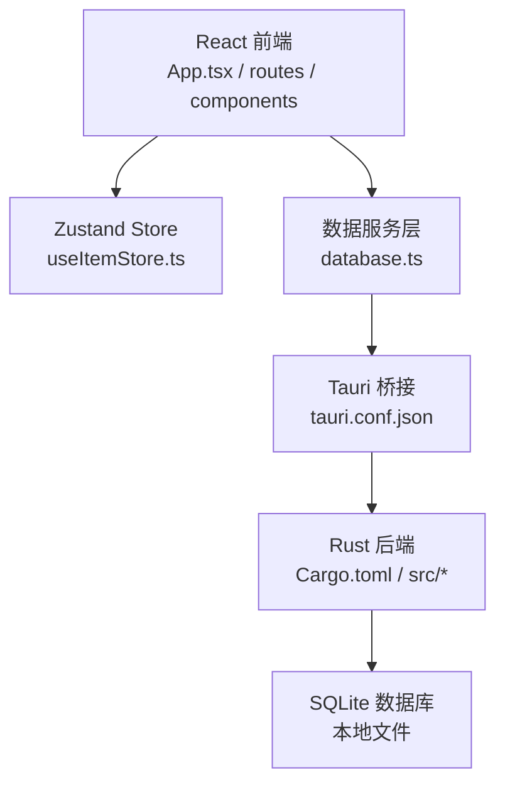
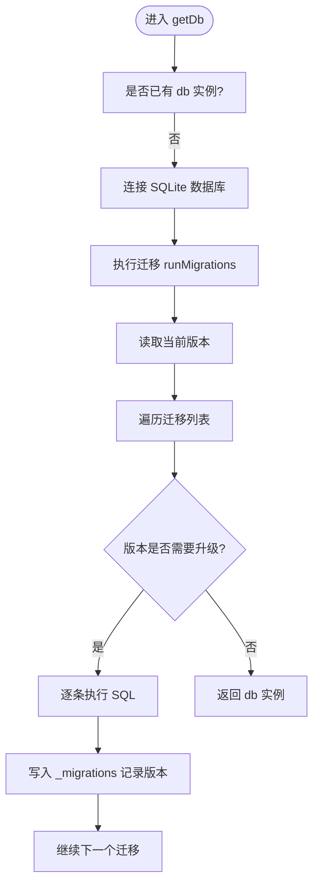
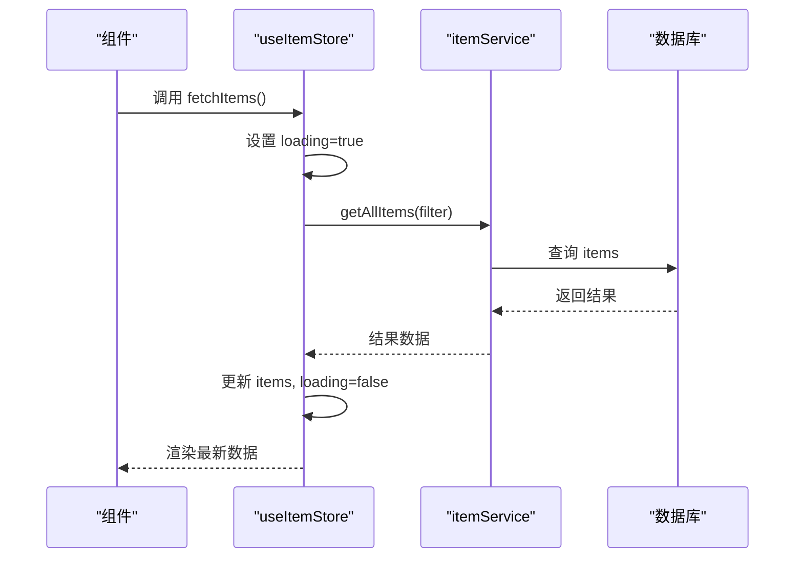
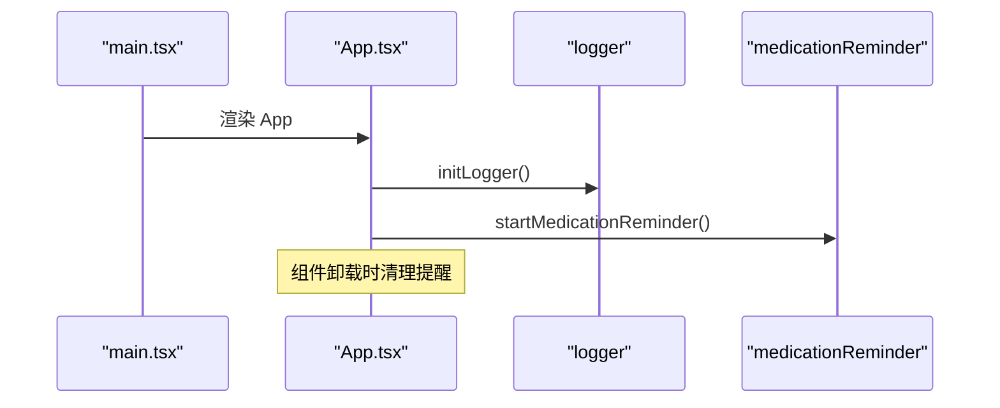
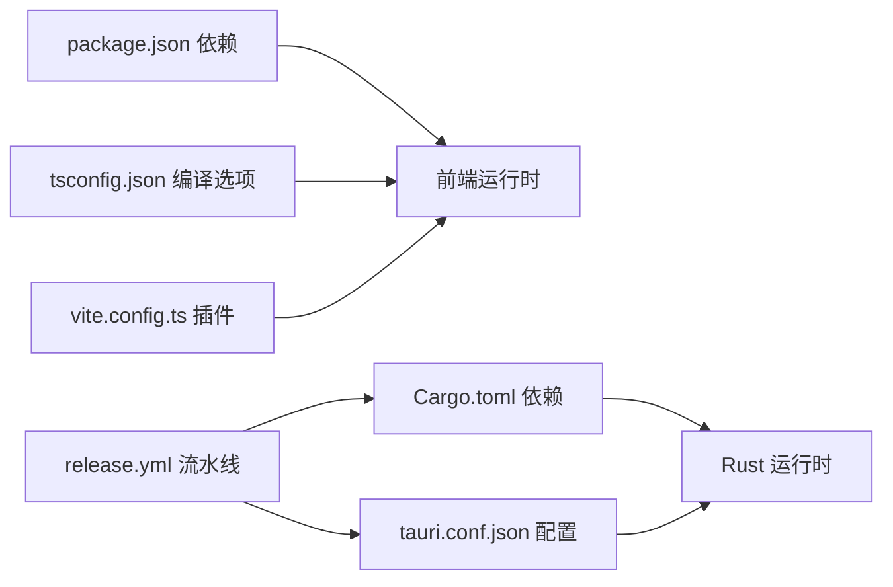

# 贡献指南

<cite>
**本文引用的文件**
- [README.md](file://README.md)
- [package.json](file://package.json)
- [tsconfig.json](file://tsconfig.json)
- [vite.config.ts](file://vite.config.ts)
- [src-tauri/Cargo.toml](file://src-tauri/Cargo.toml)
- [src-tauri/tauri.conf.json](file://src-tauri/tauri.conf.json)
- [.github/workflows/release.yml](file://.github/workflows/release.yml)
- [src/lib/utils.ts](file://src/lib/utils.ts)
- [src/utils/constants.ts](file://src/utils/constants.ts)
- [src/services/database.ts](file://src/services/database.ts)
- [src/stores/useItemStore.ts](file://src/stores/useItemStore.ts)
- [src/App.tsx](file://src/App.tsx)
- [src/main.tsx](file://src/main.tsx)
</cite>

## 目录
1. [简介](#简介)
2. [项目结构](#项目结构)
3. [核心组件](#核心组件)
4. [架构总览](#架构总览)
5. [详细组件分析](#详细组件分析)
6. [依赖关系分析](#依赖关系分析)
7. [性能考虑](#性能考虑)
8. [故障排除指南](#故障排除指南)
9. [结论](#结论)
10. [附录](#附录)

## 简介
本指南面向希望参与 Assetly 项目开发的贡献者，涵盖从 Fork 项目、创建分支、提交代码到发起 Pull Request 的完整流程；制定代码审查标准（代码质量、测试覆盖率、文档更新）；提供问题报告模板（Bug 报告、功能请求、安全漏洞）；说明社区行为准则（沟通礼仪、协作原则、冲突解决机制）；解释贡献者权益与认可机制（贡献者列表、代码贡献统计、特别贡献奖励）；并提供新贡献者入门指导。

## 项目结构
Assetly 采用前后端分离架构：前端基于 React + TypeScript + Vite，后端使用 Tauri 2.x 搭配 Rust，数据持久化采用 SQLite。项目根目录包含前端源码、Tauri/Rust 后端、构建与发布工作流等。

图表来源
- [src/App.tsx:1-92](file://src/App.tsx#L1-L92)
- [src/main.tsx:1-11](file://src/main.tsx#L1-L11)
- [vite.config.ts:1-29](file://vite.config.ts#L1-L29)
- [tsconfig.json:1-26](file://tsconfig.json#L1-L26)
- [package.json:1-43](file://package.json#L1-L43)
- [src-tauri/tauri.conf.json:1-40](file://src-tauri/tauri.conf.json#L1-L40)
- [src-tauri/Cargo.toml:1-31](file://src-tauri/Cargo.toml#L1-L31)
- [.github/workflows/release.yml:1-266](file://.github/workflows/release.yml#L1-L266)

章节来源
- [README.md:157-181](file://README.md#L157-L181)
- [src/App.tsx:1-92](file://src/App.tsx#L1-L92)
- [vite.config.ts:1-29](file://vite.config.ts#L1-L29)
- [tsconfig.json:1-26](file://tsconfig.json#L1-L26)
- [package.json:1-43](file://package.json#L1-L43)
- [src-tauri/tauri.conf.json:1-40](file://src-tauri/tauri.conf.json#L1-L40)
- [src-tauri/Cargo.toml:1-31](file://src-tauri/Cargo.toml#L1-L31)
- [.github/workflows/release.yml:1-266](file://.github/workflows/release.yml#L1-L266)

## 核心组件
- 应用入口与路由：负责初始化日志、启动用药提醒、全局路由与页面布局。
- 数据服务层：封装数据库连接、迁移与 CRUD 操作。
- 状态管理：基于 Zustand 的领域化 Store，统一管理业务状态。
- 常量与工具：集中定义默认分类、标签映射、主题色与货币符号等。
- 构建与打包：Vite + TypeScript + Tauri CLI，CI 多平台发布。

章节来源
- [src/App.tsx:1-92](file://src/App.tsx#L1-L92)
- [src/services/database.ts:1-171](file://src/services/database.ts#L1-L171)
- [src/stores/useItemStore.ts:1-53](file://src/stores/useItemStore.ts#L1-L53)
- [src/utils/constants.ts:1-40](file://src/utils/constants.ts#L1-L40)
- [src/lib/utils.ts:1-7](file://src/lib/utils.ts#L1-L7)

## 架构总览
前端通过 Tauri 桥接到 Rust 后端，Rust 使用 SQL 插件访问 SQLite 数据库。应用启动时初始化日志与提醒服务，并在路由层组织页面。

图表来源
- [src/App.tsx:1-92](file://src/App.tsx#L1-L92)
- [src/services/database.ts:1-171](file://src/services/database.ts#L1-L171)
- [src-tauri/tauri.conf.json:1-40](file://src-tauri/tauri.conf.json#L1-L40)
- [src-tauri/Cargo.toml:1-31](file://src-tauri/Cargo.toml#L1-L31)

## 详细组件分析

### 数据库与迁移
- 初始化与连接：首次访问时建立数据库连接并执行迁移。
- 迁移策略：版本化迁移，逐版本执行 SQL 语句并记录版本。
- 表结构：包含 items、categories、locations、medicines、settings 以及 _migrations。
- 索引与种子：为常用查询字段建立索引，并插入默认分类与设置。

图表来源
- [src/services/database.ts:8-53](file://src/services/database.ts#L8-L53)
- [src/services/database.ts:60-171](file://src/services/database.ts#L60-L171)

章节来源
- [src/services/database.ts:1-171](file://src/services/database.ts#L1-L171)

### 状态管理（Zustand）
- Store 设计：按领域拆分，如 useItemStore，统一管理加载、过滤、增删改查。
- 与服务层解耦：Store 仅调用 service 方法，不直接操作数据库。
- 事件驱动：变更后重新拉取数据以保持视图一致性。

图表来源
- [src/stores/useItemStore.ts:23-32](file://src/stores/useItemStore.ts#L23-L32)

章节来源
- [src/stores/useItemStore.ts:1-53](file://src/stores/useItemStore.ts#L1-L53)

### 应用启动与生命周期
- 初始化：启动日志、注册路由、启动用药提醒。
- 生命周期：应用挂载时初始化，卸载时清理资源。
- 移动端手势：拦截横向滑动以避免与 WebView 导航冲突。

图表来源
- [src/main.tsx:1-11](file://src/main.tsx#L1-L11)
- [src/App.tsx:18-27](file://src/App.tsx#L18-L27)

章节来源
- [src/main.tsx:1-11](file://src/main.tsx#L1-L11)
- [src/App.tsx:1-92](file://src/App.tsx#L1-L92)

## 依赖关系分析
- 前端依赖：React、React Router、Zustand、Recharts、TailwindCSS、Day.js 等。
- 构建工具：Vite、TypeScript、Tailwind Vite 插件。
- Tauri 与 Rust：tauri、tauri-plugin-*、tauri-build、serde、log。
- 发布流水线：GitHub Actions 多平台构建与发布。

图表来源
- [package.json:12-41](file://package.json#L12-L41)
- [tsconfig.json:2-22](file://tsconfig.json#L2-L22)
- [vite.config.ts:1-29](file://vite.config.ts#L1-L29)
- [src-tauri/Cargo.toml:20-30](file://src-tauri/Cargo.toml#L20-L30)
- [src-tauri/tauri.conf.json:6-11](file://src-tauri/tauri.conf.json#L6-L11)
- [.github/workflows/release.yml:17-266](file://.github/workflows/release.yml#L17-L266)

章节来源
- [package.json:1-43](file://package.json#L1-L43)
- [tsconfig.json:1-26](file://tsconfig.json#L1-L26)
- [vite.config.ts:1-29](file://vite.config.ts#L1-L29)
- [src-tauri/Cargo.toml:1-31](file://src-tauri/Cargo.toml#L1-L31)
- [src-tauri/tauri.conf.json:1-40](file://src-tauri/tauri.conf.json#L1-L40)
- [.github/workflows/release.yml:1-266](file://.github/workflows/release.yml#L1-L266)

## 性能考虑
- 构建与开发体验：Vite 提供快速热更新；严格 TypeScript 编译选项减少运行时错误。
- 前端渲染：按需加载与路由懒加载；Zustand 状态粒度拆分降低重渲染范围。
- 数据访问：数据库迁移与索引优化查询性能；避免在渲染路径中进行昂贵计算。
- 移动端优化：拦截横向滑动手势，提升交互稳定性；Tailwind CSS 按需引入，减少样式体积。

章节来源
- [vite.config.ts:1-29](file://vite.config.ts#L1-L29)
- [tsconfig.json:17-22](file://tsconfig.json#L17-L22)
- [src/services/database.ts:124-131](file://src/services/database.ts#L124-L131)
- [README.md:227-231](file://README.md#L227-L231)

## 故障排除指南
- 开发环境无法启动
  - 确认 Node.js、pnpm、Rust 工具链与 Tauri CLI 已安装。
  - 清理缓存后重新安装依赖。
  - 检查 Vite 服务器端口占用与 HMR 配置。
- 数据库迁移失败
  - 查看迁移日志与错误信息，确认 SQL 语法与字段存在性。
  - 确保 SQLite 文件可写且无并发写入冲突。
- 构建失败
  - 检查各平台目标与依赖缓存；参考 CI 流水线步骤复现。
  - Android 构建需正确安装 Java 与 Android 目标。
- 日志与通知
  - 使用内置日志查看运行状态；确保通知权限已授予（移动端）。

章节来源
- [README.md:108-154](file://README.md#L108-L154)
- [src/services/database.ts:38-50](file://src/services/database.ts#L38-L50)
- [.github/workflows/release.yml:49-50](file://.github/workflows/release.yml#L49-L50)
- [README.md:245-250](file://README.md#L245-L250)

## 结论
本指南提供了从入门到贡献的全流程规范与最佳实践。请在提交前遵循代码质量与文档更新要求，使用问题模板清晰描述问题或需求，并遵守社区行为准则。感谢每一位贡献者的付出！

## 附录

### 一、贡献流程（Fork → 分支 → 提交 → PR）
- Fork 仓库至个人账号
- 创建功能/修复/文档分支（建议使用 feat/fix/docs/ refactor 前缀）
- 提交代码并编写清晰的提交信息（含 Issue 编号更佳）
- 在 GitHub 上发起 Pull Request，填写 PR 模板并关联相关 Issue
- 根据 Review 意见修改并同步更新 PR

章节来源
- [README.md:108-128](file://README.md#L108-L128)

### 二、代码审查标准
- 代码质量
  - 符合 TypeScript 严格模式编译选项
  - 组件职责单一，状态与逻辑分离
  - 命名规范一致，注释清晰
- 测试覆盖率
  - 新增/修改功能需补充单元测试或集成测试
  - 覆盖关键分支与边界条件
- 文档更新
  - 修改涉及用户可见的行为或 API，需同步更新 README 或相关文档
  - 新增配置项或环境变量需更新安装与配置说明

章节来源
- [tsconfig.json:17-22](file://tsconfig.json#L17-L22)
- [README.md:108-154](file://README.md#L108-L154)

### 三、问题报告模板

- Bug 报告
  - 标题：简洁描述问题
  - 步骤：重现步骤、期望行为、实际行为
  - 环境：操作系统、应用版本、依赖版本
  - 截图/日志：必要时附带日志文件
- 功能请求
  - 描述：背景与动机
  - 方案：简述实现思路
  - 影响：对现有功能的影响评估
- 安全漏洞
  - 请勿公开在 Issues 中，直接邮件联系维护者并提供复现细节与影响范围

章节来源
- [README.md:254-260](file://README.md#L254-L260)

### 四、社区行为准则
- 尊重与包容：尊重不同观点与背景，营造开放友好的讨论氛围
- 明确沟通：使用清晰、礼貌的语言，避免人身攻击
- 协作原则：以解决问题为导向，积极提供建设性反馈
- 冲突解决：若出现分歧，优先私下沟通；无法解决时由维护者仲裁

### 五、贡献者权益与认可机制
- 贡献者列表：在项目文档中列出贡献者姓名与贡献类别
- 代码贡献统计：通过 Git 历史与 PR 记录统计贡献量
- 特别贡献奖励：对重大修复、新功能或基础设施改进给予公开致谢与激励

### 六、新贡献者入门指导
- 环境准备：安装 Node.js、pnpm、Rust、Tauri CLI
- 本地运行：执行安装与开发命令，启动前端与 Tauri 应用
- 代码风格：遵循 TypeScript 严格模式与项目既有命名约定
- 提交流程：先开 Issue 讨论，再提交 PR 并跟进 Review 意见
- 社区互动：关注 Discussions 与 PR/Issue 讨论，积极参与

章节来源
- [README.md:108-128](file://README.md#L108-L128)
- [README.md:206-232](file://README.md#L206-L232)