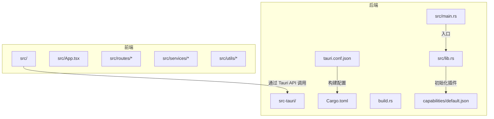
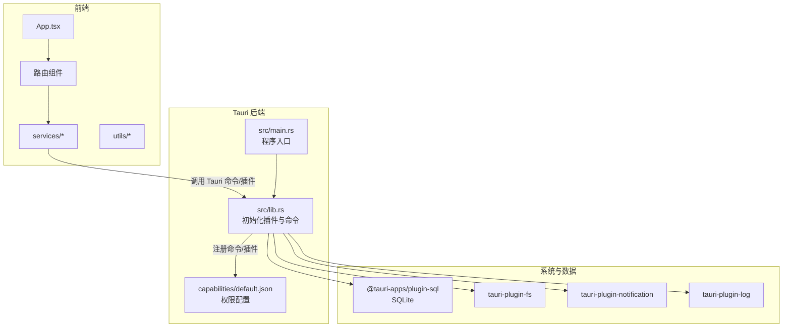
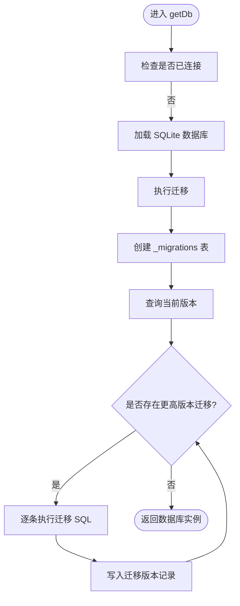
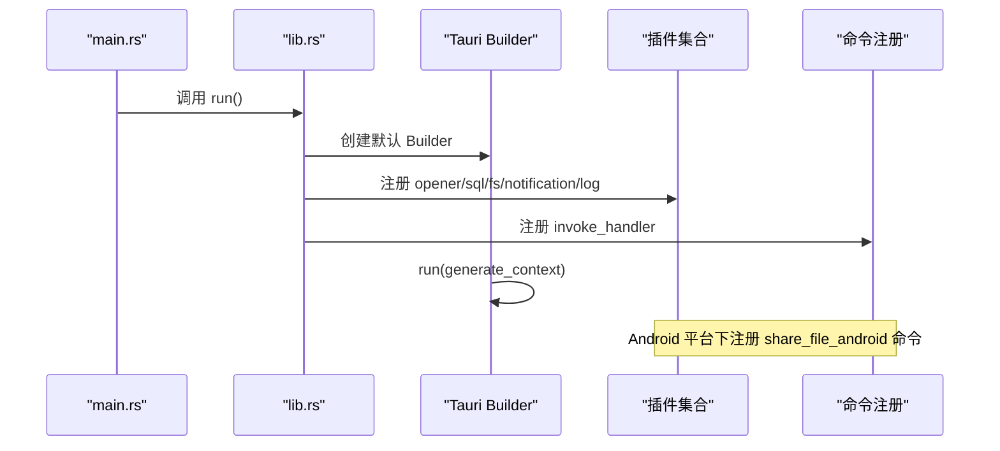
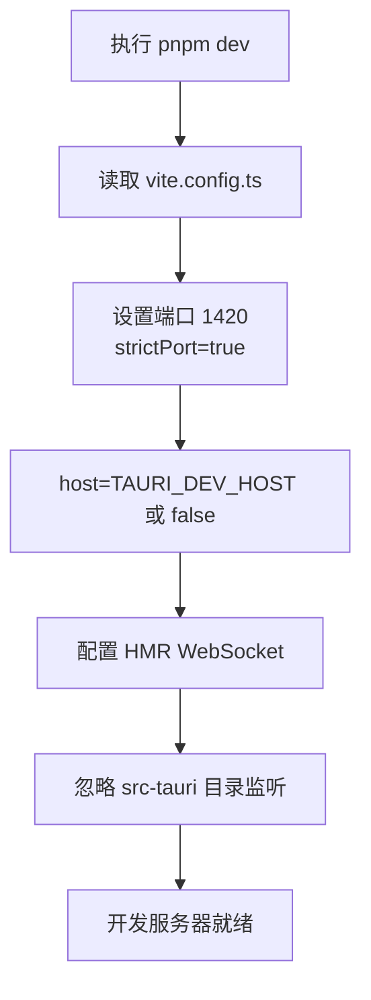
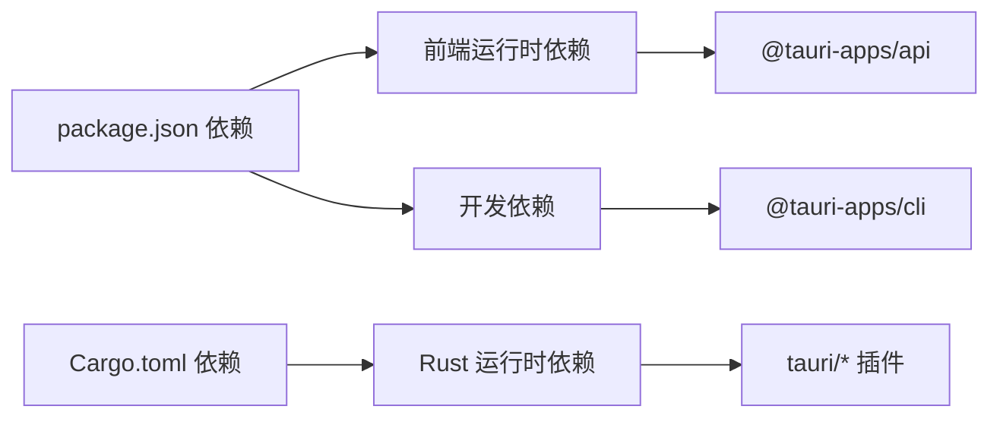

# 快速开始

<cite>
**本文引用的文件**
- [README.md](file://README.md)
- [package.json](file://package.json)
- [vite.config.ts](file://vite.config.ts)
- [tsconfig.json](file://tsconfig.json)
- [src-tauri/tauri.conf.json](file://src-tauri/tauri.conf.json)
- [src-tauri/Cargo.toml](file://src-tauri/Cargo.toml)
- [src-tauri/src/lib.rs](file://src-tauri/src/lib.rs)
- [src-tauri/src/main.rs](file://src-tauri/src/main.rs)
- [src-tauri/build.rs](file://src-tauri/build.rs)
- [src-tauri/capabilities/default.json](file://src-tauri/capabilities/default.json)
- [src/services/database.ts](file://src/services/database.ts)
- [src/utils/constants.ts](file://src/utils/constants.ts)
- [src/App.tsx](file://src/App.tsx)
</cite>

## 目录
1. [简介](#简介)
2. [项目结构](#项目结构)
3. [核心组件](#核心组件)
4. [架构概览](#架构概览)
5. [详细组件分析](#详细组件分析)
6. [依赖分析](#依赖分析)
7. [性能考虑](#性能考虑)
8. [故障排除指南](#故障排除指南)
9. [结论](#结论)
10. [附录](#附录)

## 简介
Assetly 是一款基于 Tauri 2.x + React 19 + TypeScript 的跨平台家庭物品管理应用，支持桌面端（macOS/Windows/Linux）与移动端（Android）。项目采用 SQLite 本地数据库，结合 Rust 后端与前端 Vite + Tailwind CSS 构建，提供物品管理、分类与位置管理、药箱管理、数据统计与导出等功能。

## 项目结构
项目采用前后端分离的 Tauri 架构：
- 前端：React + TypeScript + Vite + Tailwind CSS，位于 src/ 目录
- 后端：Rust + Tauri，位于 src-tauri/ 目录
- 构建与配置：package.json、vite.config.ts、tsconfig.json、tauri.conf.json、Cargo.toml

图表来源
- [src/App.tsx:1-92](file://src/App.tsx#L1-L92)
- [src-tauri/tauri.conf.json:1-40](file://src-tauri/tauri.conf.json#L1-L40)
- [src-tauri/Cargo.toml:1-31](file://src-tauri/Cargo.toml#L1-L31)
- [src-tauri/src/lib.rs:1-49](file://src-tauri/src/lib.rs#L1-L49)
- [src-tauri/src/main.rs:1-7](file://src-tauri/src/main.rs#L1-L7)
- [src-tauri/build.rs:1-4](file://src-tauri/build.rs#L1-L4)
- [src-tauri/capabilities/default.json:1-37](file://src-tauri/capabilities/default.json#L1-L37)

章节来源
- [README.md:157-180](file://README.md#L157-L180)
- [package.json:1-43](file://package.json#L1-L43)
- [vite.config.ts:1-29](file://vite.config.ts#L1-L29)
- [tsconfig.json:1-26](file://tsconfig.json#L1-L26)
- [src-tauri/tauri.conf.json:1-40](file://src-tauri/tauri.conf.json#L1-L40)
- [src-tauri/Cargo.toml:1-31](file://src-tauri/Cargo.toml#L1-L31)

## 核心组件
- 前端应用入口与路由：src/App.tsx 负责初始化日志、启动用药提醒，并配置移动端全面屏手势拦截；路由定义于 routes/ 下各页面组件。
- 数据库与迁移：src/services/database.ts 使用 @tauri-apps/plugin-sql 初始化 SQLite 数据库，执行迁移脚本并写入默认分类与设置。
- 常量与默认值：src/utils/constants.ts 提供默认分类、主题色、货币符号等常量。
- Tauri 后端：src-tauri/src/lib.rs 初始化 Tauri Builder，注册 opener、SQL、FS、Notification、Log 插件；src-tauri/src/main.rs 作为程序入口调用 run()。
- 构建配置：package.json 定义开发与构建脚本；vite.config.ts 配置前端开发服务器端口与热更新；tsconfig.json 控制 TypeScript 编译选项；tauri.conf.json 配置 Tauri 构建、打包与窗口参数；Cargo.toml 管理 Rust 依赖与插件；build.rs 触发 tauri_build。

章节来源
- [src/App.tsx:1-92](file://src/App.tsx#L1-L92)
- [src/services/database.ts:1-171](file://src/services/database.ts#L1-L171)
- [src/utils/constants.ts:1-40](file://src/utils/constants.ts#L1-L40)
- [src-tauri/src/lib.rs:1-49](file://src-tauri/src/lib.rs#L1-L49)
- [src-tauri/src/main.rs:1-7](file://src-tauri/src/main.rs#L1-L7)
- [package.json:6-11](file://package.json#L6-L11)
- [vite.config.ts:9-28](file://vite.config.ts#L9-L28)
- [tsconfig.json:1-26](file://tsconfig.json#L1-L26)
- [src-tauri/tauri.conf.json:6-11](file://src-tauri/tauri.conf.json#L6-L11)
- [src-tauri/Cargo.toml:20-30](file://src-tauri/Cargo.toml#L20-L30)
- [src-tauri/build.rs:1-4](file://src-tauri/build.rs#L1-L4)

## 架构概览
下图展示了前端、Tauri 后端与 SQLite 数据库之间的交互关系，以及移动端与桌面端的差异化能力。

图表来源
- [src/App.tsx:1-92](file://src/App.tsx#L1-L92)
- [src-tauri/src/lib.rs:1-49](file://src-tauri/src/lib.rs#L1-L49)
- [src-tauri/src/main.rs:1-7](file://src-tauri/src/main.rs#L1-L7)
- [src-tauri/capabilities/default.json:1-37](file://src-tauri/capabilities/default.json#L1-L37)
- [src/services/database.ts:1-171](file://src/services/database.ts#L1-L171)

## 详细组件分析

### 数据库与迁移流程
数据库初始化与迁移流程如下：
- 首次连接时加载 SQLite 数据库文件
- 创建迁移记录表并查询当前版本
- 按版本顺序执行迁移语句，插入版本记录
- 种子数据：默认分类与应用设置

图表来源
- [src/services/database.ts:8-53](file://src/services/database.ts#L8-L53)

章节来源
- [src/services/database.ts:1-171](file://src/services/database.ts#L1-L171)
- [src/utils/constants.ts:4-13](file://src/utils/constants.ts#L4-L13)

### Tauri 插件初始化与命令注册
Tauri 后端在 lib.rs 中初始化多个插件并注册命令，同时根据平台条件编译 Android 特定命令占位。

图表来源
- [src-tauri/src/main.rs:4-6](file://src-tauri/src/main.rs#L4-L6)
- [src-tauri/src/lib.rs:3-25](file://src-tauri/src/lib.rs#L3-L25)

章节来源
- [src-tauri/src/lib.rs:1-49](file://src-tauri/src/lib.rs#L1-L49)
- [src-tauri/src/main.rs:1-7](file://src-tauri/src/main.rs#L1-L7)

### 前端开发服务器与热更新
Vite 配置了固定端口与严格端口策略，并支持通过环境变量启用远程主机热更新。

图表来源
- [package.json:7](file://package.json#L7)
- [vite.config.ts:13-27](file://vite.config.ts#L13-L27)

章节来源
- [package.json:6-11](file://package.json#L6-L11)
- [vite.config.ts:1-29](file://vite.config.ts#L1-L29)

## 依赖分析
- 前端依赖：React、React Router DOM、Zustand、Recharts、Lucide React、Day.js、Tailwind CSS、@tauri-apps/api 等
- 开发依赖：@tauri-apps/cli、vite、typescript、tailwindcss、@vitejs/plugin-react 等
- Rust 依赖：tauri、tauri-plugin-opener、tauri-plugin-sql、tauri-plugin-fs、tauri-plugin-notification、tauri-plugin-log、serde、serde_json、log

图表来源
- [package.json:12-41](file://package.json#L12-L41)
- [src-tauri/Cargo.toml:20-30](file://src-tauri/Cargo.toml#L20-L30)

章节来源
- [package.json:1-43](file://package.json#L1-L43)
- [src-tauri/Cargo.toml:1-31](file://src-tauri/Cargo.toml#L1-L31)

## 性能考虑
- 响应式设计：桌面端使用侧边栏导航，移动端使用底部胶囊导航，提升不同屏幕尺寸下的可用性。
- 移动端优化：全面禁用侧滑返回以避免与 WebView 导航冲突；自动适配刘海屏与安全区域；触摸滚动优化与防抖处理。
- 文件分享：移动端通过系统分享面板导出文件，减少额外权限与复杂逻辑。
- 数据库索引：对常用查询字段建立索引，降低查询延迟。

## 故障排除指南
- 端口占用
  - 现象：开发服务器无法启动或 HMR 失败
  - 解决：确认端口 1420/1421 未被占用，或设置 TAURI_DEV_HOST 环境变量以启用远程主机热更新
  - 参考：[vite.config.ts:13-27](file://vite.config.ts#L13-L27)
- Tauri 开发命令失败
  - 现象：执行 pnpm tauri dev 报错
  - 解决：确保前端开发服务器已启动（beforeDevCommand），且端口与 devUrl 配置一致
  - 参考：[src-tauri/tauri.conf.json:6-11](file://src-tauri/tauri.conf.json#L6-L11)
- 数据库迁移异常
  - 现象：迁移 SQL 执行失败或版本不匹配
  - 解决：检查迁移语句与 SQLite 版本兼容性，清理旧数据库文件后重试
  - 参考：[src/services/database.ts:38-50](file://src/services/database.ts#L38-L50)
- Android 权限问题
  - 现象：导出文件无权限或通知未显示
  - 解决：Android 13+ 需手动授予通知权限；确认存储权限已声明
  - 参考：[README.md:245-250](file://README.md#L245-L250)
- 构建产物位置
  - macOS Universal：src-tauri/target/universal-apple-darwin/release/bundle/
  - Android：src-tauri/gen/android/app/build/outputs/apk/universal/release/
  - 参考：[README.md:150-154](file://README.md#L150-L154)

章节来源
- [vite.config.ts:13-27](file://vite.config.ts#L13-L27)
- [src-tauri/tauri.conf.json:6-11](file://src-tauri/tauri.conf.json#L6-L11)
- [src/services/database.ts:38-50](file://src/services/database.ts#L38-L50)
- [README.md:245-250](file://README.md#L245-L250)
- [README.md:150-154](file://README.md#L150-L154)

## 结论
通过本快速开始指南，您可以在本地完成开发环境搭建，启动前端开发服务器与 Tauri 桌面应用，并生成桌面端与移动端的构建产物。若遇到常见问题，可参考故障排除指南进行定位与修复。建议在不同平台验证构建结果，并关注移动端权限与通知配置。

## 附录

### 环境要求与安装步骤
- Node.js（LTS 版本）、pnpm 包管理器、Rust 工具链、Tauri CLI
- 安装依赖：pnpm install
- 开发模式：pnpm tauri dev
- 参考：[README.md:110-128](file://README.md#L110-L128)

章节来源
- [README.md:110-128](file://README.md#L110-L128)

### 构建与产物位置
- 桌面端（macOS/Windows/Linux）：pnpm tauri build --target universal-apple-darwin 或 x86_64-pc-windows-msvc
- 移动端（Android）：pnpm tauri android build --apk 或 --target aarch64
- 产物位置：macOS 在 src-tauri/target/universal-apple-darwin/release/bundle/；Android 在 src-tauri/gen/android/app/build/outputs/apk/universal/release/
- 参考：[README.md:130-154](file://README.md#L130-L154)

章节来源
- [README.md:130-154](file://README.md#L130-L154)