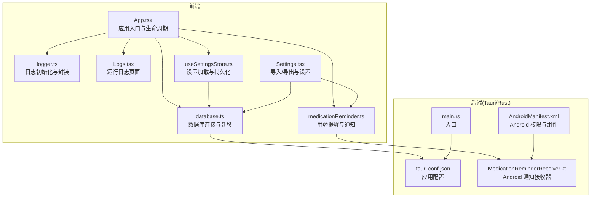
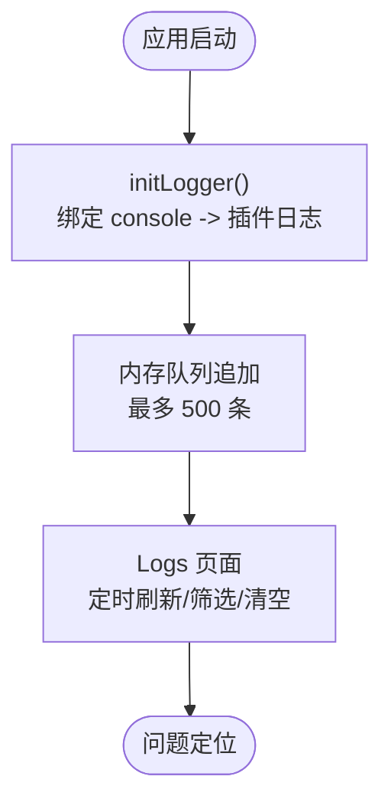
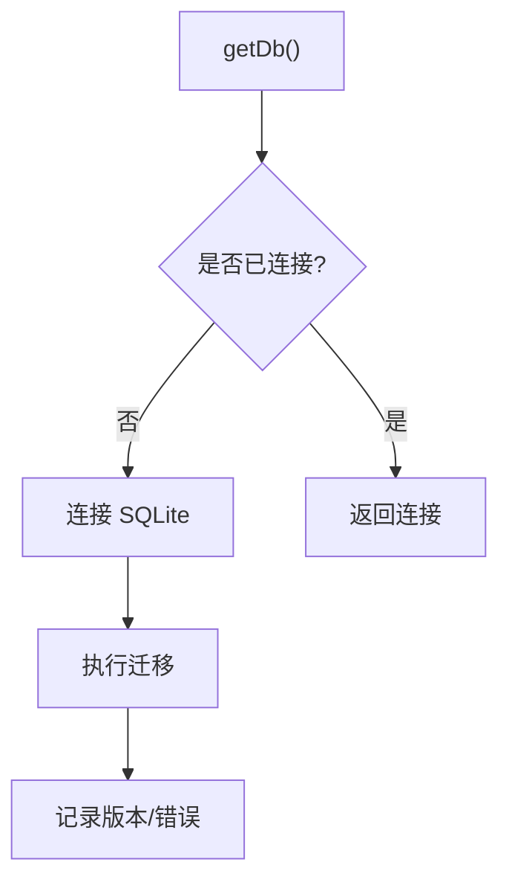
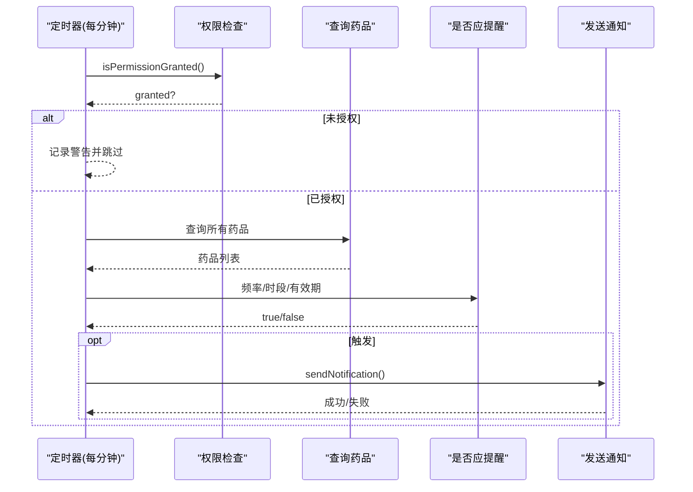
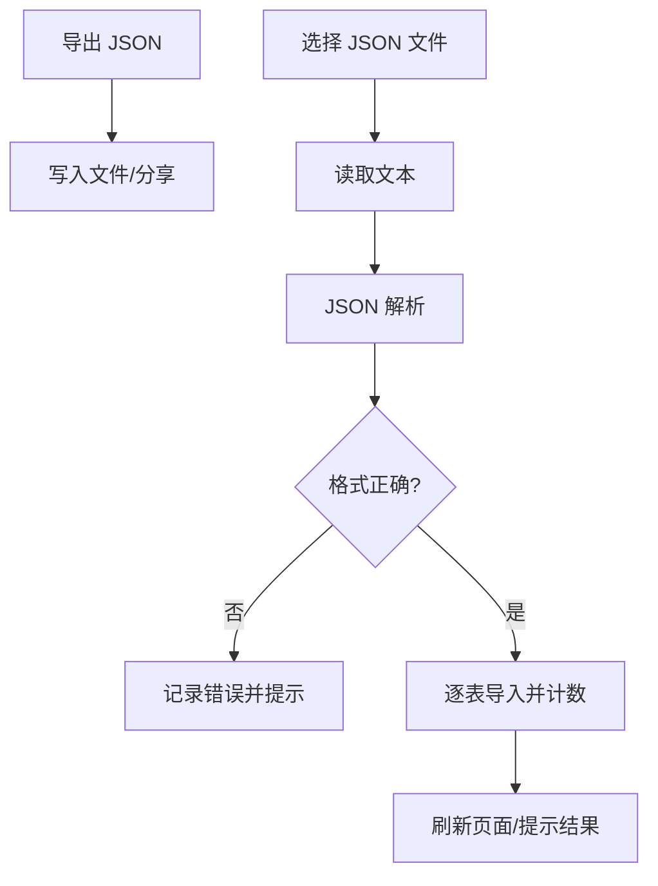
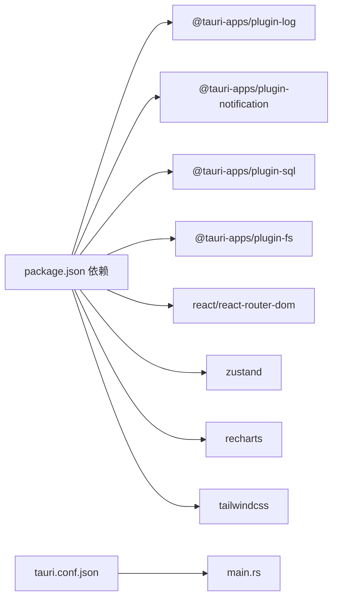

# 故障排除

<cite>
**本文引用的文件**
- [README.md](file://README.md)
- [logger.ts](file://src/utils/logger.ts)
- [Logs.tsx](file://src/routes/Logs.tsx)
- [database.ts](file://src/services/database.ts)
- [medicationReminder.ts](file://src/services/medicationReminder.ts)
- [AppShell.tsx](file://src/components/layout/AppShell.tsx)
- [App.tsx](file://src/App.tsx)
- [useSettingsStore.ts](file://src/stores/useSettingsStore.ts)
- [constants.ts](file://src/utils/constants.ts)
- [Settings.tsx](file://src/routes/Settings.tsx)
- [exportService.ts](file://src/services/exportService.ts)
- [tauri.conf.json](file://src-tauri/tauri.conf.json)
- [main.rs](file://src-tauri/src/main.rs)
- [AndroidManifest.xml](file://src-tauri/gen/android/app/src/main/AndroidManifest.xml)
- [MedicationReminderReceiver.kt](file://src-tauri/gen/android/app/src/main/java/com/assetly/home/MedicationReminderReceiver.kt)
- [package.json](file://package.json)
</cite>

## 目录
1. [简介](#简介)
2. [项目结构](#项目结构)
3. [核心组件](#核心组件)
4. [架构总览](#架构总览)
5. [详细组件分析](#详细组件分析)
6. [依赖关系分析](#依赖关系分析)
7. [性能考虑](#性能考虑)
8. [故障排除指南](#故障排除指南)
9. [结论](#结论)
10. [附录](#附录)

## 简介
本指南面向 Assetly 用户与维护者，聚焦于安装配置、运行时错误、性能问题的排查与解决；详述内置日志系统使用方法（日志级别、查看与定位）、调试工具（浏览器开发者工具、Tauri 开发者工具、系统日志）；补充移动端（Android）特有问题（权限、通知、性能）与环境差异处理；最后提供社区支持与问题反馈渠道。

## 项目结构
- 前端采用 React + TypeScript，通过 Vite 构建，Tauri 作为原生外壳承载桌面与移动平台。
- 后端（Rust）通过 Tauri 插件桥接前端与系统能力（日志、通知、文件系统、SQL）。
- 数据持久化基于 SQLite，通过 Tauri SQL 插件访问，并内置迁移机制。
- 日志系统通过 tauri-plugin-log 将前端 console 输出转发至原生日志插件，同时在内存中维护最近 500 条日志条目，便于实时查看。



图表来源
- [App.tsx:18-27](file://src/App.tsx#L18-L27)
- [logger.ts:7-25](file://src/utils/logger.ts#L7-L25)
- [Logs.tsx:14-29](file://src/routes/Logs.tsx#L14-L29)
- [database.ts:8-16](file://src/services/database.ts#L8-L16)
- [medicationReminder.ts:53-97](file://src/services/medicationReminder.ts#L53-L97)
- [useSettingsStore.ts:19-35](file://src/stores/useSettingsStore.ts#L19-L35)
- [Settings.tsx:204-255](file://src/routes/Settings.tsx#L204-L255)
- [tauri.conf.json:1-40](file://src-tauri/tauri.conf.json#L1-L40)
- [main.rs:4-6](file://src-tauri/src/main.rs#L4-L6)
- [AndroidManifest.xml:1-49](file://src-tauri/gen/android/app/src/main/AndroidManifest.xml#L1-L49)
- [MedicationReminderReceiver.kt:40-67](file://src-tauri/gen/android/app/src/main/java/com/assetly/home/MedicationReminderReceiver.kt#L40-L67)

章节来源
- [README.md:157-180](file://README.md#L157-L180)
- [package.json:12-31](file://package.json#L12-L31)

## 核心组件
- 日志系统：初始化控制台转发、内存日志缓存、级别过滤与页面展示。
- 数据库与迁移：延迟连接、迁移执行、错误日志与回滚点。
- 用药提醒：权限检查、频率与时段判断、通知发送与动作类型注册。
- 设置与导入导出：设置项持久化、JSON 导出、文件导入与错误提示。
- Android 权限与通知：权限声明、通知渠道、前台服务与广播接收器。

章节来源
- [logger.ts:7-83](file://src/utils/logger.ts#L7-L83)
- [database.ts:18-53](file://src/services/database.ts#L18-L53)
- [medicationReminder.ts:53-131](file://src/services/medicationReminder.ts#L53-L131)
- [Settings.tsx:204-255](file://src/routes/Settings.tsx#L204-L255)
- [AndroidManifest.xml:3-8](file://src-tauri/gen/android/app/src/main/AndroidManifest.xml#L3-L8)

## 架构总览
下图展示从应用启动到日志、数据库、通知与设置导入导出的关键交互流程。

```mermaid
sequenceDiagram
participant U as "用户"
participant APP as "App.tsx"
participant LOG as "logger.ts"
participant DB as "database.ts"
participant REM as "medicationReminder.ts"
participant SET as "useSettingsStore.ts"
participant EXP as "exportService.ts"
participant AND as "AndroidManifest.xml"
U->>APP : 启动应用
APP->>LOG : 初始化日志转发
APP->>DB : 获取数据库连接
DB-->>APP : 连接成功/迁移完成
APP->>REM : 启动用药提醒定时器
REM->>AND : 请求通知权限/注册动作类型
U->>SET : 加载设置
U->>EXP : 导出/导入数据(JSON)
EXP-->>U : 导出/导入结果
```

图表来源
- [App.tsx:18-27](file://src/App.tsx#L18-L27)
- [logger.ts:7-25](file://src/utils/logger.ts#L7-L25)
- [database.ts:8-16](file://src/services/database.ts#L8-L16)
- [medicationReminder.ts:102-131](file://src/services/medicationReminder.ts#L102-L131)
- [useSettingsStore.ts:19-35](file://src/stores/useSettingsStore.ts#L19-L35)
- [exportService.ts:4-13](file://src/services/exportService.ts#L4-L13)
- [AndroidManifest.xml:3-8](file://src-tauri/gen/android/app/src/main/AndroidManifest.xml#L3-L8)

## 详细组件分析

### 日志系统（logger.ts 与 Logs.tsx）
- 初始化：将 console.log/debug/info/warn/error 转发至 Tauri 日志插件，同时写入内存队列（最多 500 条），并带来源标识。
- 级别：trace/debug/info/warn/error，页面支持按级别筛选与自动刷新。
- 使用建议：在关键路径（数据库连接、迁移、导入导出、通知权限）打点，结合“来源”字段快速定位模块。



图表来源
- [logger.ts:7-25](file://src/utils/logger.ts#L7-L25)
- [logger.ts:42-55](file://src/utils/logger.ts#L42-L55)
- [Logs.tsx:14-29](file://src/routes/Logs.tsx#L14-L29)

章节来源
- [logger.ts:7-83](file://src/utils/logger.ts#L7-L83)
- [Logs.tsx:14-149](file://src/routes/Logs.tsx#L14-L149)

### 数据库与迁移（database.ts）
- 连接策略：首次调用时建立连接并执行迁移，记录当前版本与每步 SQL 的执行情况。
- 错误处理：单条 SQL 失败即记录错误日志并抛出，避免部分迁移成功导致的数据不一致。
- 建议：若出现“迁移失败”或“表不存在”，先在 Logs 中确认错误 SQL 片段与来源模块，再核对目标字段是否存在。



图表来源
- [database.ts:8-16](file://src/services/database.ts#L8-L16)
- [database.ts:18-53](file://src/services/database.ts#L18-L53)

章节来源
- [database.ts:8-16](file://src/services/database.ts#L8-L16)
- [database.ts:18-53](file://src/services/database.ts#L18-L53)

### 用药提醒与通知（medicationReminder.ts 与 AndroidManifest.xml）
- 权限：启动时检查通知权限，未授权则尝试请求；失败则跳过本轮检查并在日志中告警。
- 触发条件：频率（每日/每隔 N 天/每周）、时段（小时:分钟集合）、有效期范围、是否正在服用。
- Android：注册通知动作类型（已服用/稍后提醒），声明前台服务与开机广播权限，必要时加入电池优化白名单以保持前台运行。



图表来源
- [medicationReminder.ts:53-97](file://src/services/medicationReminder.ts#L53-L97)
- [medicationReminder.ts:102-131](file://src/services/medicationReminder.ts#L102-L131)
- [AndroidManifest.xml:3-8](file://src-tauri/gen/android/app/src/main/AndroidManifest.xml#L3-L8)

章节来源
- [medicationReminder.ts:53-131](file://src/services/medicationReminder.ts#L53-L131)
- [AndroidManifest.xml:3-8](file://src-tauri/gen/android/app/src/main/AndroidManifest.xml#L3-L8)

### 设置与导入导出（useSettingsStore.ts 与 Settings.tsx）
- 设置加载：从 settings 表读取键值，JSON 解析容错，更新全局状态与 CSS 变量。
- 导入导出：导出完整 JSON（含分类、位置、物品、药品），导入时逐条 INSERT OR REPLACE 并统计成功/失败与错误原因。
- 建议：导入前先备份，导入后刷新页面；若导入失败，查看 Logs 中的错误片段与来源模块。



图表来源
- [exportService.ts:4-13](file://src/services/exportService.ts#L4-L13)
- [exportService.ts:53-124](file://src/services/exportService.ts#L53-L124)
- [Settings.tsx:204-255](file://src/routes/Settings.tsx#L204-L255)
- [useSettingsStore.ts:19-35](file://src/stores/useSettingsStore.ts#L19-L35)

章节来源
- [exportService.ts:4-13](file://src/services/exportService.ts#L4-L13)
- [exportService.ts:53-124](file://src/services/exportService.ts#L53-L124)
- [Settings.tsx:204-255](file://src/routes/Settings.tsx#L204-L255)
- [useSettingsStore.ts:19-35](file://src/stores/useSettingsStore.ts#L19-L35)

### Android 权限与通知（AndroidManifest.xml 与 MedicationReminderReceiver.kt）
- 权限：INTERNET、读写外部存储、POST_NOTIFICATIONS、RECEIVE_BOOT_COMPLETED、FOREGROUND_SERVICE。
- 通知：注册广播接收器 MediationReminderReceiver 用于前台通知与振动提醒。
- 建议：Android 13+ 需手动授予通知权限；为避免被系统限制，建议加入电池优化白名单。

章节来源
- [AndroidManifest.xml:3-8](file://src-tauri/gen/android/app/src/main/AndroidManifest.xml#L3-L8)
- [MedicationReminderReceiver.kt:40-67](file://src-tauri/gen/android/app/src/main/java/com/assetly/home/MedicationReminderReceiver.kt#L40-L67)

## 依赖关系分析
- 前端依赖：@tauri-apps/plugin-log、@tauri-apps/plugin-notification、@tauri-apps/plugin-sql 等。
- 构建与运行：Vite、TypeScript、React、Zustand、Recharts、TailwindCSS。
- 后端：Tauri 配置与 Rust 入口 main.rs。



图表来源
- [package.json:12-31](file://package.json#L12-L31)
- [tauri.conf.json:1-40](file://src-tauri/tauri.conf.json#L1-L40)
- [main.rs:4-6](file://src-tauri/src/main.rs#L4-L6)

章节来源
- [package.json:12-31](file://package.json#L12-L31)
- [tauri.conf.json:1-40](file://src-tauri/tauri.conf.json#L1-L40)
- [main.rs:4-6](file://src-tauri/src/main.rs#L4-L6)

## 性能考虑
- 日志内存上限：最多保留 500 条，避免长期运行占用过多内存。
- 数据库索引：迁移中创建常用字段索引，有助于查询性能。
- 通知检查节流：每分钟检查一次，避免重复触发。
- 前端渲染：日志列表按需渲染，自动滚动优化。

章节来源
- [logger.ts:42-55](file://src/utils/logger.ts#L42-L55)
- [database.ts:124-132](file://src/services/database.ts#L124-L132)
- [medicationReminder.ts:72-74](file://src/services/medicationReminder.ts#L72-L74)

## 故障排除指南

### 一、安装与环境问题
- 症状：无法启动开发或构建
  - 检查 Node.js、pnpm、Rust、Tauri CLI 是否满足要求
  - 清理缓存后重装依赖
  - 确认 Tauri 配置与平台目标正确
- 症状：Android 构建失败
  - 检查 Android 权限声明与签名配置
  - 确认 Gradle、JDK 版本与 ANDROID_HOME
- 症状：iOS 待测试
  - 按平台支持说明进行验证

章节来源
- [README.md:110-116](file://README.md#L110-L116)
- [README.md:235-244](file://README.md#L235-L244)
- [tauri.conf.json:1-40](file://src-tauri/tauri.conf.json#L1-L40)

### 二、运行时错误定位
- 步骤 1：打开“运行日志”页面，启用自动刷新
- 步骤 2：按级别筛选（ERROR/WARN/INFO/DEBUG/TRACE）
- 步骤 3：根据“来源”字段定位模块（如 Database、MedicationReminder、App）
- 步骤 4：复制错误时间戳与消息，结合代码路径定位具体实现

章节来源
- [Logs.tsx:14-149](file://src/routes/Logs.tsx#L14-L149)
- [logger.ts:77-83](file://src/utils/logger.ts#L77-L83)

### 三、数据库与迁移问题
- 症状：启动后数据异常或表缺失
  - 查看 Logs 中“迁移 SQL 执行失败”的片段与来源模块
  - 确认目标字段存在（如迁移 v2/v3/v4 新增字段）
  - 重新初始化数据库或修复字段后再试
- 建议：在迁移前后做好数据备份

章节来源
- [database.ts:18-53](file://src/services/database.ts#L18-L53)
- [database.ts:60-170](file://src/services/database.ts#L60-L170)

### 四、通知与用药提醒问题
- 症状：未收到提醒
  - 检查通知权限是否授予；若未授予，尝试再次请求
  - 确认频率/时段设置与当前时间匹配
  - Android 需确保前台运行与电池优化白名单
- 症状：重复提醒
  - 检查“最近检查时间”逻辑，避免同一分钟重复触发
- 症状：Android 通知无声音/震动
  - 检查通知渠道与振动配置

章节来源
- [medicationReminder.ts:53-97](file://src/services/medicationReminder.ts#L53-L97)
- [medicationReminder.ts:102-131](file://src/services/medicationReminder.ts#L102-L131)
- [AndroidManifest.xml:3-8](file://src-tauri/gen/android/app/src/main/AndroidManifest.xml#L3-L8)
- [MedicationReminderReceiver.kt:40-67](file://src-tauri/gen/android/app/src/main/java/com/assetly/home/MedicationReminderReceiver.kt#L40-L67)

### 五、导入/导出问题
- 症状：导入失败或部分失败
  - 查看 Logs 中“导入失败: ...”的错误原因
  - 检查 JSON 结构与字段映射
  - 重新导出并比对字段差异
- 症状：导出为空
  - 确认数据库中是否存在对应表数据

章节来源
- [exportService.ts:53-124](file://src/services/exportService.ts#L53-L124)
- [Settings.tsx:204-255](file://src/routes/Settings.tsx#L204-L255)

### 六、设置与主题问题
- 症状：主题色不生效
  - 确认设置加载成功与 CSS 变量已更新
- 症状：货币符号异常
  - 检查设置项与常量映射

章节来源
- [useSettingsStore.ts:19-35](file://src/stores/useSettingsStore.ts#L19-L35)
- [constants.ts:29-40](file://src/utils/constants.ts#L29-L40)

### 七、移动端（Android）特有问题
- 权限问题
  - INTERNET、读写存储、通知、开机广播、前台服务均已声明
  - Android 13+ 需手动授予通知权限
- 通知失败
  - 检查通知渠道与动作类型注册
  - 确保前台服务运行与白名单
- 性能瓶颈
  - 避免频繁触发检查，注意节流与索引使用
  - 减少不必要的日志输出

章节来源
- [AndroidManifest.xml:3-8](file://src-tauri/gen/android/app/src/main/AndroidManifest.xml#L3-L8)
- [medicationReminder.ts:102-131](file://src/services/medicationReminder.ts#L102-L131)
- [database.ts:124-132](file://src/services/database.ts#L124-L132)

### 八、环境差异与平台差异
- 桌面端：窗口最小尺寸、CSP 等安全策略
- 移动端：手势禁用、安全区域适配、通知渠道
- 建议：在不同平台复现问题，分别查看 Logs 与系统日志

章节来源
- [tauri.conf.json:12-27](file://src-tauri/tauri.conf.json#L12-L27)
- [README.md:227-231](file://README.md#L227-L231)

### 九、日志系统使用方法
- 启用与查看
  - 在应用启动时初始化日志转发
  - 打开“运行日志”页面，按级别筛选与自动刷新
- 日志级别
  - TRACE：最低级别，用于调试细节
  - DEBUG：辅助定位流程
  - INFO：常规运行信息
  - WARN：潜在问题
  - ERROR：错误事件
- 问题定位
  - 结合“来源”字段与时间戳，定位到具体模块与调用栈
  - 对照实现文件，缩小问题范围

章节来源
- [logger.ts:7-25](file://src/utils/logger.ts#L7-L25)
- [logger.ts:28-40](file://src/utils/logger.ts#L28-L40)
- [Logs.tsx:6-12](file://src/routes/Logs.tsx#L6-L12)

### 十、调试工具使用指南
- 浏览器开发者工具
  - 查看 Console 输出与网络请求
  - 断点调试前端逻辑（导入/导出、设置变更）
- Tauri 开发者工具
  - 使用 Tauri CLI 进行打包与调试
  - 检查日志目录与日志文件
- 系统日志
  - Android：使用 adb logcat 查看应用日志
  - 桌面端：查看系统日志与应用日志目录

章节来源
- [README.md:76-82](file://README.md#L76-L82)
- [package.json:10-11](file://package.json#L10-L11)

### 十一、社区支持与问题反馈
- 文档与技术栈：参考项目 README 与依赖清单
- 平台支持：按平台状态进行验证与反馈
- 隐私与离线：所有数据本地存储，问题反馈时避免泄露敏感信息

章节来源
- [README.md:254-261](file://README.md#L254-L261)
- [README.md:235-244](file://README.md#L235-L244)

## 结论
通过内置日志系统、数据库迁移机制、通知权限与移动端权限配置，Assetly 提供了较为完善的自诊断能力。建议在问题发生时，优先使用“运行日志”页面与系统日志进行定位，并结合导入导出与备份流程进行回退与验证。

## 附录

### 常见问题与解决方案速查
- 启动失败：检查 Node/pnpm/Rust/Tauri 版本与依赖安装
- 日志为空：确认 initLogger 已在应用启动时调用
- 数据库异常：查看迁移错误与字段差异
- 通知无效：检查权限、前台服务与白名单
- 导入失败：核对 JSON 结构与字段映射

章节来源
- [README.md:110-116](file://README.md#L110-L116)
- [logger.ts:7-25](file://src/utils/logger.ts#L7-L25)
- [database.ts:18-53](file://src/services/database.ts#L18-L53)
- [medicationReminder.ts:53-97](file://src/services/medicationReminder.ts#L53-L97)
- [exportService.ts:53-124](file://src/services/exportService.ts#L53-L124)