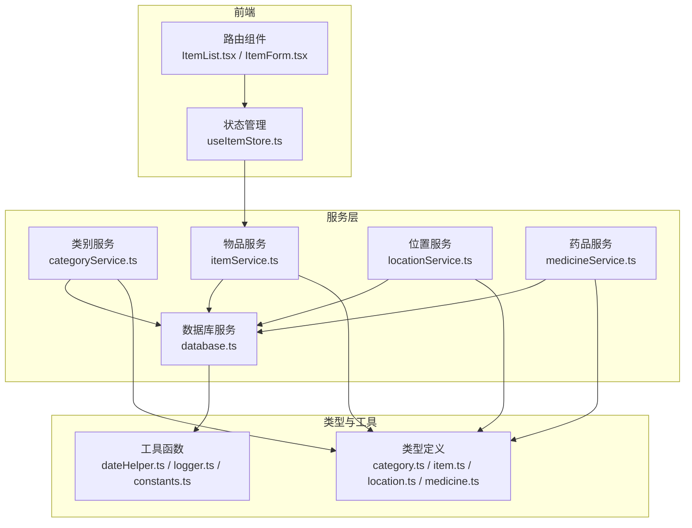
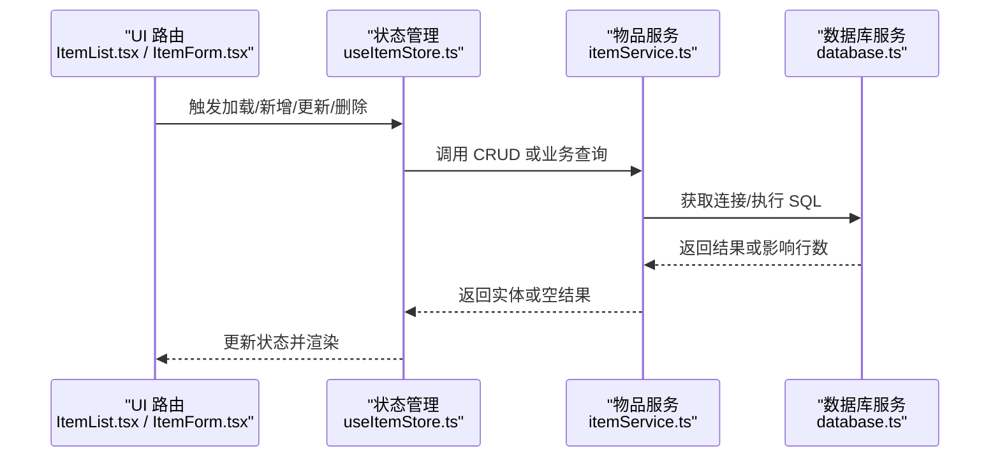
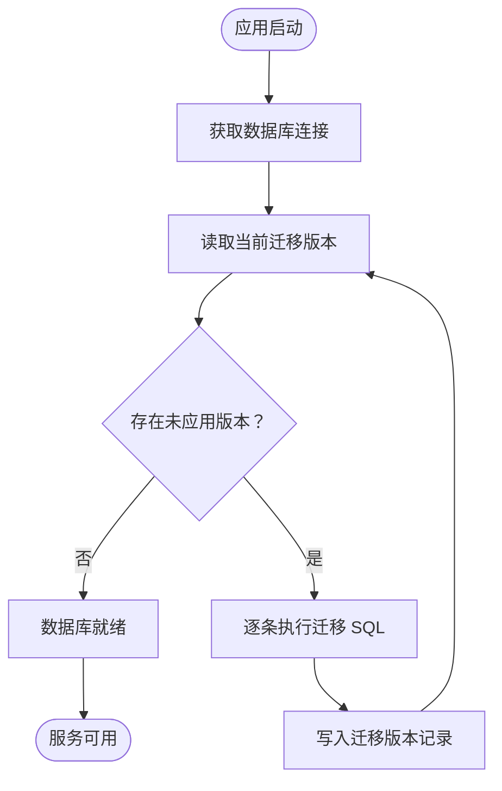
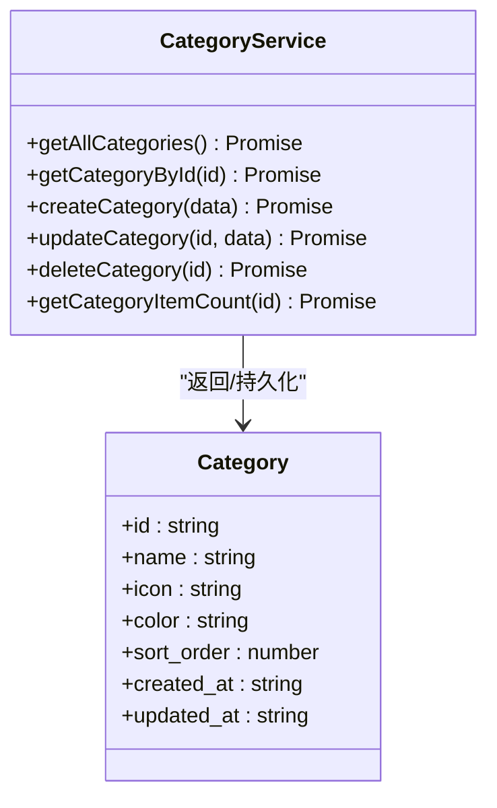
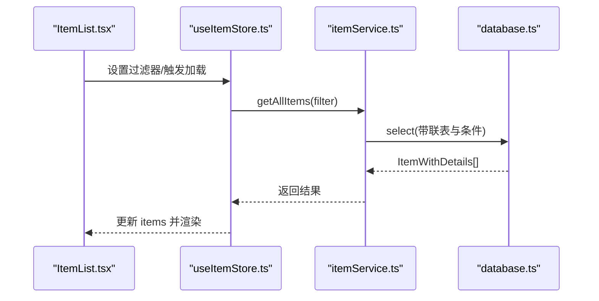
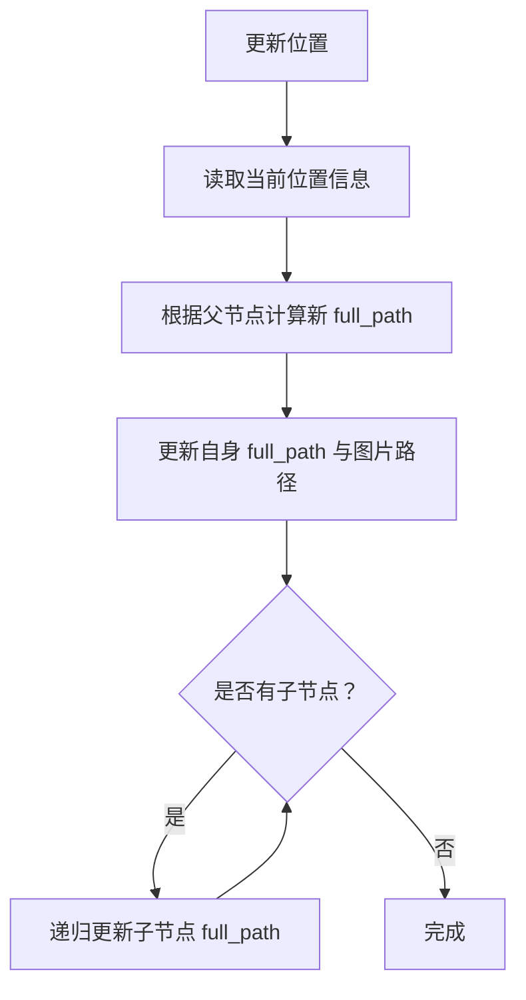
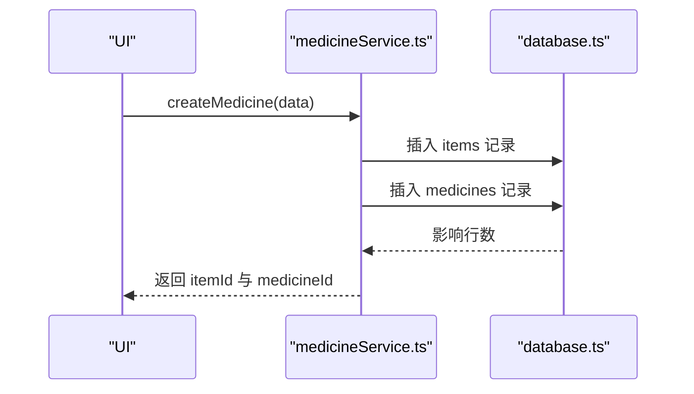
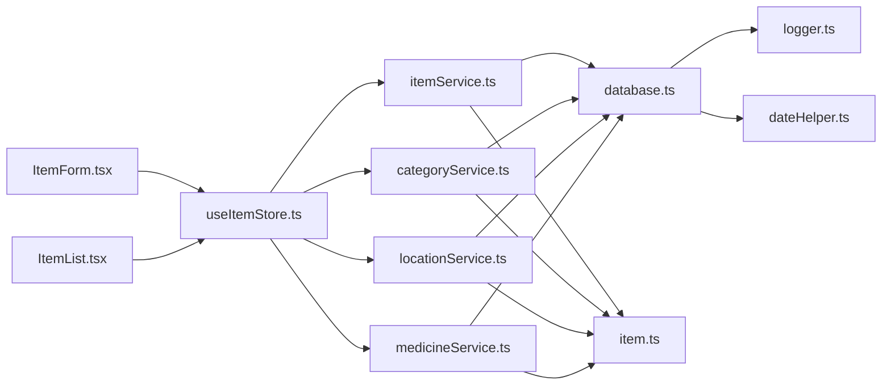

# 数据库操作

<cite>
**本文引用的文件**
- [database.ts](file://src/services/database.ts)
- [categoryService.ts](file://src/services/categoryService.ts)
- [itemService.ts](file://src/services/itemService.ts)
- [locationService.ts](file://src/services/locationService.ts)
- [medicineService.ts](file://src/services/medicineService.ts)
- [category.ts](file://src/types/category.ts)
- [item.ts](file://src/types/item.ts)
- [location.ts](file://src/types/location.ts)
- [medicine.ts](file://src/types/medicine.ts)
- [constants.ts](file://src/utils/constants.ts)
- [logger.ts](file://src/utils/logger.ts)
- [dateHelper.ts](file://src/utils/dateHelper.ts)
- [ItemList.tsx](file://src/routes/ItemList.tsx)
- [ItemForm.tsx](file://src/routes/ItemForm.tsx)
- [useItemStore.ts](file://src/stores/useItemStore.ts)
</cite>

## 目录
1. [简介](#简介)
2. [项目结构](#项目结构)
3. [核心组件](#核心组件)
4. [架构总览](#架构总览)
5. [详细组件分析](#详细组件分析)
6. [依赖关系分析](#依赖关系分析)
7. [性能考量](#性能考量)
8. [故障排查指南](#故障排查指南)
9. [结论](#结论)
10. [附录](#附录)

## 简介
本文件面向 Assetly 的数据库操作，系统性梳理了基于 SQLite 的 CRUD 实现模式与最佳实践，涵盖查询、插入、更新、删除；数据库连接管理、迁移与索引；事务与并发控制策略；复杂查询（联表、聚合、条件筛选）；数据访问层设计模式与错误处理；性能优化、查询缓存与批量操作建议；以及调试工具与常见问题解决方案。内容以实际源码为依据，配合可视化图示帮助不同技术背景的读者理解与落地。

## 项目结构
Assetly 的数据库层采用“服务层 + 类型定义 + 工具函数”的分层组织：
- 数据库连接与迁移：位于数据库服务模块，负责单例连接、迁移执行与索引初始化。
- 数据访问服务：按领域拆分（类别、物品、位置、药品），每个服务封装对应实体的 CRUD 与业务查询。
- 类型定义：统一定义实体接口，确保服务层与 UI 层的数据契约一致。
- 工具与日志：日期格式化、日志转发与内存日志缓冲，支撑可观测性与调试。
- 前端集成：路由与状态管理通过服务层调用数据库，形成清晰的 UI-服务-数据链路。

图表来源
- [database.ts:1-171](file://src/services/database.ts#L1-L171)
- [categoryService.ts:1-59](file://src/services/categoryService.ts#L1-L59)
- [itemService.ts:1-127](file://src/services/itemService.ts#L1-L127)
- [locationService.ts:1-143](file://src/services/locationService.ts#L1-L143)
- [medicineService.ts:1-194](file://src/services/medicineService.ts#L1-L194)
- [category.ts:1-18](file://src/types/category.ts#L1-L18)
- [item.ts:1-46](file://src/types/item.ts#L1-L46)
- [location.ts:1-24](file://src/types/location.ts#L1-L24)
- [medicine.ts:1-70](file://src/types/medicine.ts#L1-L70)
- [dateHelper.ts:1-52](file://src/utils/dateHelper.ts#L1-L52)
- [logger.ts:1-84](file://src/utils/logger.ts#L1-L84)
- [constants.ts:1-40](file://src/utils/constants.ts#L1-L40)
- [ItemList.tsx:1-185](file://src/routes/ItemList.tsx#L1-L185)
- [ItemForm.tsx:1-263](file://src/routes/ItemForm.tsx#L1-L263)
- [useItemStore.ts:1-53](file://src/stores/useItemStore.ts#L1-L53)

章节来源
- [database.ts:1-171](file://src/services/database.ts#L1-L171)
- [categoryService.ts:1-59](file://src/services/categoryService.ts#L1-L59)
- [itemService.ts:1-127](file://src/services/itemService.ts#L1-L127)
- [locationService.ts:1-143](file://src/services/locationService.ts#L1-L143)
- [medicineService.ts:1-194](file://src/services/medicineService.ts#L1-L194)
- [category.ts:1-18](file://src/types/category.ts#L1-L18)
- [item.ts:1-46](file://src/types/item.ts#L1-L46)
- [location.ts:1-24](file://src/types/location.ts#L1-L24)
- [medicine.ts:1-70](file://src/types/medicine.ts#L1-L70)
- [constants.ts:1-40](file://src/utils/constants.ts#L1-L40)
- [dateHelper.ts:1-52](file://src/utils/dateHelper.ts#L1-L52)
- [logger.ts:1-84](file://src/utils/logger.ts#L1-L84)
- [ItemList.tsx:1-185](file://src/routes/ItemList.tsx#L1-L185)
- [ItemForm.tsx:1-263](file://src/routes/ItemForm.tsx#L1-L263)
- [useItemStore.ts:1-53](file://src/stores/useItemStore.ts#L1-L53)

## 核心组件
- 数据库服务：提供单例连接、自动迁移、索引初始化与 SQL 执行能力，确保应用启动时数据库结构完备。
- 领域服务：按实体划分的服务层，封装 CRUD 与业务查询，统一使用参数化 SQL，避免注入风险。
- 类型系统：严格的 TypeScript 接口定义，保证前后端数据一致性与可维护性。
- 工具与日志：集中化的日志转发与内存日志缓冲，便于调试与问题定位。
- 前端集成：路由与状态管理通过服务层访问数据库，形成清晰的职责边界。

章节来源
- [database.ts:1-171](file://src/services/database.ts#L1-L171)
- [categoryService.ts:1-59](file://src/services/categoryService.ts#L1-L59)
- [itemService.ts:1-127](file://src/services/itemService.ts#L1-L127)
- [locationService.ts:1-143](file://src/services/locationService.ts#L1-L143)
- [medicineService.ts:1-194](file://src/services/medicineService.ts#L1-L194)
- [category.ts:1-18](file://src/types/category.ts#L1-L18)
- [item.ts:1-46](file://src/types/item.ts#L1-L46)
- [location.ts:1-24](file://src/types/location.ts#L1-L24)
- [medicine.ts:1-70](file://src/types/medicine.ts#L1-L70)
- [logger.ts:1-84](file://src/utils/logger.ts#L1-L84)
- [dateHelper.ts:1-52](file://src/utils/dateHelper.ts#L1-L52)

## 架构总览
下图展示了从 UI 到数据库的调用路径与关键交互点，体现服务层对数据库的统一封装与前端对服务层的依赖。

图表来源
- [ItemList.tsx:1-185](file://src/routes/ItemList.tsx#L1-L185)
- [ItemForm.tsx:1-263](file://src/routes/ItemForm.tsx#L1-L263)
- [useItemStore.ts:1-53](file://src/stores/useItemStore.ts#L1-L53)
- [itemService.ts:1-127](file://src/services/itemService.ts#L1-L127)
- [database.ts:1-171](file://src/services/database.ts#L1-L171)

## 详细组件分析

### 数据库连接与迁移
- 单例连接：首次调用时建立连接并执行迁移，后续复用同一实例，避免重复打开数据库。
- 迁移机制：内置迁移表记录版本，按顺序执行未应用的迁移脚本，并写入版本时间戳。
- 索引初始化：迁移阶段创建常用查询索引，提升过滤与联表查询性能。
- 默认数据：迁移中插入默认分类与设置项，保障新用户开箱即用。

图表来源
- [database.ts:18-53](file://src/services/database.ts#L18-L53)

章节来源
- [database.ts:1-171](file://src/services/database.ts#L1-L171)

### 类别（Category）CRUD
- 查询：支持全量列表与按 ID 查询，排序基于 sort_order。
- 新增：生成唯一 ID，计算最大排序值后插入，保持有序展示。
- 更新：按字段更新，统一更新时间戳。
- 删除：将关联物品的类别置空后删除类别，避免破坏数据完整性。
- 统计：提供类别下物品数量统计，用于 UI 展示与筛选。

图表来源
- [categoryService.ts:1-59](file://src/services/categoryService.ts#L1-L59)
- [category.ts:1-18](file://src/types/category.ts#L1-L18)

章节来源
- [categoryService.ts:1-59](file://src/services/categoryService.ts#L1-L59)
- [category.ts:1-18](file://src/types/category.ts#L1-L18)

### 物品（Item）CRUD 与复杂查询
- 查询：支持多条件过滤（分类、位置、状态、模糊搜索），联表获取分类名称与位置全路径，按创建时间倒序。
- 新增：生成唯一 ID，插入完整字段集，含扩展字段（如图标、保质期等）。
- 更新：动态拼接字段与参数，仅更新传入的字段，统一更新时间戳。
- 删除：删除物品，药品通过外键级联删除，保证数据一致性。
- 业务查询：与 UI 集成，通过状态管理触发查询与刷新。

图表来源
- [ItemList.tsx:1-185](file://src/routes/ItemList.tsx#L1-L185)
- [useItemStore.ts:1-53](file://src/stores/useItemStore.ts#L1-L53)
- [itemService.ts:10-44](file://src/services/itemService.ts#L10-L44)
- [database.ts:1-171](file://src/services/database.ts#L1-L171)

章节来源
- [itemService.ts:1-127](file://src/services/itemService.ts#L1-L127)
- [item.ts:1-46](file://src/types/item.ts#L1-L46)
- [ItemList.tsx:1-185](file://src/routes/ItemList.tsx#L1-L185)
- [useItemStore.ts:1-53](file://src/stores/useItemStore.ts#L1-L53)

### 位置（Location）CRUD 与树形结构
- 查询：按层级与排序输出，支持构建树形结构。
- 新增：根据父节点计算 full_path 与 level，生成排序号，插入新节点。
- 更新：重命名时递归更新所有子节点的 full_path，保持路径一致性。
- 删除：递归删除后代节点，同时将受影响物品的位置清空，保证引用安全。
- 树构建：将扁平列表转换为树形结构，供 UI 展示层级关系。

图表来源
- [locationService.ts:55-92](file://src/services/locationService.ts#L55-L92)

章节来源
- [locationService.ts:1-143](file://src/services/locationService.ts#L1-L143)
- [location.ts:1-24](file://src/types/location.ts#L1-L24)

### 药品（Medicine）CRUD 与扩展模型
- 查询：支持按类型与名称模糊搜索，联表获取物品详情与位置路径，按到期日排序。
- 创建：先创建物品记录，再创建药品扩展记录，统一时间戳与布尔值转换（SQLite 存储整数）。
- 更新：分别更新物品与药品字段，动态拼接 SQL，注意布尔到整数的转换。
- 业务查询：提供临近到期与正在服用两类常用查询，便于提醒与统计。

图表来源
- [medicineService.ts:54-95](file://src/services/medicineService.ts#L54-L95)

章节来源
- [medicineService.ts:1-194](file://src/services/medicineService.ts#L1-L194)
- [medicine.ts:1-70](file://src/types/medicine.ts#L1-L70)

### 数据访问层设计模式与错误处理
- 设计模式
  - 服务层封装：每个实体一个服务，职责单一，便于测试与演进。
  - 参数化 SQL：所有写操作使用占位符绑定，避免注入与字符串拼接。
  - 动态更新：按需拼接字段，减少不必要的写入。
  - 迁移驱动：通过迁移脚本管理结构演进，保证部署一致性。
- 错误处理
  - 迁移阶段捕获 SQL 执行异常并记录详细信息，阻止应用继续运行。
  - 日志系统统一转发 console 输出，提供内存日志缓冲，便于调试。

章节来源
- [database.ts:18-53](file://src/services/database.ts#L18-L53)
- [logger.ts:1-84](file://src/utils/logger.ts#L1-L84)

## 依赖关系分析
- 低耦合高内聚：服务层仅依赖数据库服务与工具函数，UI 通过状态管理间接依赖服务层。
- 可观测性：日志工具统一输出，迁移与关键操作均有日志记录。
- 类型约束：严格类型定义贯穿服务层与 UI，降低契约不一致带来的问题。

图表来源
- [ItemForm.tsx:1-263](file://src/routes/ItemForm.tsx#L1-L263)
- [ItemList.tsx:1-185](file://src/routes/ItemList.tsx#L1-L185)
- [useItemStore.ts:1-53](file://src/stores/useItemStore.ts#L1-L53)
- [itemService.ts:1-127](file://src/services/itemService.ts#L1-L127)
- [categoryService.ts:1-59](file://src/services/categoryService.ts#L1-L59)
- [locationService.ts:1-143](file://src/services/locationService.ts#L1-L143)
- [medicineService.ts:1-194](file://src/services/medicineService.ts#L1-L194)
- [database.ts:1-171](file://src/services/database.ts#L1-L171)
- [logger.ts:1-84](file://src/utils/logger.ts#L1-L84)
- [dateHelper.ts:1-52](file://src/utils/dateHelper.ts#L1-L52)
- [item.ts:1-46](file://src/types/item.ts#L1-L46)
- [category.ts:1-18](file://src/types/category.ts#L1-L18)
- [location.ts:1-24](file://src/types/location.ts#L1-L24)
- [medicine.ts:1-70](file://src/types/medicine.ts#L1-L70)

章节来源
- [ItemForm.tsx:1-263](file://src/routes/ItemForm.tsx#L1-L263)
- [ItemList.tsx:1-185](file://src/routes/ItemList.tsx#L1-L185)
- [useItemStore.ts:1-53](file://src/stores/useItemStore.ts#L1-L53)
- [itemService.ts:1-127](file://src/services/itemService.ts#L1-L127)
- [categoryService.ts:1-59](file://src/services/categoryService.ts#L1-L59)
- [locationService.ts:1-143](file://src/services/locationService.ts#L1-L143)
- [medicineService.ts:1-194](file://src/services/medicineService.ts#L1-L194)
- [database.ts:1-171](file://src/services/database.ts#L1-L171)
- [logger.ts:1-84](file://src/utils/logger.ts#L1-L84)
- [dateHelper.ts:1-52](file://src/utils/dateHelper.ts#L1-L52)
- [item.ts:1-46](file://src/types/item.ts#L1-L46)
- [category.ts:1-18](file://src/types/category.ts#L1-L18)
- [location.ts:1-24](file://src/types/location.ts#L1-L24)
- [medicine.ts:1-70](file://src/types/medicine.ts#L1-L70)

## 性能考量
- 索引策略
  - 在常用过滤字段（如分类、位置、状态、到期日）上建立索引，显著提升 WHERE 与 JOIN 性能。
  - 位置路径与层级字段用于树形查询，建议结合复合索引优化。
- 查询优化
  - 使用参数化查询与 LIMIT/ORDER 控制结果规模，避免一次性加载全量数据。
  - 对于高频统计（如物品数量、状态分布），可在应用侧做内存缓存，定期刷新。
- 写入优化
  - 批量插入/更新时尽量合并为单次事务（若业务允许），减少往返开销。
  - 动态更新仅写入变更字段，减少锁竞争与日志量。
- 缓存策略
  - 前端状态缓存：利用状态管理缓存最近查询结果，减少重复请求。
  - 应用内缓存：对只读配置与默认数据进行进程内缓存，避免重复查询。
- 并发控制
  - SQLite 默认 WAL 模式适合读多写少场景；写操作建议串行化或短事务，避免长事务阻塞。
  - 对于高并发写入，可考虑引入队列或批处理，降低热点冲突。

## 故障排查指南
- 迁移失败
  - 现象：应用启动时报错，SQL 执行失败。
  - 排查：检查迁移脚本与目标版本，确认数据库权限与文件路径正确；查看日志中 SQL 片段与错误信息。
  - 处理：修复脚本后重新运行，必要时回滚到上一版本再升级。
- 查询异常
  - 现象：联表查询返回空或字段缺失。
  - 排查：确认联结字段与索引是否存在；检查参数绑定顺序与占位符是否匹配。
  - 处理：补充缺失索引，修正参数顺序，增加日志输出 SQL 与参数。
- 写入失败
  - 现象：插入/更新无效果或报唯一约束冲突。
  - 排查：检查主键生成逻辑与唯一字段；确认外键引用是否有效。
  - 处理：确保 ID 唯一性，校验外键存在性，必要时启用外键约束检查。
- 日志与调试
  - 使用日志工具统一输出，开启详细日志级别定位问题；利用内存日志缓冲快速回溯。
  - 在关键路径（连接、迁移、CRUD）增加日志埋点，记录耗时与参数。

章节来源
- [database.ts:18-53](file://src/services/database.ts#L18-L53)
- [logger.ts:1-84](file://src/utils/logger.ts#L1-L84)

## 结论
Assetly 的数据库层以服务化封装为核心，结合迁移驱动与严格类型约束，提供了清晰、可维护且具备良好性能基础的数据访问方案。通过参数化 SQL、索引与缓存策略，以及完善的日志与错误处理，能够满足日常 CRUD 与复杂查询需求。建议在生产环境中进一步完善事务边界、批处理与并发控制策略，并持续监控查询性能与日志指标，以保障系统的稳定性与可扩展性。

## 附录
- 常用查询示例（路径）
  - 全量物品列表（带联表与排序）：[itemService.ts:10-44](file://src/services/itemService.ts#L10-L44)
  - 按 ID 查询物品详情：[itemService.ts:46-58](file://src/services/itemService.ts#L46-L58)
  - 按类型与名称模糊搜索药品：[medicineService.ts:10-37](file://src/services/medicineService.ts#L10-L37)
  - 临近到期药品查询：[medicineService.ts:164-178](file://src/services/medicineService.ts#L164-L178)
  - 正在服用药品查询：[medicineService.ts:180-193](file://src/services/medicineService.ts#L180-L193)
  - 位置树构建：[locationService.ts:124-142](file://src/services/locationService.ts#L124-L142)
- 默认数据与标签
  - 默认分类：[constants.ts:4-13](file://src/utils/constants.ts#L4-L13)
  - 分类/状态标签映射：[constants.ts:16-27](file://src/utils/constants.ts#L16-L27)
- 时间与日志工具
  - 当前时间与日期格式化：[dateHelper.ts:14-20](file://src/utils/dateHelper.ts#L14-L20)
  - 日志转发与内存缓冲：[logger.ts:7-25](file://src/utils/logger.ts#L7-L25)