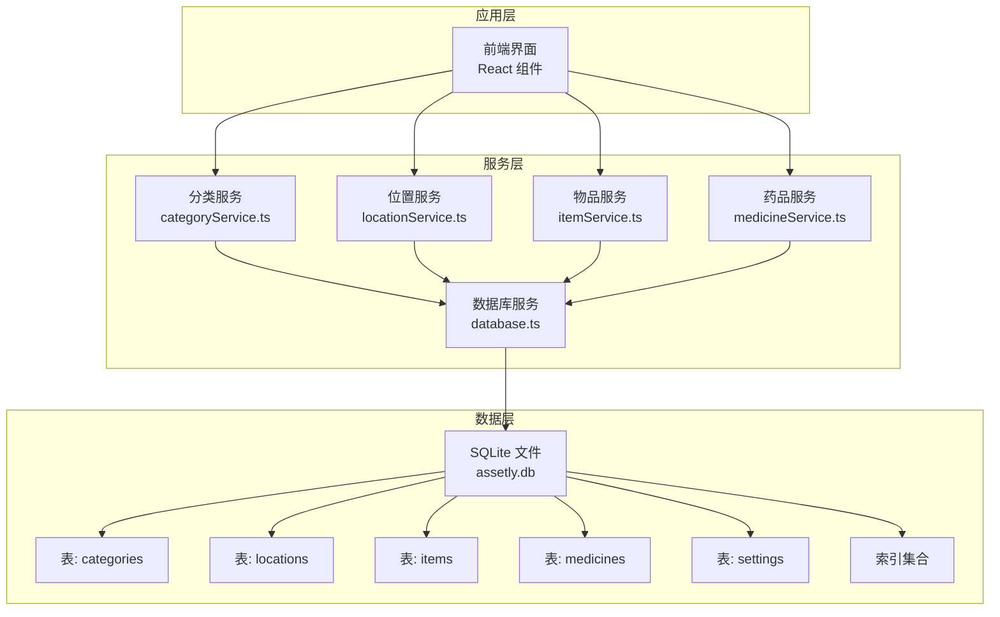
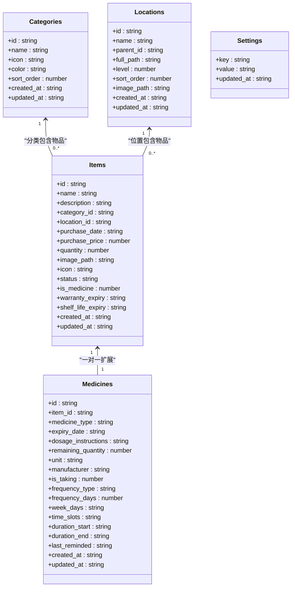
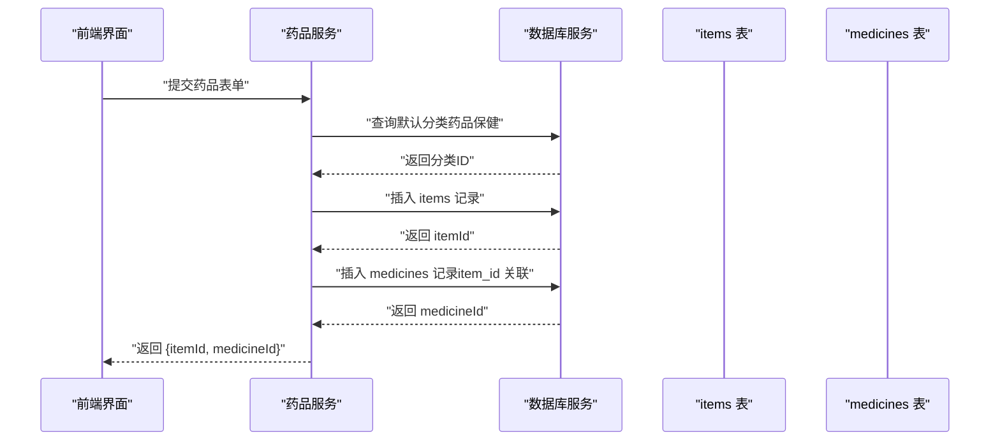
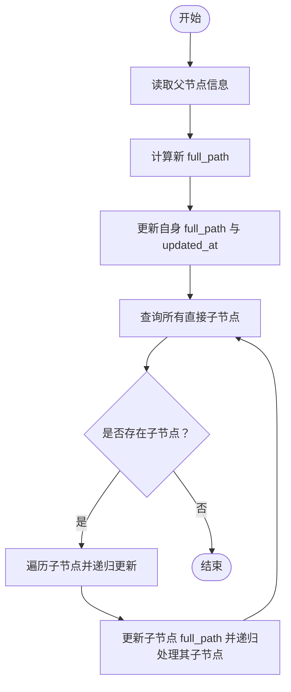
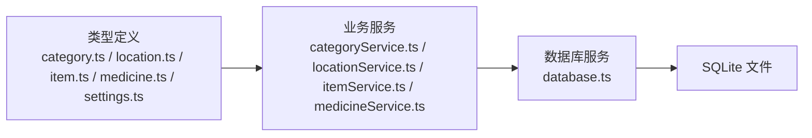

# 数据库表结构

<cite>
**本文档引用的文件**
- [src/services/database.ts](file://src/services/database.ts)
- [src/types/category.ts](file://src/types/category.ts)
- [src/types/location.ts](file://src/types/location.ts)
- [src/types/item.ts](file://src/types/item.ts)
- [src/types/medicine.ts](file://src/types/medicine.ts)
- [src/types/settings.ts](file://src/types/settings.ts)
- [src/services/categoryService.ts](file://src/services/categoryService.ts)
- [src/services/locationService.ts](file://src/services/locationService.ts)
- [src/services/itemService.ts](file://src/services/itemService.ts)
- [src/services/medicineService.ts](file://src/services/medicineService.ts)
- [src/utils/constants.ts](file://src/utils/constants.ts)
</cite>

## 目录
1. [简介](#简介)
2. [项目结构](#项目结构)
3. [核心组件](#核心组件)
4. [架构总览](#架构总览)
5. [详细组件分析](#详细组件分析)
6. [依赖分析](#依赖分析)
7. [性能考虑](#性能考虑)
8. [故障排查指南](#故障排查指南)
9. [结论](#结论)

## 简介
本文件系统性梳理 Assetly 应用的数据库表结构与关系，聚焦以下核心表：
- 分类表 categories
- 位置表 locations（支持自引用树形结构）
- 物品表 items（通用资产与药品共用）
- 药品表 medicines（与 items 的一对一扩展）
- 设置表 settings

文档内容涵盖字段定义、数据类型、约束规则、索引策略、外键关系、级联行为、默认值、业务规则与性能优化建议，并通过图示展示表间关系与典型查询流程。

## 项目结构
数据库初始化与迁移逻辑集中在后端服务层，采用 Tauri 插件加载本地 SQLite 文件；各业务模块通过服务层封装对数据库的访问与更新。



图表来源
- [src/services/database.ts:18-53](file://src/services/database.ts#L18-L53)
- [src/services/categoryService.ts:1-59](file://src/services/categoryService.ts#L1-L59)
- [src/services/locationService.ts:1-143](file://src/services/locationService.ts#L1-L143)
- [src/services/itemService.ts:1-127](file://src/services/itemService.ts#L1-L127)
- [src/services/medicineService.ts:1-194](file://src/services/medicineService.ts#L1-L194)

章节来源
- [src/services/database.ts:18-53](file://src/services/database.ts#L18-L53)

## 核心组件
本节从“表结构 + 字段说明 + 约束 + 关系 + 索引 + 默认值 + 业务规则”的维度，逐表解析。

### 分类表 categories
- 表作用：为物品提供分类标签，支持图标与颜色标识，用于界面展示与筛选。
- 主键：id（文本）
- 字段与约束
  - id: 文本主键，唯一标识
  - name: 非空文本，分类名称
  - icon: 文本，默认空字符串
  - color: 文本，默认十六进制颜色值
  - sort_order: 整数，默认 0，用于排序
  - created_at: 非空文本（时间戳字符串）
  - updated_at: 非空文本（时间戳字符串）
- 默认值与业务规则
  - 新建时由服务层计算最大排序值并+1，确保新增项排在末尾
  - 删除分类时，会将 items 中对应分类的字段置空，避免孤立引用
- 约束与索引
  - 主键约束：id 唯一且非空
  - 无显式唯一索引，但按业务需要可对 name 建唯一索引以保证名称唯一性（建议）

章节来源
- [src/services/database.ts:67-75](file://src/services/database.ts#L67-L75)
- [src/services/database.ts:133-136](file://src/services/database.ts#L133-L136)
- [src/services/categoryService.ts:20-49](file://src/services/categoryService.ts#L20-L49)
- [src/types/category.ts:3-11](file://src/types/category.ts#L3-L11)

### 位置表 locations（自引用树）
- 表作用：构建层级化的位置树（如房间、楼层、仓库），支持路径全名与层级深度。
- 主键：id（文本）
- 字段与约束
  - id: 文本主键
  - name: 非空文本
  - parent_id: 文本，自引用外键，指向 locations.id；删除时设为 NULL（SET NULL）
  - full_path: 非空文本，默认空字符串，存储从根到当前节点的完整路径
  - level: 非空整数，默认 0，表示层级深度
  - sort_order: 整数，默认 0，同级排序
  - image_path: 文本，默认空字符串
  - created_at: 非空文本
  - updated_at: 非空文本
- 外键与级联
  - 外键：parent_id 引用 locations(id)
  - 级联：删除父节点时，子节点 parent_id 设为 NULL，保持数据完整性
- 约束与索引
  - 主键：id
  - 索引：parent_id（便于查找子节点与构建树）
- 业务规则
  - 新增/更新时自动维护 full_path 与 level
  - 更新父节点时递归更新所有后代节点的 full_path
  - 删除节点时递归删除其所有后代，并将后代物品位置清空

章节来源
- [src/services/database.ts:77-87](file://src/services/database.ts#L77-L87)
- [src/services/database.ts:129-131](file://src/services/database.ts#L129-L131)
- [src/services/locationService.ts:20-92](file://src/services/locationService.ts#L20-L92)
- [src/services/locationService.ts:94-122](file://src/services/locationService.ts#L94-L122)
- [src/types/location.ts:3-13](file://src/types/location.ts#L3-L13)

### 物品表 items（通用资产）
- 表作用：记录通用资产或药品的基础信息；is_medicine 标记是否为药品。
- 主键：id（文本）
- 字段与约束
  - id: 文本主键
  - name: 非空文本
  - description: 文本，默认空字符串
  - category_id: 文本，默认空字符串（关联 categories.id）
  - location_id: 文本，默认空字符串（关联 locations.id）
  - purchase_date: 文本，默认空字符串（日期字符串）
  - purchase_price: 实数，默认 0
  - quantity: 整数，默认 1
  - image_path: 文本，默认空字符串
  - icon: 文本，默认空字符串（新增字段）
  - status: 文本，默认 "active"
  - is_medicine: 整数，默认 0（0/1）
  - warranty_expiry: 文本，默认空字符串（保修到期）
  - shelf_life_expiry: 文本，默认空字符串（保质期到期）
  - created_at: 非空文本
  - updated_at: 非空文本
- 外键与级联
  - category_id 引用 categories(id)，删除分类时不会影响物品，仅将分类字段置空
  - location_id 引用 locations(id)，删除位置时不会影响物品，仅将位置字段置空
- 索引
  - category_id、location_id、status 上建立索引，提升过滤与统计效率
- 业务规则
  - status 支持 active/archived/disposed
  - is_medicine=1 时，应存在对应的 medicines 记录（一对一扩展）

章节来源
- [src/services/database.ts:89-103](file://src/services/database.ts#L89-L103)
- [src/services/database.ts:125-127](file://src/services/database.ts#L125-L127)
- [src/services/itemService.ts:10-44](file://src/services/itemService.ts#L10-L44)
- [src/types/item.ts:5-22](file://src/types/item.ts#L5-L22)

### 药品表 medicines（与 items 的一对一扩展）
- 表作用：扩展物品表，记录药品特有的属性与用药提醒配置。
- 主键：id（文本）
- 字段与约束
  - id: 文本主键
  - item_id: 非空文本，唯一，关联 items.id
  - medicine_type: 非空文本，默认 "internal"，枚举值 internal/external/emergency
  - expiry_date: 非空文本（日期字符串）
  - dosage_instructions: 文本，默认空字符串
  - remaining_quantity: 整数，默认 0
  - unit: 文本，默认 "片"
  - manufacturer: 文本，默认空字符串
  - is_taking: 整数，默认 0（0/1）
  - frequency_type: 文本，默认 "daily"，枚举 daily/every_n_days/weekly
  - frequency_days: 整数，默认 1
  - week_days: 文本，默认空字符串（逗号分隔的周几，如 "1,3,5"）
  - time_slots: 文本，默认空字符串（逗号分隔的时间点，如 "08:00,20:00"）
  - duration_start: 文本，默认空字符串（开始日期）
  - duration_end: 文本，默认空字符串（结束日期）
  - last_reminded: 文本，默认空字符串（最近提醒时间）
  - created_at: 非空文本
  - updated_at: 非空文本
- 外键与级联
  - item_id 引用 items(id)，删除物品时级联删除药品记录（CASCADE）
- 索引
  - item_id（唯一索引，保证一对一）、expiry_date、medicine_type
- 业务规则
  - is_taking=1 时启用用药提醒；frequency_*、week_days、time_slots、duration_* 共同决定提醒计划
  - 与物品表通过 item_id 关联，查询时可直接 JOIN 获取完整信息

章节来源
- [src/services/database.ts:105-117](file://src/services/database.ts#L105-L117)
- [src/services/database.ts:129-131](file://src/services/database.ts#L129-L131)
- [src/services/medicineService.ts:54-95](file://src/services/medicineService.ts#L54-L95)
- [src/types/medicine.ts:7-27](file://src/types/medicine.ts#L7-L27)

### 设置表 settings
- 表作用：存储应用运行时的键值型配置。
- 主键：key（文本）
- 字段与约束
  - key: 文本主键，唯一标识配置项
  - value: 非空文本，配置值
  - updated_at: 非空文本（时间戳字符串）
- 默认值与业务规则
  - 初始化时插入主题色与货币符号等默认键值
  - 更新时刷新 updated_at

章节来源
- [src/services/database.ts:119-123](file://src/services/database.ts#L119-L123)
- [src/services/database.ts:138-139](file://src/services/database.ts#L138-L139)
- [src/types/settings.ts:3-6](file://src/types/settings.ts#L3-L6)

## 架构总览
下图展示五张核心表之间的关系、外键约束与典型查询路径。

```mermaid
erDiagram
CATEGORIES {
text id PK
text name
text icon
text color
int sort_order
text created_at
text updated_at
}
LOCATIONS {
text id PK
text name
text parent_id FK
text full_path
int level
int sort_order
text image_path
text created_at
text updated_at
}
ITEMS {
text id PK
text name
text description
text category_id FK
text location_id FK
text purchase_date
real purchase_price
int quantity
text image_path
text icon
text status
int is_medicine
text warranty_expiry
text shelf_life_expiry
text created_at
text updated_at
}
MEDICINES {
text id PK
text item_id UK FK
text medicine_type
text expiry_date
text dosage_instructions
int remaining_quantity
text unit
text manufacturer
int is_taking
text frequency_type
int frequency_days
text week_days
text time_slots
text duration_start
text duration_end
text last_reminded
text created_at
text updated_at
}
SETTINGS {
text key PK
text value
text updated_at
}
CATEGORIES ||--o{ ITEMS : "分类包含物品"
LOCATIONS ||--o{ ITEMS : "位置包含物品"
ITEMS ||--|| MEDICINES : "一对一扩展"
```

图表来源
- [src/services/database.ts:67-123](file://src/services/database.ts#L67-L123)

## 详细组件分析

### 表关系与外键约束
- categories.id → items.category_id（SET NULL 删除行为：分类删除不影响物品，仅清空分类字段）
- locations.id → items.location_id（SET NULL 删除行为：位置删除不影响物品，仅清空位置字段）
- items.id → medicines.item_id（CASCADE 删除行为：物品删除时级联删除药品记录）



图表来源
- [src/services/database.ts:67-123](file://src/services/database.ts#L67-L123)
- [src/types/category.ts:3-11](file://src/types/category.ts#L3-L11)
- [src/types/location.ts:3-13](file://src/types/location.ts#L3-L13)
- [src/types/item.ts:5-22](file://src/types/item.ts#L5-L22)
- [src/types/medicine.ts:7-27](file://src/types/medicine.ts#L7-L27)
- [src/types/settings.ts:3-6](file://src/types/settings.ts#L3-L6)

### 索引策略与性能优化
- 已有索引
  - items(category_id)、items(location_id)、items(status)：加速按分类、位置、状态过滤
  - medicines(item_id)、medicines(expiry_date)、medicines(medicine_type)：加速药品查询与过期提醒
  - locations(parent_id)：加速树形遍历与父子查找
- 建议补充索引
  - categories(name)：若需按名称精确/模糊匹配，可考虑唯一或普通索引
  - items(name)：若频繁按名称搜索，建议建立索引
  - medicines(last_reminded)：若实现定时提醒扫描，可考虑索引
- 查询优化要点
  - 使用参数化查询防止注入
  - 对高频过滤字段（status、medicine_type、expiry_date）配合索引
  - 树形查询（位置）尽量一次性获取全量后在内存构建树结构，减少多次往返

章节来源
- [src/services/database.ts:125-131](file://src/services/database.ts#L125-L131)
- [src/services/itemService.ts:10-44](file://src/services/itemService.ts#L10-L44)
- [src/services/medicineService.ts:10-37](file://src/services/medicineService.ts#L10-L37)

### 典型流程：创建药品（物品+药品扩展）
该流程体现“先创建物品，再创建药品扩展”的双表写入与关联。



图表来源
- [src/services/medicineService.ts:54-95](file://src/services/medicineService.ts#L54-L95)
- [src/services/database.ts:67-123](file://src/services/database.ts#L67-L123)

### 典型流程：位置树更新（父节点变更）
该流程体现“更新父节点时递归更新子节点 full_path”的树形结构维护。



图表来源
- [src/services/locationService.ts:55-92](file://src/services/locationService.ts#L55-L92)

## 依赖分析
- 服务层依赖数据库服务进行迁移与执行 SQL
- 各业务服务依赖类型定义进行参数校验与返回结构
- 默认数据（分类、设置）在迁移阶段初始化



图表来源
- [src/services/database.ts:18-53](file://src/services/database.ts#L18-L53)
- [src/services/categoryService.ts:1-59](file://src/services/categoryService.ts#L1-L59)
- [src/services/locationService.ts:1-143](file://src/services/locationService.ts#L1-L143)
- [src/services/itemService.ts:1-127](file://src/services/itemService.ts#L1-L127)
- [src/services/medicineService.ts:1-194](file://src/services/medicineService.ts#L1-L194)
- [src/types/category.ts:1-18](file://src/types/category.ts#L1-L18)
- [src/types/location.ts:1-24](file://src/types/location.ts#L1-L24)
- [src/types/item.ts:1-46](file://src/types/item.ts#L1-L46)
- [src/types/medicine.ts:1-70](file://src/types/medicine.ts#L1-L70)
- [src/types/settings.ts:1-25](file://src/types/settings.ts#L1-L25)

章节来源
- [src/utils/constants.ts:4-13](file://src/utils/constants.ts#L4-L13)
- [src/services/database.ts:133-139](file://src/services/database.ts#L133-L139)

## 性能考虑
- 索引覆盖高频查询字段：status、category_id、location_id、medicine_type、expiry_date
- 避免在大结果集上进行复杂字符串匹配；必要时使用前缀索引或全文检索（视 SQLite 版本而定）
- 树形结构查询建议一次性拉取全量后在应用层构建树，减少 N+1 查询
- 定期检查与重建索引（SQLite 在大量写入后可能需要 REINDEX）
- 对于药品过期提醒等周期性任务，建议使用 expiry_date 上的索引进行范围扫描

## 故障排查指南
- 迁移失败
  - 现象：启动时报错，提示迁移 SQL 执行失败
  - 排查：检查 SQL 语法与字段类型是否与迁移定义一致；确认数据库文件权限
  - 参考
    - [src/services/database.ts:38-45](file://src/services/database.ts#L38-L45)
- 外键约束冲突
  - 现象：删除分类/位置时报外键错误
  - 排查：确认删除逻辑是否已将 items 中对应字段置空；检查 locations 的 parent_id 级联行为
  - 参考
    - [src/services/categoryService.ts:46-49](file://src/services/categoryService.ts#L46-L49)
    - [src/services/locationService.ts:96-109](file://src/services/locationService.ts#L96-L109)
- 药品删除异常
  - 现象：删除物品后药品未同步删除
  - 排查：确认 medicines.item_id 的外键级联删除是否生效
  - 参考
    - [src/services/database.ts:116](file://src/services/database.ts#L116)
    - [src/services/itemService.ts:121-126](file://src/services/itemService.ts#L121-L126)
- 树形路径不正确
  - 现象：更新父节点后子节点 full_path 未同步
  - 排查：确认 updateChildrenPaths 是否被调用；检查递归更新逻辑
  - 参考
    - [src/services/locationService.ts:79-92](file://src/services/locationService.ts#L79-L92)

## 结论
本数据库设计围绕“通用资产 + 药品扩展”的模式展开，通过 categories 与 locations 提供灵活的分类与空间组织，items 作为统一载体承载基础信息，medicines 则提供药品特有属性与提醒能力。外键与索引策略兼顾了查询性能与数据一致性，迁移机制保障了版本演进的平滑性。建议后续根据实际业务增长情况补充必要的索引与约束，持续优化查询路径与缓存策略。