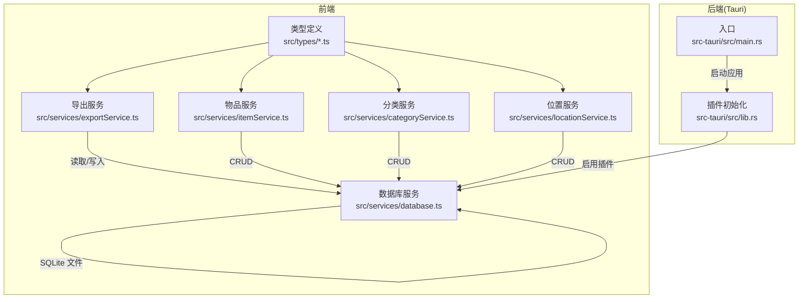
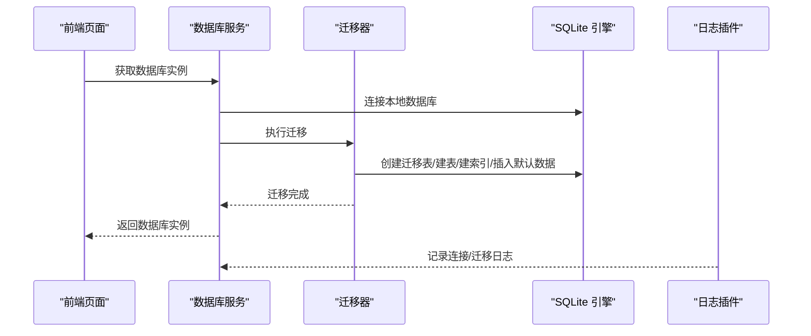
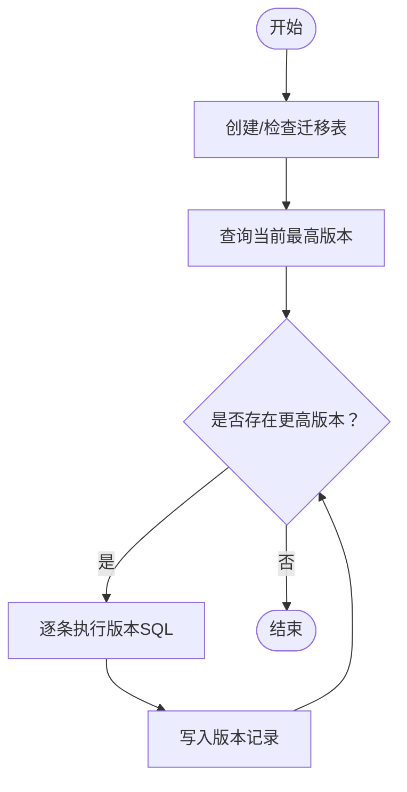
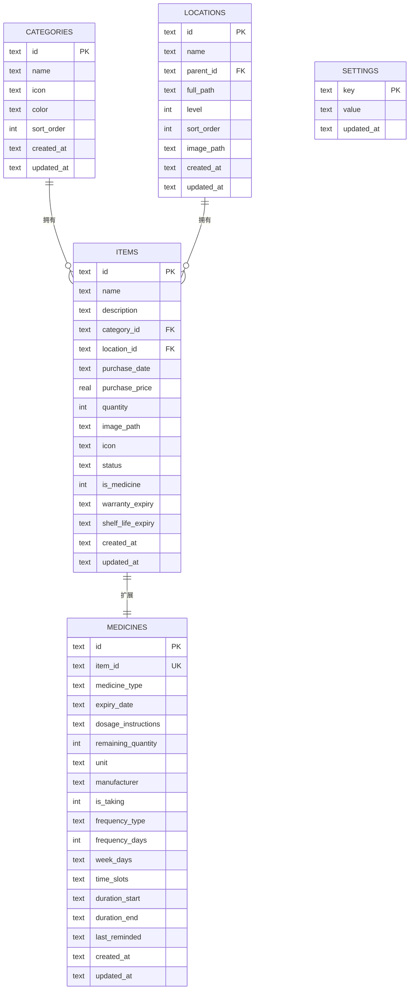
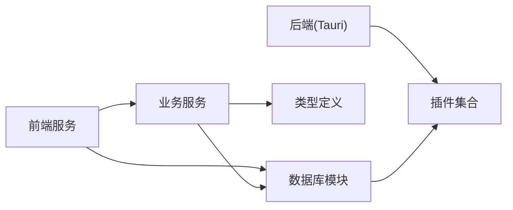

# 数据库设计

<cite>
**本文引用的文件**
- [src/services/database.ts](file://src/services/database.ts)
- [src/services/exportService.ts](file://src/services/exportService.ts)
- [src/services/itemService.ts](file://src/services/itemService.ts)
- [src/services/categoryService.ts](file://src/services/categoryService.ts)
- [src/services/locationService.ts](file://src/services/locationService.ts)
- [src/types/category.ts](file://src/types/category.ts)
- [src/types/item.ts](file://src/types/item.ts)
- [src/types/location.ts](file://src/types/location.ts)
- [src/types/medicine.ts](file://src/types/medicine.ts)
- [src/types/settings.ts](file://src/types/settings.ts)
- [src/utils/constants.ts](file://src/utils/constants.ts)
- [src-tauri/src/lib.rs](file://src-tauri/src/lib.rs)
- [src-tauri/src/main.rs](file://src-tauri/src/main.rs)
</cite>

## 目录
1. [简介](#简介)
2. [项目结构](#项目结构)
3. [核心组件](#核心组件)
4. [架构总览](#架构总览)
5. [详细组件分析](#详细组件分析)
6. [依赖分析](#依赖分析)
7. [性能考虑](#性能考虑)
8. [故障排除指南](#故障排除指南)
9. [结论](#结论)
10. [附录](#附录)

## 简介
本文件系统性梳理 Assetly 基于 SQLite 的本地数据库设计与实现，覆盖表结构、字段与约束、核心实体关系、数据库迁移机制、索引与查询优化、数据完整性保障、备份与导入导出流程、以及调试与故障排除方法。目标是帮助开发者与使用者全面理解并安全地维护本地数据库。

## 项目结构
- 数据库访问层位于前端服务模块，使用 Tauri 插件提供的 SQLite 能力进行连接与迁移。
- 后端（Tauri）通过插件初始化数据库能力，并统一日志输出到应用日志目录。
- 数据模型以 TypeScript 类型定义为核心，确保前后端一致的数据契约。

图表来源
- [src/services/database.ts:1-171](file://src/services/database.ts#L1-L171)
- [src/services/exportService.ts:1-154](file://src/services/exportService.ts#L1-L154)
- [src/services/itemService.ts:1-127](file://src/services/itemService.ts#L1-L127)
- [src/services/categoryService.ts:1-59](file://src/services/categoryService.ts#L1-L59)
- [src/services/locationService.ts:1-143](file://src/services/locationService.ts#L1-L143)
- [src-tauri/src/lib.rs:1-49](file://src-tauri/src/lib.rs#L1-L49)
- [src-tauri/src/main.rs:1-7](file://src-tauri/src/main.rs#L1-L7)

章节来源
- [src/services/database.ts:1-171](file://src/services/database.ts#L1-L171)
- [src-tauri/src/lib.rs:1-49](file://src-tauri/src/lib.rs#L1-L49)
- [src-tauri/src/main.rs:1-7](file://src-tauri/src/main.rs#L1-L7)

## 核心组件
- 数据库连接与迁移
  - 首次获取数据库时建立连接并自动执行迁移；迁移记录保存在内置的迁移表中，按版本顺序依次应用。
  - 迁移包含建表、索引、默认种子数据等。
- 导出/导入服务
  - 支持 JSON/CSV 导出；支持 JSON 导入，逐条插入或替换。
- 实体服务
  - 物品、分类、位置服务分别封装 CRUD 与业务逻辑（如位置路径更新、树形构建等）。

章节来源
- [src/services/database.ts:8-53](file://src/services/database.ts#L8-L53)
- [src/services/exportService.ts:4-44](file://src/services/exportService.ts#L4-L44)
- [src/services/itemService.ts:10-127](file://src/services/itemService.ts#L10-L127)
- [src/services/categoryService.ts:9-59](file://src/services/categoryService.ts#L9-L59)
- [src/services/locationService.ts:9-143](file://src/services/locationService.ts#L9-L143)

## 架构总览
下图展示数据库层与各服务之间的交互关系，以及迁移与日志插件的集成。

图表来源
- [src/services/database.ts:8-53](file://src/services/database.ts#L8-L53)
- [src-tauri/src/lib.rs:8-20](file://src-tauri/src/lib.rs#L8-L20)

## 详细组件分析

### 数据库迁移系统
- 迁移表结构
  - 内置表用于记录已应用的版本号与应用时间，避免重复执行。
- 版本与语句
  - 按版本升序执行，每个版本包含若干 SQL 语句（建表、索引、默认数据等）。
- 默认种子数据
  - 分类与设置表在首次迁移时写入默认值。
- 执行流程
  - 读取当前最大版本，遍历后续版本，逐条执行 SQL 并记录版本。

图表来源
- [src/services/database.ts:18-53](file://src/services/database.ts#L18-L53)

章节来源
- [src/services/database.ts:18-171](file://src/services/database.ts#L18-L171)

### 表结构与字段定义

#### 分类表（categories）
- 主键：id（文本）
- 字段：名称、图标、颜色、排序、创建/更新时间
- 约束：主键唯一；默认颜色与排序

章节来源
- [src/services/database.ts:67-75](file://src/services/database.ts#L67-L75)
- [src/types/category.ts:3-11](file://src/types/category.ts#L3-L11)

#### 位置表（locations，自引用树）
- 主键：id（文本）
- 字段：名称、父节点、全路径、层级、排序、图片路径、创建/更新时间
- 约束：父节点引用自身（级联删除设为空）

章节来源
- [src/services/database.ts:77-87](file://src/services/database.ts#L77-L87)
- [src/types/location.ts:3-13](file://src/types/location.ts#L3-L13)

#### 物品表（items）
- 主键：id（文本）
- 关联：category_id → categories.id，location_id → locations.id
- 字段：名称、描述、购买日期/价格、数量、图片路径、图标、状态、是否药品、保质/保修期、创建/更新时间
- 约束：状态枚举；is_medicine 以整数存储布尔

章节来源
- [src/services/database.ts:89-103](file://src/services/database.ts#L89-L103)
- [src/types/item.ts:5-22](file://src/types/item.ts#L5-L22)

#### 药品表（medicines，与物品一对一扩展）
- 主键：id（文本），item_id 唯一
- 外键：item_id → items.id（级联删除）
- 字段：药品类型、有效期、用量说明、剩余数量、单位、厂商、是否服用、频次类型/天数、周几、时间段、服药周期、最后提醒时间、创建/更新时间

章节来源
- [src/services/database.ts:105-117](file://src/services/database.ts#L105-L117)
- [src/types/medicine.ts:7-27](file://src/types/medicine.ts#L7-L27)

#### 设置表（settings）
- 主键：key（文本）
- 字段：value、更新时间
- 示例键：主题色、货币符号

章节来源
- [src/services/database.ts:119-123](file://src/services/database.ts#L119-L123)
- [src/types/settings.ts:3-6](file://src/types/settings.ts#L3-L6)

#### 迁移版本与默认数据
- 版本1：建表、索引、默认分类与设置
- 版本2：为物品增加图标字段
- 版本3：为药品增加服药提醒相关字段
- 版本4：为物品增加保质/保修期字段，为位置增加图片字段

章节来源
- [src/services/database.ts:60-171](file://src/services/database.ts#L60-L171)
- [src/utils/constants.ts:4-13](file://src/utils/constants.ts#L4-L13)

### 索引与查询优化
- 已创建索引
  - items：category_id、location_id、status
  - medicines：item_id、expiry_date、medicine_type
  - locations：parent_id
- 查询模式
  - 物品列表：多条件过滤（分类/位置/状态/搜索）+ 排序
  - 位置更新：递归更新子节点全路径
- 性能建议
  - 对高频过滤字段保持索引
  - 大批量导入时可考虑事务包裹（当前导入为逐条执行，可评估批量插入）

章节来源
- [src/services/database.ts:124-131](file://src/services/database.ts#L124-L131)
- [src/services/itemService.ts:10-44](file://src/services/itemService.ts#L10-L44)
- [src/services/locationService.ts:79-92](file://src/services/locationService.ts#L79-L92)

### 数据完整性保障
- 外键约束
  - 位置表：parent_id 自引用（删除设空）
  - 药品表：item_id 外键（删除级联）
- 唯一约束
  - 药品表：item_id 唯一
- 默认值与枚举
  - 分类默认颜色/排序；物品状态枚举字符串；药品类型枚举字符串
- 级联行为
  - 删除物品会级联删除对应药品

章节来源
- [src/services/database.ts:86-117](file://src/services/database.ts#L86-L117)
- [src/services/categoryService.ts:46-48](file://src/services/categoryService.ts#L46-L48)
- [src/services/locationService.ts:94-109](file://src/services/locationService.ts#L94-L109)

### 实体关系图

图表来源
- [src/services/database.ts:67-123](file://src/services/database.ts#L67-L123)
- [src/types/category.ts:3-11](file://src/types/category.ts#L3-L11)
- [src/types/location.ts:3-13](file://src/types/location.ts#L3-L13)
- [src/types/item.ts:5-22](file://src/types/item.ts#L5-L22)
- [src/types/medicine.ts:7-27](file://src/types/medicine.ts#L7-L27)
- [src/types/settings.ts:3-6](file://src/types/settings.ts#L3-L6)

### 数据库操作示例与最佳实践
- 连接与迁移
  - 首次调用获取数据库实例时自动完成迁移，无需手动干预。
- 导出
  - JSON：导出所有实体集合，便于备份与跨设备传输。
  - CSV：导出物品汇总信息，便于办公软件处理。
- 导入
  - JSON：逐实体批量导入，遇到冲突采用“存在即替换”策略。
- 最佳实践
  - 在导入前先备份当前数据库；
  - 导入后核对关键实体数量与关键字段；
  - 对大体量数据导入建议分批执行并监控错误日志。

章节来源
- [src/services/exportService.ts:4-154](file://src/services/exportService.ts#L4-L154)
- [src/services/database.ts:8-16](file://src/services/database.ts#L8-L16)

### 药品到期与提醒字段说明
- 药品表新增服药提醒相关字段，支持日常、N 日一次、每周等多种频次类型，以及时间段与服药周期控制。
- 该设计与前端提醒功能配合，实现到期与服药提醒的联动。

章节来源
- [src/services/database.ts:150-159](file://src/services/database.ts#L150-L159)
- [src/types/medicine.ts:16-27](file://src/types/medicine.ts#L16-L27)

## 依赖分析
- 前端依赖
  - 数据库服务依赖 Tauri SQLite 插件与日志插件。
  - 服务层依赖类型定义与工具函数。
- 后端依赖
  - 初始化阶段启用 SQLite、文件系统、通知与日志插件，统一日志输出至应用日志目录。

图表来源
- [src/services/database.ts:1-5](file://src/services/database.ts#L1-L5)
- [src-tauri/src/lib.rs:4-20](file://src-tauri/src/lib.rs#L4-L20)

章节来源
- [src/services/database.ts:1-5](file://src/services/database.ts#L1-L5)
- [src-tauri/src/lib.rs:4-20](file://src-tauri/src/lib.rs#L4-L20)

## 性能考虑
- 索引覆盖
  - items 与 medicines 的常用过滤字段已建立索引，有助于提升查询效率。
- 查询优化
  - 使用参数化查询防止注入，避免全表扫描。
- 批量操作
  - 导入为逐条执行，建议在数据量较大时评估批量插入策略（需结合具体场景）。
- I/O 与磁盘
  - SQLite 为单文件数据库，注意磁盘空间与文件权限；定期备份。

[本节为通用指导，不直接分析具体文件]

## 故障排除指南
- 迁移失败
  - 现象：迁移 SQL 执行异常并抛出错误。
  - 排查：检查迁移语句与目标版本；查看日志插件输出的错误详情。
- 连接失败
  - 现象：首次获取数据库实例时报错。
  - 排查：确认 Tauri 插件已正确初始化；检查数据库文件是否存在且可读写。
- 导入异常
  - 现象：JSON 导入返回部分失败与错误列表。
  - 排查：检查 JSON 结构与字段映射；逐条定位失败项并修正。
- 数据不一致
  - 现象：删除分类/位置后关联数据未清理。
  - 排查：确认服务层的清理逻辑已执行；必要时手动修复或重新导入。

章节来源
- [src/services/database.ts:38-44](file://src/services/database.ts#L38-L44)
- [src/services/exportService.ts:53-153](file://src/services/exportService.ts#L53-L153)
- [src-tauri/src/lib.rs:8-20](file://src-tauri/src/lib.rs#L8-L20)

## 结论
Assetly 的数据库设计以 SQLite 为基础，采用版本化的迁移机制与清晰的实体关系，辅以必要的索引与默认数据，满足本地资产管理的核心需求。通过完善的导出/导入能力与日志插件，系统具备良好的可维护性与可观测性。建议在生产环境中遵循备份优先、参数化查询与索引优化的原则，持续关注查询性能与数据一致性。

[本节为总结性内容，不直接分析具体文件]

## 附录

### 数据库文件与位置
- 数据库文件：本地 SQLite 文件（连接字符串中指定）
- 日志输出：应用日志目录下的日志文件

章节来源
- [src/services/database.ts:11](file://src/services/database.ts#L11)
- [src-tauri/src/lib.rs:10-18](file://src-tauri/src/lib.rs#L10-L18)