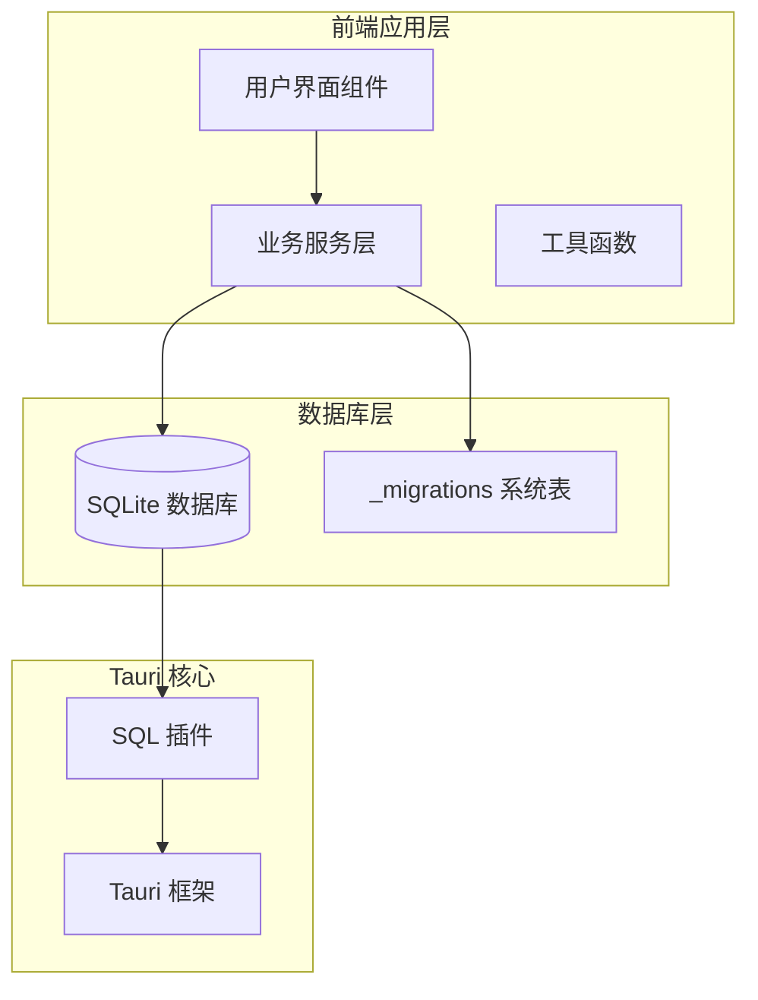
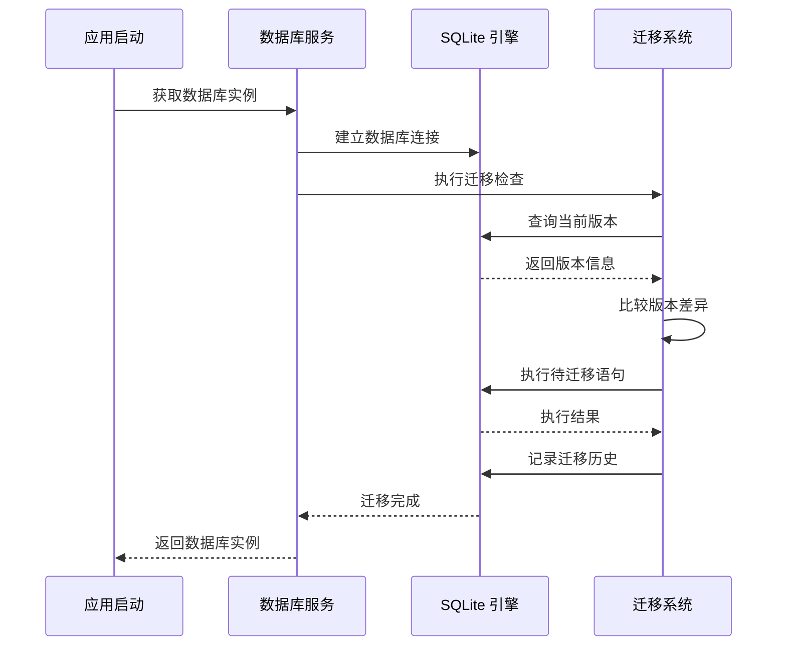
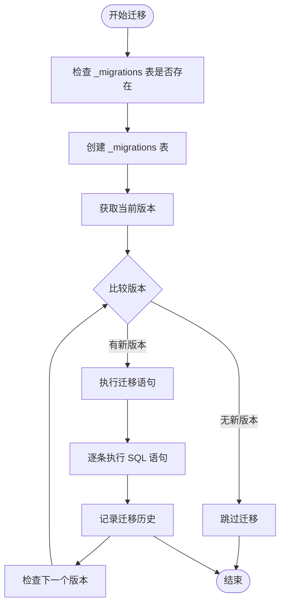
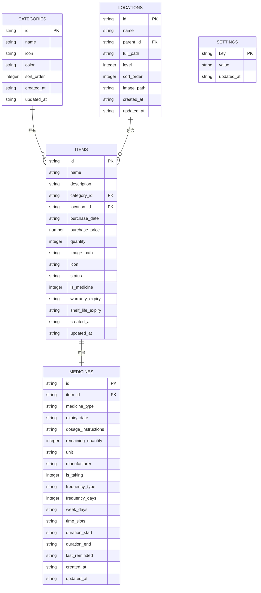
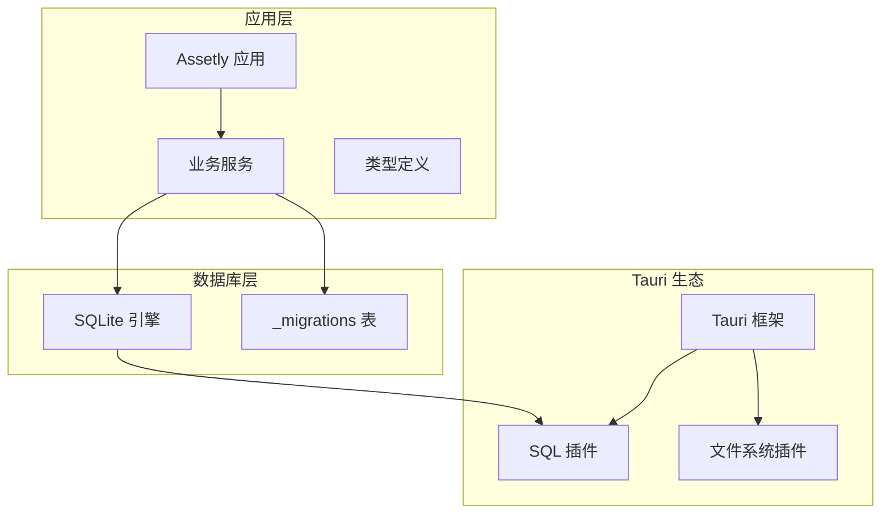
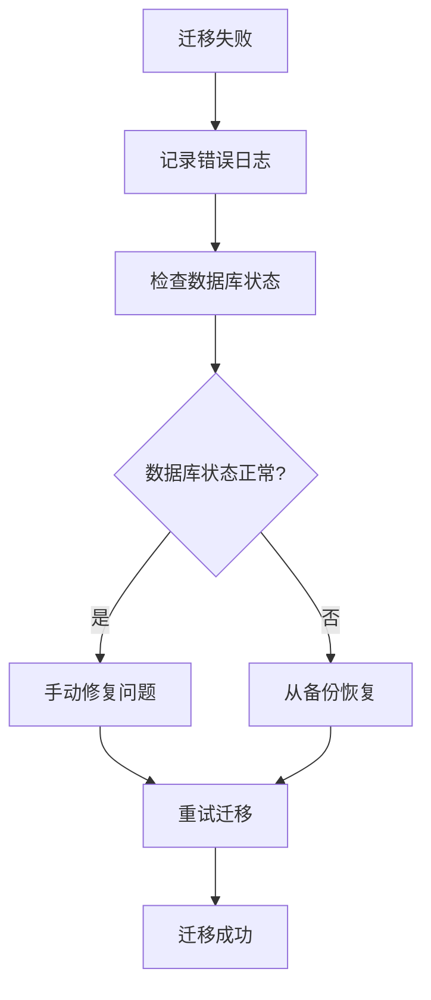

# 数据库迁移系统

<cite>
**本文档引用的文件**
- [database.ts](file://src/services/database.ts)
- [constants.ts](file://src/utils/constants.ts)
- [category.ts](file://src/types/category.ts)
- [item.ts](file://src/types/item.ts)
- [location.ts](file://src/types/location.ts)
- [medicine.ts](file://src/types/medicine.ts)
- [settings.ts](file://src/types/settings.ts)
- [categoryService.ts](file://src/services/categoryService.ts)
- [itemService.ts](file://src/services/itemService.ts)
- [medicineService.ts](file://src/services/medicineService.ts)
- [locationService.ts](file://src/services/locationService.ts)
- [main.rs](file://src-tauri/src/main.rs)
- [Cargo.toml](file://src-tauri/Cargo.toml)
</cite>

## 目录
1. [简介](#简介)
2. [项目结构](#项目结构)
3. [核心组件](#核心组件)
4. [架构概览](#架构概览)
5. [详细组件分析](#详细组件分析)
6. [依赖分析](#依赖分析)
7. [性能考虑](#性能考虑)
8. [故障排除指南](#故障排除指南)
9. [结论](#结论)
10. [附录](#附录)

## 简介

Assetly 是一个基于 Tauri 框架的资产管理应用程序，采用 SQLite 作为本地数据库存储。本文档深入解析其数据库迁移系统的完整实现，包括迁移机制的设计原理、版本管理策略、迁移执行流程以及最佳实践。

该系统的核心是基于 `_migrations` 系统表的版本化迁移管理，支持从 v1 到 v4 的多版本演进，涵盖资产分类、位置管理、药品追踪等核心业务功能。系统通过自动化的迁移执行确保数据库结构与应用代码的同步一致性。

## 项目结构

Assetly 项目采用前后端分离的架构设计，数据库迁移系统位于前端服务层，通过 Tauri 插件与底层 SQLite 数据库交互。



**图表来源**
- [database.ts:18-53](file://src/services/database.ts#L18-L53)
- [main.rs:4-6](file://src-tauri/src/main.rs#L4-L6)

**章节来源**
- [database.ts:1-171](file://src/services/database.ts#L1-L171)
- [Cargo.toml:20-31](file://src-tauri/Cargo.toml#L20-L31)

## 核心组件

### 迁移管理系统

数据库迁移系统的核心由以下关键组件构成：

#### 迁移执行引擎
- **版本检测**: 自动查询 `_migrations` 表获取当前数据库版本
- **增量执行**: 仅执行高于当前版本的新迁移
- **原子性保证**: 每个迁移作为一个独立单元执行

#### 迁移定义结构
```typescript
interface Migration {
  version: number;
  statements: string[];
}
```

#### 数据库连接管理
- **延迟初始化**: 首次访问时建立数据库连接
- **连接复用**: 全局单例模式避免重复连接
- **自动迁移**: 连接建立时自动执行未应用的迁移

**章节来源**
- [database.ts:18-53](file://src/services/database.ts#L18-L53)
- [database.ts:55-58](file://src/services/database.ts#L55-L58)

## 架构概览

数据库迁移系统采用分层架构设计，确保了良好的可维护性和扩展性。



**图表来源**
- [database.ts:8-16](file://src/services/database.ts#L8-L16)
- [database.ts:18-53](file://src/services/database.ts#L18-L53)

**章节来源**
- [database.ts:8-53](file://src/services/database.ts#L8-L53)

## 详细组件分析

### _migrations 系统表设计

#### 表结构定义
| 字段名 | 数据类型 | 约束条件 | 描述 |
|--------|----------|----------|------|
| version | INTEGER | PRIMARY KEY | 迁移版本号 |
| applied_at | TEXT | NOT NULL | 迁移应用时间戳 |

#### 设计特点
- **轻量化设计**: 仅包含必要的元数据字段
- **版本唯一性**: 版本号作为主键确保唯一性
- **时间追踪**: 记录每次迁移的执行时间

**章节来源**
- [database.ts:20-25](file://src/services/database.ts#L20-L25)

### 迁移版本演进

#### v1 版本 - 基础架构
**核心表结构**:
- `categories`: 资产分类管理
- `locations`: 位置层级结构（自引用）
- `items`: 资产基础信息
- `medicines`: 药品扩展信息
- `settings`: 应用配置

**索引优化**:
- `idx_items_category`: 分类查询优化
- `idx_items_location`: 位置查询优化
- `idx_medicines_expiry`: 过期药品查询优化

**默认数据**:
- 8个预设资产分类
- 主题颜色配置
- 货币符号设置

#### v2 版本 - 功能增强
**新增字段**:
- `items.icon`: 资产图标字段

**设计考量**:
- 向后兼容性保持
- 最小化数据库变更

#### v3 版本 - 药品提醒系统
**扩展字段**:
- `medicines.is_taking`: 用药状态标记
- `medicines.frequency_type`: 用药频率类型
- `medicines.frequency_days`: 间隔天数
- `medicines.week_days`: 周几提醒
- `medicines.time_slots`: 提醒时间段
- `medicines.duration_start/end`: 用药周期
- `medicines.last_reminded`: 最后提醒时间

**业务价值**:
- 支持复杂的用药提醒逻辑
- 灵活的用药计划配置

#### v4 版本 - 资产生命周期管理
**新增字段**:
- `items.warranty_expiry`: 保修到期日期
- `items.shelf_life_expiry`: 保质期到期日期
- `locations.image_path`: 位置图片路径

**功能增强**:
- 完善资产全生命周期管理
- 丰富位置可视化能力

**章节来源**
- [database.ts:60-170](file://src/services/database.ts#L60-L170)

### 迁移执行流程

#### 核心执行逻辑


**图表来源**
- [database.ts:18-53](file://src/services/database.ts#L18-L53)

#### 错误处理机制
- **语句级错误捕获**: 单条 SQL 执行失败立即中断
- **日志记录**: 详细的错误信息记录
- **异常传播**: 失败的迁移不会影响后续执行

**章节来源**
- [database.ts:38-45](file://src/services/database.ts#L38-L45)

### 数据模型关系



**图表来源**
- [category.ts:3-11](file://src/types/category.ts#L3-L11)
- [item.ts:5-22](file://src/types/item.ts#L5-L22)
- [location.ts:3-13](file://src/types/location.ts#L3-L13)
- [medicine.ts:7-27](file://src/types/medicine.ts#L7-L27)
- [settings.ts:3-6](file://src/types/settings.ts#L3-L6)

**章节来源**
- [category.ts:1-18](file://src/types/category.ts#L1-L18)
- [item.ts:1-46](file://src/types/item.ts#L1-L46)
- [location.ts:1-24](file://src/types/location.ts#L1-L24)
- [medicine.ts:1-70](file://src/types/medicine.ts#L1-L70)

## 依赖分析

### 技术栈依赖



**图表来源**
- [Cargo.toml:20-31](file://src-tauri/Cargo.toml#L20-L31)
- [database.ts:1-4](file://src/services/database.ts#L1-L4)

### 外部依赖关系

| 依赖项 | 版本 | 用途 | 关键特性 |
|--------|------|------|----------|
| @tauri-apps/plugin-sql | 2.x | 数据库访问 | SQLite 支持 |
| tauri-plugin-log | 2.8.0 | 日志记录 | 结构化日志 |
| tauri-plugin-fs | 2 | 文件系统 | 本地文件操作 |
| tauri-plugin-notification | 2 | 通知服务 | 系统通知 |

**章节来源**
- [Cargo.toml:20-31](file://src-tauri/Cargo.toml#L20-L31)

## 性能考虑

### 迁移性能优化

1. **批量执行**: 同一版本内的多个 SQL 语句按顺序执行
2. **索引优化**: 在 v1 中预先创建常用查询索引
3. **最小化锁竞争**: 迁移在应用启动时一次性完成

### 数据库性能特性

- **事务隔离**: 每个迁移语句在独立事务中执行
- **连接池**: 使用单例模式避免连接开销
- **查询优化**: 通过索引提升复杂查询性能

## 故障排除指南

### 常见迁移问题

#### 迁移失败排查
1. **检查数据库连接**
   - 确认 SQLite 文件权限
   - 验证数据库文件完整性

2. **验证迁移语句**
   - 检查 SQL 语法正确性
   - 确认表结构兼容性

3. **查看错误日志**
   - 分析具体的错误信息
   - 定位失败的 SQL 语句

#### 数据恢复策略



**图表来源**
- [database.ts:40-45](file://src/services/database.ts#L40-L45)

**章节来源**
- [database.ts:40-45](file://src/services/database.ts#L40-L45)

## 结论

Assetly 的数据库迁移系统展现了现代应用开发中数据演进的最佳实践。通过精心设计的版本管理机制、完善的错误处理策略和清晰的数据模型架构，系统实现了可靠的数据库结构演进。

### 核心优势

1. **自动化程度高**: 无需手动干预即可完成数据库升级
2. **版本控制完善**: 基于 `_migrations` 表的完整版本追踪
3. **向后兼容性强**: 新增字段采用默认值确保兼容性
4. **错误处理健全**: 细粒度的错误捕获和日志记录

### 发展建议

1. **迁移测试**: 建议增加迁移执行的单元测试
2. **回滚机制**: 考虑实现迁移回滚功能
3. **性能监控**: 添加迁移执行时间统计

## 附录

### 迁移版本对照表

| 版本 | 主要变更 | 新增字段 | 删除字段 |
|------|----------|----------|----------|
| v1 | 基础架构 | - | - |
| v2 | 图标支持 | items.icon | - |
| v3 | 用药提醒 | is_taking, frequency_* 等 | - |
| v4 | 生命周期管理 | items.warranty_expiry, shelf_life_expiry, locations.image_path | - |

### 开发者指南

#### 编写新迁移的步骤
1. 在 `getMigrations()` 函数中添加新的迁移对象
2. 设置递增的版本号
3. 实现完整的 SQL 语句数组
4. 测试迁移执行效果
5. 更新相关业务逻辑

#### 测试迁移的方法
- 清理测试数据库
- 执行迁移
- 验证表结构
- 测试数据完整性