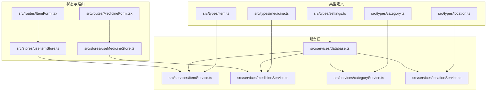
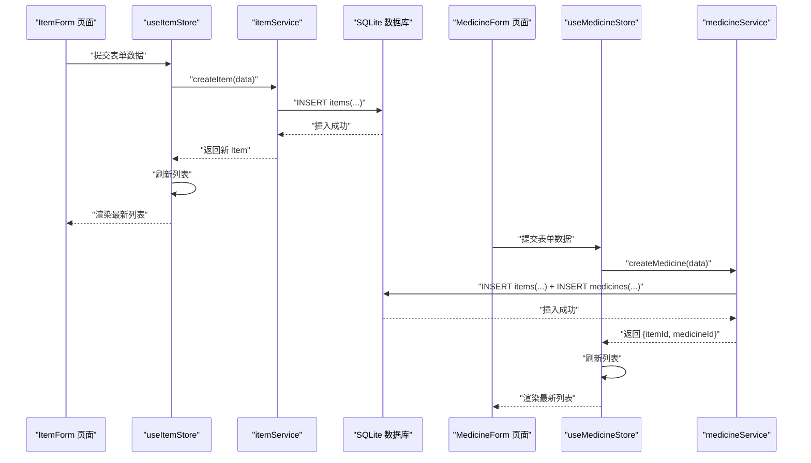
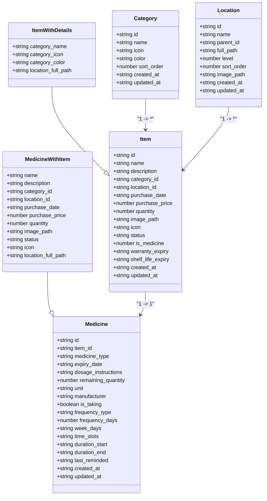
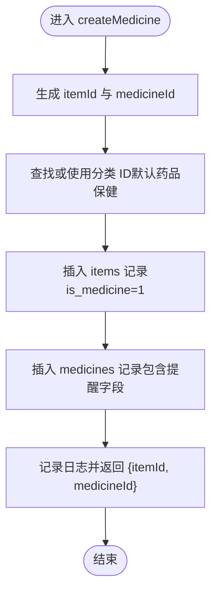
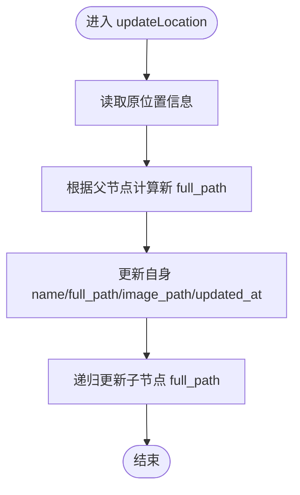
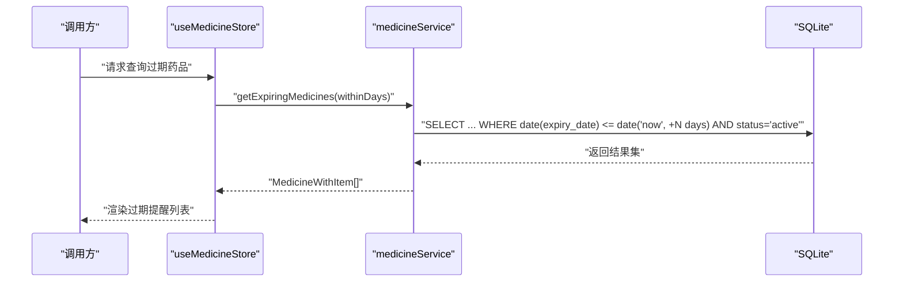
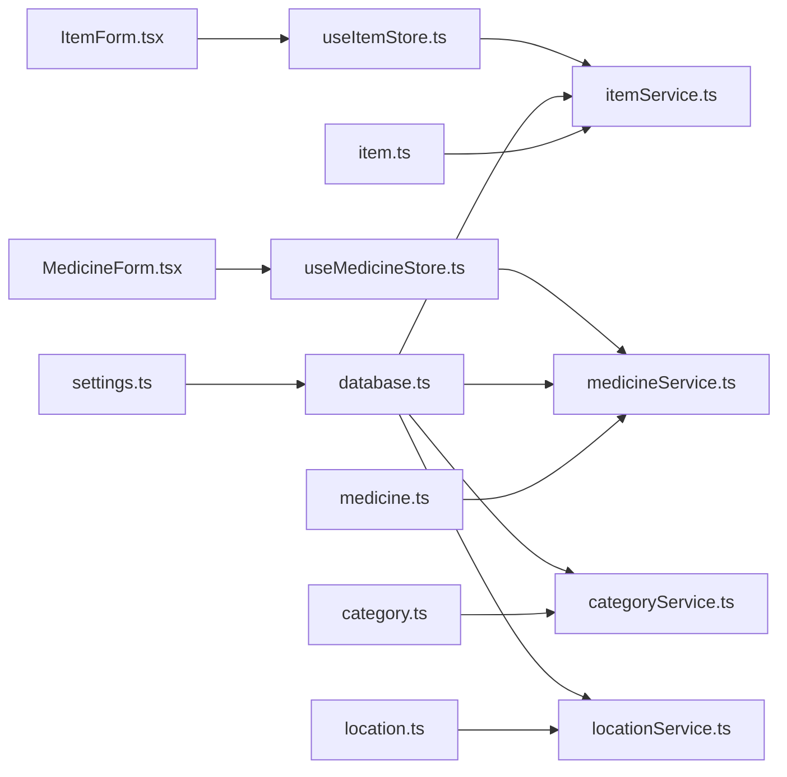

# 数据模型

<cite>
**本文引用的文件**
- [src/types/item.ts](file://src/types/item.ts)
- [src/types/medicine.ts](file://src/types/medicine.ts)
- [src/types/category.ts](file://src/types/category.ts)
- [src/types/location.ts](file://src/types/location.ts)
- [src/types/settings.ts](file://src/types/settings.ts)
- [src/services/database.ts](file://src/services/database.ts)
- [src/services/itemService.ts](file://src/services/itemService.ts)
- [src/services/medicineService.ts](file://src/services/medicineService.ts)
- [src/services/categoryService.ts](file://src/services/categoryService.ts)
- [src/services/locationService.ts](file://src/services/locationService.ts)
- [src/stores/useItemStore.ts](file://src/stores/useItemStore.ts)
- [src/stores/useMedicineStore.ts](file://src/stores/useMedicineStore.ts)
- [src/routes/ItemForm.tsx](file://src/routes/ItemForm.tsx)
- [src/routes/MedicineForm.tsx](file://src/routes/MedicineForm.tsx)
- [src/utils/constants.ts](file://src/utils/constants.ts)
</cite>

## 目录
1. [简介](#简介)
2. [项目结构](#项目结构)
3. [核心组件](#核心组件)
4. [架构总览](#架构总览)
5. [详细组件分析](#详细组件分析)
6. [依赖分析](#依赖分析)
7. [性能考虑](#性能考虑)
8. [故障排查指南](#故障排查指南)
9. [结论](#结论)
10. [附录](#附录)

## 简介
本文件系统性梳理 Assetly 的数据模型与实体关系，聚焦以下核心实体的 TypeScript 接口定义、业务含义、关系映射、使用示例与最佳实践：Item（物品）、Medicine（药品）、Category（分类）、Location（位置）、Setting（设置）。文档同时给出基于真实代码的类图、序列图与流程图，帮助开发者快速理解与正确使用数据模型。

## 项目结构
数据模型相关代码主要分布在以下目录与文件：
- 类型定义：src/types 下的各实体接口文件
- 服务层：src/services 下的数据库访问与业务逻辑封装
- 存储层：src/stores 下的状态管理（Zustand）
- 路由与表单：src/routes 下的页面组件，负责表单渲染与数据提交
- 工具常量：src/utils/constants.ts 提供默认分类等常量



图表来源
- [src/types/item.ts:1-46](file://src/types/item.ts#L1-L46)
- [src/types/medicine.ts:1-70](file://src/types/medicine.ts#L1-L70)
- [src/types/category.ts:1-18](file://src/types/category.ts#L1-L18)
- [src/types/location.ts:1-24](file://src/types/location.ts#L1-L24)
- [src/types/settings.ts:1-25](file://src/types/settings.ts#L1-L25)
- [src/services/database.ts:1-171](file://src/services/database.ts#L1-L171)
- [src/services/itemService.ts:1-127](file://src/services/itemService.ts#L1-L127)
- [src/services/medicineService.ts:1-194](file://src/services/medicineService.ts#L1-L194)
- [src/services/categoryService.ts:1-59](file://src/services/categoryService.ts#L1-L59)
- [src/services/locationService.ts:1-143](file://src/services/locationService.ts#L1-L143)
- [src/stores/useItemStore.ts:1-53](file://src/stores/useItemStore.ts#L1-L53)
- [src/stores/useMedicineStore.ts:1-42](file://src/stores/useMedicineStore.ts#L1-L42)
- [src/routes/ItemForm.tsx:1-263](file://src/routes/ItemForm.tsx#L1-L263)
- [src/routes/MedicineForm.tsx:1-401](file://src/routes/MedicineForm.tsx#L1-L401)

章节来源
- [src/types/item.ts:1-46](file://src/types/item.ts#L1-L46)
- [src/types/medicine.ts:1-70](file://src/types/medicine.ts#L1-L70)
- [src/types/category.ts:1-18](file://src/types/category.ts#L1-L18)
- [src/types/location.ts:1-24](file://src/types/location.ts#L1-L24)
- [src/types/settings.ts:1-25](file://src/types/settings.ts#L1-L25)
- [src/services/database.ts:1-171](file://src/services/database.ts#L1-L171)
- [src/services/itemService.ts:1-127](file://src/services/itemService.ts#L1-L127)
- [src/services/medicineService.ts:1-194](file://src/services/medicineService.ts#L1-L194)
- [src/services/categoryService.ts:1-59](file://src/services/categoryService.ts#L1-L59)
- [src/services/locationService.ts:1-143](file://src/services/locationService.ts#L1-L143)
- [src/stores/useItemStore.ts:1-53](file://src/stores/useItemStore.ts#L1-L53)
- [src/stores/useMedicineStore.ts:1-42](file://src/stores/useMedicineStore.ts#L1-L42)
- [src/routes/ItemForm.tsx:1-263](file://src/routes/ItemForm.tsx#L1-L263)
- [src/routes/MedicineForm.tsx:1-401](file://src/routes/MedicineForm.tsx#L1-L401)
- [src/utils/constants.ts:1-40](file://src/utils/constants.ts#L1-L40)

## 核心组件
本节对五个核心实体的接口定义、字段语义、默认值与约束进行逐项说明，并指出其在数据库层的映射与服务层的使用方式。

- Item（物品）
  - 关键字段与类型
    - id: 字符串（主键）
    - name/description: 字符串
    - category_id/location_id: 字符串（外键）
    - purchase_date/purchase_price/quantity: 日期字符串/数值/整数
    - image_path/icon/status: 字符串；状态枚举为 'active' | 'archived' | 'disposed'
    - is_medicine: 数值 0/1（布尔在 SQLite 中以整型存储）
    - warranty_expiry/shelf_life_expiry: 日期字符串
    - created_at/updated_at: 日期字符串
  - 业务含义
    - 描述可追踪的物理资产或库存物品，支持分类、位置、购买信息与状态管理
  - 默认值与约束
    - 数据库默认值见迁移脚本；服务层在创建时补充默认时间戳与空字符串
  - 相关接口
    - Item、ItemWithDetails、ItemFormData
  - 使用示例路径
    - [创建物品:60-87](file://src/services/itemService.ts#L60-L87)
    - [更新物品:89-119](file://src/services/itemService.ts#L89-L119)
    - [查询物品详情:46-58](file://src/services/itemService.ts#L46-L58)
    - [表单提交:67-81](file://src/routes/ItemForm.tsx#L67-L81)

- Medicine（药品）
  - 关键字段与类型
    - id: 字符串（主键）
    - item_id: 字符串（外键，一对一扩展）
    - medicine_type: 枚举 'internal' | 'external' | 'emergency'
    - expiry_date: 日期字符串
    - dosage_instructions/manufacturer/unit: 字符串
    - remaining_quantity: 整数
    - is_taking/frequency_type/frequency_days/week_days/time_slots/duration_start/duration_end/last_reminded: 复合提醒字段
    - created_at/updated_at: 日期字符串
  - 业务含义
    - 对物品实体的扩展，用于记录药品的类型、有效期、剩余数量与用药提醒配置
  - 默认值与约束
    - 数据库默认值见迁移脚本；布尔字段以整型存储
  - 相关接口
    - Medicine、MedicineWithItem、MedicineFormData
  - 使用示例路径
    - [创建药品（含物品与药品两条记录）:54-95](file://src/services/medicineService.ts#L54-L95)
    - [更新药品（分别更新物品与药品字段）:97-162](file://src/services/medicineService.ts#L97-L162)
    - [查询过期药品:164-178](file://src/services/medicineService.ts#L164-L178)
    - [表单提交:66-80](file://src/routes/MedicineForm.tsx#L66-L80)

- Category（分类）
  - 关键字段与类型
    - id: 字符串（主键）
    - name/icon/color/sort_order: 字符串/整数
    - created_at/updated_at: 日期字符串
  - 业务含义
    - 物品的分类标签，支持排序与主题色
  - 默认值与约束
    - 数据库默认值见迁移脚本；新增时自动分配 sort_order
  - 相关接口
    - Category、CategoryFormData
  - 使用示例路径
    - [创建分类:20-34](file://src/services/categoryService.ts#L20-L34)
    - [更新分类:36-42](file://src/services/categoryService.ts#L36-L42)
    - [默认分类种子:4-13](file://src/utils/constants.ts#L4-L13)

- Location（位置）
  - 关键字段与类型
    - id: 字符串（主键）
    - name/parent_id/full_path/level/sort_order/image_path: 字符串/整数
    - created_at/updated_at: 日期字符串
  - 业务含义
    - 支持树形层级的位置结构，full_path 记录完整路径，level 表示层级
  - 默认值与约束
    - 数据库默认值见迁移脚本；更新时递归维护子节点 full_path
  - 相关接口
    - Location、LocationTreeNode、LocationFormData
  - 使用示例路径
    - [创建位置（计算 full_path 与 level）:20-53](file://src/services/locationService.ts#L20-L53)
    - [更新位置（递归更新子节点路径）:55-92](file://src/services/locationService.ts#L55-L92)
    - [删除位置（级联删除后代）:94-122](file://src/services/locationService.ts#L94-L122)

- Setting（设置）
  - 关键字段与类型
    - AppSettings: theme_color/currency_symbol
    - DashboardStats: total_items/total_value/medicine_count/expiring_count
    - CategoryDistribution: name/value/color
    - MonthlySpending: month/amount
  - 业务含义
    - 应用全局设置与统计聚合数据结构
  - 使用示例路径
    - [应用设置接口:3-6](file://src/types/settings.ts#L3-L6)
    - [仪表盘统计接口:8-13](file://src/types/settings.ts#L8-L13)
    - [分类分布接口:15-19](file://src/types/settings.ts#L15-L19)
    - [月度支出接口:21-24](file://src/types/settings.ts#L21-L24)

章节来源
- [src/types/item.ts:1-46](file://src/types/item.ts#L1-L46)
- [src/types/medicine.ts:1-70](file://src/types/medicine.ts#L1-L70)
- [src/types/category.ts:1-18](file://src/types/category.ts#L1-L18)
- [src/types/location.ts:1-24](file://src/types/location.ts#L1-L24)
- [src/types/settings.ts:1-25](file://src/types/settings.ts#L1-L25)
- [src/services/database.ts:60-170](file://src/services/database.ts#L60-L170)
- [src/services/itemService.ts:60-127](file://src/services/itemService.ts#L60-L127)
- [src/services/medicineService.ts:54-194](file://src/services/medicineService.ts#L54-L194)
- [src/services/categoryService.ts:20-59](file://src/services/categoryService.ts#L20-L59)
- [src/services/locationService.ts:20-143](file://src/services/locationService.ts#L20-L143)
- [src/utils/constants.ts:4-13](file://src/utils/constants.ts#L4-L13)

## 架构总览
下图展示数据模型在前端的端到端流转：界面表单收集数据 → Zustand 状态管理 → 服务层持久化 → SQLite 数据库；以及反向查询流程。



图表来源
- [src/routes/ItemForm.tsx:66-81](file://src/routes/ItemForm.tsx#L66-L81)
- [src/stores/useItemStore.ts:34-37](file://src/stores/useItemStore.ts#L34-L37)
- [src/services/itemService.ts:60-87](file://src/services/itemService.ts#L60-L87)
- [src/routes/MedicineForm.tsx:66-80](file://src/routes/MedicineForm.tsx#L66-L80)
- [src/stores/useMedicineStore.ts:28-31](file://src/stores/useMedicineStore.ts#L28-L31)
- [src/services/medicineService.ts:54-95](file://src/services/medicineService.ts#L54-L95)

## 详细组件分析

### 实体关系与继承
- 一对一关系
  - Medicine.item_id → Item.id（Medicine 是 Item 的扩展）
- 一对多关系
  - Category.id → Item.category_id（一个分类包含多个物品）
  - Location.id → Item.location_id（一个位置包含多个物品）
  - Location.id → Location.parent_id（位置树形结构）
- 继承关系
  - TypeScript 通过接口扩展实现“继承”语义：
    - ItemWithDetails 扩展 Item
    - MedicineWithItem 扩展 Medicine 并合并 Item 字段
  - 数据库层面通过外键与联合查询实现关系表达



图表来源
- [src/types/category.ts:3-11](file://src/types/category.ts#L3-L11)
- [src/types/location.ts:3-13](file://src/types/location.ts#L3-L13)
- [src/types/item.ts:5-22](file://src/types/item.ts#L5-L22)
- [src/types/item.ts:24-29](file://src/types/item.ts#L24-L29)
- [src/types/medicine.ts:7-27](file://src/types/medicine.ts#L7-L27)
- [src/types/medicine.ts:29-41](file://src/types/medicine.ts#L29-L41)

章节来源
- [src/types/item.ts:1-46](file://src/types/item.ts#L1-L46)
- [src/types/medicine.ts:1-70](file://src/types/medicine.ts#L1-L70)
- [src/types/category.ts:1-18](file://src/types/category.ts#L1-L18)
- [src/types/location.ts:1-24](file://src/types/location.ts#L1-L24)

### 数据库表结构与索引
- 表与默认值
  - categories: 主键 id，带 icon/color/sort_order，默认值
  - locations: 自关联父节点，full_path/level/sort_order，默认值
  - items: 主键 id，外键 category_id/location_id，带 is_medicine/purchase_* 等字段，默认值
  - medicines: 主键 id，唯一外键 item_id，带 medicine_type/*reminder* 字段，默认值
  - settings: 键值对表
- 索引
  - items(category_id), items(location_id), items(status)
  - medicines(item_id), medicines(expiry_date), medicines(medicine_type)
  - locations(parent_id)

```mermaid
erDiagram
CATEGORIES {
text id PK
text name
text icon
text color
int sort_order
text created_at
text updated_at
}
LOCATIONS {
text id PK
text name
text parent_id FK
text full_path
int level
int sort_order
text image_path
text created_at
text updated_at
}
ITEMS {
text id PK
text name
text description
text category_id FK
text location_id FK
text purchase_date
real purchase_price
int quantity
text image_path
text icon
text status
int is_medicine
text warranty_expiry
text shelf_life_expiry
text created_at
text updated_at
}
MEDICINES {
text id PK
text item_id FK_UQ
text medicine_type
text expiry_date
text dosage_instructions
int remaining_quantity
text unit
text manufacturer
int is_taking
text frequency_type
int frequency_days
text week_days
text time_slots
text duration_start
text duration_end
text last_reminded
text created_at
text updated_at
}
SETTINGS {
text key PK
text value
text updated_at
}
CATEGORIES ||--o{ ITEMS : "1 -> *"
LOCATIONS ||--o{ ITEMS : "1 -> *"
ITEMS ||--|| MEDICINES : "1 -> 1"
```

图表来源
- [src/services/database.ts:67-131](file://src/services/database.ts#L67-L131)

章节来源
- [src/services/database.ts:60-170](file://src/services/database.ts#L60-L170)

### 药品创建流程（复杂逻辑）


图表来源
- [src/services/medicineService.ts:54-95](file://src/services/medicineService.ts#L54-L95)

章节来源
- [src/services/medicineService.ts:54-95](file://src/services/medicineService.ts#L54-L95)

### 位置更新与路径传播（复杂逻辑）


图表来源
- [src/services/locationService.ts:55-92](file://src/services/locationService.ts#L55-L92)

章节来源
- [src/services/locationService.ts:55-92](file://src/services/locationService.ts#L55-L92)

### 查询过期药品（条件过滤）


图表来源
- [src/stores/useMedicineStore.ts:20-26](file://src/stores/useMedicineStore.ts#L20-L26)
- [src/services/medicineService.ts:164-178](file://src/services/medicineService.ts#L164-L178)

章节来源
- [src/stores/useMedicineStore.ts:20-26](file://src/stores/useMedicineStore.ts#L20-L26)
- [src/services/medicineService.ts:164-178](file://src/services/medicineService.ts#L164-L178)

## 依赖分析
- 类型到服务的依赖
  - Item/Medicine/Category/Location/Settings 的接口被对应服务层消费
- 服务到数据库的依赖
  - 各 service 通过统一的数据库连接与迁移初始化
- 状态到服务的依赖
  - Zustand store 将 UI 事件转化为服务调用，并触发列表刷新
- 路由到状态的依赖
  - 表单页面直接绑定 store，形成双向数据流



图表来源
- [src/types/item.ts:1-46](file://src/types/item.ts#L1-L46)
- [src/types/medicine.ts:1-70](file://src/types/medicine.ts#L1-L70)
- [src/types/category.ts:1-18](file://src/types/category.ts#L1-L18)
- [src/types/location.ts:1-24](file://src/types/location.ts#L1-L24)
- [src/types/settings.ts:1-25](file://src/types/settings.ts#L1-L25)
- [src/services/itemService.ts:1-127](file://src/services/itemService.ts#L1-L127)
- [src/services/medicineService.ts:1-194](file://src/services/medicineService.ts#L1-L194)
- [src/services/categoryService.ts:1-59](file://src/services/categoryService.ts#L1-L59)
- [src/services/locationService.ts:1-143](file://src/services/locationService.ts#L1-L143)
- [src/services/database.ts:1-171](file://src/services/database.ts#L1-L171)
- [src/stores/useItemStore.ts:1-53](file://src/stores/useItemStore.ts#L1-L53)
- [src/stores/useMedicineStore.ts:1-42](file://src/stores/useMedicineStore.ts#L1-L42)
- [src/routes/ItemForm.tsx:1-263](file://src/routes/ItemForm.tsx#L1-L263)
- [src/routes/MedicineForm.tsx:1-401](file://src/routes/MedicineForm.tsx#L1-L401)

章节来源
- [src/types/item.ts:1-46](file://src/types/item.ts#L1-L46)
- [src/types/medicine.ts:1-70](file://src/types/medicine.ts#L1-L70)
- [src/types/category.ts:1-18](file://src/types/category.ts#L1-L18)
- [src/types/location.ts:1-24](file://src/types/location.ts#L1-L24)
- [src/types/settings.ts:1-25](file://src/types/settings.ts#L1-L25)
- [src/services/itemService.ts:1-127](file://src/services/itemService.ts#L1-L127)
- [src/services/medicineService.ts:1-194](file://src/services/medicineService.ts#L1-L194)
- [src/services/categoryService.ts:1-59](file://src/services/categoryService.ts#L1-L59)
- [src/services/locationService.ts:1-143](file://src/services/locationService.ts#L1-L143)
- [src/services/database.ts:1-171](file://src/services/database.ts#L1-L171)
- [src/stores/useItemStore.ts:1-53](file://src/stores/useItemStore.ts#L1-L53)
- [src/stores/useMedicineStore.ts:1-42](file://src/stores/useMedicineStore.ts#L1-L42)
- [src/routes/ItemForm.tsx:1-263](file://src/routes/ItemForm.tsx#L1-L263)
- [src/routes/MedicineForm.tsx:1-401](file://src/routes/MedicineForm.tsx#L1-L401)

## 性能考虑
- 索引策略
  - items 上的 category_id/location_id/status 索引有助于筛选与分页
  - medicines 上的 item_id/expiry_date/type 索引有助于扩展查询与过期提醒
  - locations 上的 parent_id 索引支持树形遍历
- 查询优化
  - 使用 LEFT JOIN 获取 ItemWithDetails/MedicineWithItem 时，尽量限定过滤条件（类别、位置、状态、搜索关键词）
  - 分页与排序建议按 created_at 或 expiry_date 降序
- 写入优化
  - 批量更新时复用参数数组，减少 SQL 拼接
  - 在 medicineService 中分别更新 items 与 medicines，避免不必要的字段写入

## 故障排查指南
- 常见问题与定位
  - 创建药品时报错：检查 medicines 外键 item_id 是否存在，确认 is_medicine 字段是否正确写入 items
  - 位置更新后子节点路径异常：确认 updateChildrenPaths 是否被调用，检查 full_path 计算逻辑
  - 过期药品查询无结果：确认 withinDays 参数与日期格式，检查 status 条件
- 日志与调试
  - 服务层使用日志记录关键操作，便于回溯
  - 数据库迁移失败会抛出错误，检查 SQL 语句与权限
- 最佳实践
  - 表单提交前进行必填校验（名称、有效期等）
  - 更新时仅传入变更字段，避免全量覆盖
  - 使用 store 的 loading 状态避免重复提交

章节来源
- [src/services/medicineService.ts:97-162](file://src/services/medicineService.ts#L97-L162)
- [src/services/locationService.ts:79-92](file://src/services/locationService.ts#L79-L92)
- [src/services/medicineService.ts:164-178](file://src/services/medicineService.ts#L164-L178)
- [src/services/database.ts:38-52](file://src/services/database.ts#L38-L52)

## 结论
Assetly 的数据模型以 TypeScript 接口清晰表达实体与关系，配合 SQLite 的外键与索引实现强一致与高性能。通过服务层抽象与 Zustand 状态管理，实现了从表单到持久化的完整闭环。遵循本文的接口定义、关系映射与最佳实践，可确保数据一致性与开发效率。

## 附录
- 使用示例与最佳实践
  - 表单提交
    - 物品表单：[提交处理:67-81](file://src/routes/ItemForm.tsx#L67-L81)
    - 药品表单：[提交处理:66-80](file://src/routes/MedicineForm.tsx#L66-L80)
  - 列表加载
    - 物品列表：[加载与过滤:28-32](file://src/stores/useItemStore.ts#L28-L32)
    - 药品列表：[按类型过滤:20-26](file://src/stores/useMedicineStore.ts#L20-L26)
  - 数据验证与默认值
    - 必填字段：名称、有效期（药品）
    - 默认值：布尔转整型、sort_order 自增、full_path 递归计算
  - 类型安全
    - 使用字面量联合类型（如状态、类型枚举）避免魔法字符串
    - 使用接口扩展（ItemWithDetails/MedicineWithItem）表达“继承”关系