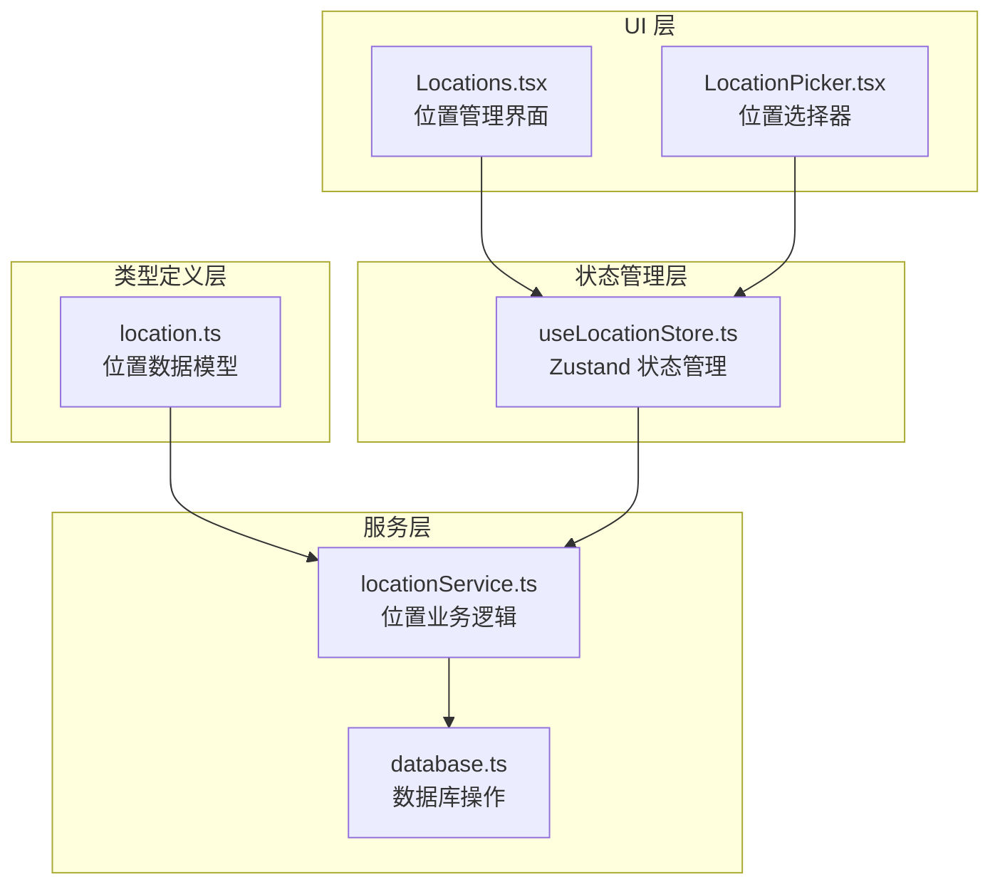
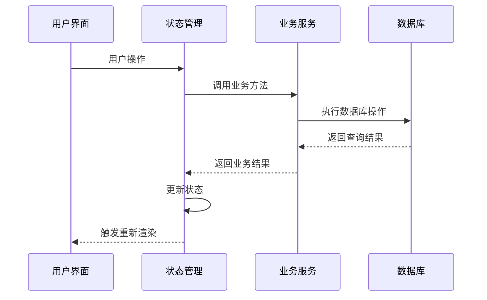
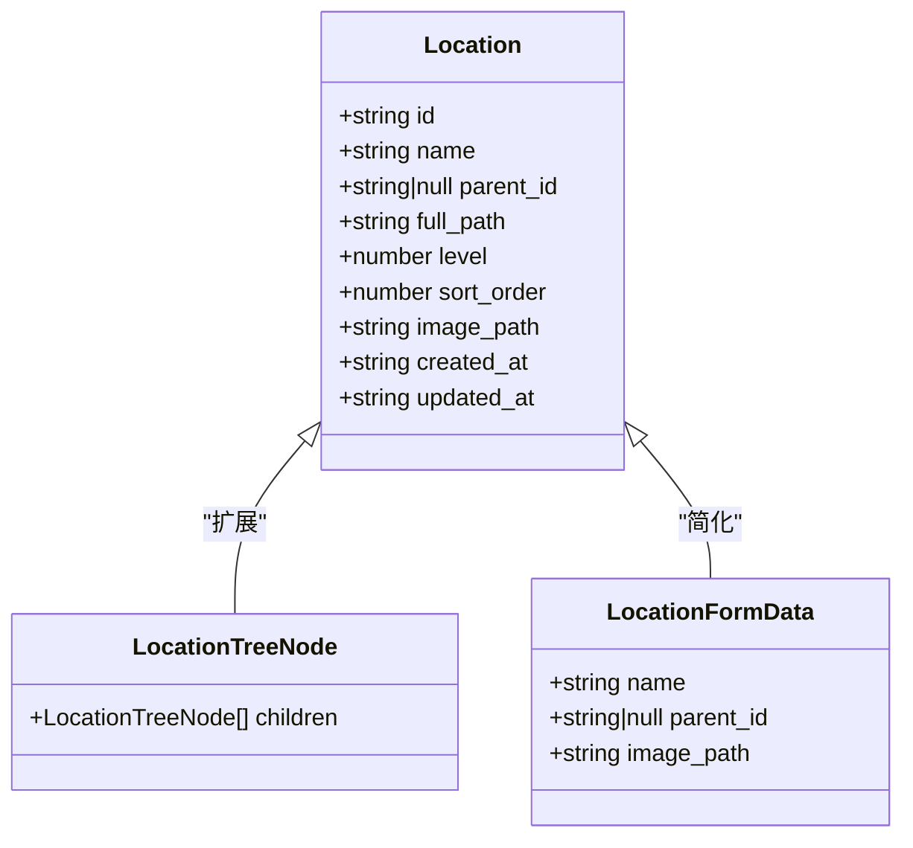
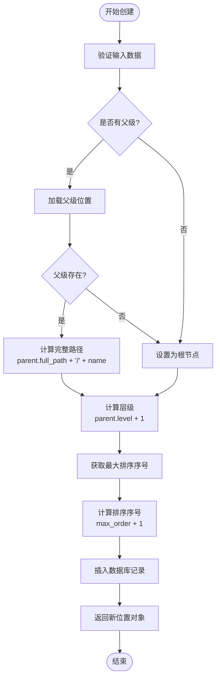
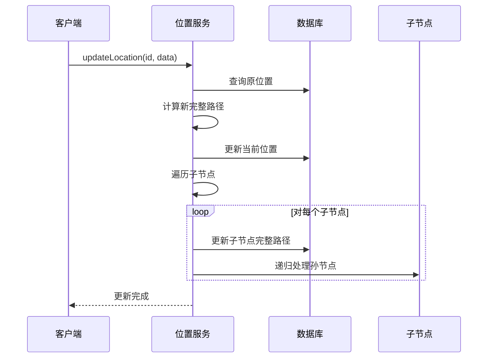
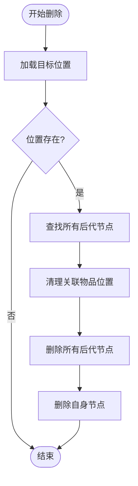
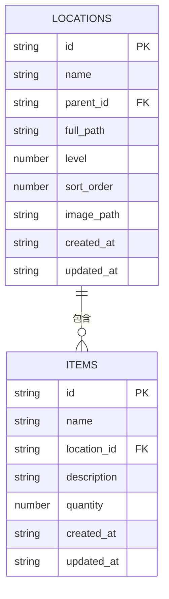
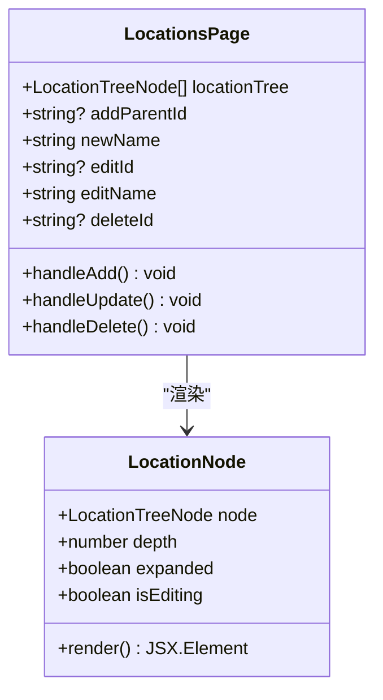
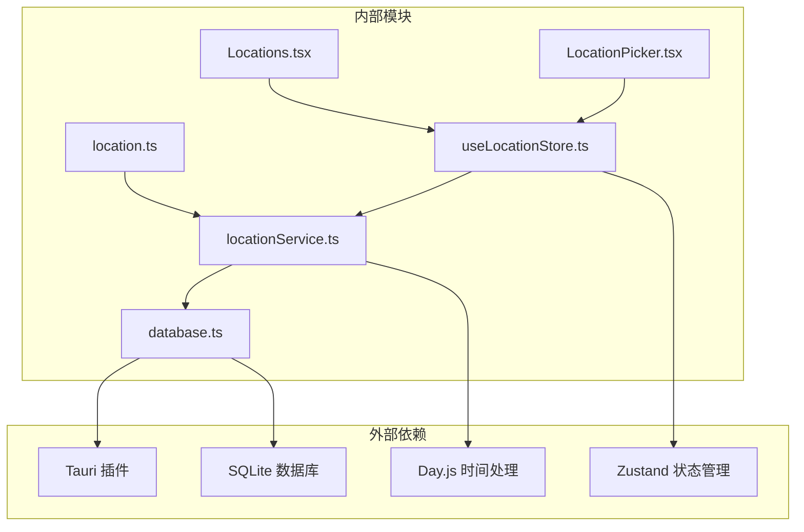

# 位置服务

<cite>
**本文档引用的文件**
- [location.ts](file://src/types/location.ts)
- [locationService.ts](file://src/services/locationService.ts)
- [useLocationStore.ts](file://src/stores/useLocationStore.ts)
- [Locations.tsx](file://src/routes/Locations.tsx)
- [LocationPicker.tsx](file://src/components/items/LocationPicker.tsx)
- [database.ts](file://src/services/database.ts)
- [item.ts](file://src/types/item.ts)
- [index.css](file://src/index.css)
</cite>

## 目录
1. [简介](#简介)
2. [项目结构](#项目结构)
3. [核心组件](#核心组件)
4. [架构概览](#架构概览)
5. [详细组件分析](#详细组件分析)
6. [依赖分析](#依赖分析)
7. [性能考虑](#性能考虑)
8. [故障排除指南](#故障排除指南)
9. [结论](#结论)
10. [附录](#附录)

## 简介
Assetly 的位置服务是一个基于 SQLite 的树形结构位置管理系统，支持多层级位置组织、动态路径计算和完整的 CRUD 操作。该系统通过自引用表结构实现位置树的层次关系，并提供了直观的用户界面用于位置管理、拖拽操作和层级导航。

## 项目结构
位置服务相关的代码分布在以下模块中：

**图表来源**
- [location.ts:1-24](file://src/types/location.ts#L1-L24)
- [locationService.ts:1-143](file://src/services/locationService.ts#L1-L143)
- [useLocationStore.ts:1-43](file://src/stores/useLocationStore.ts#L1-L43)
- [Locations.tsx:1-204](file://src/routes/Locations.tsx#L1-L204)
- [LocationPicker.tsx:1-103](file://src/components/items/LocationPicker.tsx#L1-L103)

**章节来源**
- [location.ts:1-24](file://src/types/location.ts#L1-L24)
- [locationService.ts:1-143](file://src/services/locationService.ts#L1-L143)
- [useLocationStore.ts:1-43](file://src/stores/useLocationStore.ts#L1-L43)
- [Locations.tsx:1-204](file://src/routes/Locations.tsx#L1-L204)
- [LocationPicker.tsx:1-103](file://src/components/items/LocationPicker.tsx#L1-L103)

## 核心组件
位置服务的核心由四个主要组件构成：

### 数据模型
位置数据模型采用接口继承的方式定义了基础位置信息和树节点扩展：
- 基础位置接口包含标识符、名称、父级引用、完整路径、层级深度等核心字段
- 树节点接口在基础位置上扩展了子节点数组，支持递归结构
- 表单数据接口简化了创建和更新操作的数据结构

### 业务服务
位置服务提供了完整的 CRUD 操作实现：
- 创建：自动计算层级深度和完整路径，生成排序序号
- 读取：支持按 ID 查询和全量查询，返回有序结果
- 更新：动态更新完整路径并级联更新子节点
- 删除：级联删除所有后代节点并清理关联物品

### 状态管理
使用 Zustand 实现轻量级状态管理：
- 维护位置列表和树形结构
- 提供异步操作方法
- 自动重新获取数据以保持状态同步

### 用户界面
提供两种交互方式：
- 位置管理页面：完整的树形展示和编辑功能
- 位置选择器：下拉式位置选择组件

**章节来源**
- [location.ts:3-23](file://src/types/location.ts#L3-L23)
- [locationService.ts:20-53](file://src/services/locationService.ts#L20-L53)
- [useLocationStore.ts:5-42](file://src/stores/useLocationStore.ts#L5-L42)
- [Locations.tsx:7-116](file://src/routes/Locations.tsx#L7-L116)

## 架构概览
位置服务采用分层架构设计，确保关注点分离和可维护性：

**图表来源**
- [useLocationStore.ts:15-42](file://src/stores/useLocationStore.ts#L15-L42)
- [locationService.ts:9-18](file://src/services/locationService.ts#L9-L18)
- [database.ts:8-16](file://src/services/database.ts#L8-L16)

## 详细组件分析

### 数据模型设计
位置数据模型采用简洁而高效的设计：

**图表来源**
- [location.ts:3-23](file://src/types/location.ts#L3-L23)

#### 字段设计说明
- **id**: 唯一标识符，使用 UUID 确保全局唯一性
- **name**: 位置名称，作为路径构建的基础元素
- **parent_id**: 父级引用，支持 null 值表示根节点
- **full_path**: 完整路径字符串，动态计算和维护
- **level**: 层级深度，从 0 开始的数字层级
- **sort_order**: 排序序号，同级节点的显示顺序
- **image_path**: 图像路径，支持位置图标
- **时间戳**: 记录创建和更新时间

**章节来源**
- [location.ts:3-13](file://src/types/location.ts#L3-L13)

### CRUD 操作实现

#### 创建操作 (Create)
创建位置时的完整流程：

**图表来源**
- [locationService.ts:20-53](file://src/services/locationService.ts#L20-L53)

#### 更新操作 (Update)
更新位置时的级联路径更新机制：

**图表来源**
- [locationService.ts:55-92](file://src/services/locationService.ts#L55-L92)

#### 删除操作 (Delete)
删除位置时的级联删除策略：

**图表来源**
- [locationService.ts:94-122](file://src/services/locationService.ts#L94-L122)

**章节来源**
- [locationService.ts:20-122](file://src/services/locationService.ts#L20-L122)

### 路径计算和缓存机制

#### 动态路径计算
位置路径采用动态计算而非静态存储，具有以下特点：

- **实时性**: 路径始终反映最新的父子关系
- **一致性**: 通过递归更新确保所有后代节点路径正确
- **完整性**: 使用斜杠分隔符构建完整路径字符串

#### 缓存策略
虽然路径在数据库中存储，但系统采用了智能缓存策略：

- **内存缓存**: 在应用内存中维护位置树结构
- **增量更新**: 仅在必要时更新受影响的节点
- **批量操作**: 支持一次操作影响多个节点的场景

**章节来源**
- [locationService.ts:25-34](file://src/services/locationService.ts#L25-L34)
- [locationService.ts:75-92](file://src/services/locationService.ts#L75-L92)

### 位置与物品的关联关系

#### 关联设计
位置与物品之间存在多对一的关系：
- 每个物品只能位于一个位置
- 位置可以包含多个物品
- 删除位置时需要清理关联的物品

#### 级联更新处理
系统实现了完整的级联更新机制：

**图表来源**
- [database.ts:77-87](file://src/services/database.ts#L77-L87)
- [item.ts:5-22](file://src/types/item.ts#L5-L22)

**章节来源**
- [locationService.ts:100-108](file://src/services/locationService.ts#L100-L108)
- [database.ts:89-103](file://src/services/database.ts#L89-L103)

### 用户界面组件

#### 位置管理页面
位置管理页面提供了完整的树形结构展示和操作功能：

**图表来源**
- [Locations.tsx:7-116](file://src/routes/Locations.tsx#L7-L116)
- [Locations.tsx:118-203](file://src/routes/Locations.tsx#L118-L203)

#### 位置选择器
位置选择器组件提供了下拉式的位置选择功能：

- **展开/收起**: 支持树形结构的展开和折叠
- **选择高亮**: 当前选中的位置有视觉高亮
- **深度缩进**: 通过 CSS 左边距实现层级缩进效果

**章节来源**
- [Locations.tsx:80-116](file://src/routes/Locations.tsx#L80-L116)
- [LocationPicker.tsx:11-63](file://src/components/items/LocationPicker.tsx#L11-L63)

## 依赖分析

### 组件依赖关系
位置服务的依赖关系清晰且层次分明：

**图表来源**
- [locationService.ts:1-3](file://src/services/locationService.ts#L1-L3)
- [useLocationStore.ts:1-3](file://src/stores/useLocationStore.ts#L1-L3)
- [database.ts:1-4](file://src/services/database.ts#L1-L4)

### 数据库设计
位置表采用自引用的树形结构设计：

- **主键**: id 字段作为唯一标识
- **外键**: parent_id 引用同一表的 id
- **索引**: 为 parent_id 和 sort_order 建立索引
- **约束**: ON DELETE SET NULL 确保数据完整性

**章节来源**
- [database.ts:77-87](file://src/services/database.ts#L77-L87)
- [database.ts:131](file://src/services/database.ts#L131)

## 性能考虑

### 查询优化
系统采用了多种查询优化策略：

- **索引优化**: 为 parent_id 和 sort_order 建立索引
- **排序优化**: 数据库层面按层级和排序序号排序
- **批量操作**: 支持一次性处理多个节点的操作

### 内存管理
- **树形结构缓存**: 在内存中维护位置树，避免重复计算
- **增量更新**: 仅更新受影响的节点，减少不必要的重绘
- **懒加载**: 树形结构支持按需展开，减少初始渲染负担

### 并发处理
- **事务支持**: 数据库操作支持事务，确保数据一致性
- **状态同步**: Zustand 确保状态更新的原子性
- **错误处理**: 完善的错误处理机制，防止数据不一致

## 故障排除指南

### 常见问题及解决方案

#### 路径计算异常
**症状**: 位置路径显示不正确或出现重复
**原因**: 父级位置不存在或路径更新失败
**解决**: 检查父级引用是否有效，重新触发路径更新

#### 删除操作失败
**症状**: 删除位置时报错或数据未完全删除
**原因**: 外键约束或级联删除配置问题
**解决**: 确认数据库迁移是否完成，检查外键约束设置

#### 性能问题
**症状**: 大量位置时界面响应缓慢
**原因**: 树形结构渲染或数据库查询性能问题
**解决**: 检查索引是否生效，考虑分页加载大量数据

**章节来源**
- [locationService.ts:55-77](file://src/services/locationService.ts#L55-L77)
- [locationService.ts:94-122](file://src/services/locationService.ts#L94-L122)

## 结论
Assetly 的位置服务通过精心设计的树形数据模型和完善的业务逻辑，为用户提供了一个功能完整、性能优良的位置管理解决方案。系统采用分层架构设计，确保了代码的可维护性和扩展性。通过动态路径计算、级联更新和智能缓存机制，系统能够在保证数据一致性的同时提供流畅的用户体验。

## 附录

### 数据库模式
位置表的完整数据库模式定义：

| 字段名 | 类型 | 约束 | 描述 |
|--------|------|------|------|
| id | TEXT | PRIMARY KEY | 位置唯一标识符 |
| name | TEXT | NOT NULL | 位置名称 |
| parent_id | TEXT | FOREIGN KEY | 父级位置标识符 |
| full_path | TEXT | NOT NULL DEFAULT '' | 完整路径字符串 |
| level | INTEGER | NOT NULL DEFAULT 0 | 层级深度 |
| sort_order | INTEGER | DEFAULT 0 | 显示排序序号 |
| image_path | TEXT | DEFAULT '' | 位置图标路径 |
| created_at | TEXT | NOT NULL | 创建时间 |
| updated_at | TEXT | NOT NULL | 更新时间 |

### 主题配置
系统使用 CSS 变量定义主题颜色：

- **primary**: 主色调，用于按钮和重要元素
- **surface**: 表面颜色，用于卡片背景
- **background**: 背景颜色，用于页面背景
- **border**: 边框颜色，用于分隔线

**章节来源**
- [database.ts:77-87](file://src/services/database.ts#L77-L87)
- [index.css:3-18](file://src/index.css#L3-L18)