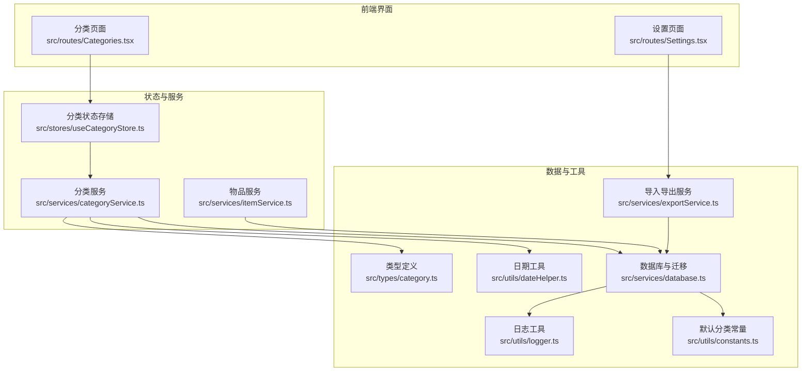
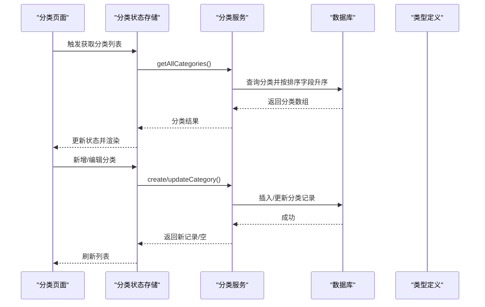
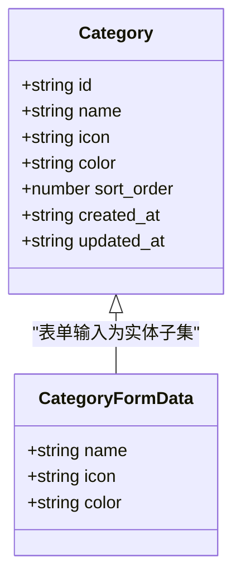
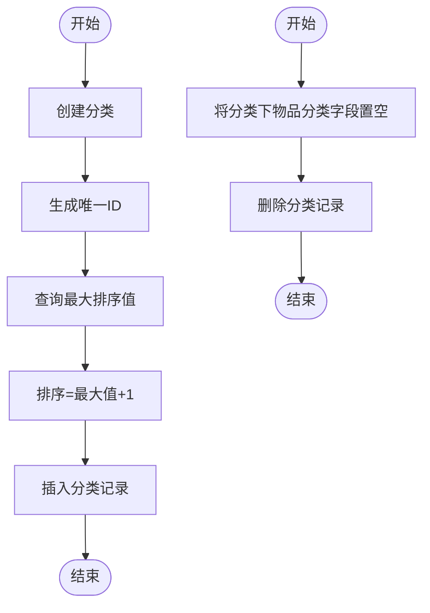
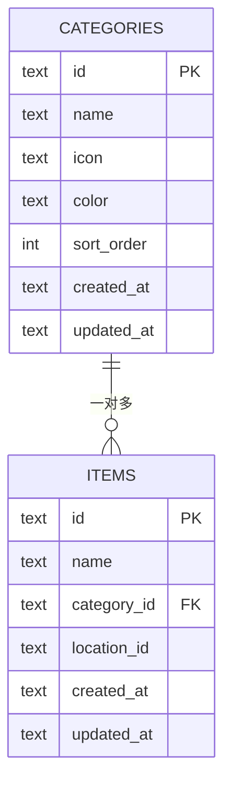
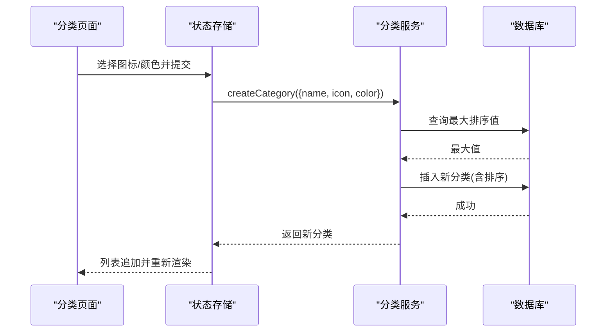
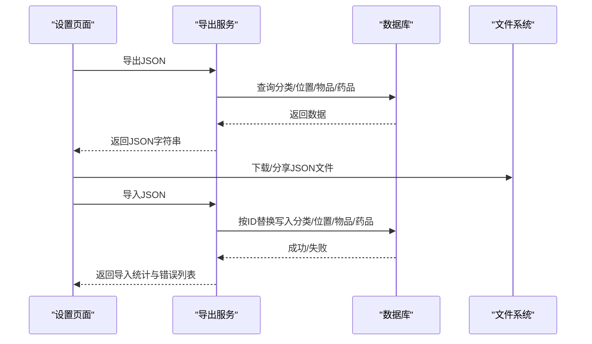
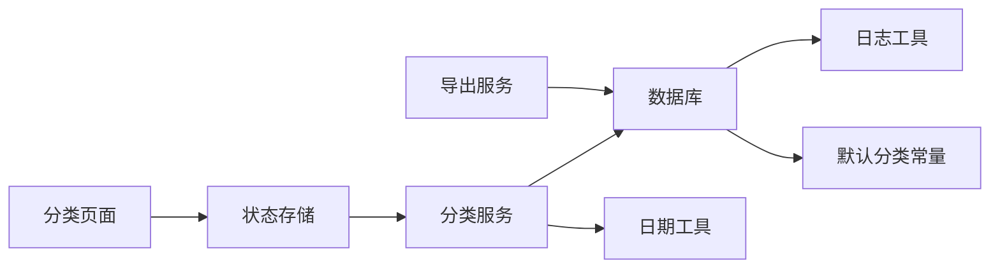

# 分类服务

<cite>
**本文档引用的文件**
- [src/types/category.ts](file://src/types/category.ts)
- [src/services/categoryService.ts](file://src/services/categoryService.ts)
- [src/stores/useCategoryStore.ts](file://src/stores/useCategoryStore.ts)
- [src/routes/Categories.tsx](file://src/routes/Categories.tsx)
- [src/services/database.ts](file://src/services/database.ts)
- [src/utils/constants.ts](file://src/utils/constants.ts)
- [src/services/exportService.ts](file://src/services/exportService.ts)
- [src/routes/Settings.tsx](file://src/routes/Settings.tsx)
- [src/services/itemService.ts](file://src/services/itemService.ts)
- [src/types/item.ts](file://src/types/item.ts)
- [src/utils/dateHelper.ts](file://src/utils/dateHelper.ts)
- [src/utils/logger.ts](file://src/utils/logger.ts)
</cite>

## 目录
1. [简介](#简介)
2. [项目结构](#项目结构)
3. [核心组件](#核心组件)
4. [架构总览](#架构总览)
5. [详细组件分析](#详细组件分析)
6. [依赖分析](#依赖分析)
7. [性能考虑](#性能考虑)
8. [故障排除指南](#故障排除指南)
9. [结论](#结论)
10. [附录](#附录)

## 简介
本文件系统性地阐述 Assetly 的分类服务，涵盖数据模型设计、CRUD 实现、树形结构与层级关系、分类与物品的一对多关联及级联删除策略、自定义配置（图标、颜色、排序）、完整的 API 接口说明、导入导出机制以及默认分类初始化流程。文档面向开发者与非技术读者，提供从高层架构到代码级细节的渐进式解读，并辅以多种可视化图表帮助理解。

## 项目结构
分类服务由前端状态层、服务层、数据库层与工具层协同构成，配合设置与导出模块实现完整的分类生命周期管理。

**图表来源**
- [src/routes/Categories.tsx:1-184](file://src/routes/Categories.tsx#L1-L184)
- [src/stores/useCategoryStore.ts:1-44](file://src/stores/useCategoryStore.ts#L1-L44)
- [src/services/categoryService.ts:1-59](file://src/services/categoryService.ts#L1-L59)
- [src/services/database.ts:1-171](file://src/services/database.ts#L1-L171)
- [src/services/exportService.ts:1-154](file://src/services/exportService.ts#L1-L154)
- [src/utils/constants.ts:1-40](file://src/utils/constants.ts#L1-L40)
- [src/utils/dateHelper.ts:1-52](file://src/utils/dateHelper.ts#L1-L52)
- [src/utils/logger.ts:1-84](file://src/utils/logger.ts#L1-L84)
- [src/services/itemService.ts:1-113](file://src/services/itemService.ts#L1-L113)

**章节来源**
- [src/routes/Categories.tsx:1-184](file://src/routes/Categories.tsx#L1-L184)
- [src/stores/useCategoryStore.ts:1-44](file://src/stores/useCategoryStore.ts#L1-L44)
- [src/services/categoryService.ts:1-59](file://src/services/categoryService.ts#L1-L59)
- [src/services/database.ts:1-171](file://src/services/database.ts#L1-L171)
- [src/services/exportService.ts:1-154](file://src/services/exportService.ts#L1-L154)
- [src/utils/constants.ts:1-40](file://src/utils/constants.ts#L1-L40)
- [src/utils/dateHelper.ts:1-52](file://src/utils/dateHelper.ts#L1-L52)
- [src/utils/logger.ts:1-84](file://src/utils/logger.ts#L1-L84)
- [src/services/itemService.ts:1-113](file://src/services/itemService.ts#L1-L113)

## 核心组件
- 数据模型：分类实体包含标识、名称、图标、颜色、排序、创建与更新时间等字段，表单输入仅包含名称、图标与颜色。
- 服务层：提供查询、创建、更新、删除、统计分类下物品数量等能力；创建时自动分配唯一 ID 与递增排序值。
- 状态层：使用 Zustand 管理分类列表与加载状态，封装 CRUD 调用并同步 UI。
- 前端界面：提供分类列表展示、新增/编辑弹窗、删除确认与批量操作入口。
- 数据库层：SQLite 存储，通过迁移脚本创建分类表并插入默认分类；支持导入导出。
- 导入导出：支持 JSON 结构化导出与 CSV 物品明细导出；导入时按 ID 替换现有记录。

**章节来源**
- [src/types/category.ts:1-18](file://src/types/category.ts#L1-L18)
- [src/services/categoryService.ts:1-59](file://src/services/categoryService.ts#L1-L59)
- [src/stores/useCategoryStore.ts:1-44](file://src/stores/useCategoryStore.ts#L1-L44)
- [src/routes/Categories.tsx:1-184](file://src/routes/Categories.tsx#L1-L184)
- [src/services/database.ts:60-171](file://src/services/database.ts#L60-L171)
- [src/services/exportService.ts:1-154](file://src/services/exportService.ts#L1-L154)
- [src/utils/constants.ts:1-40](file://src/utils/constants.ts#L1-L40)

## 架构总览
分类服务采用分层架构：UI 层负责交互与展示；状态层集中管理数据与副作用；服务层封装业务逻辑；数据库层负责持久化与迁移；工具层提供日期、日志等通用能力。

**图表来源**
- [src/routes/Categories.tsx:18-57](file://src/routes/Categories.tsx#L18-L57)
- [src/stores/useCategoryStore.ts:18-42](file://src/stores/useCategoryStore.ts#L18-L42)
- [src/services/categoryService.ts:9-42](file://src/services/categoryService.ts#L9-L42)
- [src/services/database.ts:8-16](file://src/services/database.ts#L8-L16)
- [src/types/category.ts:3-17](file://src/types/category.ts#L3-L17)

## 详细组件分析

### 数据模型与类型定义
- 分类实体字段：标识、名称、图标、颜色、排序、创建时间、更新时间。
- 表单输入：仅包含名称、图标、颜色三项，便于用户快速配置。
- 默认分类：迁移脚本中通过常量数组插入预设分类，确保首次使用即有可用分类体系。

**图表来源**
- [src/types/category.ts:3-17](file://src/types/category.ts#L3-L17)

**章节来源**
- [src/types/category.ts:1-18](file://src/types/category.ts#L1-L18)
- [src/utils/constants.ts:3-13](file://src/utils/constants.ts#L3-L13)

### CRUD 操作实现
- 获取全部：按排序字段升序返回所有分类。
- 按 ID 获取：用于编辑场景的数据回填。
- 创建：生成唯一 ID，查询最大排序值并加一作为新记录排序，同时写入创建与更新时间。
- 更新：更新名称、图标、颜色与更新时间。
- 删除：先将该分类下的物品的分类字段置为空字符串，再删除分类本身，避免悬挂引用。
- 统计数量：查询某分类下物品数量，用于删除前的提示与风险评估。

**图表来源**
- [src/services/categoryService.ts:20-49](file://src/services/categoryService.ts#L20-L49)
- [src/services/categoryService.ts:9-12](file://src/services/categoryService.ts#L9-L12)
- [src/services/categoryService.ts:14-18](file://src/services/categoryService.ts#L14-L18)
- [src/services/categoryService.ts:36-42](file://src/services/categoryService.ts#L36-L42)
- [src/services/categoryService.ts:44-49](file://src/services/categoryService.ts#L44-L49)
- [src/services/categoryService.ts:51-58](file://src/services/categoryService.ts#L51-L58)

**章节来源**
- [src/services/categoryService.ts:1-59](file://src/services/categoryService.ts#L1-L59)

### 树形结构与层级关系
- 当前分类表不包含父节点字段，因此分类本身不形成树形结构。
- 位置（Location）表具备父子关系字段，支持树形层级管理，与分类服务不同。
- 若未来需要分类树形，可在分类表增加父节点字段并在服务层扩展层级维护逻辑。

**章节来源**
- [src/services/database.ts:67-87](file://src/services/database.ts#L67-L87)

### 分类与物品的一对多关系与级联删除
- 关系：物品表包含分类 ID 字段，形成“分类 → 多个物品”的一对多关系。
- 级联策略：删除分类时，先将该分类下的物品的分类字段清空，再删除分类，从而避免物品成为“孤儿”。
- 查询：物品服务在查询时通过左连接获取分类名称、图标与颜色，以便 UI 展示。

**图表来源**
- [src/services/database.ts:67-103](file://src/services/database.ts#L67-L103)
- [src/services/itemService.ts:14-44](file://src/services/itemService.ts#L14-L44)

**章节来源**
- [src/services/categoryService.ts:44-49](file://src/services/categoryService.ts#L44-L49)
- [src/services/itemService.ts:14-44](file://src/services/itemService.ts#L14-L44)

### 自定义配置：图标、颜色与排序
- 图标与颜色：前端提供图标与颜色选项集合，用户可直接选择；服务层在创建/更新时写入对应字段。
- 排序：创建时自动计算最大排序值并加一，保证新分类排在末尾；查询时按升序排列。
- 默认分类：迁移脚本中插入预设分类，包含名称、图标、颜色与排序值，确保初始体验。

**图表来源**
- [src/routes/Categories.tsx:8-17](file://src/routes/Categories.tsx#L8-L17)
- [src/routes/Categories.tsx:49-57](file://src/routes/Categories.tsx#L49-L57)
- [src/stores/useCategoryStore.ts:24-28](file://src/stores/useCategoryStore.ts#L24-L28)
- [src/services/categoryService.ts:20-34](file://src/services/categoryService.ts#L20-L34)
- [src/services/database.ts:133-136](file://src/services/database.ts#L133-L136)

**章节来源**
- [src/routes/Categories.tsx:8-17](file://src/routes/Categories.tsx#L8-L17)
- [src/routes/Categories.tsx:49-57](file://src/routes/Categories.tsx#L49-L57)
- [src/stores/useCategoryStore.ts:24-28](file://src/stores/useCategoryStore.ts#L24-L28)
- [src/services/categoryService.ts:20-34](file://src/services/categoryService.ts#L20-L34)
- [src/utils/constants.ts:3-13](file://src/utils/constants.ts#L3-L13)

### 分类管理 API 接口文档
以下接口均基于服务层方法，遵循统一的错误处理与返回约定。

- 获取全部分类
  - 方法：GET
  - 路径：/api/categories
  - 请求参数：无
  - 返回：分类数组（按 sort_order 升序）
  - 错误：数据库查询异常时抛出错误

- 按 ID 获取分类
  - 方法：GET
  - 路径：/api/categories/:id
  - 请求参数：路径参数 id
  - 返回：分类对象或 null
  - 错误：数据库查询异常时抛出错误

- 创建分类
  - 方法：POST
  - 路径：/api/categories
  - 请求体：CategoryFormData（name, icon, color）
  - 返回：新建分类对象（包含排序、创建/更新时间）
  - 错误：插入失败时抛出错误

- 更新分类
  - 方法：PUT
  - 路径：/api/categories/:id
  - 请求体：CategoryFormData（name, icon, color）
  - 返回：无
  - 错误：更新失败时抛出错误

- 删除分类
  - 方法：DELETE
  - 路径：/api/categories/:id
  - 请求参数：路径参数 id
  - 返回：无
  - 行为：将该分类下的物品分类字段置空，再删除分类
  - 错误：删除失败时抛出错误

- 统计分类物品数量
  - 方法：GET
  - 路径：/api/categories/:id/count
  - 请求参数：路径参数 id
  - 返回：数字（该分类下物品数量）
  - 错误：查询异常时抛出错误

**章节来源**
- [src/services/categoryService.ts:9-58](file://src/services/categoryService.ts#L9-L58)

### 导入导出与默认分类初始化
- 导出
  - JSON：导出分类、位置、物品、药品四类数据，按排序与时间字段排序，便于备份与迁移。
  - CSV：导出物品明细，包含分类名称、位置全路径、有效期与药品类型等信息。
- 导入
  - JSON：解析后按 ID 进行替换式写入，确保覆盖既有记录；导入完成后刷新页面。
  - 错误处理：解析失败或部分条目导入失败时返回统计与错误列表。
- 默认分类初始化
  - 迁移脚本在首次创建分类表时，按常量数组插入默认分类，包含名称、图标、颜色与排序值。

**图表来源**
- [src/routes/Settings.tsx:23-146](file://src/routes/Settings.tsx#L23-L146)
- [src/services/exportService.ts:4-154](file://src/services/exportService.ts#L4-L154)
- [src/services/database.ts:133-136](file://src/services/database.ts#L133-L136)

**章节来源**
- [src/services/exportService.ts:1-154](file://src/services/exportService.ts#L1-L154)
- [src/routes/Settings.tsx:1-298](file://src/routes/Settings.tsx#L1-L298)
- [src/services/database.ts:133-136](file://src/services/database.ts#L133-L136)
- [src/utils/constants.ts:3-13](file://src/utils/constants.ts#L3-L13)

## 依赖分析
- 组件耦合
  - 分类页面依赖状态存储与服务层；状态存储依赖服务层；服务层依赖数据库与日期工具。
  - 导出服务独立于分类服务，但共享数据库连接与迁移机制。
- 外部依赖
  - SQLite（Tauri 插件）：本地持久化。
  - 日志插件：统一输出与内存缓存。
- 循环依赖
  - 未发现循环依赖；各层职责清晰，接口边界明确。

**图表来源**
- [src/routes/Categories.tsx:1-184](file://src/routes/Categories.tsx#L1-L184)
- [src/stores/useCategoryStore.ts:1-44](file://src/stores/useCategoryStore.ts#L1-L44)
- [src/services/categoryService.ts:1-59](file://src/services/categoryService.ts#L1-L59)
- [src/services/exportService.ts:1-154](file://src/services/exportService.ts#L1-L154)
- [src/services/database.ts:1-171](file://src/services/database.ts#L1-L171)
- [src/utils/dateHelper.ts:1-52](file://src/utils/dateHelper.ts#L1-L52)
- [src/utils/logger.ts:1-84](file://src/utils/logger.ts#L1-L84)
- [src/utils/constants.ts:1-40](file://src/utils/constants.ts#L1-L40)

**章节来源**
- [src/routes/Categories.tsx:1-184](file://src/routes/Categories.tsx#L1-L184)
- [src/stores/useCategoryStore.ts:1-44](file://src/stores/useCategoryStore.ts#L1-L44)
- [src/services/categoryService.ts:1-59](file://src/services/categoryService.ts#L1-L59)
- [src/services/exportService.ts:1-154](file://src/services/exportService.ts#L1-L154)
- [src/services/database.ts:1-171](file://src/services/database.ts#L1-L171)
- [src/utils/dateHelper.ts:1-52](file://src/utils/dateHelper.ts#L1-L52)
- [src/utils/logger.ts:1-84](file://src/utils/logger.ts#L1-L84)
- [src/utils/constants.ts:1-40](file://src/utils/constants.ts#L1-L40)

## 性能考虑
- 查询优化：分类列表按排序字段升序返回，避免 UI 再次排序；物品查询通过索引与条件拼接减少全表扫描。
- 写入优化：创建分类时一次性计算排序值，避免多次往返；导入时批量写入并按 ID 替换，减少冲突。
- 索引策略：数据库迁移中为关键字段建立索引，提升查询效率。
- 建议：若未来引入分类树形，建议在父节点与排序字段上建立复合索引以优化层级查询。

[本节为通用性能讨论，无需具体文件分析]

## 故障排除指南
- 数据库连接失败
  - 现象：应用启动时报数据库连接错误。
  - 排查：检查数据库插件是否正确加载、数据库文件是否存在、迁移是否成功执行。
  - 参考：数据库连接与迁移日志输出。
- 迁移执行失败
  - 现象：迁移 SQL 报错，应用无法启动。
  - 排查：查看日志中迁移 SQL 片段与错误信息，修正语法或兼容性问题。
- 导入失败
  - 现象：导入 JSON 后部分记录未生效或报错。
  - 排查：确认 JSON 格式正确；查看返回的错误列表定位失败项；确保 ID 唯一性。
- 删除分类提示风险
  - 现象：删除前显示物品数量提示。
  - 处理：确认删除后物品将归入“未分类”，必要时先调整物品分类。

**章节来源**
- [src/services/database.ts:18-53](file://src/services/database.ts#L18-L53)
- [src/utils/logger.ts:57-84](file://src/utils/logger.ts#L57-L84)
- [src/services/exportService.ts:53-154](file://src/services/exportService.ts#L53-L154)
- [src/routes/Categories.tsx:36-47](file://src/routes/Categories.tsx#L36-L47)

## 结论
分类服务通过清晰的分层设计与完善的生命周期管理，实现了从数据模型、CRUD、关联关系到导入导出与默认初始化的完整闭环。其简洁的 UI 配置与稳健的数据库策略，既满足了日常使用需求，也为未来的树形分类扩展预留了空间。建议在后续迭代中关注查询性能与树形结构的索引优化，并持续完善错误日志与用户反馈机制。

[本节为总结性内容，无需具体文件分析]

## 附录
- 默认分类清单（迁移脚本中预设）
  - 电子产品、家具家电、厨房用品、衣物鞋包、书籍文具、药品保健、工具耗材、其他
- 支持的图标与颜色选项（前端提供）
  - 图标：Smartphone、Sofa、CookingPot、Shirt、BookOpen、Pill、Wrench、Package、Camera、Headphones、Watch、Car
  - 颜色：多种主题色预设

**章节来源**
- [src/utils/constants.ts:3-13](file://src/utils/constants.ts#L3-L13)
- [src/routes/Categories.tsx:8-9](file://src/routes/Categories.tsx#L8-L9)