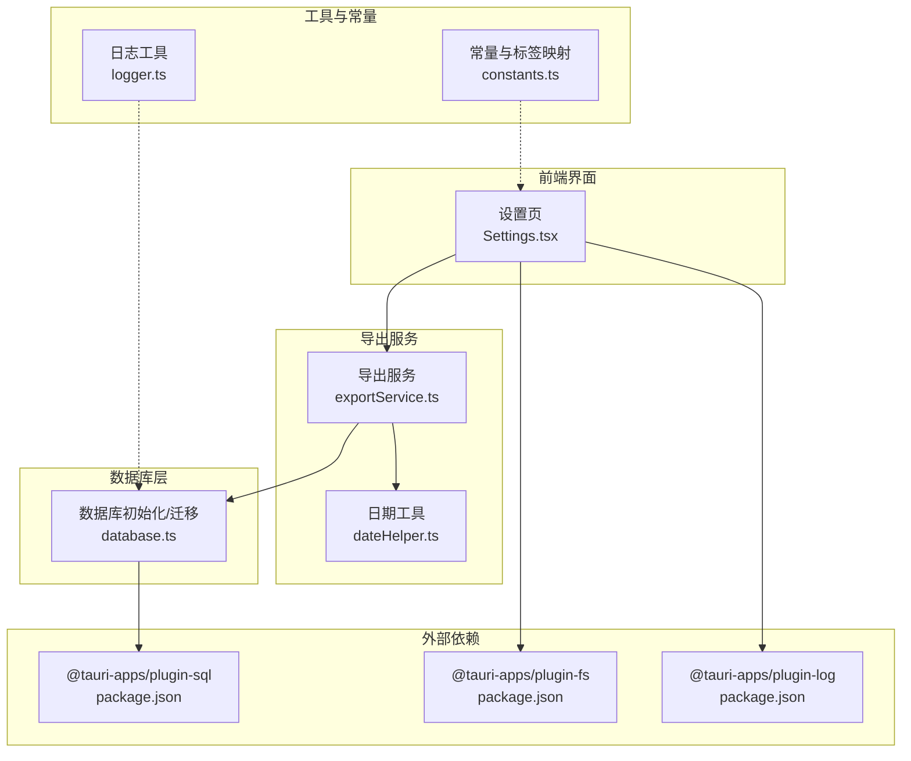
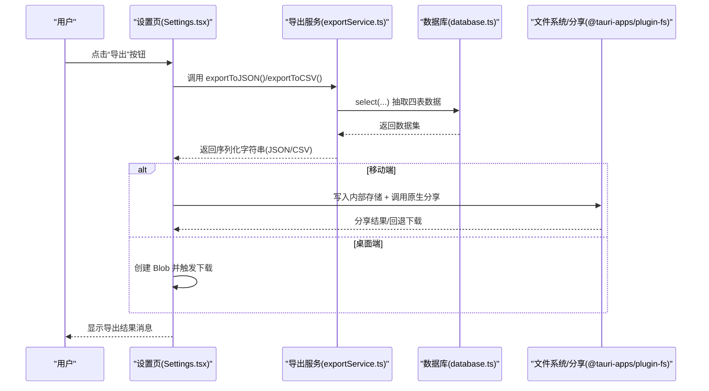
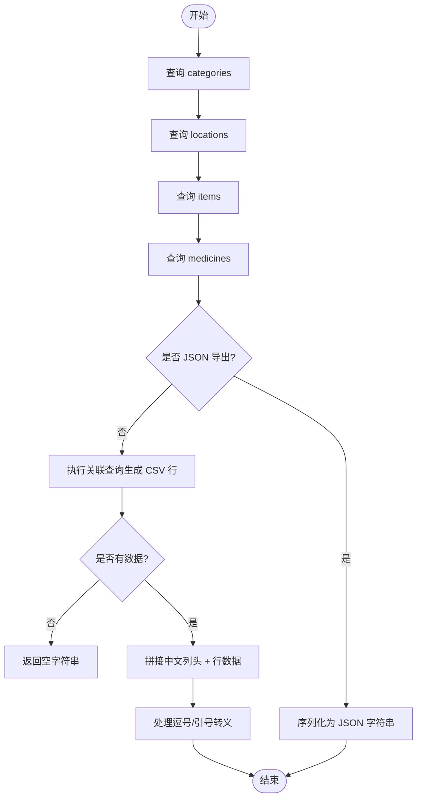
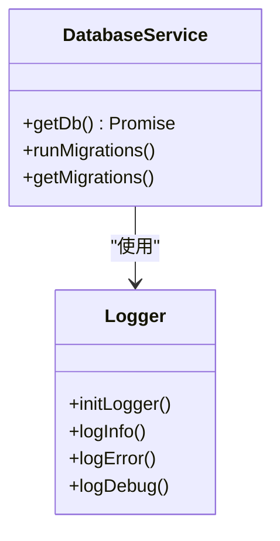
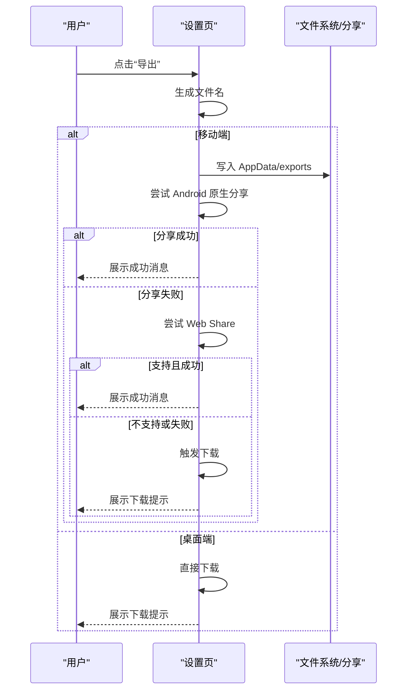
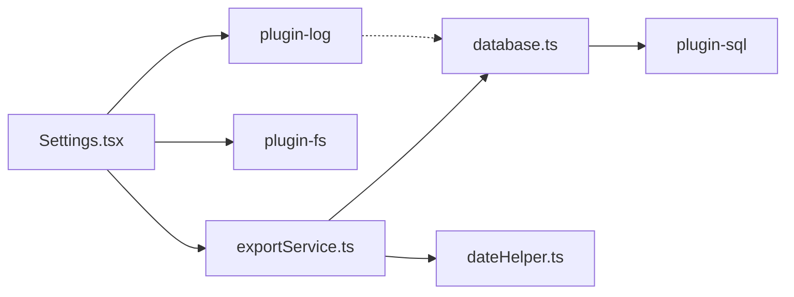

# 导出服务

<cite>
**本文引用的文件**
- [exportService.ts](file://src/services/exportService.ts)
- [database.ts](file://src/services/database.ts)
- [dateHelper.ts](file://src/utils/dateHelper.ts)
- [Settings.tsx](file://src/routes/Settings.tsx)
- [constants.ts](file://src/utils/constants.ts)
- [logger.ts](file://src/utils/logger.ts)
- [package.json](file://package.json)
</cite>

## 目录
1. [简介](#简介)
2. [项目结构](#项目结构)
3. [核心组件](#核心组件)
4. [架构总览](#架构总览)
5. [详细组件分析](#详细组件分析)
6. [依赖关系分析](#依赖关系分析)
7. [性能与可扩展性](#性能与可扩展性)
8. [故障排查指南](#故障排查指南)
9. [结论](#结论)
10. [附录：导出 API 接口规范](#附录导出-api-接口规范)

## 简介
本文件系统化梳理 Assetly 的数据导出能力，覆盖从数据库抽取、格式转换到文件生成的完整流程；说明当前支持的导出格式（JSON、CSV）及其实现细节；阐述导出过程中的安全机制（如敏感信息过滤与权限控制现状）；给出大文件导出的优化策略建议（分块、进度与内存管理）；并提供导出 API 的接口规范与最佳实践。

## 项目结构
导出服务主要由以下模块组成：
- 导出服务层：负责从数据库抽取数据并序列化为指定格式
- 数据库访问层：封装 SQLite 连接、迁移与查询执行
- 工具与常量：提供时间格式化、标签映射等辅助能力
- 前端路由与界面：提供导出触发、消息反馈与文件下载/分享
- 日志与依赖：统一日志输出与第三方插件依赖

**图表来源**
- [Settings.tsx:1-298](file://src/routes/Settings.tsx#L1-L298)
- [exportService.ts:1-154](file://src/services/exportService.ts#L1-L154)
- [database.ts:1-171](file://src/services/database.ts#L1-L171)
- [dateHelper.ts:1-52](file://src/utils/dateHelper.ts#L1-L52)
- [constants.ts:1-40](file://src/utils/constants.ts#L1-L40)
- [logger.ts:1-84](file://src/utils/logger.ts#L1-L84)
- [package.json:1-43](file://package.json#L1-L43)

**章节来源**
- [Settings.tsx:1-298](file://src/routes/Settings.tsx#L1-L298)
- [exportService.ts:1-154](file://src/services/exportService.ts#L1-L154)
- [database.ts:1-171](file://src/services/database.ts#L1-L171)
- [dateHelper.ts:1-52](file://src/utils/dateHelper.ts#L1-L52)
- [constants.ts:1-40](file://src/utils/constants.ts#L1-L40)
- [logger.ts:1-84](file://src/utils/logger.ts#L1-L84)
- [package.json:1-43](file://package.json#L1-L43)

## 核心组件
- 导出服务（exportService.ts）
  - 提供 JSON 导出：聚合 categories、locations、items、medicines 四张表
  - 提供 CSV 导出：按物品主表与关联表拼接字段，输出中文列头
  - 提供 JSON 导入：按表逐条写入，使用 INSERT OR REPLACE，带错误计数与错误列表
- 数据库服务（database.ts）
  - 单例连接与迁移：自动创建表、索引与默认数据
  - 查询与执行：select/execute 封装
- 前端设置页（Settings.tsx）
  - 触发导出、生成文件名、移动端分享/下载、桌面端直接下载
  - 导入前确认、导入后刷新页面
- 工具与常量（dateHelper.ts、constants.ts）
  - 时间格式化、当前时间戳、标签映射（状态、类型）

**章节来源**
- [exportService.ts:1-154](file://src/services/exportService.ts#L1-L154)
- [database.ts:1-171](file://src/services/database.ts#L1-L171)
- [Settings.tsx:1-298](file://src/routes/Settings.tsx#L1-L298)
- [dateHelper.ts:1-52](file://src/utils/dateHelper.ts#L1-L52)
- [constants.ts:1-40](file://src/utils/constants.ts#L1-L40)

## 架构总览
导出流程从界面触发，调用导出服务，通过数据库服务读取数据，再根据目标格式进行序列化，最终在浏览器或移动端平台完成下载或分享。

**图表来源**
- [Settings.tsx:23-93](file://src/routes/Settings.tsx#L23-L93)
- [exportService.ts:4-44](file://src/services/exportService.ts#L4-L44)
- [database.ts:8-16](file://src/services/database.ts#L8-L16)
- [package.json:12-31](file://package.json#L12-L31)

## 详细组件分析

### 导出服务（exportService.ts）
- JSON 导出
  - 顺序查询四表并组装为对象返回
  - 使用时间戳作为默认值填充（来自日期工具）
- CSV 导出
  - 关联查询物品、分类、位置，并按需拼接药品有效期与类型
  - 输出中文列头，逗号与双引号转义处理
- JSON 导入
  - 解析 JSON 后按表循环插入，INSERT OR REPLACE 保证幂等
  - 统计成功/失败条目与错误列表，异常捕获并记录

**图表来源**
- [exportService.ts:4-44](file://src/services/exportService.ts#L4-L44)
- [dateHelper.ts:14-16](file://src/utils/dateHelper.ts#L14-L16)

**章节来源**
- [exportService.ts:1-154](file://src/services/exportService.ts#L1-L154)
- [dateHelper.ts:14-16](file://src/utils/dateHelper.ts#L14-L16)

### 数据库服务（database.ts）
- 初始化与迁移
  - 单例连接、迁移版本管理、失败回滚与日志记录
  - 自动创建表、索引与默认数据（含默认分类）
- 查询与执行
  - select/execute 封装，供导出服务调用

**图表来源**
- [database.ts:8-53](file://src/services/database.ts#L8-L53)
- [logger.ts:7-25](file://src/utils/logger.ts#L7-L25)

**章节来源**
- [database.ts:1-171](file://src/services/database.ts#L1-L171)
- [logger.ts:1-84](file://src/utils/logger.ts#L1-L84)

### 前端设置页（Settings.tsx）
- 导出流程
  - 生成文件名（日期），移动端优先尝试原生分享，失败则回退 Web Share 或下载
  - 桌面端直接下载
- 导入流程
  - 选择文件 -> 读取文本 -> 确认对话框 -> 调用导入函数 -> 刷新页面

**图表来源**
- [Settings.tsx:23-106](file://src/routes/Settings.tsx#L23-L106)
- [package.json:16-19](file://package.json#L16-L19)

**章节来源**
- [Settings.tsx:1-298](file://src/routes/Settings.tsx#L1-L298)

### 工具与常量
- 日期工具：提供 ISO 时间戳、格式化、到期状态计算等
- 常量：默认分类、标签映射、主题色与货币符号

**章节来源**
- [dateHelper.ts:1-52](file://src/utils/dateHelper.ts#L1-L52)
- [constants.ts:1-40](file://src/utils/constants.ts#L1-L40)

## 依赖关系分析
- 导出服务依赖数据库服务进行数据抽取
- 设置页依赖导出服务与文件系统/分享插件
- 日志工具贯穿数据库初始化与迁移过程
- 第三方插件：@tauri-apps/plugin-sql（数据库）、@tauri-apps/plugin-fs（文件写入）、@tauri-apps/plugin-log（日志）

**图表来源**
- [exportService.ts:1-2](file://src/services/exportService.ts#L1-L2)
- [database.ts:1-4](file://src/services/database.ts#L1-L4)
- [Settings.tsx:8-19](file://src/routes/Settings.tsx#L8-L19)
- [package.json:15-20](file://package.json#L15-L20)

**章节来源**
- [exportService.ts:1-154](file://src/services/exportService.ts#L1-L154)
- [database.ts:1-171](file://src/services/database.ts#L1-L171)
- [Settings.tsx:1-298](file://src/routes/Settings.tsx#L1-L298)
- [package.json:1-43](file://package.json#L1-L43)

## 性能与可扩展性
- 当前实现
  - 导出一次性拉取全量数据，内存占用与序列化开销随数据规模线性增长
  - CSV 导出未做分块，JSON 导出同样未分块
- 优化建议（针对大体量数据）
  - 分块导出：按主键范围分批查询，边查边写入流式输出
  - 进度跟踪：在 UI 层展示已处理行数/总行数
  - 内存管理：避免一次性构建超大字符串，改用流式写入或分段生成
  - 并发导入：导入时按表分组并发写入，但注意事务边界与冲突处理
  - 增加导出模板：允许用户选择字段集合与排序规则，减少无关数据传输
  - 批量导出：多格式并行导出（如 JSON + CSV），利用 CPU 并行能力

[本节为通用性能讨论，不直接分析具体文件，故无“章节来源”]

## 故障排查指南
- 导出失败
  - 检查数据库连接与迁移是否成功
  - 查看日志插件输出，定位 SQL 执行异常
- 导入失败
  - JSON 格式错误会直接返回错误列表
  - 部分记录写入失败不影响整体导入，查看错误计数与错误详情
- 移动端分享失败
  - 若原生分享不可用，回退至 Web Share 或本地下载
  - 确认文件写入路径与权限

**章节来源**
- [exportService.ts:53-153](file://src/services/exportService.ts#L53-L153)
- [database.ts:18-53](file://src/services/database.ts#L18-L53)
- [logger.ts:57-75](file://src/utils/logger.ts#L57-L75)
- [Settings.tsx:30-93](file://src/routes/Settings.tsx#L30-L93)

## 结论
Assetly 的导出服务以简洁的 SQL 查询与序列化为核心，当前支持 JSON 与 CSV 两种格式，移动端具备分享与下载双重回退路径。建议在数据量增大时引入分块、进度与流式写入等优化手段，并考虑增加导出模板与并发导入能力，以进一步提升用户体验与系统可扩展性。

[本节为总结性内容，不直接分析具体文件，故无“章节来源”]

## 附录：导出 API 接口规范

- 导出接口
  - exportToJSON()
    - 功能：导出全部数据为 JSON 字符串
    - 输入：无
    - 输出：字符串（JSON）
    - 适用场景：备份、跨设备恢复
  - exportToCSV()
    - 功能：导出物品明细为 CSV 字符串
    - 输入：无
    - 输出：字符串（CSV，中文列头）
    - 适用场景：表格软件导入、审计与统计

- 导入接口
  - importFromJSON(jsonStr)
    - 功能：从 JSON 文本恢复数据
    - 输入：字符串（JSON）
    - 输出：对象（success/fail/errors）
    - 适用场景：恢复备份、批量迁移

- 安全与权限
  - 当前实现未内置敏感信息过滤与细粒度权限校验
  - 建议：在导出前对敏感字段进行脱敏处理；在导入前进行结构校验与白名单控制

- 大文件优化建议
  - 分块导出：按主键范围分批查询与写入
  - 流式输出：避免一次性构建超大字符串
  - 进度上报：在 UI 展示导出进度
  - 并发导入：按表并发写入，注意事务与冲突

- 参考实现位置
  - 导出服务：[exportService.ts:4-44](file://src/services/exportService.ts#L4-L44)
  - 导入服务：[exportService.ts:53-153](file://src/services/exportService.ts#L53-L153)
  - 数据库初始化与迁移：[database.ts:8-53](file://src/services/database.ts#L8-L53)
  - 前端导出触发与下载：[Settings.tsx:23-106](file://src/routes/Settings.tsx#L23-L106)

**章节来源**
- [exportService.ts:4-44](file://src/services/exportService.ts#L4-L44)
- [exportService.ts:53-153](file://src/services/exportService.ts#L53-L153)
- [database.ts:8-53](file://src/services/database.ts#L8-L53)
- [Settings.tsx:23-106](file://src/routes/Settings.tsx#L23-L106)