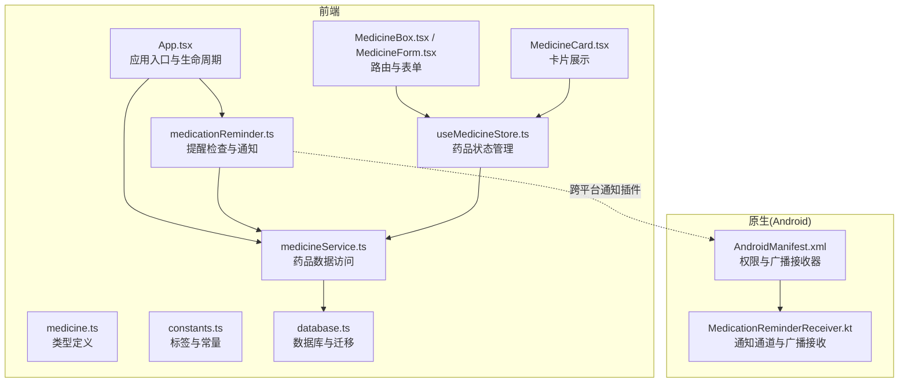
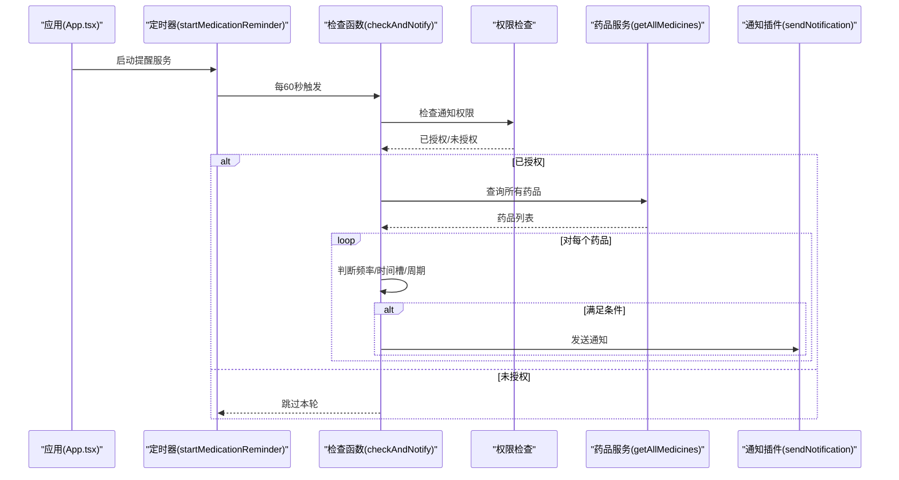
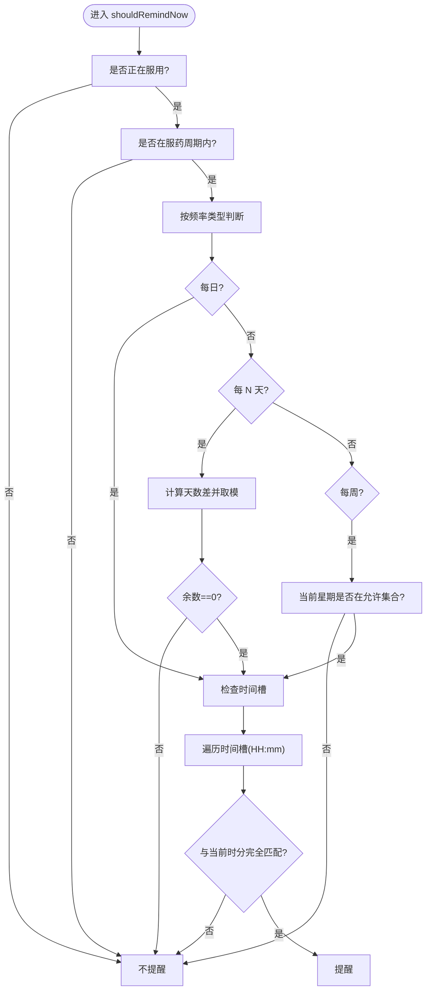
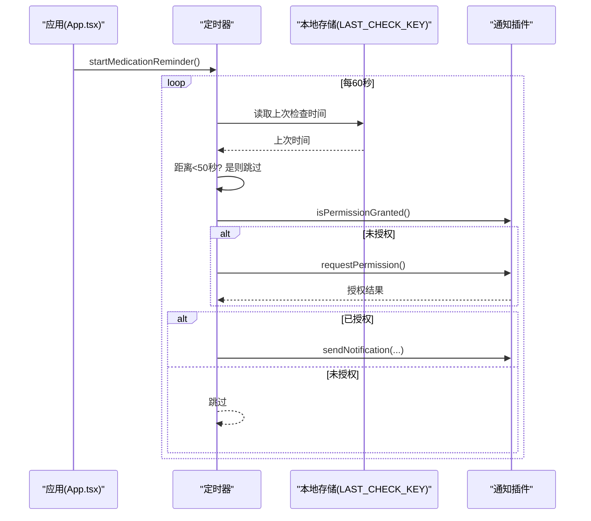
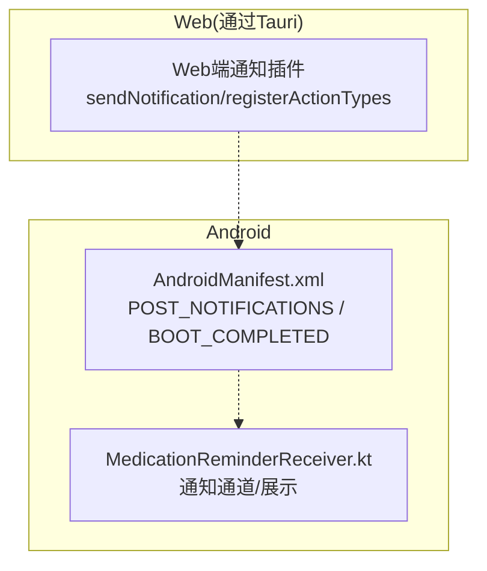
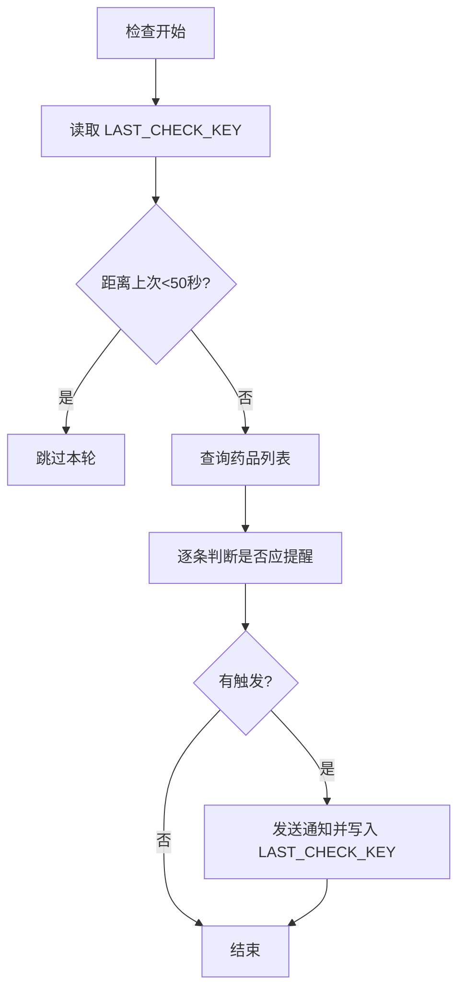
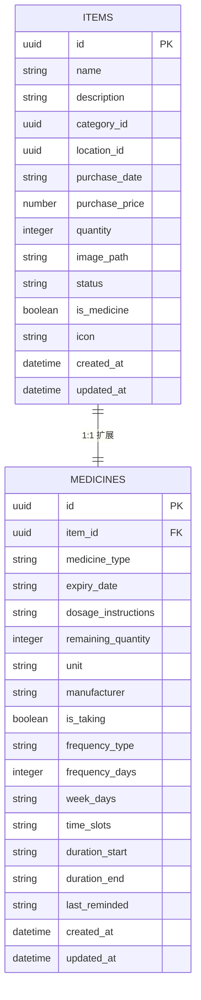
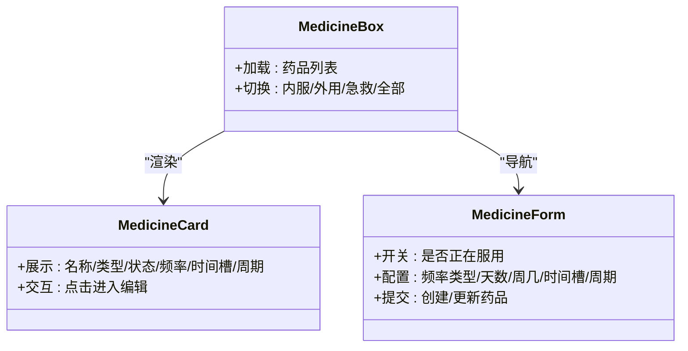
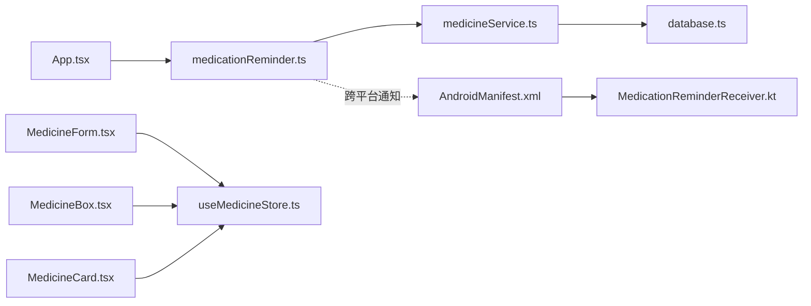

# 提醒服务

<cite>
**本文引用的文件**
- [medicationReminder.ts](file://src/services/medicationReminder.ts)
- [medicine.ts](file://src/types/medicine.ts)
- [useMedicineStore.ts](file://src/stores/useMedicineStore.ts)
- [MedicineBox.tsx](file://src/routes/MedicineBox.tsx)
- [MedicineCard.tsx](file://src/components/medicine/MedicineCard.tsx)
- [MedicineForm.tsx](file://src/routes/MedicineForm.tsx)
- [medicineService.ts](file://src/services/medicineService.ts)
- [constants.ts](file://src/utils/constants.ts)
- [database.ts](file://src/services/database.ts)
- [App.tsx](file://src/App.tsx)
- [AndroidManifest.xml](file://src-tauri/gen/android/app/src/main/AndroidManifest.xml)
- [MedicationReminderReceiver.kt](file://src-tauri/gen/android/app/src/main/java/com/assetly/home/MedicationReminderReceiver.kt)
</cite>

## 目录
1. [简介](#简介)
2. [项目结构](#项目结构)
3. [核心组件](#核心组件)
4. [架构总览](#架构总览)
5. [详细组件分析](#详细组件分析)
6. [依赖关系分析](#依赖关系分析)
7. [性能考量](#性能考量)
8. [故障排查指南](#故障排查指南)
9. [结论](#结论)
10. [附录：API 接口规范](#附录api-接口规范)

## 简介
本文件面向 Assetly 的“提醒服务”，聚焦于“用药提醒”子系统，系统性阐述以下内容：
- 提醒规则配置：频率类型（每日、每 N 天、每周）、时间槽（多个时间段）、服药周期（起止日期）与开关控制
- 触发机制：权限检查、定时轮询、重复防护、通知发送
- 通知推送：跨平台实现（Web 与 Android），含动作按钮（已服用/稍后提醒）
- 提醒历史记录：基于本地存储的最近检查时间戳，用于避免重复提醒
- API 接口：对提醒配置、状态查询与历史记录获取的前端调用路径与数据模型
- 跨平台差异与系统集成：Android 广播接收器与通知通道、权限声明与前台服务支持

## 项目结构
提醒服务横跨前端与 Tauri 原生层，主要涉及：
- 前端服务层：提醒逻辑、药品数据访问、状态管理与 UI 路由
- 数据层：SQLite 数据库与迁移脚本
- 原生层（Android）：通知通道与广播接收器

**图表来源**
- [App.tsx:15-27](file://src/App.tsx#L15-L27)
- [medicationReminder.ts:53-97](file://src/services/medicationReminder.ts#L53-L97)
- [medicineService.ts:10-37](file://src/services/medicineService.ts#L10-L37)
- [useMedicineStore.ts:15-41](file://src/stores/useMedicineStore.ts#L15-L41)
- [MedicineBox.tsx:18-29](file://src/routes/MedicineBox.tsx#L18-L29)
- [MedicineCard.tsx:14-47](file://src/components/medicine/MedicineCard.tsx#L14-L47)
- [MedicineForm.tsx:33-64](file://src/routes/MedicineForm.tsx#L33-L64)
- [database.ts:8-53](file://src/services/database.ts#L8-L53)
- [AndroidManifest.xml:42-46](file://src-tauri/gen/android/app/src/main/AndroidManifest.xml#L42-L46)
- [MedicationReminderReceiver.kt:12-26](file://src-tauri/gen/android/app/src/main/java/com/assetly/home/MedicationReminderReceiver.kt#L12-L26)

**章节来源**
- [App.tsx:15-27](file://src/App.tsx#L15-L27)
- [medicationReminder.ts:53-97](file://src/services/medicationReminder.ts#L53-L97)
- [medicineService.ts:10-37](file://src/services/medicineService.ts#L10-L37)
- [useMedicineStore.ts:15-41](file://src/stores/useMedicineStore.ts#L15-L41)
- [MedicineBox.tsx:18-29](file://src/routes/MedicineBox.tsx#L18-L29)
- [MedicineCard.tsx:14-47](file://src/components/medicine/MedicineCard.tsx#L14-L47)
- [MedicineForm.tsx:33-64](file://src/routes/MedicineForm.tsx#L33-L64)
- [database.ts:8-53](file://src/services/database.ts#L8-L53)
- [AndroidManifest.xml:42-46](file://src-tauri/gen/android/app/src/main/AndroidManifest.xml#L42-L46)
- [MedicationReminderReceiver.kt:12-26](file://src-tauri/gen/android/app/src/main/java/com/assetly/home/MedicationReminderReceiver.kt#L12-L26)

## 核心组件
- 提醒服务模块：负责权限检查、定时轮询、规则判断与通知发送
- 药品服务模块：提供药品列表查询、创建与更新，承载提醒字段
- 类型定义：统一提醒字段的数据结构与枚举
- 存储与路由：Zustand 状态管理与页面路由联动
- 数据库与迁移：SQLite 表结构与迁移脚本，确保提醒字段存在
- Android 集成：通知通道与广播接收器，支撑原生通知

**章节来源**
- [medicationReminder.ts:53-97](file://src/services/medicationReminder.ts#L53-L97)
- [medicineService.ts:10-37](file://src/services/medicineService.ts#L10-L37)
- [medicine.ts:7-27](file://src/types/medicine.ts#L7-L27)
- [useMedicineStore.ts:15-41](file://src/stores/useMedicineStore.ts#L15-L41)
- [database.ts:104-159](file://src/services/database.ts#L104-L159)
- [MedicationReminderReceiver.kt:12-26](file://src-tauri/gen/android/app/src/main/java/com/assetly/home/MedicationReminderReceiver.kt#L12-L26)

## 架构总览
提醒服务采用“前端定时轮询 + 原生通知通道”的混合架构：
- 前端应用启动时注册定时器，每分钟检查一次
- 若具备通知权限且满足提醒条件，则通过通知插件发送通知
- Android 平台同时具备广播接收器，用于系统级通知通道与展示

**图表来源**
- [App.tsx:15-27](file://src/App.tsx#L15-L27)
- [medicationReminder.ts:102-131](file://src/services/medicationReminder.ts#L102-L131)
- [medicationReminder.ts:53-97](file://src/services/medicationReminder.ts#L53-L97)
- [medicineService.ts:10-37](file://src/services/medicineService.ts#L10-L37)

## 详细组件分析

### 提醒规则配置与触发机制
- 频率类型
  - 每日：直接满足条件
  - 每 N 天：从服药周期起始或创建时间计算天数差，取模判断
  - 每周：根据周几集合判断当天是否允许提醒
- 时间槽：逗号分隔的“HH:mm”字符串，仅当当前小时与分钟与任一时间槽完全匹配才触发
- 服药周期：起始/结束日期限制提醒生效范围
- 开关与状态：仅当“正在服用”为真时参与提醒判断；最近提醒时间字段存在于类型定义但当前未被使用

**图表来源**
- [medicationReminder.ts:11-48](file://src/services/medicationReminder.ts#L11-L48)
- [medicine.ts:17-26](file://src/types/medicine.ts#L17-L26)

**章节来源**
- [medicationReminder.ts:11-48](file://src/services/medicationReminder.ts#L11-L48)
- [medicine.ts:17-26](file://src/types/medicine.ts#L17-L26)

### 定时轮询与通知发送
- 启动流程：应用启动时注册定时器，每分钟执行一次检查
- 权限策略：若未授权，尝试请求权限；未授权则跳过本轮
- 重复防护：使用本地存储记录上次检查时间，若距离小于约 50 秒则跳过
- 通知动作：注册“已服用/稍后提醒”动作类型，便于用户快速响应
- 通知内容：标题固定为“用药提醒”，正文包含药品名称

**图表来源**
- [App.tsx:15-27](file://src/App.tsx#L15-L27)
- [medicationReminder.ts:53-97](file://src/services/medicationReminder.ts#L53-L97)
- [medicationReminder.ts:102-131](file://src/services/medicationReminder.ts#L102-L131)

**章节来源**
- [App.tsx:15-27](file://src/App.tsx#L15-L27)
- [medicationReminder.ts:53-97](file://src/services/medicationReminder.ts#L53-L97)
- [medicationReminder.ts:102-131](file://src/services/medicationReminder.ts#L102-L131)

### 跨平台实现与系统集成
- Web 平台：通过 Tauri 通知插件发送系统通知，支持注册动作类型
- Android 平台：声明通知权限与广播接收器；在清单中注册“MedicationReminderReceiver”
- 通知通道：广播接收器创建通知通道并展示通知，具备振动与点击跳转能力

**图表来源**
- [AndroidManifest.xml:6-8](file://src-tauri/gen/android/app/src/main/AndroidManifest.xml#L6-L8)
- [AndroidManifest.xml:42-46](file://src-tauri/gen/android/app/src/main/AndroidManifest.xml#L42-L46)
- [MedicationReminderReceiver.kt:12-26](file://src-tauri/gen/android/app/src/main/java/com/assetly/home/MedicationReminderReceiver.kt#L12-L26)
- [medicationReminder.ts:105-119](file://src/services/medicationReminder.ts#L105-L119)

**章节来源**
- [AndroidManifest.xml:6-8](file://src-tauri/gen/android/app/src/main/AndroidManifest.xml#L6-L8)
- [AndroidManifest.xml:42-46](file://src-tauri/gen/android/app/src/main/AndroidManifest.xml#L42-L46)
- [MedicationReminderReceiver.kt:12-26](file://src-tauri/gen/android/app/src/main/java/com/assetly/home/MedicationReminderReceiver.kt#L12-L26)
- [medicationReminder.ts:105-119](file://src/services/medicationReminder.ts#L105-L119)

### 提醒历史记录与统计
- 历史记录：使用本地存储键值记录最近一次检查时间，用于避免同一分钟内的重复提醒
- 统计维度：当前未提供专门的统计接口，但可基于数据库查询扩展（例如按天/周/月汇总提醒次数）

**图表来源**
- [medicationReminder.ts:68-93](file://src/services/medicationReminder.ts#L68-L93)

**章节来源**
- [medicationReminder.ts:68-93](file://src/services/medicationReminder.ts#L68-L93)

### 数据模型与数据库迁移
- 药品扩展表（medicines）新增提醒相关字段：频率类型、频率天数、周几集合、时间槽、周期起止、最近提醒时间
- 迁移脚本确保字段存在，避免因旧版本数据库导致功能缺失

**图表来源**
- [database.ts:104-159](file://src/services/database.ts#L104-L159)
- [medicine.ts:7-27](file://src/types/medicine.ts#L7-L27)

**章节来源**
- [database.ts:104-159](file://src/services/database.ts#L104-L159)
- [medicine.ts:7-27](file://src/types/medicine.ts#L7-L27)

### UI 展示与配置入口
- 药品卡片：展示“正在服用”状态、“频率显示”（每日/每 N 天/每周）与“时间槽显示”、“周期显示”
- 药品表单：提供“是否正在服用”开关与频率配置、时间槽增删改、周期起止日期选择
- 药品列表页：加载与筛选药品，联动提醒状态展示

**图表来源**
- [MedicineCard.tsx:14-47](file://src/components/medicine/MedicineCard.tsx#L14-L47)
- [MedicineForm.tsx:33-64](file://src/routes/MedicineForm.tsx#L33-L64)
- [MedicineBox.tsx:18-29](file://src/routes/MedicineBox.tsx#L18-L29)

**章节来源**
- [MedicineCard.tsx:14-47](file://src/components/medicine/MedicineCard.tsx#L14-L47)
- [MedicineForm.tsx:33-64](file://src/routes/MedicineForm.tsx#L33-L64)
- [MedicineBox.tsx:18-29](file://src/routes/MedicineBox.tsx#L18-L29)

## 依赖关系分析
- 应用入口依赖提醒服务：启动时注册定时器，卸载时清理
- 提醒服务依赖药品服务：查询药品列表
- 药品服务依赖数据库：提供 CRUD 与查询
- UI 路由与状态管理：驱动数据变更与视图刷新
- Android 清单与广播接收器：提供原生通知通道

**图表来源**
- [App.tsx:15-27](file://src/App.tsx#L15-L27)
- [medicationReminder.ts:53-97](file://src/services/medicationReminder.ts#L53-L97)
- [medicineService.ts:10-37](file://src/services/medicineService.ts#L10-L37)
- [database.ts:8-53](file://src/services/database.ts#L8-L53)
- [MedicineForm.tsx:33-64](file://src/routes/MedicineForm.tsx#L33-L64)
- [MedicineBox.tsx:18-29](file://src/routes/MedicineBox.tsx#L18-L29)
- [MedicineCard.tsx:14-47](file://src/components/medicine/MedicineCard.tsx#L14-L47)
- [AndroidManifest.xml:42-46](file://src-tauri/gen/android/app/src/main/AndroidManifest.xml#L42-L46)
- [MedicationReminderReceiver.kt:12-26](file://src-tauri/gen/android/app/src/main/java/com/assetly/home/MedicationReminderReceiver.kt#L12-L26)

**章节来源**
- [App.tsx:15-27](file://src/App.tsx#L15-L27)
- [medicationReminder.ts:53-97](file://src/services/medicationReminder.ts#L53-L97)
- [medicineService.ts:10-37](file://src/services/medicineService.ts#L10-L37)
- [database.ts:8-53](file://src/services/database.ts#L8-L53)
- [MedicineForm.tsx:33-64](file://src/routes/MedicineForm.tsx#L33-L64)
- [MedicineBox.tsx:18-29](file://src/routes/MedicineBox.tsx#L18-L29)
- [MedicineCard.tsx:14-47](file://src/components/medicine/MedicineCard.tsx#L14-L47)
- [AndroidManifest.xml:42-46](file://src-tauri/gen/android/app/src/main/AndroidManifest.xml#L42-L46)
- [MedicationReminderReceiver.kt:12-26](file://src-tauri/gen/android/app/src/main/java/com/assetly/home/MedicationReminderReceiver.kt#L12-L26)

## 性能考量
- 轮询频率：每分钟一次，兼顾实时性与资源消耗
- 重复防护：本地去重减少重复通知与数据库压力
- 查询优化：数据库对关键字段建立索引，提升药品查询效率
- 前台服务建议：Android 可考虑前台服务以提升稳定性与系统可见性（当前清单包含前台服务权限声明）

[本节为通用指导，无需特定文件来源]

## 故障排查指南
- 无提醒通知
  - 检查通知权限是否已授权；若未授权，尝试重新请求
  - 确认药品“正在服用”开关已开启
  - 核对频率类型与时间槽配置是否正确
  - 查看本地存储中的最近检查时间是否过于频繁导致被跳过
- Android 无通知
  - 确认清单中已声明通知权限与广播接收器
  - 检查通知通道是否创建成功
  - 验证应用未处于电池优化白名单之外导致进程被限制
- 数据异常
  - 检查数据库迁移是否完成，确认提醒相关字段存在
  - 使用药品服务查询接口验证数据一致性

**章节来源**
- [medicationReminder.ts:53-97](file://src/services/medicationReminder.ts#L53-L97)
- [medicationReminder.ts:105-119](file://src/services/medicationReminder.ts#L105-L119)
- [AndroidManifest.xml:6-8](file://src-tauri/gen/android/app/src/main/AndroidManifest.xml#L6-L8)
- [MedicationReminderReceiver.kt:28-43](file://src-tauri/gen/android/app/src/main/java/com/assetly/home/MedicationReminderReceiver.kt#L28-L43)
- [database.ts:104-159](file://src/services/database.ts#L104-L159)

## 结论
Assetly 的提醒服务以简洁可靠的前端定时轮询为核心，结合 SQLite 数据持久化与 Tauri 通知插件，实现了跨平台的用药提醒能力。通过清晰的频率与时间槽配置、严格的周期边界控制以及本地去重策略，系统在易用性与稳定性之间取得平衡。后续可在统计分析、历史记录追踪与 Android 前台服务方面进一步增强。

[本节为总结性内容，无需特定文件来源]

## 附录API 接口规范

### 数据模型
- 药品（扩展）字段（提醒相关）
  - is_taking: 是否正在服用（布尔）
  - frequency_type: 频率类型（daily/every_n_days/weekly）
  - frequency_days: 每 N 天的间隔（整数）
  - week_days: 星期几集合（字符串，逗号分隔，0=周日）
  - time_slots: 时间槽集合（字符串，逗号分隔，格式 HH:mm）
  - duration_start/duration_end: 服药周期起止日期（YYYY-MM-DD）
  - last_reminded: 最近提醒时间（字符串，当前未使用）
  - created_at/updated_at: 记录时间戳

**章节来源**
- [medicine.ts:17-26](file://src/types/medicine.ts#L17-L26)

### 前端调用路径与职责
- 应用启动
  - 路径：[App.tsx:15-27](file://src/App.tsx#L15-L27)
  - 职责：初始化日志、启动提醒服务、清理定时器
- 提醒检查与通知
  - 路径：[medicationReminder.ts:53-97](file://src/services/medicationReminder.ts#L53-L97)
  - 职责：权限检查、定时轮询、规则判断、通知发送
- 药品数据访问
  - 路径：[medicineService.ts:10-37](file://src/services/medicineService.ts#L10-L37)
  - 职责：查询药品列表、创建/更新药品
- 状态管理
  - 路径：[useMedicineStore.ts:15-41](file://src/stores/useMedicineStore.ts#L15-L41)
  - 职责：加载/新增/更新药品，切换标签页
- UI 展示与配置
  - 路径：[MedicineCard.tsx:14-47](file://src/components/medicine/MedicineCard.tsx#L14-L47)、[MedicineForm.tsx:33-64](file://src/routes/MedicineForm.tsx#L33-L64)、[MedicineBox.tsx:18-29](file://src/routes/MedicineBox.tsx#L18-L29)
  - 职责：展示提醒状态、配置提醒参数、导航到编辑页

**章节来源**
- [App.tsx:15-27](file://src/App.tsx#L15-L27)
- [medicationReminder.ts:53-97](file://src/services/medicationReminder.ts#L53-L97)
- [medicineService.ts:10-37](file://src/services/medicineService.ts#L10-L37)
- [useMedicineStore.ts:15-41](file://src/stores/useMedicineStore.ts#L15-L41)
- [MedicineCard.tsx:14-47](file://src/components/medicine/MedicineCard.tsx#L14-L47)
- [MedicineForm.tsx:33-64](file://src/routes/MedicineForm.tsx#L33-L64)
- [MedicineBox.tsx:18-29](file://src/routes/MedicineBox.tsx#L18-L29)

### 提醒配置与状态查询（前端调用）
- 配置入口
  - 页面：/medicine/new 或 /medicine/:id/edit
  - 字段：是否正在服用、频率类型、频率天数、周几集合、时间槽、周期起止
  - 路径参考：[MedicineForm.tsx:253-377](file://src/routes/MedicineForm.tsx#L253-L377)
- 状态展示
  - 列表页：卡片展示“正在服用”“频率/时间槽/周期”
  - 路径参考：[MedicineCard.tsx:22-57](file://src/components/medicine/MedicineCard.tsx#L22-L57)、[MedicineBox.tsx:38-67](file://src/routes/MedicineBox.tsx#L38-L67)
- 数据来源
  - 查询药品列表：[medicineService.ts:10-37](file://src/services/medicineService.ts#L10-L37)
  - 更新药品：[medicineService.ts:97-162](file://src/services/medicineService.ts#L97-L162)

**章节来源**
- [MedicineForm.tsx:253-377](file://src/routes/MedicineForm.tsx#L253-L377)
- [MedicineCard.tsx:22-57](file://src/components/medicine/MedicineCard.tsx#L22-L57)
- [MedicineBox.tsx:38-67](file://src/routes/MedicineBox.tsx#L38-L67)
- [medicineService.ts:10-37](file://src/services/medicineService.ts#L10-L37)
- [medicineService.ts:97-162](file://src/services/medicineService.ts#L97-L162)

### 历史记录获取（前端调用）
- 当前实现
  - 使用本地存储键值记录最近检查时间，避免重复提醒
  - 路径参考：[medicationReminder.ts:68-93](file://src/services/medicationReminder.ts#L68-L93)
- 扩展建议
  - 新增数据库表记录每次提醒事件（药品 ID、触发时间、状态）
  - 提供查询接口按日期范围统计提醒次数与成功率

**章节来源**
- [medicationReminder.ts:68-93](file://src/services/medicationReminder.ts#L68-L93)