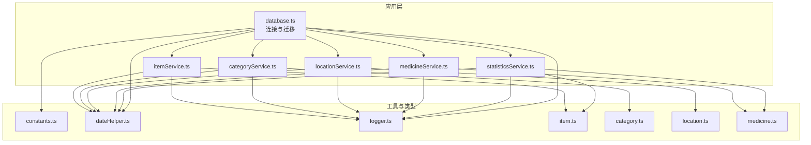
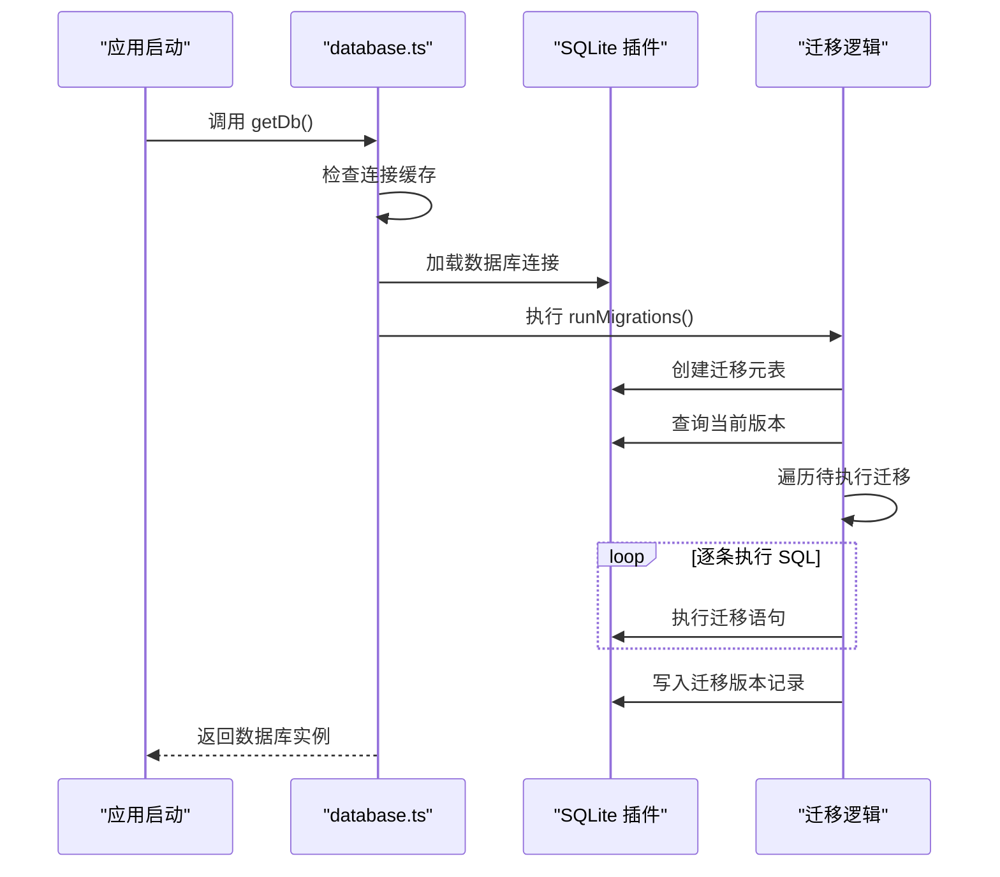
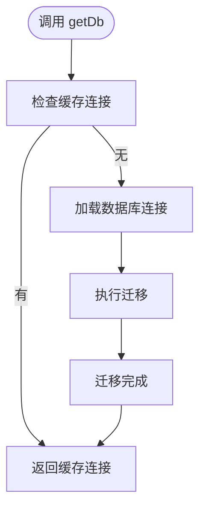
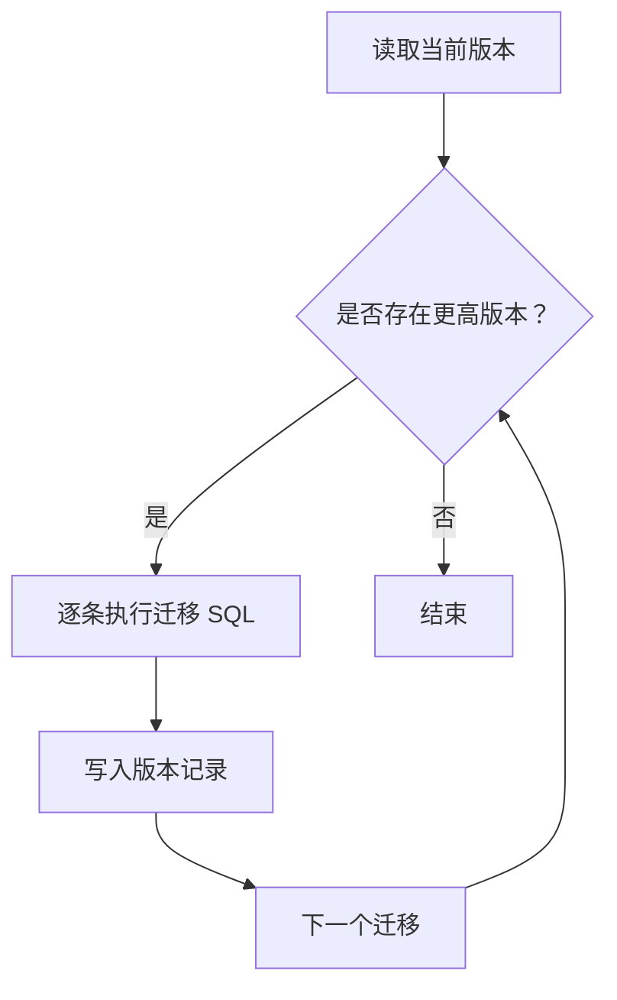
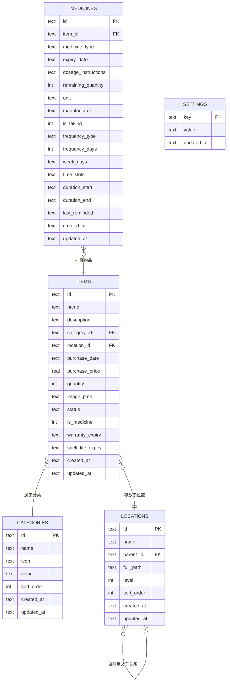
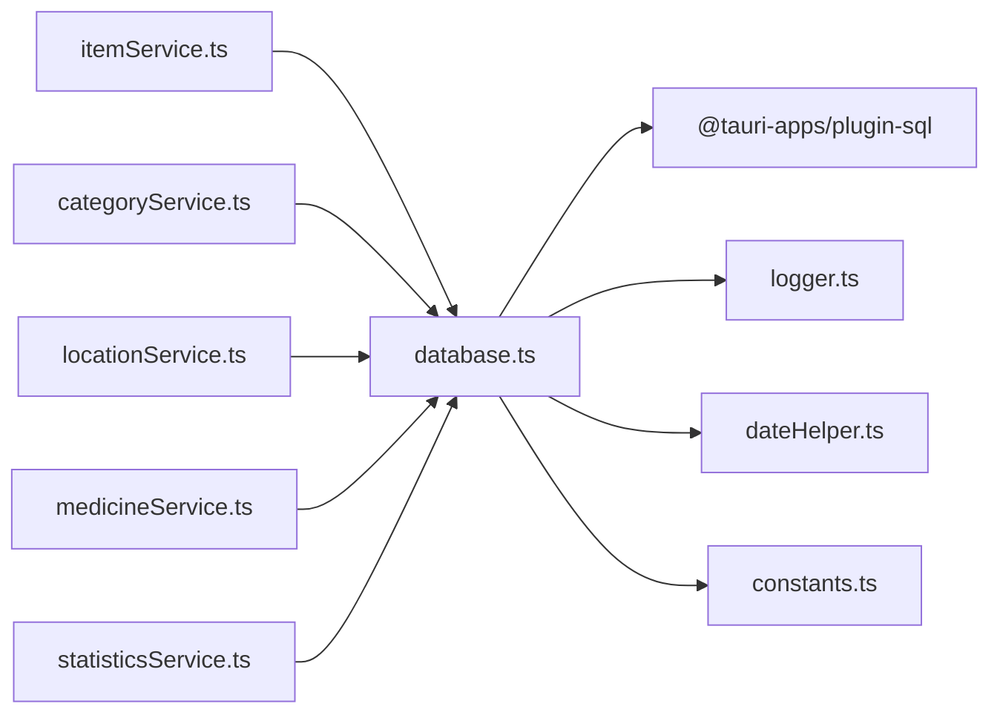

# 数据库服务

<cite>
**本文引用的文件**
- [src/services/database.ts](file://src/services/database.ts)
- [src/services/itemService.ts](file://src/services/itemService.ts)
- [src/services/categoryService.ts](file://src/services/categoryService.ts)
- [src/services/locationService.ts](file://src/services/locationService.ts)
- [src/services/medicineService.ts](file://src/services/medicineService.ts)
- [src/services/statisticsService.ts](file://src/services/statisticsService.ts)
- [src/utils/constants.ts](file://src/utils/constants.ts)
- [src/utils/dateHelper.ts](file://src/utils/dateHelper.ts)
- [src/utils/logger.ts](file://src/utils/logger.ts)
- [src/types/item.ts](file://src/types/item.ts)
- [src/types/category.ts](file://src/types/category.ts)
- [src/types/location.ts](file://src/types/location.ts)
- [src/types/medicine.ts](file://src/types/medicine.ts)
</cite>

## 目录
1. [简介](#简介)
2. [项目结构](#项目结构)
3. [核心组件](#核心组件)
4. [架构总览](#架构总览)
5. [详细组件分析](#详细组件分析)
6. [依赖分析](#依赖分析)
7. [性能考虑](#性能考虑)
8. [故障排查指南](#故障排查指南)
9. [结论](#结论)
10. [附录](#附录)

## 简介
本文件面向 Assetly 的数据库服务，系统性说明数据库连接管理、初始化与迁移机制、表结构设计原则、连接生命周期与错误处理、事务与批量操作最佳实践、备份与监控建议等。内容基于前端 SQLite 插件与应用层服务封装，确保非技术读者也能理解。

## 项目结构
数据库相关代码集中在前端服务层与工具模块中：
- 连接与迁移：database.ts
- 业务服务：itemService.ts、categoryService.ts、locationService.ts、medicineService.ts、statisticsService.ts
- 工具与常量：constants.ts、dateHelper.ts、logger.ts
- 类型定义：item.ts、category.ts、location.ts、medicine.ts

图表来源
- [src/services/database.ts:1-171](file://src/services/database.ts#L1-L171)
- [src/services/itemService.ts:1-127](file://src/services/itemService.ts#L1-L127)
- [src/services/categoryService.ts:1-59](file://src/services/categoryService.ts#L1-L59)
- [src/services/locationService.ts:1-143](file://src/services/locationService.ts#L1-L143)
- [src/services/medicineService.ts:1-64](file://src/services/medicineService.ts#L1-L64)
- [src/services/statisticsService.ts:1-52](file://src/services/statisticsService.ts#L1-L52)
- [src/utils/constants.ts:1-40](file://src/utils/constants.ts#L1-L40)
- [src/utils/dateHelper.ts:1-52](file://src/utils/dateHelper.ts#L1-L52)
- [src/utils/logger.ts:1-84](file://src/utils/logger.ts#L1-L84)
- [src/types/item.ts:1-46](file://src/types/item.ts#L1-L46)
- [src/types/category.ts:1-18](file://src/types/category.ts#L1-L18)
- [src/types/location.ts:1-24](file://src/types/location.ts#L1-L24)
- [src/types/medicine.ts:1-70](file://src/types/medicine.ts#L1-L70)

章节来源
- [src/services/database.ts:1-171](file://src/services/database.ts#L1-L171)
- [src/utils/constants.ts:1-40](file://src/utils/constants.ts#L1-L40)
- [src/utils/dateHelper.ts:1-52](file://src/utils/dateHelper.ts#L1-L52)
- [src/utils/logger.ts:1-84](file://src/utils/logger.ts#L1-L84)

## 核心组件
- 数据库连接与单例管理：通过延迟加载与单例缓存实现，首次访问时建立连接并执行迁移。
- 迁移系统：内置版本化迁移表与按序执行策略，支持 SQL 语句分批执行与失败中断。
- 业务服务：围绕四大实体（分类、位置、物品、药品）提供 CRUD 与统计查询。
- 日志与时间：统一日志接口与时间格式化，便于追踪与审计。

章节来源
- [src/services/database.ts:6-16](file://src/services/database.ts#L6-L16)
- [src/services/database.ts:18-53](file://src/services/database.ts#L18-L53)
- [src/utils/logger.ts:57-75](file://src/utils/logger.ts#L57-L75)
- [src/utils/dateHelper.ts:14-16](file://src/utils/dateHelper.ts#L14-L16)

## 架构总览
数据库服务采用“连接单例 + 版本化迁移”的轻量架构，业务服务通过统一的数据库实例进行读写，迁移在应用启动阶段完成，确保数据库结构与应用一致。

图表来源
- [src/services/database.ts:8-16](file://src/services/database.ts#L8-L16)
- [src/services/database.ts:18-53](file://src/services/database.ts#L18-L53)

## 详细组件分析

### 数据库连接与生命周期
- 单例缓存：首次调用时创建连接并缓存，后续直接复用，避免重复打开。
- 初始化流程：连接成功后立即执行迁移，保证结构一致性。
- 生命周期：当前实现未暴露显式关闭；如需扩展可增加连接释放与重置逻辑。

图表来源
- [src/services/database.ts:8-16](file://src/services/database.ts#L8-L16)
- [src/services/database.ts:18-53](file://src/services/database.ts#L18-L53)

章节来源
- [src/services/database.ts:6-16](file://src/services/database.ts#L6-L16)

### 迁移系统设计
- 元表：维护迁移版本与执行时间，用于判断是否需要继续执行。
- 版本管理：按版本号升序执行，仅执行大于当前版本的新迁移。
- 执行顺序：每个迁移内的多条 SQL 依次执行，任一失败即中断并抛出异常。
- 回滚策略：当前未实现自动回滚；如需回滚，可在新迁移中编写逆向 SQL 或引入更复杂的迁移框架。

图表来源
- [src/services/database.ts:27-52](file://src/services/database.ts#L27-L52)

章节来源
- [src/services/database.ts:18-53](file://src/services/database.ts#L18-L53)

### 表结构设计原则
- 主键约束：所有表均以文本型主键标识，便于跨平台与分布式场景。
- 外键关系：
  - 位置表自引用（父子层级），删除父级时子项置空父指针。
  - 药品表对物品表级联删除，保证数据一致性。
- 索引优化：针对常用过滤字段建立索引，提升查询效率。
- 默认值与类型：合理设置默认值与数值类型，减少空值与类型转换开销。

章节来源
- [src/services/database.ts:67-131](file://src/services/database.ts#L67-L131)

### 数据模型与关系

图表来源
- [src/services/database.ts:67-131](file://src/services/database.ts#L67-L131)
- [src/types/item.ts:5-22](file://src/types/item.ts#L5-L22)
- [src/types/location.ts:3-12](file://src/types/location.ts#L3-L12)
- [src/types/medicine.ts:7-27](file://src/types/medicine.ts#L7-L27)

### 业务服务与数据访问模式
- 统一入口：各服务通过 getDb 获取数据库实例，避免分散连接管理。
- 参数化查询：使用占位符参数，降低注入风险并提升可维护性。
- 关联查询：通过 JOIN 聚合实体信息，减少多次往返。
- 删除策略：位置与分类删除时采用更新或删除清理，药品删除通过外键级联。

章节来源
- [src/services/itemService.ts:10-44](file://src/services/itemService.ts#L10-L44)
- [src/services/itemService.ts:60-87](file://src/services/itemService.ts#L60-L87)
- [src/services/categoryService.ts:20-34](file://src/services/categoryService.ts#L20-L34)
- [src/services/locationService.ts:20-53](file://src/services/locationService.ts#L20-L53)
- [src/services/locationService.ts:94-109](file://src/services/locationService.ts#L94-L109)
- [src/services/medicineService.ts:10-37](file://src/services/medicineService.ts#L10-L37)

### 统计与报表
- 仪表盘聚合：物品数量、总价值、药品数量、即将过期数量。
- 分类分布：按分类汇总资产价值。
- 月度支出：按月份统计购买金额。

章节来源
- [src/services/statisticsService.ts:4-26](file://src/services/statisticsService.ts#L4-L26)
- [src/services/statisticsService.ts:28-38](file://src/services/statisticsService.ts#L28-L38)
- [src/services/statisticsService.ts:40-51](file://src/services/statisticsService.ts#L40-L51)

## 依赖分析
- 组件耦合：业务服务强依赖 database.ts 提供的连接；迁移依赖日期与日志工具。
- 外部依赖：SQLite 插件负责底层存储；日志插件负责输出与转发。
- 可能的循环：当前未发现循环导入；若新增跨服务查询，应避免反向依赖。

图表来源
- [src/services/database.ts:1-4](file://src/services/database.ts#L1-L4)
- [src/services/itemService.ts](file://src/services/itemService.ts#L1)
- [src/services/categoryService.ts](file://src/services/categoryService.ts#L1)
- [src/services/locationService.ts](file://src/services/locationService.ts#L1)
- [src/services/medicineService.ts](file://src/services/medicineService.ts#L1)
- [src/services/statisticsService.ts](file://src/services/statisticsService.ts#L1)

章节来源
- [src/services/database.ts:1-4](file://src/services/database.ts#L1-L4)
- [src/utils/logger.ts:1-25](file://src/utils/logger.ts#L1-L25)

## 性能考虑
- 索引策略：已为常用过滤字段建立索引，建议根据实际查询模式持续评估与补充。
- 参数化查询：统一使用占位符，避免字符串拼接带来的性能与安全问题。
- 批量操作：当前未见大规模批量写入；如需，可合并多条 INSERT/UPDATE 为事务块，减少往返。
- 查询优化：关联查询尽量限定字段与条件，避免 SELECT *；必要时拆分复杂查询。
- 时间格式：统一使用标准化时间字符串，便于排序与范围查询。

章节来源
- [src/services/database.ts:124-131](file://src/services/database.ts#L124-L131)
- [src/services/itemService.ts:10-44](file://src/services/itemService.ts#L10-L44)
- [src/utils/dateHelper.ts:14-16](file://src/utils/dateHelper.ts#L14-L16)

## 故障排查指南
- 迁移失败：查看日志中迁移 SQL 截断提示，定位具体语句并修正；确认数据库权限与路径正确。
- 连接异常：确认 SQLite 插件可用与数据库文件存在；检查应用权限与路径。
- 查询错误：核对参数占位符与传参顺序；检查表名与字段名大小写与拼写。
- 日志追踪：利用日志接口输出关键步骤与错误上下文，结合内存日志辅助诊断。

章节来源
- [src/services/database.ts:38-44](file://src/services/database.ts#L38-L44)
- [src/utils/logger.ts:57-75](file://src/utils/logger.ts#L57-L75)

## 结论
Assetly 的数据库服务以轻量、清晰为核心：通过连接单例与版本化迁移保障结构一致性；以参数化查询与索引优化提升性能；以日志与时间工具增强可观测性。建议在后续迭代中引入事务封装、批量写入与自动回滚策略，并完善备份与监控方案。

## 附录

### 迁移清单（版本演进）
- v1：初始结构（分类、位置、物品、药品、设置、索引与种子数据）
- v2：物品表新增图标字段
- v3：药品表新增用药提醒相关字段
- v4：物品与位置表新增保质期与图片字段

章节来源
- [src/services/database.ts:60-170](file://src/services/database.ts#L60-L170)

### 常用查询与参数化示例
- 列表查询：带条件拼接与参数绑定，避免 SQL 注入。
- 聚合统计：使用分组与条件筛选，配合时间范围与状态过滤。

章节来源
- [src/services/itemService.ts:10-44](file://src/services/itemService.ts#L10-L44)
- [src/services/statisticsService.ts:28-51](file://src/services/statisticsService.ts#L28-L51)