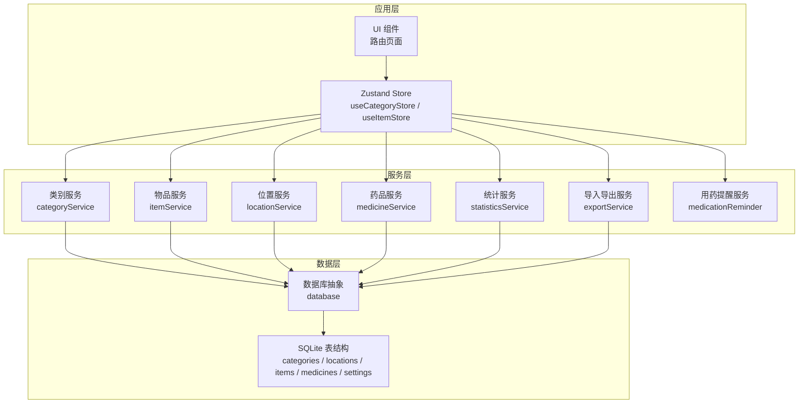
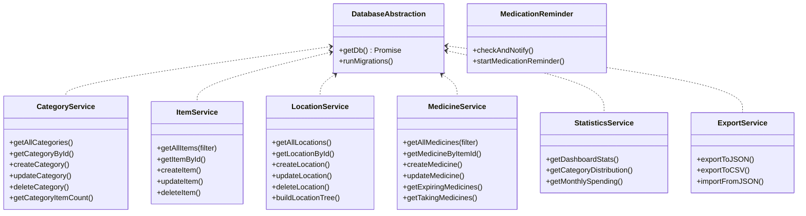
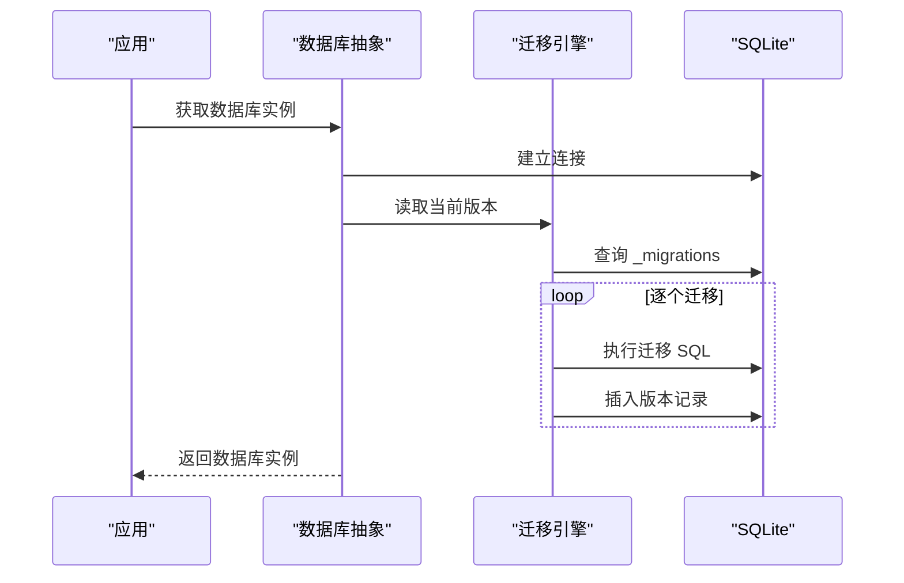
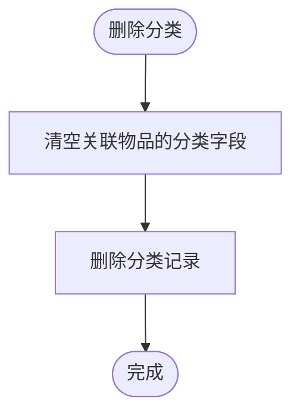
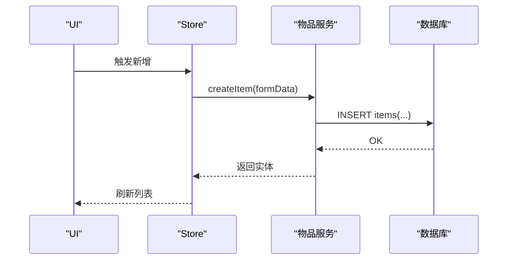
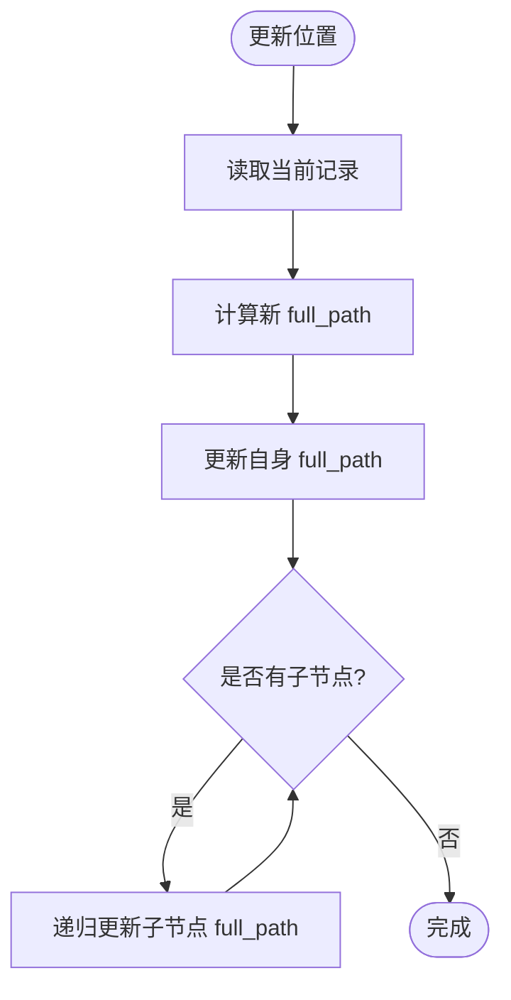
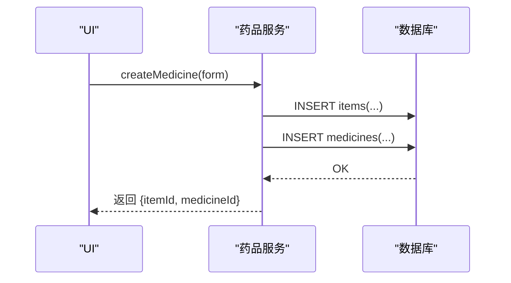
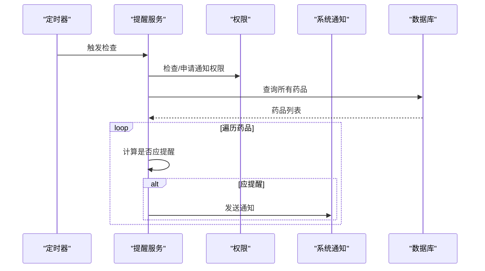
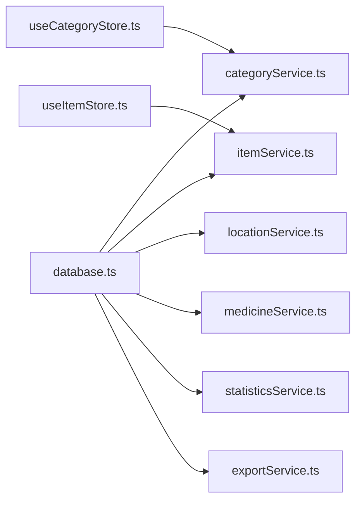
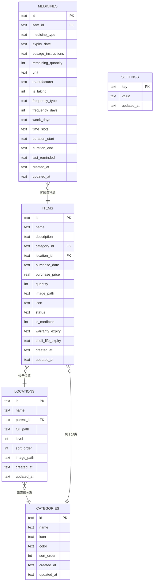

# 数据服务层

<cite>
**本文引用的文件**
- [src/services/database.ts](file://src/services/database.ts)
- [src/services/categoryService.ts](file://src/services/categoryService.ts)
- [src/services/itemService.ts](file://src/services/itemService.ts)
- [src/services/locationService.ts](file://src/services/locationService.ts)
- [src/services/medicineService.ts](file://src/services/medicineService.ts)
- [src/services/statisticsService.ts](file://src/services/statisticsService.ts)
- [src/services/exportService.ts](file://src/services/exportService.ts)
- [src/services/medicationReminder.ts](file://src/services/medicationReminder.ts)
- [src/types/category.ts](file://src/types/category.ts)
- [src/types/item.ts](file://src/types/item.ts)
- [src/types/location.ts](file://src/types/location.ts)
- [src/types/medicine.ts](file://src/types/medicine.ts)
- [src/utils/constants.ts](file://src/utils/constants.ts)
- [src/stores/useCategoryStore.ts](file://src/stores/useCategoryStore.ts)
- [src/stores/useItemStore.ts](file://src/stores/useItemStore.ts)
</cite>

## 目录
1. [简介](#简介)
2. [项目结构](#项目结构)
3. [核心组件](#核心组件)
4. [架构总览](#架构总览)
5. [详细组件分析](#详细组件分析)
6. [依赖关系分析](#依赖关系分析)
7. [性能考量](#性能考量)
8. [故障排查指南](#故障排查指南)
9. [结论](#结论)
10. [附录](#附录)

## 简介
本文件系统性梳理 Assetly 的数据服务层设计与实现，覆盖数据库抽象、服务层模式、数据传输对象（DTO）、API 接口定义、业务逻辑、数据验证与错误处理、事务管理、服务间协作与依赖注入、异步与缓存策略、数据一致性与性能优化等主题。目标是帮助开发者快速理解并高效扩展数据层功能。

## 项目结构
数据服务层主要由以下部分组成：
- 数据库抽象与初始化：统一加载 SQLite 数据库、自动迁移与索引维护
- 服务层：按领域拆分（类别、物品、位置、药品、统计、导入导出、用药提醒）
- 类型系统：强类型 DTO 与表结构映射
- 前端状态与服务交互：通过 Zustand Store 将服务方法与 UI 绑定

图表来源
- [src/services/database.ts:1-171](file://src/services/database.ts#L1-L171)
- [src/services/categoryService.ts:1-59](file://src/services/categoryService.ts#L1-L59)
- [src/services/itemService.ts:1-127](file://src/services/itemService.ts#L1-L127)
- [src/services/locationService.ts:1-143](file://src/services/locationService.ts#L1-L143)
- [src/services/medicineService.ts:1-194](file://src/services/medicineService.ts#L1-L194)
- [src/services/statisticsService.ts:1-52](file://src/services/statisticsService.ts#L1-L52)
- [src/services/exportService.ts:1-154](file://src/services/exportService.ts#L1-L154)
- [src/services/medicationReminder.ts:1-132](file://src/services/medicationReminder.ts#L1-L132)

章节来源
- [src/services/database.ts:1-171](file://src/services/database.ts#L1-L171)
- [src/services/categoryService.ts:1-59](file://src/services/categoryService.ts#L1-L59)
- [src/services/itemService.ts:1-127](file://src/services/itemService.ts#L1-L127)
- [src/services/locationService.ts:1-143](file://src/services/locationService.ts#L1-L143)
- [src/services/medicineService.ts:1-194](file://src/services/medicineService.ts#L1-L194)
- [src/services/statisticsService.ts:1-52](file://src/services/statisticsService.ts#L1-L52)
- [src/services/exportService.ts:1-154](file://src/services/exportService.ts#L1-L154)
- [src/services/medicationReminder.ts:1-132](file://src/services/medicationReminder.ts#L1-L132)

## 核心组件
- 数据库抽象与迁移
  - 单例化数据库连接，延迟加载
  - 内置迁移表与版本控制，按序执行未应用的迁移
  - 首次运行时插入默认分类与设置
- 服务层模式
  - 每个领域一个服务模块，封装 CRUD 与复杂查询
  - 统一使用参数化 SQL，避免注入风险
  - 通过类型系统确保输入输出安全
- 数据传输对象（DTO）
  - 类别、物品、位置、药品分别定义接口，支持详情拼接与表单数据
- 事务管理
  - 采用单语句事务模型；批量写入在单次调用内原子化
  - 跨表更新（如药品创建）通过多次执行实现，建议在需要时合并为单事务
- 错误处理
  - 迁移执行失败直接抛出；导入导出捕获异常并记录错误明细
  - 日志记录关键操作与错误信息
- 异步与缓存
  - 服务层以 Promise 形式暴露异步接口
  - Store 层负责本地状态缓存与刷新策略

章节来源
- [src/services/database.ts:1-171](file://src/services/database.ts#L1-L171)
- [src/types/category.ts:1-18](file://src/types/category.ts#L1-L18)
- [src/types/item.ts:1-46](file://src/types/item.ts#L1-L46)
- [src/types/location.ts:1-24](file://src/types/location.ts#L1-L24)
- [src/types/medicine.ts:1-70](file://src/types/medicine.ts#L1-L70)

## 架构总览
数据服务层遵循“数据库抽象 + 领域服务 + DTO + Store”的分层架构。数据库抽象负责连接与迁移；服务层面向业务场景提供 API；DTO 明确数据契约；Store 将服务与 UI 解耦。

图表来源
- [src/services/database.ts:1-171](file://src/services/database.ts#L1-L171)
- [src/services/categoryService.ts:1-59](file://src/services/categoryService.ts#L1-L59)
- [src/services/itemService.ts:1-127](file://src/services/itemService.ts#L1-L127)
- [src/services/locationService.ts:1-143](file://src/services/locationService.ts#L1-L143)
- [src/services/medicineService.ts:1-194](file://src/services/medicineService.ts#L1-L194)
- [src/services/statisticsService.ts:1-52](file://src/services/statisticsService.ts#L1-L52)
- [src/services/exportService.ts:1-154](file://src/services/exportService.ts#L1-L154)
- [src/services/medicationReminder.ts:1-132](file://src/services/medicationReminder.ts#L1-L132)

## 详细组件分析

### 数据库抽象与迁移（database）
- 设计要点
  - 单例数据库实例，首次访问时建立连接并执行迁移
  - 迁移表记录已应用版本，按版本顺序执行 SQL 列表
  - 首次运行自动创建索引与默认数据（分类、设置）
- 关键流程

图表来源
- [src/services/database.ts:8-53](file://src/services/database.ts#L8-L53)

章节来源
- [src/services/database.ts:1-171](file://src/services/database.ts#L1-L171)

### 类别服务（categoryService）
- 职责范围
  - 分类的增删改查与数量统计
  - 创建时自动分配排序序号，保持稳定顺序
- API 定义
  - 查询：全部、按 ID
  - 新增：表单数据 -> 实体
  - 更新：按字段更新
  - 删除：级联清空关联物品的分类字段后删除
  - 统计：返回某分类下的物品数量
- 业务逻辑
  - 使用 UUID 生成主键
  - 排序序号基于现有最大值 + 1
- 错误处理
  - 删除时先清理关联再删除，避免外键约束问题

图表来源
- [src/services/categoryService.ts:44-49](file://src/services/categoryService.ts#L44-L49)

章节来源
- [src/services/categoryService.ts:1-59](file://src/services/categoryService.ts#L1-L59)

### 物品服务（itemService）
- 职责范围
  - 物品的全量查询（支持分类、位置、状态、搜索过滤）、详情查询、新增、更新、删除
- API 定义
  - 查询：支持多条件动态拼接 SQL
  - 新增：表单数据 -> 实体（含扩展字段）
  - 更新：按需字段拼接更新语句
  - 删除：删除后级联删除药品扩展
- 业务逻辑
  - 详情查询通过 LEFT JOIN 拼接分类与位置路径
  - is_medicine 字段用于区分普通物品与药品扩展
- 性能与一致性
  - 使用参数化查询防止注入
  - 更新时统一更新时间戳

图表来源
- [src/services/itemService.ts:60-87](file://src/services/itemService.ts#L60-L87)

章节来源
- [src/services/itemService.ts:1-127](file://src/services/itemService.ts#L1-L127)

### 位置服务（locationService）
- 职责范围
  - 位置树形结构的增删改查、路径维护与树构建
- API 定义
  - 查询：全部、按 ID
  - 新增：计算 full_path 与 level，按父节点排序序号
  - 更新：重命名时递归更新子节点 full_path
  - 删除：递归删除后代并清空物品位置
  - 工具：将扁平列表转为树形结构
- 业务逻辑
  - full_path 采用“父路径/名称”格式，level 表示层级
  - 更新父节点会触发整棵子树路径同步
- 复杂度
  - 递归更新子路径的时间复杂度与树高相关

图表来源
- [src/services/locationService.ts:55-92](file://src/services/locationService.ts#L55-L92)

章节来源
- [src/services/locationService.ts:1-143](file://src/services/locationService.ts#L1-L143)

### 药品服务（medicineService）
- 职责范围
  - 药品与物品的联合查询、按类型/搜索过滤、到期提醒查询、服药清单
- API 宙义
  - 查询：全部、按物品 ID、按类型/搜索、到期提醒、正在服用
  - 新增：先创建物品，再创建药品扩展（1:1 关系）
  - 更新：分别更新物品与药品字段（布尔值转换为整数存储）
- 业务逻辑
  - is_medicine 标记为 1 的物品扩展为药品
  - 服药提醒字段支持每日、N 日间隔、每周多种频率与时间段
- 事务建议
  - 创建药品涉及两次 INSERT，建议在数据库层面或上层封装为单事务

图表来源
- [src/services/medicineService.ts:54-95](file://src/services/medicineService.ts#L54-L95)

章节来源
- [src/services/medicineService.ts:1-194](file://src/services/medicineService.ts#L1-L194)

### 统计服务（statisticsService）
- 职责范围
  - 仪表盘聚合指标、分类价值分布、月度支出趋势
- API 宙义
  - 仪表盘：物品总数、总价值、药品数量、近 30 天将到期数量
  - 分类分布：按分类汇总价值
  - 月度支出：按自然月分组统计
- 业务逻辑
  - 使用 SQLite 聚合函数与日期函数进行统计

章节来源
- [src/services/statisticsService.ts:1-52](file://src/services/statisticsService.ts#L1-L52)

### 导入导出服务（exportService）
- 职责范围
  - 导出 JSON/CSV，导入 JSON 并回填数据库
- API 宙义
  - 导出：JSON（含四张表）、CSV（物品详情+药品类型）
  - 导入：JSON -> 四表 INSERT OR REPLACE
- 错误处理
  - 解析失败与单条导入失败均记录错误，返回成功/失败计数与错误列表

章节来源
- [src/services/exportService.ts:1-154](file://src/services/exportService.ts#L1-L154)

### 用药提醒服务（medicationReminder）
- 职责范围
  - 周期性检查正在服用的药品，按频率与时间段触发系统通知
- API 宙义
  - checkAndNotify：检查并发送通知
  - startMedicationReminder：启动定时器并注册通知动作类型
- 业务逻辑
  - 频率支持每日、N 日间隔、每周指定星期
  - 时间槽匹配当前小时与分钟
  - 防抖：同分钟内避免重复提醒
- 平台集成
  - 使用 Tauri 通知插件，Android 注册动作类型

图表来源
- [src/services/medicationReminder.ts:53-97](file://src/services/medicationReminder.ts#L53-L97)

章节来源
- [src/services/medicationReminder.ts:1-132](file://src/services/medicationReminder.ts#L1-L132)

## 依赖关系分析
- 低耦合高内聚
  - 每个服务仅依赖数据库抽象与类型定义，无跨服务直接调用
- 依赖注入
  - 通过模块导入方式注入（如 Store 注入具体服务），属于静态依赖注入
- 外部依赖
  - SQLite 插件、Tauri 通知插件、Zustand 状态管理

图表来源
- [src/services/database.ts:1-171](file://src/services/database.ts#L1-L171)
- [src/services/categoryService.ts:1-59](file://src/services/categoryService.ts#L1-L59)
- [src/services/itemService.ts:1-127](file://src/services/itemService.ts#L1-L127)
- [src/services/locationService.ts:1-143](file://src/services/locationService.ts#L1-L143)
- [src/services/medicineService.ts:1-194](file://src/services/medicineService.ts#L1-L194)
- [src/services/statisticsService.ts:1-52](file://src/services/statisticsService.ts#L1-L52)
- [src/services/exportService.ts:1-154](file://src/services/exportService.ts#L1-L154)
- [src/stores/useCategoryStore.ts:1-44](file://src/stores/useCategoryStore.ts#L1-L44)
- [src/stores/useItemStore.ts:1-53](file://src/stores/useItemStore.ts#L1-L53)

章节来源
- [src/stores/useCategoryStore.ts:1-44](file://src/stores/useCategoryStore.ts#L1-L44)
- [src/stores/useItemStore.ts:1-53](file://src/stores/useItemStore.ts#L1-L53)

## 性能考量
- 索引与查询
  - 已创建多处索引（物品分类、位置、状态、药品到期日等），提升过滤与排序性能
- 动态 SQL
  - 服务层对查询条件进行参数化拼接，避免全表扫描
- 批量导入
  - 导入服务使用“INSERT OR REPLACE”，建议在大量数据时考虑分批与事务封装
- 缓存策略
  - Store 层在前端维护本地状态，减少重复请求
  - 可结合本地持久化（如 IndexedDB 或文件缓存）实现跨会话缓存
- 异步与并发
  - 所有服务方法为异步，避免阻塞 UI
  - 对于高频查询（如提醒检查）建议节流/防抖与后台线程执行

[本节为通用指导，不直接分析具体文件]

## 故障排查指南
- 迁移失败
  - 现象：启动时报错中断
  - 排查：查看迁移 SQL 与错误日志，确认版本号与 SQL 语法
- 导入失败
  - 现象：导入返回失败计数与错误列表
  - 排查：检查 JSON 结构、字段映射与数据库约束
- 通知未触发
  - 现象：未收到提醒
  - 排查：确认通知权限、频率配置、时间段设置与定时器运行状态
- 数据不一致
  - 现象：更新后路径未同步、删除后关联未清理
  - 排查：检查位置更新与删除逻辑，必要时补充事务或触发器

章节来源
- [src/services/database.ts:38-50](file://src/services/database.ts#L38-L50)
- [src/services/exportService.ts:53-153](file://src/services/exportService.ts#L53-L153)
- [src/services/medicationReminder.ts:54-97](file://src/services/medicationReminder.ts#L54-L97)

## 结论
数据服务层以数据库抽象为核心，围绕领域服务构建清晰的职责边界与稳定的 API。通过类型系统、参数化查询与迁移机制保障了可维护性与一致性。建议在跨表写入场景引入事务封装，并结合前端缓存与异步策略进一步提升用户体验与性能。

[本节为总结性内容，不直接分析具体文件]

## 附录

### 数据模型图

图表来源
- [src/services/database.ts:60-170](file://src/services/database.ts#L60-L170)

### 服务调用示例（路径指引）
- 获取全部物品（带过滤）
  - [src/services/itemService.ts:10-44](file://src/services/itemService.ts#L10-L44)
- 创建药品（含物品与药品两条记录）
  - [src/services/medicineService.ts:54-95](file://src/services/medicineService.ts#L54-L95)
- 启动用药提醒定时器
  - [src/services/medicationReminder.ts:102-131](file://src/services/medicationReminder.ts#L102-L131)
- Store 中使用服务（新增物品）
  - [src/stores/useItemStore.ts:34-37](file://src/stores/useItemStore.ts#L34-L37)

### 最佳实践
- 输入校验
  - 在服务层对必填字段与枚举值进行校验（如状态、类型），失败时抛出明确错误
- 事务封装
  - 对跨表写入（如药品创建）建议封装为单事务，失败回滚
- 日志与监控
  - 关键操作与错误均记录日志，便于追踪与审计
- 缓存与刷新
  - Store 层在变更后主动刷新，避免脏读
- 异步与并发
  - 高频检查（如提醒）使用定时器并加入防抖，避免重复触发

[本节为通用指导，不直接分析具体文件]