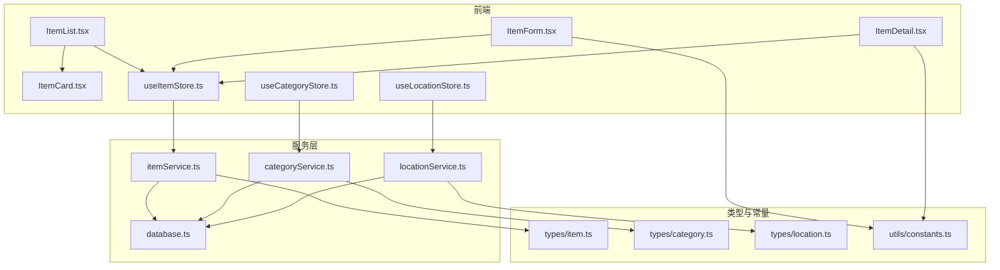
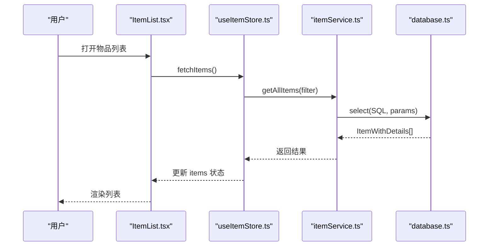
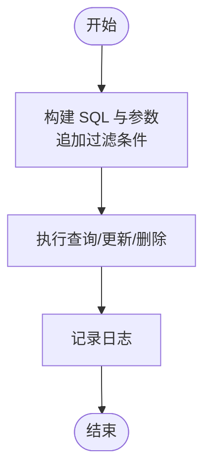
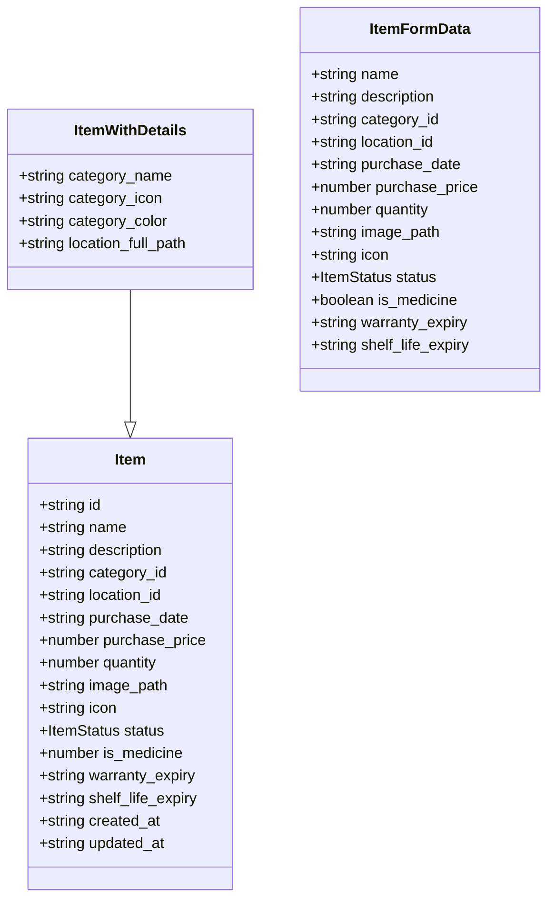
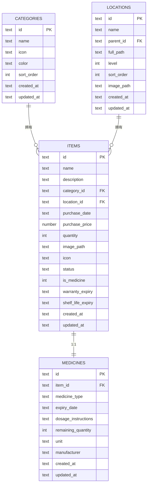
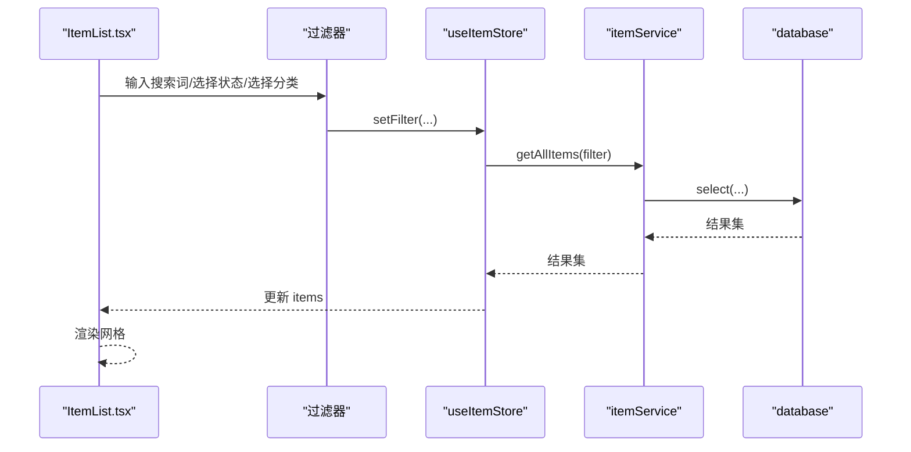
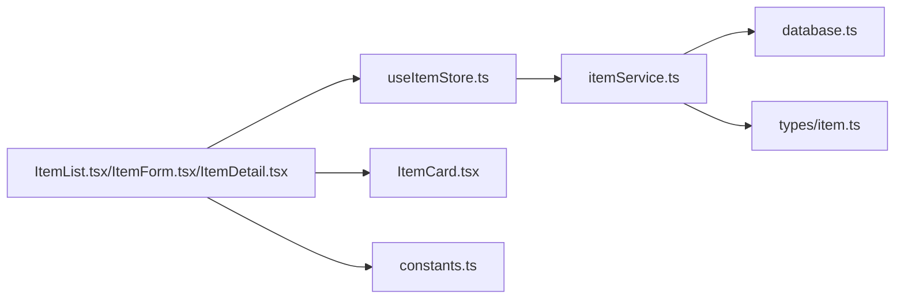

# 物品服务

<cite>
**本文引用的文件**
- [src/services/itemService.ts](file://src/services/itemService.ts)
- [src/types/item.ts](file://src/types/item.ts)
- [src/stores/useItemStore.ts](file://src/stores/useItemStore.ts)
- [src/routes/ItemList.tsx](file://src/routes/ItemList.tsx)
- [src/routes/ItemForm.tsx](file://src/routes/ItemForm.tsx)
- [src/routes/ItemDetail.tsx](file://src/routes/ItemDetail.tsx)
- [src/services/database.ts](file://src/services/database.ts)
- [src/types/category.ts](file://src/types/category.ts)
- [src/types/location.ts](file://src/types/location.ts)
- [src/services/categoryService.ts](file://src/services/categoryService.ts)
- [src/services/locationService.ts](file://src/services/locationService.ts)
- [src/stores/useCategoryStore.ts](file://src/stores/useCategoryStore.ts)
- [src/stores/useLocationStore.ts](file://src/stores/useLocationStore.ts)
- [src/components/items/ItemCard.tsx](file://src/components/items/ItemCard.tsx)
- [src/utils/constants.ts](file://src/utils/constants.ts)
</cite>

## 目录
1. [简介](#简介)
2. [项目结构](#项目结构)
3. [核心组件](#核心组件)
4. [架构总览](#架构总览)
5. [详细组件分析](#详细组件分析)
6. [依赖分析](#依赖分析)
7. [性能考虑](#性能考虑)
8. [故障排查指南](#故障排查指南)
9. [结论](#结论)
10. [附录](#附录)

## 简介
本文件面向 Assetly 的“物品服务”，系统性梳理物品数据访问层（DAL）的实现，涵盖：
- 完整 CRUD 操作流程与异步处理策略
- 查询优化与索引设计
- 数据验证与输入约束
- 物品与分类、位置的关联关系及外键约束
- 物品状态管理机制（状态枚举与转换）
- 搜索与过滤（全文模糊匹配、多条件筛选、排序）
- 增删改查示例与错误处理建议
- 缓存策略与性能优化技巧

## 项目结构
围绕物品服务的关键目录与文件如下：
- 服务层：itemService.ts 负责物品的数据库访问；database.ts 提供 SQLite 连接与迁移；categoryService.ts、locationService.ts 分别负责分类与位置的数据访问。
- 类型定义：item.ts、category.ts、location.ts 定义了数据模型与表结构映射。
- 状态管理：useItemStore.ts、useCategoryStore.ts、useLocationStore.ts 使用 zustand 管理前端状态与调用服务层。
- 路由与界面：ItemList.tsx、ItemForm.tsx、ItemDetail.tsx 实现列表、表单与详情页的交互与展示。
- 组件：ItemCard.tsx 展示卡片信息与状态标签。
- 常量：constants.ts 提供默认分类、状态标签等常量。

图表来源
- [src/routes/ItemList.tsx:1-185](file://src/routes/ItemList.tsx#L1-L185)
- [src/routes/ItemForm.tsx:1-263](file://src/routes/ItemForm.tsx#L1-L263)
- [src/routes/ItemDetail.tsx:1-168](file://src/routes/ItemDetail.tsx#L1-L168)
- [src/stores/useItemStore.ts:1-53](file://src/stores/useItemStore.ts#L1-L53)
- [src/stores/useCategoryStore.ts:1-44](file://src/stores/useCategoryStore.ts#L1-L44)
- [src/stores/useLocationStore.ts:1-43](file://src/stores/useLocationStore.ts#L1-L43)
- [src/services/itemService.ts:1-127](file://src/services/itemService.ts#L1-L127)
- [src/services/categoryService.ts:1-59](file://src/services/categoryService.ts#L1-L59)
- [src/services/locationService.ts:1-143](file://src/services/locationService.ts#L1-L143)
- [src/services/database.ts:1-171](file://src/services/database.ts#L1-L171)
- [src/types/item.ts:1-46](file://src/types/item.ts#L1-L46)
- [src/types/category.ts:1-18](file://src/types/category.ts#L1-L18)
- [src/types/location.ts:1-24](file://src/types/location.ts#L1-L24)
- [src/components/items/ItemCard.tsx:1-94](file://src/components/items/ItemCard.tsx#L1-L94)
- [src/utils/constants.ts:1-40](file://src/utils/constants.ts#L1-L40)

章节来源
- [src/services/itemService.ts:1-127](file://src/services/itemService.ts#L1-L127)
- [src/services/database.ts:1-171](file://src/services/database.ts#L1-L171)
- [src/types/item.ts:1-46](file://src/types/item.ts#L1-L46)
- [src/stores/useItemStore.ts:1-53](file://src/stores/useItemStore.ts#L1-L53)
- [src/routes/ItemList.tsx:1-185](file://src/routes/ItemList.tsx#L1-L185)
- [src/routes/ItemForm.tsx:1-263](file://src/routes/ItemForm.tsx#L1-L263)
- [src/routes/ItemDetail.tsx:1-168](file://src/routes/ItemDetail.tsx#L1-L168)
- [src/services/categoryService.ts:1-59](file://src/services/categoryService.ts#L1-L59)
- [src/services/locationService.ts:1-143](file://src/services/locationService.ts#L1-L143)
- [src/stores/useCategoryStore.ts:1-44](file://src/stores/useCategoryStore.ts#L1-L44)
- [src/stores/useLocationStore.ts:1-43](file://src/stores/useLocationStore.ts#L1-L43)
- [src/types/category.ts:1-18](file://src/types/category.ts#L1-L18)
- [src/types/location.ts:1-24](file://src/types/location.ts#L1-L24)
- [src/components/items/ItemCard.tsx:1-94](file://src/components/items/ItemCard.tsx#L1-L94)
- [src/utils/constants.ts:1-40](file://src/utils/constants.ts#L1-L40)

## 核心组件
- 数据库与迁移：database.ts 负责连接 SQLite 并执行迁移脚本，创建表、索引与默认数据。
- 物品服务：itemService.ts 提供物品的增删改查、分页与过滤查询。
- 分类与位置服务：categoryService.ts、locationService.ts 提供分类与位置的增删改查与树形结构维护。
- 类型定义：item.ts、category.ts、location.ts 明确数据结构与字段含义。
- 状态管理：useItemStore.ts、useCategoryStore.ts、useLocationStore.ts 将服务层与 UI 解耦。
- 路由与界面：ItemList.tsx、ItemForm.tsx、ItemDetail.tsx 实现用户交互与数据展示。
- 组件：ItemCard.tsx 展示物品卡片与状态标签。

章节来源
- [src/services/database.ts:1-171](file://src/services/database.ts#L1-L171)
- [src/services/itemService.ts:1-127](file://src/services/itemService.ts#L1-L127)
- [src/services/categoryService.ts:1-59](file://src/services/categoryService.ts#L1-L59)
- [src/services/locationService.ts:1-143](file://src/services/locationService.ts#L1-L143)
- [src/types/item.ts:1-46](file://src/types/item.ts#L1-L46)
- [src/types/category.ts:1-18](file://src/types/category.ts#L1-L18)
- [src/types/location.ts:1-24](file://src/types/location.ts#L1-L24)
- [src/stores/useItemStore.ts:1-53](file://src/stores/useItemStore.ts#L1-L53)
- [src/stores/useCategoryStore.ts:1-44](file://src/stores/useCategoryStore.ts#L1-L44)
- [src/stores/useLocationStore.ts:1-43](file://src/stores/useLocationStore.ts#L1-L43)
- [src/routes/ItemList.tsx:1-185](file://src/routes/ItemList.tsx#L1-L185)
- [src/routes/ItemForm.tsx:1-263](file://src/routes/ItemForm.tsx#L1-L263)
- [src/routes/ItemDetail.tsx:1-168](file://src/routes/ItemDetail.tsx#L1-L168)
- [src/components/items/ItemCard.tsx:1-94](file://src/components/items/ItemCard.tsx#L1-L94)
- [src/utils/constants.ts:1-40](file://src/utils/constants.ts#L1-L40)

## 架构总览
物品服务采用“路由 → 状态管理 → 服务层 → 数据库”的分层架构。UI 通过状态管理触发服务层方法，服务层通过数据库插件执行 SQL，返回标准化数据模型。

图表来源
- [src/routes/ItemList.tsx:27-30](file://src/routes/ItemList.tsx#L27-L30)
- [src/stores/useItemStore.ts:28-32](file://src/stores/useItemStore.ts#L28-L32)
- [src/services/itemService.ts:10-44](file://src/services/itemService.ts#L10-L44)
- [src/services/database.ts:8-16](file://src/services/database.ts#L8-L16)

## 详细组件分析

### 数据访问层（itemService.ts）
- 生成唯一 ID：使用随机 UUID。
- 查询接口
  - getAllItems：支持按分类、位置、状态、名称模糊搜索过滤，并按创建时间倒序。
  - getItemById：按主键查询并关联分类与位置的显示字段。
- 写入接口
  - createItem：插入新记录，设置创建与更新时间为当前时间。
  - updateItem：动态拼接字段，仅更新传入的字段，统一更新时间。
  - deleteItem：删除指定物品，注释说明药品会级联删除（由数据库外键约束保证）。
- 异步与日志：所有数据库操作均为异步；写入后记录日志便于审计。

图表来源
- [src/services/itemService.ts:10-44](file://src/services/itemService.ts#L10-L44)
- [src/services/itemService.ts:60-87](file://src/services/itemService.ts#L60-L87)
- [src/services/itemService.ts:89-119](file://src/services/itemService.ts#L89-L119)
- [src/services/itemService.ts:121-126](file://src/services/itemService.ts#L121-L126)

章节来源
- [src/services/itemService.ts:1-127](file://src/services/itemService.ts#L1-L127)

### 数据模型与状态管理（types 与 stores）
- 类型定义
  - Item：物品实体，包含基础属性、状态、布尔标志位、时间戳等。
  - ItemWithDetails：在 Item 基础上扩展分类名称/图标/颜色与位置全路径。
  - ItemFormData：表单提交数据结构，与 Item 字段一一对应。
  - ItemStatus：状态枚举（active/archived/disposed）。
- 状态管理
  - useItemStore：封装物品列表、加载状态、过滤器、增删改查动作；每次变更后重新拉取列表以保持视图一致。
  - useCategoryStore/useLocationStore：分别维护分类与位置的本地状态，供表单与列表使用。

图表来源
- [src/types/item.ts:5-45](file://src/types/item.ts#L5-L45)

章节来源
- [src/types/item.ts:1-46](file://src/types/item.ts#L1-L46)
- [src/stores/useItemStore.ts:1-53](file://src/stores/useItemStore.ts#L1-L53)
- [src/stores/useCategoryStore.ts:1-44](file://src/stores/useCategoryStore.ts#L1-L44)
- [src/stores/useLocationStore.ts:1-43](file://src/stores/useLocationStore.ts#L1-L43)

### 关联关系与外键约束（数据库层）
- 表结构与索引
  - categories：主键 id，带索引 idx_categories_name。
  - locations：自引用父子关系，full_path 记录层级路径，带索引 idx_locations_parent。
  - items：外键 category_id、location_id；带索引 idx_items_category、idx_items_location、idx_items_status。
  - medicines：与 items 1:1 关联，item_id 唯一且外键约束 onDelete CASCADE。
- 级联行为
  - 删除分类：将 items 中该分类的 category_id 置空。
  - 删除位置：递归删除其后代位置并将 items 的 location_id 置空。
  - 删除物品：medicines 通过外键级联删除（由数据库约束保证）。

图表来源
- [src/services/database.ts:67-131](file://src/services/database.ts#L67-L131)
- [src/services/database.ts:104-117](file://src/services/database.ts#L104-L117)

章节来源
- [src/services/database.ts:1-171](file://src/services/database.ts#L1-L171)
- [src/services/categoryService.ts:44-49](file://src/services/categoryService.ts#L44-L49)
- [src/services/locationService.ts:94-122](file://src/services/locationService.ts#L94-L122)

### 状态管理与 UI 交互
- 列表页（ItemList.tsx）
  - 支持搜索框防抖（300ms）、状态筛选、分类筛选；通过 useItemStore.setFilter 与 fetchItems 驱动刷新。
  - 统计概览：计算 active/archived/disposed 数量与总价值、日均成本。
- 表单页（ItemForm.tsx）
  - 新增/编辑模式切换；必填校验（名称非空）；提交时调用 useItemStore.addItem/updateItem。
- 详情页（ItemDetail.tsx）
  - 展示物品详情与状态标签；提供删除确认对话框；删除后跳转列表。
- 卡片组件（ItemCard.tsx）
  - 展示图标、状态标签、总价值与日均成本；根据分类图标映射默认图标。

图表来源
- [src/routes/ItemList.tsx:27-49](file://src/routes/ItemList.tsx#L27-L49)
- [src/stores/useItemStore.ts:28-32](file://src/stores/useItemStore.ts#L28-L32)
- [src/services/itemService.ts:10-44](file://src/services/itemService.ts#L10-L44)

章节来源
- [src/routes/ItemList.tsx:1-185](file://src/routes/ItemList.tsx#L1-L185)
- [src/routes/ItemForm.tsx:1-263](file://src/routes/ItemForm.tsx#L1-L263)
- [src/routes/ItemDetail.tsx:1-168](file://src/routes/ItemDetail.tsx#L1-L168)
- [src/stores/useItemStore.ts:1-53](file://src/stores/useItemStore.ts#L1-L53)
- [src/components/items/ItemCard.tsx:1-94](file://src/components/items/ItemCard.tsx#L1-L94)

### 查询优化与索引设计
- 索引覆盖
  - items：category_id、location_id、status、warranty_expiry、shelf_life_expiry（版本 4 迁移新增）。
  - locations：parent_id。
  - medicines：item_id、expiry_date、medicine_type。
- 查询策略
  - 模糊匹配：名称 LIKE %term%，建议配合前缀索引或全文搜索引擎（如 FTS5）进一步优化。
  - 多条件组合：动态拼接 WHERE 条件，避免不必要的全表扫描。
  - 排序：默认按 created_at 倒序，适合“最新优先”场景。

章节来源
- [src/services/database.ts:124-131](file://src/services/database.ts#L124-L131)
- [src/services/database.ts:162-168](file://src/services/database.ts#L162-L168)
- [src/services/itemService.ts:37-42](file://src/services/itemService.ts#L37-L42)

### 数据验证与输入约束
- 前端校验
  - ItemForm.tsx：名称必填；价格/数量数值化；状态下拉选择。
- 后端约束
  - 数据库层：NOT NULL、DEFAULT、外键约束、CASCADE。
  - 业务约束：删除分类时将 items 的 category_id 置空；删除位置时递归清理并置空 items 的 location_id。

章节来源
- [src/routes/ItemForm.tsx:67-81](file://src/routes/ItemForm.tsx#L67-L81)
- [src/services/categoryService.ts:44-49](file://src/services/categoryService.ts#L44-L49)
- [src/services/locationService.ts:94-109](file://src/services/locationService.ts#L94-L109)

### 物品状态管理机制
- 状态枚举：ItemStatus = 'active' | 'archived' | 'disposed'。
- 状态标签：constants.ts 提供中文标签映射。
- 状态展示：ItemCard.tsx、ItemDetail.tsx 根据状态渲染不同样式与文案。

章节来源
- [src/types/item.ts:3](file://src/types/item.ts#L3)
- [src/utils/constants.ts:22-27](file://src/utils/constants.ts#L22-L27)
- [src/components/items/ItemCard.tsx:55-65](file://src/components/items/ItemCard.tsx#L55-L65)
- [src/routes/ItemDetail.tsx:78-84](file://src/routes/ItemDetail.tsx#L78-L84)

### 搜索与过滤实现
- 名称搜索：LIKE %term%（大小写不敏感，取决于数据库 collation）。
- 多条件筛选：分类、位置、状态三类条件可组合使用。
- 排序：默认按 created_at DESC。
- 防抖策略：ItemList.tsx 对搜索输入进行 300ms 防抖，减少请求频率。

章节来源
- [src/services/itemService.ts:37-42](file://src/services/itemService.ts#L37-L42)
- [src/routes/ItemList.tsx:32-38](file://src/routes/ItemList.tsx#L32-L38)

### 增删改查示例与异步处理
- 新增：ItemForm.tsx 提交表单 → useItemStore.addItem → itemService.createItem → database.execute → fetchItems 刷新。
- 修改：ItemForm.tsx 提交 → useItemStore.updateItem → itemService.updateItem → database.execute → fetchItems 刷新。
- 删除：ItemDetail.tsx 点击删除 → useItemStore.deleteItem → itemService.deleteItem → database.execute → fetchItems 刷新。
- 错误处理建议：捕获数据库异常并提示用户；对必填字段进行前端校验；对无效输入给出明确提示。

章节来源
- [src/routes/ItemForm.tsx:67-81](file://src/routes/ItemForm.tsx#L67-L81)
- [src/stores/useItemStore.ts:34-47](file://src/stores/useItemStore.ts#L34-L47)
- [src/services/itemService.ts:60-87](file://src/services/itemService.ts#L60-L87)
- [src/services/itemService.ts:89-119](file://src/services/itemService.ts#L89-L119)
- [src/services/itemService.ts:121-126](file://src/services/itemService.ts#L121-L126)

### 缓存策略与性能优化
- 前端缓存
  - useItemStore/useCategoryStore/useLocationStore：将查询结果缓存在内存中，避免重复请求。
  - 列表页：ItemList.tsx 在加载期间显示骨架屏，提升感知性能。
- 数据库优化
  - 合理使用索引：category_id、location_id、status、expiry_date 等。
  - 避免 N+1 查询：itemService 已通过 JOIN 一次性获取分类与位置信息。
- 可扩展优化
  - 全文搜索：启用 FTS5 或外部搜索引擎（如 Tantivy）提升模糊匹配性能。
  - 分页：在大数据量场景下引入 LIMIT/OFFSET 或基于游标分页。
  - 预编译语句：确保参数化查询，防止注入并复用执行计划。

章节来源
- [src/stores/useItemStore.ts:23-52](file://src/stores/useItemStore.ts#L23-L52)
- [src/routes/ItemList.tsx:154-158](file://src/routes/ItemList.tsx#L154-L158)
- [src/services/database.ts:124-131](file://src/services/database.ts#L124-L131)
- [src/services/itemService.ts:14-19](file://src/services/itemService.ts#L14-L19)

## 依赖分析
- 组件耦合
  - UI 通过状态管理与服务层解耦；服务层只依赖数据库插件与工具函数。
  - itemService 依赖 database.ts 提供的连接与迁移能力。
- 外部依赖
  - @tauri-apps/plugin-sql：SQLite 插件，提供连接、执行与查询能力。
  - react-router：页面导航与参数传递。
  - lucide-react：图标库。
  - zustand：轻量状态管理。

图表来源
- [src/routes/ItemList.tsx:1-185](file://src/routes/ItemList.tsx#L1-L185)
- [src/routes/ItemForm.tsx:1-263](file://src/routes/ItemForm.tsx#L1-L263)
- [src/routes/ItemDetail.tsx:1-168](file://src/routes/ItemDetail.tsx#L1-L168)
- [src/stores/useItemStore.ts:1-53](file://src/stores/useItemStore.ts#L1-L53)
- [src/services/itemService.ts:1-127](file://src/services/itemService.ts#L1-L127)
- [src/services/database.ts:1-171](file://src/services/database.ts#L1-L171)
- [src/types/item.ts:1-46](file://src/types/item.ts#L1-L46)
- [src/components/items/ItemCard.tsx:1-94](file://src/components/items/ItemCard.tsx#L1-L94)
- [src/utils/constants.ts:1-40](file://src/utils/constants.ts#L1-L40)

章节来源
- [src/services/itemService.ts:1-127](file://src/services/itemService.ts#L1-L127)
- [src/services/database.ts:1-171](file://src/services/database.ts#L1-L171)
- [src/types/item.ts:1-46](file://src/types/item.ts#L1-L46)
- [src/stores/useItemStore.ts:1-53](file://src/stores/useItemStore.ts#L1-L53)
- [src/routes/ItemList.tsx:1-185](file://src/routes/ItemList.tsx#L1-L185)
- [src/routes/ItemForm.tsx:1-263](file://src/routes/ItemForm.tsx#L1-L263)
- [src/routes/ItemDetail.tsx:1-168](file://src/routes/ItemDetail.tsx#L1-L168)
- [src/components/items/ItemCard.tsx:1-94](file://src/components/items/ItemCard.tsx#L1-L94)
- [src/utils/constants.ts:1-40](file://src/utils/constants.ts#L1-L40)

## 性能考虑
- 查询层面
  - 使用索引覆盖高频过滤字段（category_id、location_id、status）。
  - 对 LIKE %term% 的名称搜索，建议结合前缀索引或全文检索。
- 写入层面
  - 批量写入时合并事务（若扩展到批量导入）。
  - 避免频繁更新同一记录，合并多次修改为一次请求。
- 前端层面
  - 使用防抖与节流控制搜索请求频率。
  - 列表页骨架屏与懒加载卡片，改善长列表体验。
- 存储层面
  - SQLite 文件位于应用数据目录，注意备份与迁移兼容性。

[本节为通用指导，无需特定文件来源]

## 故障排查指南
- 数据库连接失败
  - 检查 database.ts 的连接初始化与迁移是否成功执行。
  - 查看日志输出定位具体失败步骤。
- 查询无结果或结果异常
  - 确认过滤条件是否正确传入；检查 LIKE 匹配是否需要调整大小写规则。
  - 核对索引是否存在，必要时重建索引。
- 删除异常
  - 确认外键约束是否生效；检查分类/位置删除逻辑是否先清理 items。
- 前端状态未刷新
  - 确认 useItemStore.fetchItems 是否被调用；检查 setFilter 后是否再次 fetchItems。

章节来源
- [src/services/database.ts:8-16](file://src/services/database.ts#L8-L16)
- [src/services/itemService.ts:10-44](file://src/services/itemService.ts#L10-L44)
- [src/stores/useItemStore.ts:28-32](file://src/stores/useItemStore.ts#L28-L32)
- [src/services/categoryService.ts:44-49](file://src/services/categoryService.ts#L44-L49)
- [src/services/locationService.ts:94-109](file://src/services/locationService.ts#L94-L109)

## 结论
物品服务通过清晰的分层设计实现了完整的 CRUD 与查询能力，配合合理的索引与前端缓存策略，在中小规模数据下具备良好的性能与可维护性。建议在后续迭代中引入全文检索、分页与更完善的错误处理，以支撑更大规模的数据管理需求。

[本节为总结性内容，无需特定文件来源]

## 附录
- 默认分类与状态标签：constants.ts 提供默认分类与状态中文映射。
- 分类与位置服务：提供增删改查与树形结构维护，保障 UI 选择器与路径展示。

章节来源
- [src/utils/constants.ts:3-27](file://src/utils/constants.ts#L3-L27)
- [src/services/categoryService.ts:1-59](file://src/services/categoryService.ts#L1-L59)
- [src/services/locationService.ts:1-143](file://src/services/locationService.ts#L1-L143)