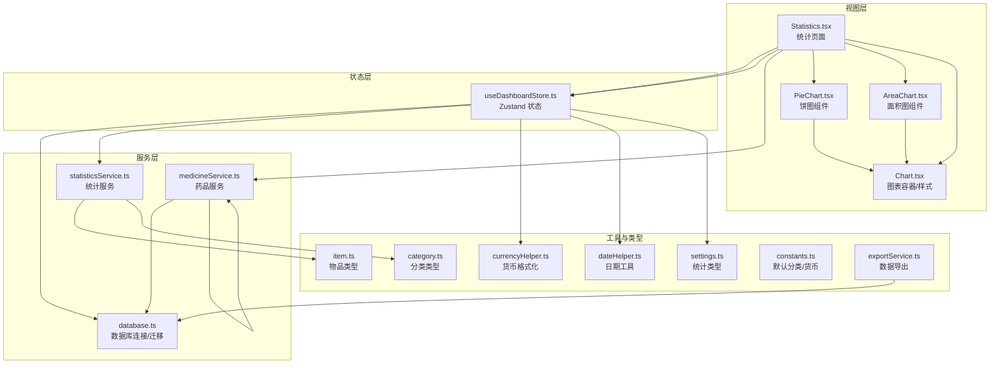
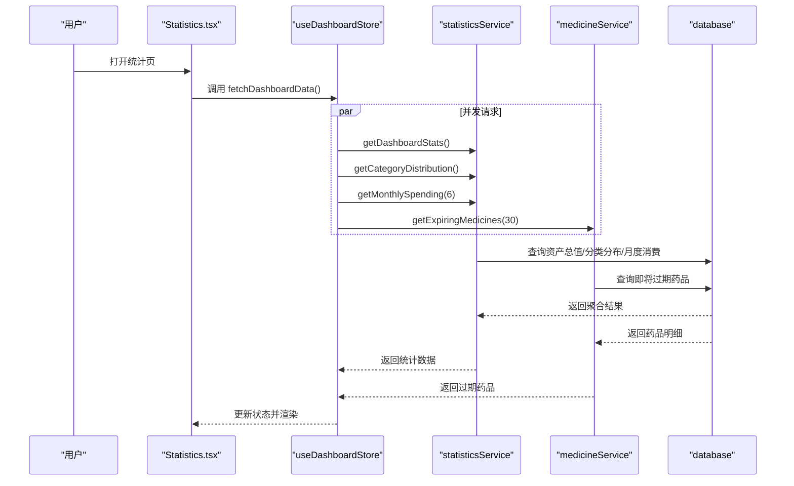
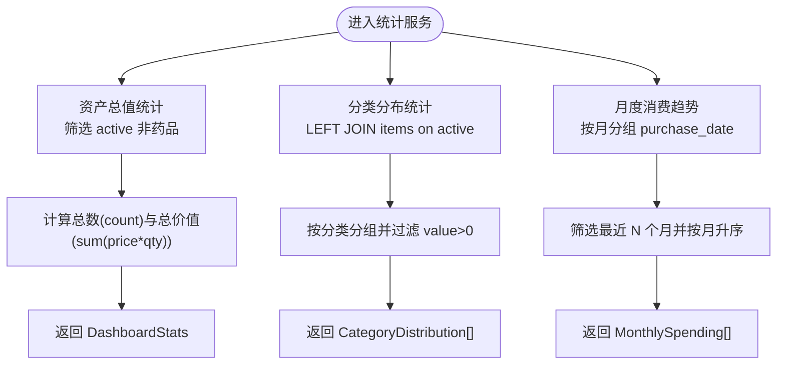
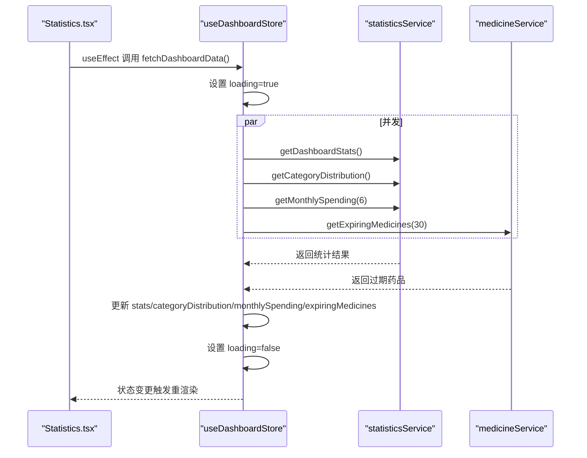
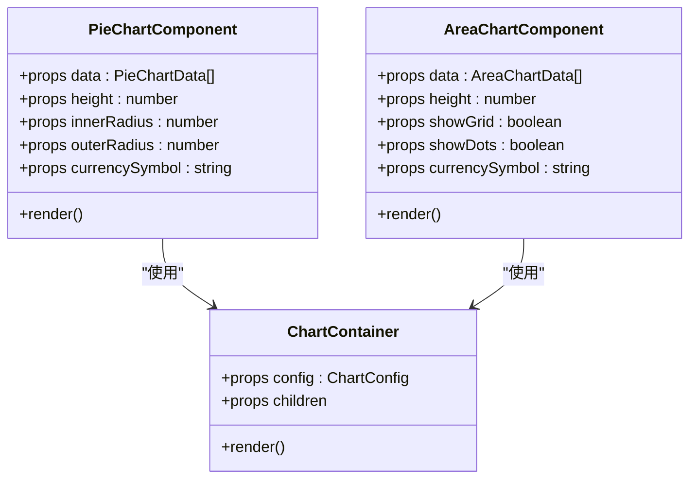
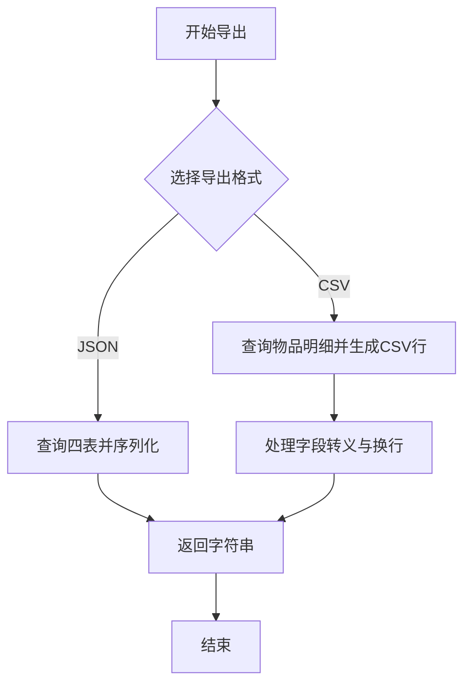
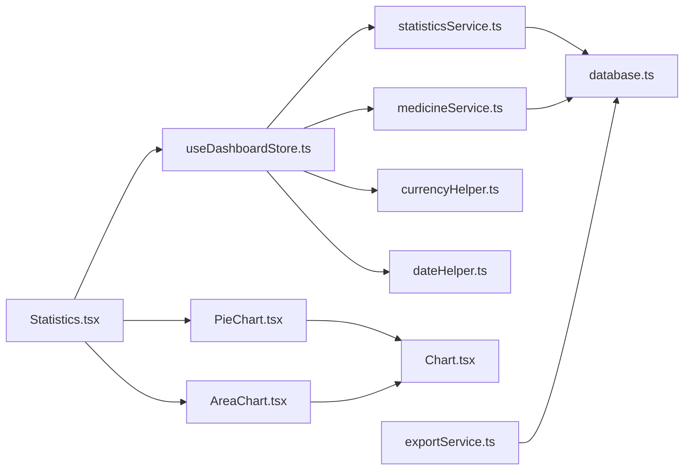
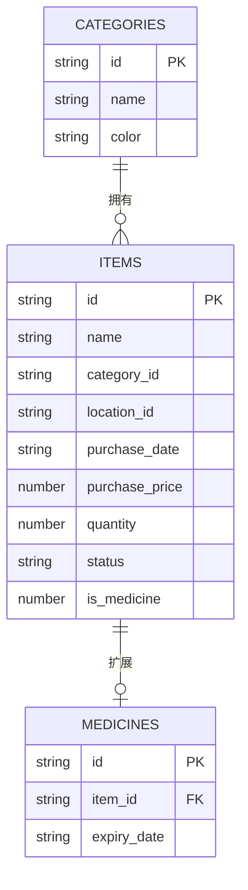

# 统计服务

<cite>
**本文引用的文件**
- [statisticsService.ts](file://src/services/statisticsService.ts)
- [Statistics.tsx](file://src/routes/Statistics.tsx)
- [useDashboardStore.ts](file://src/stores/useDashboardStore.ts)
- [settings.ts](file://src/types/settings.ts)
- [item.ts](file://src/types/item.ts)
- [category.ts](file://src/types/category.ts)
- [PieChart.tsx](file://src/components/charts/PieChart.tsx)
- [AreaChart.tsx](file://src/components/charts/AreaChart.tsx)
- [Chart.tsx](file://src/components/charts/Chart.tsx)
- [currencyHelper.ts](file://src/utils/currencyHelper.ts)
- [dateHelper.ts](file://src/utils/dateHelper.ts)
- [database.ts](file://src/services/database.ts)
- [medicineService.ts](file://src/services/medicineService.ts)
- [constants.ts](file://src/utils/constants.ts)
- [exportService.ts](file://src/services/exportService.ts)
- [README.md](file://README.md)
</cite>

## 目录
1. [简介](#简介)
2. [项目结构](#项目结构)
3. [核心组件](#核心组件)
4. [架构总览](#架构总览)
5. [详细组件分析](#详细组件分析)
6. [依赖关系分析](#依赖关系分析)
7. [性能考量](#性能考量)
8. [故障排查指南](#故障排查指南)
9. [结论](#结论)
10. [附录](#附录)

## 简介
本文件面向 Assetly 的统计服务，系统性阐述统计数据的计算逻辑、图表数据聚合算法、缓存与实时更新机制、统计报告生成流程以及统计 API 的接口规范与性能优化建议。内容覆盖资产总值统计、分类分布分析、时间序列消费趋势，并提供可视化与自定义报表能力的实现路径。

## 项目结构
统计服务围绕“服务层 → 状态层 → 视图层”的分层组织，配合 SQLite 数据库与 Recharts 图表组件，形成从前端到后端的闭环。

**图表来源**
- [Statistics.tsx:1-85](file://src/routes/Statistics.tsx#L1-L85)
- [PieChart.tsx:1-114](file://src/components/charts/PieChart.tsx#L1-L114)
- [AreaChart.tsx:1-94](file://src/components/charts/AreaChart.tsx#L1-L94)
- [Chart.tsx:1-330](file://src/components/charts/Chart.tsx#L1-L330)
- [useDashboardStore.ts:1-34](file://src/stores/useDashboardStore.ts#L1-L34)
- [statisticsService.ts:1-52](file://src/services/statisticsService.ts#L1-L52)
- [medicineService.ts:1-194](file://src/services/medicineService.ts#L1-L194)
- [database.ts:1-171](file://src/services/database.ts#L1-L171)
- [currencyHelper.ts:1-17](file://src/utils/currencyHelper.ts#L1-L17)
- [dateHelper.ts:1-52](file://src/utils/dateHelper.ts#L1-L52)
- [settings.ts:1-25](file://src/types/settings.ts#L1-L25)
- [item.ts:1-46](file://src/types/item.ts#L1-L46)
- [category.ts:1-18](file://src/types/category.ts#L1-L18)
- [constants.ts:1-40](file://src/utils/constants.ts#L1-L40)
- [exportService.ts:1-154](file://src/services/exportService.ts#L1-L154)

**章节来源**
- [README.md:54-59](file://README.md#L54-L59)
- [Statistics.tsx:1-85](file://src/routes/Statistics.tsx#L1-L85)
- [useDashboardStore.ts:1-34](file://src/stores/useDashboardStore.ts#L1-L34)
- [statisticsService.ts:1-52](file://src/services/statisticsService.ts#L1-L52)

## 核心组件
- 统计服务层：提供资产总值、分类分布、月度消费趋势等聚合查询。
- 状态管理层：统一拉取与缓存统计结果，支持并发请求与加载态控制。
- 视图层：渲染资产总览卡片、资产分布饼图、消费趋势面积图。
- 图表组件层：基于 Recharts 的可复用图表容器与样式系统。
- 工具层：货币格式化、日期处理、默认分类与货币符号常量。
- 数据导出：支持 JSON/CSV 导出，用于统计报告与迁移备份。

**章节来源**
- [statisticsService.ts:4-51](file://src/services/statisticsService.ts#L4-L51)
- [useDashboardStore.ts:16-33](file://src/stores/useDashboardStore.ts#L16-L33)
- [PieChart.tsx:28-114](file://src/components/charts/PieChart.tsx#L28-L114)
- [AreaChart.tsx:23-94](file://src/components/charts/AreaChart.tsx#L23-L94)
- [currencyHelper.ts:1-17](file://src/utils/currencyHelper.ts#L1-L17)
- [dateHelper.ts:49-51](file://src/utils/dateHelper.ts#L49-L51)
- [exportService.ts:4-44](file://src/services/exportService.ts#L4-L44)

## 架构总览
统计服务采用“服务层 SQL 聚合 + 前端状态缓存 + 图表渲染”的架构。服务层负责从 SQLite 中提取与聚合数据；状态层并发拉取多项指标并缓存；视图层根据状态渲染图表与卡片；工具层提供格式化与日期转换；导出服务提供报表级输出。

**图表来源**
- [Statistics.tsx:13-15](file://src/routes/Statistics.tsx#L13-L15)
- [useDashboardStore.ts:23-32](file://src/stores/useDashboardStore.ts#L23-L32)
- [statisticsService.ts:4-51](file://src/services/statisticsService.ts#L4-L51)
- [medicineService.ts:164-178](file://src/services/medicineService.ts#L164-L178)
- [database.ts:8-16](file://src/services/database.ts#L8-L16)

## 详细组件分析

### 统计服务（statisticsService）
- 资产总值统计：统计“服役中且非药品”的物品数量与总价值（单价×数量之和），过滤状态为“active”，排除 is_medicine=1 的条目。
- 分类分布分析：按分类汇总资产价值（单价×数量），仅统计 active 状态的物品，按价值降序排列，仅显示价值大于 0 的分类。
- 时间序列数据：按自然月对购买日期进行分组，统计每月消费金额，支持传入月份数量参数，默认近 6 个月。

**图表来源**
- [statisticsService.ts:4-51](file://src/services/statisticsService.ts#L4-L51)

**章节来源**
- [statisticsService.ts:4-51](file://src/services/statisticsService.ts#L4-L51)
- [settings.ts:8-24](file://src/types/settings.ts#L8-L24)
- [item.ts:3-22](file://src/types/item.ts#L3-L22)
- [category.ts:3-11](file://src/types/category.ts#L3-L11)

### 状态与页面（useDashboardStore 与 Statistics 页面）
- 状态缓存：使用 Zustand 缓存 DashboardStats、分类分布、月度消费、即将过期药品。
- 并发拉取：fetchDashboardData 使用 Promise.all 并行获取四项指标，减少首屏等待。
- 加载态：设置 loading 标志，避免重复请求与界面闪烁。
- 页面渲染：Statistics 页面展示资产总览卡片、资产分布饼图、消费趋势面积图；使用货币格式化与月份标签。

**图表来源**
- [Statistics.tsx:13-15](file://src/routes/Statistics.tsx#L13-L15)
- [useDashboardStore.ts:23-32](file://src/stores/useDashboardStore.ts#L23-L32)

**章节来源**
- [Statistics.tsx:9-85](file://src/routes/Statistics.tsx#L9-L85)
- [useDashboardStore.ts:16-33](file://src/stores/useDashboardStore.ts#L16-L33)
- [currencyHelper.ts:1-11](file://src/utils/currencyHelper.ts#L1-L11)
- [dateHelper.ts:49-51](file://src/utils/dateHelper.ts#L49-L51)

### 图表组件（PieChart 与 AreaChart）
- 饼图（资产分布）：接收分类名称、颜色与价值，计算总值并展示百分比；支持货币格式化提示与图例。
- 面积图（消费趋势）：接收月份标签与金额，支持网格、点标记与货币单位格式化；使用线性渐变填充增强视觉效果。
- 图表容器（Chart.tsx）：提供 Recharts 容器、样式注入、主题色映射与 Tooltip/Legend 内容定制。

**图表来源**
- [PieChart.tsx:28-114](file://src/components/charts/PieChart.tsx#L28-L114)
- [AreaChart.tsx:23-94](file://src/components/charts/AreaChart.tsx#L23-L94)
- [Chart.tsx:32-62](file://src/components/charts/Chart.tsx#L32-L62)

**章节来源**
- [PieChart.tsx:12-114](file://src/components/charts/PieChart.tsx#L12-L114)
- [AreaChart.tsx:9-94](file://src/components/charts/AreaChart.tsx#L9-L94)
- [Chart.tsx:8-330](file://src/components/charts/Chart.tsx#L8-L330)

### 数据导出与报表（exportService）
- JSON 导出：导出分类、位置、物品、药品四表数据，便于完整备份与跨设备迁移。
- CSV 导出：按物品维度导出关键字段（名称、分类、位置、购买日期、价格、数量、状态、有效期、药品类型），支持逗号与引号转义。
- 导入流程：支持从 JSON 恢复四表数据，逐条插入并记录成功/失败与错误信息。

**图表来源**
- [exportService.ts:4-44](file://src/services/exportService.ts#L4-L44)
- [exportService.ts:53-153](file://src/services/exportService.ts#L53-L153)

**章节来源**
- [exportService.ts:1-154](file://src/services/exportService.ts#L1-L154)

## 依赖关系分析
- 统计服务依赖数据库连接与迁移，确保表结构与索引就绪。
- 状态层依赖统计服务与药品服务，聚合多源数据。
- 视图层依赖状态层与图表组件，负责 UI 渲染与交互。
- 工具层被统计与视图层广泛使用，提供格式化与日期转换。

**图表来源**
- [statisticsService.ts:1-2](file://src/services/statisticsService.ts#L1-L2)
- [database.ts:1-4](file://src/services/database.ts#L1-L4)
- [useDashboardStore.ts:1-4](file://src/stores/useDashboardStore.ts#L1-L4)
- [Statistics.tsx:1-7](file://src/routes/Statistics.tsx#L1-L7)
- [PieChart.tsx:1-8](file://src/components/charts/PieChart.tsx#L1-L8)
- [AreaChart.tsx:1-6](file://src/components/charts/AreaChart.tsx#L1-L6)
- [Chart.tsx:1-3](file://src/components/charts/Chart.tsx#L1-L3)
- [currencyHelper.ts:1-2](file://src/utils/currencyHelper.ts#L1-L2)
- [dateHelper.ts:1-2](file://src/utils/dateHelper.ts#L1-L2)
- [exportService.ts:1-2](file://src/services/exportService.ts#L1-L2)

**章节来源**
- [database.ts:8-53](file://src/services/database.ts#L8-L53)
- [useDashboardStore.ts:16-33](file://src/stores/useDashboardStore.ts#L16-L33)
- [Statistics.tsx:9-85](file://src/routes/Statistics.tsx#L9-L85)

## 性能考量
- 并发请求：使用 Promise.all 并行拉取四项指标，降低首屏等待时间。
- 数据库索引：items、medicines、locations 等表具备必要索引，提升 JOIN 与条件查询效率。
- 月度聚合：使用 SQLite 的 strftime 与 date 函数进行原生分组与范围过滤，避免应用层二次处理。
- 图表渲染：Recharts 默认关闭动画与启用 isAnimationActive=false，减少重绘开销。
- 格式化优化：货币格式化按阈值切换“万元”单位，提升长数字可读性。
- 导出性能：CSV 导出采用单次查询与一次性拼接，避免多次 I/O。

**章节来源**
- [useDashboardStore.ts:25-31](file://src/stores/useDashboardStore.ts#L25-L31)
- [database.ts:124-131](file://src/services/database.ts#L124-L131)
- [statisticsService.ts:43-49](file://src/services/statisticsService.ts#L43-L49)
- [PieChart.tsx:82-88](file://src/components/charts/PieChart.tsx#L82-L88)
- [AreaChart.tsx:87-88](file://src/components/charts/AreaChart.tsx#L87-L88)
- [currencyHelper.ts:3-6](file://src/utils/currencyHelper.ts#L3-L6)
- [exportService.ts:18-43](file://src/services/exportService.ts#L18-L43)

## 故障排查指南
- 数据库连接失败：检查 getDb 是否成功初始化与迁移是否完成。
- 统计为空：确认 items 表中存在 status='active' 的记录；检查分类与药品标识字段。
- 图表无数据：确认传入数据数组非空；检查货币符号与月份标签格式。
- 导出异常：JSON 解析失败时检查数据完整性；CSV 导出前确保查询返回非空结果。
- 过期药品查询：确认 expiry_date 与状态过滤条件正确。

**章节来源**
- [database.ts:8-16](file://src/services/database.ts#L8-L16)
- [database.ts:18-53](file://src/services/database.ts#L18-L53)
- [statisticsService.ts:28-38](file://src/services/statisticsService.ts#L28-L38)
- [PieChart.tsx:54-60](file://src/components/charts/PieChart.tsx#L54-L60)
- [exportService.ts:58-63](file://src/services/exportService.ts#L58-L63)
- [medicineService.ts:164-178](file://src/services/medicineService.ts#L164-L178)

## 结论
统计服务以简洁的 SQL 聚合为核心，结合前端并发拉取与缓存，实现了资产总值、分类分布与消费趋势的高效展示。通过 Recharts 图表与格式化工具，用户可直观理解资产结构与变化。导出服务提供了完整的报表能力，满足备份与迁移需求。未来可在以下方面持续优化：增加增量更新策略、支持更细粒度的时间维度与位置维度聚合、引入本地缓存失效策略与批量刷新机制。

## 附录

### 统计 API 接口文档
- 获取仪表盘统计
  - 方法：GET
  - 路径：/dashboard/stats
  - 查询参数：无
  - 响应：DashboardStats
    - total_items: number
    - total_value: number
    - medicine_count: number
    - expiring_count: number
  - 示例：见 [statisticsService.ts:4-26](file://src/services/statisticsService.ts#L4-L26)

- 获取分类分布
  - 方法：GET
  - 路径：/category/distribution
  - 查询参数：无
  - 响应：CategoryDistribution[]
    - name: string
    - value: number
    - color: string
  - 示例：见 [statisticsService.ts:28-38](file://src/services/statisticsService.ts#L28-L38)

- 获取月度消费趋势
  - 方法：GET
  - 路径：/monthly/spending
  - 查询参数：months: number（默认 6）
  - 响应：MonthlySpending[]
    - month: string（格式：YYYY-MM）
    - amount: number
  - 示例：见 [statisticsService.ts:40-51](file://src/services/statisticsService.ts#L40-L51)

- 获取即将过期药品（用于仪表盘补充）
  - 方法：GET
  - 路径：/medicines/expiring
  - 查询参数：withinDays: number（默认 30）
  - 响应：MedicineWithItem[]
  - 示例：见 [medicineService.ts:164-178](file://src/services/medicineService.ts#L164-L178)

**章节来源**
- [statisticsService.ts:4-51](file://src/services/statisticsService.ts#L4-L51)
- [medicineService.ts:164-178](file://src/services/medicineService.ts#L164-L178)
- [settings.ts:8-24](file://src/types/settings.ts#L8-L24)

### 数据模型与类型
- DashboardStats：资产总览指标集合
- CategoryDistribution：分类分布（含颜色）
- MonthlySpending：月度消费（自然月）
- Item：物品基础字段（含状态、价格、数量、购买日期）
- Category：分类字段（含颜色）

**图表来源**
- [item.ts:5-22](file://src/types/item.ts#L5-L22)
- [category.ts:3-11](file://src/types/category.ts#L3-L11)
- [statisticsService.ts:30-37](file://src/services/statisticsService.ts#L30-L37)

**章节来源**
- [settings.ts:8-24](file://src/types/settings.ts#L8-L24)
- [item.ts:5-22](file://src/types/item.ts#L5-L22)
- [category.ts:3-11](file://src/types/category.ts#L3-L11)

### 可视化与自定义报表
- 可视化支持：饼图展示分类占比，面积图展示月度消费趋势；支持货币符号与月份标签格式化。
- 自定义报表：通过导出 JSON/CSV 生成自定义报告；CSV 包含物品关键字段，便于 Excel/表格软件进一步分析。

**章节来源**
- [PieChart.tsx:28-114](file://src/components/charts/PieChart.tsx#L28-L114)
- [AreaChart.tsx:23-94](file://src/components/charts/AreaChart.tsx#L23-L94)
- [exportService.ts:15-44](file://src/services/exportService.ts#L15-L44)
- [constants.ts:38-40](file://src/utils/constants.ts#L38-L40)