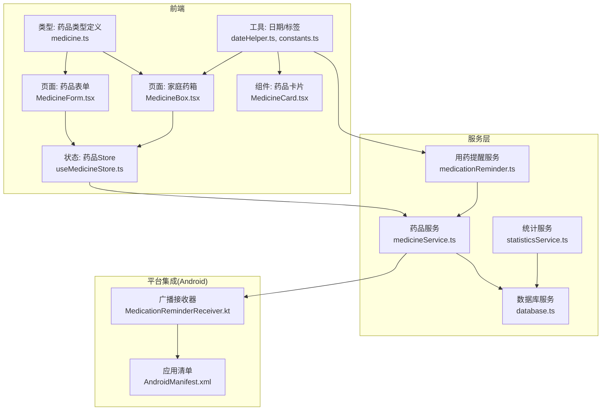
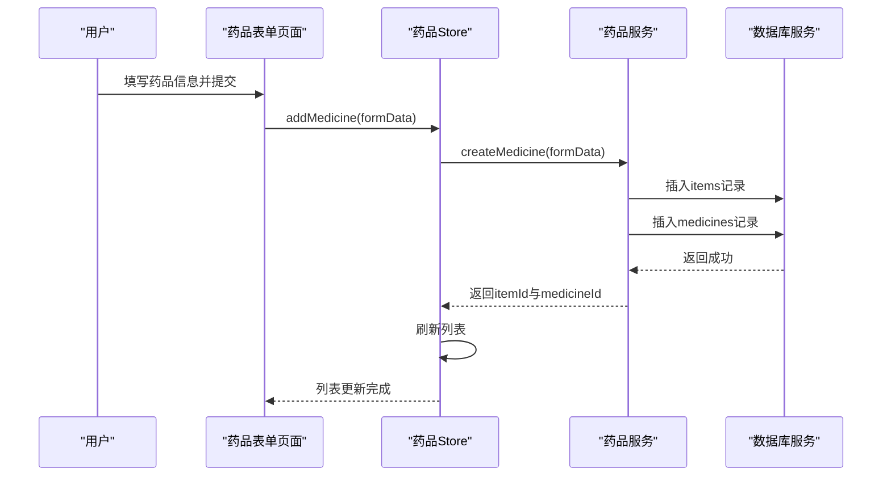
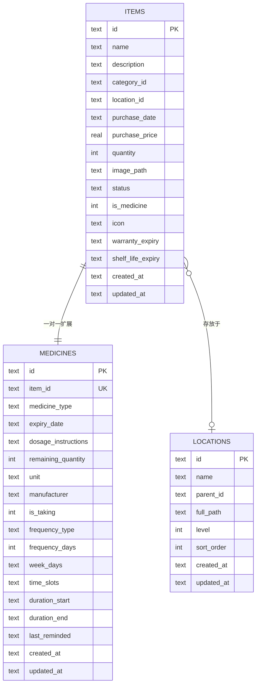
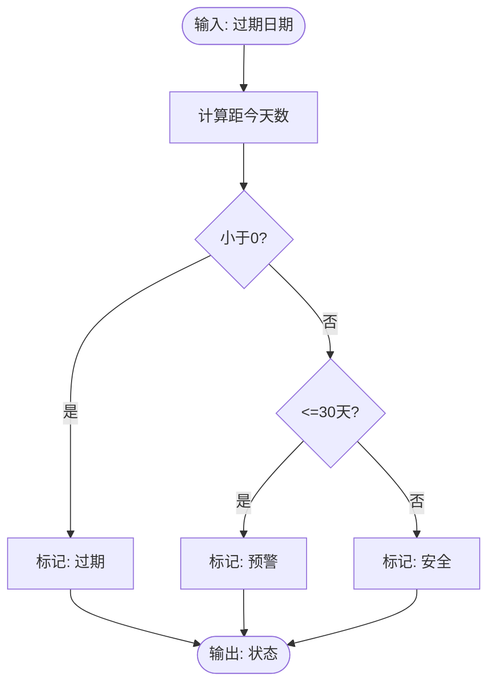
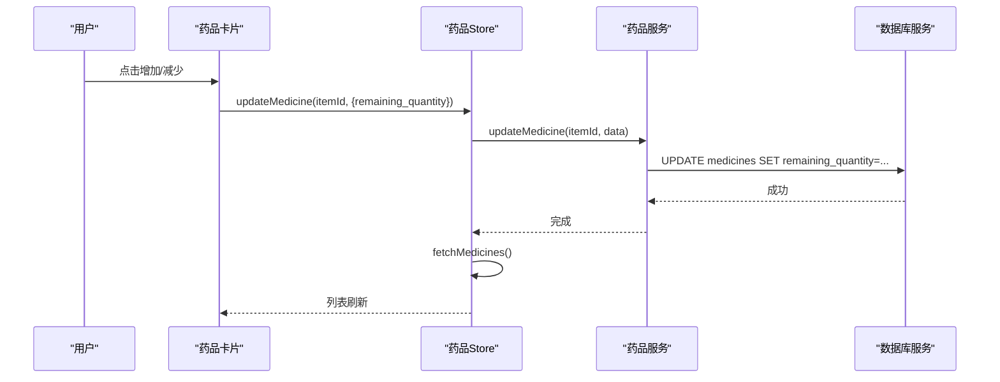
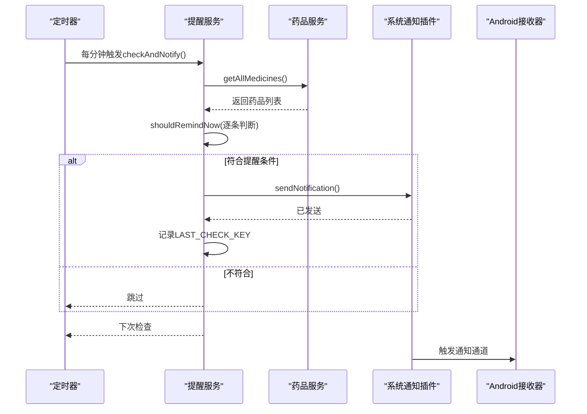
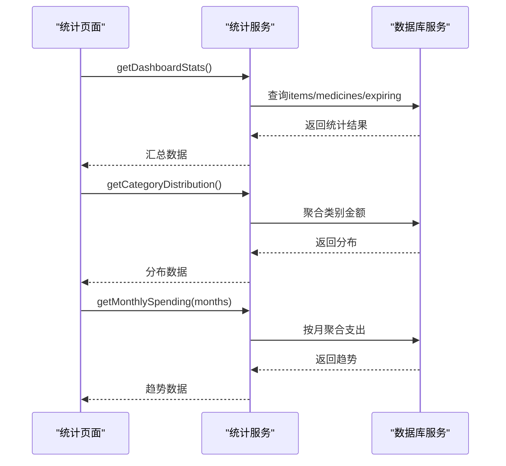
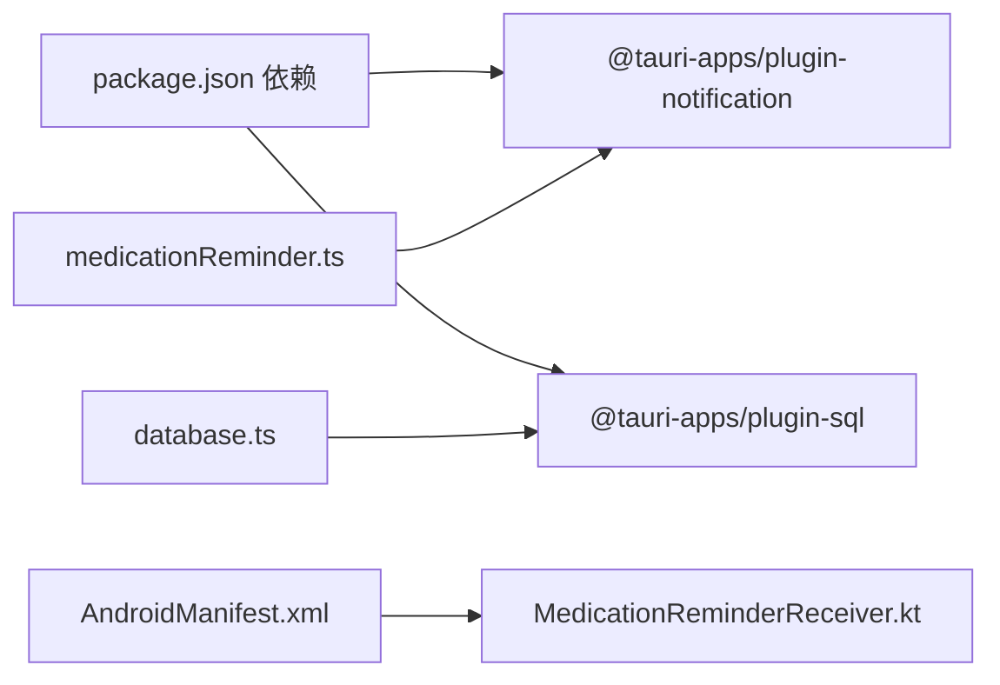

# 药品服务

<cite>
**本文引用的文件**
- [src/types/medicine.ts](file://src/types/medicine.ts)
- [src/services/medicineService.ts](file://src/services/medicineService.ts)
- [src/stores/useMedicineStore.ts](file://src/stores/useMedicineStore.ts)
- [src/routes/MedicineForm.tsx](file://src/routes/MedicineForm.tsx)
- [src/routes/MedicineBox.tsx](file://src/routes/MedicineBox.tsx)
- [src/components/medicine/MedicineCard.tsx](file://src/components/medicine/MedicineCard.tsx)
- [src/utils/dateHelper.ts](file://src/utils/dateHelper.ts)
- [src/services/statisticsService.ts](file://src/services/statisticsService.ts)
- [src/utils/constants.ts](file://src/utils/constants.ts)
- [src/services/medicationReminder.ts](file://src/services/medicationReminder.ts)
- [src-tauri/gen/android/app/src/main/java/com/assetly/home/MedicationReminderReceiver.kt](file://src-tauri/gen/android/app/src/main/java/com/assetly/home/MedicationReminderReceiver.kt)
- [src-tauri/gen/android/app/src/main/AndroidManifest.xml](file://src-tauri/gen/android/app/src/main/AndroidManifest.xml)
- [src/services/database.ts](file://src/services/database.ts)
- [package.json](file://package.json)
</cite>

## 目录
1. [简介](#简介)
2. [项目结构](#项目结构)
3. [核心组件](#核心组件)
4. [架构总览](#架构总览)
5. [详细组件分析](#详细组件分析)
6. [依赖关系分析](#依赖关系分析)
7. [性能考量](#性能考量)
8. [故障排查指南](#故障排查指南)
9. [结论](#结论)
10. [附录](#附录)

## 简介
本文件系统化梳理 Assetly 的“药品服务”，围绕药品数据模型扩展（与物品表的一对一关联）、药品过期日期计算、剩余数量管理、用药提醒配置、药品类型分类管理、数据完整性约束以及数据操作示例与统计分析进行深入说明，并提供可操作的流程图与时序图帮助理解。

## 项目结构
围绕药品服务的关键前端模块与后端服务如下：
- 类型定义：src/types/medicine.ts
- 服务层：src/services/medicineService.ts、src/services/medicationReminder.ts、src/services/statisticsService.ts、src/services/database.ts
- 状态管理：src/stores/useMedicineStore.ts
- 页面与组件：src/routes/MedicineBox.tsx、src/routes/MedicineForm.tsx、src/components/medicine/MedicineCard.tsx
- 工具函数：src/utils/dateHelper.ts、src/utils/constants.ts
- 平台集成（Android）：src-tauri/gen/android/app/src/main/java/com/assetly/home/MedicationReminderReceiver.kt、AndroidManifest.xml

图表来源
- [src/routes/MedicineForm.tsx:1-401](file://src/routes/MedicineForm.tsx#L1-L401)
- [src/routes/MedicineBox.tsx:1-112](file://src/routes/MedicineBox.tsx#L1-L112)
- [src/components/medicine/MedicineCard.tsx:1-147](file://src/components/medicine/MedicineCard.tsx#L1-L147)
- [src/stores/useMedicineStore.ts:1-42](file://src/stores/useMedicineStore.ts#L1-L42)
- [src/types/medicine.ts:1-70](file://src/types/medicine.ts#L1-L70)
- [src/utils/dateHelper.ts:1-52](file://src/utils/dateHelper.ts#L1-L52)
- [src/utils/constants.ts:1-40](file://src/utils/constants.ts#L1-L40)
- [src/services/medicineService.ts:1-194](file://src/services/medicineService.ts#L1-L194)
- [src/services/medicationReminder.ts:1-132](file://src/services/medicationReminder.ts#L1-L132)
- [src/services/statisticsService.ts:1-52](file://src/services/statisticsService.ts#L1-L52)
- [src/services/database.ts:1-171](file://src/services/database.ts#L1-L171)
- [src-tauri/gen/android/app/src/main/java/com/assetly/home/MedicationReminderReceiver.kt:1-68](file://src-tauri/gen/android/app/src/main/java/com/assetly/home/MedicationReminderReceiver.kt#L1-L68)
- [src-tauri/gen/android/app/src/main/AndroidManifest.xml:1-49](file://src-tauri/gen/android/app/src/main/AndroidManifest.xml#L1-L49)

章节来源
- [src/routes/MedicineForm.tsx:1-401](file://src/routes/MedicineForm.tsx#L1-L401)
- [src/routes/MedicineBox.tsx:1-112](file://src/routes/MedicineBox.tsx#L1-L112)
- [src/components/medicine/MedicineCard.tsx:1-147](file://src/components/medicine/MedicineCard.tsx#L1-L147)
- [src/stores/useMedicineStore.ts:1-42](file://src/stores/useMedicineStore.ts#L1-L42)
- [src/types/medicine.ts:1-70](file://src/types/medicine.ts#L1-L70)
- [src/utils/dateHelper.ts:1-52](file://src/utils/dateHelper.ts#L1-L52)
- [src/utils/constants.ts:1-40](file://src/utils/constants.ts#L1-L40)
- [src/services/medicineService.ts:1-194](file://src/services/medicineService.ts#L1-L194)
- [src/services/medicationReminder.ts:1-132](file://src/services/medicationReminder.ts#L1-L132)
- [src/services/statisticsService.ts:1-52](file://src/services/statisticsService.ts#L1-L52)
- [src/services/database.ts:1-171](file://src/services/database.ts#L1-L171)
- [src-tauri/gen/android/app/src/main/java/com/assetly/home/MedicationReminderReceiver.kt:1-68](file://src-tauri/gen/android/app/src/main/java/com/assetly/home/MedicationReminderReceiver.kt#L1-L68)
- [src-tauri/gen/android/app/src/main/AndroidManifest.xml:1-49](file://src-tauri/gen/android/app/src/main/AndroidManifest.xml#L1-L49)

## 核心组件
- 数据模型与类型
  - 药品类别：internal（内服）、external（外用）、emergency（急救）
  - 过期状态：safe（安全）、warning（预警）、expired（过期）
  - 用药频率：daily（每日）、every_n_days（每隔N天）、weekly（每周）
  - 关键字段：药品类型、有效期、用量说明、剩余数量、单位、厂商、是否正在服用、频率类型、周期、上次提醒时间等
- 服务接口
  - 获取所有药品、按条件过滤、按物品ID查询、创建药品、更新药品、查询即将到期、查询正在服用
- 状态与路由
  - 药品Store负责加载、新增、更新、切换标签页
  - 药品列表页支持按类型筛选、显示过期/预警提示
  - 药品表单页支持基础信息、购买信息、用药提醒配置
- 提醒与统计
  - 通过定时任务检查并发送通知
  - 统计首页指标（药品总数、即将过期数量等）

章节来源
- [src/types/medicine.ts:1-70](file://src/types/medicine.ts#L1-L70)
- [src/services/medicineService.ts:10-194](file://src/services/medicineService.ts#L10-L194)
- [src/stores/useMedicineStore.ts:1-42](file://src/stores/useMedicineStore.ts#L1-L42)
- [src/routes/MedicineBox.tsx:1-112](file://src/routes/MedicineBox.tsx#L1-L112)
- [src/routes/MedicineForm.tsx:1-401](file://src/routes/MedicineForm.tsx#L1-L401)
- [src/services/medicationReminder.ts:1-132](file://src/services/medicationReminder.ts#L1-L132)
- [src/services/statisticsService.ts:1-52](file://src/services/statisticsService.ts#L1-L52)

## 架构总览
药品服务采用“类型定义 → 服务层 → 状态/路由 → UI 组件”的分层设计，数据通过 SQLite（Tauri SQL 插件）持久化，配合数据库迁移脚本确保表结构演进。

图表来源
- [src/routes/MedicineForm.tsx:66-80](file://src/routes/MedicineForm.tsx#L66-L80)
- [src/stores/useMedicineStore.ts:28-31](file://src/stores/useMedicineStore.ts#L28-L31)
- [src/services/medicineService.ts:54-95](file://src/services/medicineService.ts#L54-L95)
- [src/services/database.ts:8-16](file://src/services/database.ts#L8-L16)

## 详细组件分析

### 数据模型与扩展设计
- 一对一关联
  - medicines.item_id 引用 items.id，且设置唯一约束，保证每个药品仅对应一个物品
  - 删除物品时，通过外键级联删除药品扩展记录
- 药品特有字段
  - 包含类型、有效期、用量说明、剩余数量、单位、厂商、提醒相关字段（是否正在服用、频率类型、周期、时间点等）
- 分类管理
  - 默认分类中包含“药品保健”类别，创建药品时可自动绑定该分类或使用传入的分类ID

图表来源
- [src/services/database.ts:104-117](file://src/services/database.ts#L104-L117)
- [src/services/database.ts:76-87](file://src/services/database.ts#L76-L87)
- [src/types/medicine.ts:7-41](file://src/types/medicine.ts#L7-L41)

章节来源
- [src/services/database.ts:104-117](file://src/services/database.ts#L104-L117)
- [src/types/medicine.ts:1-70](file://src/types/medicine.ts#L1-L70)

### 过期日期计算与状态展示
- 计算逻辑
  - 使用相对天数判断：距离过期日小于0为过期；在0~30天之间为预警；否则为安全
- 展示策略
  - 列表页顶部聚合显示“已过期/即将过期”数量
  - 卡片组件根据过期状态渲染徽标与颜色

图表来源
- [src/utils/dateHelper.ts:30-43](file://src/utils/dateHelper.ts#L30-L43)
- [src/routes/MedicineBox.tsx:38-67](file://src/routes/MedicineBox.tsx#L38-L67)
- [src/components/medicine/MedicineCard.tsx:22-47](file://src/components/medicine/MedicineCard.tsx#L22-L47)

章节来源
- [src/utils/dateHelper.ts:1-52](file://src/utils/dateHelper.ts#L1-L52)
- [src/routes/MedicineBox.tsx:1-112](file://src/routes/MedicineBox.tsx#L1-L112)
- [src/components/medicine/MedicineCard.tsx:1-147](file://src/components/medicine/MedicineCard.tsx#L1-L147)

### 剩余数量管理
- 支持在卡片中快速增减库存
- 更新逻辑通过 Store 调用服务层，最终回写数据库并刷新列表

图表来源
- [src/components/medicine/MedicineCard.tsx:17-20](file://src/components/medicine/MedicineCard.tsx#L17-L20)
- [src/routes/MedicineBox.tsx:31-36](file://src/routes/MedicineBox.tsx#L31-L36)
- [src/stores/useMedicineStore.ts:33-36](file://src/stores/useMedicineStore.ts#L33-L36)
- [src/services/medicineService.ts:97-162](file://src/services/medicineService.ts#L97-L162)
- [src/services/database.ts:8-16](file://src/services/database.ts#L8-L16)

章节来源
- [src/routes/MedicineBox.tsx:1-112](file://src/routes/MedicineBox.tsx#L1-L112)
- [src/components/medicine/MedicineCard.tsx:1-147](file://src/components/medicine/MedicineCard.tsx#L1-L147)
- [src/stores/useMedicineStore.ts:1-42](file://src/stores/useMedicineStore.ts#L1-L42)
- [src/services/medicineService.ts:1-194](file://src/services/medicineService.ts#L1-L194)

### 用药提醒配置与实现
- 配置项
  - 是否正在服用、频率类型（每日/每隔N天/每周）、周期起止、时间点集合
- 触发逻辑
  - 启动定时器，每分钟检查一次
  - 根据频率类型与当前时间匹配决定是否提醒
  - 发送系统通知，并记录最近检查时间避免重复提醒
- Android 平台
  - 注册通知渠道与广播接收器，收到提醒时弹出通知

图表来源
- [src/services/medicationReminder.ts:53-97](file://src/services/medicationReminder.ts#L53-L97)
- [src/services/medicationReminder.ts:102-131](file://src/services/medicationReminder.ts#L102-L131)
- [src/services/medicineService.ts:10-37](file://src/services/medicineService.ts#L10-L37)
- [src-tauri/gen/android/app/src/main/java/com/assetly/home/MedicationReminderReceiver.kt:20-66](file://src-tauri/gen/android/app/src/main/java/com/assetly/home/MedicationReminderReceiver.kt#L20-L66)
- [src-tauri/gen/android/app/src/main/AndroidManifest.xml:42-46](file://src-tauri/gen/android/app/src/main/AndroidManifest.xml#L42-L46)

章节来源
- [src/services/medicationReminder.ts:1-132](file://src/services/medicationReminder.ts#L1-L132)
- [src/services/medicineService.ts:1-194](file://src/services/medicineService.ts#L1-L194)
- [src-tauri/gen/android/app/src/main/java/com/assetly/home/MedicationReminderReceiver.kt:1-68](file://src-tauri/gen/android/app/src/main/java/com/assetly/home/MedicationReminderReceiver.kt#L1-L68)
- [src-tauri/gen/android/app/src/main/AndroidManifest.xml:1-49](file://src-tauri/gen/android/app/src/main/AndroidManifest.xml#L1-L49)

### 药品类型分类管理
- 类型枚举：internal、external、emergency
- 前端展示标签映射与页面筛选
- 数据库层面通过 medicines.medicine_type 字段存储

章节来源
- [src/types/medicine.ts:3](file://src/types/medicine.ts#L3)
- [src/utils/constants.ts:15-20](file://src/utils/constants.ts#L15-L20)
- [src/routes/MedicineBox.tsx:11-16](file://src/routes/MedicineBox.tsx#L11-L16)
- [src/services/medicineService.ts:26-33](file://src/services/medicineService.ts#L26-L33)

### 数据完整性约束与业务规则
- 唯一性约束
  - medicines.item_id 唯一，确保一对一关系
- 外键约束
  - medicines.item_id 外键引用 items.id，并设置级联删除
- 业务规则
  - 创建药品时自动绑定“药品保健”分类（若未指定）
  - 用药提醒需在有效期内、满足频率与时间点匹配
  - 剩余数量不得为负

章节来源
- [src/services/database.ts:107](file://src/services/database.ts#L107)
- [src/services/database.ts:116](file://src/services/database.ts#L116)
- [src/services/medicineService.ts:60-64](file://src/services/medicineService.ts#L60-L64)
- [src/services/medicationReminder.ts:11-48](file://src/services/medicationReminder.ts#L11-L48)
- [src/routes/MedicineBox.tsx:34](file://src/routes/MedicineBox.tsx#L34)

### 数据操作示例（新增/更新/删除/查询）
- 新增
  - 表单提交 → Store.addMedicine → 服务层创建物品与药品记录 → 刷新列表
- 查询
  - 列表页：getAllMedicines（支持类型/名称过滤）
  - 详情页：getMedicineByItemId
- 更新
  - 表单提交 → Store.updateMedicine → 服务层分别更新 items 与 medicines
- 删除
  - 表单页删除按钮 → 调用物品删除（级联删除药品扩展）

章节来源
- [src/routes/MedicineForm.tsx:66-80](file://src/routes/MedicineForm.tsx#L66-L80)
- [src/stores/useMedicineStore.ts:28-36](file://src/stores/useMedicineStore.ts#L28-L36)
- [src/services/medicineService.ts:10-52](file://src/services/medicineService.ts#L10-L52)
- [src/services/medicineService.ts:97-162](file://src/services/medicineService.ts#L97-L162)

### 统计分析与报表机制
- 仪表盘指标
  - 总物品数、总价值（非药品）、药品总数、即将过期数量
- 类别分布
  - 按类别汇总金额占比
- 月度支出
  - 指定月份数的购买金额趋势

图表来源
- [src/services/statisticsService.ts:4-26](file://src/services/statisticsService.ts#L4-L26)
- [src/services/statisticsService.ts:28-38](file://src/services/statisticsService.ts#L28-L38)
- [src/services/statisticsService.ts:40-51](file://src/services/statisticsService.ts#L40-L51)

章节来源
- [src/services/statisticsService.ts:1-52](file://src/services/statisticsService.ts#L1-L52)

## 依赖关系分析
- 前端依赖
  - @tauri-apps/plugin-notification、@tauri-apps/plugin-sql 等用于通知与数据库访问
- 数据库迁移
  - 版本化迁移确保表结构演进与默认数据注入
- 平台集成
  - Android 通知渠道与广播接收器注册，确保提醒可用

图表来源
- [package.json:12-30](file://package.json#L12-L30)
- [src/services/database.ts:1-171](file://src/services/database.ts#L1-L171)
- [src/services/medicationReminder.ts:1-132](file://src/services/medicationReminder.ts#L1-L132)
- [src-tauri/gen/android/app/src/main/AndroidManifest.xml:42-46](file://src-tauri/gen/android/app/src/main/AndroidManifest.xml#L42-L46)
- [src-tauri/gen/android/app/src/main/java/com/assetly/home/MedicationReminderReceiver.kt:12-26](file://src-tauri/gen/android/app/src/main/java/com/assetly/home/MedicationReminderReceiver.kt#L12-L26)

章节来源
- [package.json:1-43](file://package.json#L1-L43)
- [src/services/database.ts:1-171](file://src/services/database.ts#L1-L171)
- [src/services/medicationReminder.ts:1-132](file://src/services/medicationReminder.ts#L1-L132)
- [src-tauri/gen/android/app/src/main/AndroidManifest.xml:1-49](file://src-tauri/gen/android/app/src/main/AndroidManifest.xml#L1-L49)
- [src-tauri/gen/android/app/src/main/java/com/assetly/home/MedicationReminderReceiver.kt:1-68](file://src-tauri/gen/android/app/src/main/java/com/assetly/home/MedicationReminderReceiver.kt#L1-L68)

## 性能考量
- 查询优化
  - 对 items、medicines、locations 等关键字段建立索引，提升过滤与连接效率
- 写入优化
  - 批量更新字段时按需拼接 SQL，减少不必要的列更新
- 提醒检查
  - 每分钟检查一次，避免频繁 IO；本地记录最近检查时间，防止重复提醒
- 存储与迁移
  - 使用版本化迁移，避免重复执行 SQL，确保初始化成本可控

章节来源
- [src/services/database.ts:124-131](file://src/services/database.ts#L124-L131)
- [src/services/medicineService.ts:101-161](file://src/services/medicineService.ts#L101-L161)
- [src/services/medicationReminder.ts:68-96](file://src/services/medicationReminder.ts#L68-L96)

## 故障排查指南
- 无法创建药品
  - 检查分类是否存在或传入的分类ID是否正确
  - 确认数据库连接与迁移是否完成
- 无法收到提醒
  - 检查通知权限是否授予
  - 确认频率与时间点配置是否合理
  - 查看 Android 通知渠道与广播接收器是否注册
- 列表不刷新
  - 确认 Store 在新增/更新后调用了 fetchMedicines
  - 检查过滤条件（类型/搜索）是否导致结果为空

章节来源
- [src/services/medicineService.ts:60-64](file://src/services/medicineService.ts#L60-L64)
- [src/services/database.ts:8-16](file://src/services/database.ts#L8-L16)
- [src/services/medicationReminder.ts:55-66](file://src/services/medicationReminder.ts#L55-L66)
- [src-tauri/gen/android/app/src/main/AndroidManifest.xml:42-46](file://src-tauri/gen/android/app/src/main/AndroidManifest.xml#L42-L46)
- [src/stores/useMedicineStore.ts:20-36](file://src/stores/useMedicineStore.ts#L20-L36)

## 结论
Assetly 的药品服务以清晰的数据模型与完善的业务流程为基础，结合提醒与统计能力，形成从录入到日常管理的闭环。通过版本化迁移与索引优化，保障了系统的可维护性与性能。建议在后续迭代中进一步完善提醒策略（如“稍后提醒”动作处理）与报表导出能力。

## 附录
- 快速操作路径参考
  - 新增药品：/medicine/new → 填写表单 → 保存
  - 编辑药品：/medicine/:id/edit → 修改信息 → 保存
  - 删除药品：编辑页删除按钮 → 确认对话框
  - 查看待服药品：/medicine → 点击“正在服用”标签
  - 查看即将过期：/medicine → 列表顶部提示