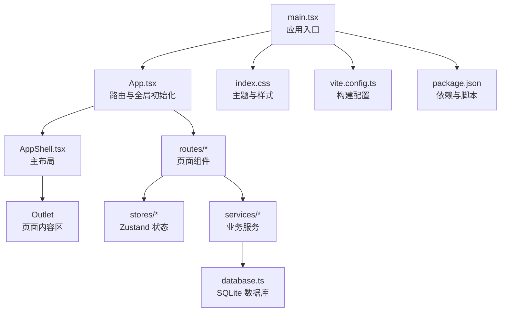
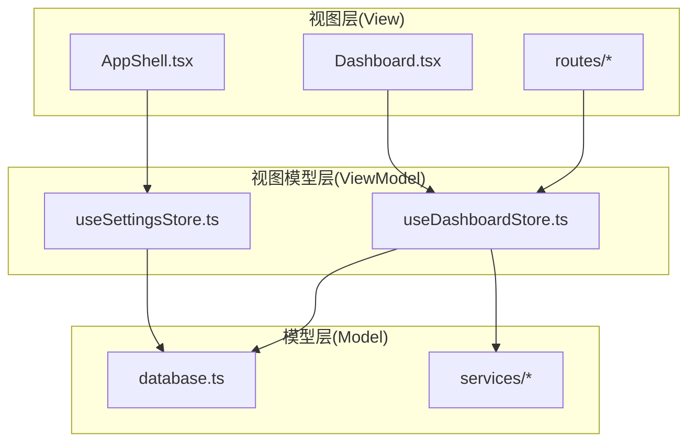
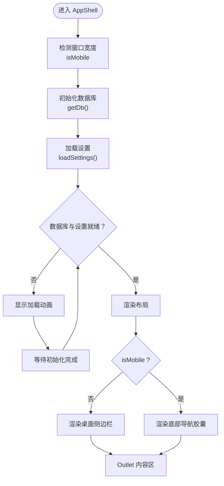
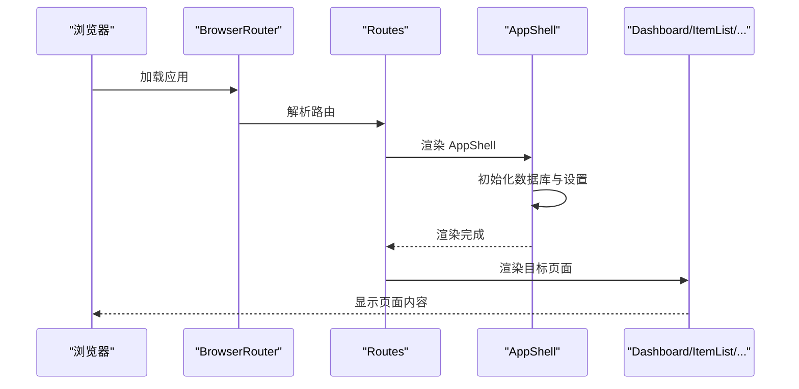
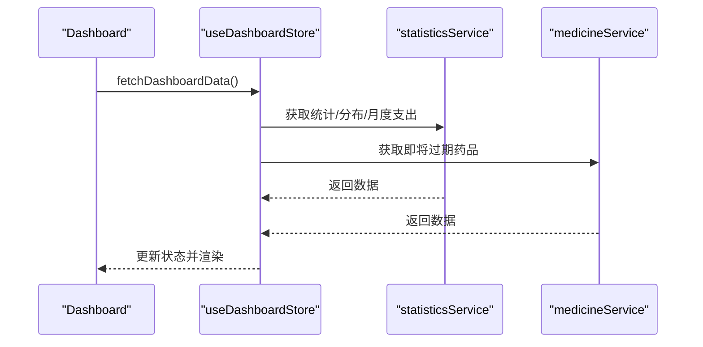
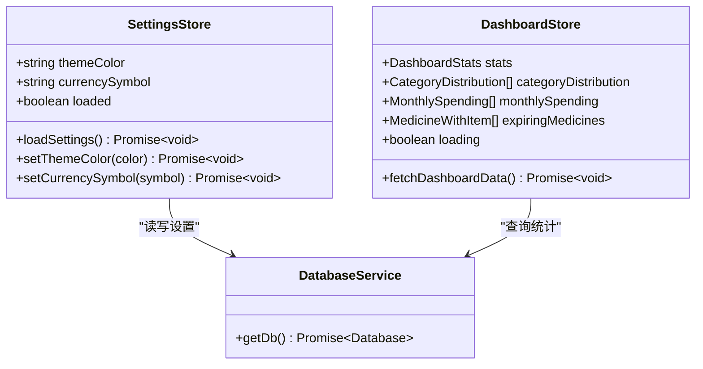
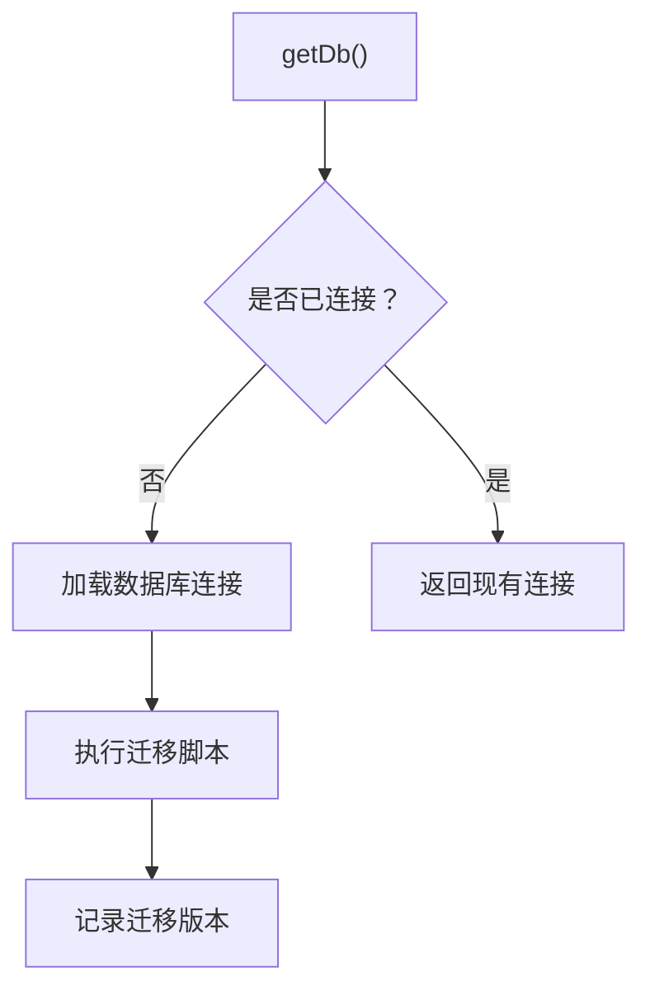
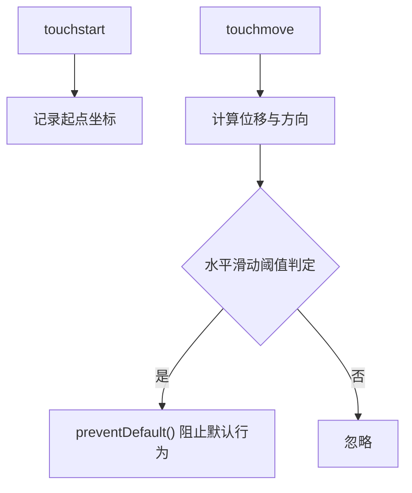
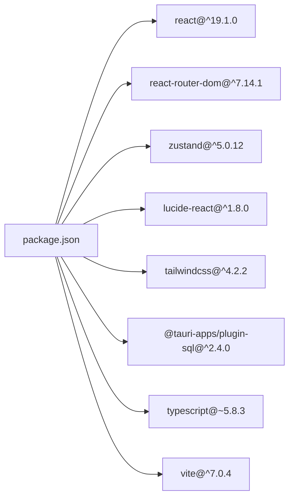

# 前端架构设计

<cite>
**本文档引用的文件**
- [src/App.tsx](file://src/App.tsx)
- [src/main.tsx](file://src/main.tsx)
- [src/components/layout/AppShell.tsx](file://src/components/layout/AppShell.tsx)
- [src/routes/Dashboard.tsx](file://src/routes/Dashboard.tsx)
- [src/stores/useSettingsStore.ts](file://src/stores/useSettingsStore.ts)
- [src/stores/useDashboardStore.ts](file://src/stores/useDashboardStore.ts)
- [src/services/database.ts](file://src/services/database.ts)
- [src/lib/utils.ts](file://src/lib/utils.ts)
- [src/index.css](file://src/index.css)
- [package.json](file://package.json)
- [vite.config.ts](file://vite.config.ts)
- [tsconfig.json](file://tsconfig.json)
- [src/utils/constants.ts](file://src/utils/constants.ts)
- [src/types/settings.ts](file://src/types/settings.ts)
</cite>

## 目录
1. [引言](#引言)
2. [项目结构](#项目结构)
3. [核心组件](#核心组件)
4. [架构总览](#架构总览)
5. [详细组件分析](#详细组件分析)
6. [依赖关系分析](#依赖关系分析)
7. [性能考量](#性能考量)
8. [故障排除指南](#故障排除指南)
9. [结论](#结论)

## 引言
本文件面向 Assetly 前端架构，围绕基于 React 19.1 的前端体系进行系统化梳理，重点阐述以下方面：
- MVVM 架构模式在前端的落地：以 Zustand 状态库实现 ViewModel 层，React 组件作为 View，服务层与数据库层作为 Model 的支撑。
- 组件化设计原则：按功能域划分目录（如 components/layout、components/charts、routes），组件职责清晰、可复用性强。
- 路由系统设计：基于 React Router v7 的嵌套路由与 AppShell 主布局结合，提供统一导航与内容区。
- AppShell 主布局设计理念：桌面端侧边栏 + 移动端底部导航胶囊，响应式布局与安全区域适配，移动端手势拦截策略。
- TypeScript 类型系统应用：通过类型定义确保状态、服务与 UI 的一致性。
- React Hooks 使用模式：useEffect、useState、useLocation、useNavigate 等在生命周期与交互中的规范使用。
- 组件间通信方式：Zustand Store 全局状态共享、React Router 导航驱动的数据传递。
- 技术栈选择原因：Vite + React + TailwindCSS + Tauri 生态，兼顾开发体验与跨平台能力。
- 性能优化策略：并发数据加载、滚动行为控制、CSS 变量主题切换、移动端手势拦截。
- 跨浏览器兼容性考虑：CSS 自定义属性、渐进增强样式、移动端滚动与触摸事件处理。

## 项目结构
前端采用“按功能域分层”的组织方式：
- 根入口与渲染：main.tsx 渲染根组件 App.tsx
- 应用主路由与布局：App.tsx 配置 BrowserRouter 与 Routes，包裹 AppShell 提供统一布局
- 页面路由：routes 下各页面组件，如 Dashboard、ItemList、MedicineBox 等
- 布局与通用组件：components/layout/AppShell.tsx 为主布局；components/charts、shared 等通用组件
- 状态管理：stores 下的 useSettingsStore、useDashboardStore 等 Zustand Store
- 服务层：services 下的 database、statisticsService、medicineService 等
- 工具与样式：lib/utils.ts、index.css、utils/constants.ts、types/*.ts
- 构建配置：vite.config.ts、tsconfig.json、package.json

图表来源
- [src/main.tsx:1-11](file://src/main.tsx#L1-L11)
- [src/App.tsx:18-91](file://src/App.tsx#L18-L91)
- [src/components/layout/AppShell.tsx:24-159](file://src/components/layout/AppShell.tsx#L24-L159)

章节来源
- [src/main.tsx:1-11](file://src/main.tsx#L1-L11)
- [src/App.tsx:18-91](file://src/App.tsx#L18-L91)
- [package.json:12-31](file://package.json#L12-L31)
- [vite.config.ts:1-29](file://vite.config.ts#L1-L29)
- [tsconfig.json:1-26](file://tsconfig.json#L1-L26)

## 核心组件
- App.tsx：应用启动与全局初始化，包含日志初始化、药物提醒服务启动与清理、移动端手势拦截（完全禁用横向滑动手势）。
- AppShell.tsx：主布局组件，负责桌面端侧边栏与移动端底部导航胶囊，响应式检测、主题色 CSS 变量注入、数据库与设置初始化。
- Dashboard.tsx：仪表盘页面，聚合统计数据、资产分布饼图、过期药品预警与正在服用药品列表，使用 useDashboardStore 与 useSettingsStore。
- Zustand Store：useSettingsStore 管理主题色与货币符号持久化；useDashboardStore 管理仪表盘数据加载与缓存状态。
- database.ts：封装 SQLite 连接、迁移脚本与表结构，提供默认数据种子与索引。
- 工具与样式：lib/utils.ts 提供类名合并工具；index.css 定义主题变量与跨浏览器滚动样式；utils/constants.ts 定义默认分类、标签映射与主题预设。

章节来源
- [src/App.tsx:18-91](file://src/App.tsx#L18-L91)
- [src/components/layout/AppShell.tsx:24-159](file://src/components/layout/AppShell.tsx#L24-L159)
- [src/routes/Dashboard.tsx:13-235](file://src/routes/Dashboard.tsx#L13-L235)
- [src/stores/useSettingsStore.ts:14-55](file://src/stores/useSettingsStore.ts#L14-L55)
- [src/stores/useDashboardStore.ts:16-33](file://src/stores/useDashboardStore.ts#L16-L33)
- [src/services/database.ts:8-171](file://src/services/database.ts#L8-L171)
- [src/lib/utils.ts:4-7](file://src/lib/utils.ts#L4-L7)
- [src/index.css:3-84](file://src/index.css#L3-L84)
- [src/utils/constants.ts:4-40](file://src/utils/constants.ts#L4-L40)

## 架构总览
整体采用 MVVM 模式：
- Model：database.ts 与服务层（statisticsService、medicineService）提供数据访问与业务逻辑
- ViewModel：Zustand Store（useSettingsStore、useDashboardStore）承载页面状态与派生数据
- View：React 组件（AppShell、routes/*、components/*）负责渲染与用户交互

图表来源
- [src/components/layout/AppShell.tsx:27-46](file://src/components/layout/AppShell.tsx#L27-L46)
- [src/routes/Dashboard.tsx:15-22](file://src/routes/Dashboard.tsx#L15-L22)
- [src/stores/useSettingsStore.ts:19-35](file://src/stores/useSettingsStore.ts#L19-L35)
- [src/stores/useDashboardStore.ts:23-32](file://src/stores/useDashboardStore.ts#L23-L32)
- [src/services/database.ts:8-16](file://src/services/database.ts#L8-L16)

## 详细组件分析

### AppShell 主布局组件
设计理念：
- 桌面端：固定宽度侧边栏，包含品牌信息、主导航与管理子菜单
- 移动端：底部悬浮胶囊导航，自动识别屏幕宽度并在 resize 时切换布局
- 响应式安全区域：移动端内容区适配 safe-area-inset-top/bottom
- 主题色注入：通过 CSS 变量动态更新主色调，支持设置页即时生效
- 初始化流程：先初始化数据库与设置，再渲染内容，避免未就绪状态

图表来源
- [src/components/layout/AppShell.tsx:24-61](file://src/components/layout/AppShell.tsx#L24-L61)
- [src/components/layout/AppShell.tsx:63-159](file://src/components/layout/AppShell.tsx#L63-L159)

章节来源
- [src/components/layout/AppShell.tsx:24-159](file://src/components/layout/AppShell.tsx#L24-L159)

### 路由系统设计
- 根路由：BrowserRouter 包裹 Routes
- 嵌套路由：所有页面路由均包裹在 AppShell 外层，保证统一布局
- 页面路径：首页、物品、药箱、位置、设置、统计、日志等
- 导航高亮：Logs 页面同时激活 Settings 导航按钮，体现二级管理入口

图表来源
- [src/App.tsx:70-91](file://src/App.tsx#L70-L91)
- [src/components/layout/AppShell.tsx:33-46](file://src/components/layout/AppShell.tsx#L33-L46)

章节来源
- [src/App.tsx:70-91](file://src/App.tsx#L70-L91)

### Dashboard 仪表盘
功能要点：
- 并发加载：仪表盘数据、分类分布、月度支出、即将过期药品四路并发请求
- 快捷操作：添加物品、添加药品、查看统计三个入口
- 预警与正在服用：点击条目跳转到编辑页，支持按状态筛选
- 图表展示：资产分布使用 PieChart 组件，支持货币符号传参

图表来源
- [src/routes/Dashboard.tsx:19-31](file://src/routes/Dashboard.tsx#L19-L31)
- [src/stores/useDashboardStore.ts:23-32](file://src/stores/useDashboardStore.ts#L23-L32)

章节来源
- [src/routes/Dashboard.tsx:13-235](file://src/routes/Dashboard.tsx#L13-L235)
- [src/stores/useDashboardStore.ts:16-33](file://src/stores/useDashboardStore.ts#L16-L33)

### 状态管理（Zustand）
- useSettingsStore：主题色与货币符号的读取与持久化，变更时同步更新 CSS 变量
- useDashboardStore：仪表盘数据聚合与加载状态，支持并发请求与错误兜底

图表来源
- [src/stores/useSettingsStore.ts:14-55](file://src/stores/useSettingsStore.ts#L14-L55)
- [src/stores/useDashboardStore.ts:16-33](file://src/stores/useDashboardStore.ts#L16-L33)
- [src/services/database.ts:8-16](file://src/services/database.ts#L8-L16)

章节来源
- [src/stores/useSettingsStore.ts:14-55](file://src/stores/useSettingsStore.ts#L14-L55)
- [src/stores/useDashboardStore.ts:16-33](file://src/stores/useDashboardStore.ts#L16-L33)

### 数据库与迁移
- 连接与迁移：首次使用时建立 sqlite:assetly.db，执行迁移脚本并记录版本
- 表结构：categories、locations（自引用树）、items、medicines（与 items 1:1 关联）、settings
- 默认数据：种子默认分类与初始设置值
- 索引优化：对常用查询字段建立索引

图表来源
- [src/services/database.ts:8-53](file://src/services/database.ts#L8-L53)
- [src/services/database.ts:60-171](file://src/services/database.ts#L60-L171)

章节来源
- [src/services/database.ts:8-171](file://src/services/database.ts#L8-L171)

### TypeScript 类型系统应用
- 设置与统计类型：AppSettings、DashboardStats、CategoryDistribution、MonthlySpending
- 常量与标签：DEFAULT_CATEGORIES、MEDICINE_TYPE_LABELS、ITEM_STATUS_LABELS、THEME_PRESETS、CURRENCY_OPTIONS
- 在 Store、Service、UI 中广泛使用类型约束，确保数据结构一致性和编译期检查

章节来源
- [src/types/settings.ts:3-25](file://src/types/settings.ts#L3-L25)
- [src/utils/constants.ts:4-40](file://src/utils/constants.ts#L4-L40)

### React Hooks 使用模式
- 生命周期：useEffect 用于应用启动初始化、日志与提醒服务、移动端手势拦截
- 状态：useState 用于响应式布局判断、移动端安全区域适配
- 路由：useLocation 用于导航高亮判断；useNavigate 用于快捷跳转
- Store：从 Zustand 读取状态与动作，避免重复订阅

章节来源
- [src/App.tsx:19-68](file://src/App.tsx#L19-L68)
- [src/components/layout/AppShell.tsx:25-46](file://src/components/layout/AppShell.tsx#L25-L46)
- [src/routes/Dashboard.tsx:14-31](file://src/routes/Dashboard.tsx#L14-L31)

### 组件间通信方式
- 全局状态：Zustand Store 提供跨组件共享的状态与动作
- 路由导航：React Router 导航驱动页面切换与参数传递
- 事件与回调：组件内部事件通过 props 向上或向下传递，保持单向数据流

章节来源
- [src/stores/useSettingsStore.ts:19-54](file://src/stores/useSettingsStore.ts#L19-L54)
- [src/stores/useDashboardStore.ts:23-32](file://src/stores/useDashboardStore.ts#L23-L32)
- [src/routes/Dashboard.tsx:82-109](file://src/routes/Dashboard.tsx#L82-L109)

### 响应式布局与移动端手势处理
- 响应式策略：根据窗口宽度切换桌面侧边栏与移动端底部导航胶囊，内容区适配安全区域
- 手势拦截：在捕获阶段监听 touchstart/touchmove，检测水平滑动并阻止默认行为，完全禁用 WebView 横向滑动手势

图表来源
- [src/App.tsx:35-67](file://src/App.tsx#L35-L67)

章节来源
- [src/App.tsx:29-68](file://src/App.tsx#L29-L68)
- [src/components/layout/AppShell.tsx:128-156](file://src/components/layout/AppShell.tsx#L128-L156)

## 依赖关系分析
- 前端框架：React 19.1、react-router-dom 7
- 状态管理：zustand 5
- UI 与图标：lucide-react
- 样式：TailwindCSS v4
- 构建：Vite + @vitejs/plugin-react
- 类型：TypeScript
- 数据库：@tauri-apps/plugin-sql
- 日志与通知：@tauri-apps/plugin-log、@tauri-apps/plugin-notification

图表来源
- [package.json:12-41](file://package.json#L12-L41)

章节来源
- [package.json:12-41](file://package.json#L12-L41)
- [vite.config.ts:1-29](file://vite.config.ts#L1-L29)
- [tsconfig.json:1-26](file://tsconfig.json#L1-L26)

## 性能考量
- 并发数据加载：Dashboard 使用 Promise.all 并行获取多源数据，减少首屏等待时间
- 滚动与触摸优化：移动端隐藏滚动条、启用 `-webkit-overflow-scrolling: touch`、禁用横向滑动以避免误触
- 主题切换：通过 CSS 变量动态更新主色调，避免重绘与布局抖动
- 构建与开发：Vite HMR 与严格端口配置，忽略 Tauri 目录监控，提升热更新效率

章节来源
- [src/routes/Dashboard.tsx:25-31](file://src/routes/Dashboard.tsx#L25-L31)
- [src/index.css:27-29](file://src/index.css#L27-L29)
- [src/index.css:31-40](file://src/index.css#L31-L40)
- [vite.config.ts:13-27](file://vite.config.ts#L13-L27)

## 故障排除指南
- 应用启动日志：App.tsx 初始化日志与关闭清理日志，便于定位生命周期问题
- 数据库连接：database.ts 记录连接与迁移过程日志，异常时输出 SQL 片段与错误信息
- 设置持久化：useSettingsStore 在设置变更后同步更新 CSS 变量，若主题色不生效，检查 CSS 变量是否正确注入
- 移动端手势误触：若横向滑动仍被 WebView 拦截，确认捕获阶段事件监听是否正确绑定与解绑

章节来源
- [src/App.tsx:19-27](file://src/App.tsx#L19-L27)
- [src/services/database.ts:10-16](file://src/services/database.ts#L10-L16)
- [src/services/database.ts:38-44](file://src/services/database.ts#L38-L44)
- [src/stores/useSettingsStore.ts:44](file://src/stores/useSettingsStore.ts#L44)

## 结论
Assetly 前端以 React 19.1 为核心，结合 Zustand 实现 MVVM 中的 ViewModel 层，通过 AppShell 提供统一布局与响应式导航，并以并发数据加载与 CSS 变量主题切换保障性能与体验。配合 Tauri 的 SQLite 数据库与日志能力，形成从 UI 到数据的完整闭环。该架构在组件化、类型安全、移动端手势处理与跨浏览器兼容方面均有明确实践，适合在多端场景下持续演进。