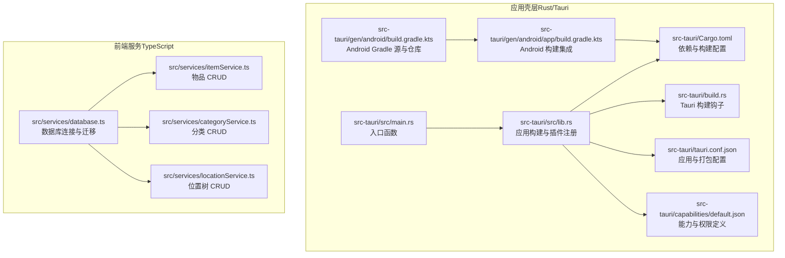
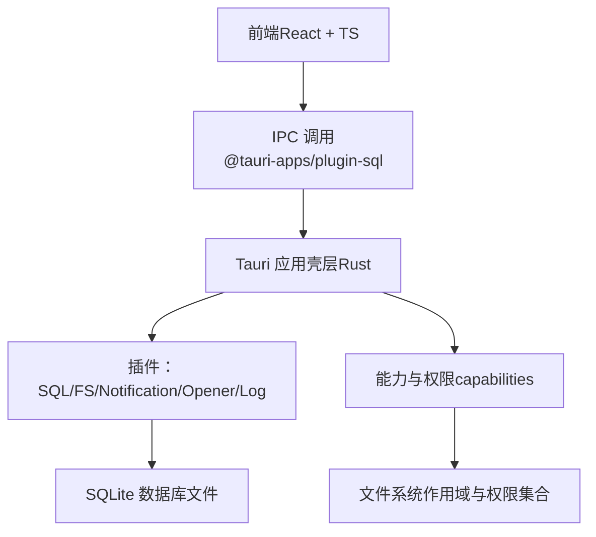
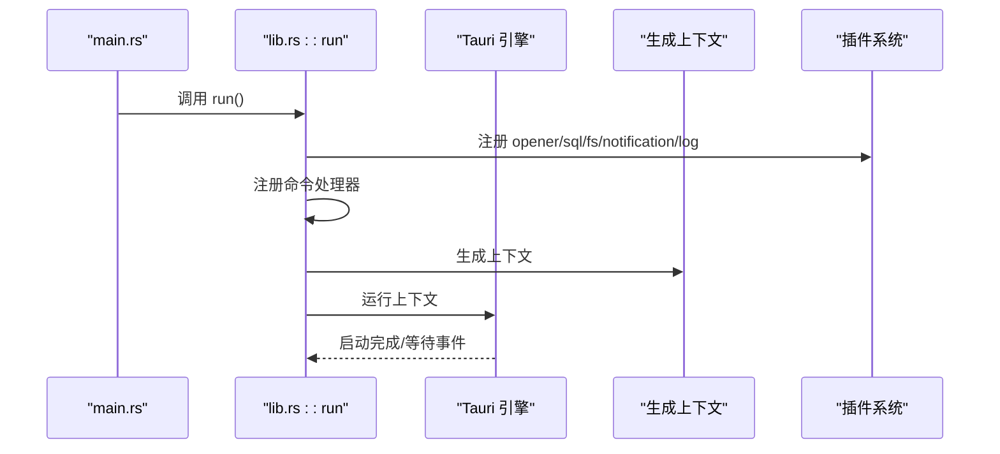
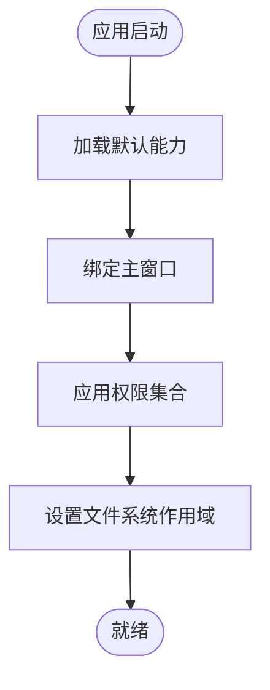
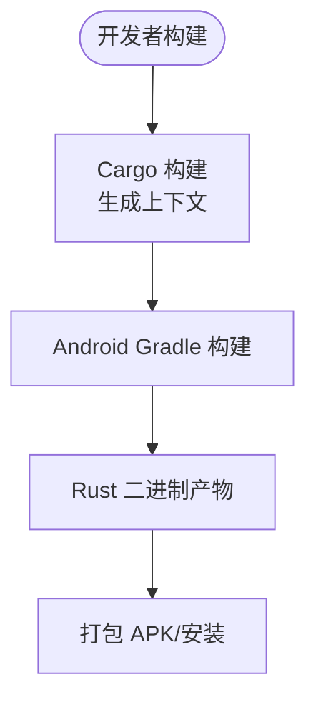
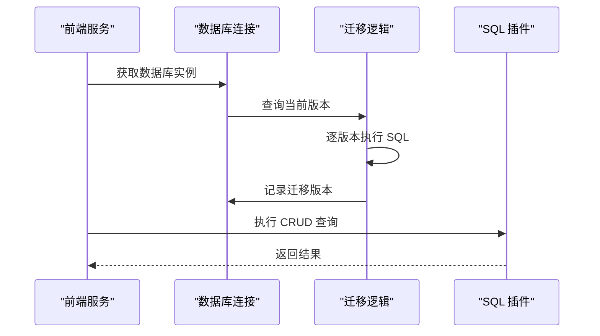
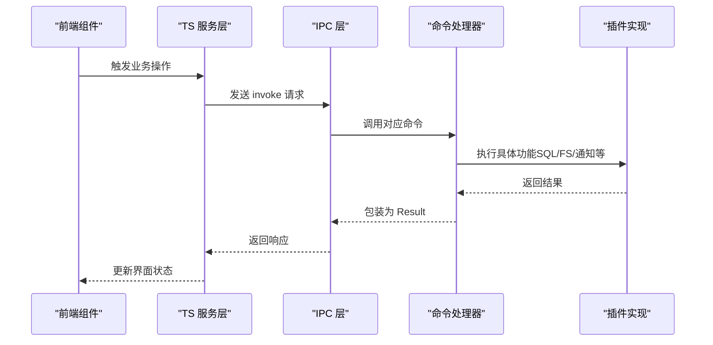
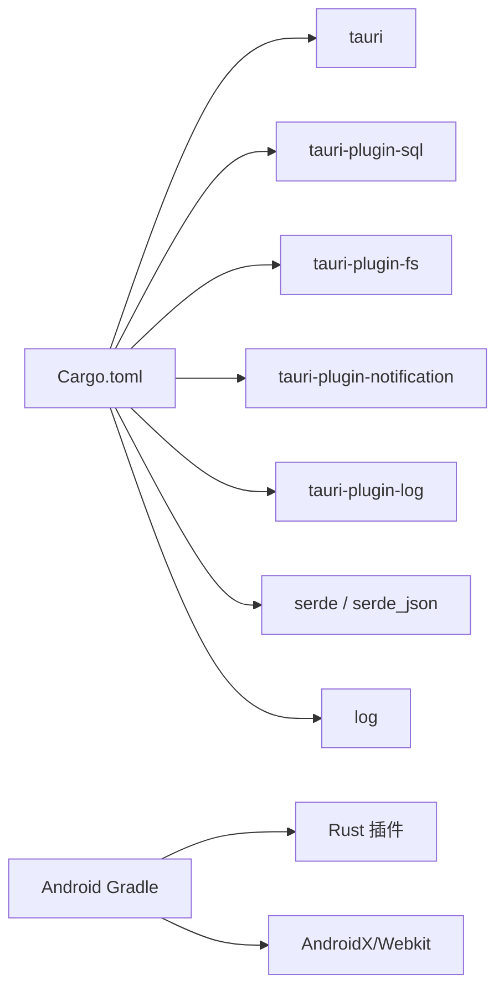

# 后端架构设计

<cite>
**本文引用的文件**
- [src-tauri/Cargo.toml](file://src-tauri/Cargo.toml)
- [src-tauri/src/main.rs](file://src-tauri/src/main.rs)
- [src-tauri/src/lib.rs](file://src-tauri/src/lib.rs)
- [src-tauri/tauri.conf.json](file://src-tauri/tauri.conf.json)
- [src-tauri/capabilities/default.json](file://src-tauri/capabilities/default.json)
- [src-tauri/build.rs](file://src-tauri/build.rs)
- [src-tauri/gen/android/build.gradle.kts](file://src-tauri/gen/android/build.gradle.kts)
- [src-tauri/gen/android/app/build.gradle.kts](file://src-tauri/gen/android/app/build.gradle.kts)
- [src/services/database.ts](file://src/services/database.ts)
- [src/services/itemService.ts](file://src/services/itemService.ts)
- [src/services/categoryService.ts](file://src/services/categoryService.ts)
- [src/services/locationService.ts](file://src/services/locationService.ts)
</cite>

## 目录
1. [简介](#简介)
2. [项目结构](#项目结构)
3. [核心组件](#核心组件)
4. [架构总览](#架构总览)
5. [详细组件分析](#详细组件分析)
6. [依赖关系分析](#依赖关系分析)
7. [性能考虑](#性能考虑)
8. [故障排查指南](#故障排查指南)
9. [结论](#结论)
10. [附录](#附录)

## 简介
本文件系统性阐述 Assetly 的后端架构设计，重点围绕基于 Tauri 2.x 与 Rust 的应用壳层（App Shell），说明其在安全模型、权限控制、跨平台编译与打包方面的实现方式；同时解析 Rust 代码的模块化组织、错误处理策略、生命周期与启动流程，并详述与前端通过 IPC 的通信协议与数据流。

## 项目结构
后端相关的核心目录与文件如下：
- 应用壳层与构建配置：src-tauri 目录
- 前端服务与数据库访问：src/services 下的数据库与业务服务模块
- 能力与权限：capabilities/default.json
- 构建脚本与配置：Cargo.toml、tauri.conf.json、build.rs
- Android 工程集成：gen/android 下的 Gradle 配置

**图表来源**
- [src-tauri/src/main.rs:1-7](file://src-tauri/src/main.rs#L1-L7)
- [src-tauri/src/lib.rs:1-49](file://src-tauri/src/lib.rs#L1-L49)
- [src-tauri/Cargo.toml:1-31](file://src-tauri/Cargo.toml#L1-L31)
- [src-tauri/build.rs:1-4](file://src-tauri/build.rs#L1-L4)
- [src-tauri/tauri.conf.json:1-40](file://src-tauri/tauri.conf.json#L1-L40)
- [src-tauri/capabilities/default.json:1-37](file://src-tauri/capabilities/default.json#L1-L37)
- [src-tauri/gen/android/app/build.gradle.kts:1-72](file://src-tauri/gen/android/app/build.gradle.kts#L1-L72)
- [src-tauri/gen/android/build.gradle.kts:1-29](file://src-tauri/gen/android/build.gradle.kts#L1-L29)
- [src/services/database.ts:1-171](file://src/services/database.ts#L1-L171)
- [src/services/itemService.ts:1-127](file://src/services/itemService.ts#L1-L127)
- [src/services/categoryService.ts:1-59](file://src/services/categoryService.ts#L1-L59)
- [src/services/locationService.ts:1-143](file://src/services/locationService.ts#L1-L143)

**章节来源**
- [src-tauri/src/main.rs:1-7](file://src-tauri/src/main.rs#L1-L7)
- [src-tauri/src/lib.rs:1-49](file://src-tauri/src/lib.rs#L1-L49)
- [src-tauri/Cargo.toml:1-31](file://src-tauri/Cargo.toml#L1-L31)
- [src-tauri/build.rs:1-4](file://src-tauri/build.rs#L1-L4)
- [src-tauri/tauri.conf.json:1-40](file://src-tauri/tauri.conf.json#L1-L40)
- [src-tauri/capabilities/default.json:1-37](file://src-tauri/capabilities/default.json#L1-L37)
- [src-tauri/gen/android/app/build.gradle.kts:1-72](file://src-tauri/gen/android/app/build.gradle.kts#L1-L72)
- [src-tauri/gen/android/build.gradle.kts:1-29](file://src-tauri/gen/android/build.gradle.kts#L1-L29)
- [src/services/database.ts:1-171](file://src/services/database.ts#L1-L171)
- [src/services/itemService.ts:1-127](file://src/services/itemService.ts#L1-L127)
- [src/services/categoryService.ts:1-59](file://src/services/categoryService.ts#L1-L59)
- [src/services/locationService.ts:1-143](file://src/services/locationService.ts#L1-L143)

## 核心组件
- 应用壳层（Rust/Tauri）
  - 入口与运行：main.rs 调用 lib.rs 中的 run 函数，初始化插件与命令处理器，随后启动应用上下文。
  - 插件体系：启用 opener、sql、fs、notification、log 等插件，并按平台条件注册命令。
  - 权限与能力：通过 capabilities/default.json 明确窗口、权限范围与目标路径。
- 数据访问层（前端 TypeScript）
  - 数据库连接：使用 @tauri-apps/plugin-sql 连接本地 SQLite 文件，自动执行迁移。
  - 业务服务：提供分类、位置、物品等 CRUD 服务，统一时间戳与参数绑定。
- 构建与打包
  - Cargo 与 tauri-build：声明构建类型与依赖，生成上下文并执行构建。
  - Android 集成：Gradle 插件加载 Rust 二进制，配置仓库与签名，支持多 ABI。

**章节来源**
- [src-tauri/src/main.rs:1-7](file://src-tauri/src/main.rs#L1-L7)
- [src-tauri/src/lib.rs:1-49](file://src-tauri/src/lib.rs#L1-L49)
- [src-tauri/Cargo.toml:1-31](file://src-tauri/Cargo.toml#L1-L31)
- [src-tauri/capabilities/default.json:1-37](file://src-tauri/capabilities/default.json#L1-L37)
- [src/services/database.ts:1-171](file://src/services/database.ts#L1-L171)
- [src/services/itemService.ts:1-127](file://src/services/itemService.ts#L1-L127)
- [src/services/categoryService.ts:1-59](file://src/services/categoryService.ts#L1-L59)
- [src/services/locationService.ts:1-143](file://src/services/locationService.ts#L1-L143)
- [src-tauri/build.rs:1-4](file://src-tauri/build.rs#L1-L4)
- [src-tauri/gen/android/app/build.gradle.kts:1-72](file://src-tauri/gen/android/app/build.gradle.kts#L1-L72)

## 架构总览
下图展示从前端到应用壳层再到数据库的端到端交互路径，以及权限与能力如何约束访问范围。

**图表来源**
- [src/services/database.ts:1-171](file://src/services/database.ts#L1-L171)
- [src-tauri/src/lib.rs:1-49](file://src-tauri/src/lib.rs#L1-L49)
- [src-tauri/capabilities/default.json:1-37](file://src-tauri/capabilities/default.json#L1-L37)

## 详细组件分析

### 应用壳层与启动流程
- 启动入口
  - main.rs 设置 Windows 子系统并在发布模式隐藏控制台，随后调用 lib.rs::run。
- 应用构建
  - lib.rs 使用 Builder::default 初始化，依次注册插件与命令处理器，最后运行生成的上下文。
  - 条件编译：针对 Android 平台提供占位命令，其他平台提供空实现，确保跨平台兼容。
- 生命周期
  - 应用在 run 调用后进入事件循环，直至关闭或异常退出。
- 安全与权限
  - 通过 capabilities/default.json 明确窗口、权限标识与文件系统作用域，限制对敏感路径的访问。

**图表来源**
- [src-tauri/src/main.rs:1-7](file://src-tauri/src/main.rs#L1-L7)
- [src-tauri/src/lib.rs:1-49](file://src-tauri/src/lib.rs#L1-L49)

**章节来源**
- [src-tauri/src/main.rs:1-7](file://src-tauri/src/main.rs#L1-L7)
- [src-tauri/src/lib.rs:1-49](file://src-tauri/src/lib.rs#L1-L49)

### 权限控制系统与能力模型
- 能力定义
  - default.json 将能力与窗口关联，声明允许的权限集合，如 core、opener、sql、fs、notification、log。
- 文件系统作用域
  - fs:scope 限定可读写路径，包括应用数据目录、导出目录、资源与下载目录等，避免越权访问。
- 权限细化
  - 对 SQL 提供 load、execute、select 等细粒度许可；对 FS 提供 read/write/exists/mkdir/remove/rename 等操作许可。

**图表来源**
- [src-tauri/capabilities/default.json:1-37](file://src-tauri/capabilities/default.json#L1-L37)

**章节来源**
- [src-tauri/capabilities/default.json:1-37](file://src-tauri/capabilities/default.json#L1-L37)

### 跨平台编译与打包流程
- Rust 侧
  - Cargo.toml 声明静态/动态库与 rlib 类型，build.rs 调用 tauri_build::build 生成上下文。
- Android 集成
  - gen/android/app/build.gradle.kts 引入 rust 插件，指向根目录，配置 Android SDK、最小 SDK、构建类型与签名。
  - 仓库源使用阿里云与腾讯云镜像，提升构建稳定性。
- 多 ABI 支持
  - Gradle 配置保留各架构下的调试符号，便于问题定位与调试。

**图表来源**
- [src-tauri/Cargo.toml:1-31](file://src-tauri/Cargo.toml#L1-L31)
- [src-tauri/build.rs:1-4](file://src-tauri/build.rs#L1-L4)
- [src-tauri/gen/android/app/build.gradle.kts:1-72](file://src-tauri/gen/android/app/build.gradle.kts#L1-L72)
- [src-tauri/gen/android/build.gradle.kts:1-29](file://src-tauri/gen/android/build.gradle.kts#L1-L29)

**章节来源**
- [src-tauri/Cargo.toml:1-31](file://src-tauri/Cargo.toml#L1-L31)
- [src-tauri/build.rs:1-4](file://src-tauri/build.rs#L1-L4)
- [src-tauri/gen/android/app/build.gradle.kts:1-72](file://src-tauri/gen/android/app/build.gradle.kts#L1-L72)
- [src-tauri/gen/android/build.gradle.kts:1-29](file://src-tauri/gen/android/build.gradle.kts#L1-L29)

### 数据访问与迁移机制
- 数据库连接
  - 通过 @tauri-apps/plugin-sql 加载本地 sqlite:assetly.db，首次连接时执行迁移。
- 迁移策略
  - 维护 _migrations 表记录当前版本，按版本顺序执行未应用的 SQL 语句，并记录执行时间。
- 业务服务
  - 分类、位置、物品服务均依赖统一数据库连接，提供查询、插入、更新、删除与树形结构维护。

**图表来源**
- [src/services/database.ts:1-171](file://src/services/database.ts#L1-L171)
- [src/services/itemService.ts:1-127](file://src/services/itemService.ts#L1-L127)
- [src/services/categoryService.ts:1-59](file://src/services/categoryService.ts#L1-L59)
- [src/services/locationService.ts:1-143](file://src/services/locationService.ts#L1-L143)

**章节来源**
- [src/services/database.ts:1-171](file://src/services/database.ts#L1-L171)
- [src/services/itemService.ts:1-127](file://src/services/itemService.ts#L1-L127)
- [src/services/categoryService.ts:1-59](file://src/services/categoryService.ts#L1-L59)
- [src/services/locationService.ts:1-143](file://src/services/locationService.ts#L1-L143)

### IPC 通信协议与前端集成
- 命令注册
  - 在 lib.rs 中通过 generate_handler! 注册命令，当前包含 Android 分享命令（条件编译）。
- 前端调用
  - 前端通过 @tauri-apps/plugin-sql 与数据库交互，所有请求经由 Tauri 的 IPC 层转发至 Rust 插件实现。
- 协议要点
  - 请求/响应以 JSON 结构传递，参数按索引绑定，返回值采用 Result 类型封装错误。

**图表来源**
- [src-tauri/src/lib.rs:1-49](file://src-tauri/src/lib.rs#L1-L49)
- [src/services/database.ts:1-171](file://src/services/database.ts#L1-L171)

**章节来源**
- [src-tauri/src/lib.rs:1-49](file://src-tauri/src/lib.rs#L1-L49)
- [src/services/database.ts:1-171](file://src/services/database.ts#L1-L171)

## 依赖关系分析
- Rust 依赖
  - tauri、tauri-plugin-* 系列插件、serde/serde_json、log 等。
- 构建依赖
  - tauri-build 用于生成上下文与资源。
- Android 依赖
  - Gradle 插件、Kotlin 插件、Rust 插件，以及 AndroidX/Webkit 等运行时库。

**图表来源**
- [src-tauri/Cargo.toml:1-31](file://src-tauri/Cargo.toml#L1-L31)
- [src-tauri/gen/android/app/build.gradle.kts:1-72](file://src-tauri/gen/android/app/build.gradle.kts#L1-L72)

**章节来源**
- [src-tauri/Cargo.toml:1-31](file://src-tauri/Cargo.toml#L1-L31)
- [src-tauri/gen/android/app/build.gradle.kts:1-72](file://src-tauri/gen/android/app/build.gradle.kts#L1-L72)

## 性能考虑
- 数据库性能
  - 通过索引优化常见查询（如 items 的 category/location/status、medicines 的 expiry/type 等）。
  - 迁移阶段批量执行 SQL，减少往返次数。
- IPC 效率
  - 前端以批量请求与参数化查询降低网络开销，避免频繁小请求。
- 构建优化
  - Android Release 构建启用混淆与压缩，减小包体与内存占用。
- 日志与可观测性
  - 使用 tauri-plugin-log 输出到日志目录与标准输出，便于问题定位。

## 故障排查指南
- 数据库连接失败
  - 检查 sqlite:assetly.db 是否存在与可读写；确认 capabilities 中 fs:scope 是否包含应用数据目录。
- 迁移执行异常
  - 查看迁移日志与错误堆栈，确认 SQL 语法与表结构一致性；检查 _migrations 版本是否正确推进。
- 权限不足
  - 核对 capabilities/default.json 中 permissions 与 fs:scope，确保前端调用的路径在允许范围内。
- Android 构建问题
  - 检查 Gradle 仓库可用性与签名配置；确认 Rust 插件路径与 ABI 支持。
- 日志定位
  - 通过 tauri-plugin-log 的日志目录与 stdout 输出，结合前端 logger 的信息/错误级别进行定位。

**章节来源**
- [src/services/database.ts:1-171](file://src/services/database.ts#L1-L171)
- [src-tauri/capabilities/default.json:1-37](file://src-tauri/capabilities/default.json#L1-L37)
- [src-tauri/gen/android/app/build.gradle.kts:1-72](file://src-tauri/gen/android/app/build.gradle.kts#L1-L72)

## 结论
Assetly 的后端架构以 Tauri 2.x 为核心，结合 Rust 的高性能与安全性，配合 TypeScript 前端服务与 SQLite 数据库，实现了跨平台、可控权限与可维护的数据访问层。通过明确的能力与权限模型、规范的迁移机制与 IPC 通信协议，系统在保证安全的同时兼顾了开发效率与用户体验。

## 附录
- 关键配置参考
  - 应用与打包：tauri.conf.json
  - 能力与权限：capabilities/default.json
  - 构建与依赖：Cargo.toml、build.rs
  - Android 集成：gen/android/app/build.gradle.kts、gen/android/build.gradle.kts
- 服务接口参考
  - 数据库连接与迁移：src/services/database.ts
  - 物品服务：src/services/itemService.ts
  - 分类服务：src/services/categoryService.ts
  - 位置服务：src/services/locationService.ts