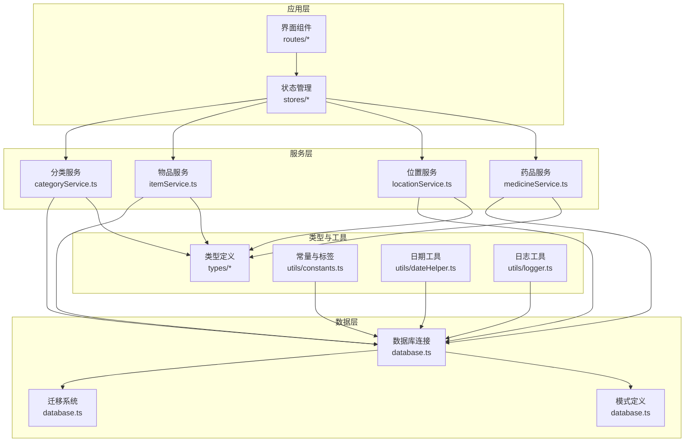
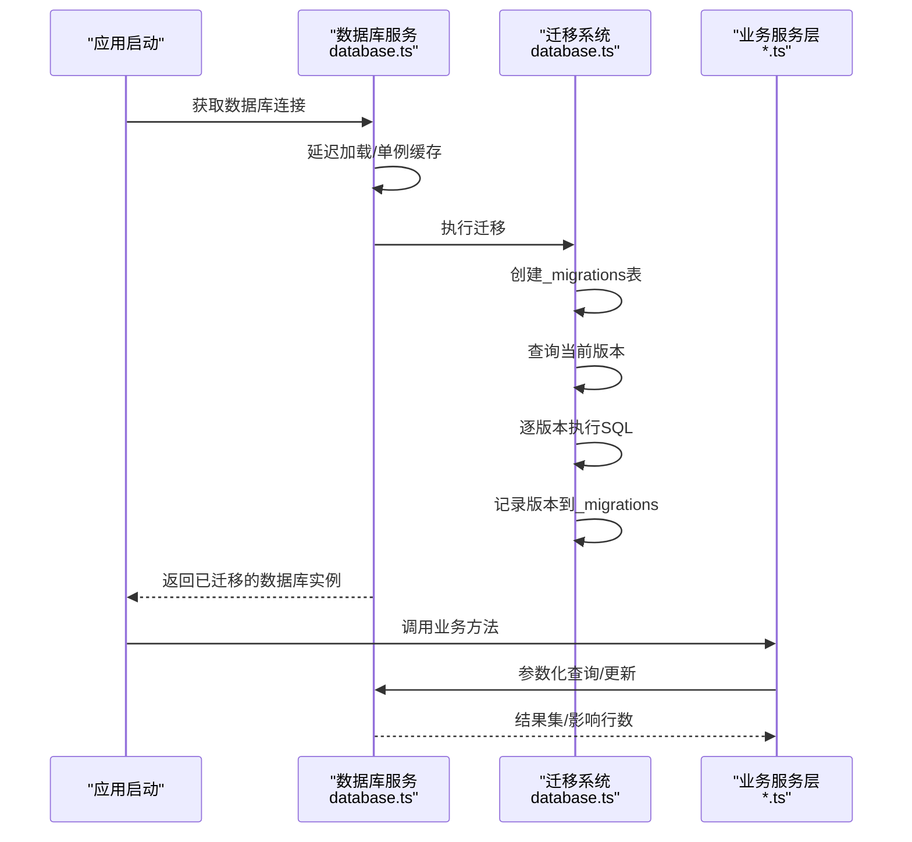
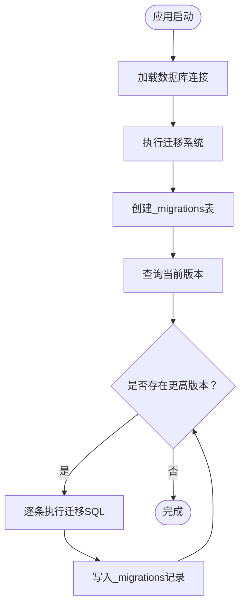
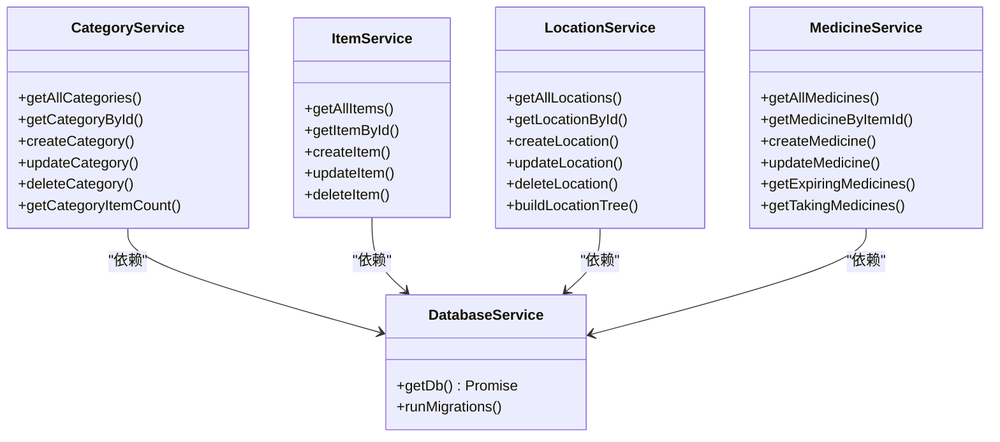
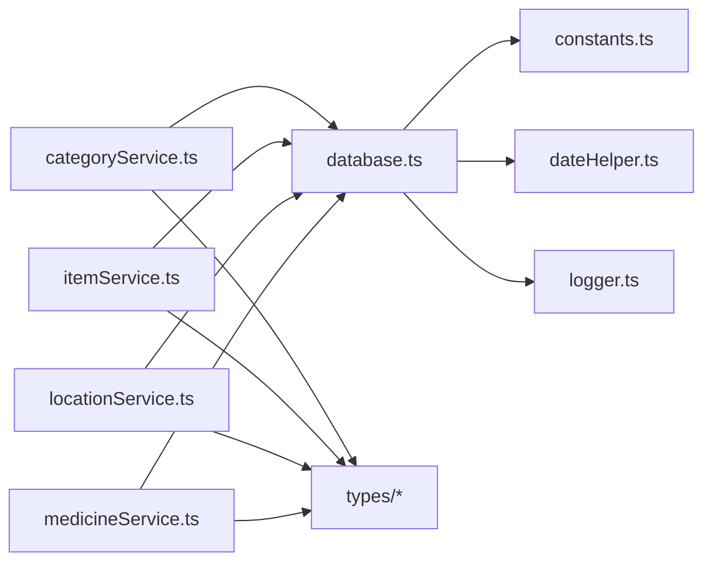

# 数据架构设计

<cite>
**本文档引用的文件**
- [src/services/database.ts](file://src/services/database.ts)
- [src/services/categoryService.ts](file://src/services/categoryService.ts)
- [src/services/itemService.ts](file://src/services/itemService.ts)
- [src/services/locationService.ts](file://src/services/locationService.ts)
- [src/services/medicineService.ts](file://src/services/medicineService.ts)
- [src/types/category.ts](file://src/types/category.ts)
- [src/types/item.ts](file://src/types/item.ts)
- [src/types/location.ts](file://src/types/location.ts)
- [src/types/medicine.ts](file://src/types/medicine.ts)
- [src/types/settings.ts](file://src/types/settings.ts)
- [src/utils/constants.ts](file://src/utils/constants.ts)
- [src/utils/dateHelper.ts](file://src/utils/dateHelper.ts)
- [src/utils/logger.ts](file://src/utils/logger.ts)
</cite>

## 目录
1. [简介](#简介)
2. [项目结构](#项目结构)
3. [核心组件](#核心组件)
4. [架构总览](#架构总览)
5. [详细组件分析](#详细组件分析)
6. [依赖分析](#依赖分析)
7. [性能考虑](#性能考虑)
8. [故障排除指南](#故障排除指南)
9. [结论](#结论)
10. [附录](#附录)

## 简介
本文件系统性阐述 Assetly 基于 SQLite 的本地数据存储架构，覆盖数据模型设计、表结构关系、索引与约束策略、数据库初始化与迁移机制、数据访问层抽象、事务与一致性保障、备份恢复方案、性能优化与安全考虑。该架构以 Tauri 插件提供的 SQLite 能力为基础，通过服务层封装实现跨模块的数据操作，确保数据完整性与可维护性。

## 项目结构
围绕数据层的关键目录与文件如下：
- 数据访问与初始化：src/services/database.ts
- 业务服务层（分类、物品、位置、药品）：src/services/*.ts
- 类型定义：src/types/*.ts
- 工具与常量：src/utils/*.ts



图表来源
- [src/services/database.ts:1-171](file://src/services/database.ts#L1-L171)
- [src/services/categoryService.ts:1-59](file://src/services/categoryService.ts#L1-L59)
- [src/services/itemService.ts:1-127](file://src/services/itemService.ts#L1-L127)
- [src/services/locationService.ts:1-143](file://src/services/locationService.ts#L1-L143)
- [src/services/medicineService.ts:1-194](file://src/services/medicineService.ts#L1-L194)
- [src/types/category.ts:1-18](file://src/types/category.ts#L1-L18)
- [src/types/item.ts:1-46](file://src/types/item.ts#L1-L46)
- [src/types/location.ts:1-24](file://src/types/location.ts#L1-L24)
- [src/types/medicine.ts:1-70](file://src/types/medicine.ts#L1-L70)
- [src/utils/constants.ts:1-40](file://src/utils/constants.ts#L1-L40)
- [src/utils/dateHelper.ts:1-52](file://src/utils/dateHelper.ts#L1-L52)
- [src/utils/logger.ts:1-84](file://src/utils/logger.ts#L1-L84)

章节来源
- [src/services/database.ts:1-171](file://src/services/database.ts#L1-L171)

## 核心组件
- 数据库连接与迁移
  - 单例连接：延迟加载并缓存数据库实例，首次使用时建立连接并执行迁移。
  - 迁移表：内置 _migrations 表记录已应用版本，避免重复执行。
  - 版本推进：按版本顺序依次执行迁移语句，并记录应用时间。
- 数据模型与约束
  - 分类、位置、物品、药品、设置五张核心表；位置表自引用形成树形层级；药品表与物品表通过外键关联。
  - 索引策略：在常用查询字段上建立索引，提升过滤与排序效率。
  - 默认值与约束：字段默认值、非空约束、外键级联策略等确保数据一致性。
- 服务层抽象
  - 每个实体提供统一的 CRUD 接口，隐藏 SQL 细节，支持参数化查询与动态条件拼接。
- 工具与常量
  - 日期格式化与到期状态计算、默认分类与主题预设、货币符号等。

章节来源
- [src/services/database.ts:18-53](file://src/services/database.ts#L18-L53)
- [src/services/database.ts:60-170](file://src/services/database.ts#L60-L170)
- [src/utils/constants.ts:4-13](file://src/utils/constants.ts#L4-L13)
- [src/utils/dateHelper.ts:14-43](file://src/utils/dateHelper.ts#L14-L43)

## 架构总览
下图展示数据层从连接到迁移、再到服务层调用的端到端流程。



图表来源
- [src/services/database.ts:8-53](file://src/services/database.ts#L8-L53)
- [src/services/categoryService.ts:9-18](file://src/services/categoryService.ts#L9-L18)
- [src/services/itemService.ts:10-44](file://src/services/itemService.ts#L10-L44)
- [src/services/locationService.ts:9-18](file://src/services/locationService.ts#L9-L18)
- [src/services/medicineService.ts:10-37](file://src/services/medicineService.ts#L10-L37)

## 详细组件分析

### 数据模型与表结构
- 分类表（categories）
  - 主键：id（文本）
  - 字段：名称、图标、颜色、排序、时间戳
  - 约束：主键唯一
- 位置表（locations）
  - 主键：id；自引用父节点：parent_id；路径与层级：full_path、level；排序：sort_order
  - 约束：外键引用自身（ON DELETE SET NULL），保证父节点删除时子节点保留但断开关系
- 物品表（items）
  - 主键：id；外键：category_id、location_id；扩展字段：购买信息、图片、图标、状态、是否药品标记
  - 约束：非空字段、默认值、布尔整型标记
- 药品表（medicines）
  - 主键：id；一对一扩展：item_id（UNIQUE，CASCADE 删除）
  - 字段：类型、有效期、用量、剩余数量、单位、厂商、提醒相关字段
  - 约束：外键指向 items（CASCADE 删除），保证物品删除时药品同步清理
- 设置表（settings）
  - 主键：key；值：value；时间戳：updated_at
  - 约束：主键唯一

```mermaid
erDiagram
CATEGORIES {
text id PK
text name
text icon
text color
int sort_order
text created_at
text updated_at
}
LOCATIONS {
text id PK
text name
text parent_id FK
text full_path
int level
int sort_order
text created_at
text updated_at
}
ITEMS {
text id PK
text name
text description
text category_id FK
text location_id FK
text purchase_date
real purchase_price
int quantity
text image_path
text icon
text status
int is_medicine
text warranty_expiry
text shelf_life_expiry
text created_at
text updated_at
}
MEDICINES {
text id PK
text item_id UK FK
text medicine_type
text expiry_date
text dosage_instructions
int remaining_quantity
text unit
text manufacturer
int is_taking
text frequency_type
int frequency_days
text week_days
text time_slots
text duration_start
text duration_end
text last_reminded
text created_at
text updated_at
}
SETTINGS {
text key PK
text value
text updated_at
}
LOCATIONS }o--o| LOCATIONS : "自引用父子关系"
CATEGORIES ||--o{ ITEMS : "拥有"
LOCATIONS ||--o{ ITEMS : "包含"
ITEMS ||--|| MEDICINES : "扩展(一对一)"
```

图表来源
- [src/services/database.ts:67-123](file://src/services/database.ts#L67-L123)
- [src/services/database.ts:105-117](file://src/services/database.ts#L105-L117)

章节来源
- [src/services/database.ts:67-123](file://src/services/database.ts#L67-L123)
- [src/services/database.ts:105-117](file://src/services/database.ts#L105-L117)

### 索引策略与约束规则
- 索引
  - items：category_id、location_id、status
  - medicines：item_id、expiry_date、medicine_type
  - locations：parent_id
- 约束
  - 外键：位置自引用（删除置空）、药品 item_id 唯一且级联删除
  - 默认值：颜色、排序、布尔标记、时间戳
  - 非空：关键字段如 created_at、updated_at
- 种子数据
  - 初始化默认分类与设置项，确保新用户有可用模板

章节来源
- [src/services/database.ts:124-140](file://src/services/database.ts#L124-L140)
- [src/utils/constants.ts:4-13](file://src/utils/constants.ts#L4-L13)

### 数据库初始化与迁移系统
- 初始化流程
  - 首次调用 getDb() 时加载本地 SQLite 文件，随后执行迁移
  - 迁移表 _migrations 记录最高版本号与应用时间
- 迁移设计
  - 版本化：按版本顺序执行 SQL 列表
  - 安全性：逐条执行并捕获错误，记录失败 SQL 片段与错误信息
  - 可回溯：通过 _migrations 表查看历史版本
- 迁移内容
  - v1：创建核心表与索引，插入默认分类与设置
  - v2：为 items 增加 icon 字段
  - v3：为 medicines 增加提醒相关字段
  - v4：为 items 增加保质期/保修期字段，为 locations 增加图片字段



图表来源
- [src/services/database.ts:18-53](file://src/services/database.ts#L18-L53)
- [src/services/database.ts:60-170](file://src/services/database.ts#L60-L170)

章节来源
- [src/services/database.ts:18-53](file://src/services/database.ts#L18-L53)
- [src/services/database.ts:60-170](file://src/services/database.ts#L60-L170)

### 数据访问层抽象
- 统一入口
  - 所有服务通过 getDb() 获取数据库实例，避免分散连接逻辑
- 参数化查询
  - 使用占位符与参数数组，防止注入并提升可读性
- 动态条件
  - 服务层根据传入的过滤器动态拼接 WHERE 条件，支持多字段组合查询
- 日志与可观测性
  - 关键操作记录日志，便于调试与审计



图表来源
- [src/services/database.ts:8-16](file://src/services/database.ts#L8-L16)
- [src/services/categoryService.ts:1-59](file://src/services/categoryService.ts#L1-L59)
- [src/services/itemService.ts:1-127](file://src/services/itemService.ts#L1-L127)
- [src/services/locationService.ts:1-143](file://src/services/locationService.ts#L1-L143)
- [src/services/medicineService.ts:1-194](file://src/services/medicineService.ts#L1-L194)

章节来源
- [src/services/categoryService.ts:9-59](file://src/services/categoryService.ts#L9-L59)
- [src/services/itemService.ts:10-127](file://src/services/itemService.ts#L10-L127)
- [src/services/locationService.ts:9-143](file://src/services/locationService.ts#L9-L143)
- [src/services/medicineService.ts:10-194](file://src/services/medicineService.ts#L10-L194)

### 事务管理与数据完整性
- 事务特性
  - 当前服务层未显式开启事务块，采用单条 SQL 执行；对于需要强一致性的复合操作（如创建药品同时写入 items 与 medicines），建议在服务内部使用事务包裹，确保原子性
- 外键与级联
  - 位置删除时递归处理子节点与物品归属；药品删除通过 CASCADE 自动清理
- 默认值与校验
  - 服务层在插入时填充时间戳与默认值；布尔值以整型写入 SQLite
- 并发与锁
  - SQLite 在单机场景下具备基本并发控制；高并发写入建议引入重试与退避策略

章节来源
- [src/services/locationService.ts:94-122](file://src/services/locationService.ts#L94-L122)
- [src/services/medicineService.ts:54-95](file://src/services/medicineService.ts#L54-L95)
- [src/services/database.ts:116-117](file://src/services/database.ts#L116-L117)

### 数据备份与恢复
- 备份策略
  - 复制 SQLite 数据库文件 assetly.db 至安全位置或云端存储
  - 建议在应用退出或定期任务时触发备份
- 恢复流程
  - 停止应用进程，替换或还原数据库文件，重启应用验证迁移是否成功
- 备份注意事项
  - 确保文件完整性和权限正确；生产环境建议加密备份文件

[本节为通用实践指导，不直接分析具体文件]

### 性能优化策略
- 查询优化
  - 利用现有索引：按 category_id、location_id、status、expiry_date 等字段过滤
  - 避免 SELECT *，仅选择必要列
- 写入优化
  - 合理批量插入与更新，减少往返次数
  - 对频繁更新的字段（如 updated_at）保持最小化写入
- 索引与存储
  - 定期评估查询计划，必要时调整索引覆盖范围
  - 控制 TEXT 字段大小，避免大对象频繁读取
- 缓存与去抖
  - 对热点数据进行内存缓存，结合版本号或时间戳失效

[本节为通用实践指导，不直接分析具体文件]

### 数据安全考虑
- 输入校验
  - 服务层对输入参数进行类型与范围校验，避免异常数据进入数据库
- 注入防护
  - 全面使用参数化查询，禁止字符串拼接 SQL
- 敏感信息
  - 当前模式未涉及敏感字段；若未来扩展，建议对敏感数据进行加密存储与传输
- 日志与审计
  - 通过日志记录关键操作，注意避免泄露敏感信息

[本节为通用实践指导，不直接分析具体文件]

## 依赖分析
- 组件耦合
  - 服务层高度依赖数据库服务；类型定义独立于实现，降低耦合
- 外部依赖
  - Tauri SQLite 插件提供底层能力；dayjs 提供日期处理；Zustand 提供状态管理
- 循环依赖
  - 未发现循环导入；服务层通过统一入口获取数据库实例



图表来源
- [src/services/categoryService.ts:1-59](file://src/services/categoryService.ts#L1-L59)
- [src/services/itemService.ts:1-127](file://src/services/itemService.ts#L1-L127)
- [src/services/locationService.ts:1-143](file://src/services/locationService.ts#L1-L143)
- [src/services/medicineService.ts:1-194](file://src/services/medicineService.ts#L1-L194)
- [src/services/database.ts:1-16](file://src/services/database.ts#L1-L16)
- [src/utils/constants.ts:1-40](file://src/utils/constants.ts#L1-L40)
- [src/utils/dateHelper.ts:1-52](file://src/utils/dateHelper.ts#L1-L52)
- [src/utils/logger.ts:1-84](file://src/utils/logger.ts#L1-L84)

章节来源
- [src/services/categoryService.ts:1-59](file://src/services/categoryService.ts#L1-L59)
- [src/services/itemService.ts:1-127](file://src/services/itemService.ts#L1-L127)
- [src/services/locationService.ts:1-143](file://src/services/locationService.ts#L1-L143)
- [src/services/medicineService.ts:1-194](file://src/services/medicineService.ts#L1-L194)
- [src/services/database.ts:1-16](file://src/services/database.ts#L1-L16)

## 性能考虑
- 查询路径优化
  - 利用索引字段进行过滤与排序，减少全表扫描
  - 对分页与聚合查询，建议在服务层增加 limit/offset 或分组统计
- 写入批量化
  - 将多次小更新合并为批量事务，降低磁盘写入频率
- 索引维护
  - 随着数据增长定期分析查询模式，增删索引以匹配实际负载
- I/O 与缓存
  - 减少对大字段（如图片路径）的频繁读取；对热点实体进行内存缓存

[本节为通用实践指导，不直接分析具体文件]

## 故障排除指南
- 迁移失败
  - 现象：执行迁移时报错
  - 排查：检查失败 SQL 片段与错误信息；确认数据库文件权限与磁盘空间
  - 处理：修复 SQL 或回滚至上一个稳定版本，重新应用迁移
- 连接问题
  - 现象：无法打开数据库或连接超时
  - 排查：确认数据库文件存在且可读写；检查应用工作目录
  - 处理：重启应用或手动复制备份文件
- 数据不一致
  - 现象：外键约束冲突或数据丢失
  - 排查：核对删除流程（位置删除需递归处理）与级联策略
  - 处理：回滚事务或重建索引
- 日志定位
  - 使用日志工具记录关键步骤，结合内存日志快速定位问题

章节来源
- [src/services/database.ts:38-45](file://src/services/database.ts#L38-L45)
- [src/utils/logger.ts:57-75](file://src/utils/logger.ts#L57-L75)

## 结论
Assetly 的数据架构以 SQLite 为核心，通过集中式的数据库初始化与迁移系统、清晰的实体模型与索引策略、以及抽象化的服务层接口，实现了良好的可维护性与扩展性。建议在后续迭代中增强事务边界、完善备份与监控机制，并持续优化查询与索引策略以应对数据规模增长。

## 附录
- 类型定义概览
  - 分类：名称、图标、颜色、排序、时间戳
  - 物品：描述、类别、位置、购买信息、状态、是否药品、保质期/保修期
  - 位置：名称、父节点、全路径、层级、排序、图片
  - 药品：类型、有效期、用量、剩余数量、单位、厂商、提醒配置
  - 设置：主题色、货币符号

章节来源
- [src/types/category.ts:3-11](file://src/types/category.ts#L3-L11)
- [src/types/item.ts:5-22](file://src/types/item.ts#L5-L22)
- [src/types/location.ts:3-12](file://src/types/location.ts#L3-L12)
- [src/types/medicine.ts:7-27](file://src/types/medicine.ts#L7-L27)
- [src/types/settings.ts:3-6](file://src/types/settings.ts#L3-L6)