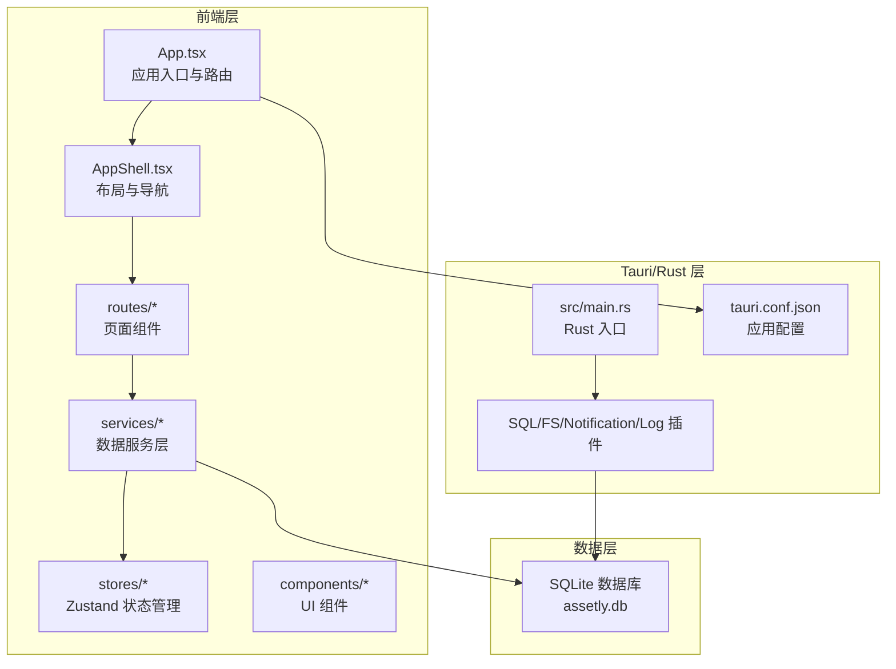
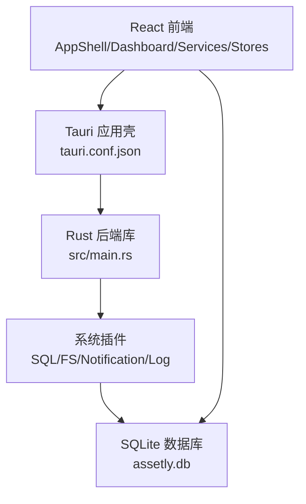
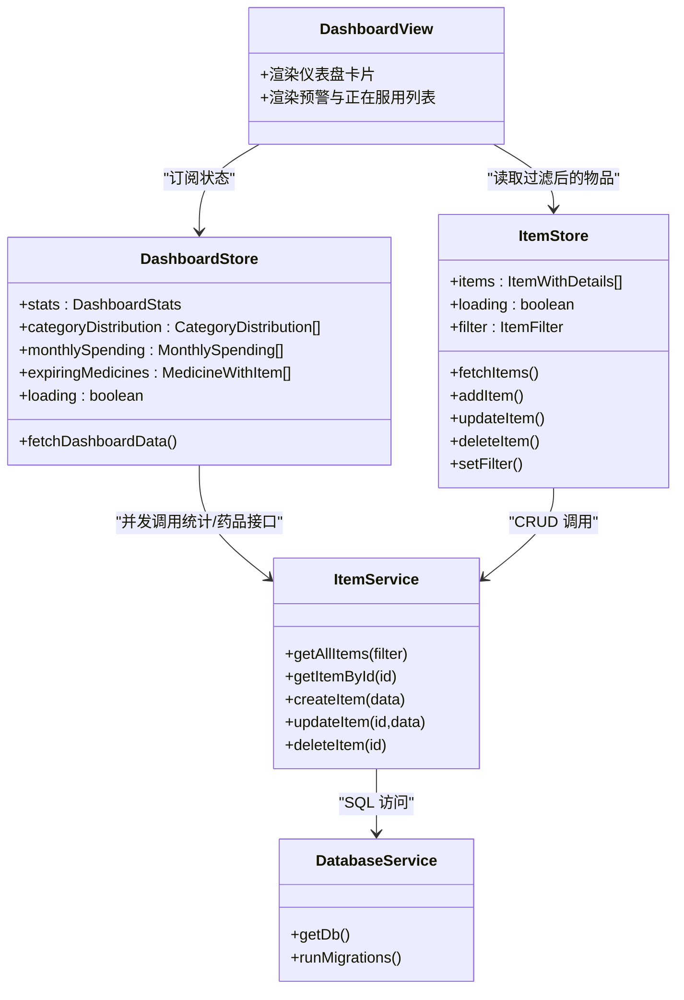
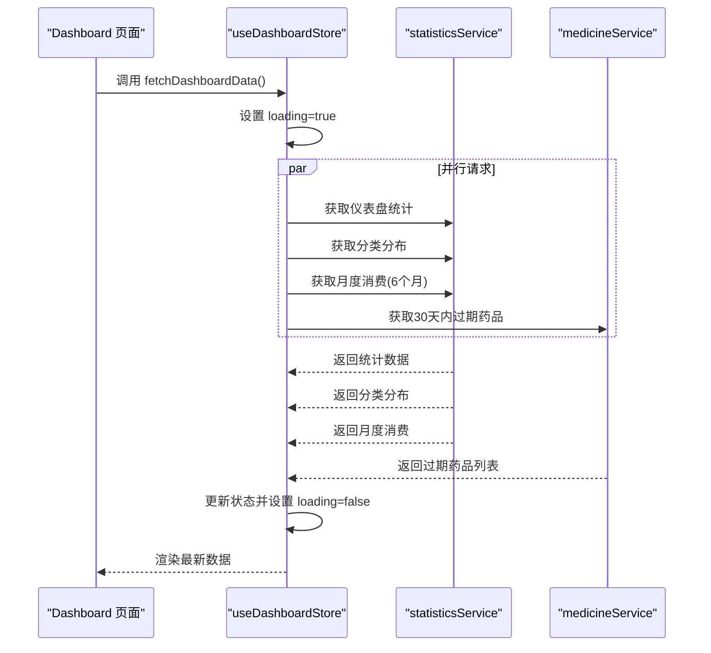
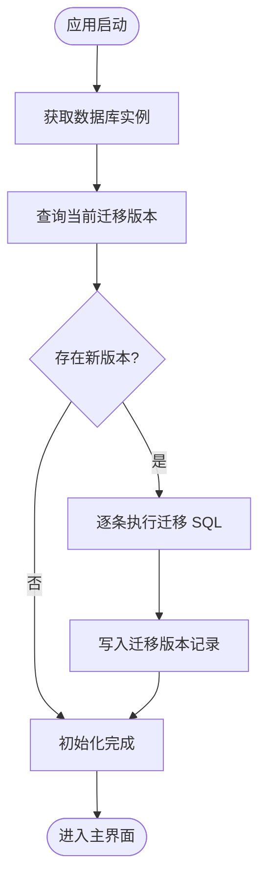
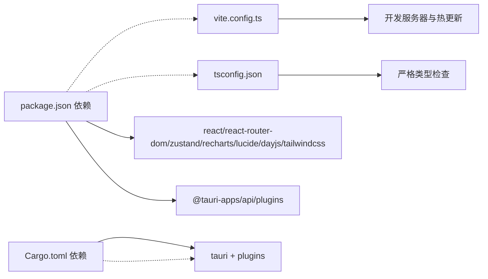

# 架构设计

<cite>
**本文引用的文件**
- [README.md](file://README.md)
- [package.json](file://package.json)
- [Cargo.toml](file://src-tauri/Cargo.toml)
- [tauri.conf.json](file://src-tauri/tauri.conf.json)
- [App.tsx](file://src/App.tsx)
- [AppShell.tsx](file://src/components/layout/AppShell.tsx)
- [database.ts](file://src/services/database.ts)
- [itemService.ts](file://src/services/itemService.ts)
- [useItemStore.ts](file://src/stores/useItemStore.ts)
- [useDashboardStore.ts](file://src/stores/useDashboardStore.ts)
- [Dashboard.tsx](file://src/routes/Dashboard.tsx)
- [main.rs](file://src-tauri/src/main.rs)
- [vite.config.ts](file://vite.config.ts)
- [tsconfig.json](file://tsconfig.json)
- [constants.ts](file://src/utils/constants.ts)
</cite>

## 目录
1. [简介](#简介)
2. [项目结构](#项目结构)
3. [核心组件](#核心组件)
4. [架构总览](#架构总览)
5. [详细组件分析](#详细组件分析)
6. [依赖关系分析](#依赖关系分析)
7. [性能考量](#性能考量)
8. [故障排查指南](#故障排查指南)
9. [结论](#结论)
10. [附录](#附录)

## 简介
Assetly 是一款跨平台的家庭物品与药品管理应用，采用“前端 React 应用层 + Tauri 应用壳层 + Rust 后端服务层 + SQLite 数据存储层”的分层架构。应用以 MVVM 架构思想组织前端逻辑，结合组件化设计与 Zustand 状态管理，实现清晰的数据流与可维护的代码结构。后端通过 Tauri 的 Rust 能力与 SQL 插件提供本地数据库访问、文件系统与通知能力，并通过 Tauri 配置实现跨平台打包与运行。

## 项目结构
项目采用按职责分层的组织方式：
- 前端层（src/）：React + TypeScript + Vite 构建，组件按功能域划分，路由页面集中于 routes/，服务层封装数据访问，状态层使用 Zustand 按领域拆分 Store。
- Tauri/Rust 层（src-tauri/）：Rust 二进制入口与库，通过 Tauri 配置桥接前端与系统能力；插件包括 SQL、FS、Notification、Log 等。
- 配置层：Vite、TypeScript、Tauri 配置文件分别控制构建、类型检查与应用壳行为。

图表来源
- [App.tsx:1-92](file://src/App.tsx#L1-L92)
- [AppShell.tsx:1-160](file://src/components/layout/AppShell.tsx#L1-L160)
- [database.ts:1-171](file://src/services/database.ts#L1-L171)
- [main.rs:1-7](file://src-tauri/src/main.rs#L1-L7)
- [tauri.conf.json:1-40](file://src-tauri/tauri.conf.json#L1-L40)

章节来源
- [README.md:157-180](file://README.md#L157-L180)
- [vite.config.ts:1-29](file://vite.config.ts#L1-L29)
- [tsconfig.json:1-26](file://tsconfig.json#L1-L26)

## 核心组件
- 应用入口与路由：负责初始化日志、启动用药提醒、全局禁用手势返回、注册路由与页面。
- 布局与导航：根据屏幕尺寸切换桌面侧边栏与移动端胶囊导航，动态注入主题色变量，延迟渲染确保数据库与设置初始化完成。
- 数据服务层：统一通过 Tauri SQL 插件访问 SQLite，封装 CRUD 与查询逻辑，提供迁移机制与索引优化。
- 状态管理层：按领域拆分 Store（如物品、仪表盘、设置），集中处理加载状态与异步数据更新。
- 药品与统计：提供药品过期预警、正在服用药品列表与仪表盘聚合指标的并发加载。

章节来源
- [App.tsx:18-92](file://src/App.tsx#L18-L92)
- [AppShell.tsx:24-160](file://src/components/layout/AppShell.tsx#L24-L160)
- [database.ts:8-53](file://src/services/database.ts#L8-L53)
- [useItemStore.ts:23-52](file://src/stores/useItemStore.ts#L23-L52)
- [useDashboardStore.ts:16-33](file://src/stores/useDashboardStore.ts#L16-L33)
- [Dashboard.tsx:13-235](file://src/routes/Dashboard.tsx#L13-L235)

## 架构总览
系统边界与交互概览如下：

图表来源
- [tauri.conf.json:1-40](file://src-tauri/tauri.conf.json#L1-L40)
- [main.rs:1-7](file://src-tauri/src/main.rs#L1-L7)
- [database.ts:1-171](file://src/services/database.ts#L1-L171)

## 详细组件分析

### MVVM 与组件化设计
- 视图（View）：页面组件（如 Dashboard）负责渲染与用户交互，通过状态管理与服务层获取数据。
- 模型（Model）：类型定义（src/types/*）与数据库实体对应，保证前后端一致的数据契约。
- 视图模型（ViewModel）：Store（如 useDashboardStore、useItemStore）承担视图状态与业务逻辑协调，提供派发方法与加载状态。
- 组件化：UI 组件按功能域拆分（items/medicine/shared/layout），复用性强，利于维护与测试。

图表来源
- [Dashboard.tsx:13-235](file://src/routes/Dashboard.tsx#L13-L235)
- [useDashboardStore.ts:16-33](file://src/stores/useDashboardStore.ts#L16-L33)
- [useItemStore.ts:23-52](file://src/stores/useItemStore.ts#L23-L52)
- [itemService.ts:10-127](file://src/services/itemService.ts#L10-L127)
- [database.ts:8-53](file://src/services/database.ts#L8-L53)

章节来源
- [Dashboard.tsx:13-235](file://src/routes/Dashboard.tsx#L13-L235)
- [useDashboardStore.ts:16-33](file://src/stores/useDashboardStore.ts#L16-L33)
- [useItemStore.ts:23-52](file://src/stores/useItemStore.ts#L23-L52)
- [itemService.ts:10-127](file://src/services/itemService.ts#L10-L127)
- [constants.ts:3-40](file://src/utils/constants.ts#L3-L40)

### 数据流与状态管理
- 数据流向：页面组件 -> Store -> Service -> Database，返回结果通过 Store 更新视图。
- 加载状态：Store 内部维护 loading 字段，避免重复请求与竞态。
- 并发加载：仪表盘使用 Promise.all 并行拉取多项指标，提升首屏性能。
- 过滤与搜索：Store 通过 setFilter 维护过滤条件，Service 生成参数化 SQL 查询。

图表来源
- [useDashboardStore.ts:23-32](file://src/stores/useDashboardStore.ts#L23-L32)
- [Dashboard.tsx:19-22](file://src/routes/Dashboard.tsx#L19-L22)

章节来源
- [useDashboardStore.ts:16-33](file://src/stores/useDashboardStore.ts#L16-L33)
- [Dashboard.tsx:13-235](file://src/routes/Dashboard.tsx#L13-L235)

### 数据库与迁移
- 连接与迁移：首次访问时建立数据库连接并执行迁移，记录版本号与时间戳。
- 表结构：包含 items、categories、locations、medicines、settings 与 _migrations，关键字段与索引保障查询效率。
- 默认数据：迁移脚本中插入默认分类与初始设置，确保新用户开箱即用。
- 药品扩展：medicines 与 items 通过外键关联，支持级联删除，保证数据一致性。

图表来源
- [database.ts:18-53](file://src/services/database.ts#L18-L53)
- [database.ts:60-171](file://src/services/database.ts#L60-L171)

章节来源
- [database.ts:8-171](file://src/services/database.ts#L8-L171)
- [constants.ts:3-40](file://src/utils/constants.ts#L3-L40)

### 跨平台与移动端优化
- 跨平台：Tauri 配置支持 macOS、Windows、Linux、Android，应用壳统一前端资源与系统能力。
- 响应式布局：桌面端使用侧边导航，移动端使用底部胶囊导航；通过 CSS 变量注入主题色，适配深浅主题。
- 移动端手势：全局禁用横向滑动手势，避免与 WebView 导航冲突；安全区域适配刘海屏与底部胶囊栏。
- 文件导出：移动端通过系统分享面板导出 JSON，便于跨设备迁移。

章节来源
- [App.tsx:29-68](file://src/App.tsx#L29-L68)
- [AppShell.tsx:64-158](file://src/components/layout/AppShell.tsx#L64-L158)
- [README.md:222-232](file://README.md#L222-L232)
- [README.md:245-251](file://README.md#L245-L251)

## 依赖关系分析
- 前端依赖：React、React Router DOM、Zustand、Recharts、Lucide React、Day.js、TailwindCSS 等。
- Tauri/Rust 依赖：tauri、tauri-plugin-sql、tauri-plugin-fs、tauri-plugin-notification、tauri-plugin-log 等。
- 构建与开发：Vite、TypeScript、@vitejs/plugin-react、tailwindcss 等。

图表来源
- [package.json:12-31](file://package.json#L12-L31)
- [Cargo.toml:20-31](file://src-tauri/Cargo.toml#L20-L31)
- [vite.config.ts:9-28](file://vite.config.ts#L9-L28)
- [tsconfig.json:2-25](file://tsconfig.json#L2-L25)

章节来源
- [package.json:12-41](file://package.json#L12-L41)
- [Cargo.toml:1-31](file://src-tauri/Cargo.toml#L1-L31)
- [vite.config.ts:1-29](file://vite.config.ts#L1-L29)
- [tsconfig.json:1-26](file://tsconfig.json#L1-L26)

## 性能考量
- 并发加载：仪表盘使用 Promise.all 并行获取指标，减少首屏等待时间。
- 参数化查询：服务层对 SQL 使用参数绑定，避免拼接与注入风险，同时利于数据库缓存与索引利用。
- 索引优化：为常用过滤字段（分类、位置、状态、过期日期等）建立索引，降低查询成本。
- 状态粒度：Store 按领域拆分，避免全局状态风暴，提高渲染与更新效率。
- 构建优化：Vite 提供快速冷启与热更新，TypeScript 严格模式减少运行时错误。

## 故障排查指南
- 数据库连接失败：确认数据库文件存在与权限，检查迁移是否成功执行。
- 页面空白或加载缓慢：检查 Store 初始化流程（数据库与设置加载），确认 loading 状态与错误日志。
- 移动端手势误触：确认全局横向滑动拦截逻辑生效，检查事件捕获阶段绑定。
- 日志定位：使用内置日志插件输出 INFO/DEBUG/ERROR 级别日志，定位异常发生点。

章节来源
- [database.ts:10-16](file://src/services/database.ts#L10-L16)
- [App.tsx:19-27](file://src/App.tsx#L19-L27)
- [App.tsx:30-68](file://src/App.tsx#L30-L68)

## 结论
Assetly 通过清晰的分层架构与 MVVM 设计，实现了前端组件化、状态管理与数据服务的解耦。Tauri 与 Rust 提供了强大的本地能力与跨平台打包能力，Zustand 的轻量化状态管理降低了心智负担，SQLite 本地存储确保了数据隐私与离线可用。整体方案兼顾开发体验、性能与可维护性，适合持续演进与多端发布。

## 附录
- 技术栈与版本：详见 README 中“技术栈”表格。
- 平台支持：详见 README 中“平台支持”表格与 Android 特殊说明。
- 数据库设计：详见 README 中“数据库设计”表格与迁移历史。

章节来源
- [README.md:86-105](file://README.md#L86-L105)
- [README.md:235-251](file://README.md#L235-L251)
- [README.md:184-204](file://README.md#L184-L204)