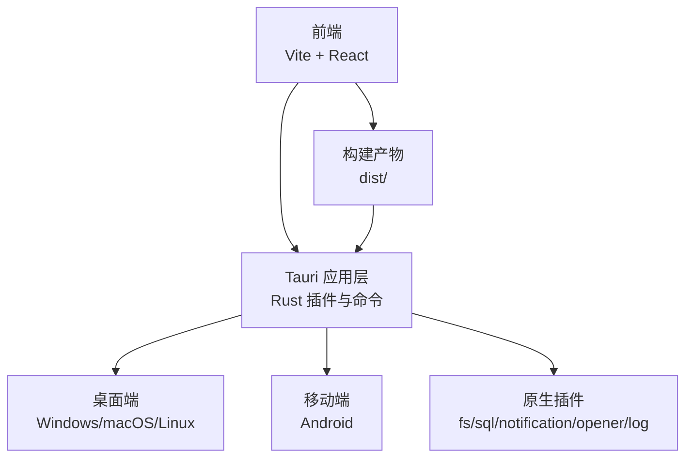
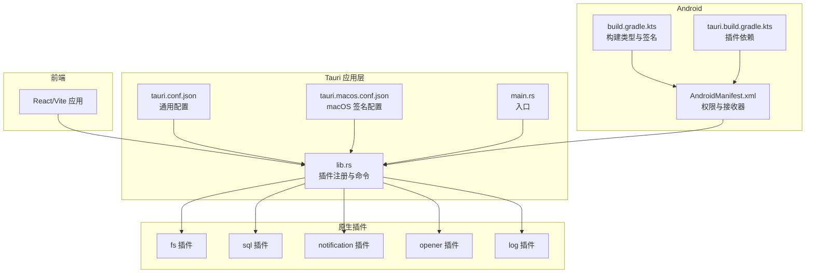
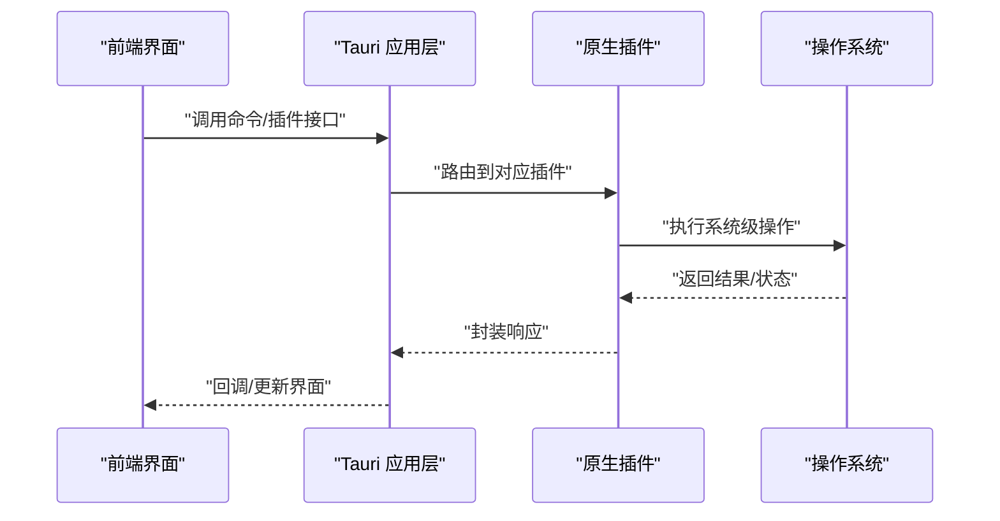
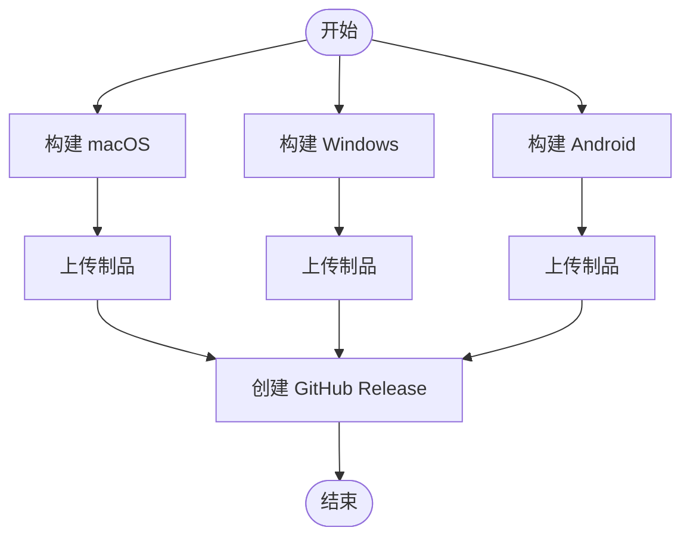
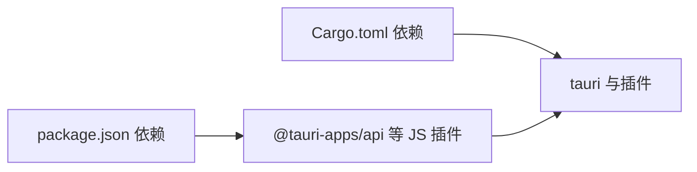

# 跨平台设计

<cite>
**本文引用的文件**
- [src-tauri/tauri.conf.json](file://src-tauri/tauri.conf.json)
- [src-tauri/tauri.macos.conf.json](file://src-tauri/tauri.macos.conf.json)
- [src-tauri/src/lib.rs](file://src-tauri/src/lib.rs)
- [src-tauri/src/main.rs](file://src-tauri/src/main.rs)
- [src-tauri/build.rs](file://src-tauri/build.rs)
- [src-tauri/Cargo.toml](file://src-tauri/Cargo.toml)
- [.github/workflows/release.yml](file://.github/workflows/release.yml)
- [src-tauri/gen/android/app/src/main/AndroidManifest.xml](file://src-tauri/gen/android/app/src/main/AndroidManifest.xml)
- [src-tauri/gen/android/app/build.gradle.kts](file://src-tauri/gen/android/app/build.gradle.kts)
- [src-tauri/gen/android/app/tauri.build.gradle.kts](file://src-tauri/gen/android/app/tauri.build.gradle.kts)
- [package.json](file://package.json)
</cite>

## 目录
1. [引言](#引言)
2. [项目结构](#项目结构)
3. [核心组件](#核心组件)
4. [架构总览](#架构总览)
5. [详细组件分析](#详细组件分析)
6. [依赖分析](#依赖分析)
7. [性能考虑](#性能考虑)
8. [故障排查指南](#故障排查指南)
9. [结论](#结论)
10. [附录](#附录)

## 引言
本文件系统性梳理 Assetly 的跨平台设计与实现，重点覆盖 Tauri 框架在桌面（macOS、Windows、Linux）与移动端（Android）的适配策略、平台特定配置、构建流程、权限与原生能力集成、图标多分辨率适配、发布与签名机制，以及各平台的优化要点。内容基于仓库中实际配置与源码进行归纳总结，帮助开发者快速理解并维护跨平台应用。

## 项目结构
Assetly 采用前端框架（React/Vite）与 Tauri 后端（Rust）结合的架构。前端通过 Vite 构建，Tauri 负责窗口、原生插件与打包分发；Android 平台由 Tauri Android 子系统生成 Gradle 工程并集成 Rust 共享库。关键目录与职责如下：
- 前端：src/ 与 dist/（构建产物）
- Tauri 配置与原生：src-tauri/（配置、Rust 代码、Android 生成工程）
- CI/CD：.github/workflows/release.yml（跨平台自动化构建与发布）

图表来源
- [src-tauri/tauri.conf.json:1-40](file://src-tauri/tauri.conf.json#L1-L40)
- [src-tauri/src/lib.rs:1-49](file://src-tauri/src/lib.rs#L1-L49)
- [src-tauri/Cargo.toml:1-31](file://src-tauri/Cargo.toml#L1-L31)

章节来源
- [src-tauri/tauri.conf.json:1-40](file://src-tauri/tauri.conf.json#L1-L40)
- [src-tauri/src/lib.rs:1-49](file://src-tauri/src/lib.rs#L1-L49)
- [src-tauri/Cargo.toml:1-31](file://src-tauri/Cargo.toml#L1-L31)
- [package.json:1-43](file://package.json#L1-L43)

## 核心组件
- 应用配置与窗口行为：通过 Tauri 配置文件定义产品名、版本、开发/构建命令、窗口尺寸与最小尺寸、安全策略与打包图标清单等。
- 平台特定配置：macOS 独立签名与权限配置文件，Android 权限与构建脚本由 Tauri 自动生成。
- 原生插件与命令：Rust 层注册 fs/sql/notification/opener/log 插件，并暴露条件编译的命令以适配 Android 分享能力。
- 构建与发布：GitHub Actions 实现三端并行构建与统一发布。

章节来源
- [src-tauri/tauri.conf.json:1-40](file://src-tauri/tauri.conf.json#L1-L40)
- [src-tauri/tauri.macos.conf.json:1-10](file://src-tauri/tauri.macos.conf.json#L1-L10)
- [src-tauri/src/lib.rs:1-49](file://src-tauri/src/lib.rs#L1-L49)
- [src-tauri/Cargo.toml:1-31](file://src-tauri/Cargo.toml#L1-L31)
- [.github/workflows/release.yml:1-266](file://.github/workflows/release.yml#L1-L266)

## 架构总览
下图展示前端、Tauri 应用层与原生插件之间的交互关系，以及 Android 侧的权限声明与构建集成。

图表来源
- [src-tauri/src/lib.rs:1-49](file://src-tauri/src/lib.rs#L1-L49)
- [src-tauri/src/main.rs:1-7](file://src-tauri/src/main.rs#L1-L7)
- [src-tauri/tauri.conf.json:1-40](file://src-tauri/tauri.conf.json#L1-L40)
- [src-tauri/tauri.macos.conf.json:1-10](file://src-tauri/tauri.macos.conf.json#L1-L10)
- [src-tauri/gen/android/app/src/main/AndroidManifest.xml:1-49](file://src-tauri/gen/android/app/src/main/AndroidManifest.xml#L1-L49)
- [src-tauri/gen/android/app/build.gradle.kts:1-72](file://src-tauri/gen/android/app/build.gradle.kts#L1-L72)
- [src-tauri/gen/android/app/tauri.build.gradle.kts:1-8](file://src-tauri/gen/android/app/tauri.build.gradle.kts#L1-L8)

## 详细组件分析

### 桌面端（Windows、macOS、Linux）跨平台策略
- 通用配置
  - 开发与构建命令：通过配置文件指定前端开发服务器地址与构建输出目录，确保 Tauri 在开发与生产模式下正确加载资源。
  - 窗口行为：集中定义窗口标题、尺寸、最小尺寸与居中策略，保证一致的用户体验。
  - 安全策略：当前配置未设置 CSP，需在后续根据安全要求补充。
  - 打包图标：统一提供多分辨率图标清单，便于各平台自动生成对应资源。
- 平台特定配置
  - macOS：独立配置文件用于签名身份与权限，便于本地或 CI 环境签名与分发准备。
- 原生能力
  - Rust 插件注册：fs/sql/notification/opener/log 插件按需启用，满足文件系统、数据库、通知、外部打开与日志记录等需求。
- 构建与发布
  - CI 任务：Windows 与 macOS 使用 Tauri CLI 进行构建，产物上传至制品库；Linux 可通过 Tauri targets 或自定义脚本补充。
  - 发布：统一从三端制品生成 GitHub Release，自动归档 dmg、exe、msi 与 apk。

章节来源
- [src-tauri/tauri.conf.json:1-40](file://src-tauri/tauri.conf.json#L1-L40)
- [src-tauri/tauri.macos.conf.json:1-10](file://src-tauri/tauri.macos.conf.json#L1-L10)
- [src-tauri/src/lib.rs:1-49](file://src-tauri/src/lib.rs#L1-L49)
- [.github/workflows/release.yml:17-143](file://.github/workflows/release.yml#L17-L143)

### Android 平台适配
- 权限与能力
  - 权限声明：网络访问、读写外部存储、通知、开机启动、前台服务等权限在清单中显式声明，满足应用功能与后台提醒场景。
  - 接收器：MedicationReminderReceiver 用于处理服药提醒广播事件。
  - 文件分享：Rust 层提供条件编译命令占位，Android 侧通过 MainActivity 与前端 Web Share API 协作实现分享。
- 构建与签名
  - 多架构目标：支持 aarch64、armv7、i686、x86_64，满足主流设备。
  - 构建类型：debug 与 release 区分，release 启用混淆与调试符号保留策略。
  - 签名：release 使用 debug 签名配置，建议在 CI 中替换为正式签名。
- 插件集成
  - Gradle 片段自动注入 Tauri Android、fs、notification、opener 等模块依赖，确保运行时可用。

章节来源
- [src-tauri/gen/android/app/src/main/AndroidManifest.xml:1-49](file://src-tauri/gen/android/app/src/main/AndroidManifest.xml#L1-L49)
- [src-tauri/gen/android/app/build.gradle.kts:1-72](file://src-tauri/gen/android/app/build.gradle.kts#L1-L72)
- [src-tauri/gen/android/app/tauri.build.gradle.kts:1-8](file://src-tauri/gen/android/app/tauri.build.gradle.kts#L1-L8)
- [src-tauri/src/lib.rs:28-48](file://src-tauri/src/lib.rs#L28-L48)

### 图标与多分辨率适配
- 桌面端图标：配置文件中列出多种尺寸与格式（PNG、ICNS、ICO），用于生成各平台安装包与应用图标。
- Android 图标：通过 Android 资源目录提供 mipmap 与 drawable 资源，配合清单中的图标引用，形成统一视觉风格。
- 适配建议：保持矢量源文件，确保在不同 DPI 下自动生成；遵循各平台推荐尺寸与命名规范。

章节来源
- [src-tauri/tauri.conf.json:28-38](file://src-tauri/tauri.conf.json#L28-L38)
- [src-tauri/gen/android/app/src/main/AndroidManifest.xml:13-17](file://src-tauri/gen/android/app/src/main/AndroidManifest.xml#L13-L17)

### 原生功能集成与命令桥接
- 插件注册：Rust 层集中注册 fs/sql/notification/opener/log 插件，统一在 Builder 中初始化。
- 条件命令：针对 Android 提供条件编译命令，避免在非 Android 平台编译失败；具体逻辑可在 Android MainActivity 与前端协作完成。
- 日志策略：日志同时输出到应用日志目录与标准输出，便于调试与问题定位。

图表来源
- [src-tauri/src/lib.rs:1-49](file://src-tauri/src/lib.rs#L1-L49)
- [src-tauri/Cargo.toml:20-30](file://src-tauri/Cargo.toml#L20-L30)

章节来源
- [src-tauri/src/lib.rs:1-49](file://src-tauri/src/lib.rs#L1-L49)
- [src-tauri/Cargo.toml:20-30](file://src-tauri/Cargo.toml#L20-L30)

### 平台差异处理
- 条件编译：通过 cfg_attr 与 cfg 宏区分 mobile/desktop，控制入口与命令实现，避免平台不兼容。
- 平台特性：Android 侧通过清单与广播接收器实现后台提醒；桌面端通过通知插件与窗口管理实现本地提醒与 UI 交互。
- 插件能力：不同平台对某些能力支持程度不同，应通过能力检测与降级策略提升稳定性。

章节来源
- [src-tauri/src/main.rs:1-7](file://src-tauri/src/main.rs#L1-L7)
- [src-tauri/src/lib.rs:28-48](file://src-tauri/src/lib.rs#L28-L48)

### 发布流程与签名验证
- 自动化构建：CI 并行构建 macOS、Windows、Android，分别产出对应包体与制品。
- 制品上传：各平台构建完成后上传为工作流制品，统一归档。
- 发布归档：下载所有制品，按版本号创建 GitHub Release，自动附加 dmg、exe、msi、apk。
- 签名与验证：
  - macOS：配置文件中预留签名身份字段，建议在 CI 中注入证书与团队信息，完成公证与验证。
  - Windows：可扩展 MSIX 或 NSIS/MSI 签名步骤，确保代码签名与防篡改。
  - Android：release 签名使用 debug 配置，建议在 CI 中替换为正式签名密钥与别名。

图表来源
- [.github/workflows/release.yml:17-266](file://.github/workflows/release.yml#L17-L266)

章节来源
- [.github/workflows/release.yml:17-266](file://.github/workflows/release.yml#L17-L266)
- [src-tauri/tauri.macos.conf.json:1-10](file://src-tauri/tauri.macos.conf.json#L1-L10)

## 依赖分析
- 前端依赖：React、Vite、路由与 UI 组件库，以及 @tauri-apps/api 与各类 Tauri 插件 JS 绑定。
- 原生依赖：Tauri 2 与插件生态（fs/sql/notification/opener/log），以及 serde、log 等常用库。
- 构建依赖：Rust 工具链、Android SDK/NDK、Gradle 与 Kotlin 插件，以及 Tauri CLI。

图表来源
- [package.json:12-31](file://package.json#L12-L31)
- [src-tauri/Cargo.toml:20-30](file://src-tauri/Cargo.toml#L20-L30)

章节来源
- [package.json:12-31](file://package.json#L12-L31)
- [src-tauri/Cargo.toml:20-30](file://src-tauri/Cargo.toml#L20-L30)

## 性能考虑
- 前端体积：通过 Vite 与按需加载减少首屏负担；生产构建开启压缩与 Tree-shaking。
- 原生插件：仅启用必要插件，避免冗余开销；SQL 查询与文件 IO 注意批量与缓存策略。
- Android 构建：release 启用混淆与资源裁剪，保留调试符号以便问题追踪。
- 日志级别：生产环境适度降低日志级别，减少 I/O 压力。

## 故障排查指南
- 构建失败
  - 缺少 WebView2（Windows）：CI 步骤已安装，若本地构建失败，请确认系统已安装并可静默安装。
  - Rust 目标缺失（Android）：CI 已添加多架构目标，本地请确保已安装对应工具链与目标。
- 权限相关
  - Android 权限未生效：检查清单中权限声明与运行时授权流程是否完善。
  - 通知权限：Android 8+ 需要渠道，确认接收器与渠道创建逻辑。
- 插件异常
  - 日志输出：确认日志插件已初始化并指向正确的日志目录与标准输出。
  - 数据库/文件：检查 SQL 初始化与路径权限，避免无权限导致的崩溃。
- 发布问题
  - macOS 签名：若签名失败，检查签名身份与 Entitlements 配置；确保 CI 环境具备相应证书。
  - Android 签名：release 使用 debug 签名，建议在 CI 中替换为正式签名。

章节来源
- [.github/workflows/release.yml:113-134](file://.github/workflows/release.yml#L113-L134)
- [.github/workflows/release.yml:187-216](file://.github/workflows/release.yml#L187-L216)
- [src-tauri/gen/android/app/src/main/AndroidManifest.xml:3-8](file://src-tauri/gen/android/app/src/main/AndroidManifest.xml#L3-L8)
- [src-tauri/src/lib.rs:8-20](file://src-tauri/src/lib.rs#L8-L20)

## 结论
Assetly 的跨平台设计以 Tauri 为核心，结合前端 Vite 与 Rust 原生能力，实现了在桌面与 Android 平台的一致体验。通过平台特定配置、权限与原生插件集成、CI 自动化构建与发布，项目具备良好的可维护性与扩展性。建议后续完善 macOS/Windows 签名与验证、Android 正式签名、以及各平台的安全与性能优化策略。

## 附录
- 关键配置文件路径与用途
  - [src-tauri/tauri.conf.json](file://src-tauri/tauri.conf.json)：通用应用配置、窗口与打包图标
  - [src-tauri/tauri.macos.conf.json](file://src-tauri/tauri.macos.conf.json)：macOS 签名与权限配置
  - [src-tauri/src/lib.rs](file://src-tauri/src/lib.rs)：插件注册与命令桥接
  - [src-tauri/src/main.rs](file://src-tauri/src/main.rs)：应用入口与条件编译
  - [src-tauri/build.rs](file://src-tauri/build.rs)：Tauri 构建引导
  - [src-tauri/Cargo.toml](file://src-tauri/Cargo.toml)：Rust 依赖与插件
  - [.github/workflows/release.yml](file://.github/workflows/release.yml)：跨平台构建与发布
  - [src-tauri/gen/android/app/src/main/AndroidManifest.xml](file://src-tauri/gen/android/app/src/main/AndroidManifest.xml)：Android 权限与接收器
  - [src-tauri/gen/android/app/build.gradle.kts](file://src-tauri/gen/android/app/build.gradle.kts)：Android 构建类型与签名
  - [src-tauri/gen/android/app/tauri.build.gradle.kts](file://src-tauri/gen/android/app/tauri.build.gradle.kts)：Android 插件依赖
  - [package.json](file://package.json)：前端依赖与脚本