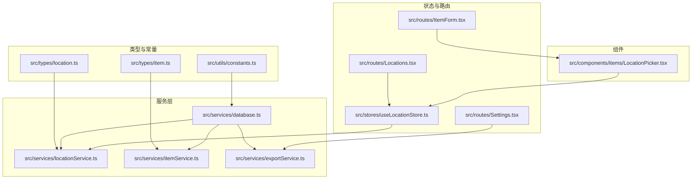
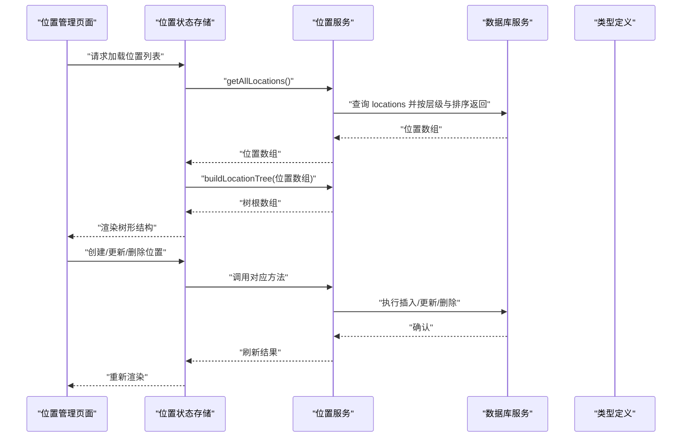
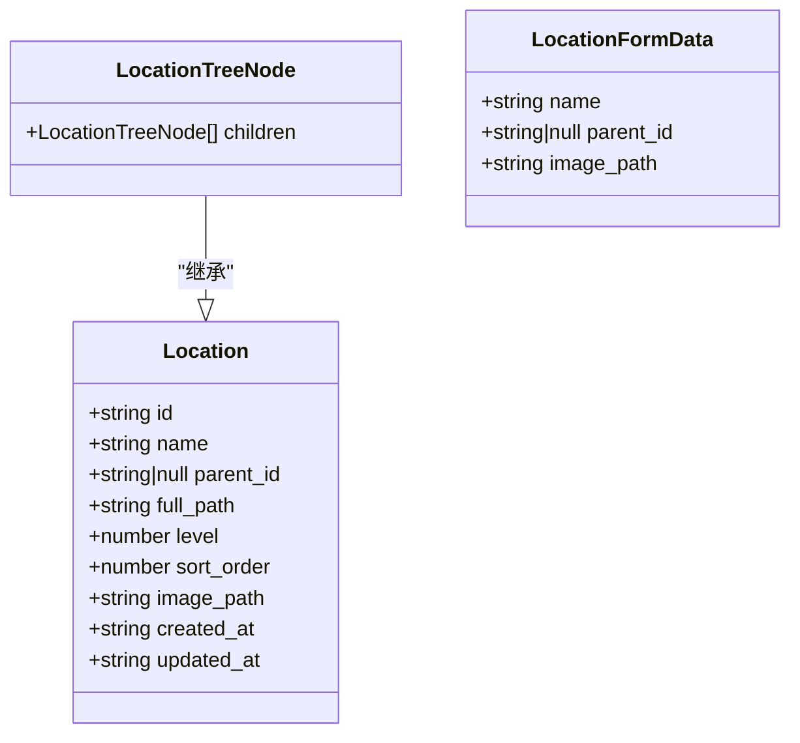
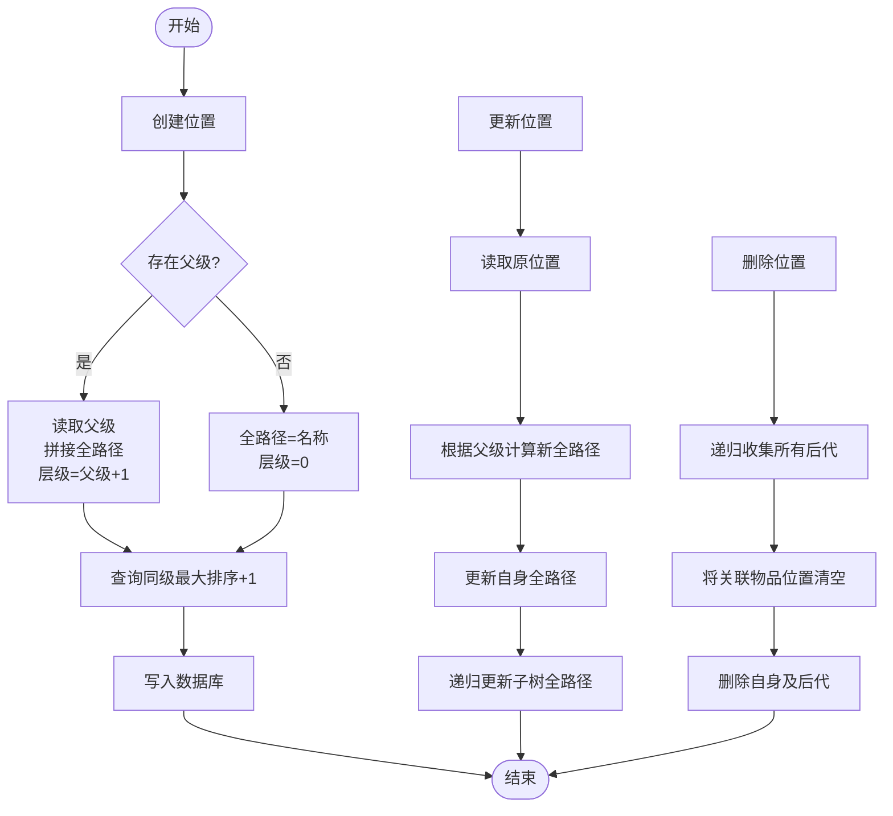
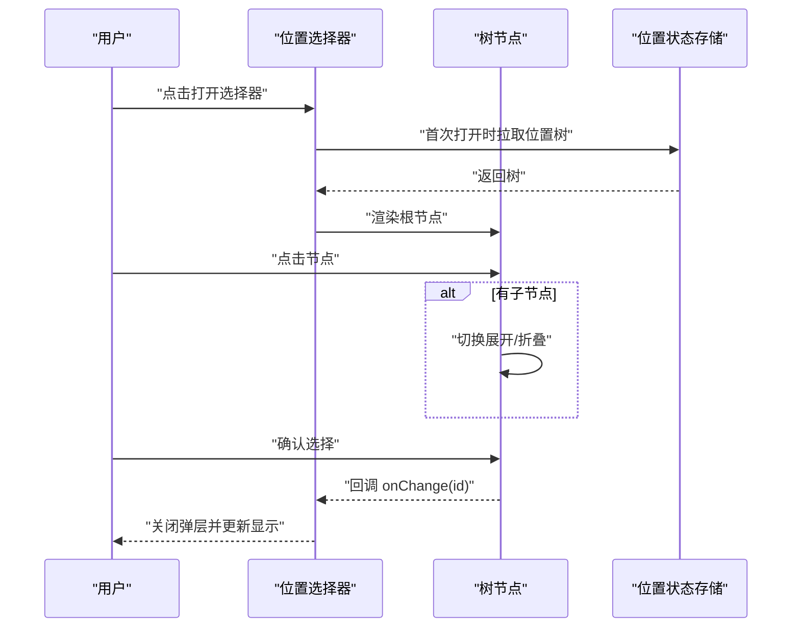
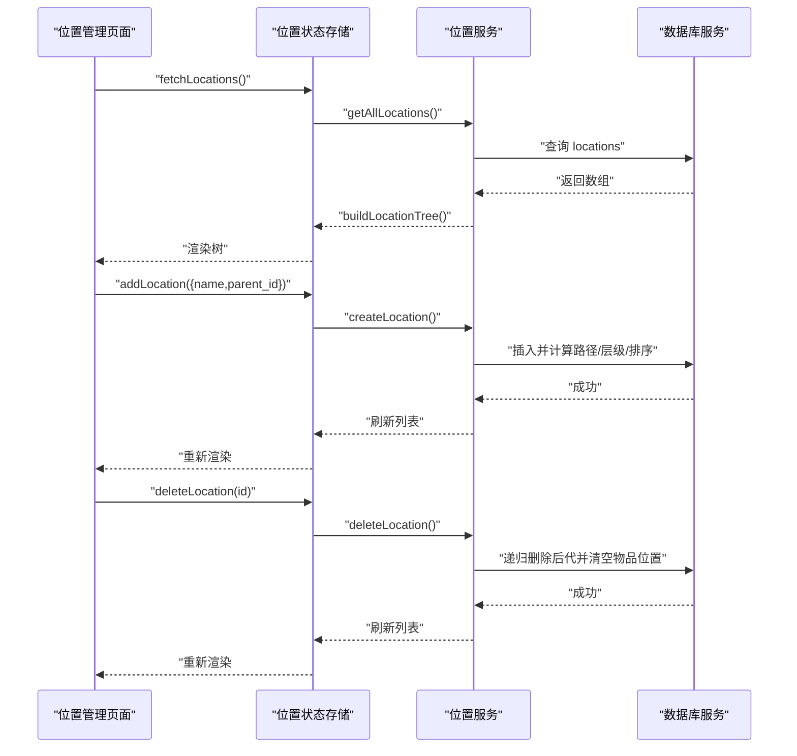
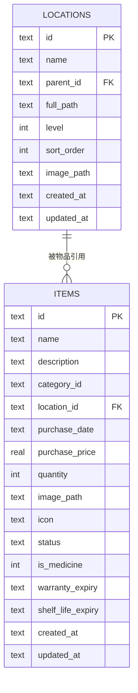
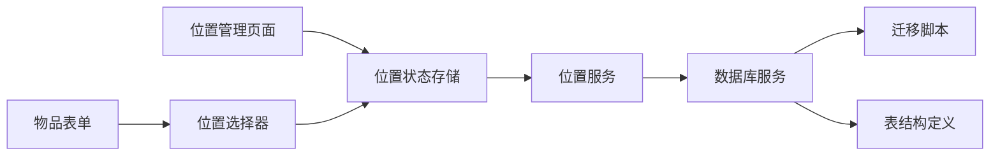

# 位置管理

<cite>
**本文引用的文件**
- [src/types/location.ts](file://src/types/location.ts)
- [src/services/locationService.ts](file://src/services/locationService.ts)
- [src/stores/useLocationStore.ts](file://src/stores/useLocationStore.ts)
- [src/routes/Locations.tsx](file://src/routes/Locations.tsx)
- [src/components/items/LocationPicker.tsx](file://src/components/items/LocationPicker.tsx)
- [src/types/item.ts](file://src/types/item.ts)
- [src/services/itemService.ts](file://src/services/itemService.ts)
- [src/routes/ItemForm.tsx](file://src/routes/ItemForm.tsx)
- [src/services/database.ts](file://src/services/database.ts)
- [src/services/exportService.ts](file://src/services/exportService.ts)
- [src/routes/Settings.tsx](file://src/routes/Settings.tsx)
- [src/utils/constants.ts](file://src/utils/constants.ts)
</cite>

## 目录
1. [简介](#简介)
2. [项目结构](#项目结构)
3. [核心组件](#核心组件)
4. [架构总览](#架构总览)
5. [详细组件分析](#详细组件分析)
6. [依赖分析](#依赖分析)
7. [性能考量](#性能考量)
8. [故障排查指南](#故障排查指南)
9. [结论](#结论)
10. [附录](#附录)

## 简介
本文件系统性梳理“位置管理”模块的设计与实现，覆盖以下主题：
- 树形位置结构：层级关系、父子节点管理、路径计算与排序
- 数据模型：层级深度、排序字段、路径标识的设计权衡
- 交互组件：位置选择器的递归渲染、展开折叠、选择交互
- 与物品关联：物品表中的位置字段及在物品管理中的应用
- 权限与数据隔离：当前实现未显式引入权限控制，建议的扩展方向
- API 文档：位置服务提供的核心接口（查询、创建、更新、删除、树构建）
- 导入导出：JSON/CSV 的导出与导入流程
- 集成扩展：与地理信息系统（GIS）的对接可能性与注意事项
- 部署与扩展：部署要点、索引优化、迁移策略与未来扩展建议

## 项目结构
位置管理涉及前端类型定义、服务层、状态管理、路由页面与组件、数据库与迁移、以及导入导出功能。下图展示与位置相关的模块关系：

图表来源
- [src/types/location.ts:1-24](file://src/types/location.ts#L1-L24)
- [src/services/locationService.ts:1-143](file://src/services/locationService.ts#L1-L143)
- [src/stores/useLocationStore.ts:1-43](file://src/stores/useLocationStore.ts#L1-L43)
- [src/routes/Locations.tsx:1-204](file://src/routes/Locations.tsx#L1-L204)
- [src/components/items/LocationPicker.tsx:1-103](file://src/components/items/LocationPicker.tsx#L1-L103)
- [src/types/item.ts:1-46](file://src/types/item.ts#L1-L46)
- [src/services/itemService.ts:1-127](file://src/services/itemService.ts#L1-L127)
- [src/services/database.ts:1-171](file://src/services/database.ts#L1-L171)
- [src/services/exportService.ts:1-154](file://src/services/exportService.ts#L1-L154)
- [src/routes/Settings.tsx:1-28](file://src/routes/Settings.tsx#L1-L28)
- [src/utils/constants.ts:1-40](file://src/utils/constants.ts#L1-L40)

章节来源
- [src/types/location.ts:1-24](file://src/types/location.ts#L1-L24)
- [src/services/locationService.ts:1-143](file://src/services/locationService.ts#L1-L143)
- [src/stores/useLocationStore.ts:1-43](file://src/stores/useLocationStore.ts#L1-L43)
- [src/routes/Locations.tsx:1-204](file://src/routes/Locations.tsx#L1-L204)
- [src/components/items/LocationPicker.tsx:1-103](file://src/components/items/LocationPicker.tsx#L1-L103)
- [src/types/item.ts:1-46](file://src/types/item.ts#L1-L46)
- [src/services/itemService.ts:1-127](file://src/services/itemService.ts#L1-L127)
- [src/services/database.ts:1-171](file://src/services/database.ts#L1-L171)
- [src/services/exportService.ts:1-154](file://src/services/exportService.ts#L1-L154)
- [src/routes/Settings.tsx:1-28](file://src/routes/Settings.tsx#L1-L28)
- [src/utils/constants.ts:1-40](file://src/utils/constants.ts#L1-L40)

## 核心组件
- 类型与模型
  - 位置实体包含：标识、名称、父级、全路径、层级、排序、图片路径、时间戳
  - 树节点在实体基础上增加子节点数组
  - 表单数据用于创建/更新时的输入约束
- 服务层
  - 提供位置的增删改查、树构建、路径更新、后代删除等能力
- 状态与路由
  - 使用状态存储统一拉取、创建、更新、删除位置，并构建树
  - 位置管理页面负责渲染树、新增、编辑、删除
  - 物品表单使用位置选择器进行位置选择
- 组件
  - 位置选择器支持递归展开、选择高亮、空值选项
- 数据库与迁移
  - 定义位置表结构、索引与迁移脚本
- 导入导出
  - 支持 JSON/CSV 导出；支持 JSON 导入（分类、位置、物品、药品）

章节来源
- [src/types/location.ts:3-23](file://src/types/location.ts#L3-L23)
- [src/services/locationService.ts:9-142](file://src/services/locationService.ts#L9-L142)
- [src/stores/useLocationStore.ts:5-42](file://src/stores/useLocationStore.ts#L5-L42)
- [src/routes/Locations.tsx:7-116](file://src/routes/Locations.tsx#L7-L116)
- [src/components/items/LocationPicker.tsx:6-63](file://src/components/items/LocationPicker.tsx#L6-L63)
- [src/services/database.ts:60-170](file://src/services/database.ts#L60-L170)
- [src/services/exportService.ts:4-154](file://src/services/exportService.ts#L4-L154)

## 架构总览
位置管理采用“类型定义 → 服务层 → 状态/路由/组件 → 数据库”的分层架构，数据通过服务层持久化到 SQLite，并在前端以树形结构展示与交互。

图表来源
- [src/routes/Locations.tsx:15-41](file://src/routes/Locations.tsx#L15-L41)
- [src/stores/useLocationStore.ts:20-41](file://src/stores/useLocationStore.ts#L20-L41)
- [src/services/locationService.ts:9-142](file://src/services/locationService.ts#L9-L142)
- [src/services/database.ts:8-16](file://src/services/database.ts#L8-L16)

## 详细组件分析

### 数据模型与树形结构
- 设计要点
  - 全路径字段用于快速显示层级关系，便于用户直观理解
  - 层级字段与排序字段共同决定展示顺序，确保稳定有序
  - 自引用外键维护父子关系，删除策略为设置为空（避免级联破坏）
- 复杂度分析
  - 树构建：O(n)，一次遍历建立映射与父子链接
  - 路径更新：递归更新子树，最坏 O(n)
  - 后代删除：递归收集后代并批量清理，最坏 O(n)

图表来源
- [src/types/location.ts:3-23](file://src/types/location.ts#L3-L23)

章节来源
- [src/types/location.ts:3-23](file://src/types/location.ts#L3-L23)
- [src/services/locationService.ts:124-142](file://src/services/locationService.ts#L124-L142)

### 位置服务与树构建
- 查询与创建
  - 创建时根据父级计算全路径与层级，保证路径一致性
  - 排序字段基于同级最大值+1，确保稳定的插入顺序
- 更新与删除
  - 更新名称时同步更新自身与所有后代的全路径
  - 删除时递归删除所有后代，并将关联物品的位置清空
- 树构建
  - 基于映射表与父指针重建树，根节点无父或父不存在即为根

图表来源
- [src/services/locationService.ts:20-92](file://src/services/locationService.ts#L20-L92)
- [src/services/locationService.ts:94-122](file://src/services/locationService.ts#L94-L122)
- [src/services/locationService.ts:124-142](file://src/services/locationService.ts#L124-L142)

章节来源
- [src/services/locationService.ts:9-142](file://src/services/locationService.ts#L9-L142)

### 位置选择器组件
- 交互逻辑
  - 支持递归展开/折叠，点击节点可选择或切换展开状态
  - 高亮当前选中节点，空值选项允许清除选择
  - 顶部按钮触发弹层，点击遮罩层关闭
- 渲染细节
  - 通过深度参数控制缩进，视觉上体现层级
  - 子节点递归渲染，保持一致的交互行为

图表来源
- [src/components/items/LocationPicker.tsx:11-63](file://src/components/items/LocationPicker.tsx#L11-L63)
- [src/components/items/LocationPicker.tsx:65-102](file://src/components/items/LocationPicker.tsx#L65-L102)
- [src/stores/useLocationStore.ts:15-25](file://src/stores/useLocationStore.ts#L15-L25)

章节来源
- [src/components/items/LocationPicker.tsx:1-103](file://src/components/items/LocationPicker.tsx#L1-L103)

### 位置管理页面与交互
- 页面职责
  - 列出根节点，支持添加顶级或子级位置
  - 编辑与删除操作均通过状态存储调用服务层
  - 删除前弹出二次确认，提示将删除所有子项并清空物品位置
- 树渲染
  - 递归渲染节点，支持展开/折叠与悬停操作区
  - 深度控制缩进，视觉清晰

图表来源
- [src/routes/Locations.tsx:7-116](file://src/routes/Locations.tsx#L7-L116)
- [src/stores/useLocationStore.ts:20-41](file://src/stores/useLocationStore.ts#L20-L41)
- [src/services/locationService.ts:9-142](file://src/services/locationService.ts#L9-L142)

章节来源
- [src/routes/Locations.tsx:1-204](file://src/routes/Locations.tsx#L1-L204)
- [src/stores/useLocationStore.ts:1-43](file://src/stores/useLocationStore.ts#L1-L43)

### 与物品的关联关系
- 关联字段
  - 物品表包含位置 ID 字段，用于关联位置树中的任意节点
- 查询与展示
  - 物品查询时通过左连接获取位置全路径，便于在列表与详情中直接展示
- 表单交互
  - 物品表单使用位置选择器，支持选择任意层级位置

图表来源
- [src/types/item.ts:5-22](file://src/types/item.ts#L5-L22)
- [src/services/itemService.ts:10-44](file://src/services/itemService.ts#L10-L44)
- [src/services/database.ts:88-103](file://src/services/database.ts#L88-L103)

章节来源
- [src/types/item.ts:1-46](file://src/types/item.ts#L1-L46)
- [src/services/itemService.ts:1-127](file://src/services/itemService.ts#L1-L127)
- [src/routes/ItemForm.tsx:173-177](file://src/routes/ItemForm.tsx#L173-L177)

### 权限控制与数据隔离
- 当前实现
  - 未发现显式的角色/权限校验与数据隔离逻辑
- 建议方案
  - 引入租户/组织维度：在位置与物品表增加组织字段，查询时强制带上组织条件
  - RBAC：为不同角色配置 CRUD 权限，服务层在执行前校验
  - 数据访问边界：在数据库层面增加视图或触发器，限制跨组织访问
  - 审计日志：记录位置变更与删除的关键动作，便于追踪

[本节为概念性建议，不直接分析具体文件，故不附“章节来源”]

## 依赖分析
- 组件耦合
  - 位置管理页面依赖状态存储；状态存储依赖服务层；服务层依赖数据库服务
  - 位置选择器独立于页面，仅依赖状态存储与类型定义
- 外部依赖
  - SQLite 作为本地数据库，Tauri 插件提供访问
  - 迁移脚本确保表结构演进与索引建立
- 潜在循环
  - 未见循环依赖；模块间为单向依赖（UI → Store → Service → DB）

图表来源
- [src/routes/Locations.tsx:3-8](file://src/routes/Locations.tsx#L3-L8)
- [src/stores/useLocationStore.ts:1-3](file://src/stores/useLocationStore.ts#L1-L3)
- [src/services/locationService.ts:1-3](file://src/services/locationService.ts#L1-L3)
- [src/services/database.ts:1-16](file://src/services/database.ts#L1-L16)
- [src/components/items/LocationPicker.tsx:3-4](file://src/components/items/LocationPicker.tsx#L3-L4)
- [src/routes/ItemForm.tsx:7](file://src/routes/ItemForm.tsx#L7)

章节来源
- [src/services/database.ts:60-170](file://src/services/database.ts#L60-L170)

## 性能考量
- 查询与排序
  - 位置查询按层级与排序字段排序，确保稳定展示
  - 建议在 parent_id、level、sort_order 上建立索引（已在迁移中创建）
- 树构建
  - 单次遍历 O(n) 构建树，适合中小规模数据
- 路径更新与删除
  - 更新与删除涉及递归，建议控制树深度与节点数量，必要时分批处理
- 导出与导入
  - 导出一次性读取多表，建议在后台线程执行，避免阻塞 UI
  - 导入采用逐条插入/替换，建议批量事务提升性能

[本节提供通用指导，不直接分析具体文件，故不附“章节来源”]

## 故障排查指南
- 无法渲染位置树
  - 检查是否已调用加载函数；确认数据库连接与迁移是否成功
- 路径异常或层级错误
  - 检查创建/更新时是否正确计算全路径与层级
- 删除后物品位置未清空
  - 确认删除流程是否递归处理后代并更新物品位置
- 导入失败
  - 检查 JSON 结构是否符合预期；查看错误列表定位失败项

章节来源
- [src/services/locationService.ts:94-122](file://src/services/locationService.ts#L94-L122)
- [src/services/exportService.ts:53-153](file://src/services/exportService.ts#L53-L153)

## 结论
位置管理模块以简洁的树形结构与稳定的路径计算为核心，结合状态存储与服务层实现了完整的 CRUD 流程。与物品的关联通过位置 ID 实现，配合位置选择器提供了良好的用户体验。当前实现未包含权限控制与数据隔离，建议在后续版本中引入组织维度与 RBAC 机制。导入导出功能完善，可满足数据备份与迁移需求。整体架构清晰、易于扩展，适合在移动端与桌面端部署。

[本节为总结性内容，不直接分析具体文件，故不附“章节来源”]

## 附录

### API 文档（位置服务）
- 获取全部位置
  - 方法：GET
  - 路径：/api/locations
  - 返回：位置数组（按层级与排序字段升序）
  - 章节来源
    - [src/services/locationService.ts:9-12](file://src/services/locationService.ts#L9-L12)
- 根据 ID 获取位置
  - 方法：GET
  - 路径：/api/locations/{id}
  - 返回：位置对象或空
  - 章节来源
    - [src/services/locationService.ts:14-18](file://src/services/locationService.ts#L14-L18)
- 创建位置
  - 方法：POST
  - 路径：/api/locations
  - 请求体：名称、父级 ID、图片路径
  - 返回：新建位置对象
  - 章节来源
    - [src/services/locationService.ts:20-53](file://src/services/locationService.ts#L20-L53)
- 更新位置
  - 方法：PUT
  - 路径：/api/locations/{id}
  - 请求体：名称、图片路径（可选）
  - 返回：无（更新成功）
  - 章节来源
    - [src/services/locationService.ts:55-77](file://src/services/locationService.ts#L55-L77)
- 删除位置
  - 方法：DELETE
  - 路径：/api/locations/{id}
  - 返回：无（删除成功）
  - 影响：递归删除后代并清空关联物品位置
  - 章节来源
    - [src/services/locationService.ts:94-109](file://src/services/locationService.ts#L94-L109)
- 构建位置树
  - 方法：POST
  - 路径：/api/locations/tree
  - 请求体：位置数组
  - 返回：树根数组
  - 章节来源
    - [src/services/locationService.ts:124-142](file://src/services/locationService.ts#L124-L142)

### 数据模型字段说明
- 位置实体
  - id：主键
  - name：名称
  - parent_id：父级 ID（自引用）
  - full_path：全路径（用于展示）
  - level：层级（根为 0）
  - sort_order：同级排序
  - image_path：图片路径
  - created_at/updated_at：时间戳
- 物品实体
  - location_id：关联位置 ID
  - 其他字段详见类型定义
- 章节来源
  - [src/types/location.ts:3-12](file://src/types/location.ts#L3-L12)
  - [src/types/item.ts:5-22](file://src/types/item.ts#L5-L22)

### 导入导出功能
- 导出
  - JSON：导出分类、位置、物品、药品
  - CSV：导出物品的常用字段（含位置全路径）
- 导入
  - JSON：支持分类、位置、物品、药品的导入与覆盖
- 章节来源
  - [src/services/exportService.ts:4-44](file://src/services/exportService.ts#L4-L44)
  - [src/services/exportService.ts:53-153](file://src/services/exportService.ts#L53-L153)
  - [src/routes/Settings.tsx:23-28](file://src/routes/Settings.tsx#L23-L28)

### 与地理信息系统（GIS）集成建议
- 场景
  - 将位置全路径映射为地理编码，或在位置中增加经纬度字段
- 方案
  - 在位置表新增地理坐标字段，或建立位置与地理编码的映射表
  - 导入时支持 GeoJSON 或 KML 文件，导出时支持标准格式
- 注意事项
  - 遵循隐私与数据安全要求，避免泄露精确地理信息
  - 对大规模地理数据进行分页与缓存优化

[本节为概念性建议，不直接分析具体文件，故不附“章节来源”]

### 部署与扩展建议
- 部署要点
  - SQLite 文件位于应用本地数据目录，注意备份与迁移
  - 迁移脚本自动执行，确保表结构与索引一致
- 扩展建议
  - 引入组织/租户维度与权限控制
  - 增加位置标签、备注、附件等扩展属性
  - 支持批量操作（移动、合并、复制）与审计日志
- 章节来源
  - [src/services/database.ts:8-16](file://src/services/database.ts#L8-L16)
  - [src/services/database.ts:60-170](file://src/services/database.ts#L60-L170)
  - [src/utils/constants.ts:4-13](file://src/utils/constants.ts#L4-L13)