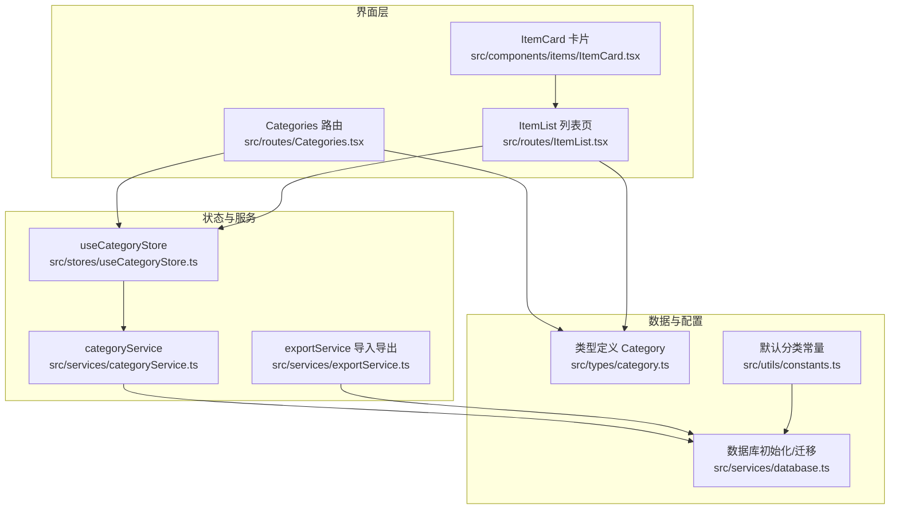
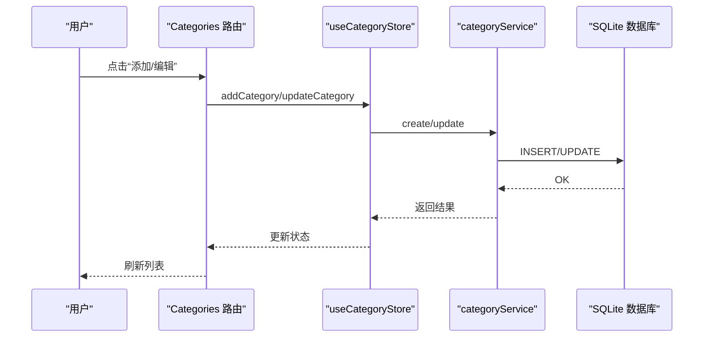
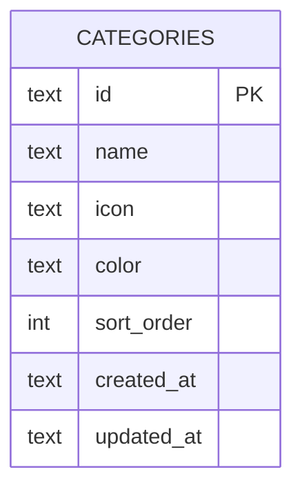
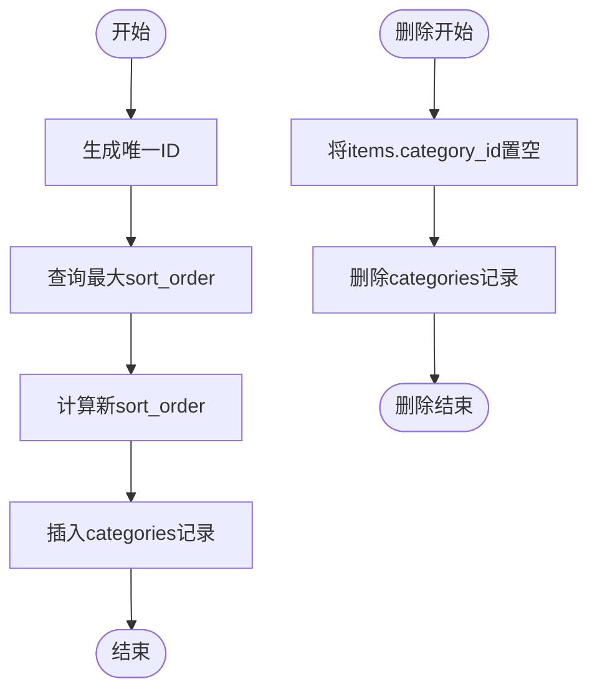
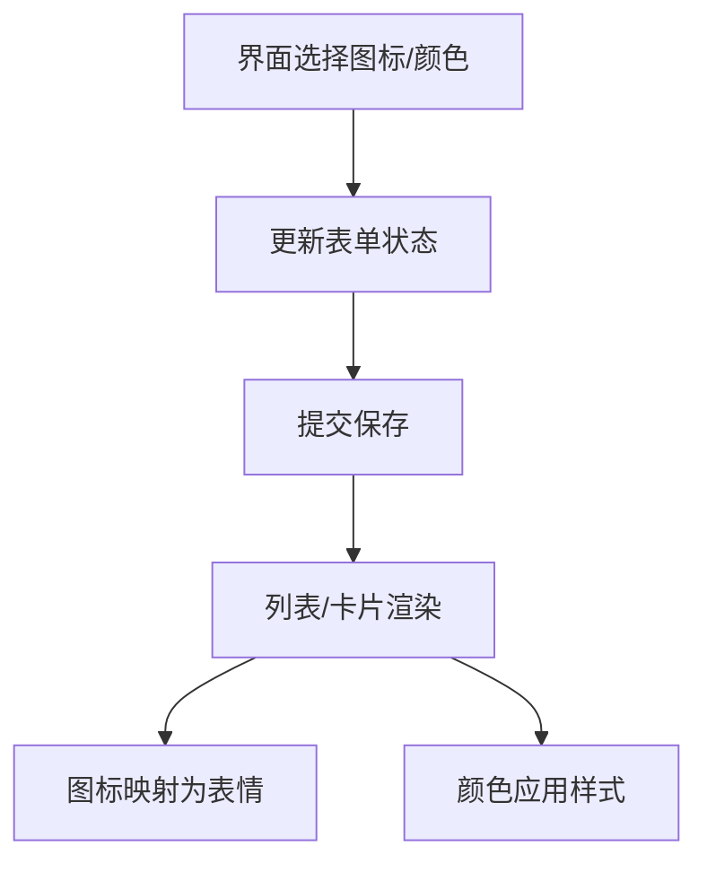
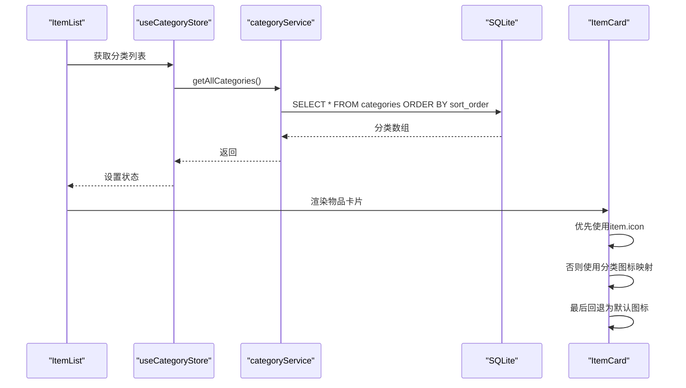
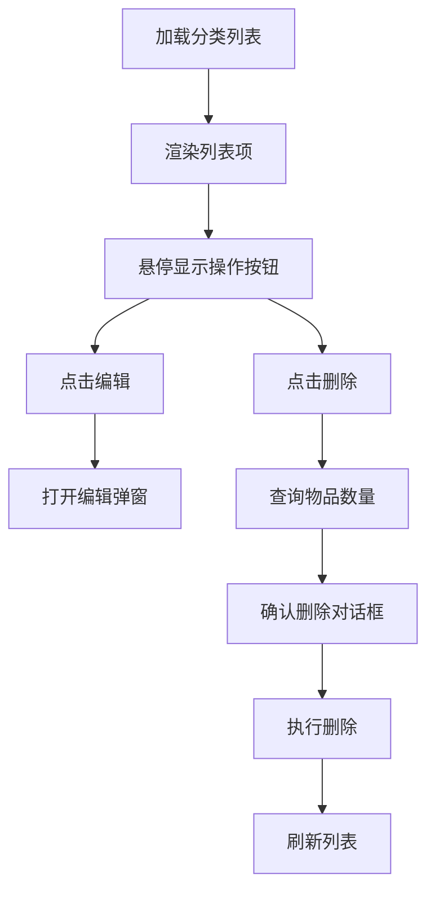
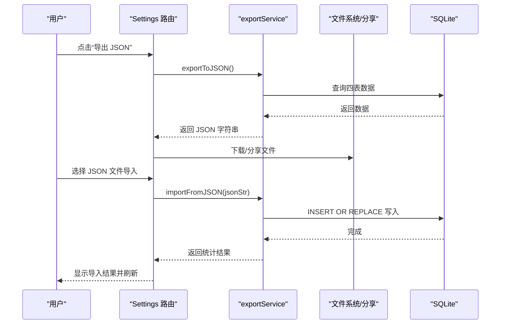
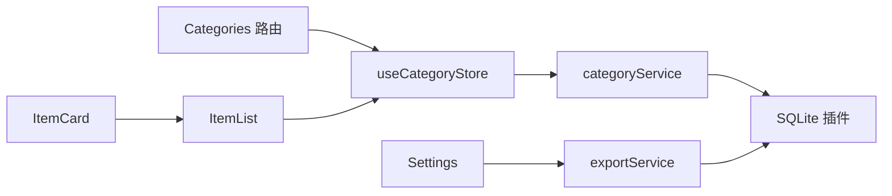

# 分类管理

<cite>
**本文引用的文件**
- [src/routes/Categories.tsx](file://src/routes/Categories.tsx)
- [src/services/categoryService.ts](file://src/services/categoryService.ts)
- [src/stores/useCategoryStore.ts](file://src/stores/useCategoryStore.ts)
- [src/types/category.ts](file://src/types/category.ts)
- [src/services/database.ts](file://src/services/database.ts)
- [src/utils/constants.ts](file://src/utils/constants.ts)
- [src/services/exportService.ts](file://src/services/exportService.ts)
- [src/routes/ItemList.tsx](file://src/routes/ItemList.tsx)
- [src/components/items/ItemCard.tsx](file://src/components/items/ItemCard.tsx)
- [src/routes/Settings.tsx](file://src/routes/Settings.tsx)
</cite>

## 目录
1. [简介](#简介)
2. [项目结构](#项目结构)
3. [核心组件](#核心组件)
4. [架构总览](#架构总览)
5. [详细组件分析](#详细组件分析)
6. [依赖分析](#依赖分析)
7. [性能考虑](#性能考虑)
8. [故障排除指南](#故障排除指南)
9. [结论](#结论)
10. [附录](#附录)

## 简介
本章节概述分类管理模块的目标与范围：通过统一的分类体系对物品进行归类，支持图标与颜色自定义，维护层级关系与排序规则，并在物品列表中直观展示。同时提供导入导出能力，保障数据可迁移与备份。

## 项目结构
分类管理模块由前端路由、状态管理、服务层与数据库层组成，配合常量配置与导入导出服务，形成完整的数据生命周期闭环。

**图表来源**
- [src/routes/Categories.tsx:1-184](file://src/routes/Categories.tsx#L1-L184)
- [src/routes/ItemList.tsx:1-185](file://src/routes/ItemList.tsx#L1-L185)
- [src/components/items/ItemCard.tsx:1-94](file://src/components/items/ItemCard.tsx#L1-L94)
- [src/stores/useCategoryStore.ts:1-44](file://src/stores/useCategoryStore.ts#L1-L44)
- [src/services/categoryService.ts:1-59](file://src/services/categoryService.ts#L1-L59)
- [src/services/exportService.ts:1-154](file://src/services/exportService.ts#L1-L154)
- [src/services/database.ts:1-171](file://src/services/database.ts#L1-L171)
- [src/types/category.ts:1-18](file://src/types/category.ts#L1-L18)
- [src/utils/constants.ts:1-40](file://src/utils/constants.ts#L1-L40)

**章节来源**
- [src/routes/Categories.tsx:1-184](file://src/routes/Categories.tsx#L1-L184)
- [src/stores/useCategoryStore.ts:1-44](file://src/stores/useCategoryStore.ts#L1-L44)
- [src/services/categoryService.ts:1-59](file://src/services/categoryService.ts#L1-L59)
- [src/services/database.ts:1-171](file://src/services/database.ts#L1-L171)
- [src/utils/constants.ts:1-40](file://src/utils/constants.ts#L1-L40)
- [src/services/exportService.ts:1-154](file://src/services/exportService.ts#L1-L154)
- [src/routes/ItemList.tsx:1-185](file://src/routes/ItemList.tsx#L1-L185)
- [src/components/items/ItemCard.tsx:1-94](file://src/components/items/ItemCard.tsx#L1-L94)

## 核心组件
- 路由组件：负责分类列表渲染、新增/编辑弹窗、删除确认与交互逻辑。
- 状态管理：集中管理分类集合与加载状态，封装 CRUD 操作。
- 服务层：封装数据库访问与业务逻辑，如排序生成、计数查询、级联更新。
- 类型系统：定义分类与表单数据结构，确保前后端一致。
- 数据库层：定义表结构、索引与迁移脚本，内置默认分类种子数据。
- 导入导出：提供 JSON 导出与导入能力，支持数据迁移与备份。

**章节来源**
- [src/routes/Categories.tsx:1-184](file://src/routes/Categories.tsx#L1-L184)
- [src/stores/useCategoryStore.ts:1-44](file://src/stores/useCategoryStore.ts#L1-L44)
- [src/services/categoryService.ts:1-59](file://src/services/categoryService.ts#L1-L59)
- [src/types/category.ts:1-18](file://src/types/category.ts#L1-L18)
- [src/services/database.ts:1-171](file://src/services/database.ts#L1-L171)
- [src/services/exportService.ts:1-154](file://src/services/exportService.ts#L1-L154)

## 架构总览
分类管理采用“界面层-状态层-服务层-数据层”的分层架构，界面层通过状态管理器调用服务层，服务层通过数据库插件访问 SQLite 数据库；导入导出服务独立于业务流程，提供数据迁移能力。

**图表来源**
- [src/routes/Categories.tsx:1-184](file://src/routes/Categories.tsx#L1-L184)
- [src/stores/useCategoryStore.ts:1-44](file://src/stores/useCategoryStore.ts#L1-L44)
- [src/services/categoryService.ts:1-59](file://src/services/categoryService.ts#L1-L59)

## 详细组件分析

### 数据模型与字段定义
- 分类实体包含标识、名称、图标、颜色、排序、创建与更新时间戳。
- 表单数据用于新增/编辑，包含名称、图标、颜色三项。
- 默认分类包含多条种子数据，含名称、图标、颜色与排序值，迁移时自动写入。

**图表来源**
- [src/services/database.ts:67-75](file://src/services/database.ts#L67-L75)
- [src/types/category.ts:3-11](file://src/types/category.ts#L3-L11)
- [src/utils/constants.ts:4-13](file://src/utils/constants.ts#L4-L13)

**章节来源**
- [src/types/category.ts:1-18](file://src/types/category.ts#L1-L18)
- [src/services/database.ts:60-141](file://src/services/database.ts#L60-L141)
- [src/utils/constants.ts:1-40](file://src/utils/constants.ts#L1-L40)

### 分类增删改查实现
- 新增：生成唯一 ID，查询最大排序值并加一，插入新记录，返回完整对象。
- 查询：按排序字段升序返回所有分类。
- 更新：更新名称、图标、颜色与更新时间。
- 删除：先将该分类下的物品归属置为空字符串，再删除分类。

**图表来源**
- [src/services/categoryService.ts:20-49](file://src/services/categoryService.ts#L20-L49)

**章节来源**
- [src/services/categoryService.ts:1-59](file://src/services/categoryService.ts#L1-L59)

### 图标与颜色自定义
- 图标选项来自固定枚举映射，界面提供图标选择器与颜色选择器。
- 渲染时根据分类图标映射为表情符号，颜色用于背景与选中态样式。
- 物品卡片优先使用物品自有图标，其次使用分类图标映射，最后回退为默认包裹图标。

**图表来源**
- [src/routes/Categories.tsx:8-9](file://src/routes/Categories.tsx#L8-L9)
- [src/routes/Categories.tsx:59-66](file://src/routes/Categories.tsx#L59-L66)
- [src/components/items/ItemCard.tsx:12-25](file://src/components/items/ItemCard.tsx#L12-L25)

**章节来源**
- [src/routes/Categories.tsx:1-184](file://src/routes/Categories.tsx#L1-L184)
- [src/components/items/ItemCard.tsx:1-94](file://src/components/items/ItemCard.tsx#L1-L94)

### 分类与物品的关联关系
- 分类与物品通过 category_id 关联，删除分类时将对应 items 的 category_id 置空，使物品显示为“未分类”。
- 列表页提供按分类筛选的标签云，支持快速过滤。
- 物品卡片展示时优先使用物品自有图标，若无则回退到分类图标映射。

**图表来源**
- [src/routes/ItemList.tsx:126-151](file://src/routes/ItemList.tsx#L126-L151)
- [src/services/categoryService.ts:9-12](file://src/services/categoryService.ts#L9-L12)
- [src/components/items/ItemCard.tsx:37-42](file://src/components/items/ItemCard.tsx#L37-L42)

**章节来源**
- [src/routes/ItemList.tsx:1-185](file://src/routes/ItemList.tsx#L1-L185)
- [src/services/categoryService.ts:1-59](file://src/services/categoryService.ts#L1-L59)
- [src/components/items/ItemCard.tsx:1-94](file://src/components/items/ItemCard.tsx#L1-L94)

### 分类列表渲染与交互设计
- 列表项包含圆形图标区（背景色+透明度）、分类名称、编辑与删除按钮。
- 新增/编辑弹窗提供输入框、图标选择器、颜色选择器与保存按钮。
- 删除前查询物品数量，提示将导致物品变为“未分类”。

**图表来源**
- [src/routes/Categories.tsx:80-102](file://src/routes/Categories.tsx#L80-L102)
- [src/routes/Categories.tsx:104-168](file://src/routes/Categories.tsx#L104-L168)
- [src/routes/Categories.tsx:36-47](file://src/routes/Categories.tsx#L36-L47)

**章节来源**
- [src/routes/Categories.tsx:1-184](file://src/routes/Categories.tsx#L1-L184)

### 分类管理 API 说明
- 获取所有分类
  - 方法：GET
  - 路径：/api/categories
  - 请求参数：无
  - 响应：分类数组，按 sort_order 升序排列
  - 错误：数据库异常时抛出错误
- 创建分类
  - 方法：POST
  - 路径：/api/categories
  - 请求体：CategoryFormData（name, icon, color）
  - 响应：Category 对象（包含生成的 id、sort_order、created_at、updated_at）
  - 错误：重复或约束冲突时抛出错误
- 更新分类
  - 方法：PUT
  - 路径：/api/categories/:id
  - 请求体：CategoryFormData
  - 响应：无（204 No Content）
  - 错误：id 不存在或约束冲突时抛出错误
- 删除分类
  - 方法：DELETE
  - 路径：/api/categories/:id
  - 请求参数：无
  - 响应：无（204 No Content）
  - 说明：删除前将 items 中对应分类的 category_id 置空
  - 错误：数据库异常时抛出错误

注：以上为概念性 API 规范，实际实现以服务层方法为准。

**章节来源**
- [src/services/categoryService.ts:9-59](file://src/services/categoryService.ts#L9-L59)

### 导入导出与数据迁移
- 导出
  - JSON：导出 categories、locations、items、medicines 四张表，按推荐顺序排序。
  - CSV：导出物品明细，包含分类名称、位置全路径、药品信息等。
- 导入
  - 支持从 JSON 文件导入四类数据，逐条写入，相同 ID 的记录会被替换。
  - 导入完成后刷新页面，确保状态同步。
- 备份策略
  - 建议定期导出 JSON 作为备份，移动设备可通过分享面板或 Web Share API 保存。
  - 桌面端直接下载至本地存储。

**图表来源**
- [src/routes/Settings.tsx:23-146](file://src/routes/Settings.tsx#L23-L146)
- [src/services/exportService.ts:4-154](file://src/services/exportService.ts#L4-L154)

**章节来源**
- [src/routes/Settings.tsx:1-298](file://src/routes/Settings.tsx#L1-L298)
- [src/services/exportService.ts:1-154](file://src/services/exportService.ts#L1-L154)

## 依赖分析
- 组件耦合
  - Categories 路由依赖 useCategoryStore 与 categoryService。
  - useCategoryStore 依赖 categoryService，后者依赖数据库插件。
  - ItemList 依赖 useCategoryStore 与 useItemStore，间接使用分类数据。
  - ItemCard 依赖设置与分类映射，不直接依赖分类服务。
- 外部依赖
  - SQLite 插件用于本地持久化。
  - Tauri 文件系统与分享能力用于移动端导出。
- 循环依赖
  - 未发现循环依赖，分层清晰。

**图表来源**
- [src/routes/Categories.tsx:1-184](file://src/routes/Categories.tsx#L1-L184)
- [src/stores/useCategoryStore.ts:1-44](file://src/stores/useCategoryStore.ts#L1-L44)
- [src/services/categoryService.ts:1-59](file://src/services/categoryService.ts#L1-L59)
- [src/routes/ItemList.tsx:1-185](file://src/routes/ItemList.tsx#L1-L185)
- [src/components/items/ItemCard.tsx:1-94](file://src/components/items/ItemCard.tsx#L1-L94)
- [src/routes/Settings.tsx:1-298](file://src/routes/Settings.tsx#L1-L298)
- [src/services/exportService.ts:1-154](file://src/services/exportService.ts#L1-L154)

**章节来源**
- [src/routes/Categories.tsx:1-184](file://src/routes/Categories.tsx#L1-L184)
- [src/stores/useCategoryStore.ts:1-44](file://src/stores/useCategoryStore.ts#L1-L44)
- [src/services/categoryService.ts:1-59](file://src/services/categoryService.ts#L1-L59)
- [src/routes/ItemList.tsx:1-185](file://src/routes/ItemList.tsx#L1-L185)
- [src/components/items/ItemCard.tsx:1-94](file://src/components/items/ItemCard.tsx#L1-L94)
- [src/routes/Settings.tsx:1-298](file://src/routes/Settings.tsx#L1-L298)
- [src/services/exportService.ts:1-154](file://src/services/exportService.ts#L1-L154)

## 性能考虑
- 排序与索引
  - 分类表按 sort_order 排序，查询效率高。
  - 物品表按 category_id 建有索引，筛选与统计更高效。
- 状态更新
  - 使用内存状态集中管理，避免频繁网络请求。
- 渲染优化
  - 列表项与卡片组件保持轻量，减少重绘。
- 导入导出
  - 大批量导入采用逐条写入，失败不影响整体流程，建议分批处理。

[本节为通用性能建议，无需特定文件来源]

## 故障排除指南
- 删除分类时报错
  - 检查是否存在物品仍属于该分类，确认删除前的计数逻辑是否正确。
  - 参考：[src/services/categoryService.ts:44-49](file://src/services/categoryService.ts#L44-L49)
- 导入失败
  - JSON 解析失败或某条记录写入失败都会记录错误，检查错误列表与日志。
  - 参考：[src/services/exportService.ts:53-154](file://src/services/exportService.ts#L53-L154)
- 图标/颜色不生效
  - 确认表单提交成功且状态已更新。
  - 参考：[src/routes/Categories.tsx:104-168](file://src/routes/Categories.tsx#L104-L168)
- 移动端导出无法分享
  - 优先尝试 Android 原生分享接口，失败后回退到 Web Share API 或浏览器下载。
  - 参考：[src/routes/Settings.tsx:30-106](file://src/routes/Settings.tsx#L30-L106)

**章节来源**
- [src/services/categoryService.ts:44-49](file://src/services/categoryService.ts#L44-L49)
- [src/services/exportService.ts:53-154](file://src/services/exportService.ts#L53-L154)
- [src/routes/Categories.tsx:104-168](file://src/routes/Categories.tsx#L104-L168)
- [src/routes/Settings.tsx:30-106](file://src/routes/Settings.tsx#L30-L106)

## 结论
分类管理模块通过清晰的分层设计与完善的 CRUD 流程，实现了图标与颜色自定义、排序与默认分类、与物品的关联展示及导入导出备份能力。建议在生产环境中结合索引与批量导入策略，持续优化用户体验与数据安全性。

[本节为总结性内容，无需特定文件来源]

## 附录

### 实际使用场景
- 快速建立家庭物品分类体系，如“电子产品”“家具家电”“药品保健”等。
- 在物品列表中通过分类标签云快速筛选与浏览。
- 将旧设备或闲置物品迁移到新的分类，或统一到“其他”分类。

### 扩展开发指导
- 新增分类字段
  - 在类型定义与数据库迁移中同步增加字段，并在服务层与 UI 中适配。
  - 参考：[src/types/category.ts:3-11](file://src/types/category.ts#L3-L11)，[src/services/database.ts:60-141](file://src/services/database.ts#L60-L141)
- 自定义排序
  - 当前排序为自动递增，如需拖拽排序可在 UI 层维护排序队列并在保存时批量更新。
  - 参考：[src/services/categoryService.ts:24-27](file://src/services/categoryService.ts#L24-L27)
- 多级分类
  - 若需要树形层级，可在 locations 表基础上扩展分类树结构，注意维护 full_path 与 level 字段。
  - 参考：[src/services/database.ts:77-87](file://src/services/database.ts#L77-L87)

**章节来源**
- [src/types/category.ts:1-18](file://src/types/category.ts#L1-L18)
- [src/services/database.ts:60-141](file://src/services/database.ts#L60-L141)
- [src/services/categoryService.ts:24-27](file://src/services/categoryService.ts#L24-L27)