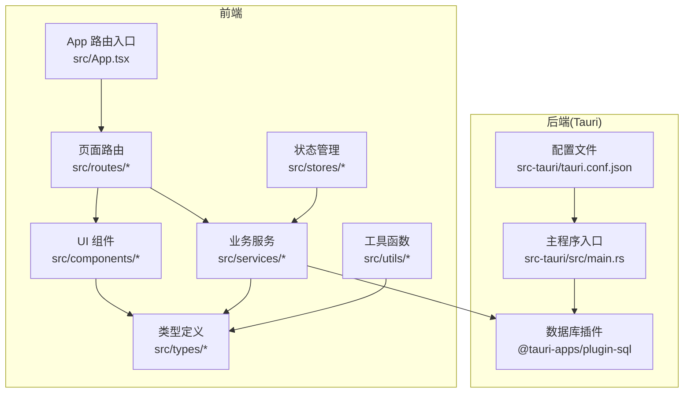
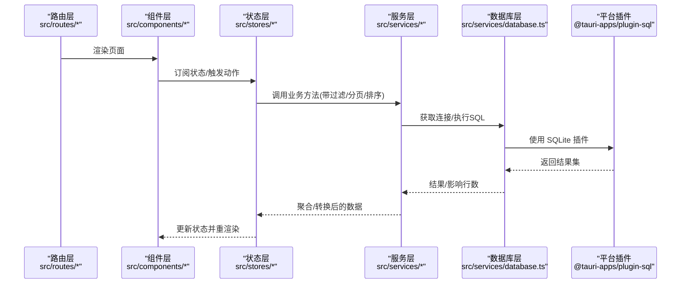
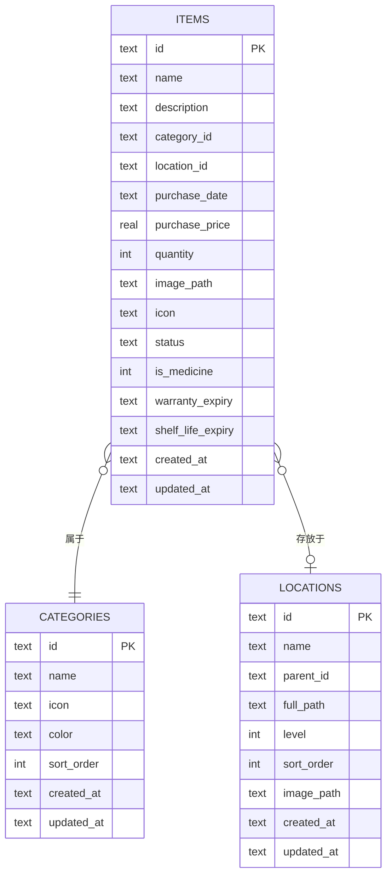
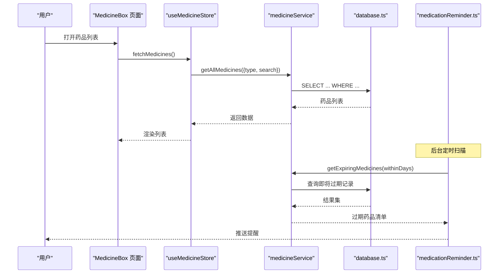
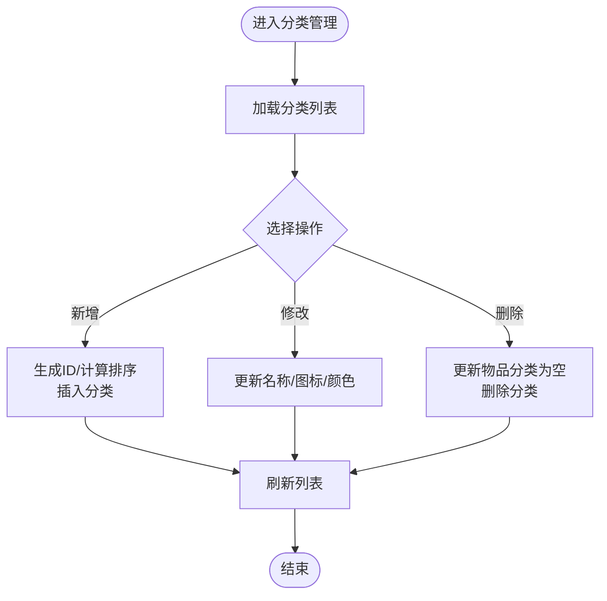
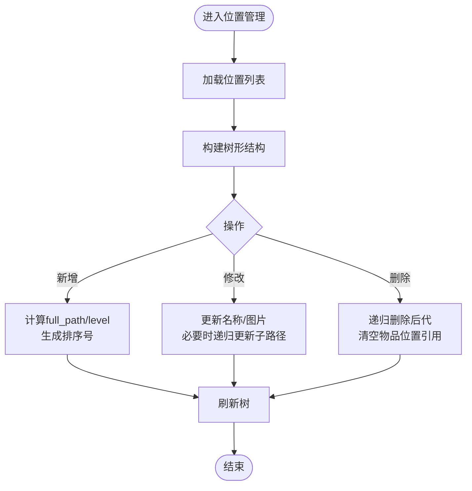
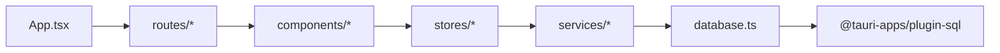

# 核心功能模块

<cite>
**本文引用的文件**
- [src/App.tsx](file://src/App.tsx)
- [src/main.tsx](file://src/main.tsx)
- [src/routes/Dashboard.tsx](file://src/routes/Dashboard.tsx)
- [src/routes/ItemList.tsx](file://src/routes/ItemList.tsx)
- [src/routes/ItemForm.tsx](file://src/routes/ItemForm.tsx)
- [src/routes/ItemDetail.tsx](file://src/routes/ItemDetail.tsx)
- [src/routes/Categories.tsx](file://src/routes/Categories.tsx)
- [src/routes/Locations.tsx](file://src/routes/Locations.tsx)
- [src/routes/MedicineBox.tsx](file://src/routes/MedicineBox.tsx)
- [src/routes/MedicineForm.tsx](file://src/routes/MedicineForm.tsx)
- [src/routes/Statistics.tsx](file://src/routes/Statistics.tsx)
- [src/routes/Settings.tsx](file://src/routes/Settings.tsx)
- [src/routes/Logs.tsx](file://src/routes/Logs.tsx)
- [src/services/database.ts](file://src/services/database.ts)
- [src/services/itemService.ts](file://src/services/itemService.ts)
- [src/services/medicineService.ts](file://src/services/medicineService.ts)
- [src/services/categoryService.ts](file://src/services/categoryService.ts)
- [src/services/locationService.ts](file://src/services/locationService.ts)
- [src/services/medicationReminder.ts](file://src/services/medicationReminder.ts)
- [src/stores/useItemStore.ts](file://src/stores/useItemStore.ts)
- [src/stores/useMedicineStore.ts](file://src/stores/useMedicineStore.ts)
- [src/stores/useDashboardStore.ts](file://src/stores/useDashboardStore.ts)
- [src/stores/useCategoryStore.ts](file://src/stores/useCategoryStore.ts)
- [src/stores/useLocationStore.ts](file://src/stores/useLocationStore.ts)
- [src/stores/useSettingsStore.ts](file://src/stores/useSettingsStore.ts)
- [src/types/item.ts](file://src/types/item.ts)
- [src/types/medicine.ts](file://src/types/medicine.ts)
- [src/types/category.ts](file://src/types/category.ts)
- [src/types/location.ts](file://src/types/location.ts)
- [src/utils/constants.ts](file://src/utils/constants.ts)
- [src/utils/currencyHelper.ts](file://src/utils/currencyHelper.ts)
- [src/utils/dateHelper.ts](file://src/utils/dateHelper.ts)
- [src/utils/logger.ts](file://src/utils/logger.ts)
- [src/components/items/ItemCard.tsx](file://src/components/items/ItemCard.tsx)
- [src/components/medicine/ExpiryBadge.tsx](file://src/components/medicine/ExpiryBadge.tsx)
- [src/components/shared/SearchBar.tsx](file://src/components/shared/SearchBar.tsx)
- [src/components/shared/DatePicker.tsx](file://src/components/shared/DatePicker.tsx)
- [src/components/shared/TimePicker.tsx](file://src/components/shared/TimePicker.tsx)
- [src/components/layout/AppShell.tsx](file://src/components/layout/AppShell.tsx)
- [src-tauri/src/main.rs](file://src-tauri/src/main.rs)
- [src-tauri/tauri.conf.json](file://src-tauri/tauri.conf.json)
</cite>

## 目录
1. [简介](#简介)
2. [项目结构](#项目结构)
3. [核心组件](#核心组件)
4. [架构总览](#架构总览)
5. [详细组件分析](#详细组件分析)
6. [依赖分析](#依赖分析)
7. [性能考虑](#性能考虑)
8. [故障排查指南](#故障排查指南)
9. [结论](#结论)
10. [附录](#附录)

## 简介
Assetly 是一款基于 Tauri + React 的跨平台桌面应用，围绕“家庭资产管理”与“药品管理”两大核心场景设计。系统通过统一的数据层（SQLite）与服务层（数据库访问 + 业务逻辑），提供资产管理、药品管理、分类管理、位置管理四大模块，并内置过期预警、用药提醒、智能搜索与多维筛选等实用能力。本文档面向开发者与产品人员，系统梳理模块设计、数据流与扩展点，帮助快速上手与深度定制。

## 项目结构
前端采用 React + Zustand 状态管理，路由集中于 src/routes 下；服务层封装数据库操作与业务逻辑；类型定义位于 src/types；工具函数位于 src/utils；UI 组件位于 src/components；后端桥接由 Tauri 提供，数据库插件在 src-tauri 中配置。

图表来源
- [src/App.tsx:1-92](file://src/App.tsx#L1-L92)
- [src/main.tsx:1-11](file://src/main.tsx#L1-L11)
- [src-tauri/src/main.rs:1-50](file://src-tauri/src/main.rs#L1-L50)
- [src-tauri/tauri.conf.json:1-100](file://src-tauri/tauri.conf.json#L1-L100)

章节来源
- [src/App.tsx:1-92](file://src/App.tsx#L1-L92)
- [src/main.tsx:1-11](file://src/main.tsx#L1-L11)

## 核心组件
- 数据库层：负责连接 SQLite、执行迁移、维护表结构与索引。
- 服务层：封装 CRUD 与聚合查询，屏蔽数据库细节。
- 状态层：Zustand Store 管理列表、过滤器、加载态与活跃标签页。
- 类型层：统一定义实体字段与表结构映射。
- UI 层：卡片、表单、筛选器、图表等可复用组件。
- 路由层：集中管理页面路径与导航。

章节来源
- [src/services/database.ts:1-171](file://src/services/database.ts#L1-L171)
- [src/stores/useItemStore.ts:1-53](file://src/stores/useItemStore.ts#L1-L53)
- [src/stores/useMedicineStore.ts:1-42](file://src/stores/useMedicineStore.ts#L1-L42)
- [src/types/item.ts:1-46](file://src/types/item.ts#L1-L46)
- [src/types/medicine.ts:1-70](file://src/types/medicine.ts#L1-L70)
- [src/types/category.ts:1-18](file://src/types/category.ts#L1-L18)
- [src/types/location.ts:1-24](file://src/types/location.ts#L1-L24)

## 架构总览
系统采用“路由 -> 页面 -> 组件 -> Store -> Service -> 数据库”的分层架构。页面通过 Store 触发服务调用，服务层进行参数拼装与 SQL 查询，最终落库或返回聚合结果。提醒与日志贯穿应用生命周期，确保可观测性与用户体验。

图表来源
- [src/routes/Dashboard.tsx:1-235](file://src/routes/Dashboard.tsx#L1-L235)
- [src/stores/useItemStore.ts:1-53](file://src/stores/useItemStore.ts#L1-L53)
- [src/stores/useMedicineStore.ts:1-42](file://src/stores/useMedicineStore.ts#L1-L42)
- [src/services/itemService.ts:1-127](file://src/services/itemService.ts#L1-L127)
- [src/services/medicineService.ts:1-194](file://src/services/medicineService.ts#L1-L194)
- [src/services/database.ts:1-171](file://src/services/database.ts#L1-L171)

## 详细组件分析

### 资产管理模块
设计理念
- 将“物品”作为核心实体，支持分类、位置、购买日期、价格、数量、图标、状态等属性。
- 通过 Store 管理列表与过滤器，服务层提供多维筛选与全文检索。
- UI 卡片展示关键指标（总价、日均成本、使用时长），提升信息密度。

业务流程
- 列表页：按创建时间倒序展示，支持按分类、位置、状态、名称模糊搜索。
- 表单页：新增/编辑物品，选择分类与位置，填写购买信息与图片/图标。
- 详情页：展示完整信息与关联位置路径。

数据模型与复杂度
- 实体：Item、ItemWithDetails、ItemFormData。
- 关键查询：动态拼接 WHERE 条件，LIKE 模糊匹配，索引覆盖 category_id、location_id、status。
- 时间复杂度：每次查询 O(log n + k)（索引查找 + 结果集），k 为返回条数。

用户交互模式
- 快速筛选：下拉选择分类/位置/状态，输入框实时搜索。
- 卡片点击进入详情，支持批量操作与状态切换。

图表来源
- [src/types/item.ts:5-22](file://src/types/item.ts#L5-L22)
- [src/types/category.ts:3-11](file://src/types/category.ts#L3-L11)
- [src/types/location.ts:3-13](file://src/types/location.ts#L3-L13)

章节来源
- [src/routes/ItemList.tsx:1-200](file://src/routes/ItemList.tsx#L1-L200)
- [src/routes/ItemForm.tsx:1-200](file://src/routes/ItemForm.tsx#L1-L200)
- [src/routes/ItemDetail.tsx:1-200](file://src/routes/ItemDetail.tsx#L1-L200)
- [src/stores/useItemStore.ts:1-53](file://src/stores/useItemStore.ts#L1-L53)
- [src/services/itemService.ts:10-44](file://src/services/itemService.ts#L10-L44)
- [src/components/items/ItemCard.tsx:1-94](file://src/components/items/ItemCard.tsx#L1-L94)

### 药品管理模块
设计理念
- 药品是“物品”的一种扩展，额外具备有效期、剩余数量、单位、制造商、是否正在服用、服药频率、时间段、持续周期等字段。
- 支持“正在服用”清单与“即将过期”预警，结合提醒机制提升依从性。

业务流程
- 列表页：按有效期升序排列，支持按类型筛选（内服/外用/急救）与名称搜索。
- 表单页：填写基础物品信息与药品扩展信息，设置提醒规则（每日、每隔 N 天、每周）。
- 预警与提醒：后台定时任务扫描即将过期药品，触发系统通知。

图表来源
- [src/routes/MedicineBox.tsx:1-200](file://src/routes/MedicineBox.tsx#L1-L200)
- [src/routes/MedicineForm.tsx:1-200](file://src/routes/MedicineForm.tsx#L1-L200)
- [src/stores/useMedicineStore.ts:15-41](file://src/stores/useMedicineStore.ts#L15-L41)
- [src/services/medicineService.ts:10-37](file://src/services/medicineService.ts#L10-L37)
- [src/services/medicineService.ts:164-178](file://src/services/medicineService.ts#L164-L178)
- [src/services/medicationReminder.ts:1-200](file://src/services/medicationReminder.ts#L1-200)

章节来源
- [src/routes/MedicineBox.tsx:1-200](file://src/routes/MedicineBox.tsx#L1-L200)
- [src/routes/MedicineForm.tsx:1-200](file://src/routes/MedicineForm.tsx#L1-L200)
- [src/stores/useMedicineStore.ts:1-42](file://src/stores/useMedicineStore.ts#L1-L42)
- [src/services/medicineService.ts:10-194](file://src/services/medicineService.ts#L10-L194)
- [src/types/medicine.ts:1-70](file://src/types/medicine.ts#L1-L70)

### 分类管理模块
设计理念
- 分类用于对物品进行语义化归类，支持图标、颜色与排序。
- 删除分类时，将相关物品的分类置空，避免悬挂引用。

业务流程
- 列表页：按排序字段升序展示，支持增删改。
- 新增：生成唯一 ID，计算最大排序值 + 1。
- 更新：直接更新名称、图标、颜色。
- 删除：先清理物品分类，再删除分类。

图表来源
- [src/routes/Categories.tsx:1-200](file://src/routes/Categories.tsx#L1-L200)
- [src/services/categoryService.ts:20-59](file://src/services/categoryService.ts#L20-L59)

章节来源
- [src/routes/Categories.tsx:1-200](file://src/routes/Categories.tsx#L1-L200)
- [src/services/categoryService.ts:1-59](file://src/services/categoryService.ts#L1-L59)
- [src/types/category.ts:1-18](file://src/types/category.ts#L1-L18)

### 位置管理模块
设计理念
- 位置采用自引用树形结构，支持层级路径与排序，便于构建“房间-货架-抽屉”等多级空间。
- 修改父节点会递归更新所有子节点的 full_path，保证路径一致性。

业务流程
- 列表页：按层级与排序展示，支持增删改。
- 新增：计算 full_path 与 level，生成排序号。
- 更新：若修改名称，递归更新子节点 full_path。
- 删除：递归删除所有后代节点，同时清空物品的位置引用。

图表来源
- [src/routes/Locations.tsx:1-200](file://src/routes/Locations.tsx#L1-L200)
- [src/services/locationService.ts:20-143](file://src/services/locationService.ts#L20-L143)

章节来源
- [src/routes/Locations.tsx:1-200](file://src/routes/Locations.tsx#L1-L200)
- [src/services/locationService.ts:1-143](file://src/services/locationService.ts#L1-L143)
- [src/types/location.ts:1-24](file://src/types/location.ts#L1-L24)

### 智能搜索与多维筛选
- 资产管理：支持按分类、位置、状态、名称模糊搜索，动态拼接 WHERE 条件与 LIKE 匹配。
- 药品管理：支持按类型与名称搜索，按有效期升序排列。
- 性能优化：为 items、medicines、locations 等关键字段建立索引，减少全表扫描。

章节来源
- [src/services/itemService.ts:10-44](file://src/services/itemService.ts#L10-L44)
- [src/services/medicineService.ts:10-37](file://src/services/medicineService.ts#L10-L37)
- [src/services/database.ts:124-131](file://src/services/database.ts#L124-L131)

### 过期预警与用药提醒
- 过期预警：按当前日期加宽限期查询即将过期药品，用于仪表盘与列表展示。
- 用药提醒：后台定时扫描正在服用的药品，根据频率与时间段生成提醒事件，推送系统通知。

章节来源
- [src/services/medicineService.ts:164-178](file://src/services/medicineService.ts#L164-L178)
- [src/services/medicationReminder.ts:1-200](file://src/services/medicationReminder.ts#L1-200)
- [src/routes/Dashboard.tsx:112-141](file://src/routes/Dashboard.tsx#L112-L141)

### 仪表盘与统计
- 汇总卡片：总资产、物品总数、药品种类、过期预警数量。
- 正在服用：展示当前正在服用的药品及其服药计划。
- 资产分布：按分类统计价值占比，使用饼图可视化。

章节来源
- [src/routes/Dashboard.tsx:13-235](file://src/routes/Dashboard.tsx#L13-L235)
- [src/stores/useDashboardStore.ts:1-200](file://src/stores/useDashboardStore.ts#L1-L200)

## 依赖分析
- 路由到页面：App 负责注册所有路由与布局外壳。
- 页面到组件：各页面引入共享组件（搜索栏、日期/时间选择器、卡片等）。
- 组件到服务：页面与卡片通过 Store 调用服务层方法。
- 服务到数据库：服务层统一通过 database.ts 获取连接并执行 SQL。
- 平台插件：Tauri SQLite 插件提供跨平台数据库能力。

图表来源
- [src/App.tsx:1-92](file://src/App.tsx#L1-L92)
- [src/services/database.ts:1-171](file://src/services/database.ts#L1-L171)

章节来源
- [src/App.tsx:1-92](file://src/App.tsx#L1-L92)
- [src/main.tsx:1-11](file://src/main.tsx#L1-L11)
- [src-tauri/src/main.rs:1-50](file://src-tauri/src/main.rs#L1-L50)

## 性能考虑
- 索引策略：为高频过滤字段建立索引，降低查询成本。
- 动态 SQL：按需拼接 WHERE 条件，避免不必要的全表扫描。
- 分页与截断：列表页对结果进行截断显示，减少渲染压力。
- 日志与监控：统一日志接口，便于定位慢查询与异常。

## 故障排查指南
- 数据库连接失败：检查插件初始化与迁移执行日志。
- 查询异常：核对 SQL 参数绑定与表结构变更（迁移）。
- 提醒未触发：确认后台定时任务已启动，且扫描逻辑正常。
- 图标/路径问题：检查 full_path 与图标映射逻辑，确保更新父节点时递归更新子节点。

章节来源
- [src/utils/logger.ts:1-200](file://src/utils/logger.ts#L1-L200)
- [src/services/database.ts:18-53](file://src/services/database.ts#L18-L53)
- [src/services/medicineService.ts:164-178](file://src/services/medicineService.ts#L164-L178)

## 结论
Assetly 以清晰的分层架构与统一的数据模型，实现了资产管理与药品管理的闭环。通过索引、动态 SQL 与 Store 管理，兼顾了易用性与性能。建议在扩展新功能时遵循现有模式：先定义类型与服务方法，再接入 Store 与页面，最后补充测试与日志。

## 附录
- 默认分类与种子数据：迁移脚本中包含默认分类与设置项的初始化。
- 常量与工具：常量、货币与日期工具为 UI 与业务逻辑提供支撑。
- 设置与主题：支持主题色与货币符号配置，影响 UI 显示与格式化。

章节来源
- [src/services/database.ts:60-171](file://src/services/database.ts#L60-L171)
- [src/utils/constants.ts:1-200](file://src/utils/constants.ts#L1-L200)
- [src/utils/currencyHelper.ts:1-200](file://src/utils/currencyHelper.ts#L1-L200)
- [src/utils/dateHelper.ts:1-200](file://src/utils/dateHelper.ts#L1-L200)
- [src/routes/Settings.tsx:1-200](file://src/routes/Settings.tsx#L1-L200)