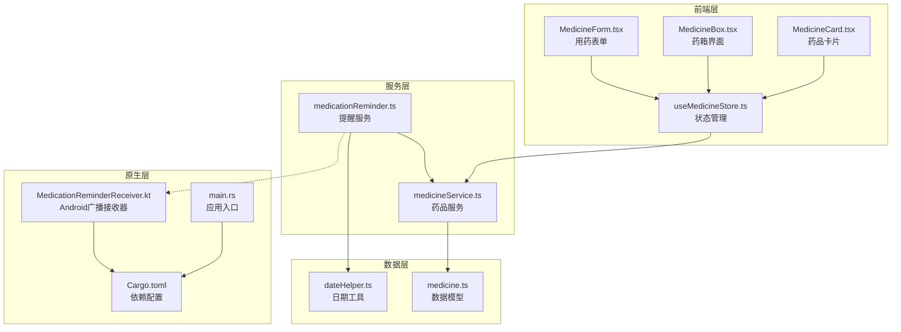
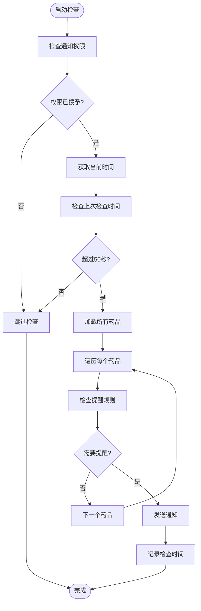
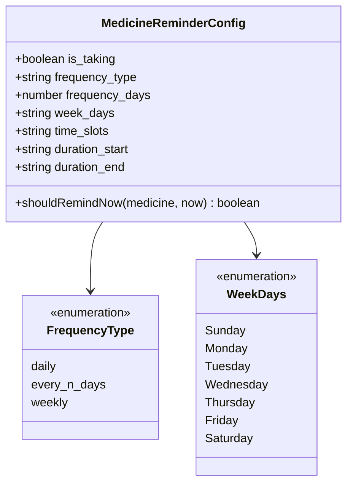
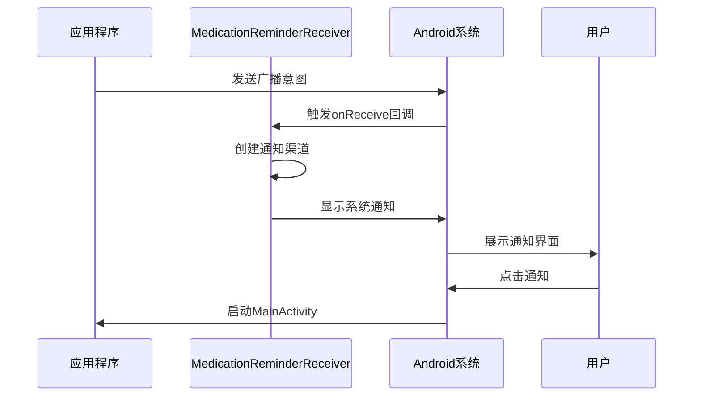
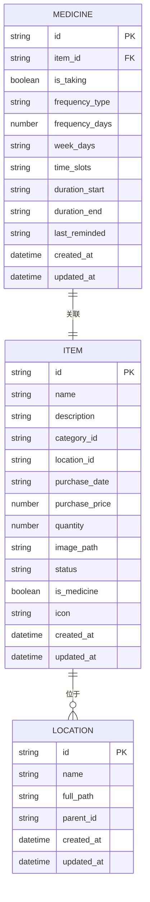
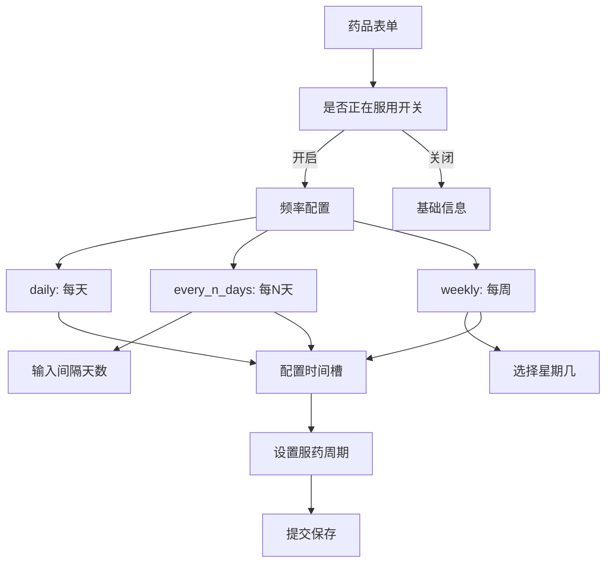
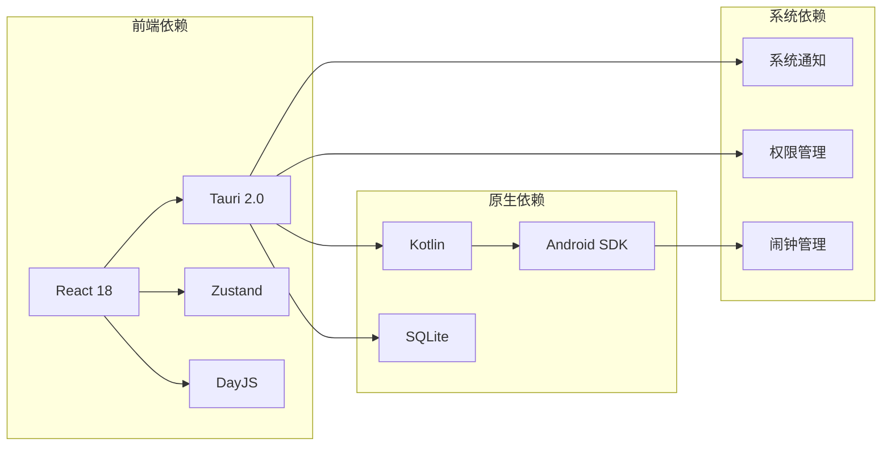

# 用药提醒

<cite>
**本文档引用的文件**
- [medicationReminder.ts](file://src/services/medicationReminder.ts)
- [MedicationReminderReceiver.kt](file://src-tauri/gen/android/app/src/main/java/com/assetly/home/MedicationReminderReceiver.kt)
- [MedicineForm.tsx](file://src/routes/MedicineForm.tsx)
- [MedicineBox.tsx](file://src/routes/MedicineBox.tsx)
- [useMedicineStore.ts](file://src/stores/useMedicineStore.ts)
- [medicineService.ts](file://src/services/medicineService.ts)
- [medicine.ts](file://src/types/medicine.ts)
- [dateHelper.ts](file://src/utils/dateHelper.ts)
- [Cargo.toml](file://src-tauri/Cargo.toml)
- [main.rs](file://src-tauri/src/main.rs)
- [MedicineCard.tsx](file://src/components/medicine/MedicineCard.tsx)
- [constants.ts](file://src/utils/constants.ts)
</cite>

## 目录
1. [简介](#简介)
2. [项目结构](#项目结构)
3. [核心组件](#核心组件)
4. [架构概览](#架构概览)
5. [详细组件分析](#详细组件分析)
6. [依赖关系分析](#依赖关系分析)
7. [性能考虑](#性能考虑)
8. [故障排除指南](#故障排除指南)
9. [结论](#结论)

## 简介

用药提醒功能是 Assetly 应用程序中的一个关键特性，它通过智能的定时任务调度和系统通知集成为用户提供可靠的药物管理服务。该系统支持多种提醒规则配置，包括每日、每N天和每周指定星期几的服药频率，以及灵活的时间槽设置和服药周期管理。

系统采用跨平台架构设计，同时支持桌面端和移动端的通知推送，确保用户在不同设备上都能及时收到用药提醒。通过与 SQLite 数据库的深度集成，系统能够持久化存储用户的用药数据和提醒配置。

## 项目结构

用药提醒功能涉及前端 React 组件、Tauri 后端服务、Android 广播接收器以及数据库模型等多个层面的组件：



**图表来源**
- [MedicineForm.tsx:1-401](file://src/routes/MedicineForm.tsx#L1-L401)
- [medicationReminder.ts:1-132](file://src/services/medicationReminder.ts#L1-L132)
- [MedicationReminderReceiver.kt:1-68](file://src-tauri/gen/android/app/src/main/java/com/assetly/home/MedicationReminderReceiver.kt#L1-L68)

**章节来源**
- [MedicineForm.tsx:1-401](file://src/routes/MedicineForm.tsx#L1-L401)
- [MedicineBox.tsx:1-112](file://src/routes/MedicineBox.tsx#L1-L112)
- [useMedicineStore.ts:1-42](file://src/stores/useMedicineStore.ts#L1-L42)

## 核心组件

### 提醒服务核心逻辑

用药提醒服务的核心功能由 `checkAndNotify` 函数实现，该函数负责检查所有药品的提醒条件并发送相应的通知：



**图表来源**
- [medicationReminder.ts:53-97](file://src/services/medicationReminder.ts#L53-L97)

### 药品提醒规则引擎

提醒规则引擎支持三种主要的服药频率模式：

1. **每日提醒** (`daily`): 在设定的时间槽内每天提醒
2. **每N天提醒** (`every_n_days`): 基于开始日期计算的间隔提醒
3. **每周提醒** (`weekly`): 在指定的星期几按时间槽提醒

**章节来源**
- [medicationReminder.ts:11-48](file://src/services/medicationReminder.ts#L11-L48)

## 架构概览

用药提醒系统采用分层架构设计，确保各组件职责清晰且易于维护：

```mermaid
graph TB
subgraph "用户界面层"
UI[React 组件<br/>MedicineForm, MedicineBox]
end
subgraph "业务逻辑层"
Reminder[提醒服务<br/>定时检查]
Validation[规则验证<br/>频率和时间]
Persistence[数据持久化<br/>SQLite存储]
end
subgraph "系统集成层"
Notification[通知插件<br/>@tauri-apps/plugin-notification]
AndroidReceiver[Android广播接收器<br/>MedicationReminderReceiver]
Timer[定时器<br/>setInterval]
end
subgraph "数据存储层"
Database[(SQLite 数据库)]
LocalStorage[(localStorage)]
end
UI --> Reminder
Reminder --> Validation
Reminder --> Persistence
Reminder --> Notification
Notification --> AndroidReceiver
Reminder --> Timer
Persistence --> Database
Reminder --> LocalStorage
```

**图表来源**
- [medicationReminder.ts:1-132](file://src/services/medicationReminder.ts#L1-L132)
- [MedicationReminderReceiver.kt:1-68](file://src-tauri/gen/android/app/src/main/java/com/assetly/home/MedicationReminderReceiver.kt#L1-L68)

## 详细组件分析

### 药品提醒规则配置

#### 频率类型配置

药品提醒系统支持三种频率类型的灵活配置：



**图表来源**
- [medicine.ts:16-26](file://src/types/medicine.ts#L16-L26)
- [MedicineForm.tsx:274-325](file://src/routes/MedicineForm.tsx#L274-L325)

#### 时间槽管理

时间槽系统允许用户为每个药品配置多个提醒时间点：

| 功能特性 | 实现方式 | 用户体验 |
|---------|----------|----------|
| 多时间槽支持 | 逗号分隔字符串存储 | 支持多个服药时间 |
| 动态添加删除 | 前端交互式时间选择器 | 直观的时间管理 |
| 格式验证 | 自动格式化为 HH:mm | 确保时间格式一致性 |
| 显示优化 | 中文星期显示 | 本地化用户体验 |

**章节来源**
- [MedicineForm.tsx:327-356](file://src/routes/MedicineForm.tsx#L327-L356)
- [MedicineCard.tsx:22-47](file://src/components/medicine/MedicineCard.tsx#L22-L47)

### Android 原生通知接收器

Android 平台的用药提醒通过广播接收器实现原生通知推送：



**图表来源**
- [MedicationReminderReceiver.kt:20-26](file://src-tauri/gen/android/app/src/main/java/com/assetly/home/MedicationReminderReceiver.kt#L20-L26)

#### 通知渠道配置

Android 接收器实现了专门的用药提醒通知渠道：

| 配置项 | 值 | 作用 |
|--------|-----|------|
| CHANNEL_ID | "assetly_medication" | 通知渠道唯一标识 |
| CHANNEL_NAME | "用药提醒" | 用户可见的渠道名称 |
| IMPORTANCE | HIGH | 通知重要程度设置 |
| 震动模式 | [0, 500, 200, 500] | 特定的震动模式 |
| 自动取消 | true | 通知显示后自动消失 |

**章节来源**
- [MedicationReminderReceiver.kt:14-43](file://src-tauri/gen/android/app/src/main/java/com/assetly/home/MedicationReminderReceiver.kt#L14-L43)

### 数据持久化和状态管理

#### 药品数据模型

用药提醒功能的数据模型设计支持完整的提醒配置：



**图表来源**
- [medicine.ts:7-41](file://src/types/medicine.ts#L7-L41)

**章节来源**
- [medicine.ts:1-70](file://src/types/medicine.ts#L1-L70)

### 用户界面交互

#### 药品表单界面

药品表单提供了完整的用药提醒配置界面：



**图表来源**
- [MedicineForm.tsx:253-377](file://src/routes/MedicineForm.tsx#L253-L377)

**章节来源**
- [MedicineForm.tsx:1-401](file://src/routes/MedicineForm.tsx#L1-L401)

## 依赖关系分析

### 技术栈依赖

用药提醒功能涉及多个技术栈的协作：



**图表来源**
- [Cargo.toml:20-30](file://src-tauri/Cargo.toml#L20-L30)
- [MedicationReminderReceiver.kt:1-68](file://src-tauri/gen/android/app/src/main/java/com/assetly/home/MedicationReminderReceiver.kt#L1-L68)

### 关键依赖组件

| 组件 | 版本 | 用途 | 依赖关系 |
|------|------|------|----------|
| @tauri-apps/plugin-notification | 最新版本 | 系统通知接口 | Tauri 2.0 |
| tauri-plugin-notification | 2.x | 原生通知支持 | Rust/Tauri |
| dayjs | 最新版本 | 日期时间处理 | JavaScript |
| zustand | 最新版本 | 状态管理 | React |
| sqlite | 内置 | 数据持久化 | Tauri SQL 插件 |

**章节来源**
- [Cargo.toml:20-30](file://src-tauri/Cargo.toml#L20-L30)

## 性能考虑

### 定时检查优化

系统采用了多项性能优化策略来确保提醒功能的高效运行：

1. **检查频率控制**: 每60秒执行一次检查，避免过于频繁的数据库查询
2. **去重机制**: 使用 localStorage 记录最后检查时间，防止同一分钟内的重复检查
3. **权限预检查**: 在执行检查前先验证通知权限，减少无效操作
4. **批量处理**: 对所有药品进行一次性遍历处理，提高效率

### 内存管理

- **定时器清理**: 提供清理函数用于停止定时器，防止内存泄漏
- **状态管理**: 使用 Zustand 进行轻量级状态管理，避免不必要的重渲染
- **数据库连接**: 通过统一的数据库服务管理连接池

### 用户体验优化

- **本地化显示**: 所有时间、日期和状态信息都进行了本地化处理
- **响应式设计**: 支持移动端和桌面端的不同屏幕尺寸
- **无障碍访问**: 提供适当的视觉和交互反馈

## 故障排除指南

### 常见问题诊断

#### 通知权限问题

**症状**: 应用启动后没有收到任何用药提醒

**可能原因**:
1. 用户拒绝了通知权限
2. 系统通知设置被禁用
3. 应用在后台被限制

**解决方案**:
1. 检查应用的通知权限状态
2. 引导用户到系统设置中启用通知
3. 重新启动应用以刷新权限状态

#### 提醒规则不生效

**症状**: 设置了提醒但没有按时通知

**排查步骤**:
1. 验证药品的 `is_taking` 状态是否为 true
2. 检查频率类型和参数配置
3. 确认时间槽格式是否正确
4. 验证服药周期是否在有效期内

#### Android 平台问题

**症状**: Android 设备上无法显示通知

**解决方法**:
1. 检查通知渠道是否正确创建
2. 验证震动和通知权限设置
3. 确认应用是否在前台运行
4. 检查 Android 版本兼容性

### 调试建议

1. **启用详细日志**: 使用 `logInfo` 和 `logError` 函数记录关键操作
2. **监控定时器**: 确保定时器正常运行且没有被意外清理
3. **数据库检查**: 验证提醒配置数据的完整性和正确性
4. **权限验证**: 定期检查通知权限状态变化

**章节来源**
- [medicationReminder.ts:54-96](file://src/services/medicationReminder.ts#L54-L96)

## 结论

用药提醒功能通过精心设计的架构和完善的实现，为用户提供了可靠、便捷的药物管理服务。系统的主要优势包括：

1. **多平台支持**: 同时支持桌面端和移动端的通知推送
2. **灵活配置**: 支持多种提醒规则和自定义时间槽
3. **用户友好**: 提供直观的配置界面和本地化显示
4. **性能优化**: 通过合理的定时策略和数据管理确保高效运行

未来可以考虑的功能增强包括：
- 更精细的提醒优先级管理
- 与其他健康应用的数据同步
- 更丰富的通知交互选项
- 提醒历史和统计分析功能

通过持续的优化和改进，用药提醒功能将继续为用户提供优质的健康管理体验。