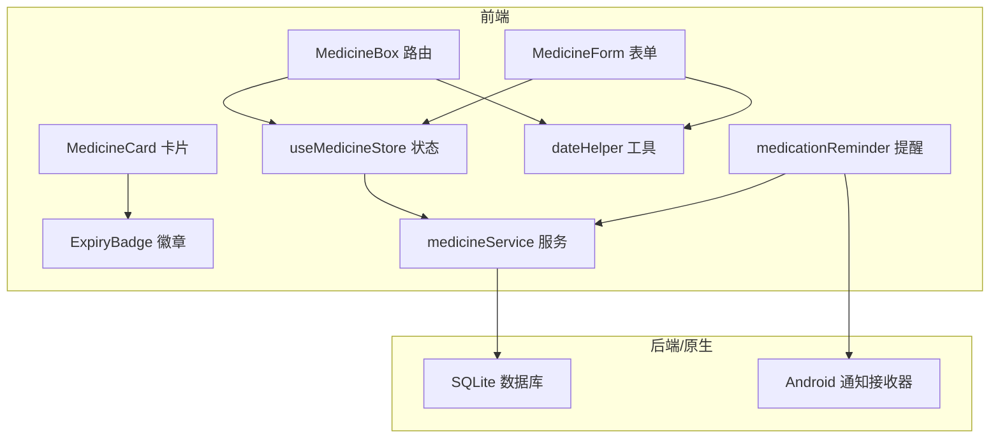
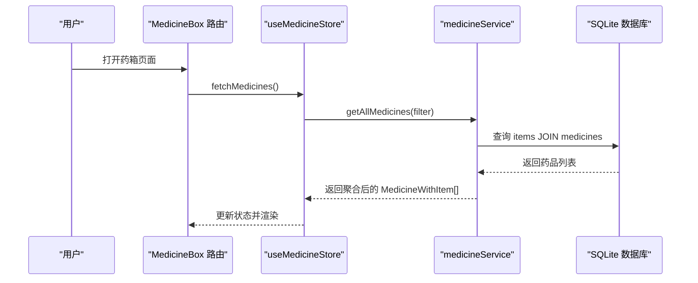
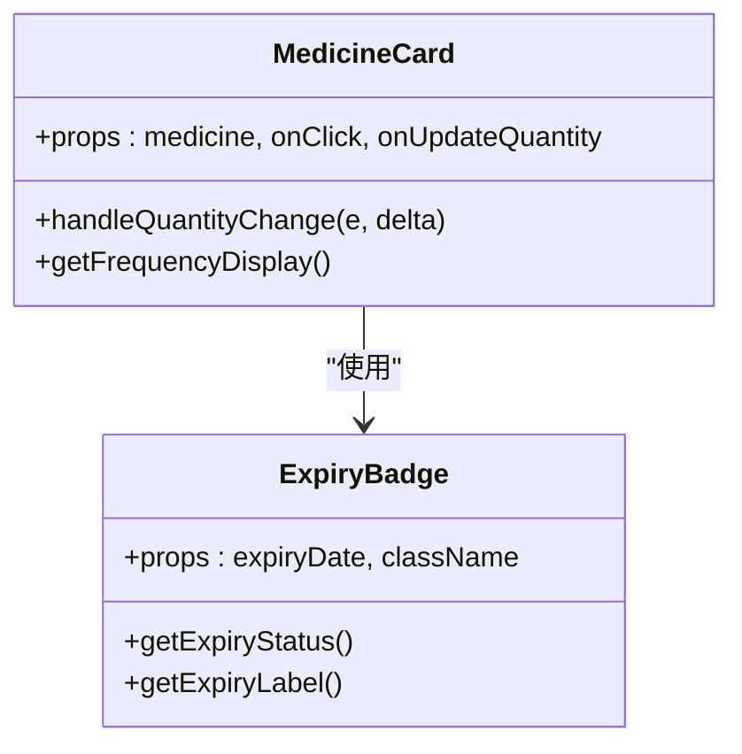
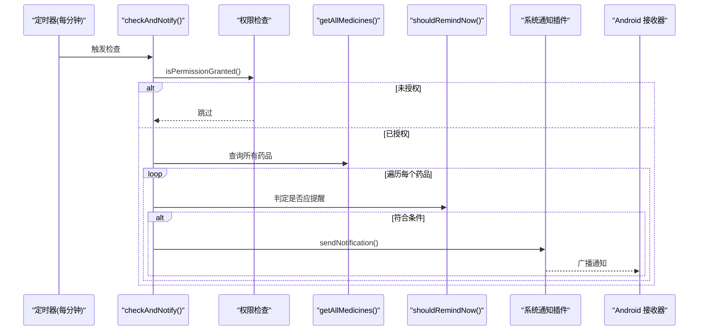
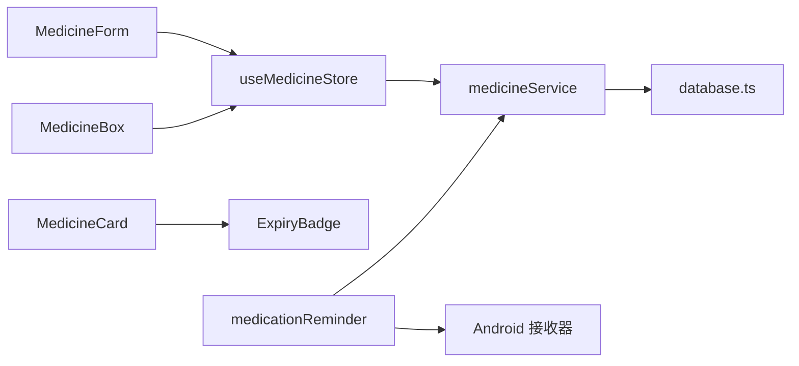

# 药品管理

<cite>
**本文引用的文件**
- [src/types/medicine.ts](file://src/types/medicine.ts)
- [src/services/medicineService.ts](file://src/services/medicineService.ts)
- [src/stores/useMedicineStore.ts](file://src/stores/useMedicineStore.ts)
- [src/routes/MedicineBox.tsx](file://src/routes/MedicineBox.tsx)
- [src/routes/MedicineForm.tsx](file://src/routes/MedicineForm.tsx)
- [src/components/medicine/MedicineCard.tsx](file://src/components/medicine/MedicineCard.tsx)
- [src/components/medicine/ExpiryBadge.tsx](file://src/components/medicine/ExpiryBadge.tsx)
- [src/utils/dateHelper.ts](file://src/utils/dateHelper.ts)
- [src/services/medicationReminder.ts](file://src/services/medicationReminder.ts)
- [src-tauri/gen/android/app/src/main/java/com/assetly/home/MedicationReminderReceiver.kt](file://src-tauri/gen/android/app/src/main/java/com/assetly/home/MedicationReminderReceiver.kt)
- [src/services/database.ts](file://src/services/database.ts)
- [src/utils/constants.ts](file://src/utils/constants.ts)
- [src/routes/ItemList.tsx](file://src/routes/ItemList.tsx)
- [src/routes/ItemDetail.tsx](file://src/routes/ItemDetail.tsx)
</cite>

## 目录
1. [简介](#简介)
2. [项目结构](#项目结构)
3. [核心组件](#核心组件)
4. [架构总览](#架构总览)
5. [详细组件分析](#详细组件分析)
6. [依赖关系分析](#依赖关系分析)
7. [性能考量](#性能考量)
8. [故障排查指南](#故障排查指南)
9. [结论](#结论)
10. [附录](#附录)

## 简介
本文件为“药品管理”模块的综合技术文档，覆盖药品追踪系统的完整实现：药品列表管理、详情查看、表单编辑；过期预警机制（日期计算、提醒规则、通知系统集成）；用药提醒功能（定时任务、系统通知、Android 原生通知接收器）；药品状态管理（库存数量、有效期管理、使用记录）；以及药品卡片组件的视觉反馈设计（过期徽章、库存状态）。同时提供完整的药品数据模型说明与业务规则，并给出实际使用场景与最佳实践。

## 项目结构
围绕药品管理的关键目录与文件如下：
- 类型定义：src/types/medicine.ts
- 数据访问层：src/services/medicineService.ts、src/services/database.ts
- 状态管理：src/stores/useMedicineStore.ts
- 视图路由：src/routes/MedicineBox.tsx、src/routes/MedicineForm.tsx
- 组件：src/components/medicine/MedicineCard.tsx、src/components/medicine/ExpiryBadge.tsx
- 工具函数：src/utils/dateHelper.ts、src/utils/constants.ts
- 提醒服务：src/services/medicationReminder.ts
- Android 原生通知：src-tauri/gen/android/app/src/main/java/com/assetly/home/MedicationReminderReceiver.kt
- 物品管理（对比参考）：src/routes/ItemList.tsx、src/routes/ItemDetail.tsx

图表来源
- [src/routes/MedicineBox.tsx:18-112](file://src/routes/MedicineBox.tsx#L18-L112)
- [src/routes/MedicineForm.tsx:33-401](file://src/routes/MedicineForm.tsx#L33-L401)
- [src/components/medicine/MedicineCard.tsx:14-147](file://src/components/medicine/MedicineCard.tsx#L14-L147)
- [src/components/medicine/ExpiryBadge.tsx:8-24](file://src/components/medicine/ExpiryBadge.tsx#L8-L24)
- [src/stores/useMedicineStore.ts:15-42](file://src/stores/useMedicineStore.ts#L15-L42)
- [src/services/medicineService.ts:10-194](file://src/services/medicineService.ts#L10-L194)
- [src/utils/dateHelper.ts:30-52](file://src/utils/dateHelper.ts#L30-L52)
- [src/services/medicationReminder.ts:53-132](file://src/services/medicationReminder.ts#L53-L132)
- [src-tauri/gen/android/app/src/main/java/com/assetly/home/MedicationReminderReceiver.kt:20-68](file://src-tauri/gen/android/app/src/main/java/com/assetly/home/MedicationReminderReceiver.kt#L20-L68)

章节来源
- [src/routes/MedicineBox.tsx:18-112](file://src/routes/MedicineBox.tsx#L18-L112)
- [src/routes/MedicineForm.tsx:33-401](file://src/routes/MedicineForm.tsx#L33-L401)
- [src/services/medicineService.ts:10-194](file://src/services/medicineService.ts#L10-L194)
- [src/services/database.ts:18-171](file://src/services/database.ts#L18-L171)

## 核心组件
- 数据模型与类型
  - 药品类别、过期状态、服药频率枚举与接口定义见 [src/types/medicine.ts:3-69](file://src/types/medicine.ts#L3-L69)。
  - 关键字段：药品类型、有效期、剩余数量、单位、制造商、是否正在服用、频率类型、周期、时间点集合、最后提醒时间等。
- 服务层
  - 药品查询、创建、更新、过期药品检索、正在服用药品检索见 [src/services/medicineService.ts:10-194](file://src/services/medicineService.ts#L10-L194)。
  - 数据库初始化与迁移见 [src/services/database.ts:18-171](file://src/services/database.ts#L18-L171)。
- 状态与路由
  - 列表页与筛选、新增/编辑路由、数量变更处理见 [src/routes/MedicineBox.tsx:18-112](file://src/routes/MedicineBox.tsx#L18-L112)、[src/routes/MedicineForm.tsx:33-401](file://src/routes/MedicineForm.tsx#L33-L401)。
  - 状态管理 store 定义与方法见 [src/stores/useMedicineStore.ts:15-42](file://src/stores/useMedicineStore.ts#L15-L42)。
- 组件
  - 药品卡片展示与交互、快速库存调整见 [src/components/medicine/MedicineCard.tsx:14-147](file://src/components/medicine/MedicineCard.tsx#L14-L147)。
  - 过期徽章渲染见 [src/components/medicine/ExpiryBadge.tsx:8-24](file://src/components/medicine/ExpiryBadge.tsx#L8-L24)。
- 工具与提醒
  - 日期计算与过期状态标签见 [src/utils/dateHelper.ts:30-52](file://src/utils/dateHelper.ts#L30-L52)。
  - 用药提醒检查与定时器、通知注册见 [src/services/medicationReminder.ts:53-132](file://src/services/medicationReminder.ts#L53-L132)。
  - Android 通知通道与弹窗见 [src-tauri/gen/android/app/src/main/java/com/assetly/home/MedicationReminderReceiver.kt:20-68](file://src-tauri/gen/android/app/src/main/java/com/assetly/home/MedicationReminderReceiver.kt#L20-L68)。

章节来源
- [src/types/medicine.ts:3-69](file://src/types/medicine.ts#L3-L69)
- [src/services/medicineService.ts:10-194](file://src/services/medicineService.ts#L10-L194)
- [src/stores/useMedicineStore.ts:15-42](file://src/stores/useMedicineStore.ts#L15-L42)
- [src/routes/MedicineBox.tsx:18-112](file://src/routes/MedicineBox.tsx#L18-L112)
- [src/routes/MedicineForm.tsx:33-401](file://src/routes/MedicineForm.tsx#L33-L401)
- [src/components/medicine/MedicineCard.tsx:14-147](file://src/components/medicine/MedicineCard.tsx#L14-L147)
- [src/components/medicine/ExpiryBadge.tsx:8-24](file://src/components/medicine/ExpiryBadge.tsx#L8-L24)
- [src/utils/dateHelper.ts:30-52](file://src/utils/dateHelper.ts#L30-L52)
- [src/services/medicationReminder.ts:53-132](file://src/services/medicationReminder.ts#L53-L132)
- [src-tauri/gen/android/app/src/main/java/com/assetly/home/MedicationReminderReceiver.kt:20-68](file://src-tauri/gen/android/app/src/main/java/com/assetly/home/MedicationReminderReceiver.kt#L20-L68)

## 架构总览
前端通过 store 调用服务层，服务层封装数据库访问；过期与提醒逻辑在前端与原生 Android 层协同工作。

图表来源
- [src/routes/MedicineBox.tsx:23-29](file://src/routes/MedicineBox.tsx#L23-L29)
- [src/stores/useMedicineStore.ts:20-26](file://src/stores/useMedicineStore.ts#L20-L26)
- [src/services/medicineService.ts:10-37](file://src/services/medicineService.ts#L10-L37)

## 详细组件分析

### 数据模型与业务规则
- 药品实体扩展
  - Medicine 接口包含基础药品属性与扩展字段（剩余数量、单位、制造商、是否正在服用、频率、周期、时间点、最后提醒时间等），见 [src/types/medicine.ts:7-27](file://src/types/medicine.ts#L7-L27)。
  - MedicineWithItem 在 Medicine 基础上扩展物品信息（名称、描述、分类、位置、购买信息、图标等），见 [src/types/medicine.ts:29-41](file://src/types/medicine.ts#L29-L41)。
  - 表单数据结构 MedicineFormData 将物品与药品字段合并，见 [src/types/medicine.ts:43-70](file://src/types/medicine.ts#L43-L70)。
- 业务规则
  - 有效期管理：以到期日为基准，结合阈值判断安全/预警/过期状态，见 [src/utils/dateHelper.ts:30-43](file://src/utils/dateHelper.ts#L30-L43)。
  - 服药频率：支持每日、每隔N天、每周固定星期，见 [src/types/medicine.ts:5-5](file://src/types/medicine.ts#L5-L5)。
  - 库存数量：卡片支持增减库存，最小为0，见 [src/components/medicine/MedicineCard.tsx:17-20](file://src/components/medicine/MedicineCard.tsx#L17-L20)、[src/routes/MedicineBox.tsx:31-36](file://src/routes/MedicineBox.tsx#L31-L36)。
  - 分类默认值：药品保健分类自动注入，见 [src/services/medicineService.ts:60-64](file://src/services/medicineService.ts#L60-L64)。

章节来源
- [src/types/medicine.ts:3-70](file://src/types/medicine.ts#L3-L70)
- [src/utils/dateHelper.ts:30-43](file://src/utils/dateHelper.ts#L30-L43)
- [src/components/medicine/MedicineCard.tsx:17-20](file://src/components/medicine/MedicineCard.tsx#L17-L20)
- [src/routes/MedicineBox.tsx:31-36](file://src/routes/MedicineBox.tsx#L31-L36)
- [src/services/medicineService.ts:60-64](file://src/services/medicineService.ts#L60-L64)

### 列表与详情：MedicineBox 与 MedicineForm
- 列表页
  - 支持按类型筛选（全部/内服/外用/急救）、加载状态、空态、添加药品入口，见 [src/routes/MedicineBox.tsx:18-112](file://src/routes/MedicineBox.tsx#L18-L112)。
  - 过期与预警统计在顶部横幅提示，见 [src/routes/MedicineBox.tsx:57-67](file://src/routes/MedicineBox.tsx#L57-L67)。
  - 数量变更通过 store 的 updateMedicine 触发，见 [src/routes/MedicineBox.tsx:31-36](file://src/routes/MedicineBox.tsx#L31-L36)。
- 表单页
  - 新增/编辑统一表单，包含基本信息、购买信息、用药提醒设置（开关、频率、星期、时间点、周期），见 [src/routes/MedicineForm.tsx:33-401](file://src/routes/MedicineForm.tsx#L33-L401)。
  - 用药提醒子段落仅在“正在服用”时展开，见 [src/routes/MedicineForm.tsx:272-377](file://src/routes/MedicineForm.tsx#L272-L377)。

章节来源
- [src/routes/MedicineBox.tsx:18-112](file://src/routes/MedicineBox.tsx#L18-L112)
- [src/routes/MedicineForm.tsx:33-401](file://src/routes/MedicineForm.tsx#L33-L401)

### 药品卡片组件：MedicineCard 与 ExpiryBadge
- MedicineCard
  - 展示名称、类型标签、是否正在服用徽章、过期徽章、位置路径、价格、库存与快速增减按钮，见 [src/components/medicine/MedicineCard.tsx:14-147](file://src/components/medicine/MedicineCard.tsx#L14-L147)。
  - 频率与时间点格式化显示，见 [src/components/medicine/MedicineCard.tsx:28-47](file://src/components/medicine/MedicineCard.tsx#L28-L47)。
  - 点击进入编辑，见 [src/components/medicine/MedicineCard.tsx:60-62](file://src/components/medicine/MedicineCard.tsx#L60-L62)。
- ExpiryBadge
  - 根据到期日计算状态与标签文本，样式随状态切换，见 [src/components/medicine/ExpiryBadge.tsx:8-24](file://src/components/medicine/ExpiryBadge.tsx#L8-L24)。

图表来源
- [src/components/medicine/MedicineCard.tsx:14-147](file://src/components/medicine/MedicineCard.tsx#L14-L147)
- [src/components/medicine/ExpiryBadge.tsx:8-24](file://src/components/medicine/ExpiryBadge.tsx#L8-L24)

章节来源
- [src/components/medicine/MedicineCard.tsx:14-147](file://src/components/medicine/MedicineCard.tsx#L14-L147)
- [src/components/medicine/ExpiryBadge.tsx:8-24](file://src/components/medicine/ExpiryBadge.tsx#L8-L24)

### 过期预警机制：日期计算与提醒规则
- 日期计算
  - 计算距离到期日天数、生成状态与标签，见 [src/utils/dateHelper.ts:22-43](file://src/utils/dateHelper.ts#L22-L43)。
- 提醒规则
  - 列表页根据状态计数展示过期/预警数量，见 [src/routes/MedicineBox.tsx:38-39](file://src/routes/MedicineBox.tsx#L38-L39)。
  - 卡片组件直接展示过期徽章，见 [src/components/medicine/MedicineCard.tsx:76-76](file://src/components/medicine/MedicineCard.tsx#L76-L76)。

章节来源
- [src/utils/dateHelper.ts:22-43](file://src/utils/dateHelper.ts#L22-L43)
- [src/routes/MedicineBox.tsx:38-39](file://src/routes/MedicineBox.tsx#L38-L39)
- [src/components/medicine/MedicineCard.tsx:76-76](file://src/components/medicine/MedicineCard.tsx#L76-L76)

### 用药提醒：定时任务、系统通知与 Android 接收器
- 定时检查
  - 启动定时器每分钟检查一次，避免同分钟重复提醒，见 [src/services/medicationReminder.ts:102-131](file://src/services/medicationReminder.ts#L102-L131)。
  - 检查流程：权限校验、最近检查时间限制、查询所有药品、逐条判定是否应提醒、发送系统通知，见 [src/services/medicationReminder.ts:53-97](file://src/services/medicationReminder.ts#L53-L97)。
- 提醒判定逻辑
  - 仅对“正在服用”的药品生效；周期范围校验；频率类型匹配（每日/每隔N天/每周）；时间点精确到小时分钟匹配，见 [src/services/medicationReminder.ts:11-48](file://src/services/medicationReminder.ts#L11-L48)。
- 通知注册与动作
  - 注册通知动作类型（已服用/稍后提醒），见 [src/services/medicationReminder.ts:105-119](file://src/services/medicationReminder.ts#L105-L119)。
- Android 原生通知
  - 创建通知渠道、构建通知、点击唤醒主界面，见 [src-tauri/gen/android/app/src/main/java/com/assetly/home/MedicationReminderReceiver.kt:20-68](file://src-tauri/gen/android/app/src/main/java/com/assetly/home/MedicationReminderReceiver.kt#L20-L68)。

图表来源
- [src/services/medicationReminder.ts:53-97](file://src/services/medicationReminder.ts#L53-L97)
- [src/services/medicationReminder.ts:102-131](file://src/services/medicationReminder.ts#L102-L131)
- [src-tauri/gen/android/app/src/main/java/com/assetly/home/MedicationReminderReceiver.kt:20-68](file://src-tauri/gen/android/app/src/main/java/com/assetly/home/MedicationReminderReceiver.kt#L20-L68)

章节来源
- [src/services/medicationReminder.ts:53-132](file://src/services/medicationReminder.ts#L53-L132)
- [src-tauri/gen/android/app/src/main/java/com/assetly/home/MedicationReminderReceiver.kt:20-68](file://src-tauri/gen/android/app/src/main/java/com/assetly/home/MedicationReminderReceiver.kt#L20-L68)

### 数据库与迁移
- 初始化与迁移
  - 首次连接创建迁移表、执行未应用的迁移、写入版本号，见 [src/services/database.ts:18-53](file://src/services/database.ts#L18-L53)。
  - 迁移内容：创建分类、位置、物品、药品、设置表，索引优化，种子数据，见 [src/services/database.ts:60-171](file://src/services/database.ts#L60-L171)。
- 药品表结构
  - 药品表与物品表 1:1 关联，包含扩展字段（是否正在服用、频率、周期、时间点、最后提醒时间等），见 [src/services/database.ts:104-117](file://src/services/database.ts#L104-L117)。

章节来源
- [src/services/database.ts:18-171](file://src/services/database.ts#L18-L171)

### 与物品管理的对比参考
- 物品列表与详情页展示了通用资产管理模式，可作为药品管理的对照参考，见 [src/routes/ItemList.tsx:19-185](file://src/routes/ItemList.tsx#L19-L185)、[src/routes/ItemDetail.tsx:13-168](file://src/routes/ItemDetail.tsx#L13-L168)。

章节来源
- [src/routes/ItemList.tsx:19-185](file://src/routes/ItemList.tsx#L19-L185)
- [src/routes/ItemDetail.tsx:13-168](file://src/routes/ItemDetail.tsx#L13-L168)

## 依赖关系分析
- 组件耦合
  - MedicineBox 依赖 useMedicineStore 与 medicineService；MedicineCard 依赖 ExpiryBadge 与设置 store；表单依赖 store 与自定义控件。
- 服务层
  - medicineService 依赖数据库连接与日期工具；medicationReminder 依赖通知插件与本地存储。
- 数据流
  - 路由 -> store -> service -> 数据库；提醒 -> service -> 通知插件 -> Android 接收器。

图表来源
- [src/routes/MedicineForm.tsx:37-38](file://src/routes/MedicineForm.tsx#L37-L38)
- [src/routes/MedicineBox.tsx:20-21](file://src/routes/MedicineBox.tsx#L20-L21)
- [src/stores/useMedicineStore.ts:20-36](file://src/stores/useMedicineStore.ts#L20-L36)
- [src/services/medicineService.ts:10-194](file://src/services/medicineService.ts#L10-L194)
- [src/services/database.ts:18-171](file://src/services/database.ts#L18-L171)
- [src/components/medicine/MedicineCard.tsx:14-147](file://src/components/medicine/MedicineCard.tsx#L14-L147)
- [src/components/medicine/ExpiryBadge.tsx:8-24](file://src/components/medicine/ExpiryBadge.tsx#L8-L24)
- [src/services/medicationReminder.ts:53-132](file://src/services/medicationReminder.ts#L53-L132)
- [src-tauri/gen/android/app/src/main/java/com/assetly/home/MedicationReminderReceiver.kt:20-68](file://src-tauri/gen/android/app/src/main/java/com/assetly/home/MedicationReminderReceiver.kt#L20-L68)

## 性能考量
- 查询优化
  - 药品列表按到期日排序，建议保持索引有效；分页或虚拟滚动在数据量增大时可考虑引入。
- 通知频率
  - 每分钟检查一次，已通过本地时间窗口去重，避免重复提醒；若用户量大，可考虑按药品维度增量检查。
- 渲染优化
  - 列表项使用轻量卡片组件，避免深层嵌套；徽章与标签采用纯样式切换，减少重排。

## 故障排查指南
- 通知未弹出
  - 检查通知权限是否授予，确认 Android 通知渠道创建成功，见 [src/services/medicationReminder.ts:55-66](file://src/services/medicationReminder.ts#L55-L66)、[src-tauri/gen/android/app/src/main/java/com/assetly/home/MedicationReminderReceiver.kt:28-43](file://src-tauri/gen/android/app/src/main/java/com/assetly/home/MedicationReminderReceiver.kt#L28-L43)。
- 重复提醒
  - 确认本地去重时间窗口（约50秒）与定时器间隔（60秒）配置，见 [src/services/medicationReminder.ts:72-73](file://src/services/medicationReminder.ts#L72-L73)。
- 数据不同步
  - 确认 store 的 fetchMedicines 是否在状态变更后重新拉取，见 [src/stores/useMedicineStore.ts:20-26](file://src/stores/useMedicineStore.ts#L20-L26)。
- 有效期显示异常
  - 检查日期格式与本地时区，确认过期状态阈值逻辑，见 [src/utils/dateHelper.ts:30-43](file://src/utils/dateHelper.ts#L30-L43)。

章节来源
- [src/services/medicationReminder.ts:55-66](file://src/services/medicationReminder.ts#L55-L66)
- [src-tauri/gen/android/app/src/main/java/com/assetly/home/MedicationReminderReceiver.kt:28-43](file://src-tauri/gen/android/app/src/main/java/com/assetly/home/MedicationReminderReceiver.kt#L28-L43)
- [src/services/medicationReminder.ts:72-73](file://src/services/medicationReminder.ts#L72-L73)
- [src/stores/useMedicineStore.ts:20-26](file://src/stores/useMedicineStore.ts#L20-L26)
- [src/utils/dateHelper.ts:30-43](file://src/utils/dateHelper.ts#L30-L43)

## 结论
本模块以清晰的数据模型、完善的业务规则与前后端协同的提醒机制，实现了从录入、展示到到期预警与用药提醒的全链路能力。通过卡片化组件与状态标签提供直观的视觉反馈，配合数据库迁移与索引策略保障长期演进的稳定性。建议在用户量增长时引入分页与增量检查策略，并持续完善通知动作与用户体验。

## 附录
- 最佳实践
  - 新增药品时优先填写有效期与剩余数量，便于后续预警与库存管理。
  - 对于需要严格服药的药品，启用“正在服用”，设置合理的频率与时间点。
  - 定期清理过期药品，保持药箱整洁与安全。
- 术语
  - 安全：距离到期日大于30天
  - 预警：距离到期日不超过30天
  - 过期：已超过到期日