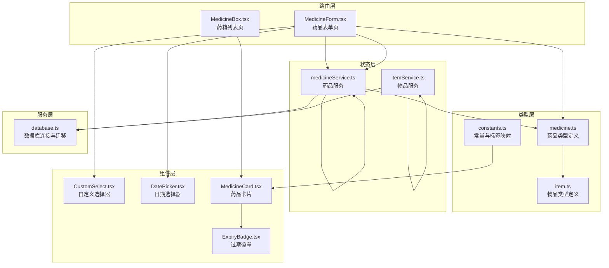
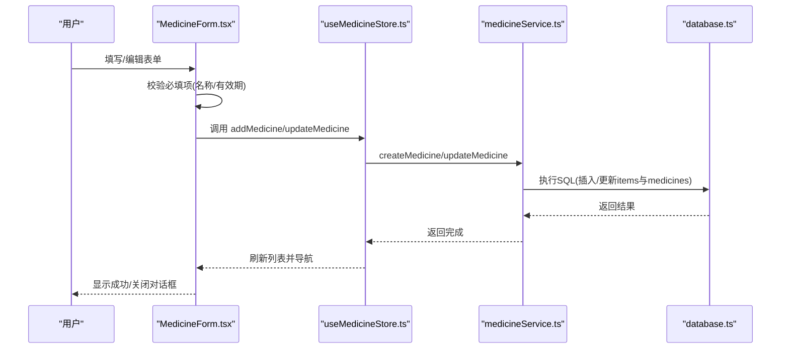
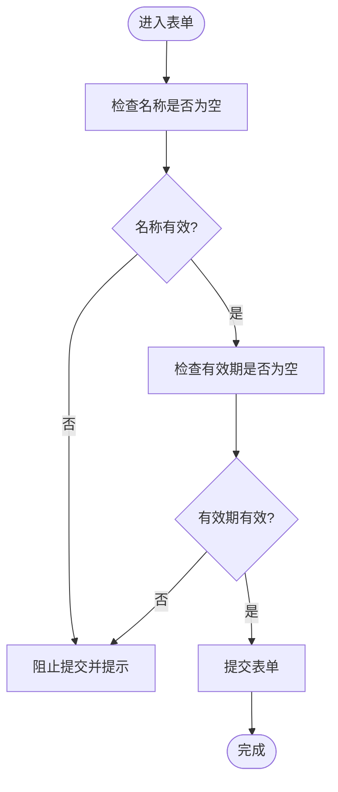
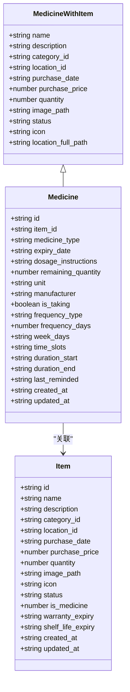
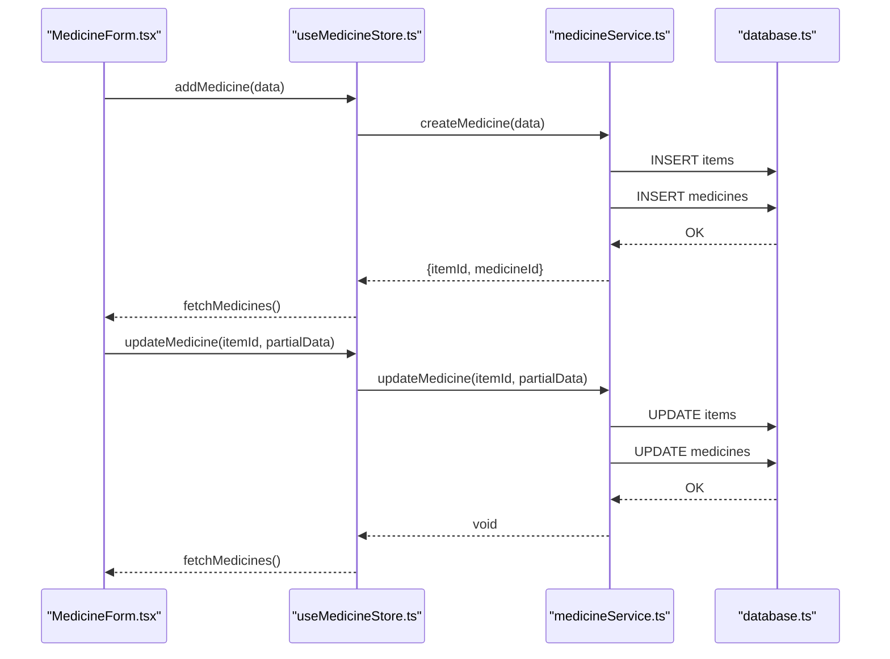
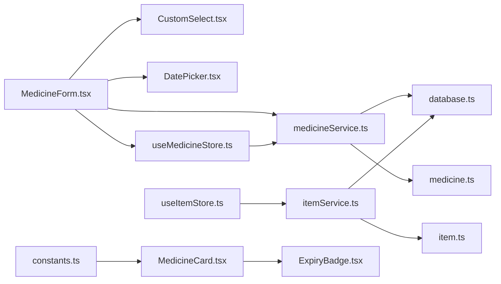

# 药品表单管理

<cite>
**本文档引用的文件**
- [MedicineForm.tsx](file://src/routes/MedicineForm.tsx)
- [medicine.ts](file://src/types/medicine.ts)
- [medicineService.ts](file://src/services/medicineService.ts)
- [useMedicineStore.ts](file://src/stores/useMedicineStore.ts)
- [MedicineCard.tsx](file://src/components/medicine/MedicineCard.tsx)
- [constants.ts](file://src/utils/constants.ts)
- [ExpiryBadge.tsx](file://src/components/medicine/ExpiryBadge.tsx)
- [itemService.ts](file://src/services/itemService.ts)
- [item.ts](file://src/types/item.ts)
- [MedicineBox.tsx](file://src/routes/MedicineBox.tsx)
- [CustomSelect.tsx](file://src/components/shared/CustomSelect.tsx)
- [DatePicker.tsx](file://src/components/shared/DatePicker.tsx)
- [dateHelper.ts](file://src/utils/dateHelper.ts)
- [database.ts](file://src/services/database.ts)
- [useItemStore.ts](file://src/stores/useItemStore.ts)
</cite>

## 目录
1. [简介](#简介)
2. [项目结构](#项目结构)
3. [核心组件](#核心组件)
4. [架构总览](#架构总览)
5. [详细组件分析](#详细组件分析)
6. [依赖关系分析](#依赖关系分析)
7. [性能考虑](#性能考虑)
8. [故障排除指南](#故障排除指南)
9. [结论](#结论)
10. [附录](#附录)

## 简介
本文件围绕“药品表单管理”功能进行全面技术文档化，涵盖表单字段设计、数据验证、用户输入处理、药品数据模型扩展、表单提交流程（数据处理、服务调用、错误处理、成功反馈）、药品类型选择与验证机制（内服/外用/急救的业务规则）、表单组件使用指南与自定义扩展方法，以及数据完整性保障与用户体验优化策略。目标是帮助开发者快速理解并维护该功能模块。

## 项目结构
该功能位于前端路由层、类型定义、服务层与状态管理层之间形成清晰分层：
- 路由层：负责页面渲染与交互控制（如药品表单页）
- 类型层：定义药品与物品的数据结构及枚举类型
- 服务层：封装数据库访问与业务逻辑（如药品增删改查）
- 状态层：集中管理药品列表与筛选状态
- 组件层：可复用的表单控件（下拉选择、日期选择、卡片展示等）

图表来源
- [MedicineForm.tsx:1-401](file://src/routes/MedicineForm.tsx#L1-L401)
- [MedicineBox.tsx:1-112](file://src/routes/MedicineBox.tsx#L1-L112)
- [medicine.ts:1-70](file://src/types/medicine.ts#L1-L70)
- [item.ts:1-46](file://src/types/item.ts#L1-L46)
- [useMedicineStore.ts:1-42](file://src/stores/useMedicineStore.ts#L1-L42)
- [useItemStore.ts:1-53](file://src/stores/useItemStore.ts#L1-L53)
- [medicineService.ts:1-194](file://src/services/medicineService.ts#L1-L194)
- [itemService.ts:1-127](file://src/services/itemService.ts#L1-L127)
- [database.ts:1-171](file://src/services/database.ts#L1-L171)
- [CustomSelect.tsx:1-109](file://src/components/shared/CustomSelect.tsx#L1-L109)
- [DatePicker.tsx:1-278](file://src/components/shared/DatePicker.tsx#L1-L278)
- [MedicineCard.tsx:1-147](file://src/components/medicine/MedicineCard.tsx#L1-L147)
- [ExpiryBadge.tsx:1-24](file://src/components/medicine/ExpiryBadge.tsx#L1-L24)
- [constants.ts:1-40](file://src/utils/constants.ts#L1-L40)

章节来源
- [MedicineForm.tsx:1-401](file://src/routes/MedicineForm.tsx#L1-L401)
- [MedicineBox.tsx:1-112](file://src/routes/MedicineBox.tsx#L1-L112)
- [medicine.ts:1-70](file://src/types/medicine.ts#L1-L70)
- [item.ts:1-46](file://src/types/item.ts#L1-L46)
- [useMedicineStore.ts:1-42](file://src/stores/useMedicineStore.ts#L1-L42)
- [useItemStore.ts:1-53](file://src/stores/useItemStore.ts#L1-L53)
- [medicineService.ts:1-194](file://src/services/medicineService.ts#L1-L194)
- [itemService.ts:1-127](file://src/services/itemService.ts#L1-L127)
- [database.ts:1-171](file://src/services/database.ts#L1-L171)
- [CustomSelect.tsx:1-109](file://src/components/shared/CustomSelect.tsx#L1-L109)
- [DatePicker.tsx:1-278](file://src/components/shared/DatePicker.tsx#L1-L278)
- [MedicineCard.tsx:1-147](file://src/components/medicine/MedicineCard.tsx#L1-L147)
- [ExpiryBadge.tsx:1-24](file://src/components/medicine/ExpiryBadge.tsx#L1-L24)
- [constants.ts:1-40](file://src/utils/constants.ts#L1-L40)

## 核心组件
- 表单页面：MedicineForm.tsx 提供完整的药品新增/编辑表单，包含基础信息、购买信息、用药提醒等区域，支持类型选择、有效期校验、提醒设置等。
- 数据模型：medicine.ts 定义了药品实体、扩展信息与表单数据结构；item.ts 定义了通用物品实体与扩展信息。
- 服务层：medicineService.ts 实现药品的创建、更新、查询与到期药品检索；database.ts 负责数据库连接与迁移。
- 状态管理：useMedicineStore.ts 管理药品列表、加载状态与活动标签；useItemStore.ts 管理物品相关操作。
- 展示组件：MedicineCard.tsx 用于列表展示；ExpiryBadge.tsx 用于显示过期状态徽章；CustomSelect.tsx/DatePicker.tsx 提供可复用的表单控件。
- 常量与标签：constants.ts 提供药品类型标签映射，便于UI展示。

章节来源
- [MedicineForm.tsx:1-401](file://src/routes/MedicineForm.tsx#L1-L401)
- [medicine.ts:1-70](file://src/types/medicine.ts#L1-L70)
- [item.ts:1-46](file://src/types/item.ts#L1-L46)
- [medicineService.ts:1-194](file://src/services/medicineService.ts#L1-L194)
- [useMedicineStore.ts:1-42](file://src/stores/useMedicineStore.ts#L1-L42)
- [useItemStore.ts:1-53](file://src/stores/useItemStore.ts#L1-L53)
- [MedicineCard.tsx:1-147](file://src/components/medicine/MedicineCard.tsx#L1-L147)
- [ExpiryBadge.tsx:1-24](file://src/components/medicine/ExpiryBadge.tsx#L1-L24)
- [CustomSelect.tsx:1-109](file://src/components/shared/CustomSelect.tsx#L1-L109)
- [DatePicker.tsx:1-278](file://src/components/shared/DatePicker.tsx#L1-L278)
- [constants.ts:1-40](file://src/utils/constants.ts#L1-L40)

## 架构总览
从用户交互到数据库持久化的端到端流程如下：

图表来源
- [MedicineForm.tsx:66-80](file://src/routes/MedicineForm.tsx#L66-L80)
- [useMedicineStore.ts:28-36](file://src/stores/useMedicineStore.ts#L28-L36)
- [medicineService.ts:54-95](file://src/services/medicineService.ts#L54-L95)
- [medicineService.ts:97-162](file://src/services/medicineService.ts#L97-L162)
- [database.ts:8-16](file://src/services/database.ts#L8-L16)

## 详细组件分析

### 表单字段设计与数据验证
- 必填字段：名称、有效期（表单提交前进行非空校验）。
- 类型选择：内服、外用、急救三种类型，通过自定义选择器提供。
- 单位选择：片、粒、支、瓶、盒、ml 等常用单位。
- 用量与说明：剩余数量、单位、生产厂商、服用/使用说明。
- 购买信息：购买日期、价格、存放位置。
- 用药提醒：是否正在服用开关；频率类型（每天/每N天/每周）；每周选择；多个时间点；服药周期起止日期。
- 输入控件：日期选择器、时间选择器、自定义下拉选择器、数值输入等。

图表来源
- [MedicineForm.tsx:66-80](file://src/routes/MedicineForm.tsx#L66-L80)

章节来源
- [MedicineForm.tsx:14-21](file://src/routes/MedicineForm.tsx#L14-L21)
- [MedicineForm.tsx:142-224](file://src/routes/MedicineForm.tsx#L142-L224)
- [MedicineForm.tsx:226-251](file://src/routes/MedicineForm.tsx#L226-L251)
- [MedicineForm.tsx:253-377](file://src/routes/MedicineForm.tsx#L253-L377)
- [MedicineForm.tsx:66-80](file://src/routes/MedicineForm.tsx#L66-L80)

### 药品数据模型扩展设计
- 基础物品信息：名称、描述、分类、位置、购买日期、价格、数量、图片路径、图标、状态等。
- 药品特有字段：类型（内服/外用/急救）、有效期、用量说明、剩余数量、单位、厂商。
- 用药提醒字段：是否正在服用、频率类型、每N天、周几集合、时间点集合、服药周期起止、最后提醒时间。
- 扩展查询：MedicineWithItem 将药品与物品信息合并，便于列表展示与统计。

图表来源
- [medicine.ts:7-41](file://src/types/medicine.ts#L7-L41)
- [item.ts:5-29](file://src/types/item.ts#L5-L29)

章节来源
- [medicine.ts:1-70](file://src/types/medicine.ts#L1-L70)
- [item.ts:1-46](file://src/types/item.ts#L1-L46)

### 表单提交流程与服务调用
- 新增流程：生成itemId/medicineId → 创建物品记录 → 创建药品扩展记录 → 记录日志 → 刷新列表。
- 更新流程：分别更新物品与药品表中的对应字段 → 自动转换布尔值为整数以适配SQLite → 记录更新时间 → 刷新列表。
- 查询流程：按类型/搜索过滤 → 关联物品与位置信息 → 排序返回。

图表来源
- [MedicineForm.tsx:71-75](file://src/routes/MedicineForm.tsx#L71-L75)
- [useMedicineStore.ts:28-36](file://src/stores/useMedicineStore.ts#L28-L36)
- [medicineService.ts:54-95](file://src/services/medicineService.ts#L54-L95)
- [medicineService.ts:97-162](file://src/services/medicineService.ts#L97-L162)

章节来源
- [MedicineForm.tsx:66-80](file://src/routes/MedicineForm.tsx#L66-L80)
- [useMedicineStore.ts:28-36](file://src/stores/useMedicineStore.ts#L28-L36)
- [medicineService.ts:54-95](file://src/services/medicineService.ts#L54-L95)
- [medicineService.ts:97-162](file://src/services/medicineService.ts#L97-L162)

### 药品类别选择与验证机制
- 类型枚举：internal（内服）、external（外用）、emergency（急救）。
- UI映射：通过自定义选择器展示中文标签，确保用户理解。
- 业务规则：根据类型影响提醒策略与展示方式（例如“正在服用”仅在内服/外用场景下常见；急救类可能强调紧急性但不强制提醒）。
- 验证策略：表单提交时强制要求类型存在；列表筛选时按类型过滤。

章节来源
- [medicine.ts:3-5](file://src/types/medicine.ts#L3-L5)
- [MedicineForm.tsx:164-175](file://src/routes/MedicineForm.tsx#L164-L175)
- [MedicineBox.tsx:11-16](file://src/routes/MedicineBox.tsx#L11-L16)
- [constants.ts:15-20](file://src/utils/constants.ts#L15-L20)

### 展示组件与用户体验优化
- 药品卡片：展示名称、类型标签、过期状态、提醒标志、位置路径、价格与库存，支持快速增减库存。
- 过期徽章：根据剩余天数自动判断安全/预警/过期状态并显示相应颜色与文案。
- 列表页：支持按类型切换、空态提示、加载指示、过期/预警提醒横幅。
- 表单控件：日期选择器支持年/月/日三级视图、快速选择“今天/清除”；自定义选择器支持移动端弹出面板、滚动锁定与无障碍交互。

章节来源
- [MedicineCard.tsx:14-147](file://src/components/medicine/MedicineCard.tsx#L14-L147)
- [ExpiryBadge.tsx:8-23](file://src/components/medicine/ExpiryBadge.tsx#L8-L23)
- [MedicineBox.tsx:18-112](file://src/routes/MedicineBox.tsx#L18-L112)
- [DatePicker.tsx:17-278](file://src/components/shared/DatePicker.tsx#L17-L278)
- [CustomSelect.tsx:17-109](file://src/components/shared/CustomSelect.tsx#L17-L109)

### 数据完整性保障
- 数据库约束：medicines.item_id 唯一且级联删除；索引覆盖分类、位置、状态、到期日、类型等高频查询字段。
- 迁移机制：版本化迁移确保表结构演进与默认数据（类别、设置）初始化。
- 服务层校验：布尔值转换为整数存储；时间字段格式化；空值处理与默认值设定。
- 业务一致性：创建药品先创建物品再创建药品扩展，保证一对一关系；更新时分别处理物品与药品字段。

章节来源
- [database.ts:104-131](file://src/services/database.ts#L104-L131)
- [database.ts:60-171](file://src/services/database.ts#L60-L171)
- [medicineService.ts:54-95](file://src/services/medicineService.ts#L54-L95)
- [medicineService.ts:97-162](file://src/services/medicineService.ts#L97-L162)

## 依赖关系分析

图表来源
- [MedicineForm.tsx:1-12](file://src/routes/MedicineForm.tsx#L1-L12)
- [useMedicineStore.ts:1-3](file://src/stores/useMedicineStore.ts#L1-L3)
- [medicineService.ts:1-4](file://src/services/medicineService.ts#L1-L4)
- [database.ts:1-5](file://src/services/database.ts#L1-L5)
- [MedicineCard.tsx:1-6](file://src/components/medicine/MedicineCard.tsx#L1-L6)
- [ExpiryBadge.tsx:1-2](file://src/components/medicine/ExpiryBadge.tsx#L1-L2)
- [constants.ts:1-4](file://src/utils/constants.ts#L1-L4)
- [useItemStore.ts:1-4](file://src/stores/useItemStore.ts#L1-L4)
- [itemService.ts:1-5](file://src/services/itemService.ts#L1-L5)
- [item.ts:1-46](file://src/types/item.ts#L1-L46)
- [medicine.ts:1-70](file://src/types/medicine.ts#L1-L70)

章节来源
- [MedicineForm.tsx:1-12](file://src/routes/MedicineForm.tsx#L1-L12)
- [useMedicineStore.ts:1-42](file://src/stores/useMedicineStore.ts#L1-L42)
- [medicineService.ts:1-194](file://src/services/medicineService.ts#L1-L194)
- [database.ts:1-171](file://src/services/database.ts#L1-L171)
- [MedicineCard.tsx:1-147](file://src/components/medicine/MedicineCard.tsx#L1-L147)
- [ExpiryBadge.tsx:1-24](file://src/components/medicine/ExpiryBadge.tsx#L1-L24)
- [constants.ts:1-40](file://src/utils/constants.ts#L1-L40)
- [useItemStore.ts:1-53](file://src/stores/useItemStore.ts#L1-L53)
- [itemService.ts:1-127](file://src/services/itemService.ts#L1-L127)
- [item.ts:1-46](file://src/types/item.ts#L1-L46)
- [medicine.ts:1-70](file://src/types/medicine.ts#L1-L70)

## 性能考虑
- 查询优化：为 items 与 medicines 建立常用索引（分类、位置、状态、到期日、类型），减少大表扫描。
- 分页与懒加载：列表页已具备加载状态与空态，建议在数据量增大时引入分页或虚拟滚动。
- 本地状态缓存：Zustand 状态集中管理，避免重复请求；更新后统一刷新，减少冗余网络调用。
- 组件渲染：卡片组件按需渲染提醒信息与时间线，避免不必要的字符串拼接与格式化。
- 日期处理：统一使用日期工具函数，避免重复解析与格式化。

## 故障排除指南
- 表单提交无效：确认名称与有效期非空；检查禁用状态与网络状态。
- 数据未更新：确认服务层字段映射与布尔值转换；检查数据库事务与错误日志。
- 过期状态异常：核对日期计算与阈值（30天预警/过期）；检查时区与格式。
- 删除失败：确认级联删除配置与外键约束；检查是否存在依赖项。
- UI显示异常：检查自定义选择器与日期选择器的受控状态；确认标签映射常量正确。

章节来源
- [MedicineForm.tsx:66-80](file://src/routes/MedicineForm.tsx#L66-L80)
- [medicineService.ts:97-162](file://src/services/medicineService.ts#L97-L162)
- [dateHelper.ts:30-43](file://src/utils/dateHelper.ts#L30-L43)
- [database.ts:104-131](file://src/services/database.ts#L104-L131)
- [CustomSelect.tsx:17-109](file://src/components/shared/CustomSelect.tsx#L17-L109)
- [DatePicker.tsx:17-278](file://src/components/shared/DatePicker.tsx#L17-L278)
- [constants.ts:15-20](file://src/utils/constants.ts#L15-L20)

## 结论
药品表单管理功能通过清晰的分层设计与完善的类型定义，实现了从表单输入到数据库持久化的全链路闭环。其核心优势在于：
- 明确的字段与类型约束，确保数据一致性；
- 可扩展的提醒机制与多类型支持；
- 用户友好的表单控件与可视化展示；
- 健壮的服务层与数据库迁移机制。

建议后续在大数据量场景下引入分页与索引优化，在提醒策略上增加更细粒度的规则配置。

## 附录

### 表单字段清单与用途
- 基本信息：名称、有效期、类型、用量说明、剩余数量、单位、厂商
- 购买信息：购买日期、价格、存放位置
- 用药提醒：是否正在服用、频率类型、每N天、周几集合、时间点集合、服药周期

章节来源
- [MedicineForm.tsx:14-21](file://src/routes/MedicineForm.tsx#L14-L21)
- [MedicineForm.tsx:142-224](file://src/routes/MedicineForm.tsx#L142-L224)
- [MedicineForm.tsx:226-251](file://src/routes/MedicineForm.tsx#L226-L251)
- [MedicineForm.tsx:253-377](file://src/routes/MedicineForm.tsx#L253-L377)

### 组件使用与扩展指南
- 自定义选择器：通过 options 传入选项，onChange 回调接收选中值；支持占位符与移动端弹窗。
- 日期选择器：支持年/月/日三级视图、快速选择“今天/清除”，适用于有效期与购买日期。
- 药品卡片：支持点击跳转详情、快速增减库存；提醒状态与过期徽章自动计算。

章节来源
- [CustomSelect.tsx:17-109](file://src/components/shared/CustomSelect.tsx#L17-L109)
- [DatePicker.tsx:17-278](file://src/components/shared/DatePicker.tsx#L17-L278)
- [MedicineCard.tsx:14-147](file://src/components/medicine/MedicineCard.tsx#L14-L147)
- [ExpiryBadge.tsx:8-23](file://src/components/medicine/ExpiryBadge.tsx#L8-L23)