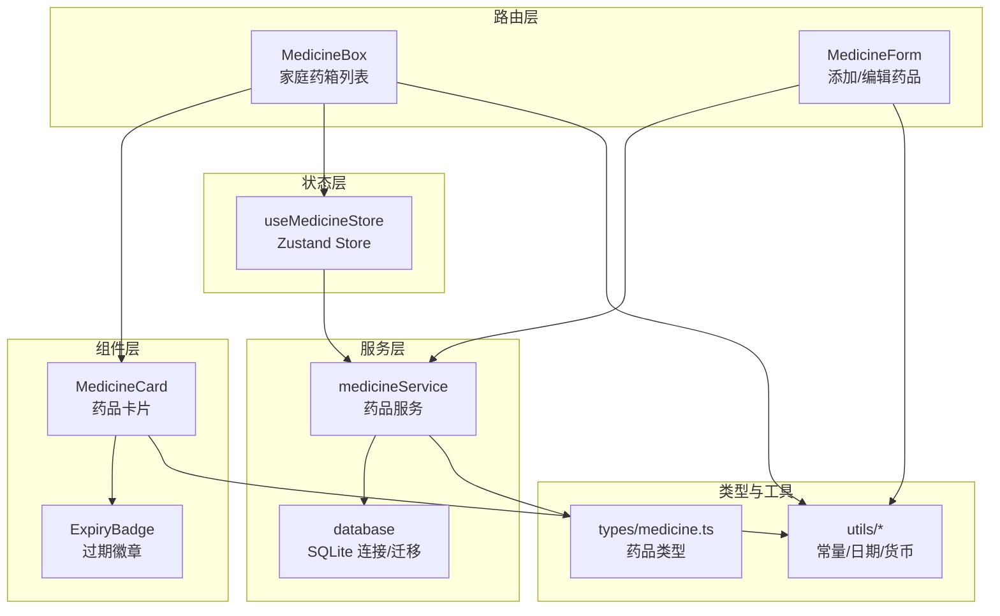
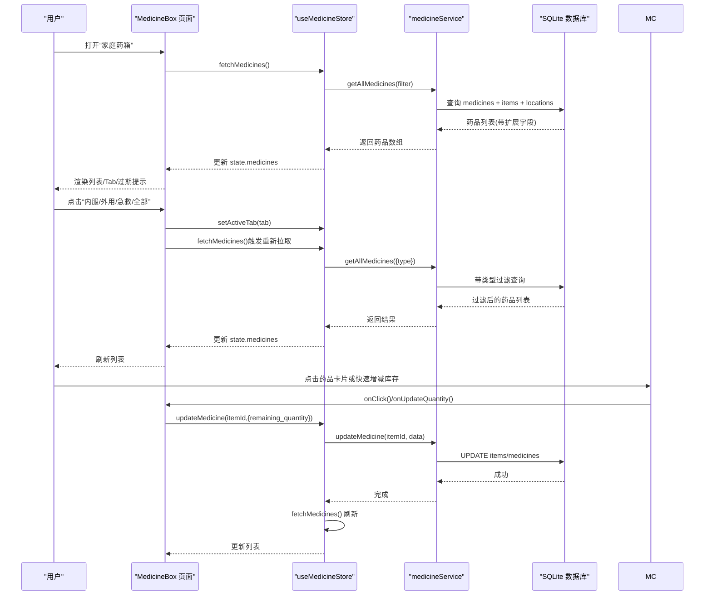
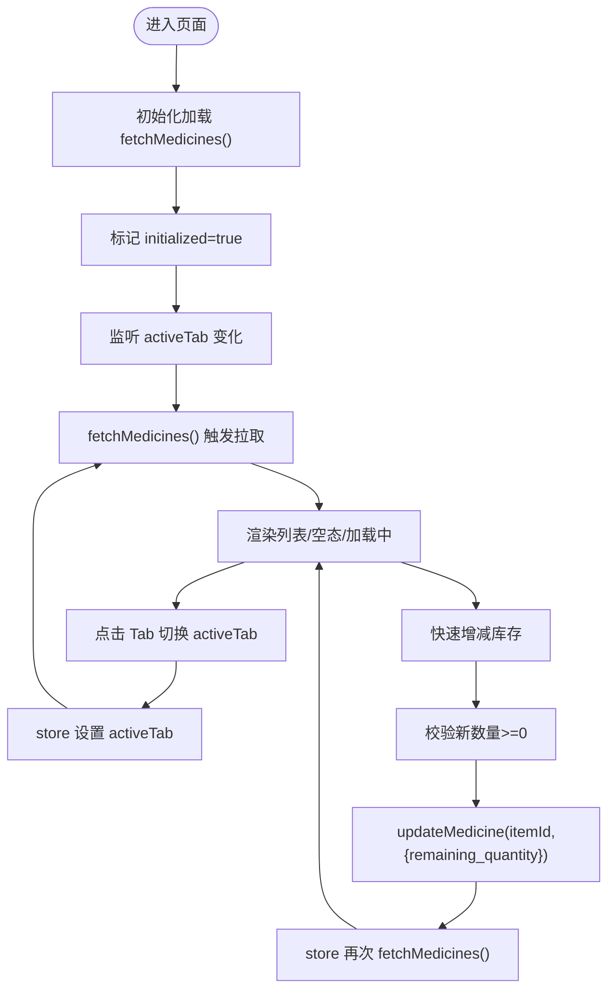
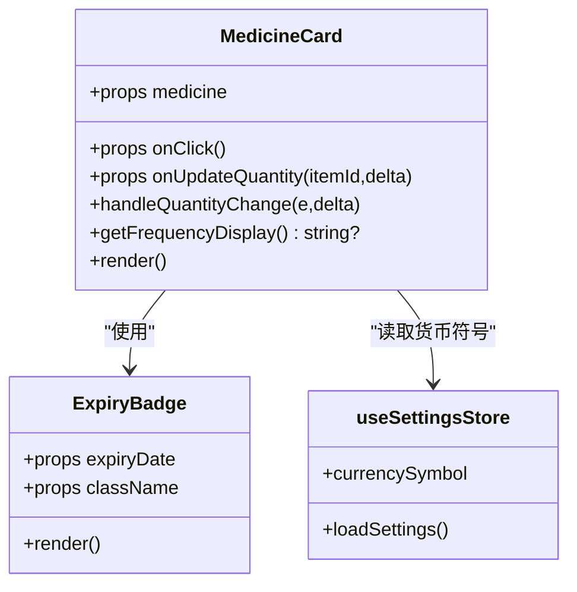
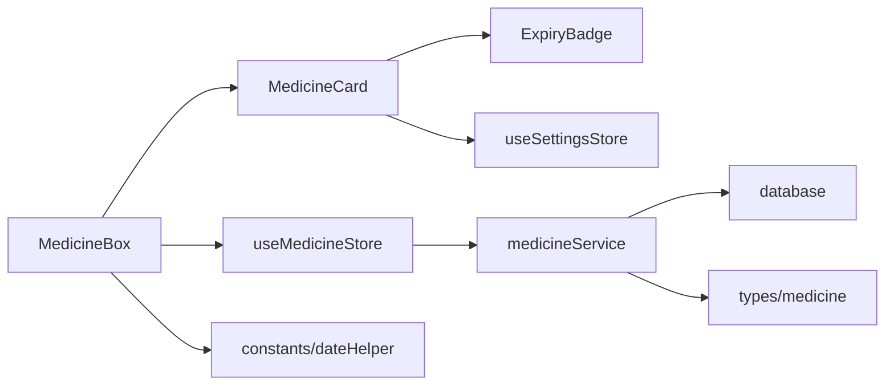

# 药品追踪

<cite>
**本文引用的文件**
- [src/routes/MedicineBox.tsx](file://src/routes/MedicineBox.tsx)
- [src/components/medicine/MedicineCard.tsx](file://src/components/medicine/MedicineCard.tsx)
- [src/components/medicine/ExpiryBadge.tsx](file://src/components/medicine/ExpiryBadge.tsx)
- [src/stores/useMedicineStore.ts](file://src/stores/useMedicineStore.ts)
- [src/types/medicine.ts](file://src/types/medicine.ts)
- [src/services/medicineService.ts](file://src/services/medicineService.ts)
- [src/utils/constants.ts](file://src/utils/constants.ts)
- [src/utils/dateHelper.ts](file://src/utils/dateHelper.ts)
- [src/services/database.ts](file://src/services/database.ts)
- [src/routes/MedicineForm.tsx](file://src/routes/MedicineForm.tsx)
- [src/stores/useSettingsStore.ts](file://src/stores/useSettingsStore.ts)
- [src/utils/currencyHelper.ts](file://src/utils/currencyHelper.ts)
- [src/stores/useItemStore.ts](file://src/stores/useItemStore.ts)
- [src/services/itemService.ts](file://src/services/itemService.ts)
- [src/types/item.ts](file://src/types/item.ts)
</cite>

## 目录
1. [简介](#简介)
2. [项目结构](#项目结构)
3. [核心组件](#核心组件)
4. [架构总览](#架构总览)
5. [详细组件分析](#详细组件分析)
6. [依赖关系分析](#依赖关系分析)
7. [性能考量](#性能考量)
8. [故障排查指南](#故障排查指南)
9. [结论](#结论)
10. [附录](#附录)

## 简介
本文件围绕“药品追踪”功能进行系统化文档化，覆盖药品列表管理、分类筛选（全部/内服/外用/急救）、状态与库存管理、药品卡片组件设计、状态管理（Zustand Store）的应用、Tab 切换与过滤逻辑、数据模型与业务规则，以及实际使用场景与最佳实践。

## 项目结构
该功能主要由以下层次构成：
- 路由层：负责页面入口与导航，如“家庭药箱”列表页与“添加/编辑药品”表单页
- 组件层：药品卡片、过期徽章、通用输入控件等
- 状态层：Zustand Store 管理药品列表、加载状态与当前 Tab
- 服务层：MedicineService 提供 CRUD 与查询能力；Database 封装 SQLite 连接与迁移
- 类型层：定义药品、扩展字段、表单数据结构
- 工具层：常量、日期处理、货币格式化等

图表来源
- [src/routes/MedicineBox.tsx:1-112](file://src/routes/MedicineBox.tsx#L1-L112)
- [src/routes/MedicineForm.tsx:1-401](file://src/routes/MedicineForm.tsx#L1-L401)
- [src/components/medicine/MedicineCard.tsx:1-147](file://src/components/medicine/MedicineCard.tsx#L1-L147)
- [src/components/medicine/ExpiryBadge.tsx:1-24](file://src/components/medicine/ExpiryBadge.tsx#L1-L24)
- [src/stores/useMedicineStore.ts:1-42](file://src/stores/useMedicineStore.ts#L1-L42)
- [src/services/medicineService.ts:1-194](file://src/services/medicineService.ts#L1-L194)
- [src/services/database.ts:1-171](file://src/services/database.ts#L1-L171)
- [src/types/medicine.ts:1-70](file://src/types/medicine.ts#L1-L70)
- [src/utils/constants.ts:1-40](file://src/utils/constants.ts#L1-L40)
- [src/utils/dateHelper.ts:1-52](file://src/utils/dateHelper.ts#L1-L52)
- [src/utils/currencyHelper.ts:1-17](file://src/utils/currencyHelper.ts#L1-L17)

章节来源
- [src/routes/MedicineBox.tsx:1-112](file://src/routes/MedicineBox.tsx#L1-L112)
- [src/routes/MedicineForm.tsx:1-401](file://src/routes/MedicineForm.tsx#L1-L401)
- [src/stores/useMedicineStore.ts:1-42](file://src/stores/useMedicineStore.ts#L1-L42)
- [src/services/medicineService.ts:1-194](file://src/services/medicineService.ts#L1-L194)
- [src/services/database.ts:1-171](file://src/services/database.ts#L1-L171)
- [src/types/medicine.ts:1-70](file://src/types/medicine.ts#L1-L70)
- [src/utils/constants.ts:1-40](file://src/utils/constants.ts#L1-L40)
- [src/utils/dateHelper.ts:1-52](file://src/utils/dateHelper.ts#L1-L52)
- [src/utils/currencyHelper.ts:1-17](file://src/utils/currencyHelper.ts#L1-L17)

## 核心组件
- 家庭药箱列表页：负责渲染 Tab、加载药品、展示过期/预警提示、分页/空态、跳转到编辑页、快速库存调整
- 药品卡片组件：展示药品名称、类型标签、状态标签、过期徽章、位置、价格、用量与提醒信息，支持点击进入详情与快速增减库存
- 过期徽章组件：根据有效期计算状态与标签文案
- 药品 Store：集中管理药品列表、加载状态、当前 Tab，并封装获取、新增、更新、设置 Tab 的方法
- 药品服务：封装数据库访问，提供按类型/搜索过滤、创建、更新、查询即将到期/正在服用等能力
- 数据库与迁移：初始化 SQLite、建表、索引与默认数据，确保 medicines 表与 items 表关联
- 表单页：支持基础信息、购买信息、用药提醒配置（频率、时间、周期），并可删除药品

章节来源
- [src/routes/MedicineBox.tsx:18-112](file://src/routes/MedicineBox.tsx#L18-L112)
- [src/components/medicine/MedicineCard.tsx:14-147](file://src/components/medicine/MedicineCard.tsx#L14-L147)
- [src/components/medicine/ExpiryBadge.tsx:8-24](file://src/components/medicine/ExpiryBadge.tsx#L8-L24)
- [src/stores/useMedicineStore.ts:15-42](file://src/stores/useMedicineStore.ts#L15-L42)
- [src/services/medicineService.ts:10-194](file://src/services/medicineService.ts#L10-L194)
- [src/services/database.ts:18-171](file://src/services/database.ts#L18-L171)
- [src/routes/MedicineForm.tsx:33-401](file://src/routes/MedicineForm.tsx#L33-L401)

## 架构总览
下图展示了从用户交互到数据持久化的端到端流程：

图表来源
- [src/routes/MedicineBox.tsx:20-36](file://src/routes/MedicineBox.tsx#L20-L36)
- [src/stores/useMedicineStore.ts:20-36](file://src/stores/useMedicineStore.ts#L20-L36)
- [src/services/medicineService.ts:97-162](file://src/services/medicineService.ts#L97-L162)
- [src/services/database.ts:8-16](file://src/services/database.ts#L8-L16)

## 详细组件分析

### 药品列表页（MedicineBox）
- 功能要点
  - 初始化加载：首次挂载时调用获取药品列表，并标记初始化完成
  - 自动刷新：当 activeTab 变化或初始化完成后再次拉取
  - Tab 切换：支持“全部/内服/外用/急救”，通过 store 设置 activeTab 并触发过滤查询
  - 过期与预警统计：基于有效期计算过期与预警数量，顶部展示汇总提示
  - 列表渲染：为空时展示空态；加载中显示旋转指示器；有数据时逐条渲染药品卡片
  - 快速库存更新：通过回调将增减动作传递给父级，保证库存非负
  - 导航：右上角“添加药品”跳转到表单页

图表来源
- [src/routes/MedicineBox.tsx:20-36](file://src/routes/MedicineBox.tsx#L20-L36)
- [src/stores/useMedicineStore.ts:20-36](file://src/stores/useMedicineStore.ts#L20-L36)
- [src/services/medicineService.ts:97-162](file://src/services/medicineService.ts#L97-L162)

章节来源
- [src/routes/MedicineBox.tsx:18-112](file://src/routes/MedicineBox.tsx#L18-L112)

### 药品卡片组件（MedicineCard）
- 设计要点
  - 信息展示：名称、类型标签、状态标签（正在服用）、过期徽章、位置路径、价格
  - 用量与提醒：当正在服用时展示频率、时间点、周期；否则展示用法说明
  - 交互行为：卡片点击进入编辑页；右侧提供库存增减按钮，阻止事件冒泡避免误触卡片
  - 价格格式化：读取设置中的货币符号并格式化显示
  - 时间/频率格式化：将逗号分隔的字符串转换为可读文本

图表来源
- [src/components/medicine/MedicineCard.tsx:14-147](file://src/components/medicine/MedicineCard.tsx#L14-L147)
- [src/components/medicine/ExpiryBadge.tsx:8-24](file://src/components/medicine/ExpiryBadge.tsx#L8-L24)
- [src/stores/useSettingsStore.ts:19-35](file://src/stores/useSettingsStore.ts#L19-L35)

章节来源
- [src/components/medicine/MedicineCard.tsx:14-147](file://src/components/medicine/MedicineCard.tsx#L14-L147)
- [src/components/medicine/ExpiryBadge.tsx:8-24](file://src/components/medicine/ExpiryBadge.tsx#L8-L24)
- [src/stores/useSettingsStore.ts:19-35](file://src/stores/useSettingsStore.ts#L19-L35)

### 过期徽章组件（ExpiryBadge）
- 功能要点
  - 根据有效期计算状态：安全/预警/过期
  - 展示人性化标签：如“已过期 X 天”、“今天过期”、“X 天后过期”等
  - 使用不同背景色区分状态

章节来源
- [src/components/medicine/ExpiryBadge.tsx:8-24](file://src/components/medicine/ExpiryBadge.tsx#L8-L24)
- [src/utils/dateHelper.ts:30-43](file://src/utils/dateHelper.ts#L30-L43)

### 状态管理（useMedicineStore）
- Store 结构
  - 状态：medicines、loading、activeTab
  - 方法：fetchMedicines、addMedicine、updateMedicine、setActiveTab
- 过滤逻辑
  - 当 activeTab 非“全部”时，传入类型过滤参数
- 更新策略
  - 新增/更新后立即重新拉取，保证 UI 与数据一致

章节来源
- [src/stores/useMedicineStore.ts:5-42](file://src/stores/useMedicineStore.ts#L5-L42)

### 药品服务（medicineService）
- 查询能力
  - 支持按类型与名称模糊搜索过滤
  - 关联 items 与 locations 获取完整信息
- 写入能力
  - 创建：先插入 items，再插入 medicines，保持一对一扩展关系
  - 更新：分别更新 items 与 medicines 字段，布尔值转换为 0/1 存储
- 辅助查询
  - 即将到期药品、正在服用药品等

章节来源
- [src/services/medicineService.ts:10-194](file://src/services/medicineService.ts#L10-L194)

### 数据库与迁移（database）
- 初始化
  - 首次访问建立 SQLite 连接并执行迁移
- 迁移内容
  - 创建 categories、locations、items、medicines、settings 等表
  - 建立常用索引以提升查询性能
  - 插入默认分类与设置项
- medicines 表与 items 表
  - medicines.item_id 外键引用 items.id，删除 items 时级联删除 medicines

章节来源
- [src/services/database.ts:18-171](file://src/services/database.ts#L18-L171)

### 药品表单页（MedicineForm）
- 表单字段
  - 基本信息：名称、有效期、类型、用法说明、剩余数量、单位、厂商
  - 购买信息：购买日期、价格、存放位置
  - 用药提醒：开关、频率类型（每日/每N天/每周）、每周选择、时间点集合、周期起止
- 交互逻辑
  - 添加/编辑模式切换
  - 时间点增删改
  - 星期多选
  - 删除确认对话框
- 保存与校验
  - 校验必填项后提交，成功后返回列表页

章节来源
- [src/routes/MedicineForm.tsx:33-401](file://src/routes/MedicineForm.tsx#L33-L401)

### 数据模型与业务规则（types/medicine.ts）
- 药品类别
  - internal（内服）、external（外用）、emergency（急救）
- 状态与频率
  - ExpiryStatus：safe、warning、expired
  - FrequencyType：daily、every_n_days、weekly
- 扩展字段
  - is_taking、frequency_type、frequency_days、week_days、time_slots、duration_start、duration_end、last_reminded
- 关联模型
  - MedicineWithItem：在 Medicine 基础上扩展 items 的字段（名称、描述、类别、位置、购买信息、状态、图标等）

章节来源
- [src/types/medicine.ts:3-70](file://src/types/medicine.ts#L3-L70)

### 业务规则与工具
- 常量
  - MEDICINE_TYPE_LABELS：类型中文映射
- 日期工具
  - getExpiryStatus/getExpiryLabel：过期状态与标签计算
- 货币工具
  - formatCurrency：金额格式化（含“万”单位）

章节来源
- [src/utils/constants.ts:15-20](file://src/utils/constants.ts#L15-L20)
- [src/utils/dateHelper.ts:30-43](file://src/utils/dateHelper.ts#L30-L43)
- [src/utils/currencyHelper.ts:1-17](file://src/utils/currencyHelper.ts#L1-L17)

## 依赖关系分析
- 组件依赖
  - MedicineCard 依赖 ExpiryBadge 与 useSettingsStore
  - MedicineBox 依赖 useMedicineStore、MedicineCard、EmptyState、常量与日期工具
- 服务依赖
  - medicineService 依赖 database 与日期工具
- 类型与工具
  - types/medicine.ts 为服务与组件提供强类型支撑
  - utils/* 提供跨模块共享的业务工具

图表来源
- [src/components/medicine/MedicineCard.tsx:14-147](file://src/components/medicine/MedicineCard.tsx#L14-L147)
- [src/components/medicine/ExpiryBadge.tsx:8-24](file://src/components/medicine/ExpiryBadge.tsx#L8-L24)
- [src/stores/useSettingsStore.ts:19-35](file://src/stores/useSettingsStore.ts#L19-L35)
- [src/routes/MedicineBox.tsx:20-36](file://src/routes/MedicineBox.tsx#L20-L36)
- [src/stores/useMedicineStore.ts:20-36](file://src/stores/useMedicineStore.ts#L20-L36)
- [src/services/medicineService.ts:10-194](file://src/services/medicineService.ts#L10-L194)
- [src/services/database.ts:8-16](file://src/services/database.ts#L8-L16)
- [src/types/medicine.ts:3-70](file://src/types/medicine.ts#L3-L70)
- [src/utils/constants.ts:15-20](file://src/utils/constants.ts#L15-L20)
- [src/utils/dateHelper.ts:30-43](file://src/utils/dateHelper.ts#L30-L43)

## 性能考量
- 查询优化
  - medicines 表按 expiry_date 排序，有助于前端展示与统计
  - 建立索引（items_category、items_location、items_status、medicines_item、medicines_expiry、medicines_type、locations_parent）提升过滤与关联查询效率
- 状态同步
  - Store 在新增/更新后立即重新拉取，避免 UI 与数据库不一致
- 渲染优化
  - 列表为空时使用 EmptyState，减少不必要的 DOM
  - 加载中使用骨架动画，改善感知性能

章节来源
- [src/services/database.ts:124-131](file://src/services/database.ts#L124-L131)
- [src/stores/useMedicineStore.ts:28-36](file://src/stores/useMedicineStore.ts#L28-L36)
- [src/routes/MedicineBox.tsx:87-97](file://src/routes/MedicineBox.tsx#L87-L97)

## 故障排查指南
- 无法看到药品列表
  - 检查数据库连接与迁移是否成功
  - 确认 medicines 与 items 是否存在数据
- Tab 切换无效
  - 确认 store 中 activeTab 是否正确设置
  - 检查 fetchMedicines 是否被调用
- 库存更新失败
  - 确认 onUpdateQuantity 回调是否传递正确的 itemId 与 delta
  - 检查数据库写入是否成功（items/medicines）
- 过期状态显示异常
  - 检查有效期字段格式与 getExpiryStatus 计算逻辑
- 价格未按预期格式化
  - 检查 useSettingsStore 中 currencySymbol 的值

章节来源
- [src/services/database.ts:8-16](file://src/services/database.ts#L8-L16)
- [src/stores/useMedicineStore.ts:33-36](file://src/stores/useMedicineStore.ts#L33-L36)
- [src/utils/dateHelper.ts:30-43](file://src/utils/dateHelper.ts#L30-L43)
- [src/stores/useSettingsStore.ts:19-35](file://src/stores/useSettingsStore.ts#L19-L35)

## 结论
该药品追踪功能通过清晰的分层设计与强类型模型，实现了从数据模型、服务层到 UI 组件的完整闭环。Tab 分类筛选、库存快速调整、过期状态可视化与提醒配置等核心能力均具备良好的可维护性与扩展性。建议在后续迭代中进一步完善搜索与排序、批量操作与导出等功能。

## 附录
- 实际使用场景
  - 家庭药箱日常盘点：通过 Tab 快速定位内服/外用/急救药品，查看剩余数量与有效期
  - 用药提醒配置：为正在服用的药品设置频率、时间与周期，提升依从性
  - 库存管理：通过卡片上的增减按钮快速更新剩余数量，避免重复进入表单
- 最佳实践
  - 保持 medicines 与 items 的一对一关系，统一通过 medicineService 进行 CRUD
  - 使用 Store 的 fetchMedicines 在关键操作后刷新，确保状态一致性
  - 对有效期与货币格式化使用统一工具函数，便于国际化与主题定制
  - 为常用查询建立索引，持续关注查询性能