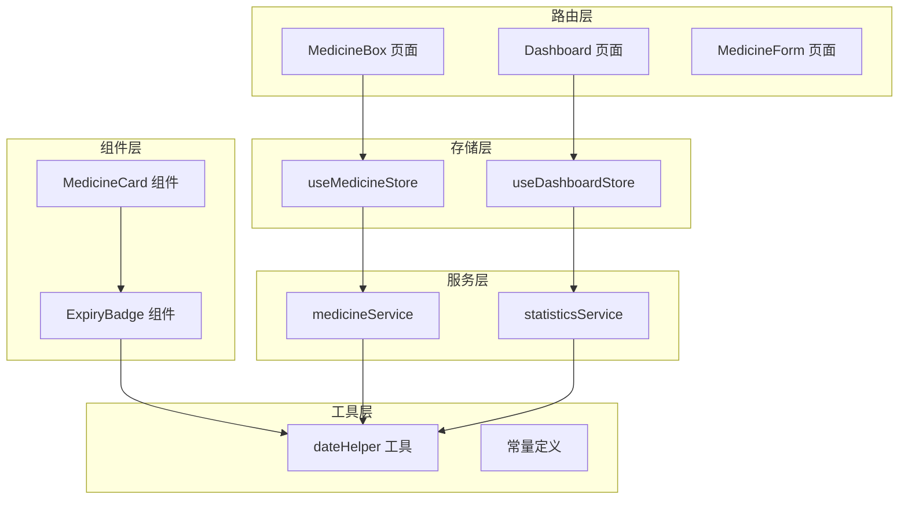
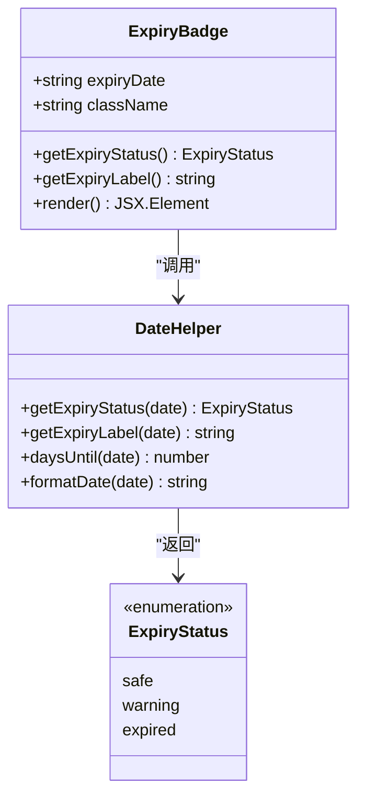
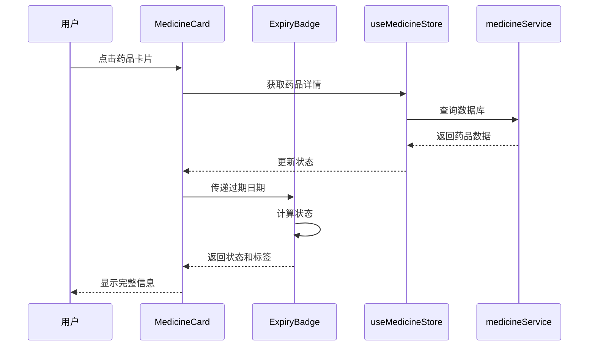
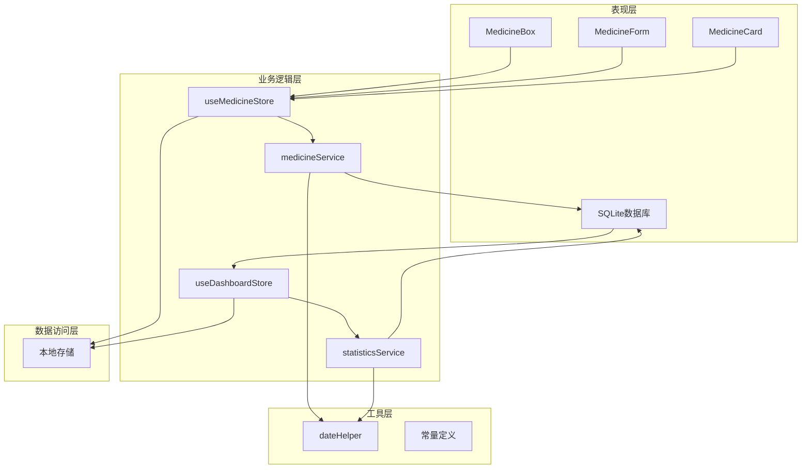
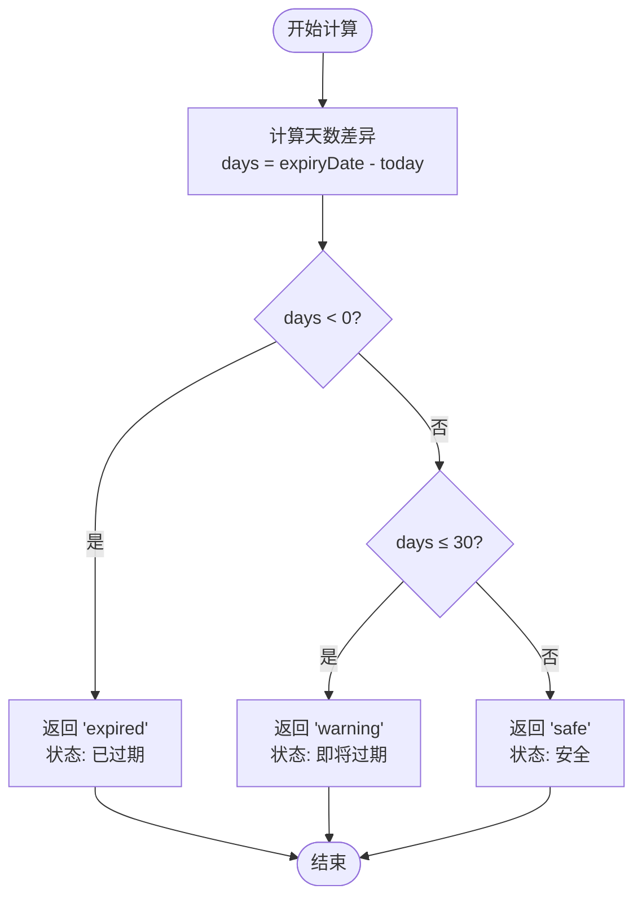
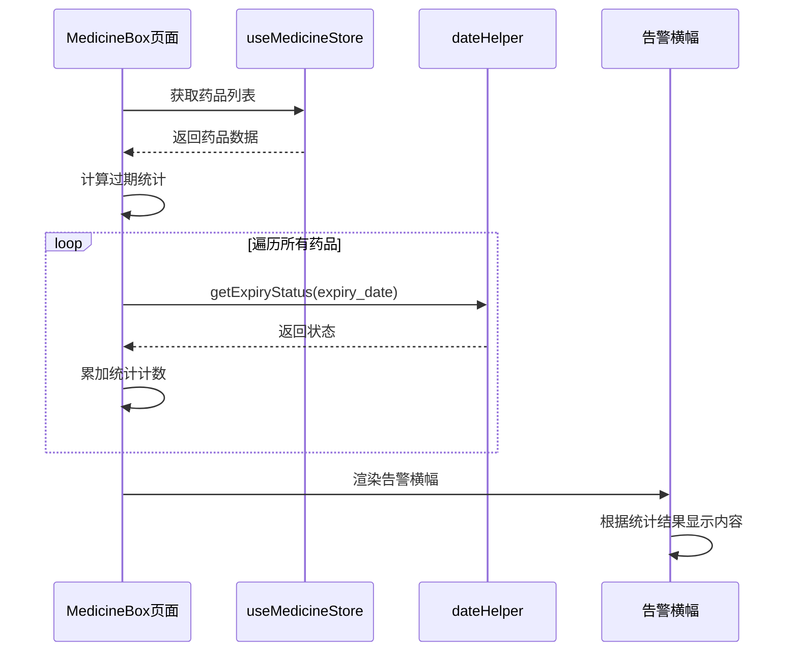
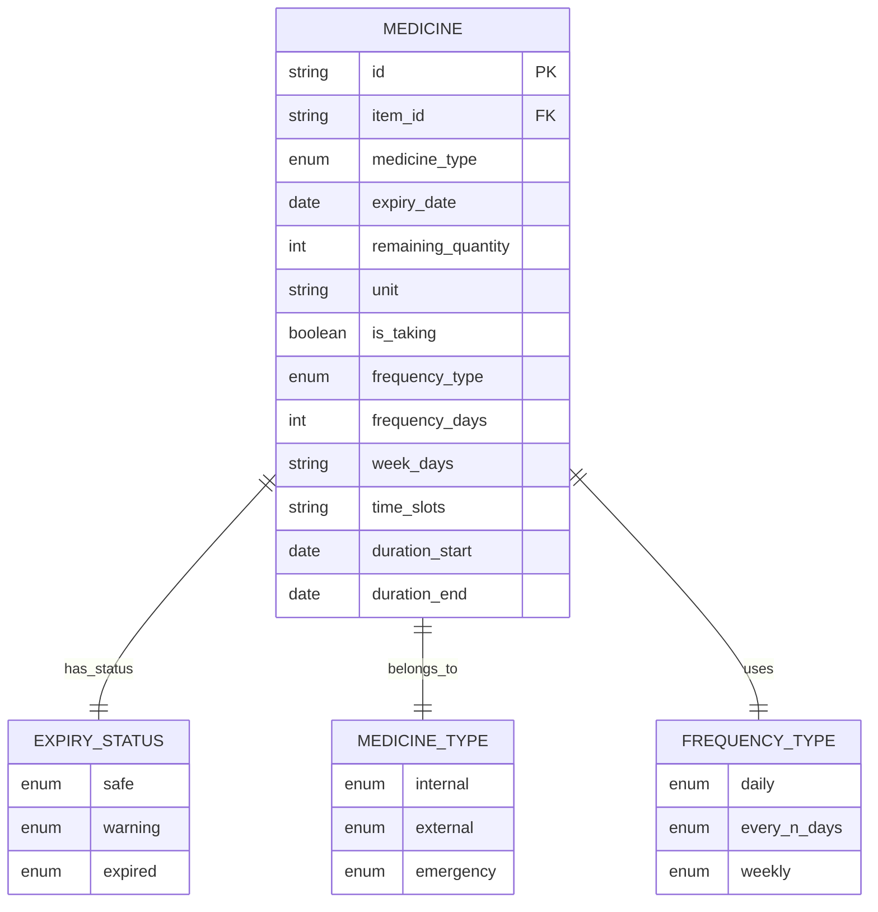
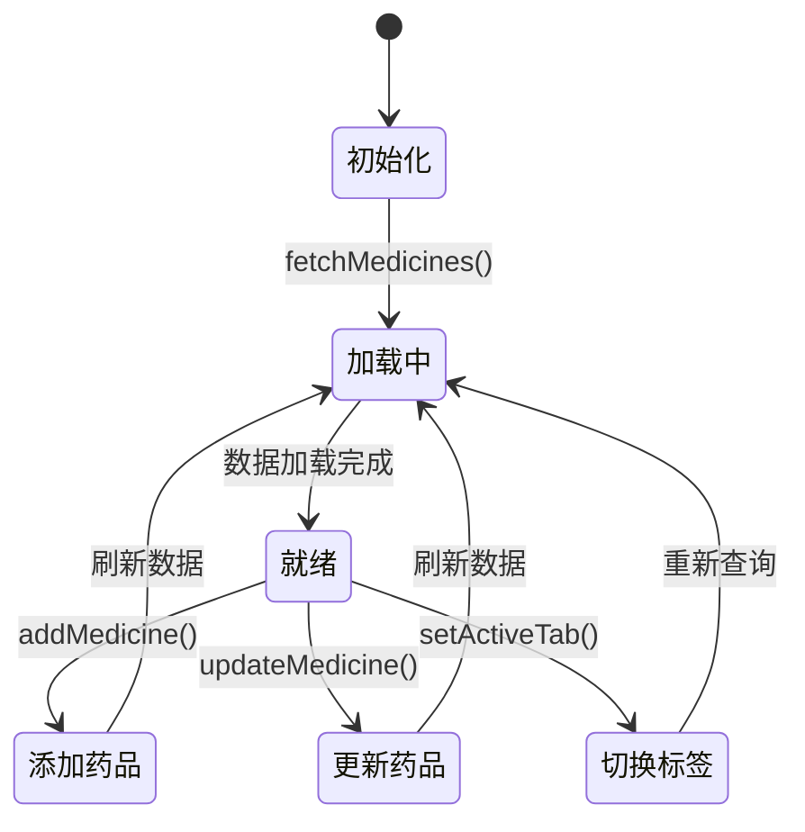
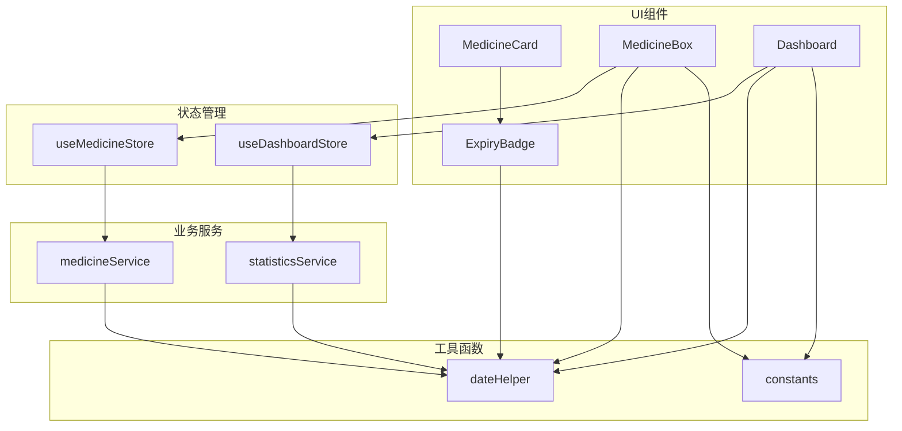

# 过期预警系统

<cite>
**本文档引用的文件**
- [ExpiryBadge.tsx](file://src/components/medicine/ExpiryBadge.tsx)
- [dateHelper.ts](file://src/utils/dateHelper.ts)
- [medicine.ts](file://src/types/medicine.ts)
- [useMedicineStore.ts](file://src/stores/useMedicineStore.ts)
- [medicineService.ts](file://src/services/medicineService.ts)
- [MedicineBox.tsx](file://src/routes/MedicineBox.tsx)
- [MedicineCard.tsx](file://src/components/medicine/MedicineCard.tsx)
- [useDashboardStore.ts](file://src/stores/useDashboardStore.ts)
- [constants.ts](file://src/utils/constants.ts)
- [statisticsService.ts](file://src/services/statisticsService.ts)
- [Dashboard.tsx](file://src/routes/Dashboard.tsx)
- [settings.ts](file://src/types/settings.ts)
- [MedicineForm.tsx](file://src/routes/MedicineForm.tsx)
</cite>

## 目录
1. [简介](#简介)
2. [项目结构](#项目结构)
3. [核心组件](#核心组件)
4. [架构概览](#架构概览)
5. [详细组件分析](#详细组件分析)
6. [依赖关系分析](#依赖关系分析)
7. [性能考虑](#性能考虑)
8. [故障排除指南](#故障排除指南)
9. [结论](#结论)
10. [附录](#附录)

## 简介

过期预警系统是一个基于React + TypeScript构建的家庭资产管理应用中的核心功能模块，专门用于监控和管理药品的有效期。该系统通过智能的状态计算、直观的视觉反馈和实时的通知机制，帮助用户及时发现和处理即将过期或已经过期的药品。

系统采用现代化的前端架构，结合Zustand状态管理、Day.js日期处理库和SQLite数据库，实现了完整的药品生命周期管理功能。从基础的过期状态计算到复杂的预警通知，每个组件都经过精心设计以确保最佳的用户体验。

## 项目结构

过期预警系统主要分布在以下目录结构中：

**图表来源**
- [ExpiryBadge.tsx:1-24](file://src/components/medicine/ExpiryBadge.tsx#L1-L24)
- [dateHelper.ts:1-52](file://src/utils/dateHelper.ts#L1-L52)
- [MedicineBox.tsx:1-112](file://src/routes/MedicineBox.tsx#L1-L112)

**章节来源**
- [ExpiryBadge.tsx:1-24](file://src/components/medicine/ExpiryBadge.tsx#L1-L24)
- [MedicineBox.tsx:1-112](file://src/routes/MedicineBox.tsx#L1-L112)
- [Dashboard.tsx:1-235](file://src/routes/Dashboard.tsx#L1-L235)

## 核心组件

### 过期徽章组件 (ExpiryBadge)

过期徽章组件是整个预警系统的核心视觉元素，负责将复杂的日期计算结果转化为直观的颜色编码状态。

#### 组件架构

**图表来源**
- [ExpiryBadge.tsx:3-23](file://src/components/medicine/ExpiryBadge.tsx#L3-L23)
- [dateHelper.ts:30-43](file://src/utils/dateHelper.ts#L30-L43)

#### 视觉反馈机制

组件采用三色编码系统：
- **绿色安全状态**：有效期超过30天
- **黄色警告状态**：有效期在0-30天之间
- **红色过期状态**：有效期已过期

**章节来源**
- [ExpiryBadge.tsx:8-23](file://src/components/medicine/ExpiryBadge.tsx#L8-L23)
- [dateHelper.ts:30-43](file://src/utils/dateHelper.ts#L30-L43)

### 药品卡片组件 (MedicineCard)

药品卡片组件集成了过期徽章，并提供了完整的药品信息展示和交互功能。

#### 数据流分析

**图表来源**
- [MedicineCard.tsx:14-146](file://src/components/medicine/MedicineCard.tsx#L14-L146)
- [ExpiryBadge.tsx:8-23](file://src/components/medicine/ExpiryBadge.tsx#L8-L23)

**章节来源**
- [MedicineCard.tsx:14-146](file://src/components/medicine/MedicineCard.tsx#L14-L146)

## 架构概览

过期预警系统采用分层架构设计，确保各组件职责清晰、耦合度低。

**图表来源**
- [MedicineBox.tsx:18-111](file://src/routes/MedicineBox.tsx#L18-L111)
- [Dashboard.tsx:13-216](file://src/routes/Dashboard.tsx#L13-L216)
- [useMedicineStore.ts:15-41](file://src/stores/useMedicineStore.ts#L15-L41)

## 详细组件分析

### 日期状态计算逻辑

#### 状态分类算法

系统采用基于天数差异的精确计算方法：

**图表来源**
- [dateHelper.ts:30-35](file://src/utils/dateHelper.ts#L30-L35)

#### 标签生成逻辑

标签文本根据剩余天数动态生成：

| 状态 | 条件 | 标签示例 |
|------|------|----------|
| 已过期 | days < 0 | "已过期 5 天" |
| 今天过期 | days = 0 | "今天过期" |
| 即将过期 | 0 < days ≤ 30 | "15 天后过期" |
| 安全 | days > 30 | "45 天" |

**章节来源**
- [dateHelper.ts:37-43](file://src/utils/dateHelper.ts#L37-L43)

### 预警通知系统

#### 顶部告警横幅实现

系统在药箱页面顶部实现了智能的告警横幅，能够根据过期状态动态显示：

**图表来源**
- [MedicineBox.tsx:38-67](file://src/routes/MedicineBox.tsx#L38-L67)

#### 统计计算机制

告警横幅包含两个关键统计数据：
- **已过期数量**：状态为 'expired' 的药品数量
- **即将过期数量**：状态为 'warning' 的药品数量

**章节来源**
- [MedicineBox.tsx:38-67](file://src/routes/MedicineBox.tsx#L38-L67)

### 数据模型与类型定义

#### 药品类型系统

系统定义了完整的药品类型和状态枚举：

**图表来源**
- [medicine.ts:3-27](file://src/types/medicine.ts#L3-L27)

**章节来源**
- [medicine.ts:3-27](file://src/types/medicine.ts#L3-L27)

### 状态管理架构

#### 药品状态存储

系统使用Zustand实现高效的状态管理：

**图表来源**
- [useMedicineStore.ts:15-41](file://src/stores/useMedicineStore.ts#L15-L41)

#### 仪表板状态管理

仪表板使用独立的状态存储管理多个数据源：

**章节来源**
- [useMedicineStore.ts:15-41](file://src/stores/useMedicineStore.ts#L15-L41)
- [useDashboardStore.ts:16-33](file://src/stores/useDashboardStore.ts#L16-L33)

## 依赖关系分析

### 组件间依赖关系

**图表来源**
- [MedicineBox.tsx:18-111](file://src/routes/MedicineBox.tsx#L18-L111)
- [Dashboard.tsx:13-216](file://src/routes/Dashboard.tsx#L13-L216)

### 数据流依赖

系统采用单向数据流设计，确保数据一致性：

1. **数据获取**：服务层从数据库获取原始数据
2. **数据转换**：工具层进行格式化和计算
3. **状态更新**：存储层更新全局状态
4. **视图渲染**：组件根据状态重新渲染

**章节来源**
- [medicineService.ts:10-37](file://src/services/medicineService.ts#L10-L37)
- [statisticsService.ts:4-26](file://src/services/statisticsService.ts#L4-L26)

## 性能考虑

### 优化策略

#### 1. 懒加载和虚拟滚动
- 对于大量药品数据，建议实现虚拟滚动以提升渲染性能
- 使用React.lazy实现组件懒加载

#### 2. 缓存策略
- 利用localStorage缓存常用查询结果
- 实现防抖机制避免频繁的API调用

#### 3. 计算优化
- 使用memoization缓存日期计算结果
- 实现增量更新减少不必要的重渲染

#### 4. 数据库查询优化
- 为常用查询字段建立索引
- 使用参数化查询防止SQL注入

## 故障排除指南

### 常见问题及解决方案

#### 1. 过期状态计算异常

**症状**：过期状态显示不正确
**可能原因**：
- 日期格式不匹配
- 时区处理错误
- 数据库存储格式问题

**解决步骤**：
1. 检查日期格式是否为标准ISO格式
2. 验证时区设置
3. 确认数据库中存储的日期格式

#### 2. 徽章颜色显示错误

**症状**：徽章颜色不符合预期
**可能原因**：
- CSS类名冲突
- 状态映射错误
- 样式覆盖问题

**解决步骤**：
1. 检查状态到颜色的映射关系
2. 验证CSS类名的正确性
3. 确认样式优先级

#### 3. 统计数据不准确

**症状**：过期药品统计数量错误
**可能原因**：
- 过滤条件不正确
- 数据更新延迟
- 状态计算逻辑错误

**解决步骤**：
1. 检查数据库查询条件
2. 验证状态计算逻辑
3. 确认数据同步机制

**章节来源**
- [dateHelper.ts:30-43](file://src/utils/dateHelper.ts#L30-L43)
- [MedicineBox.tsx:38-67](file://src/routes/MedicineBox.tsx#L38-L67)

## 结论

过期预警系统通过精心设计的架构和算法，成功实现了药品有效期管理的核心功能。系统的主要优势包括：

1. **精确的状态计算**：基于天数差异的算法确保状态判断的准确性
2. **直观的视觉反馈**：三色编码系统提供清晰的状态指示
3. **智能的通知机制**：动态统计和告警横幅提升用户体验
4. **可扩展的架构**：模块化的组件设计便于功能扩展

系统在保证功能完整性的同时，也充分考虑了性能优化和用户体验，为用户提供了一个可靠、易用的药品管理解决方案。

## 附录

### 最佳实践建议

#### 1. 用户体验优化
- 提供多种排序和筛选选项
- 实现响应式设计适配不同设备
- 增加批量操作功能

#### 2. 功能扩展建议
- 添加邮件或短信通知功能
- 实现多语言支持
- 增加药品库存预警

#### 3. 技术债务管理
- 定期重构和优化代码结构
- 建立完善的测试覆盖率
- 持续监控系统性能指标