# 药品类型与单位管理系统

<cite>
**本文档引用的文件**
- [src/App.tsx](file://src/App.tsx)
- [src/main.tsx](file://src/main.tsx)
- [src/routes/Categories.tsx](file://src/routes/Categories.tsx)
- [src/services/categoryService.ts](file://src/services/categoryService.ts)
- [src/types/category.ts](file://src/types/category.ts)
- [src/stores/useCategoryStore.ts](file://src/stores/useCategoryStore.ts)
- [src/types/medicine.ts](file://src/types/medicine.ts)
- [src/services/medicineService.ts](file://src/services/medicineService.ts)
- [src/routes/MedicineBox.tsx](file://src/routes/MedicineBox.tsx)
- [src/components/medicine/MedicineCard.tsx](file://src/components/medicine/MedicineCard.tsx)
- [src/stores/useMedicineStore.ts](file://src/stores/useMedicineStore.ts)
- [src/utils/constants.ts](file://src/utils/constants.ts)
- [src/services/database.ts](file://src/services/database.ts)
- [src/routes/MedicineForm.tsx](file://src/routes/MedicineForm.tsx)
- [src/stores/useSettingsStore.ts](file://src/stores/useSettingsStore.ts)
- [src/components/shared/EmojiPicker.tsx](file://src/components/shared/EmojiPicker.tsx)
</cite>

## 更新摘要
**变更内容**
- 药品类别从15种简化为3种固定预设（内服、外用、急救）
- 单位系统从可配置改为固定中文单位（片、粒、支、瓶、盒、ml）
- 移除了设置界面中的药品类型和单位管理功能
- EmojiPicker组件从外部依赖改为内置实现
- 更新了所有相关组件和状态管理以反映新的固定预设

## 目录
1. [项目概述](#项目概述)
2. [项目结构](#项目结构)
3. [核心组件](#核心组件)
4. [架构概览](#架构概览)
5. [详细组件分析](#详细组件分析)
6. [依赖关系分析](#依赖关系分析)
7. [性能考虑](#性能考虑)
8. [故障排除指南](#故障排除指南)
9. [结论](#结论)

## 项目概述

药品类型与单位管理系统是一个基于 React 和 Tauri 技术栈开发的桌面应用程序，专门用于管理家庭药箱中的药品信息。该系统提供了完整的药品生命周期管理功能，包括药品类型定义、单位管理、库存跟踪、过期提醒等核心功能。

### 主要特性

- **药品类型管理**：支持3种预定义的药品类型（内服、外用、急救）
- **固定单位系统**：预定义的中文药品计量单位（片、粒、支、瓶、盒、ml）
- **库存跟踪**：实时库存管理和数量调整
- **过期提醒**：智能过期预警和到期提醒
- **用药提醒**：可配置的用药频率和时间安排
- **分类管理**：自定义分类和标签系统
- **数据持久化**：本地 SQLite 数据库存储

## 项目结构

该项目采用现代化的前端架构，遵循模块化设计原则：

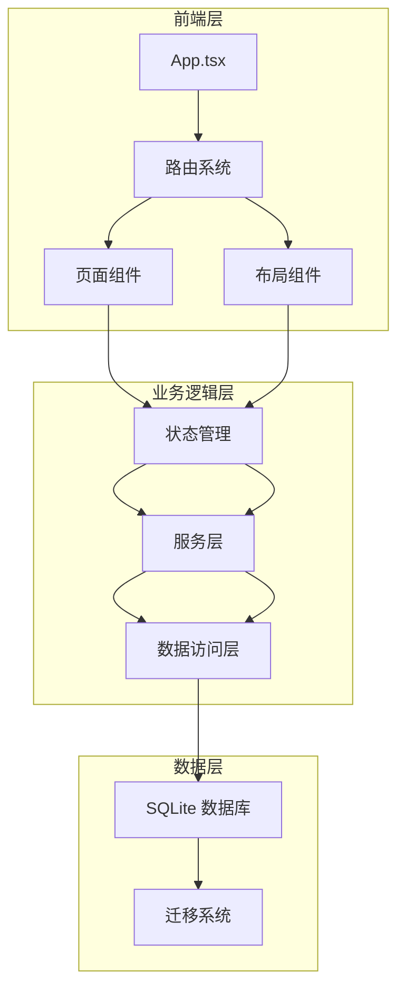

**图表来源**
- [src/App.tsx:1-53](file://src/App.tsx#L1-L53)
- [src/main.tsx:1-11](file://src/main.tsx#L1-L11)

### 核心目录结构

- **src/**: 主要源代码目录
  - **components/**: 可复用的 UI 组件
  - **routes/**: 页面级组件和路由处理
  - **services/**: 业务逻辑和服务层
  - **stores/**: 状态管理（Zustand）
  - **types/**: TypeScript 类型定义
  - **utils/**: 工具函数和常量

**章节来源**
- [src/App.tsx:1-53](file://src/App.tsx#L1-L53)
- [src/main.tsx:1-11](file://src/main.tsx#L1-L11)

## 核心组件

### 数据模型架构

系统采用清晰的数据模型分层设计，确保数据的一致性和完整性：

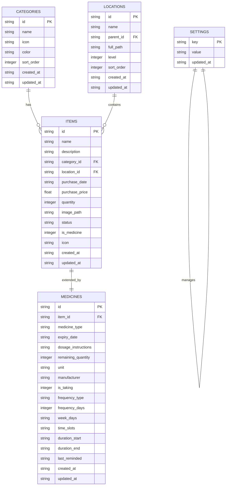

**图表来源**
- [src/services/database.ts:60-171](file://src/services/database.ts#L60-L171)
- [src/types/medicine.ts:22-85](file://src/types/medicine.ts#L22-L85)

### 药品类型系统

**更新** 药品类别已从15种简化为3种固定预设：

系统支持 3 种预定义的药品类型，每种类型都有对应的中文标签：

| 药品类别 | 英文键值 | 中文标签 |
|---------|---------|---------|
| 内服 | internal | 内服 |
| 外用 | external | 外用 |
| 急救 | emergency | 急救 |

**章节来源**
- [src/utils/constants.ts:15-20](file://src/utils/constants.ts#L15-L20)
- [src/stores/useSettingsStore.ts:10-26](file://src/stores/useSettingsStore.ts#L10-L26)

### 固定单位系统

**更新** 单位系统已从可配置改为固定中文单位：

系统支持 6 种预定义的中文药品计量单位：

| 单位类型 | 英文键值 | 中文标签 |
|---------|---------|---------|
| 片 | pill | 片 |
| 粒 | tablet | 粒 |
| 支 | stick | 支 |
| 瓶 | bottle | 瓶 |
| 盒 | box | 盒 |
| 毫升 | ml | ml |

**章节来源**
- [src/routes/MedicineForm.tsx:200-212](file://src/routes/MedicineForm.tsx#L200-L212)

## 架构概览

系统采用分层架构设计，确保各层职责明确，便于维护和扩展：

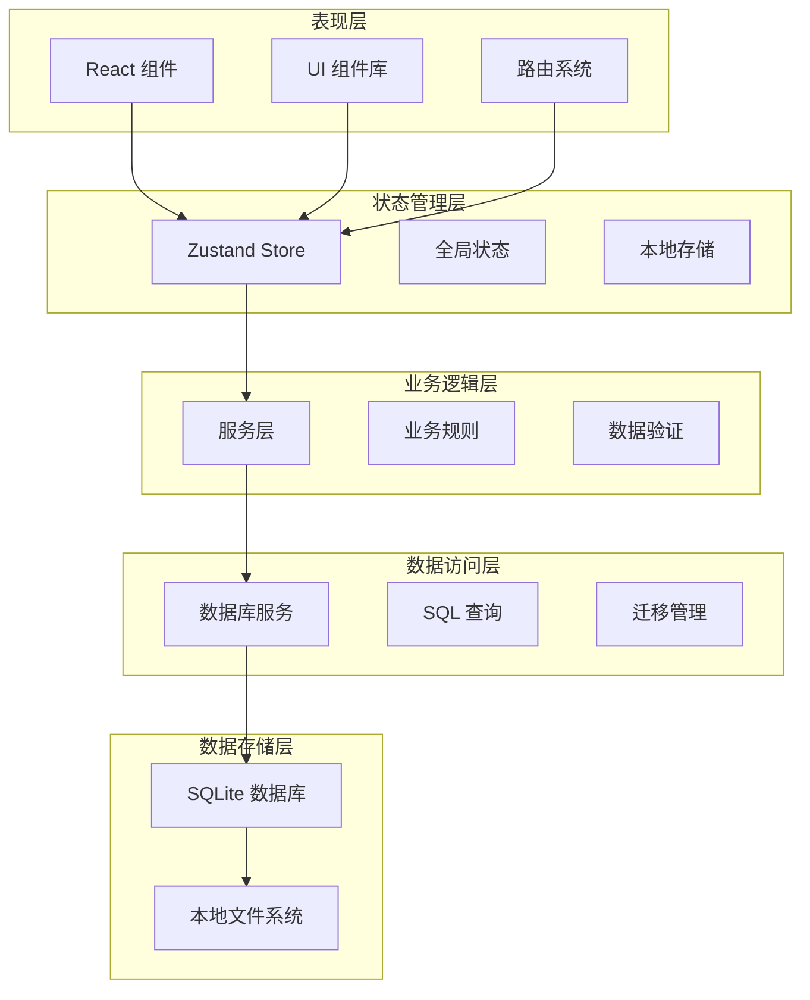

**图表来源**
- [src/App.tsx:18-52](file://src/App.tsx#L18-L52)
- [src/stores/useCategoryStore.ts:14-43](file://src/stores/useCategoryStore.ts#L14-L43)
- [src/stores/useMedicineStore.ts:15-41](file://src/stores/useMedicineStore.ts#L15-L41)

### 数据流架构

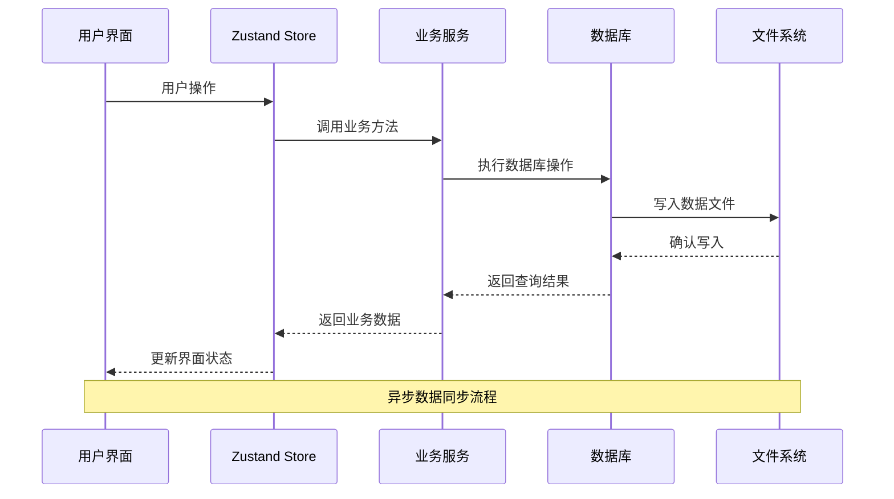

**图表来源**
- [src/services/database.ts:8-16](file://src/services/database.ts#L8-L16)
- [src/services/medicineService.ts:54-95](file://src/services/medicineService.ts#L54-L95)

## 详细组件分析

### 分类管理系统

分类管理是系统的基础功能之一，提供完整的 CRUD 操作和用户友好的界面。

#### 分类数据模型

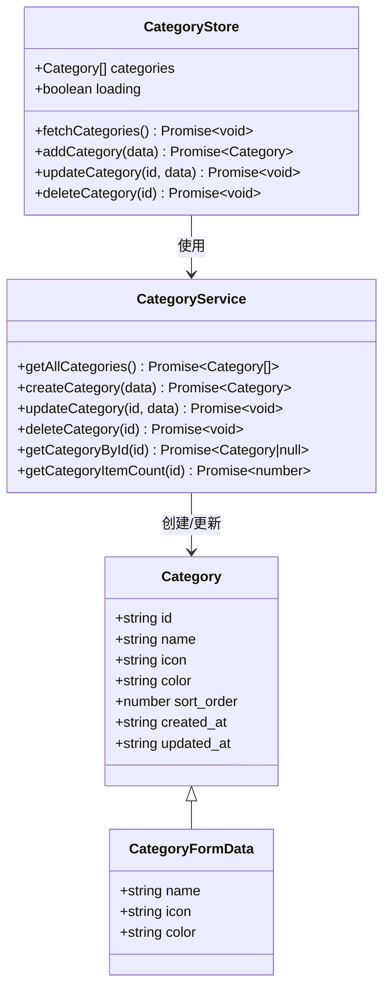

**图表来源**
- [src/types/category.ts:3-17](file://src/types/category.ts#L3-L17)
- [src/services/categoryService.ts:9-58](file://src/services/categoryService.ts#L9-L58)
- [src/stores/useCategoryStore.ts:5-43](file://src/stores/useCategoryStore.ts#L5-L43)

#### 分类管理流程

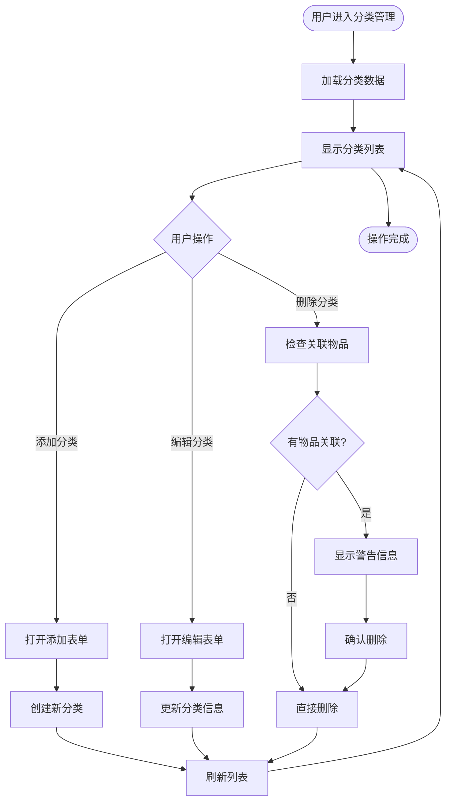

**图表来源**
- [src/routes/Categories.tsx:11-183](file://src/routes/Categories.tsx#L11-L183)
- [src/services/categoryService.ts:44-49](file://src/services/categoryService.ts#L44-L49)

**章节来源**
- [src/routes/Categories.tsx:11-183](file://src/routes/Categories.tsx#L11-L183)
- [src/services/categoryService.ts:9-58](file://src/services/categoryService.ts#L9-L58)
- [src/stores/useCategoryStore.ts:14-43](file://src/stores/useCategoryStore.ts#L14-L43)

### 药品管理系统

**更新** 药品管理系统已简化为固定预设，移除了动态配置功能。

药品管理系统是整个应用的核心功能，提供完整的药品生命周期管理。

#### 药品数据模型

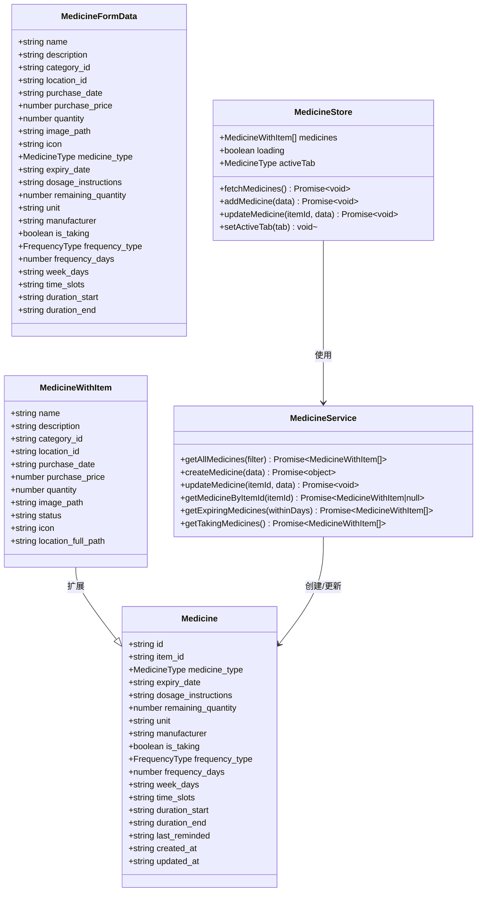

**图表来源**
- [src/types/medicine.ts:22-85](file://src/types/medicine.ts#L22-L85)
- [src/services/medicineService.ts:10-193](file://src/services/medicineService.ts#L10-L193)
- [src/stores/useMedicineStore.ts:5-41](file://src/stores/useMedicineStore.ts#L5-L41)

#### 药品管理工作流程

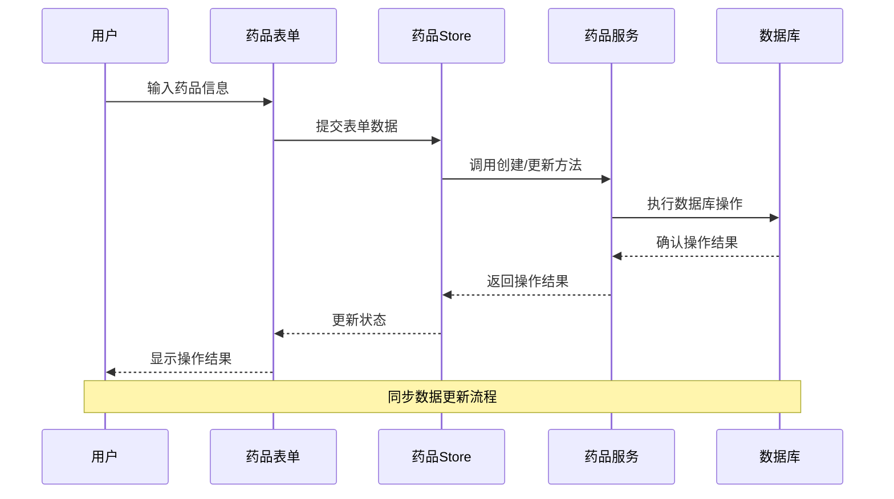

**图表来源**
- [src/routes/MedicineForm.tsx:68-82](file://src/routes/MedicineForm.tsx#L68-L82)
- [src/services/medicineService.ts:54-95](file://src/services/medicineService.ts#L54-L95)

**章节来源**
- [src/types/medicine.ts:3-85](file://src/types/medicine.ts#L3-L85)
- [src/services/medicineService.ts:10-193](file://src/services/medicineService.ts#L10-L193)
- [src/stores/useMedicineStore.ts:15-41](file://src/stores/useMedicineStore.ts#L15-L41)

### 药品展示组件

**更新** 药品展示组件已更新以支持新的固定预设。

药品展示组件提供了直观的药品信息展示和交互功能。

#### 药品卡片组件

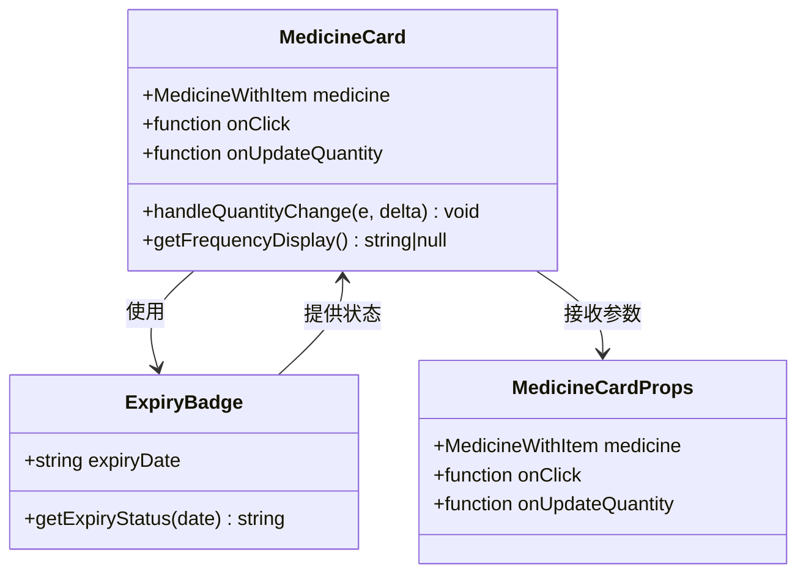

**图表来源**
- [src/components/medicine/MedicineCard.tsx:8-148](file://src/components/medicine/MedicineCard.tsx#L8-L148)

#### 药品列表展示流程

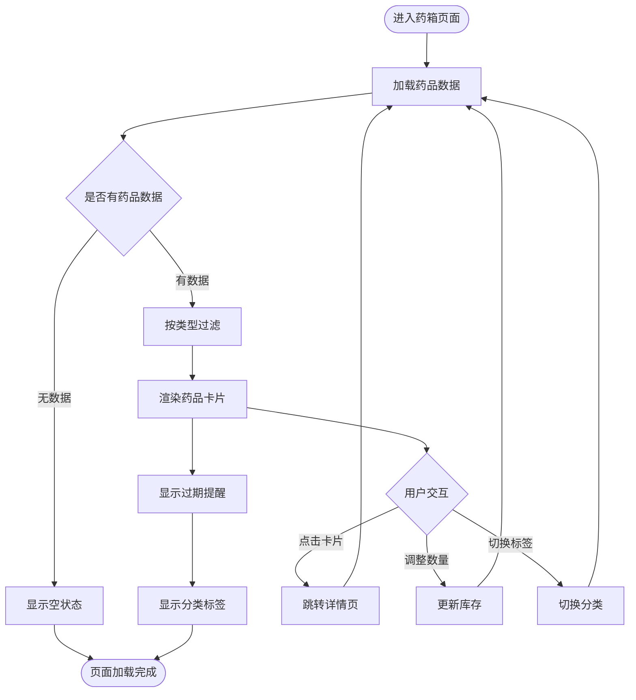

**图表来源**
- [src/routes/MedicineBox.tsx:11-113](file://src/routes/MedicineBox.tsx#L11-L113)
- [src/components/medicine/MedicineCard.tsx:14-148](file://src/components/medicine/MedicineCard.tsx#L14-L148)

**章节来源**
- [src/routes/MedicineBox.tsx:11-113](file://src/routes/MedicineBox.tsx#L11-L113)
- [src/components/medicine/MedicineCard.tsx:14-148](file://src/components/medicine/MedicineCard.tsx#L14-L148)

### 设置管理系统

**更新** 设置管理系统已移除药品类型和单位管理功能。

设置管理系统提供了灵活的配置选项，支持动态修改主题颜色和货币符号。

#### 设置数据结构

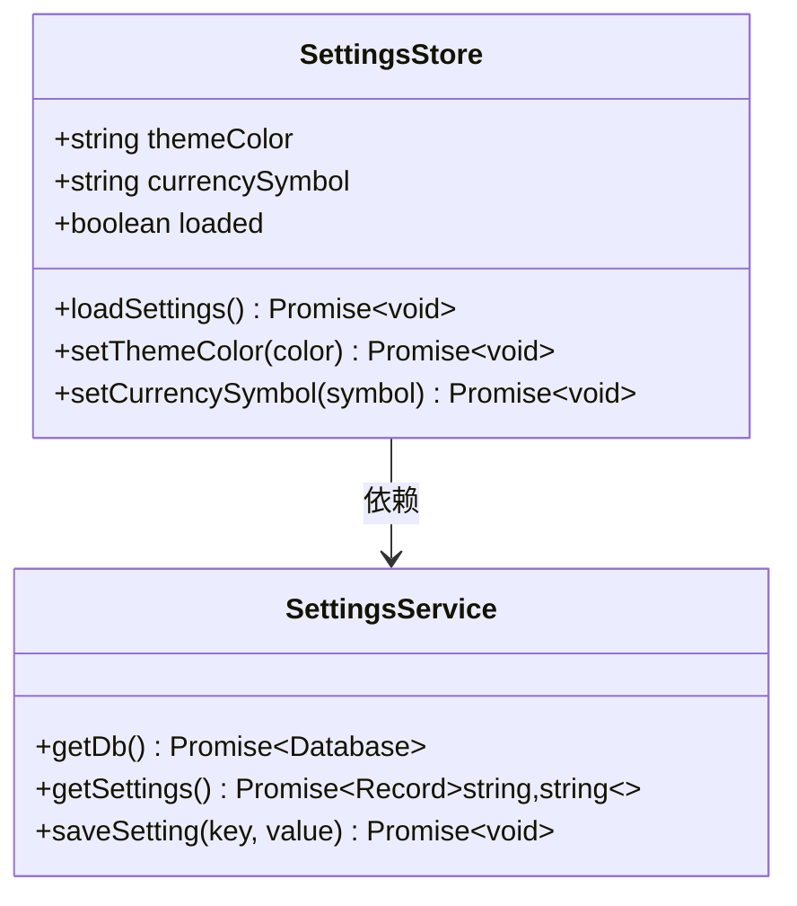

**图表来源**
- [src/stores/useSettingsStore.ts:32-153](file://src/stores/useSettingsStore.ts#L32-L153)

**章节来源**
- [src/stores/useSettingsStore.ts:32-153](file://src/stores/useSettingsStore.ts#L32-L153)

### EmojiPicker 组件

**更新** EmojiPicker 组件已从外部依赖改为内置实现。

EmojiPicker 组件提供了内置的表情符号选择功能，包含丰富的表情符号类别。

#### EmojiPicker 组件结构

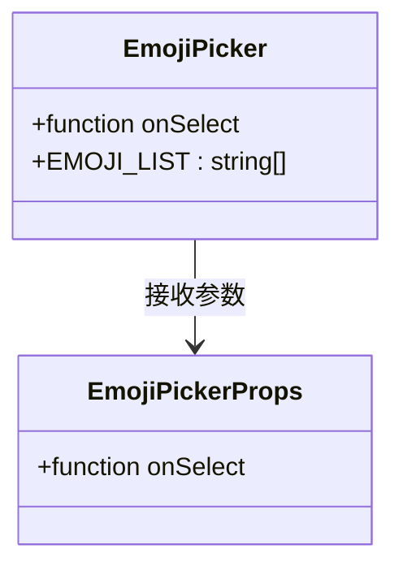

**图表来源**
- [src/components/shared/EmojiPicker.tsx:1-44](file://src/components/shared/EmojiPicker.tsx#L1-L44)

**章节来源**
- [src/components/shared/EmojiPicker.tsx:1-44](file://src/components/shared/EmojiPicker.tsx#L1-L44)

## 依赖关系分析

**更新** 依赖关系已简化，移除了外部 EmojiPicker 依赖。

系统采用模块化设计，各组件之间的依赖关系清晰明确：

```mermaid
graph TB
subgraph "外部依赖"
A[React 18]
B[Tauri]
C[Lucide React]
D[Zustand]
E[@tauri-apps/plugin-sql]
end
subgraph "内部模块"
F[App.tsx]
G[路由系统]
H[状态管理]
I[业务服务]
J[数据访问]
K[UI 组件]
L[EmojiPicker 内置实现]
end
A --> F
B --> F
C --> K
D --> H
E --> J
F --> G
G --> H
H --> I
I --> J
J --> K
K --> L
subgraph "类型定义"
M[category.ts]
N[medicine.ts]
O[item.ts]
P[location.ts]
end
M --> I
N --> I
O --> I
P --> I
```

**图表来源**
- [src/App.tsx:1-53](file://src/App.tsx#L1-L53)
- [src/main.tsx:1-11](file://src/main.tsx#L1-L11)

### 数据库依赖图

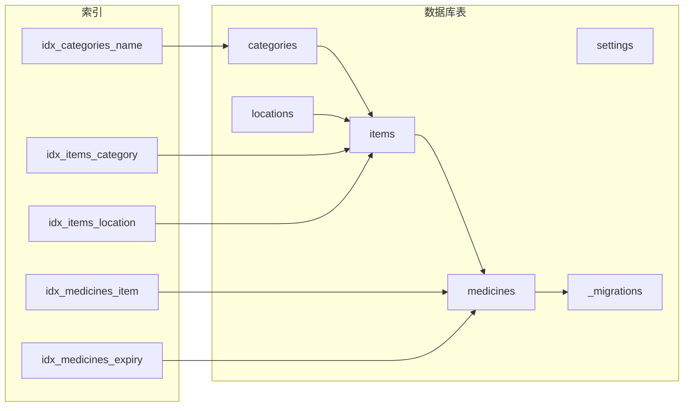

**图表来源**
- [src/services/database.ts:118-131](file://src/services/database.ts#L118-L131)

**章节来源**
- [src/services/database.ts:18-53](file://src/services/database.ts#L18-L53)
- [src/services/database.ts:118-131](file://src/services/database.ts#L118-L131)

## 性能考虑

### 数据库优化策略

系统采用了多项数据库优化技术来确保良好的性能表现：

1. **索引优化**：为常用查询字段建立索引，包括分类、位置、状态、有效期等
2. **查询优化**：使用参数化查询防止 SQL 注入，优化复杂联表查询
3. **事务管理**：合理使用事务确保数据一致性
4. **连接池**：复用数据库连接减少开销

### 前端性能优化

1. **状态管理**：使用 Zustand 减少不必要的重渲染
2. **懒加载**：按需加载路由组件
3. **虚拟滚动**：对于大量数据使用虚拟滚动技术
4. **缓存策略**：合理使用浏览器缓存和内存缓存

### 移动端适配

系统针对移动端进行了专门优化：

1. **响应式设计**：适配不同屏幕尺寸
2. **触摸优化**：按钮大小和间距适合触摸操作
3. **性能优化**：减少内存占用和 CPU 使用
4. **电池优化**：避免后台频繁操作

## 故障排除指南

### 常见问题及解决方案

#### 数据库连接问题

**症状**：应用启动时数据库连接失败

**可能原因**：
1. 数据库文件损坏
2. 权限不足
3. 路径错误

**解决步骤**：
1. 检查数据库文件是否存在
2. 验证应用具有读写权限
3. 重新初始化数据库

#### 数据同步问题

**症状**：界面显示与实际数据不一致

**解决步骤**：
1. 强制刷新页面
2. 检查网络连接（如果使用远程数据库）
3. 清除浏览器缓存

#### 性能问题

**症状**：应用运行缓慢或卡顿

**解决步骤**：
1. 检查数据库索引是否完整
2. 优化复杂查询
3. 实施分页加载
4. 减少不必要的状态更新

**章节来源**
- [src/services/database.ts:8-16](file://src/services/database.ts#L8-L16)
- [src/services/database.ts:18-53](file://src/services/database.ts#L18-L53)

### 开发调试技巧

1. **启用开发者工具**：使用浏览器开发者工具监控网络请求
2. **日志记录**：利用应用内置的日志系统追踪问题
3. **状态检查**：通过 Redux DevTools 或类似工具检查状态变化
4. **数据库调试**：使用 SQLite 浏览器检查数据完整性

## 结论

药品类型与单位管理系统经过简化重构后，成为一个更加专注和高效的桌面应用程序。系统采用现代化的技术栈和设计模式，提供了良好的用户体验和可靠的性能表现。

### 主要优势

1. **模块化设计**：清晰的分层架构便于维护和扩展
2. **数据完整性**：完善的数据库设计和约束确保数据质量
3. **用户友好**：直观的界面设计和流畅的交互体验
4. **性能优化**：多层面的性能优化确保应用响应迅速
5. **跨平台支持**：基于 Tauri 的跨平台部署能力
6. **简化配置**：固定的预设减少了用户的学习成本

### 技术亮点

- **SQLite 集成**：本地数据库存储确保数据安全和离线可用性
- **状态管理**：Zustand 提供轻量级但强大的状态管理
- **类型安全**：完整的 TypeScript 类型定义确保代码质量
- **响应式设计**：适配多种设备和屏幕尺寸
- **内置组件**：EmojiPicker 等组件的内置实现减少了外部依赖

### 发展建议

1. **功能扩展**：可以考虑添加药品相互作用检查、处方管理等功能
2. **集成能力**：支持与其他健康应用的数据交换
3. **AI 辅助**：利用机器学习提供智能提醒和建议
4. **云端同步**：在保证隐私的前提下提供云端备份功能

该系统为家庭药箱管理提供了一个坚实的技术基础，经过简化后的架构更加清晰，能够满足用户的日常需求并具备良好的扩展潜力。