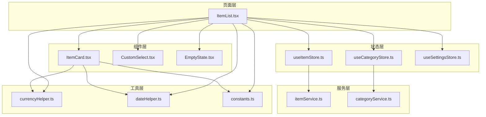
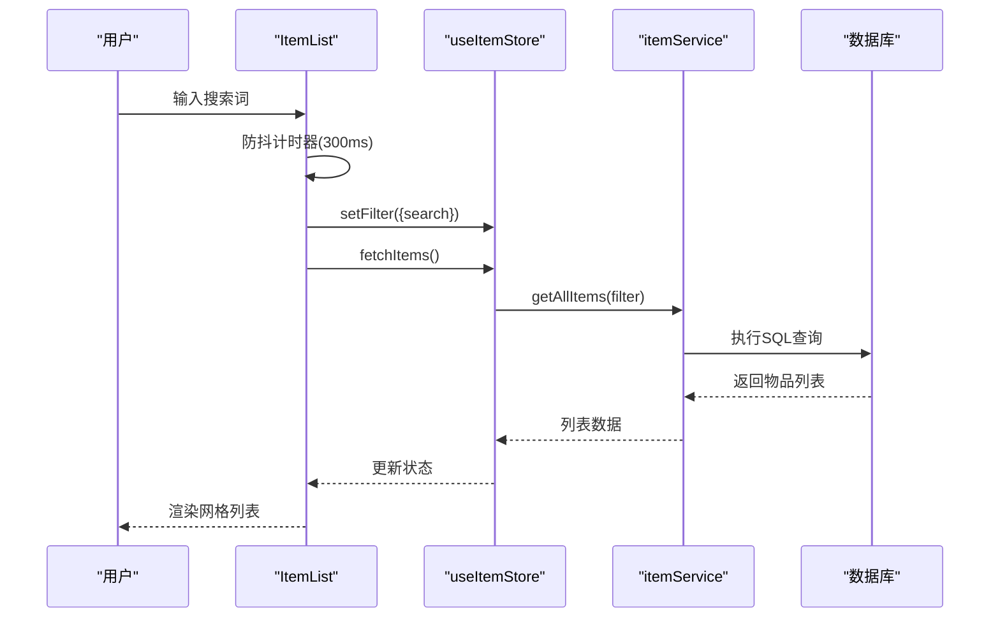
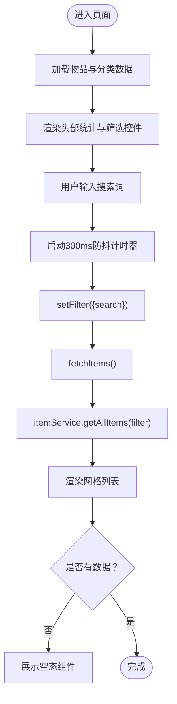
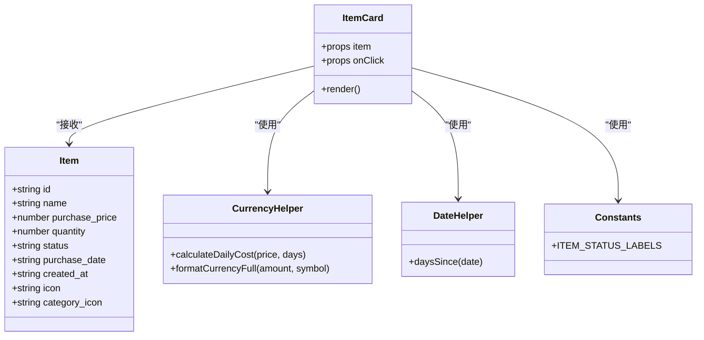
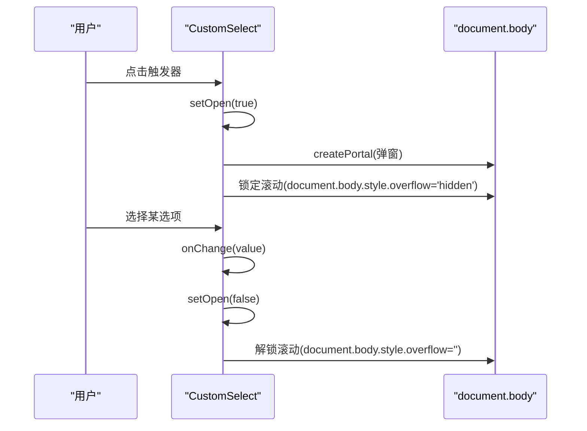
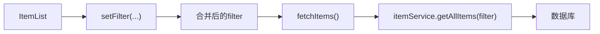
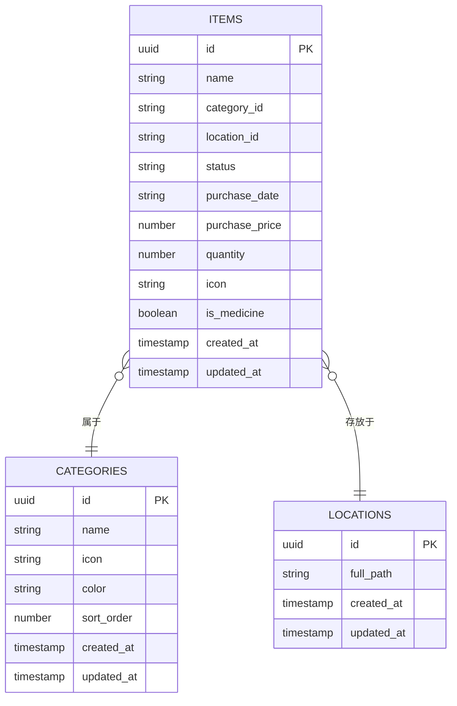
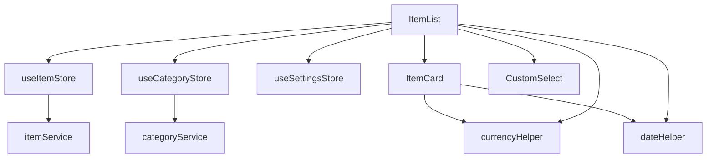

# 物品列表管理

<cite>
**本文引用的文件**
- [ItemList.tsx](file://src/routes/ItemList.tsx)
- [ItemCard.tsx](file://src/components/items/ItemCard.tsx)
- [useItemStore.ts](file://src/stores/useItemStore.ts)
- [itemService.ts](file://src/services/itemService.ts)
- [item.ts](file://src/types/item.ts)
- [currencyHelper.ts](file://src/utils/currencyHelper.ts)
- [constants.ts](file://src/utils/constants.ts)
- [CustomSelect.tsx](file://src/components/shared/CustomSelect.tsx)
- [useCategoryStore.ts](file://src/stores/useCategoryStore.ts)
- [categoryService.ts](file://src/services/categoryService.ts)
- [dateHelper.ts](file://src/utils/dateHelper.ts)
- [EmptyState.tsx](file://src/components/shared/EmptyState.tsx)
- [useSettingsStore.ts](file://src/stores/useSettingsStore.ts)
</cite>

## 目录
1. [简介](#简介)
2. [项目结构](#项目结构)
3. [核心组件](#核心组件)
4. [架构总览](#架构总览)
5. [详细组件分析](#详细组件分析)
6. [依赖关系分析](#依赖关系分析)
7. [性能与虚拟化策略](#性能与虚拟化策略)
8. [故障排查指南](#故障排查指南)
9. [结论](#结论)
10. [附录：扩展指南](#附录扩展指南)

## 简介
本文件围绕“物品列表管理”功能进行系统性技术文档整理，重点覆盖：
- 物品列表页面的网格布局设计与响应式适配
- 搜索功能的防抖实现机制（300ms 延迟）
- 状态筛选（全部、服役中、已闲置、已处置）与分类筛选的芯片式交互设计
- 物品统计概览的计算逻辑（总资产值、日均成本、状态分布）
- 性能优化策略（懒加载、滚动优化等）
- 扩展新筛选条件与排序选项的实践路径

## 项目结构
该功能位于前端路由层与组件层之间，采用“页面 + 组件 + 状态 + 服务”的分层组织方式：
- 页面层：ItemList 负责渲染列表、处理筛选与统计
- 组件层：ItemCard 展示单个物品卡片；CustomSelect 提供移动端友好的下拉选择
- 状态层：useItemStore 与 useCategoryStore 管理数据与过滤条件
- 服务层：itemService 与 categoryService 封装数据库访问
- 工具层：currencyHelper、dateHelper、constants 提供格式化与常量定义

图表来源
- [ItemList.tsx:19-184](file://src/routes/ItemList.tsx#L19-L184)
- [ItemCard.tsx:27-93](file://src/components/items/ItemCard.tsx#L27-L93)
- [useItemStore.ts:23-52](file://src/stores/useItemStore.ts#L23-L52)
- [useCategoryStore.ts:14-43](file://src/stores/useCategoryStore.ts#L14-L43)
- [useSettingsStore.ts:14-55](file://src/stores/useSettingsStore.ts#L14-L55)
- [itemService.ts:10-44](file://src/services/itemService.ts#L10-L44)
- [categoryService.ts:9-18](file://src/services/categoryService.ts#L9-L18)
- [currencyHelper.ts:1-17](file://src/utils/currencyHelper.ts#L1-L17)
- [dateHelper.ts:1-52](file://src/utils/dateHelper.ts#L1-L52)
- [constants.ts:22-27](file://src/utils/constants.ts#L22-L27)

章节来源
- [ItemList.tsx:19-184](file://src/routes/ItemList.tsx#L19-L184)
- [useItemStore.ts:23-52](file://src/stores/useItemStore.ts#L23-L52)
- [useCategoryStore.ts:14-43](file://src/stores/useCategoryStore.ts#L14-L43)
- [itemService.ts:10-44](file://src/services/itemService.ts#L10-L44)
- [currencyHelper.ts:1-17](file://src/utils/currencyHelper.ts#L1-L17)
- [dateHelper.ts:1-52](file://src/utils/dateHelper.ts#L1-L52)
- [constants.ts:22-27](file://src/utils/constants.ts#L22-L27)

## 核心组件
- 物品列表页（ItemList）：负责渲染统计概览、搜索与筛选控件、分类芯片、网格列表以及空态展示；内置 300ms 防抖搜索与状态/分类筛选联动。
- 物品卡片（ItemCard）：展示物品图标、状态徽标、名称、总价与使用天数、日均成本条；支持优先级图标渲染。
- 状态存储（useItemStore/useCategoryStore）：统一管理过滤条件、加载状态与数据获取；提供 setFilter 接口以合并筛选参数。
- 数据服务（itemService/categoryService）：封装 SQL 查询与更新，支持按分类、位置、状态、关键词搜索。
- 工具函数（currencyHelper/dateHelper/constants）：提供货币格式化、日均成本计算、日期差计算与状态标签映射。

章节来源
- [ItemList.tsx:19-184](file://src/routes/ItemList.tsx#L19-L184)
- [ItemCard.tsx:27-93](file://src/components/items/ItemCard.tsx#L27-L93)
- [useItemStore.ts:23-52](file://src/stores/useItemStore.ts#L23-L52)
- [useCategoryStore.ts:14-43](file://src/stores/useCategoryStore.ts#L14-L43)
- [itemService.ts:10-44](file://src/services/itemService.ts#L10-L44)
- [currencyHelper.ts:1-17](file://src/utils/currencyHelper.ts#L1-L17)
- [dateHelper.ts:26-28](file://src/utils/dateHelper.ts#L26-L28)
- [constants.ts:22-27](file://src/utils/constants.ts#L22-L27)

## 架构总览
ItemList 作为页面入口，通过 useItemStore 与 useCategoryStore 获取数据与过滤条件，调用 itemService/categoryService 进行数据库查询；ItemCard 负责单个物品的 UI 渲染与成本计算；currencyHelper/dateHelper 提供格式化与成本算法；CustomSelect 提供移动端弹出式选择器；EmptyState 在无数据时提供占位提示。

图表来源
- [ItemList.tsx:24-38](file://src/routes/ItemList.tsx#L24-L38)
- [useItemStore.ts:28-32](file://src/stores/useItemStore.ts#L28-L32)
- [itemService.ts:10-44](file://src/services/itemService.ts#L10-L44)

## 详细组件分析

### 物品列表页（ItemList）
- 网格布局与响应式适配
  - 使用 CSS Grid 实现自适应列数：在小屏为 2 列，中屏 3 列，大屏 4 列，保证在不同设备上的良好可读性与密度。
- 搜索与防抖
  - 搜索输入变更触发 300ms 定时器，清理旧定时器避免重复请求；仅在计时结束后设置过滤条件并重新拉取数据。
- 状态筛选
  - 使用自定义下拉选择器（CustomSelect）提供“全部/服役中/已闲置/已处置”，切换时更新过滤条件并刷新列表。
- 分类筛选（芯片式交互）
  - 顶部水平滚动区域展示分类芯片，点击切换过滤；未选中任何分类时显示“全部”高亮。
- 统计概览
  - 计算“资产总额”（仅服役中物品的总价之和）、“日均成本”（基于购买日期或创建日期计算天数，再按日均成本公式计算）、状态分布（服役中、已闲置、已处置数量）。
- 加载与空态
  - 加载中显示旋转指示器；无数据时展示 EmptyState 占位并引导添加物品。

图表来源
- [ItemList.tsx:27-38](file://src/routes/ItemList.tsx#L27-L38)
- [ItemList.tsx:51-68](file://src/routes/ItemList.tsx#L51-L68)
- [ItemList.tsx:154-181](file://src/routes/ItemList.tsx#L154-L181)
- [EmptyState.tsx:10-21](file://src/components/shared/EmptyState.tsx#L10-L21)

章节来源
- [ItemList.tsx:19-184](file://src/routes/ItemList.tsx#L19-L184)
- [EmptyState.tsx:10-21](file://src/components/shared/EmptyState.tsx#L10-L21)

### 物品卡片（ItemCard）
- 图标与状态
  - 支持优先级：物品自定义图标 > 分类映射图标 > 默认包裹箱图标；状态徽标根据状态动态着色。
- 名称与价格
  - 显示物品名称与总价（单价×数量），并在有使用天数时显示“已使用 X 天”。
- 日均成本
  - 基于购买日期或创建日期计算天数，调用日均成本算法生成每日成本条，便于直观对比持有成本。

图表来源
- [ItemCard.tsx:27-93](file://src/components/items/ItemCard.tsx#L27-L93)
- [item.ts:5-29](file://src/types/item.ts#L5-L29)
- [currencyHelper.ts:13-16](file://src/utils/currencyHelper.ts#L13-L16)
- [dateHelper.ts:26-28](file://src/utils/dateHelper.ts#L26-L28)
- [constants.ts:22-27](file://src/utils/constants.ts#L22-L27)

章节来源
- [ItemCard.tsx:27-93](file://src/components/items/ItemCard.tsx#L27-L93)
- [item.ts:5-29](file://src/types/item.ts#L5-L29)
- [currencyHelper.ts:13-16](file://src/utils/currencyHelper.ts#L13-L16)
- [dateHelper.ts:26-28](file://src/utils/dateHelper.ts#L26-L28)
- [constants.ts:22-27](file://src/utils/constants.ts#L22-L27)

### 自定义选择器（CustomSelect）
- 移动端弹出式交互
  - 打开时锁定页面滚动，使用 Portal 将面板挂载到 body，底部弹出动画与半透明遮罩提升可用性。
- 选项高亮与确认
  - 当前选中项高亮并显示勾选图标；点击外部区域或取消按钮可关闭面板。

图表来源
- [CustomSelect.tsx:17-108](file://src/components/shared/CustomSelect.tsx#L17-L108)

章节来源
- [CustomSelect.tsx:17-108](file://src/components/shared/CustomSelect.tsx#L17-L108)

### 状态与分类存储（useItemStore/useCategoryStore）
- 过滤条件合并
  - setFilter 支持部分更新，避免覆盖已有筛选；fetchAllItems 会将当前 filter 传入服务层执行查询。
- 分类数据管理
  - useCategoryStore 提供分类列表与 CRUD 操作，用于渲染分类芯片与筛选。

图表来源
- [useItemStore.ts:49-51](file://src/stores/useItemStore.ts#L49-L51)
- [useItemStore.ts:28-32](file://src/stores/useItemStore.ts#L28-L32)
- [itemService.ts:10-44](file://src/services/itemService.ts#L10-L44)

章节来源
- [useItemStore.ts:23-52](file://src/stores/useItemStore.ts#L23-L52)
- [useCategoryStore.ts:14-43](file://src/stores/useCategoryStore.ts#L14-L43)
- [itemService.ts:10-44](file://src/services/itemService.ts#L10-L44)

### 数据服务（itemService/categoryService）
- 动态 SQL 构建
  - 支持按分类、位置、状态、关键词进行条件拼接；最终按创建时间倒序返回。
- 增删改查
  - 提供创建、更新、删除与详情查询；删除时对关联数据进行处理（如药品级联删除）。

图表来源
- [itemService.ts:14-43](file://src/services/itemService.ts#L14-L43)
- [categoryService.ts:9-18](file://src/services/categoryService.ts#L9-L18)

章节来源
- [itemService.ts:10-44](file://src/services/itemService.ts#L10-L44)
- [categoryService.ts:9-18](file://src/services/categoryService.ts#L9-L18)

## 依赖关系分析
- 组件耦合
  - ItemList 依赖 useItemStore/useCategoryStore/useSettingsStore，组合 ItemCard、CustomSelect、EmptyState；耦合度低，职责清晰。
- 数据流
  - UI -> Store -> Service -> DB 的单向数据流，过滤条件通过 setFilter 合并，避免重复请求。
- 外部依赖
  - dayjs 用于日期计算；lucide-react 图标库；Zustand 状态管理；SQLite 数据库（通过服务层抽象）。

图表来源
- [ItemList.tsx:19-184](file://src/routes/ItemList.tsx#L19-L184)
- [useItemStore.ts:23-52](file://src/stores/useItemStore.ts#L23-L52)
- [useCategoryStore.ts:14-43](file://src/stores/useCategoryStore.ts#L14-L43)
- [useSettingsStore.ts:14-55](file://src/stores/useSettingsStore.ts#L14-L55)
- [ItemCard.tsx:27-93](file://src/components/items/ItemCard.tsx#L27-L93)
- [currencyHelper.ts:1-17](file://src/utils/currencyHelper.ts#L1-L17)
- [dateHelper.ts:1-52](file://src/utils/dateHelper.ts#L1-L52)

章节来源
- [ItemList.tsx:19-184](file://src/routes/ItemList.tsx#L19-L184)
- [useItemStore.ts:23-52](file://src/stores/useItemStore.ts#L23-L52)
- [useCategoryStore.ts:14-43](file://src/stores/useCategoryStore.ts#L14-L43)
- [useSettingsStore.ts:14-55](file://src/stores/useSettingsStore.ts#L14-L55)
- [ItemCard.tsx:27-93](file://src/components/items/ItemCard.tsx#L27-L93)
- [currencyHelper.ts:1-17](file://src/utils/currencyHelper.ts#L1-L17)
- [dateHelper.ts:1-52](file://src/utils/dateHelper.ts#L1-L52)

## 性能与虚拟化策略
- 搜索防抖（300ms）
  - 通过定时器在用户停止输入后统一触发过滤与刷新，减少不必要的数据库查询与重渲染。
- 懒加载与滚动优化
  - 当前实现为一次性渲染所有卡片。对于大规模数据集，建议引入虚拟化方案（如 react-window 或 @tanstack/react-virtual）以降低 DOM 节点数量与重排成本。
- 列表渲染优化
  - 使用 useMemo 缓存统计结果，避免每次渲染都重新计算；使用 key 唯一标识列表项，确保更新时最小化重渲染。
- 数据库查询优化
  - itemService 已按 created_at 倒序返回，适合分页场景；若未来需要分页，可在 SQL 中加入 LIMIT/OFFSET 并在 UI 中实现“加载更多”。

章节来源
- [ItemList.tsx:32-38](file://src/routes/ItemList.tsx#L32-L38)
- [ItemList.tsx:51-68](file://src/routes/ItemList.tsx#L51-L68)
- [itemService.ts:42](file://src/services/itemService.ts#L42)

## 故障排查指南
- 搜索无效或频繁刷新
  - 检查防抖定时器是否正确清理；确认 setFilter 是否被调用且 filter 参数正确传递至服务层。
- 统计数值异常
  - 确认“资产总额”仅统计“服役中”物品；日均成本需确保购买日期或创建日期有效且天数大于 0。
- 分类筛选不生效
  - 检查 useItemStore.setFilter 是否合并了 category_id；确认 itemService 的 SQL 条件拼接顺序与参数绑定。
- 空态未显示
  - 确认 loading 状态与 items 数组长度判断逻辑；EmptyState 组件是否正确渲染。
- 移动端选择器无法关闭
  - 检查 CustomSelect 的 Portal 挂载与事件冒泡；确认点击外部区域与取消按钮的关闭逻辑。

章节来源
- [ItemList.tsx:24-38](file://src/routes/ItemList.tsx#L24-L38)
- [ItemList.tsx:51-68](file://src/routes/ItemList.tsx#L51-L68)
- [useItemStore.ts:49-51](file://src/stores/useItemStore.ts#L49-L51)
- [itemService.ts:25-40](file://src/services/itemService.ts#L25-L40)
- [EmptyState.tsx:10-21](file://src/components/shared/EmptyState.tsx#L10-L21)
- [CustomSelect.tsx:52-105](file://src/components/shared/CustomSelect.tsx#L52-L105)

## 结论
该物品列表管理功能以清晰的分层架构实现了搜索、筛选、统计与展示的完整闭环。通过防抖搜索、状态与分类筛选、芯片式交互与网格布局，提供了良好的用户体验。建议在未来引入虚拟化与分页以进一步提升大数据量下的性能表现。

## 附录：扩展指南

### 扩展新的筛选条件
- 新增字段
  - 在类型定义中扩展 ItemFilter 与 ItemFormData 字段；在 useItemStore.setFilter 中支持新键；在 itemService.getAllItems 中增加 SQL 条件分支。
- 示例路径
  - [useItemStore.ts:5-10](file://src/stores/useItemStore.ts#L5-L10)
  - [itemService.ts:10-44](file://src/services/itemService.ts#L10-L44)

### 扩展排序选项
- 当前排序
  - 按 created_at 倒序；可通过在 filter 中新增 sort_by 与 order 字段控制。
- 实施步骤
  - 在 ItemList 中添加排序选择器；将排序参数合并到 setFilter；在 itemService 中拼接 ORDER BY 子句。
- 示例路径
  - [itemService.ts:42](file://src/services/itemService.ts#L42)
  - [ItemList.tsx:40-49](file://src/routes/ItemList.tsx#L40-L49)

### 扩展新的状态或分类
- 状态扩展
  - 在类型与常量中新增状态枚举与标签映射；在 UI 中添加对应筛选项与徽标样式。
- 分类扩展
  - 在 useCategoryStore 与 categoryService 中维护分类列表；在 UI 中渲染分类芯片。
- 示例路径
  - [item.ts:3](file://src/types/item.ts#L3)
  - [constants.ts:22-27](file://src/utils/constants.ts#L22-L27)
  - [useCategoryStore.ts:14-43](file://src/stores/useCategoryStore.ts#L14-L43)
  - [categoryService.ts:9-18](file://src/services/categoryService.ts#L9-L18)