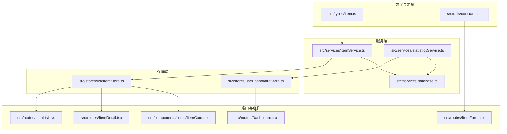
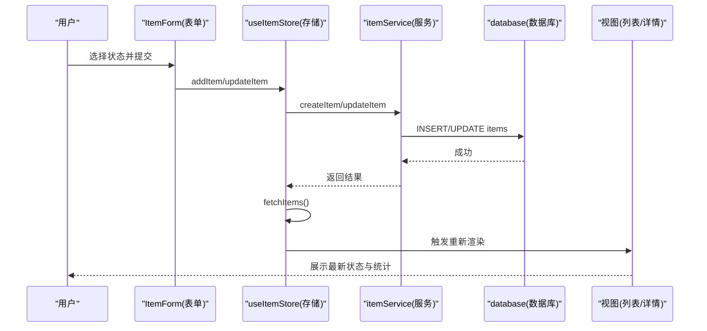
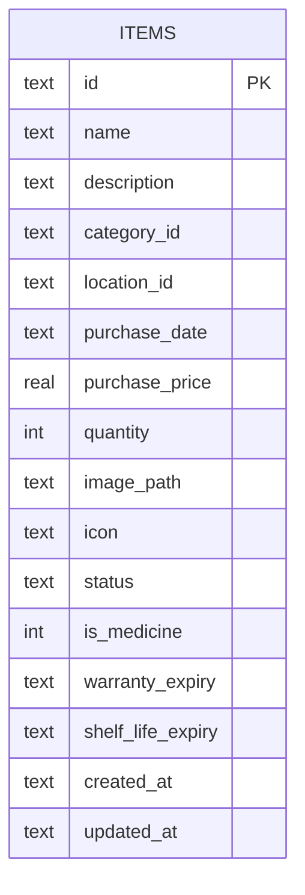
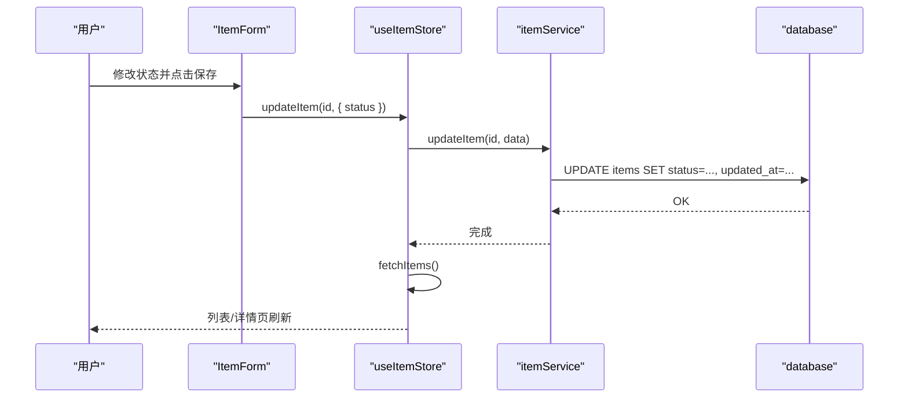
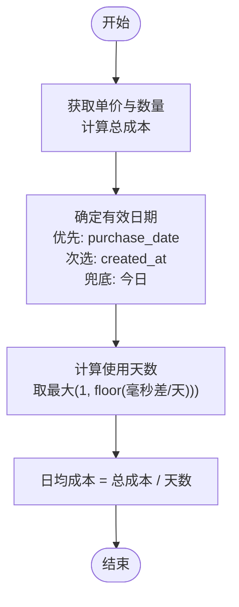
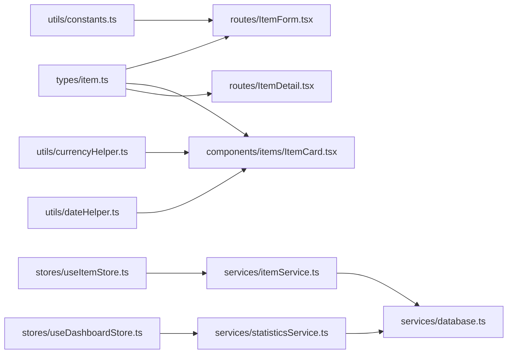

# 物品状态管理

<cite>
**本文引用的文件**
- [src/types/item.ts](file://src/types/item.ts)
- [src/utils/constants.ts](file://src/utils/constants.ts)
- [src/utils/currencyHelper.ts](file://src/utils/currencyHelper.ts)
- [src/utils/dateHelper.ts](file://src/utils/dateHelper.ts)
- [src/services/itemService.ts](file://src/services/itemService.ts)
- [src/services/statisticsService.ts](file://src/services/statisticsService.ts)
- [src/services/database.ts](file://src/services/database.ts)
- [src/stores/useItemStore.ts](file://src/stores/useItemStore.ts)
- [src/stores/useDashboardStore.ts](file://src/stores/useDashboardStore.ts)
- [src/routes/ItemList.tsx](file://src/routes/ItemList.tsx)
- [src/routes/ItemDetail.tsx](file://src/routes/ItemDetail.tsx)
- [src/routes/ItemForm.tsx](file://src/routes/ItemForm.tsx)
- [src/components/items/ItemCard.tsx](file://src/components/items/ItemCard.tsx)
- [src/routes/Dashboard.tsx](file://src/routes/Dashboard.tsx)
</cite>

## 目录
1. [简介](#简介)
2. [项目结构](#项目结构)
3. [核心组件](#核心组件)
4. [架构总览](#架构总览)
5. [详细组件分析](#详细组件分析)
6. [依赖关系分析](#依赖关系分析)
7. [性能考量](#性能考量)
8. [故障排查指南](#故障排查指南)
9. [结论](#结论)
10. [附录](#附录)

## 简介
本文件系统性阐述“物品状态管理”功能的设计与实现，覆盖状态枚举与数据模型、状态流转机制、状态变更的业务逻辑与影响、状态历史记录与审计、状态相关的计算逻辑（日均成本、资产价值统计、状态分布分析），并提供扩展新状态类型的实践指导。

## 项目结构
围绕物品状态管理的关键文件组织如下：
- 类型与常量：定义状态枚举、状态标签映射等
- 服务层：封装数据库访问、状态过滤、统计查询
- 存储层：集中管理状态变更后的数据刷新
- 路由与组件：负责用户交互、表单提交、卡片展示与统计展示
- 工具函数：提供货币与日期计算辅助

图表来源
- [src/types/item.ts:1-46](file://src/types/item.ts#L1-L46)
- [src/utils/constants.ts:1-40](file://src/utils/constants.ts#L1-L40)
- [src/services/itemService.ts:1-127](file://src/services/itemService.ts#L1-L127)
- [src/services/statisticsService.ts:1-52](file://src/services/statisticsService.ts#L1-L52)
- [src/services/database.ts:1-171](file://src/services/database.ts#L1-L171)
- [src/stores/useItemStore.ts:1-53](file://src/stores/useItemStore.ts#L1-L53)
- [src/stores/useDashboardStore.ts:1-34](file://src/stores/useDashboardStore.ts#L1-L34)
- [src/routes/ItemList.tsx:40-68](file://src/routes/ItemList.tsx#L40-L68)
- [src/routes/ItemDetail.tsx:40-98](file://src/routes/ItemDetail.tsx#L40-L98)
- [src/routes/ItemForm.tsx:1-263](file://src/routes/ItemForm.tsx#L1-L263)
- [src/components/items/ItemCard.tsx:1-93](file://src/components/items/ItemCard.tsx#L1-L93)
- [src/routes/Dashboard.tsx:1-235](file://src/routes/Dashboard.tsx#L1-L235)

章节来源
- [src/types/item.ts:1-46](file://src/types/item.ts#L1-L46)
- [src/utils/constants.ts:1-40](file://src/utils/constants.ts#L1-L40)
- [src/services/database.ts:88-103](file://src/services/database.ts#L88-L103)

## 核心组件
- 状态枚举与模型
  - 状态枚举：active、archived、disposed
  - 数据模型：包含状态字段、购买信息、时间戳等
- 常量与标签
  - 状态标签映射用于界面显示
- 服务层
  - 物品查询与更新（含状态字段）
  - 统计查询（仅统计 active 状态的物品）
- 存储层
  - 集中处理状态变更后的数据刷新
- 路由与组件
  - 表单中支持状态选择
  - 列表与详情页展示状态与日均成本
  - 仪表盘聚合统计

章节来源
- [src/types/item.ts:3-22](file://src/types/item.ts#L3-L22)
- [src/utils/constants.ts:22-27](file://src/utils/constants.ts#L22-L27)
- [src/services/itemService.ts:10-44](file://src/services/itemService.ts#L10-L44)
- [src/services/statisticsService.ts:4-26](file://src/services/statisticsService.ts#L4-L26)
- [src/stores/useItemStore.ts:23-52](file://src/stores/useItemStore.ts#L23-L52)
- [src/routes/ItemForm.tsx:235-248](file://src/routes/ItemForm.tsx#L235-L248)
- [src/components/items/ItemCard.tsx:55-65](file://src/components/items/ItemCard.tsx#L55-L65)
- [src/routes/ItemList.tsx:51-68](file://src/routes/ItemList.tsx#L51-L68)

## 架构总览
状态管理在前端通过表单与路由组件驱动，服务层负责持久化与统计，存储层统一刷新视图；数据库层面以 SQLite 为主，迁移脚本定义了初始表结构及索引。

图表来源
- [src/routes/ItemForm.tsx:67-81](file://src/routes/ItemForm.tsx#L67-L81)
- [src/stores/useItemStore.ts:34-47](file://src/stores/useItemStore.ts#L34-L47)
- [src/services/itemService.ts:60-87](file://src/services/itemService.ts#L60-L87)
- [src/services/database.ts:88-103](file://src/services/database.ts#L88-L103)
- [src/stores/useItemStore.ts:28-32](file://src/stores/useItemStore.ts#L28-L32)

## 详细组件分析

### 数据模型与状态字段
- 状态字段定义
  - 字段名：status
  - 取值范围：active | archived | disposed
  - 默认值：active
- 时间戳与扩展字段
  - created_at、updated_at 记录创建与更新时间
  - 扩展字段：warranty_expiry、shelf_life_expiry（与状态管理协同）
- 表结构与索引
  - items 表包含状态字段与索引 idx_items_status，便于按状态筛选

图表来源
- [src/services/database.ts:88-103](file://src/services/database.ts#L88-L103)

章节来源
- [src/types/item.ts:3-22](file://src/types/item.ts#L3-L22)
- [src/services/database.ts:88-103](file://src/services/database.ts#L88-L103)

### 状态枚举与标签映射
- 状态枚举：在类型文件中定义
- 标签映射：用于界面展示“服役中/已闲置/已处置”

章节来源
- [src/types/item.ts:3](file://src/types/item.ts#L3)
- [src/utils/constants.ts:22-27](file://src/utils/constants.ts#L22-L27)

### 状态变更流程与业务逻辑
- 表单提交
  - ItemForm 支持状态选择，提交时调用存储层的 addItem 或 updateItem
- 存储层刷新
  - 更新后统一调用 fetchItems，确保视图同步
- 列表与详情页
  - 列表页支持按状态过滤与统计
  - 详情页展示状态与日均成本

图表来源
- [src/routes/ItemForm.tsx:67-81](file://src/routes/ItemForm.tsx#L67-L81)
- [src/stores/useItemStore.ts:39-42](file://src/stores/useItemStore.ts#L39-L42)
- [src/services/itemService.ts:89-119](file://src/services/itemService.ts#L89-L119)
- [src/services/database.ts:88-103](file://src/services/database.ts#L88-L103)

章节来源
- [src/routes/ItemForm.tsx:235-248](file://src/routes/ItemForm.tsx#L235-L248)
- [src/stores/useItemStore.ts:39-42](file://src/stores/useItemStore.ts#L39-L42)
- [src/services/itemService.ts:89-119](file://src/services/itemService.ts#L89-L119)

### 状态转换规则
- 当前实现
  - 状态字段通过表单直接更新，未在前端实现显式的“状态机”或转换校验
  - 查询接口支持按 status 过滤
- 建议
  - 在存储层或服务层增加状态转换校验，限制非法转换
  - 引入状态历史记录表，记录每次状态变更的时间、操作者、原因等

章节来源
- [src/services/itemService.ts:33-36](file://src/services/itemService.ts#L33-L36)
- [src/routes/ItemList.tsx:40-44](file://src/routes/ItemList.tsx#L40-L44)

### 状态历史记录与审计
- 现状
  - 数据库未见专门的状态历史表
  - 仅通过 items 的 updated_at 记录最近一次更新时间
- 建议
  - 新增 item_status_logs 表，字段建议包含：item_id、from_status、to_status、changed_at、changed_by、reason 等
  - 在状态变更时写入历史记录，并在 UI 提供“变更历史”查看

章节来源
- [src/services/database.ts:88-103](file://src/services/database.ts#L88-L103)

### 状态相关的计算逻辑
- 日均成本
  - 计算公式：日均成本 = 总成本 / 使用天数
  - 使用天数取值策略：优先使用 purchase_date，其次 created_at，最后当天
- 资产价值统计
  - 仅统计 status = 'active' 的物品
  - 总价值 = Σ(单价 × 数量)
- 状态分布分析
  - 仪表盘统计中，按分类汇总 active 状态物品的价值占比

图表来源
- [src/routes/ItemList.tsx:60-66](file://src/routes/ItemList.tsx#L60-L66)
- [src/components/items/ItemCard.tsx:30-35](file://src/components/items/ItemCard.tsx#L30-L35)
- [src/utils/currencyHelper.ts:13-16](file://src/utils/currencyHelper.ts#L13-L16)
- [src/utils/dateHelper.ts:26-28](file://src/utils/dateHelper.ts#L26-L28)

章节来源
- [src/routes/ItemList.tsx:51-68](file://src/routes/ItemList.tsx#L51-L68)
- [src/routes/ItemDetail.tsx:40-46](file://src/routes/ItemDetail.tsx#L40-L46)
- [src/components/items/ItemCard.tsx:30-35](file://src/components/items/ItemCard.tsx#L30-L35)
- [src/utils/currencyHelper.ts:13-16](file://src/utils/currencyHelper.ts#L13-L16)
- [src/utils/dateHelper.ts:26-28](file://src/utils/dateHelper.ts#L26-L28)

### 状态变更对统计数据的影响
- 仅 active 状态参与资产价值与数量统计
- 列表页与仪表盘均基于 active 状态进行聚合

章节来源
- [src/services/statisticsService.ts:7-8](file://src/services/statisticsService.ts#L7-L8)
- [src/routes/Dashboard.tsx:50-78](file://src/routes/Dashboard.tsx#L50-L78)

### 状态变更通知机制
- 现状
  - 未发现专门的状态变更通知机制
- 建议
  - 在状态变更后触发本地通知或消息提示
  - 对关键状态（如 disposed）增加二次确认

章节来源
- [src/services/itemService.ts:76-77](file://src/services/itemService.ts#L76-L77)

### 完整状态管理示例
- 示例场景：某物品从“服役中”转为“已处置”
  - 表单选择状态为 disposed 并保存
  - 存储层调用更新接口，数据库写入 updated_at
  - 列表与仪表盘不再计入该物品的资产价值与数量
  - 如需保留审计轨迹，可在历史表中新增一条记录

章节来源
- [src/routes/ItemForm.tsx:235-248](file://src/routes/ItemForm.tsx#L235-L248)
- [src/services/itemService.ts:89-119](file://src/services/itemService.ts#L89-L119)
- [src/services/statisticsService.ts:7-8](file://src/services/statisticsService.ts#L7-L8)

### 扩展新状态类型与自定义转换规则
- 扩展步骤
  - 类型层：在 ItemStatus 中新增枚举值
  - 常量层：在 ITEM_STATUS_LABELS 中新增标签映射
  - 表单层：在 ItemForm 的下拉选项中加入新状态
  - 服务层：在查询与统计中根据需要纳入或排除新状态
  - 历史记录：如需审计，新增历史表并在状态变更时写入
- 转换规则
  - 建议在存储层或服务层增加转换校验，避免非法跳转（例如从 disposed 直接回到 active）

章节来源
- [src/types/item.ts:3](file://src/types/item.ts#L3)
- [src/utils/constants.ts:22-27](file://src/utils/constants.ts#L22-L27)
- [src/routes/ItemForm.tsx:235-248](file://src/routes/ItemForm.tsx#L235-L248)

## 依赖关系分析
- 类型依赖
  - Item、ItemFormData、ItemStatus 由类型文件统一定义
- 组件依赖
  - ItemForm 依赖常量中的标签映射
  - ItemCard、ItemDetail 依赖货币与日期工具函数
- 服务依赖
  - itemService 依赖 database 与 dateHelper
  - statisticsService 依赖 database
- 存储依赖
  - useItemStore 依赖 itemService
  - useDashboardStore 依赖 statisticsService

图表来源
- [src/types/item.ts:1-46](file://src/types/item.ts#L1-L46)
- [src/utils/constants.ts:22-27](file://src/utils/constants.ts#L22-L27)
- [src/utils/currencyHelper.ts:13-16](file://src/utils/currencyHelper.ts#L13-L16)
- [src/utils/dateHelper.ts:26-28](file://src/utils/dateHelper.ts#L26-L28)
- [src/services/itemService.ts:1-127](file://src/services/itemService.ts#L1-L127)
- [src/services/statisticsService.ts:1-52](file://src/services/statisticsService.ts#L1-L52)
- [src/services/database.ts:1-171](file://src/services/database.ts#L1-L171)
- [src/stores/useItemStore.ts:1-53](file://src/stores/useItemStore.ts#L1-L53)
- [src/stores/useDashboardStore.ts:1-34](file://src/stores/useDashboardStore.ts#L1-L34)

章节来源
- [src/types/item.ts:1-46](file://src/types/item.ts#L1-L46)
- [src/utils/constants.ts:22-27](file://src/utils/constants.ts#L22-L27)
- [src/utils/currencyHelper.ts:13-16](file://src/utils/currencyHelper.ts#L13-L16)
- [src/utils/dateHelper.ts:26-28](file://src/utils/dateHelper.ts#L26-L28)
- [src/services/itemService.ts:1-127](file://src/services/itemService.ts#L1-L127)
- [src/services/statisticsService.ts:1-52](file://src/services/statisticsService.ts#L1-L52)
- [src/services/database.ts:1-171](file://src/services/database.ts#L1-L171)
- [src/stores/useItemStore.ts:1-53](file://src/stores/useItemStore.ts#L1-L53)
- [src/stores/useDashboardStore.ts:1-34](file://src/stores/useDashboardStore.ts#L1-L34)

## 性能考量
- 索引优化
  - items 表存在 status 索引，按状态过滤具备良好性能
- 统计查询
  - 仅对 active 状态进行聚合，减少计算量
- 前端渲染
  - 列表页与仪表盘采用轻量计算，避免重复昂贵操作

章节来源
- [src/services/database.ts:127](file://src/services/database.ts#L127)
- [src/services/statisticsService.ts:7-8](file://src/services/statisticsService.ts#L7-L8)
- [src/routes/ItemList.tsx:51-68](file://src/routes/ItemList.tsx#L51-L68)

## 故障排查指南
- 症状：状态无法更新
  - 检查表单是否正确传递 status 字段
  - 确认存储层 updateItem 是否被调用
  - 查看数据库更新语句是否执行成功
- 症状：统计不准确
  - 确认统计查询是否仅针对 active 状态
  - 检查 items 表中 status 字段是否正确
- 症状：日均成本异常
  - 检查 purchase_date 与 created_at 的取值顺序
  - 确认 daysSince 的计算逻辑

章节来源
- [src/routes/ItemForm.tsx:67-81](file://src/routes/ItemForm.tsx#L67-L81)
- [src/stores/useItemStore.ts:39-42](file://src/stores/useItemStore.ts#L39-L42)
- [src/services/itemService.ts:89-119](file://src/services/itemService.ts#L89-L119)
- [src/services/statisticsService.ts:7-8](file://src/services/statisticsService.ts#L7-L8)
- [src/utils/dateHelper.ts:26-28](file://src/utils/dateHelper.ts#L26-L28)

## 结论
当前实现提供了简洁的状态管理能力：通过表单选择状态、服务层持久化、存储层刷新视图，并以 active 状态作为统计口径。为进一步增强可审计性与可维护性，建议引入状态历史记录与转换校验，并在需要时扩展状态类型与规则。

## 附录
- 关键路径参考
  - 状态枚举与模型：[src/types/item.ts:3-22](file://src/types/item.ts#L3-L22)
  - 状态标签映射：[src/utils/constants.ts:22-27](file://src/utils/constants.ts#L22-L27)
  - 表单状态选择：[src/routes/ItemForm.tsx:235-248](file://src/routes/ItemForm.tsx#L235-L248)
  - 状态查询与更新：[src/services/itemService.ts:10-44](file://src/services/itemService.ts#L10-L44)、[src/services/itemService.ts:89-119](file://src/services/itemService.ts#L89-L119)
  - 统计查询（仅 active）：[src/services/statisticsService.ts:7-8](file://src/services/statisticsService.ts#L7-L8)
  - 日均成本计算：[src/utils/currencyHelper.ts:13-16](file://src/utils/currencyHelper.ts#L13-L16)、[src/utils/dateHelper.ts:26-28](file://src/utils/dateHelper.ts#L26-L28)
  - 列表页统计与过滤：[src/routes/ItemList.tsx:51-68](file://src/routes/ItemList.tsx#L51-L68)
  - 详情页展示：[src/routes/ItemDetail.tsx:40-46](file://src/routes/ItemDetail.tsx#L40-L46)
  - 卡片状态展示：[src/components/items/ItemCard.tsx:55-65](file://src/components/items/ItemCard.tsx#L55-L65)
  - 仪表盘统计入口：[src/routes/Dashboard.tsx:50-78](file://src/routes/Dashboard.tsx#L50-L78)