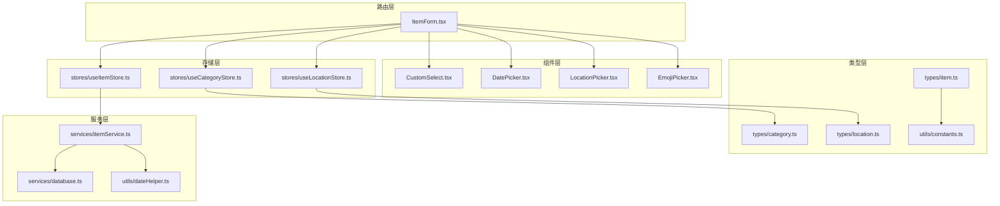
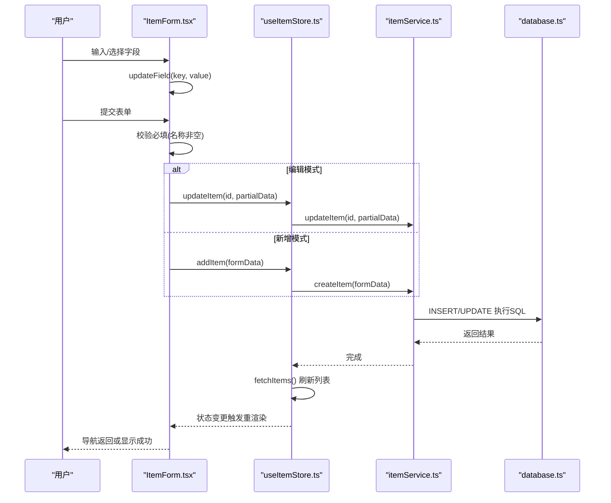
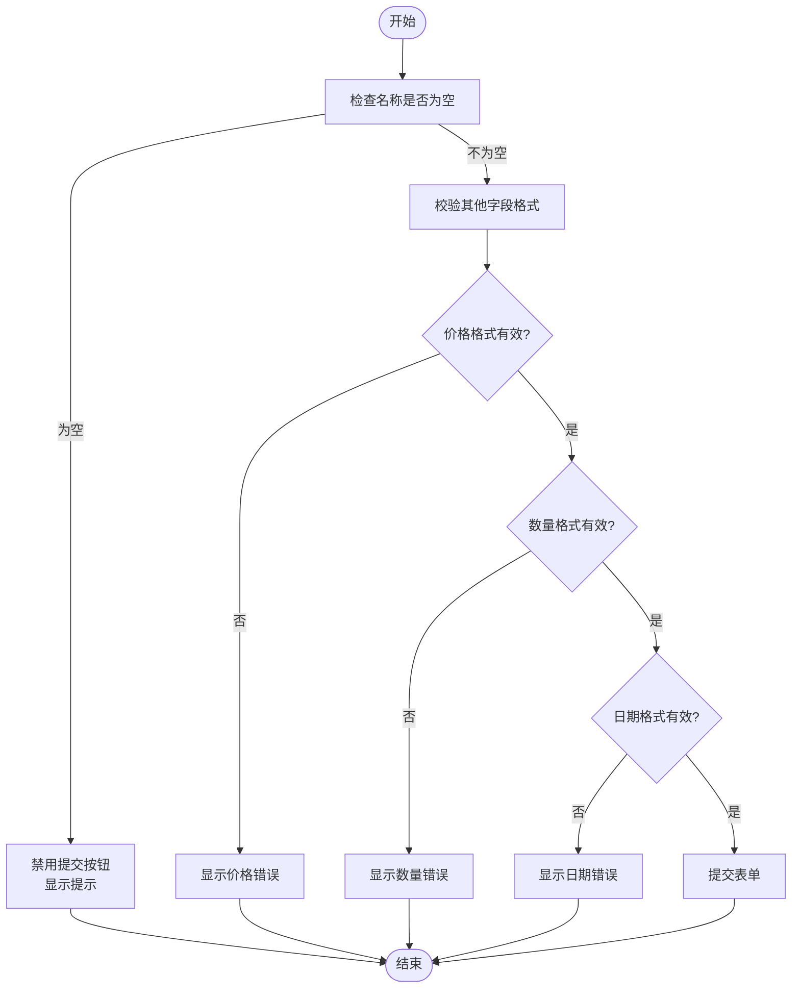
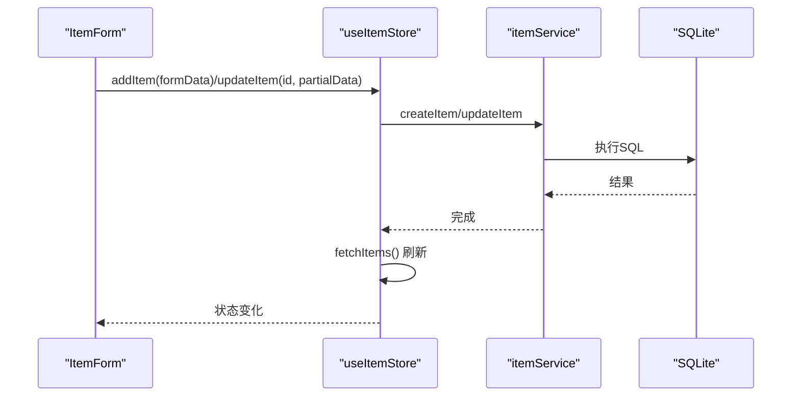
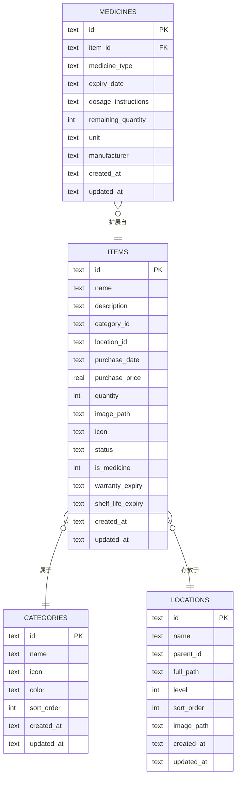
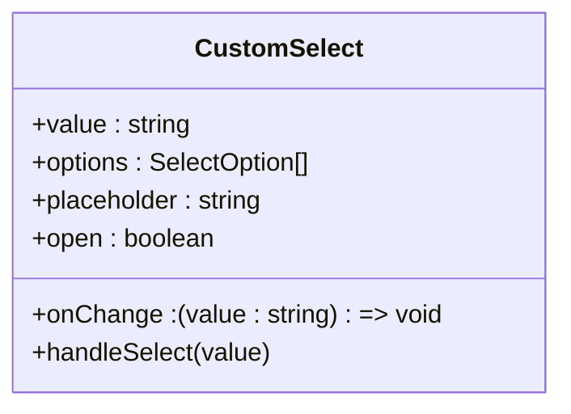
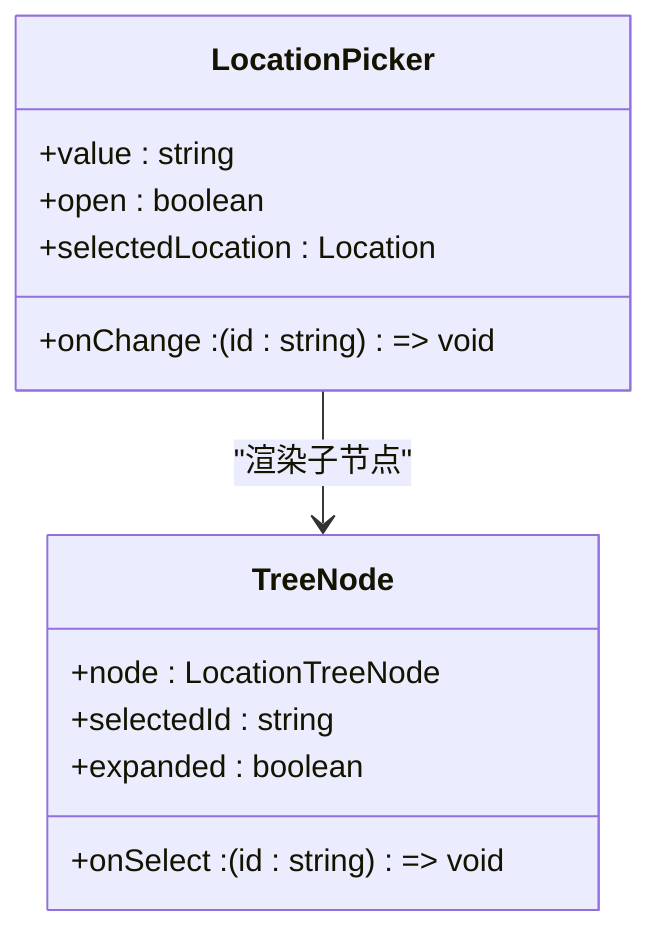
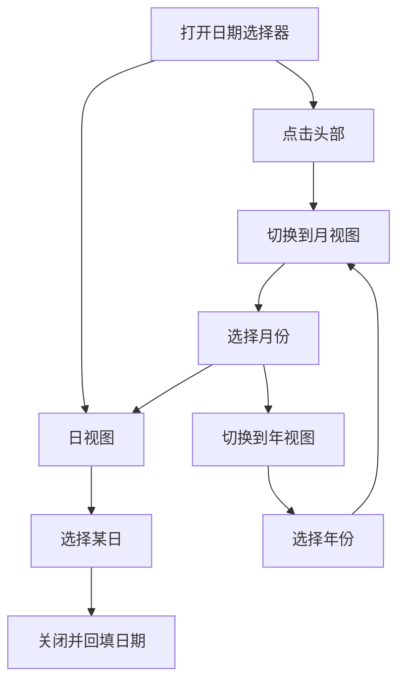
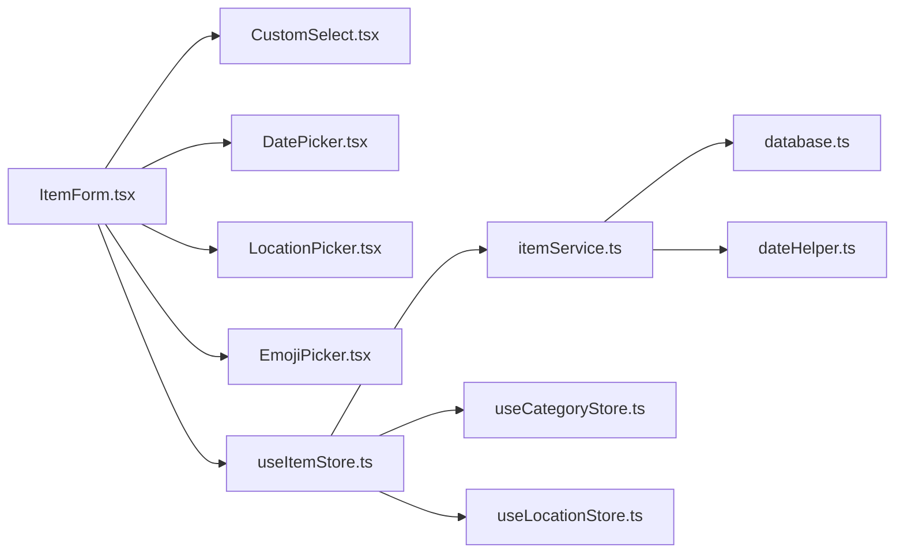

# 物品表单编辑

<cite>
**本文引用的文件**
- [src/routes/ItemForm.tsx](file://src/routes/ItemForm.tsx)
- [src/types/item.ts](file://src/types/item.ts)
- [src/services/itemService.ts](file://src/services/itemService.ts)
- [src/stores/useItemStore.ts](file://src/stores/useItemStore.ts)
- [src/components/shared/CustomSelect.tsx](file://src/components/shared/CustomSelect.tsx)
- [src/components/items/LocationPicker.tsx](file://src/components/items/LocationPicker.tsx)
- [src/components/shared/DatePicker.tsx](file://src/components/shared/DatePicker.tsx)
- [src/components/shared/EmojiPicker.tsx](file://src/components/shared/EmojiPicker.tsx)
- [src/services/database.ts](file://src/services/database.ts)
- [src/utils/dateHelper.ts](file://src/utils/dateHelper.ts)
- [src/stores/useCategoryStore.ts](file://src/stores/useCategoryStore.ts)
- [src/stores/useLocationStore.ts](file://src/stores/useLocationStore.ts)
- [src/types/category.ts](file://src/types/category.ts)
- [src/types/location.ts](file://src/types/location.ts)
- [src/utils/constants.ts](file://src/utils/constants.ts)
</cite>

## 目录
1. [简介](#简介)
2. [项目结构](#项目结构)
3. [核心组件](#核心组件)
4. [架构总览](#架构总览)
5. [详细组件分析](#详细组件分析)
6. [依赖关系分析](#依赖关系分析)
7. [性能考量](#性能考量)
8. [故障排查指南](#故障排查指南)
9. [结论](#结论)
10. [附录：完整表单示例与扩展指南](#附录完整表单示例与扩展指南)

## 简介
本文件围绕“物品表单编辑”功能进行系统化技术文档整理，覆盖表单设计与实现、字段验证与必填检查、数据格式校验、表单状态管理（草稿保存、实时验证、错误提示）、与数据库交互模式（新增/编辑/提交流程）、数据模型设计（基本信息、购买记录关联、状态字段）以及扩展实践（新增字段、自定义验证、复杂数据类型处理）。目标是帮助开发者快速理解并安全地扩展该功能。

## 项目结构
- 路由层：负责页面入口与参数解析，承载表单逻辑与状态。
- 组件层：包含通用表单控件（下拉选择、日期选择、位置选择、表情选择）。
- 类型层：统一定义物品与表单的数据结构与状态枚举。
- 服务层：封装数据库访问与业务操作（增删改查、迁移）。
- 存储层：集中管理列表过滤、加载状态与刷新策略。
- 工具层：提供日期格式化、常量配置等辅助能力。

图表来源
- [src/routes/ItemForm.tsx:1-263](file://src/routes/ItemForm.tsx#L1-L263)
- [src/components/shared/CustomSelect.tsx:1-109](file://src/components/shared/CustomSelect.tsx#L1-L109)
- [src/components/shared/DatePicker.tsx:1-278](file://src/components/shared/DatePicker.tsx#L1-L278)
- [src/components/items/LocationPicker.tsx:1-103](file://src/components/items/LocationPicker.tsx#L1-L103)
- [src/components/shared/EmojiPicker.tsx:1-44](file://src/components/shared/EmojiPicker.tsx#L1-L44)
- [src/stores/useItemStore.ts:1-53](file://src/stores/useItemStore.ts#L1-L53)
- [src/stores/useCategoryStore.ts:1-44](file://src/stores/useCategoryStore.ts#L1-L44)
- [src/stores/useLocationStore.ts:1-43](file://src/stores/useLocationStore.ts#L1-L43)
- [src/services/itemService.ts:1-127](file://src/services/itemService.ts#L1-L127)
- [src/services/database.ts:1-171](file://src/services/database.ts#L1-L171)
- [src/utils/dateHelper.ts:1-52](file://src/utils/dateHelper.ts#L1-L52)
- [src/types/item.ts:1-46](file://src/types/item.ts#L1-L46)
- [src/types/category.ts:1-18](file://src/types/category.ts#L1-L18)
- [src/types/location.ts:1-24](file://src/types/location.ts#L1-L24)
- [src/utils/constants.ts:1-40](file://src/utils/constants.ts#L1-L40)

章节来源
- [src/routes/ItemForm.tsx:1-263](file://src/routes/ItemForm.tsx#L1-L263)
- [src/services/itemService.ts:1-127](file://src/services/itemService.ts#L1-L127)
- [src/stores/useItemStore.ts:1-53](file://src/stores/useItemStore.ts#L1-L53)

## 核心组件
- 表单容器与状态
  - 默认表单数据结构、编辑态识别、提交流程、字段更新函数。
  - 关键路径参考：[默认表单与字段更新:13-85](file://src/routes/ItemForm.tsx#L13-L85)、[提交处理:67-81](file://src/routes/ItemForm.tsx#L67-L81)。
- 字段组件
  - 图标选择器：支持表情选择与清除。
  - 描述输入：多行文本。
  - 分类选择：基于自定义下拉组件与分类仓库。
  - 位置选择：树形层级选择器。
  - 日期选择：购买日期、保修期至、保质期至。
  - 数量与状态：数值输入与状态枚举选择。
  - 关键路径参考：[图标选择器:104-145](file://src/routes/ItemForm.tsx#L104-L145)、[分类选择:159-171](file://src/routes/ItemForm.tsx#L159-L171)、[位置选择:173-177](file://src/routes/ItemForm.tsx#L173-L177)、[日期与价格:179-221](file://src/routes/ItemForm.tsx#L179-L221)、[数量与状态:223-248](file://src/routes/ItemForm.tsx#L223-L248)。
- 数据模型
  - 物品实体与表单数据结构、状态枚举、扩展详情。
  - 关键路径参考：[物品类型定义:5-22](file://src/types/item.ts#L5-L22)、[表单类型定义:31-45](file://src/types/item.ts#L31-L45)。
- 服务与存储
  - 新增/更新/删除物品、查询详情；Zustand 状态管理与自动刷新。
  - 关键路径参考：[服务接口:60-126](file://src/services/itemService.ts#L60-L126)、[存储动作:23-52](file://src/stores/useItemStore.ts#L23-L52)。

章节来源
- [src/routes/ItemForm.tsx:13-85](file://src/routes/ItemForm.tsx#L13-L85)
- [src/routes/ItemForm.tsx:104-248](file://src/routes/ItemForm.tsx#L104-L248)
- [src/types/item.ts:5-45](file://src/types/item.ts#L5-L45)
- [src/services/itemService.ts:60-126](file://src/services/itemService.ts#L60-L126)
- [src/stores/useItemStore.ts:23-52](file://src/stores/useItemStore.ts#L23-L52)

## 架构总览
从用户交互到数据库持久化的端到端流程如下：

图表来源
- [src/routes/ItemForm.tsx:67-81](file://src/routes/ItemForm.tsx#L67-L81)
- [src/stores/useItemStore.ts:34-47](file://src/stores/useItemStore.ts#L34-L47)
- [src/services/itemService.ts:60-119](file://src/services/itemService.ts#L60-L119)
- [src/services/database.ts:8-16](file://src/services/database.ts#L8-L16)

## 详细组件分析

### 表单字段与验证规则
- 必填项检查
  - 名称字段为必填，提交前进行非空校验。
  - 关键路径参考：[必填校验:69-70](file://src/routes/ItemForm.tsx#L69-L70)。
- 实时验证与错误提示
  - 当前实现以“禁用提交按钮”作为基础约束（名称为空则禁用），未内置复杂前端校验逻辑。
  - 可扩展点：在字段变更时调用自定义校验函数，维护本地错误映射并在 UI 展示。
- 数据格式校验
  - 价格与数量使用数值输入，保留两位小数建议通过 UI 控制与后端入库统一处理。
  - 日期采用 YYYY-MM-DD 字符串格式，依赖日期组件选择器保证格式一致性。
  - 关键路径参考：[价格输入:190-199](file://src/routes/ItemForm.tsx#L190-L199)、[数量输入:224-234](file://src/routes/ItemForm.tsx#L224-L234)、[日期组件:17-278](file://src/components/shared/DatePicker.tsx#L17-L278)。

图表来源
- [src/routes/ItemForm.tsx:69-70](file://src/routes/ItemForm.tsx#L69-L70)
- [src/components/shared/DatePicker.tsx:17-278](file://src/components/shared/DatePicker.tsx#L17-L278)

章节来源
- [src/routes/ItemForm.tsx:69-70](file://src/routes/ItemForm.tsx#L69-L70)
- [src/components/shared/DatePicker.tsx:17-278](file://src/components/shared/DatePicker.tsx#L17-L278)

### 表单状态管理（草稿、实时验证、错误提示）
- 状态来源
  - 表单数据：useState 管理，字段更新通过泛型函数实现类型安全。
  - 加载状态：保存中状态控制提交按钮可用性。
  - 关键路径参考：[状态声明与更新:35-85](file://src/routes/ItemForm.tsx#L35-L85)。
- 草稿保存
  - 当前未实现自动草稿保存机制。可在字段变更时写入本地存储或临时缓存，并在页面加载时恢复。
- 实时验证
  - 可在 updateField 中集成校验器，将错误信息与字段绑定，UI 即时反馈。
- 错误提示
  - 建议引入统一错误映射与 Toast/Alert 组件，避免分散的提示逻辑。

章节来源
- [src/routes/ItemForm.tsx:35-85](file://src/routes/ItemForm.tsx#L35-L85)

### 表单与数据库交互模式
- 新增物品
  - 流程：表单收集数据 → store 调用 createItem → service 写入数据库 → 刷新列表。
  - 关键路径参考：[新增入口:72-76](file://src/routes/ItemForm.tsx#L72-L76)、[store 新增:34-37](file://src/stores/useItemStore.ts#L34-L37)、[service 新增:60-87](file://src/services/itemService.ts#L60-L87)。
- 编辑现有物品
  - 流程：进入编辑页加载详情 → 用户修改 → store 调用 updateItem → service 更新 → 刷新列表。
  - 关键路径参考：[编辑入口与加载:43-65](file://src/routes/ItemForm.tsx#L43-L65)、[store 更新:39-42](file://src/stores/useItemStore.ts#L39-L42)、[service 更新:89-119](file://src/services/itemService.ts#L89-L119)。
- 提交流程
  - 统一通过 store 触发，确保 UI 与数据一致，避免重复请求。
  - 关键路径参考：[提交处理:67-81](file://src/routes/ItemForm.tsx#L67-L81)。

图表来源
- [src/routes/ItemForm.tsx:67-81](file://src/routes/ItemForm.tsx#L67-L81)
- [src/stores/useItemStore.ts:34-47](file://src/stores/useItemStore.ts#L34-L47)
- [src/services/itemService.ts:60-119](file://src/services/itemService.ts#L60-L119)

章节来源
- [src/routes/ItemForm.tsx:43-81](file://src/routes/ItemForm.tsx#L43-L81)
- [src/stores/useItemStore.ts:34-47](file://src/stores/useItemStore.ts#L34-L47)
- [src/services/itemService.ts:60-119](file://src/services/itemService.ts#L60-L119)

### 数据模型设计
- 物品基本信息字段
  - 名称、描述、分类、位置、购买日期、购买价格、数量、图片路径、图标、状态、是否药品、保修期至、保质期至、创建/更新时间。
  - 关键路径参考：[物品实体:5-22](file://src/types/item.ts#L5-L22)、[表单实体:31-45](file://src/types/item.ts#L31-L45)。
- 状态字段定义
  - 状态枚举：active/archived/disposed，配合常量映射用于 UI 显示。
  - 关键路径参考：[状态枚举](file://src/types/item.ts#L3)、[状态标签映射:22-27](file://src/utils/constants.ts#L22-L27)。
- 购买记录关联
  - 当前物品表未直接存储“购买记录”明细；可通过扩展表（如 purchases）与 items 的外键关联实现。
  - 关键路径参考：[数据库迁移:88-103](file://src/services/database.ts#L88-L103)。
- 数据库表结构要点
  - items 主表包含基础字段与索引；medicines 为药品扩展表（与 items 1:1）。
  - 关键路径参考：[items 创建语句:88-103](file://src/services/database.ts#L88-L103)、[medicines 创建语句:104-117](file://src/services/database.ts#L104-L117)。

图表来源
- [src/services/database.ts:88-117](file://src/services/database.ts#L88-L117)
- [src/types/item.ts:5-22](file://src/types/item.ts#L5-L22)

章节来源
- [src/types/item.ts:5-22](file://src/types/item.ts#L5-L22)
- [src/services/database.ts:88-117](file://src/services/database.ts#L88-L117)

### 组件级实现要点

#### 自定义下拉选择器（CustomSelect）
- 功能：移动端弹窗式选择，支持占位符、选中态高亮、点击外部关闭。
- 关键路径参考：[组件实现:17-108](file://src/components/shared/CustomSelect.tsx#L17-L108)。

图表来源
- [src/components/shared/CustomSelect.tsx:17-108](file://src/components/shared/CustomSelect.tsx#L17-L108)

章节来源
- [src/components/shared/CustomSelect.tsx:17-108](file://src/components/shared/CustomSelect.tsx#L17-L108)

#### 位置选择器（LocationPicker）
- 功能：树形层级选择，支持展开/折叠、选中高亮、无位置时提示。
- 关键路径参考：[组件实现:11-102](file://src/components/items/LocationPicker.tsx#L11-L102)。

图表来源
- [src/components/items/LocationPicker.tsx:11-102](file://src/components/items/LocationPicker.tsx#L11-L102)

章节来源
- [src/components/items/LocationPicker.tsx:11-102](file://src/components/items/LocationPicker.tsx#L11-L102)

#### 日期选择器（DatePicker）
- 功能：年/月/日三级视图切换、今日快捷键、清除、外部点击关闭。
- 关键路径参考：[组件实现:17-278](file://src/components/shared/DatePicker.tsx#L17-L278)。

图表来源
- [src/components/shared/DatePicker.tsx:17-278](file://src/components/shared/DatePicker.tsx#L17-L278)

章节来源
- [src/components/shared/DatePicker.tsx:17-278](file://src/components/shared/DatePicker.tsx#L17-L278)

#### 表情选择器（EmojiPicker）
- 功能：提供常用物品相关表情供选择。
- 关键路径参考：[组件实现:28-43](file://src/components/shared/EmojiPicker.tsx#L28-L43)。

章节来源
- [src/components/shared/EmojiPicker.tsx:28-43](file://src/components/shared/EmojiPicker.tsx#L28-L43)

## 依赖关系分析
- 组件耦合
  - ItemForm 依赖多个通用组件与仓库，保持低耦合高内聚。
- 存储与服务
  - useItemStore 将 UI 与数据服务解耦，统一通过 store 触发 CRUD。
- 外部依赖
  - SQLite（Tauri 插件）提供本地持久化；dayjs 用于日期处理；lucide-react 提供图标。

图表来源
- [src/routes/ItemForm.tsx:1-263](file://src/routes/ItemForm.tsx#L1-L263)
- [src/stores/useItemStore.ts:1-53](file://src/stores/useItemStore.ts#L1-L53)
- [src/services/itemService.ts:1-127](file://src/services/itemService.ts#L1-L127)
- [src/services/database.ts:1-171](file://src/services/database.ts#L1-L171)
- [src/utils/dateHelper.ts:1-52](file://src/utils/dateHelper.ts#L1-L52)
- [src/stores/useCategoryStore.ts:1-44](file://src/stores/useCategoryStore.ts#L1-L44)
- [src/stores/useLocationStore.ts:1-43](file://src/stores/useLocationStore.ts#L1-L43)

章节来源
- [src/routes/ItemForm.tsx:1-263](file://src/routes/ItemForm.tsx#L1-L263)
- [src/stores/useItemStore.ts:1-53](file://src/stores/useItemStore.ts#L1-L53)
- [src/services/itemService.ts:1-127](file://src/services/itemService.ts#L1-L127)
- [src/services/database.ts:1-171](file://src/services/database.ts#L1-L171)
- [src/utils/dateHelper.ts:1-52](file://src/utils/dateHelper.ts#L1-L52)
- [src/stores/useCategoryStore.ts:1-44](file://src/stores/useCategoryStore.ts#L1-L44)
- [src/stores/useLocationStore.ts:1-43](file://src/stores/useLocationStore.ts#L1-L43)

## 性能考量
- 渲染优化
  - 使用细粒度状态更新（updateField 泛型）减少重渲染范围。
  - 对大列表（分类/位置）采用虚拟滚动或分页策略。
- 请求优化
  - store 在每次 CRUD 后统一 fetchItems，避免重复请求；可考虑增量更新或去抖。
- 数据库
  - items 表已建立索引（category/location/status），有助于筛选与排序。
- 日期处理
  - 使用 dayjs 统一格式化与计算，避免字符串比较带来的性能问题。

## 故障排查指南
- 提交按钮不可用
  - 检查名称字段是否为空；确认必填校验逻辑生效。
  - 关键路径参考：[必填校验:69-70](file://src/routes/ItemForm.tsx#L69-L70)。
- 无法加载分类/位置
  - 确认仓库初始化与数据拉取顺序；检查网络/数据库连接。
  - 关键路径参考：[分类仓库:18-22](file://src/stores/useCategoryStore.ts#L18-L22)、[位置仓库:20-25](file://src/stores/useLocationStore.ts#L20-L25)。
- 更新后列表未刷新
  - 确认 store 的 fetchItems 是否被调用；检查服务层返回值。
  - 关键路径参考：[store 更新:39-42](file://src/stores/useItemStore.ts#L39-L42)。
- 日期格式异常
  - 确认 DatePicker 输出为 YYYY-MM-DD；后端入库前统一转换。
  - 关键路径参考：[日期组件:17-278](file://src/components/shared/DatePicker.tsx#L17-L278)、[日期工具:4-7](file://src/utils/dateHelper.ts#L4-L7)。

章节来源
- [src/routes/ItemForm.tsx:69-70](file://src/routes/ItemForm.tsx#L69-L70)
- [src/stores/useCategoryStore.ts:18-22](file://src/stores/useCategoryStore.ts#L18-L22)
- [src/stores/useLocationStore.ts:20-25](file://src/stores/useLocationStore.ts#L20-L25)
- [src/stores/useItemStore.ts:39-42](file://src/stores/useItemStore.ts#L39-L42)
- [src/components/shared/DatePicker.tsx:17-278](file://src/components/shared/DatePicker.tsx#L17-L278)
- [src/utils/dateHelper.ts:4-7](file://src/utils/dateHelper.ts#L4-L7)

## 结论
物品表单编辑功能以清晰的分层架构实现，具备良好的可扩展性。当前实现聚焦基础字段与必要校验，后续可在以下方面增强：引入更完善的前端校验与错误提示、实现草稿保存与离线支持、扩展购买记录关联与复杂数据类型处理。整体代码结构利于团队协作与长期演进。

## 附录：完整表单示例与扩展指南

### 示例：新增一个“序列号”字段
- 步骤
  1) 在表单中添加输入框并绑定到表单状态。
     - 参考路径：[字段声明与更新:35-85](file://src/routes/ItemForm.tsx#L35-L85)。
  2) 在类型定义中增加对应字段。
     - 参考路径：[表单类型定义:31-45](file://src/types/item.ts#L31-L45)。
  3) 在服务层 createItem/updateItem 中加入序列号字段的插入/更新逻辑。
     - 参考路径：[新增物品:60-87](file://src/services/itemService.ts#L60-L87)、[更新物品:89-119](file://src/services/itemService.ts#L89-L119)。
  4) 如需持久化，扩展数据库迁移脚本。
     - 参考路径：[数据库迁移:160-171](file://src/services/database.ts#L160-L171)。

章节来源
- [src/routes/ItemForm.tsx:35-85](file://src/routes/ItemForm.tsx#L35-L85)
- [src/types/item.ts:31-45](file://src/types/item.ts#L31-L45)
- [src/services/itemService.ts:60-119](file://src/services/itemService.ts#L60-L119)
- [src/services/database.ts:160-171](file://src/services/database.ts#L160-L171)

### 示例：自定义验证规则（如价格必须大于等于 0）
- 步骤
  1) 在 updateField 回调中加入校验逻辑，维护错误映射。
  2) 在提交前遍历错误映射，阻止无效提交。
  3) 在 UI 上展示错误文案与样式提示。
- 参考路径：[字段更新与提交:83-85](file://src/routes/ItemForm.tsx#L83-L85)、[提交处理:67-81](file://src/routes/ItemForm.tsx#L67-L81)。

章节来源
- [src/routes/ItemForm.tsx:83-85](file://src/routes/ItemForm.tsx#L83-L85)
- [src/routes/ItemForm.tsx:67-81](file://src/routes/ItemForm.tsx#L67-L81)

### 示例：处理复杂数据类型（如数组/对象）
- 步骤
  1) 在表单中使用 JSON 文本域或专用控件（如标签输入、多选）。
  2) 在类型定义中使用联合类型或接口描述。
  3) 在服务层入库前进行序列化，在读取后反序列化。
- 参考路径：[类型定义扩展:31-45](file://src/types/item.ts#L31-L45)、[服务层序列化/反序列化:60-119](file://src/services/itemService.ts#L60-L119)。

章节来源
- [src/types/item.ts:31-45](file://src/types/item.ts#L31-L45)
- [src/services/itemService.ts:60-119](file://src/services/itemService.ts#L60-L119)