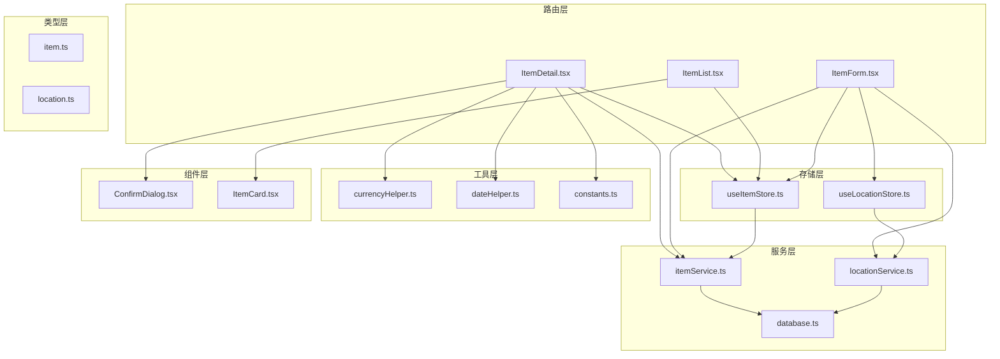
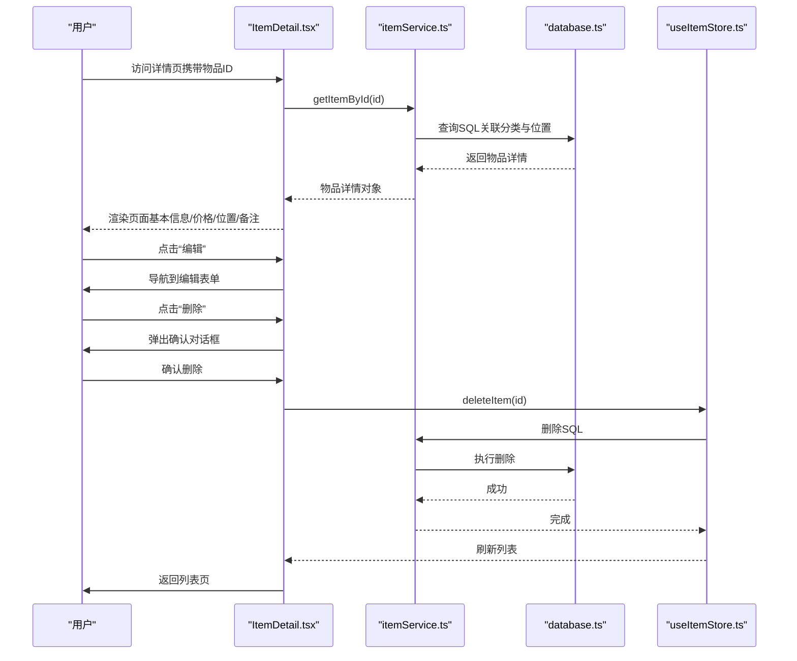
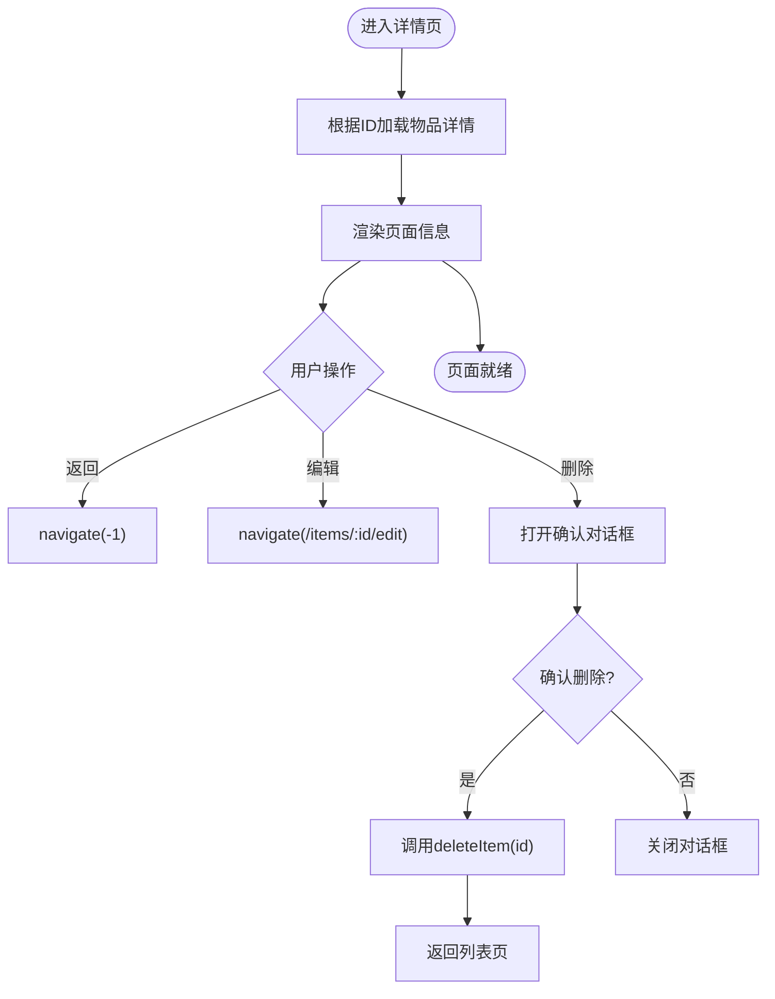
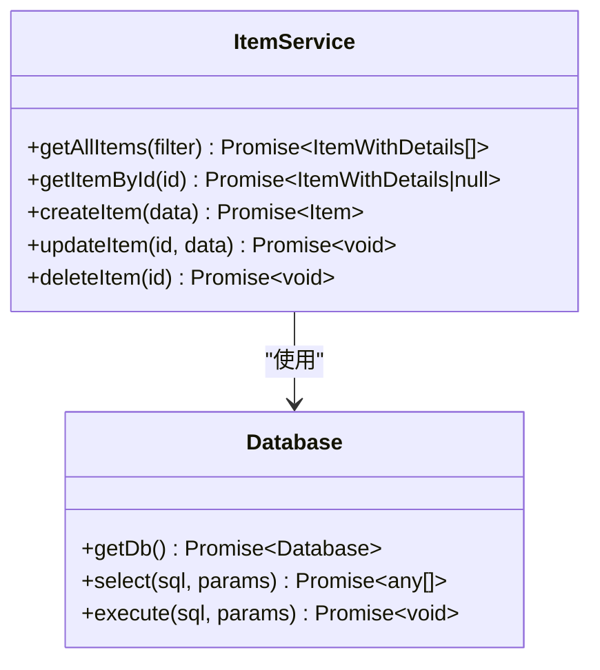
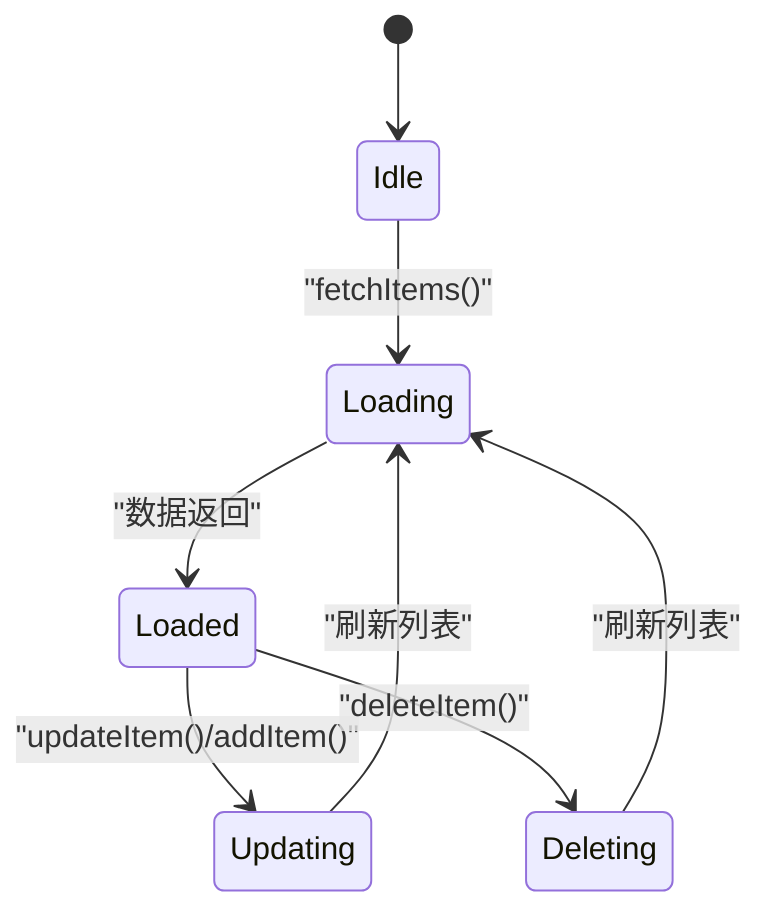
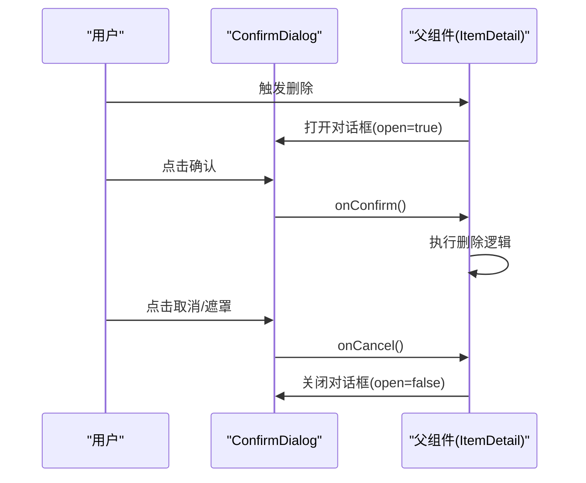
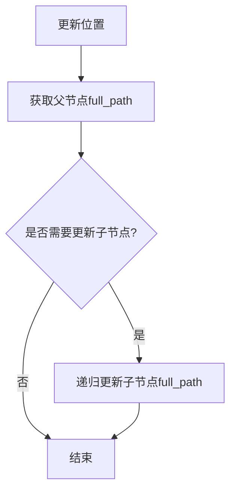
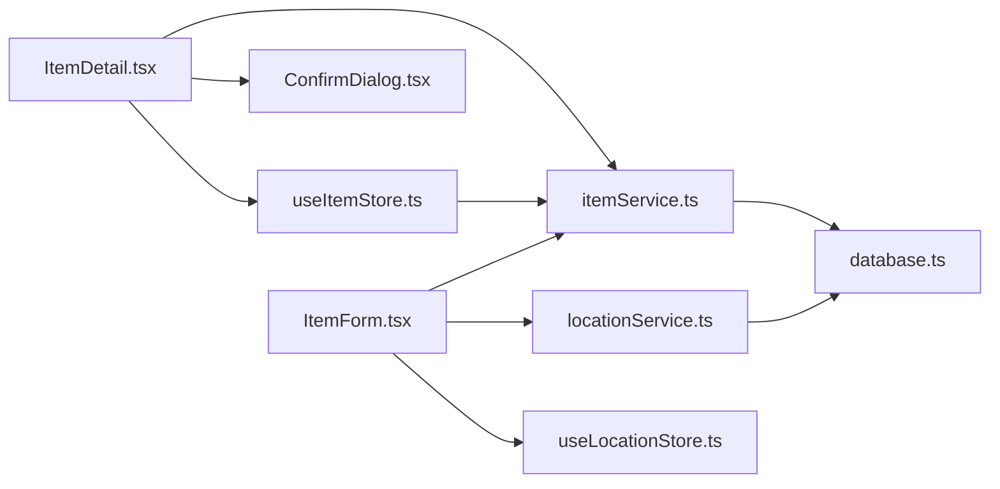

# 物品详情查看

<cite>
**本文引用的文件**
- [ItemDetail.tsx](file://src/routes/ItemDetail.tsx)
- [itemService.ts](file://src/services/itemService.ts)
- [useItemStore.ts](file://src/stores/useItemStore.ts)
- [constants.ts](file://src/utils/constants.ts)
- [currencyHelper.ts](file://src/utils/currencyHelper.ts)
- [dateHelper.ts](file://src/utils/dateHelper.ts)
- [ConfirmDialog.tsx](file://src/components/shared/ConfirmDialog.tsx)
- [ItemList.tsx](file://src/routes/ItemList.tsx)
- [ItemCard.tsx](file://src/components/items/ItemCard.tsx)
- [ItemForm.tsx](file://src/routes/ItemForm.tsx)
- [locationService.ts](file://src/services/locationService.ts)
- [useLocationStore.ts](file://src/stores/useLocationStore.ts)
- [database.ts](file://src/services/database.ts)
- [item.ts](file://src/types/item.ts)
- [location.ts](file://src/types/location.ts)
</cite>

## 目录
1. [简介](#简介)
2. [项目结构](#项目结构)
3. [核心组件](#核心组件)
4. [架构总览](#架构总览)
5. [组件详细分析](#组件详细分析)
6. [依赖关系分析](#依赖关系分析)
7. [性能考虑](#性能考虑)
8. [故障排查指南](#故障排查指南)
9. [结论](#结论)
10. [附录：使用示例与扩展建议](#附录使用示例与扩展建议)

## 简介
本章节面向“物品详情查看”功能，系统性阐述详情页的布局设计、信息展示结构、交互逻辑、数据加载与缓存策略、移动端适配与触摸交互优化，并提供可扩展的实践建议。读者无需深入源码即可理解该功能的设计思路与实现要点。

## 项目结构
围绕“物品详情查看”的关键文件分布如下：
- 路由层：负责页面入口与参数解析，承载页面生命周期与交互事件。
- 服务层：封装数据库访问与业务操作，提供统一的数据读写接口。
- 存储层：集中管理应用状态（列表、过滤条件等），为详情页提供联动能力。
- 工具层：格式化货币、日期、计算日均成本等辅助函数。
- 组件层：通用确认对话框、位置选择器、时间选择器等复用组件。
- 类型层：定义物品、位置等数据模型，确保类型安全。

图表来源
- [ItemDetail.tsx:1-168](file://src/routes/ItemDetail.tsx#L1-L168)
- [itemService.ts:1-127](file://src/services/itemService.ts#L1-L127)
- [useItemStore.ts:1-53](file://src/stores/useItemStore.ts#L1-L53)
- [currencyHelper.ts:1-17](file://src/utils/currencyHelper.ts#L1-L17)
- [dateHelper.ts:1-52](file://src/utils/dateHelper.ts#L1-L52)
- [constants.ts:1-40](file://src/utils/constants.ts#L1-L40)
- [ConfirmDialog.tsx:1-52](file://src/components/shared/ConfirmDialog.tsx#L1-L52)
- [ItemList.tsx:1-185](file://src/routes/ItemList.tsx#L1-L185)
- [ItemCard.tsx:1-94](file://src/components/items/ItemCard.tsx#L1-L94)
- [ItemForm.tsx:1-263](file://src/routes/ItemForm.tsx#L1-L263)
- [locationService.ts:1-143](file://src/services/locationService.ts#L1-L143)
- [useLocationStore.ts:1-43](file://src/stores/useLocationStore.ts#L1-L43)
- [database.ts:1-171](file://src/services/database.ts#L1-L171)
- [item.ts:1-46](file://src/types/item.ts#L1-L46)
- [location.ts:1-24](file://src/types/location.ts#L1-L24)

章节来源
- [ItemDetail.tsx:1-168](file://src/routes/ItemDetail.tsx#L1-L168)
- [ItemList.tsx:1-185](file://src/routes/ItemList.tsx#L1-L185)
- [ItemForm.tsx:1-263](file://src/routes/ItemForm.tsx#L1-L263)

## 核心组件
- 物品详情页：负责渲染物品基本信息、价格与日均成本、分类与位置、购买日期、数量、备注等；提供返回、编辑、删除入口；支持删除确认对话框。
- 数据服务：封装物品查询、创建、更新、删除；支持按条件筛选与排序。
- 应用状态：集中管理物品列表、过滤条件、加载状态；提供刷新与联动能力。
- 工具函数：货币格式化、日均成本计算、日期格式化与天数计算。
- 通用组件：确认对话框用于删除等危险操作的二次确认。
- 位置服务：维护位置树形结构，支持全路径展示与层级变更。

章节来源
- [ItemDetail.tsx:13-168](file://src/routes/ItemDetail.tsx#L13-L168)
- [itemService.ts:46-58](file://src/services/itemService.ts#L46-L58)
- [useItemStore.ts:23-52](file://src/stores/useItemStore.ts#L23-L52)
- [currencyHelper.ts:9-16](file://src/utils/currencyHelper.ts#L9-L16)
- [dateHelper.ts:4-28](file://src/utils/dateHelper.ts#L4-L28)
- [ConfirmDialog.tsx:14-51](file://src/components/shared/ConfirmDialog.tsx#L14-L51)
- [locationService.ts:14-18](file://src/services/locationService.ts#L14-L18)

## 架构总览
详情页采用“路由组件 + 服务层 + 存储层 + 工具层”的分层架构：
- 路由组件负责页面渲染与用户交互；
- 服务层封装数据库访问与业务逻辑；
- 存储层提供全局状态与联动刷新；
- 工具层提供格式化与计算能力；
- 通用组件提升复用性与一致性。

图表来源
- [ItemDetail.tsx:14-30](file://src/routes/ItemDetail.tsx#L14-L30)
- [itemService.ts:121-126](file://src/services/itemService.ts#L121-L126)
- [useItemStore.ts:44-47](file://src/stores/useItemStore.ts#L44-L47)
- [database.ts:8-16](file://src/services/database.ts#L8-L16)

## 组件详细分析

### 物品详情页（ItemDetail）
- 页面布局与信息展示
  - 顶部导航栏包含返回与操作按钮（编辑、删除）。
  - 物品图标区域展示自定义图标或默认占位符。
  - 名称与状态标签展示，状态通过颜色与文案区分。
  - 总价与日均成本展示，日均成本基于购买日期与当前日期计算。
  - 信息卡片区展示分类、位置、购买日期、数量、备注等。
- 交互逻辑
  - 返回：使用浏览器历史记录返回。
  - 编辑：导航到编辑表单。
  - 删除：弹出确认对话框，确认后调用存储层删除方法并返回列表。
- 数据加载与计算
  - 通过服务层按ID查询物品详情，自动关联分类名、图标、颜色与位置全路径。
  - 有效日期优先级：购买日期 > 创建日期 > 当前日期；日均成本在有效天数非负时计算。
- 移动端适配
  - 使用响应式容器与安全区域适配，保证在刘海屏/圆角屏下的显示正确。
  - 操作按钮尺寸与间距适合触控。

图表来源
- [ItemDetail.tsx:14-30](file://src/routes/ItemDetail.tsx#L14-L30)
- [ItemDetail.tsx:47-167](file://src/routes/ItemDetail.tsx#L47-L167)

章节来源
- [ItemDetail.tsx:13-168](file://src/routes/ItemDetail.tsx#L13-L168)
- [item.ts:24-29](file://src/types/item.ts#L24-L29)
- [constants.ts:22-27](file://src/utils/constants.ts#L22-L27)
- [currencyHelper.ts:13-16](file://src/utils/currencyHelper.ts#L13-L16)
- [dateHelper.ts:26-28](file://src/utils/dateHelper.ts#L26-L28)

### 数据服务（itemService）
- 功能职责
  - 获取所有物品（支持分类、位置、状态、搜索过滤）。
  - 按ID获取物品详情（自动关联分类与位置信息）。
  - 新增、更新、删除物品。
- 关键点
  - 查询使用LEFT JOIN关联分类与位置，确保即使关联缺失也能返回主表数据。
  - 过滤参数动态拼接，避免注入风险。
  - 删除操作对药品类物品采用级联删除策略。

图表来源
- [itemService.ts:10-58](file://src/services/itemService.ts#L10-L58)
- [database.ts:8-16](file://src/services/database.ts#L8-L16)

章节来源
- [itemService.ts:10-127](file://src/services/itemService.ts#L10-L127)
- [database.ts:18-53](file://src/services/database.ts#L18-L53)

### 应用状态（useItemStore）
- 功能职责
  - 维护物品列表、过滤条件与加载状态。
  - 提供获取列表、新增、更新、删除与设置过滤的方法。
- 关键点
  - 删除后自动刷新列表，保持UI与数据一致。
  - 过滤条件支持分类、位置、状态、搜索关键词。

图表来源
- [useItemStore.ts:23-52](file://src/stores/useItemStore.ts#L23-L52)

章节来源
- [useItemStore.ts:12-52](file://src/stores/useItemStore.ts#L12-L52)

### 通用组件（ConfirmDialog）
- 功能职责
  - 提供模态确认对话框，支持危险操作的二次确认。
- 关键点
  - 支持自定义标题、消息、确认/取消文案与危险样式。
  - 点击遮罩层可取消，提升交互可用性。

图表来源
- [ConfirmDialog.tsx:14-51](file://src/components/shared/ConfirmDialog.tsx#L14-L51)
- [ItemDetail.tsx:156-164](file://src/routes/ItemDetail.tsx#L156-L164)

章节来源
- [ConfirmDialog.tsx:1-52](file://src/components/shared/ConfirmDialog.tsx#L1-L52)
- [ItemDetail.tsx:156-164](file://src/routes/ItemDetail.tsx#L156-L164)

### 位置服务与树形结构
- 功能职责
  - 获取位置列表、按ID获取位置、创建/更新/删除位置。
  - 维护位置树形结构，支持全路径构建与层级变更传播。
- 关键点
  - 更新位置时递归更新子节点的full_path，保证路径一致性。
  - 删除位置时级联处理后代节点，避免孤立数据。

图表来源
- [locationService.ts:55-92](file://src/services/locationService.ts#L55-L92)

章节来源
- [locationService.ts:9-143](file://src/services/locationService.ts#L9-L143)
- [useLocationStore.ts:20-41](file://src/stores/useLocationStore.ts#L20-L41)
- [location.ts:3-23](file://src/types/location.ts#L3-L23)

## 依赖关系分析
- 路由组件依赖服务层与存储层，以获取数据与触发状态变更。
- 服务层依赖数据库层，负责SQL执行与迁移管理。
- 工具层被多个组件与服务调用，提供格式化与计算能力。
- 通用组件被路由组件复用，降低重复开发成本。

图表来源
- [ItemDetail.tsx:1-168](file://src/routes/ItemDetail.tsx#L1-L168)
- [itemService.ts:1-127](file://src/services/itemService.ts#L1-L127)
- [useItemStore.ts:1-53](file://src/stores/useItemStore.ts#L1-L53)
- [ConfirmDialog.tsx:1-52](file://src/components/shared/ConfirmDialog.tsx#L1-L52)
- [ItemForm.tsx:1-263](file://src/routes/ItemForm.tsx#L1-L263)
- [locationService.ts:1-143](file://src/services/locationService.ts#L1-L143)
- [useLocationStore.ts:1-43](file://src/stores/useLocationStore.ts#L1-L43)
- [database.ts:1-171](file://src/services/database.ts#L1-L171)

章节来源
- [ItemDetail.tsx:1-168](file://src/routes/ItemDetail.tsx#L1-L168)
- [ItemForm.tsx:1-263](file://src/routes/ItemForm.tsx#L1-L263)
- [database.ts:1-171](file://src/services/database.ts#L1-L171)

## 性能考虑
- 懒加载与首屏优化
  - 详情页在首次渲染时仅进行一次按ID查询，避免不必要的批量请求。
  - 使用响应式容器与最小化重排，减少布局抖动。
- 计算优化
  - 日均成本计算仅在有效天数非负时进行，避免无效计算。
  - 金额格式化与日期格式化使用高效工具函数，避免重复计算。
- 状态与缓存
  - 存储层在删除后自动刷新列表，确保UI与数据一致，减少手动缓存管理。
- 数据库层面
  - 建立索引以加速按分类、位置、状态、创建时间的查询。
  - 迁移脚本确保表结构与字段演进的稳定性。

章节来源
- [ItemDetail.tsx:40-46](file://src/routes/ItemDetail.tsx#L40-L46)
- [currencyHelper.ts:13-16](file://src/utils/currencyHelper.ts#L13-L16)
- [dateHelper.ts:26-28](file://src/utils/dateHelper.ts#L26-L28)
- [database.ts:124-131](file://src/services/database.ts#L124-L131)

## 故障排查指南
- 无法加载详情
  - 检查URL中的ID是否有效；确认服务层按ID查询逻辑正常。
  - 查看数据库连接与迁移是否成功。
- 删除后未刷新
  - 确认存储层删除方法已调用并触发刷新。
  - 检查路由跳转逻辑是否正确。
- 位置显示异常
  - 检查位置树构建与full_path更新逻辑是否正确。
  - 确认父节点变更时子节点路径是否同步更新。
- 金额/日期格式异常
  - 检查工具函数的入参与默认值处理。
  - 确认国际化与货币符号配置。

章节来源
- [ItemDetail.tsx:25-30](file://src/routes/ItemDetail.tsx#L25-L30)
- [useItemStore.ts:44-47](file://src/stores/useItemStore.ts#L44-L47)
- [locationService.ts:79-92](file://src/services/locationService.ts#L79-L92)
- [database.ts:8-16](file://src/services/database.ts#L8-L16)

## 结论
物品详情查看功能通过清晰的分层架构实现了高内聚、低耦合的设计：路由组件专注页面体验，服务层封装数据访问，存储层保障状态一致性，工具层提供通用能力。配合确认对话框与位置树形结构，整体交互自然、数据准确、易于扩展。

## 附录：使用示例与扩展建议
- 展示购买记录详情
  - 在详情页增加“购买记录”卡片，展示最近N次购买的价格与数量变化。
  - 可结合图表组件展示价格趋势。
- 状态历史追踪
  - 新增“状态历史”卡片，展示状态变更的时间线与原因（备注）。
  - 使用时间轴组件提升可读性。
- 位置信息显示
  - 将位置全路径拆分为层级，点击层级可跳转到对应位置详情。
  - 支持长按复制完整路径或一键导航。
- 交互逻辑扩展
  - 状态切换：在详情页直接提供状态切换按钮，调用更新接口并刷新。
  - 编辑入口：在详情页顶部提供“编辑”按钮，跳转到编辑表单。
  - 删除确认：复用确认对话框，支持自定义文案与危险样式。
- 数据加载与缓存策略
  - 首次进入详情页时进行按ID查询；后续在同一会话内可利用内存缓存减少请求。
  - 对于频繁访问的物品，可在存储层增加本地缓存与失效策略。
- 错误处理机制
  - 在查询失败时显示空状态或错误提示，并提供重试按钮。
  - 删除失败时回滚UI状态并提示用户。
- 移动端适配与触摸交互优化
  - 使用合适的触摸目标尺寸与间距，确保单手可达。
  - 支持滑动返回（若框架支持），提升返回效率。
  - 在横屏或大屏设备上调整卡片布局与字体大小，保证阅读体验。

章节来源
- [ItemDetail.tsx:47-167](file://src/routes/ItemDetail.tsx#L47-L167)
- [ItemList.tsx:172-181](file://src/routes/ItemList.tsx#L172-L181)
- [ItemCard.tsx:27-93](file://src/components/items/ItemCard.tsx#L27-L93)
- [ItemForm.tsx:67-81](file://src/routes/ItemForm.tsx#L67-L81)
- [ConfirmDialog.tsx:14-51](file://src/components/shared/ConfirmDialog.tsx#L14-L51)